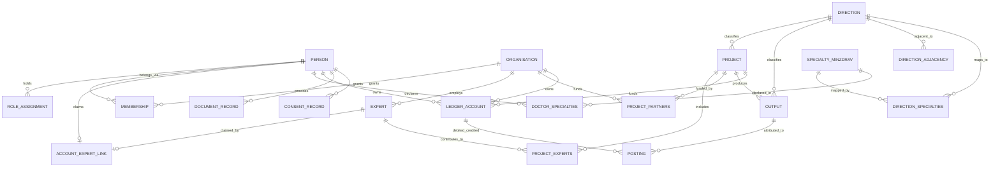

> **EN (this)** · **RU:** [`0016-core-domain-model-design-ru.md`](./0016-core-domain-model-design-ru.md)

# DS Platform — Core domain model design (companion to ADR-0016)

**Date:** 2026-08-22
**Status:** Accepted (companion to [ADR-0016](./0016-core-domain-model-en.md))
**Scope:** entity/relationship model at the level of names and kinds. **Not** Drizzle code, **not** migrations, **not** Zod schemas — those follow in the feature slices that implement the model.

---

## 0. TL;DR

One account per person; roles and organisation memberships are separate, revocable, context-scoped relations. The expert is an entity without an account, linked to one by an audited state machine. The project is the single container; schools, courses, lessons, podcasts and events are its outputs. Two linked reference books — the closed Minzdrav specialty list and the open directions book (the extended feature-012 `topics`). Points and money are one append-only ledger of accounts and postings. Documents and consents live under the ADR-0009 PD lifecycle. Every entity declares which storefront owns it.

## 1. Scope and non-goals

**In scope.** The entities and relationships of the core model, their fields at name-and-kind level, the storefront-ownership assignment, and the mapping of the existing schema onto them.

**Out of scope.** Column types, indexes and constraints (the implementing slice decides them per ADR-0003); the accrual-rule engine (REQ-36/48/49, two-way doors); payment integration (CON-16); the GetCourse/congress migration (REQ-105); UI and API surface; deployment topology (ADR-0015).

**Two one-way doors are routed, not modelled here.** **OWD-5** — the Academy is a separate public domain with its own audience but part of one Doctor.School ecosystem, with no monetisation of its own — is a positioning/topology door owned by ADR-0015; its only trace in this design is the storefront-ownership table of §4. **OWD-7** — the exit from GetCourse, with no integration with GetCourse now or ever — constrains the REQ-105 migration named in §5 (a one-off import, never a sync), not the entity model.

---

## 2. Entities

Field lists are **indicative names and kinds**, not a schema. Every entity additionally carries the standard retained-row lifecycle fields of ADR-0003 / feature 012 (`created_at`, `updated_at`, `deleted_at`, `version`, and `status` / `first_published_at` where the entity is publishable) unless stated otherwise.

### 2.1 Person (account) — existing `users`

| Field                                                                             | Kind         | Note                                      |
| --------------------------------------------------------------------------------- | ------------ | ----------------------------------------- |
| `id`                                                                              | uuid         | existing                                  |
| `zitadel_sub`                                                                     | text, unique | one IdP subject (ADR-0001 §6)             |
| `email` / `phone` / `email_verified` / `phone_verified` / `display_name`          | text / bool  | existing                                  |
| `deactivated_at`                                                                  | timestamptz  | existing, ADR-0009 lifecycle              |
| `role`                                                                            | text         | **retired** → role assignment             |
| profile attributes (full name parts, city/location, place of work, avatar, about) | text         | doctor profile (OWD-2 scope)              |
| `verification_state`                                                              | enum         | unverified / verified / rejected (REQ-22) |

One row per human being, on both storefronts (OWD-1). Contacts (`email`, `phone`) are never part of an investor-facing projection (OWD-2). The primary specialty is **not** a column on `users` — it is the link table below.

#### Person ↔ Minzdrav specialty — `doctor_specialties`

| Field                                   | Kind      | Note                                                                    |
| --------------------------------------- | --------- | ----------------------------------------------------------------------- |
| `id`                                    | uuid      |                                                                         |
| `doctor_id`                             | fk → §2.1 | `users`, `restrict`                                                     |
| `specialty_id`                          | fk → §2.7 | `specialties_minzdrav`, `restrict` (REQ-101)                            |
| `role`                                  | enum      | `doctor_specialty_role` — `primary` today, the axis extra roles land on |
| `record_status` / `deleted_at`          | enum / ts | retained-row lifecycle; a CHECK enforces `retired ⇔ deleted_at is set`  |
| `version` / `created_at` / `updated_at` | int / ts  | standard lifecycle fields                                               |

A doctor holds **at most one active primary specialty** — enforced in the database by a partial unique index on `doctor_id` restricted to active `primary` rows, not by application logic. Re-choosing a specialty is retire-then-insert inside one transaction, so the previous choice is retained rather than overwritten: the history of what a doctor declared, and when, survives every change. Modelling the link as its own table (rather than a `primary_specialty_id` column) is what makes both properties possible, and leaves room for the non-primary roles the `role` enum anticipates.

### 2.2 Role assignment

| Field                                      | Kind        | Note                                                                                                                                                                   |
| ------------------------------------------ | ----------- | ---------------------------------------------------------------------------------------------------------------------------------------------------------------------- |
| `id`                                       | uuid        |                                                                                                                                                                        |
| `person_id`                                | fk → §2.1   |                                                                                                                                                                        |
| `role`                                     | enum        | doctor · expert · author · co-author · academy admin · verifier · finance · methodologist · producer · НМО operator · investor representative · medical representative |
| `scope_kind` / `scope_id`                  | enum / uuid | `global` · `organisation` (§2.3) · `project` (§2.5)                                                                                                                    |
| `valid_from` / `valid_to`                  | timestamptz | open-ended `valid_to` = currently held                                                                                                                                 |
| `granted_by` / `revoked_by` / `revoked_at` | fk / ts     | every grant and revocation also lands in `audit_ledger`                                                                                                                |

Labels that are **not** roles — ambassador, speaker, moderator, organising-committee member, mentor, "regular participant", "team" (glossary) — are attributes on the relevant entity, not role assignments.

### 2.3 Organisation

| Field                                                  | Kind        | Note                                                                                                                                                                                |
| ------------------------------------------------------ | ----------- | ----------------------------------------------------------------------------------------------------------------------------------------------------------------------------------- |
| `id` / `slug` / `title`                                | uuid / text | seeded from feature-012 `partners`                                                                                                                                                  |
| `kinds`                                                | enum set    | **open, extensible set** (Q-40) — starting kinds: investor · clinical base · licensee / educational organisation. "Employer" is deliberately absent: not a product role (Q-38 → NG) |
| `logo_ref` / `website_url` / `description`             | text        | `logo_ref` existing                                                                                                                                                                 |
| legal attributes (legal name, INN, contract reference) | text        | contracts themselves stay off-platform (OWD-3 / CON-16)                                                                                                                             |

One organisation may hold several kinds at once (Q-40, V-RV-10) — the clinic that is also the licensee is one row with two kinds, not two rows. The set is expected to grow: adding a kind is a value, never a new table.

### 2.4 Membership (person ↔ organisation)

| Field                                                   | Kind      | Note                                                                                                                                                                                                                                         |
| ------------------------------------------------------- | --------- | -------------------------------------------------------------------------------------------------------------------------------------------------------------------------------------------------------------------------------------------- |
| `id` / `person_id` / `organisation_id`                  | uuid / fk |                                                                                                                                                                                                                                              |
| `role_in_organisation`                                  | enum      | admin · investor representative · medical representative · finance; the medical representative acts as a user OF the organisation and carries a personal link / promo code, so their invitations are attributed to them personally (REQ-114) |
| `valid_from` / `valid_to` / `revoked_at` / `revoked_by` | ts / fk   | revocation removes access, never the account (OWD-8)                                                                                                                                                                                         |

A person holds **at most one active membership** at a time (Q-33): a second active membership is either refused, or — if the wireframes require the softer mode — allowed with an explicit warning to the person and to both organisation admins; the choice between the two modes is wireframe detail, not a model change. Access to doctor personalia is evaluated as _(membership is active) AND (the object is sponsored by that organisation) AND (the doctor consented for that purpose)_ — the predicate is scoped to the specific sponsored object, never to a whole project (Q-32, OWD-2 + REQ-34).

### 2.5 Project — existing `projects`

| Field                                                      | Kind        | Note                                          |
| ---------------------------------------------------------- | ----------- | --------------------------------------------- |
| `id` / `slug` / `title` / `description` / `cover_ref`      | uuid / text | existing (feature 012)                        |
| `kind`                                                     | enum        | existing `project_kind`                       |
| `direction_id`                                             | fk → §2.8   | the direction the project belongs to (OWD-11) |
| `status` / `first_published_at` / `deleted_at` / `version` | —           | existing retained-row lifecycle               |

The **single traceable container** (OWD-9, rule V-RV-9). The only project link in the schema today is `event_projects` (project ↔ event output); `project_experts` (project ↔ expert) and `project_partners` (project ↔ organisation) are **designed in feature 012** (`012-design.md`, wave 3 — #1291 / #1293) and not yet shipped, so this model inherits them as designed, not as existing tables.

### 2.6 Project outputs

One family, distinguished by type and audience — never by separate trees.

| Output                                                    | Status                                                 | Note                                                                                                      |
| --------------------------------------------------------- | ------------------------------------------------------ | --------------------------------------------------------------------------------------------------------- |
| **Event** (webinar, broadcast, offline meeting, congress) | existing `events` + `event_speakers` + `stream_config` | project reference via existing `event_projects`; congress = event of the "Ortho-biology" project (REQ-79) |
| **Event recording**                                       | existing `event_recordings` (feature 014)              | artifact of an event output, absorbed unchanged                                                           |
| **School**                                                | new                                                    | product bound to a direction (OWD-11, REQ-50); contains courses                                           |
| **Course**                                                | new                                                    | series of lessons ("serial" format, REQ-16)                                                               |
| **Module**                                                | new                                                    | optional grouping inside a course                                                                         |
| **Lesson**                                                | new                                                    | unit of content **and** the funding unit (REQ-31)                                                         |
| **Podcast / episode**                                     | new                                                    | episode is the lesson-equivalent of a podcast                                                             |

Every output carries: `project_id`, `type`, `audience` (§4), `direction_id` where the doctor storefront needs it, points price (a parameter read from the accrual-rule set, REQ-48 — not a decided value), and the retained-row lifecycle.

### 2.7 Minzdrav specialty — new `specialties_minzdrav`

`id` · `code` · `title` · `is_active`. **Closed** reference book — seeded from the Минздрав nomenclature order in force at ship time (from 01.09.2026 — Приказ № 435н) plus "Other", re-seeded when that order changes, its size being the book's actual row count and never a literal — not editorially extendable. Used in the doctor profile, on documents and for НМО (OWD-11, REQ-101).

### 2.8 Direction — existing `topics`, renamed and extended

`id` · `slug` · `title` · `description` · retained-row lifecycle (all existing on `topics`), plus:

- **`direction_adjacency`** — self-relation `direction_id` ↔ `adjacent_direction_id` with `kind` and `weight`.
- **`direction_specialties`** — many-to-many `direction_id` ↔ `specialty_minzdrav_id`; this link drives content display (REQ-1).

The `event_topics` link — likewise designed in feature 012 and not yet in the schema — becomes the event↔direction link. **Rationale for the identification** (ADR-0016 §5): `012-design.md` §2 defines `topics` as the open, own, editorially managed classification axis with no adjacency and no official-list relation — the directions book minus the two relations added here.

### 2.9 Expert — existing `experts`

`id` · `slug` · `name` · `photo_ref` · `professional_role` · `credentials` · `affiliation` · `bio` · retained-row lifecycle incl. `content_removed_at` (all existing), plus `primary_direction_id` (fk → §2.8) and `organisation_id` (fk → §2.3, the clinical base — OWD-4; never an "employer", which is not a product role).

Exists **without** an account (REQ-97).

### 2.10 Account ↔ expert link

| Field                                                                               | Kind           | Note                                                        |
| ----------------------------------------------------------------------------------- | -------------- | ----------------------------------------------------------- |
| `id` / `person_id` / `expert_id`                                                    | uuid / fk      |                                                             |
| `state`                                                                             | enum           | `unlinked` · `claimed` · `confirmed` · `rejected` (REQ-106) |
| `claimed_at` / `confirmed_at` / `confirmed_by` / `rejected_at` / `rejection_reason` | ts / fk / text | manual confirmation by an Academy admin (REQ-107)           |

Invariants: at most one `confirmed` link per expert; at most one `confirmed` expert per person. Competing claims stay `claimed` and go to manual resolution. Every transition is an `audit_ledger` entry — the link carries financial meaning (REQ-98) and must be reversible.

### 2.11 Ledger account

`id` · `subject_kind` (`person` · `project_fund` · `organisation` · `system`) · `subject_id` · `unit` (`attention_points` · `money`) · `opened_at` · `closed_at`. One person has one attention-points account across web and mobile (OWD-10, REQ-3). On erasure the person's account is **closed and its balance frozen** — postings are never deleted or rewritten (§2.12); the posting subject is re-pointed to an anonymised subject under the ADR-0009 erasure procedure (Q-35).

### 2.12 Posting

| Field                                                 | Kind           | Note                                                                                                                                                            |
| ----------------------------------------------------- | -------------- | --------------------------------------------------------------------------------------------------------------------------------------------------------------- |
| `id`                                                  | uuid           | append-only, never updated or deleted (ADR-0003 §2.7)                                                                                                           |
| `debit_account_id` / `credit_account_id`              | fk → §2.11     | double-entry style                                                                                                                                              |
| `amount` / `unit`                                     | numeric / enum |                                                                                                                                                                 |
| `project_id`                                          | fk → §2.5      | traceability across both storefronts (OWD-9)                                                                                                                    |
| `output_id` / `output_type`                           | fk / enum      | the lesson/event the accrual is attributed to (REQ-31)                                                                                                          |
| `rule_id` / `rule_version`                            | fk / text      | the accrual rule that produced it — rules themselves out of scope (REQ-36/48/49)                                                                                |
| `attributed_organisation_id` / `attributed_member_id` | fk, nullable   | the **attribution subject** — the organisation and the specific member (medical representative) whose personal link / promo code produced the posting (REQ-114) |
| `occurred_at` / `recorded_at`                         | timestamptz    | business time vs record time                                                                                                                                    |
| `reverses_posting_id`                                 | fk, nullable   | corrections are compensating postings                                                                                                                           |

A balance is a fold over postings; there is **no** mutable balance column anywhere. The "contributed → unit fund → accruals" chain (OWD-3) is a report over §2.11 + §2.12.

### 2.13 Document record

`id` · `person_id` · `document_type` (diploma · certificate · passport · СНИЛС · ДПО document) · `storage_key` (object storage, never bytes in Postgres) · `issued_at` · `expires_at` · `issuer` · `verification_state` (`pending` · `verified` · `rejected`) · `verified_by` · `verified_at` · `rejection_reason`. Under the ADR-0009 PD lifecycle; readable only with the "verification" right (REQ-113); every access and transition is audited (CON-15, OWD-12).

### 2.14 Consent record — existing `consent_records`

`id` · `user_id` · `purpose` · `version` · `captured_at` (all existing). Per-purpose, explicit, revocable (REQ-34): a revocation is a new record, never a deletion. An investor-facing projection includes only doctors with an active consent for that purpose (OWD-2, CON-2). There is **no self-service partial revocation** (Q-35): the person either keeps the consent set the platform requires or refuses it and loses everything the platform gave them — a refusal is handled manually by a manager, and its ledger consequence is the closed, frozen account of §2.11, never a rewritten posting history.

---

## 3. Relationships

Load-bearing invariants:

1. One person = one `PERSON` row on both storefronts (OWD-1).
2. Access to another person's personalia is never a property of an account — it is _(active membership) × (sponsored object) × (consent for the purpose)_.
3. Every output and every posting carries a `project_id` (OWD-9).
4. Balances are derived, never stored as mutable state (OWD-10).
5. A confirmed account↔expert link is unique on both sides.
6. A person declares their specialty through `DOCTOR_SPECIALTIES`, never as a column on `PERSON`: at most one active `primary` row per person (§2.1), and superseded rows are retired, not overwritten.

---

## 4. Storefront ownership

| Entity                                               | Owner      | Note                                                                  |
| ---------------------------------------------------- | ---------- | --------------------------------------------------------------------- |
| Person (account)                                     | both       | one account, two storefronts                                          |
| Role assignment                                      | admin-only | granted in the admin surface                                          |
| Organisation                                         | academy    | investor/clinical-base cabinets are backstage                         |
| Membership                                           | academy    | managed by the organisation admin                                     |
| Project                                              | academy    | the doctor sees outputs, not the container                            |
| Output — event / recording                           | both       | authored in the Academy, consumed on the doctor storefront            |
| Output — school / course / module / lesson / podcast | both       | same                                                                  |
| Minzdrav specialty                                   | both       | profile + documents                                                   |
| Direction                                            | both       | catalogue axis on the doctor storefront, planning axis in the Academy |
| Expert                                               | both       | public expert card on both; editing is backstage                      |
| Account ↔ expert link                                | both       | claimed on the doctor storefront ("It's me"), confirmed admin-only    |
| Ledger account / posting                             | academy    | the doctor sees only their own points balance, a read projection      |
| Document record                                      | admin-only | uploaded by the doctor, readable only with the verification right     |
| Consent record                                       | both       | granted and revoked by the doctor, read across the platform           |

`admin-only` means the entity has no public surface on either storefront.

---

## 5. Mapping to the current schema

| Existing table (`packages/db/src/schema/`)                  | Verdict                | Detail                                                                                                                                                                                                                                                                                                |
| ----------------------------------------------------------- | ---------------------- | ----------------------------------------------------------------------------------------------------------------------------------------------------------------------------------------------------------------------------------------------------------------------------------------------------- |
| `users`                                                     | **extended**           | §2.1; `role` retired in favour of role assignments (§2.2) after backfill; profile + verification attributes added                                                                                                                                                                                     |
| `events`                                                    | **kept**               | the event output (§2.6); `school` / `specialties` text fields migrate to the direction/specialty references                                                                                                                                                                                           |
| `event_speakers`                                            | **kept**               | legacy speaker rows; merge into `experts` per feature-012 §4                                                                                                                                                                                                                                          |
| `registrations`                                             | **kept**               | participation in an event output; the accrual source of attention-points postings                                                                                                                                                                                                                     |
| `taxonomy.projects`                                         | **kept**               | §2.5, the container — unchanged shape, gains `direction_id`                                                                                                                                                                                                                                           |
| `taxonomy.experts`                                          | **kept**               | §2.9, gains `primary_direction_id` + `organisation_id`                                                                                                                                                                                                                                                |
| `taxonomy.topics`                                           | **renamed + extended** | → `directions` (§2.8) with adjacency and the specialty link; `event_topics` follows                                                                                                                                                                                                                   |
| `taxonomy.partners`                                         | **renamed + extended** | → `organisations` (§2.3) with the open, extensible `kinds` set (investor · clinical base · licensee, more expected); the 012-designed `project_partners` link follows the rename                                                                                                                      |
| `taxonomy.event_experts` / `event_projects`                 | **kept**               | feature-012 relations, absorbed as they are (#1288/#1289)                                                                                                                                                                                                                                             |
| `event_recordings`                                          | **kept**               | feature 014, absorbed unchanged                                                                                                                                                                                                                                                                       |
| `consent_records`                                           | **kept**               | §2.14, ADR-0009                                                                                                                                                                                                                                                                                       |
| `audit_ledger`                                              | **kept**               | feature 010; gains the link-transition and document-access event types                                                                                                                                                                                                                                |
| `lifecycle.ts` (not a table)                                | **kept**               | the `record_status` pgEnum + the shared retained-row lifecycle column helpers reused by every table (ADR-0003 §3.6)                                                                                                                                                                                   |
| `presence_beats`                                            | **kept**               | attention measurement — a posting source, not a ledger                                                                                                                                                                                                                                                |
| `idempotency_keys` / `media_cleanup_jobs` / `stream_config` | **kept**               | operational, untouched                                                                                                                                                                                                                                                                                |
| — (new)                                                     | **new**                | `role_assignments`, `memberships`, `account_expert_links`, `specialties_minzdrav`, `doctor_specialties` (§2.1, shipped by migration 0027), `direction_adjacency`, `direction_specialties`, the output tables (school/course/module/lesson/podcast), `ledger_accounts`, `postings`, `document_records` |

**Feature 012 and feature 014 are absorbed, not rewritten.** The only shipped-surface change is the `topics` → `directions` and `partners` → `organisations` rename, which is its own migration slice preserving the retained-row lifecycle (#1278).

**REQ-105 (GetCourse people + congress registration base) is an open follow-up**, not designed here: it needs a legal basis, consent re-confirmation and a field map before the first investor report.

---

## 6. Terminology (RU term → entity)

| RU term (binding — `discovery-glossary-ru.md`) | Entity                                                                     |
| ---------------------------------------------- | -------------------------------------------------------------------------- |
| Человек / учётная запись                       | Person (account) — §2.1                                                    |
| Врач                                           | Person with the `doctor` role assignment                                   |
| Эксперт                                        | Expert — §2.9                                                              |
| Автор / соавтор                                | Role assignment scoped to a project/output                                 |
| Инвестор (организация)                         | Organisation with the `investor` kind — §2.3                               |
| Участник                                       | BBM-level term — out of the DS model                                       |
| Клиническая база                               | Organisation with the `clinical base` kind                                 |
| Представитель инвестора / медпред              | Membership role — §2.4; the медпред carries personal attribution (REQ-114) |
| Верификатор                                    | Role assignment `verifier` — §2.2                                          |
| Проект                                         | Project — §2.5                                                             |
| Школа / курс / урок / подкаст / событие        | Project outputs — §2.6                                                     |
| Специальность (Минздрав)                       | Minzdrav specialty — §2.7                                                  |
| Направление                                    | Direction — §2.8                                                           |
| Очки внимания                                  | Ledger account, unit `attention_points` — §2.11                            |
| Начисление / проводка                          | Posting — §2.12                                                            |
| Фонд урока / мероприятия                       | Ledger account, subject `project_fund`                                     |
| Документ врача                                 | Document record — §2.13                                                    |
| Согласие                                       | Consent record — §2.14                                                     |

The synonyms banned by the glossary are not used anywhere in this model, in entity names, or in the surfaces built from it.

---

## 7. Verification strategy

1. The entity inventory of §2 is the checklist the first schema slice is reviewed against; the Zod contracts in `packages/schemas` mirror it per ADR-0002 §3.
2. The invariants of §3 become e2e assertions in the slices that implement them (unique confirmed link, project reference on every posting, derived balance).
3. The mapping table of §5 is re-checked on every schema addition or rename — a table absent from it is decision-debt.
4. The storefront-ownership table of §4 is the answer of record for "which storefront surfaces this"; a feature spec contradicting it is a review failure.
