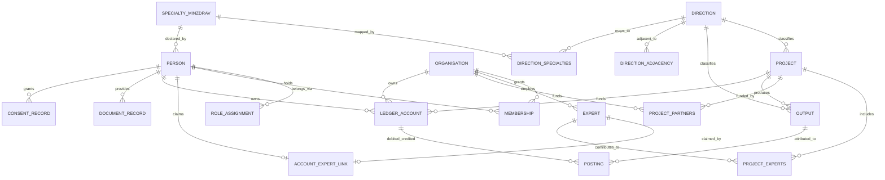

> **EN:** [`0016-core-domain-model-design-en.md`](./0016-core-domain-model-design-en.md) · **RU (это)**

# DS Platform — design базовой модели предметной области (парная к ADR-0016)

**Дата:** 2026-08-22
**Статус:** Accepted (парная к [ADR-0016](./0016-core-domain-model-ru.md))
**Scope:** модель сущностей и связей на уровне имён и видов. **Не** код Drizzle, **не** миграции, **не** Zod-схемы — это приходит в фичах, реализующих модель.

---

## 0. TL;DR

Одна учётка на человека; роли и членства в организациях — отдельные отзываемые связи с контекстом. Эксперт — сущность без учётки, связываемая с ней аудируемым автоматом состояний. Проект — единственный контейнер; школы, курсы, уроки, подкасты и события — его результаты. Два связанных справочника — закрытый список специальностей Минздрава и открытый справочник направлений (расширенные `topics` фичи 012). Очки и деньги — один append-only реестр счетов и проводок. Документы и согласия — под жизненным циклом ПДн ADR-0009. Каждая сущность объявляет, какой витрине она принадлежит.

## 1. Scope и не-цели

**В scope.** Сущности и связи базовой модели, их поля на уровне имён и видов, принадлежность витрине и отображение существующей схемы на них.

**Вне scope.** Типы колонок, индексы и ограничения (их выбирает реализующая фича по ADR-0003); движок правил начисления (REQ-36/48/49, two-way doors); платёжная интеграция (CON-16); миграция GetCourse/конгресса (REQ-105); UI и API-поверхность; топология развёртывания (ADR-0015).

**Две one-way door маршрутизированы, а не моделируются здесь.** **OWD-5** — Академия это отдельный публичный домен со своей аудиторией, но часть единой экосистемы Doctor.School и без собственной монетизации — дверь позиционирования/топологии, владелец ADR-0015; её единственный след в этом design — таблица принадлежности витрине §4. **OWD-7** — выход из GetCourse, без интеграции с GetCourse сейчас и когда-либо — ограничивает миграцию REQ-105, названную в §5 (разовый импорт, никогда не синхронизация), а не модель сущностей.

---

## 2. Сущности

Списки полей — **ориентировочные имена и виды**, не схема. Каждая сущность дополнительно несёт стандартные поля retained-row lifecycle из ADR-0003 / фичи 012 (`created_at`, `updated_at`, `deleted_at`, `version`, а также `status` / `first_published_at` там, где сущность публикуемая), если не сказано иное.

### 2.1 Человек (учётная запись) — существующая `users`

| Поле                                                                     | Вид          | Примечание                                       |
| ------------------------------------------------------------------------ | ------------ | ------------------------------------------------ |
| `id`                                                                     | uuid         | существует                                       |
| `zitadel_sub`                                                            | text, unique | один IdP-субъект (ADR-0001 §6)                   |
| `email` / `phone` / `email_verified` / `phone_verified` / `display_name` | text / bool  | существует                                       |
| `deactivated_at`                                                         | timestamptz  | существует, жизненный цикл ADR-0009              |
| `role`                                                                   | text         | **снимается** → назначение роли                  |
| атрибуты профиля (части ФИО, локация, место работы, аватар, о себе)      | text         | профиль врача (объём по OWD-2)                   |
| `primary_specialty_id`                                                   | fk → §2.7    | специальность Минздрава (REQ-101)                |
| `verification_state`                                                     | enum         | не подтверждён / подтверждён / отклонён (REQ-22) |

Одна строка на человека, на обеих витринах (OWD-1). Контакты (`email`, `phone`) никогда не входят в выгрузку для инвестора (OWD-2).

### 2.2 Назначение роли

| Поле                                       | Вид         | Примечание                                                                                                                                         |
| ------------------------------------------ | ----------- | -------------------------------------------------------------------------------------------------------------------------------------------------- |
| `id`                                       | uuid        |                                                                                                                                                    |
| `person_id`                                | fk → §2.1   |                                                                                                                                                    |
| `role`                                     | enum        | врач · эксперт · автор · соавтор · админ Академии · верификатор · финансы · методист · продюсер · оператор НМО · представитель инвестора · медпред |
| `scope_kind` / `scope_id`                  | enum / uuid | `global` · `организация` (§2.3) · `проект` (§2.5)                                                                                                  |
| `valid_from` / `valid_to`                  | timestamptz | пустой `valid_to` = действует сейчас                                                                                                               |
| `granted_by` / `revoked_by` / `revoked_at` | fk / ts     | каждая выдача и отзыв дублируются в `audit_ledger`                                                                                                 |

Лейблы, которые **не** роли — амбассадор, спикер, модератор, член оргкомитета, наставник, «постоянный участник», «команда» (словарь), — атрибуты соответствующей сущности, а не назначения ролей.

### 2.3 Организация

| Поле                                                  | Вид         | Примечание                                                                                                                                                                                               |
| ----------------------------------------------------- | ----------- | -------------------------------------------------------------------------------------------------------------------------------------------------------------------------------------------------------- |
| `id` / `slug` / `title`                               | uuid / text | зерно — `partners` фичи 012                                                                                                                                                                              |
| `kinds`                                               | набор enum  | **открытый расширяемый набор** (Q-40) — стартовые виды: инвестор · клиническая база · лицензиат / образовательная организация. «Работодатель» намеренно отсутствует: это не продуктовая роль (Q-38 → NG) |
| `logo_ref` / `website_url` / `description`            | text        | `logo_ref` существует                                                                                                                                                                                    |
| юридические атрибуты (юрлицо, ИНН, ссылка на договор) | text        | сами договоры остаются вне платформы (OWD-3 / CON-16)                                                                                                                                                    |

Одна организация может нести несколько видов сразу (Q-40, V-RV-10): клиника, которая одновременно лицензиат, — одна строка с двумя видами, а не две строки. Набор заведомо будет расти: добавление вида — это значение, а не новая таблица.

### 2.4 Членство (человек ↔ организация)

| Поле                                                    | Вид       | Примечание                                                                                                                                                                           |
| ------------------------------------------------------- | --------- | ------------------------------------------------------------------------------------------------------------------------------------------------------------------------------------ |
| `id` / `person_id` / `organisation_id`                  | uuid / fk |                                                                                                                                                                                      |
| `role_in_organisation`                                  | enum      | админ · представитель инвестора · медпред · финансы; медпред — пользователь ОТ организации с личной ссылкой / промокодом, поэтому его приглашения атрибутируются лично ему (REQ-114) |
| `valid_from` / `valid_to` / `revoked_at` / `revoked_by` | ts / fk   | отзыв снимает доступ, но не учётку (OWD-8)                                                                                                                                           |

У человека **не более одного активного членства** одновременно (Q-33): второе активное членство либо запрещается, либо — если каркасы потребуют мягкого режима — допускается с явным предупреждением человеку и админам обеих организаций; выбор режима это деталь каркасов, а не изменение модели. Доступ к персоналиям врачей вычисляется как _(членство активно) И (объект спонсируется этой организацией) И (врач дал согласие под эту цель)_ — предикат привязан к конкретному спонсируемому объекту, а не к проекту целиком (Q-32, OWD-2 + REQ-34).

### 2.5 Проект — существующая `projects`

| Поле                                                       | Вид         | Примечание                          |
| ---------------------------------------------------------- | ----------- | ----------------------------------- |
| `id` / `slug` / `title` / `description` / `cover_ref`      | uuid / text | существует (фича 012)               |
| `kind`                                                     | enum        | существующий `project_kind`         |
| `direction_id`                                             | fk → §2.8   | направление проекта (OWD-11)        |
| `status` / `first_published_at` / `deleted_at` / `version` | —           | существующий retained-row lifecycle |

**Единственный сквозной контейнер** (OWD-9, правило V-RV-9). Единственная проектная связь в схеме сегодня — `event_projects` (проект ↔ результат-событие); `project_experts` (проект ↔ эксперт) и `project_partners` (проект ↔ организация) **спроектированы в фиче 012** (`012-design.md`, волна 3 — #1291 / #1293) и ещё не выпущены, поэтому модель наследует их как спроектированные, а не как существующие таблицы.

### 2.6 Результаты проекта

Одно семейство, различаемое типом и аудиторией, — никогда отдельными деревьями.

| Результат                                             | Статус                                                   | Примечание                                                                                               |
| ----------------------------------------------------- | -------------------------------------------------------- | -------------------------------------------------------------------------------------------------------- |
| **Событие** (вебинар, эфир, офлайн-встреча, конгресс) | существует `events` + `event_speakers` + `stream_config` | ссылка на проект через существующий `event_projects`; конгресс = событие проекта «Ортобиология» (REQ-79) |
| **Запись события**                                    | существует `event_recordings` (фича 014)                 | артефакт результата-события, поглощён без изменений                                                      |
| **Школа**                                             | новая                                                    | продукт, привязанный к направлению (OWD-11, REQ-50); содержит курсы                                      |
| **Курс**                                              | новая                                                    | серия уроков (формат «сериал», REQ-16)                                                                   |
| **Модуль**                                            | новая                                                    | необязательная группировка внутри курса                                                                  |
| **Урок**                                              | новая                                                    | единица контента **и** юнит финансирования (REQ-31)                                                      |
| **Подкаст / эпизод**                                  | новая                                                    | эпизод — аналог урока для подкаста                                                                       |

Каждый результат несёт: `project_id`, тип, аудиторию (§4), `direction_id` там, где это нужно витрине врача, цену в баллах как параметр из набора правил начисления (REQ-48 — не решённое здесь значение) и retained-row lifecycle.

### 2.7 Специальность Минздрава — новая `specialties_minzdrav`

`id` · `code` · `title` · `is_active`. **Закрытый** справочник (105 + «Другое»), редакционно не расширяется. В профиле врача, на документах и для НМО (OWD-11, REQ-101).

### 2.8 Направление — существующая `topics`, переименована и расширена

`id` · `slug` · `title` · `description` · retained-row lifecycle (всё уже есть в `topics`), плюс:

- **`direction_adjacency`** — связь с самой собой `direction_id` ↔ `adjacent_direction_id` с полями `kind` и `weight`.
- **`direction_specialties`** — многие-ко-многим `direction_id` ↔ `specialty_minzdrav_id`; этой связью управляется показ контента (REQ-1).

Связь `event_topics` — тоже спроектированная в фиче 012 и ещё не появившаяся в схеме — становится связью событие ↔ направление. **Обоснование отождествления** (ADR-0016 §5): `012-design.md` §2 определяет `topics` как открытую собственную редакционно управляемую ось классификации без смежности и без связи с официальным списком — то есть справочник направлений минус две добавленные здесь связи.

### 2.9 Эксперт — существующая `experts`

`id` · `slug` · `name` · `photo_ref` · `professional_role` · `credentials` · `affiliation` · `bio` · retained-row lifecycle, включая `content_removed_at` (всё существует), плюс `primary_direction_id` (fk → §2.8) и `organisation_id` (fk → §2.3 — клиническая база, OWD-4; никогда не «работодатель», это не продуктовая роль).

Существует **без** учётки (REQ-97).

### 2.10 Связь учётка ↔ эксперт

| Поле                                                                                | Вид            | Примечание                                                        |
| ----------------------------------------------------------------------------------- | -------------- | ----------------------------------------------------------------- |
| `id` / `person_id` / `expert_id`                                                    | uuid / fk      |                                                                   |
| `state`                                                                             | enum           | `не связан` · `заявлено` · `подтверждено` · `отклонено` (REQ-106) |
| `claimed_at` / `confirmed_at` / `confirmed_by` / `rejected_at` / `rejection_reason` | ts / fk / text | ручное подтверждение админом Академии (REQ-107)                   |

Инварианты: не более одной подтверждённой связи на эксперта; не более одного подтверждённого эксперта на человека. Конкурирующие заявки остаются в состоянии «заявлено» и уходят в ручной разбор. Каждый переход — запись в `audit_ledger`: связь имеет финансовое значение (REQ-98) и обязана быть откатываемой.

### 2.11 Счёт реестра

`id` · `subject_kind` (`человек` · `фонд проекта` · `организация` · `системный`) · `subject_id` · `unit` (`очки внимания` · `деньги`) · `opened_at` · `closed_at`. У человека один счёт очков внимания на web и мобильные (OWD-10, REQ-3). При стирании счёт человека **закрывается, а баланс замораживается** — проводки никогда не удаляются и не переписываются (§2.12); субъект проводки перенаправляется на обезличенный субъект по процедуре стирания ADR-0009 (Q-35).

### 2.12 Проводка

| Поле                                                  | Вид            | Примечание                                                                                                                    |
| ----------------------------------------------------- | -------------- | ----------------------------------------------------------------------------------------------------------------------------- |
| `id`                                                  | uuid           | append-only, не обновляется и не удаляется (ADR-0003 §2.7)                                                                    |
| `debit_account_id` / `credit_account_id`              | fk → §2.11     | в стиле двойной записи                                                                                                        |
| `amount` / `unit`                                     | numeric / enum |                                                                                                                               |
| `project_id`                                          | fk → §2.5      | сквозная прослеживаемость по обеим витринам (OWD-9)                                                                           |
| `output_id` / `output_type`                           | fk / enum      | урок/событие, которому атрибутировано начисление (REQ-31)                                                                     |
| `rule_id` / `rule_version`                            | fk / text      | правило начисления, породившее проводку — сами правила вне scope (REQ-36/48/49)                                               |
| `attributed_organisation_id` / `attributed_member_id` | fk, nullable   | **субъект атрибуции** — организация и конкретный участник (медпред), чья личная ссылка / промокод породили проводку (REQ-114) |
| `occurred_at` / `recorded_at`                         | timestamptz    | бизнес-время против времени записи                                                                                            |
| `reverses_posting_id`                                 | fk, nullable   | исправления — компенсирующие проводки                                                                                         |

Баланс — свёртка проводок; изменяемой колонки баланса нет нигде. Цепочка «внесено → фонд юнита → начисления» (OWD-3) — отчёт над §2.11 + §2.12.

### 2.13 Запись о документе

`id` · `person_id` · `document_type` (диплом · сертификат · паспорт · СНИЛС · документ ДПО) · `storage_key` (объектное хранилище, байты в Postgres не кладутся) · `issued_at` · `expires_at` · `issuer` · `verification_state` (`в очереди` · `подтверждён` · `отклонён`) · `verified_by` · `verified_at` · `rejection_reason`. Под жизненным циклом ПДн ADR-0009; читается только с правом «верификация» (REQ-113); каждый доступ и переход аудируется (CON-15, OWD-12).

### 2.14 Запись согласия — существующая `consent_records`

`id` · `user_id` · `purpose` · `version` · `captured_at` (всё существует). Отдельные по целям, явные, отзывные (REQ-34): отзыв — новая запись, а не удаление. В выгрузку для инвестора попадают только врачи с действующим согласием под эту цель (OWD-2, CON-2). Частичного самостоятельного отзыва **нет** (Q-35): человек либо сохраняет требуемый платформой набор согласий, либо отказывается от него и теряет всё, что платформа ему дала; отказ разбирает менеджер вручную, а его последствие в реестре — закрытый замороженный счёт §2.11, а не переписанная история проводок.

---

## 3. Связи

Несущие инварианты:

1. Один человек = одна строка `PERSON` на обеих витринах (OWD-1).
2. Доступ к персоналиям другого человека никогда не свойство учётки — это _(активное членство) × (спонсируемый объект) × (согласие под цель)_.
3. Каждый результат и каждая проводка несут `project_id` (OWD-9).
4. Балансы выводятся, а не хранятся изменяемым состоянием (OWD-10).
5. Подтверждённая связь учётка ↔ эксперт уникальна с обеих сторон.

---

## 4. Принадлежность витрине

| Сущность                                           | Владелец       | Примечание                                                           |
| -------------------------------------------------- | -------------- | -------------------------------------------------------------------- |
| Человек (учётная запись)                           | обе            | одна учётка, две витрины                                             |
| Назначение роли                                    | только админка | выдаётся в админской поверхности                                     |
| Организация                                        | академия       | кабинеты инвестора и клинической базы — закулисье                    |
| Членство                                           | академия       | ведёт админ организации                                              |
| Проект                                             | академия       | врач видит результаты, а не контейнер                                |
| Результат — событие / запись                       | обе            | создаётся в Академии, потребляется на витрине врача                  |
| Результат — школа / курс / модуль / урок / подкаст | обе            | то же                                                                |
| Специальность Минздрава                            | обе            | профиль + документы                                                  |
| Направление                                        | обе            | ось каталога у врача, ось планирования в Академии                    |
| Эксперт                                            | обе            | публичная карточка на обеих; редактирование — закулисье              |
| Связь учётка ↔ эксперт                             | обе            | «Это я» заявляется на витрине врача, подтверждается только в админке |
| Счёт реестра / проводка                            | академия       | врач видит только свой счёт очков — проекцию на чтение               |
| Запись о документе                                 | только админка | загружается врачом, читается только с правом «верификация»           |
| Запись согласия                                    | обе            | даётся и отзывается врачом, читается всей платформой                 |

`только админка` означает, что у сущности нет публичной поверхности ни на одной витрине.

---

## 5. Отображение на текущую схему

| Существующая таблица (`packages/db/src/schema/`)            | Вердикт                       | Детали                                                                                                                                                                                                                                     |
| ----------------------------------------------------------- | ----------------------------- | ------------------------------------------------------------------------------------------------------------------------------------------------------------------------------------------------------------------------------------------ |
| `users`                                                     | **расширена**                 | §2.1; `role` снимается в пользу назначений ролей (§2.2) после переноса; добавляются атрибуты профиля и верификации                                                                                                                         |
| `events`                                                    | **сохранена**                 | результат-событие (§2.6); текстовые `school` / `specialties` переезжают на ссылки направление/специальность                                                                                                                                |
| `event_speakers`                                            | **сохранена**                 | legacy-спикеры; слияние в `experts` по §4 фичи 012                                                                                                                                                                                         |
| `registrations`                                             | **сохранена**                 | участие в результате-событии; источник проводок по очкам внимания                                                                                                                                                                          |
| `taxonomy.projects`                                         | **сохранена**                 | §2.5, контейнер — форма не меняется, добавляется `direction_id`                                                                                                                                                                            |
| `taxonomy.experts`                                          | **сохранена**                 | §2.9, добавляются `primary_direction_id` и `organisation_id`                                                                                                                                                                               |
| `taxonomy.topics`                                           | **переименована + расширена** | → `directions` (§2.8) со смежностью и связью со специальностями; `event_topics` следом                                                                                                                                                     |
| `taxonomy.partners`                                         | **переименована + расширена** | → `organisations` (§2.3) с открытым расширяемым набором `kinds` (инвестор · клиническая база · лицензиат, набор будет расти); спроектированная в 012 связь `project_partners` следует за переименованием                                   |
| `taxonomy.event_experts` / `event_projects`                 | **сохранены**                 | связи фичи 012, поглощены как есть (#1288/#1289)                                                                                                                                                                                           |
| `event_recordings`                                          | **сохранена**                 | фича 014, поглощена без изменений                                                                                                                                                                                                          |
| `consent_records`                                           | **сохранена**                 | §2.14, ADR-0009                                                                                                                                                                                                                            |
| `audit_ledger`                                              | **сохранена**                 | фича 010; добавляются типы событий по переходам связи и доступам к документам                                                                                                                                                              |
| `lifecycle.ts` (не таблица)                                 | **сохранена**                 | pgEnum `record_status` и общие хелперы колонок retained-row lifecycle, переиспользуемые каждой таблицей (ADR-0003 §3.6)                                                                                                                    |
| `presence_beats`                                            | **сохранена**                 | измерение внимания — источник проводок, а не реестр                                                                                                                                                                                        |
| `idempotency_keys` / `media_cleanup_jobs` / `stream_config` | **сохранены**                 | операционные, не затрагиваются                                                                                                                                                                                                             |
| — (новые)                                                   | **новые**                     | `role_assignments`, `memberships`, `account_expert_links`, `specialties_minzdrav`, `direction_adjacency`, `direction_specialties`, таблицы результатов (школа/курс/модуль/урок/подкаст), `ledger_accounts`, `postings`, `document_records` |

**Фичи 012 и 014 поглощаются, а не переписываются.** Единственное изменение уже выпущенной поверхности — переименования `topics` → `directions` и `partners` → `organisations`, и это отдельная миграционная фича с сохранением retained-row lifecycle (#1278).

**REQ-105 (люди GetCourse + база регистраций конгресса) — открытая последующая работа**, здесь не проектируется: нужны правовое основание, переподтверждение согласий и карта полей до первого отчёта инвестору.

---

## 6. Терминология (RU-термин → сущность)

| RU-термин (обязателен — `discovery-glossary-ru.md`) | Сущность                                                      |
| --------------------------------------------------- | ------------------------------------------------------------- |
| Человек / учётная запись                            | Человек (учётная запись) — §2.1                               |
| Врач                                                | Человек с назначенной ролью «врач»                            |
| Эксперт                                             | Эксперт — §2.9                                                |
| Автор / соавтор                                     | Назначение роли в контексте проекта/результата                |
| Инвестор (организация)                              | Организация с видом «инвестор» — §2.3                         |
| Участник                                            | Термин уровня BBM — вне модели DS                             |
| Клиническая база                                    | Организация с видом «клиническая база»                        |
| Представитель инвестора / медпред                   | Роль в членстве — §2.4; у медпреда личная атрибуция (REQ-114) |
| Верификатор                                         | Назначение роли «верификатор» — §2.2                          |
| Проект                                              | Проект — §2.5                                                 |
| Школа / курс / урок / подкаст / событие             | Результаты проекта — §2.6                                     |
| Специальность (Минздрав)                            | Специальность Минздрава — §2.7                                |
| Направление                                         | Направление — §2.8                                            |
| Очки внимания                                       | Счёт реестра, единица «очки внимания» — §2.11                 |
| Начисление / проводка                               | Проводка — §2.12                                              |
| Фонд урока / мероприятия                            | Счёт реестра, субъект «фонд проекта»                          |
| Документ врача                                      | Запись о документе — §2.13                                    |
| Согласие                                            | Запись согласия — §2.14                                       |

Запрещённые словарём синонимы не используются ни в этой модели, ни в именах сущностей, ни в построенных по ней поверхностях.

---

## 7. Стратегия верификации

1. Инвентарь сущностей §2 — чек-лист, по которому ревьюится первая схемная фича; Zod-контракты в `packages/schemas` зеркалят его по ADR-0002 §3.
2. Инварианты §3 становятся e2e-проверками в реализующих их фичах (уникальность подтверждённой связи, ссылка на проект в каждой проводке, выводимый баланс).
3. Таблица отображения §5 перепроверяется при каждом добавлении или переименовании таблицы; таблица, в ней отсутствующая, — decision-debt.
4. Таблица §4 — ответ по умолчанию на вопрос «какая витрина это показывает»; фича-спека, ей противоречащая, — отказ на ревью.
