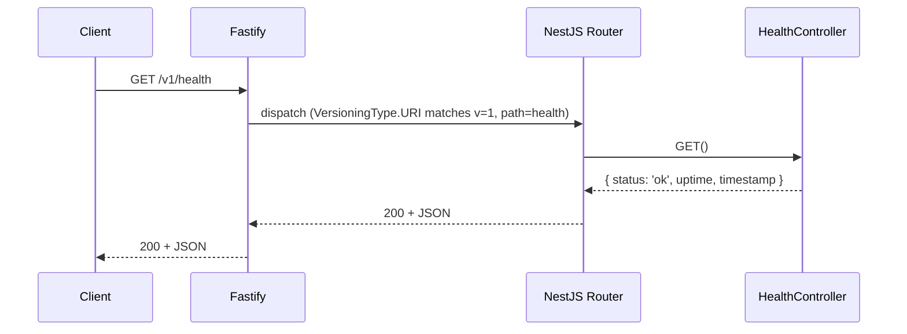
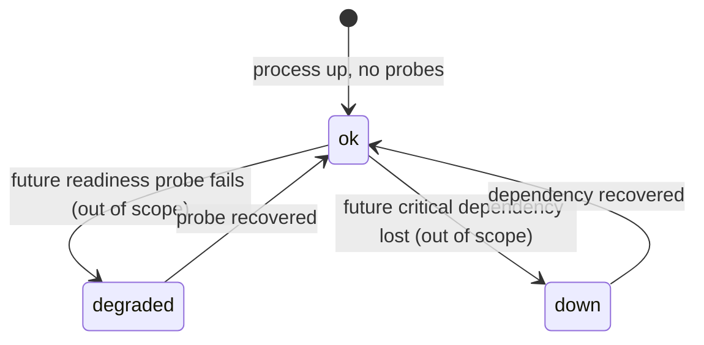

# 001 — apps/api bootstrap + GET /v1/health (Design)

## 1. Architecture

Single Node process. NestJS 11 application boots via `NestFactory.create(AppModule, new FastifyAdapter())`. One feature module (`HealthModule`) registers `HealthController`. No services layer for this endpoint — the controller returns a 3-field object built from `process.uptime()` and `new Date().toISOString()`; introducing a service would be ceremony, not abstraction.

The Zod schema lives in `packages/schemas` (`@ds/schemas`). `apps/api` re-wraps it via `createZodDto(HealthResponseSchema)` from `nestjs-zod` to obtain a NestJS-compatible DTO class for response typing and (later, when Swagger is added) OpenAPI generation. The framework-agnostic schema stays clean of any `nestjs-*` dependency so frontends (`apps/portal`, `apps/mobile`) can import it.



## 2. Versioning

`apps/api/src/main.ts`:

```ts
const app = await NestFactory.create<NestFastifyApplication>(
  AppModule,
  new FastifyAdapter(),
);
app.enableVersioning({ type: VersioningType.URI, defaultVersion: "1" });
await app.listen({ port: Number(process.env.PORT ?? 3000), host: "0.0.0.0" });
```

`apps/api/src/health/health.controller.ts`:

```ts
@Controller({ path: "health", version: "1" })
export class HealthController {
  @Get()
  get(): HealthResponse {
    return {
      status: "ok",
      uptime: process.uptime(),
      timestamp: new Date().toISOString(),
    };
  }
}
```

Per ADR-0002 design §line 293. Path emitted by Nest's router: `/v1/health`.

## 3. Workspace layout

```
apps/api/
  package.json
  tsconfig.json
  nest-cli.json
  vitest.config.ts
  src/
    main.ts
    app.module.ts
    health/
      health.module.ts
      health.controller.ts
      health.dto.ts          # createZodDto(HealthResponseSchema)
  test/
    health.e2e-spec.ts

packages/schemas/
  package.json               # name: "@ds/schemas", exports field, peerDep zod
  tsconfig.json              # composite: true
  src/
    health/
      health.schema.ts       # export const HealthResponseSchema; export type HealthResponse
      index.ts
    index.ts                 # export * from './health'
```

### `packages/schemas/src/health/health.schema.ts`

```ts
import { z } from "zod";

export const HealthResponseSchema = z
  .object({
    status: z.literal("ok"),
    uptime: z.number().nonnegative(),
    timestamp: z.string().datetime({ offset: false }),
  })
  .strict();

export type HealthResponse = z.infer<typeof HealthResponseSchema>;
```

`.strict()` so unknown keys are caught in tests if the controller ever returns extra fields.

### `apps/api/src/health/health.dto.ts`

```ts
import { createZodDto } from "nestjs-zod";
import { HealthResponseSchema } from "@ds/schemas";

export class HealthResponseDto extends createZodDto(HealthResponseSchema) {}
```

## 4. State diagram — `status` field lifecycle



Current spec emits only `ok`. Future readiness work extends the schema to `z.enum(['ok','degraded','down'])` — strictly additive at the type level (existing `z.literal('ok')` parsers continue to accept the new union member if they upgrade to the enum schema).

## 5. Build, dev, test

| Task        | Command                       | Notes                                                                                  |
| ----------- | ----------------------------- | -------------------------------------------------------------------------------------- |
| `dev`       | `nest start --watch`          | Watch mode via NestJS CLI; reloads on src/ change.                                     |
| `build`     | `nest build`                  | swc-backed (NestJS CLI 11 default). Emits to `apps/api/dist/`.                         |
| `start`     | `node dist/main.js`           | Production entrypoint after `build`.                                                   |
| `test`      | `vitest run`                  | Single e2e file under `apps/api/test/`. `vitest.config.ts` sets `environment: 'node'`. |
| `typecheck` | `tsc --noEmit`                | Per ADR-0002 design §line 350.                                                         |
| `lint`      | (root `eslint .` picks it up) | No app-local config; flat config at root governs.                                      |

`turbo.json` already declares these task names — no edit needed.

## 6. Dependency manifest

`apps/api/package.json`:

| Package                    | Type    | Version pin policy                     |
| -------------------------- | ------- | -------------------------------------- |
| `@nestjs/core`             | runtime | `^11.0.0`                              |
| `@nestjs/common`           | runtime | `^11.0.0`                              |
| `@nestjs/platform-fastify` | runtime | `^11.0.0`                              |
| `fastify`                  | runtime | `^5.0.0` (peer of platform-fastify 11) |
| `nestjs-zod`               | runtime | `^4.0.0` (risenforces)                 |
| `zod`                      | runtime | `^3.23.0`                              |
| `reflect-metadata`         | runtime | `^0.2.0`                               |
| `rxjs`                     | runtime | `^7.8.0`                               |
| `@ds/schemas`              | runtime | `workspace:*`                          |
| `@nestjs/cli`              | dev     | `^11.0.0`                              |
| `@nestjs/testing`          | dev     | `^11.0.0`                              |
| `vitest`                   | dev     | `^2.1.0`                               |
| `supertest`                | dev     | `^7.0.0`                               |
| `@types/supertest`         | dev     | `^6.0.0`                               |
| `@types/node`              | dev     | `^22.0.0`                              |

Exact versions resolved at install time by `pnpm install`; the implementation plan locks them into `pnpm-lock.yaml`.

`packages/schemas/package.json`:

| Package | Type    | Version                                                    |
| ------- | ------- | ---------------------------------------------------------- |
| `zod`   | runtime | `^3.23.0` (same major as `apps/api` to keep type identity) |

No `nestjs-zod` or `@nestjs/*` dependency. Frontend consumers stay clean.

## 7. tsconfig strategy

- `apps/api/tsconfig.json` extends `tsconfig.base.json`, sets `outDir: "./dist"`, `rootDir: "./src"`, `composite: true`, `experimentalDecorators: true`, `emitDecoratorMetadata: true`, `module: "NodeNext"`, `moduleResolution: "NodeNext"`. The base file uses `module: "ESNext"` + `moduleResolution: "Bundler"` which is wrong for `node dist/main.js` — `apps/api` must override to `NodeNext` so emitted code is loadable by Node. (This is a real friction point we accept now; revisiting if/when ADR-0008 G9 unifies module strategy.)
- `packages/schemas/tsconfig.json` extends the base, `composite: true`, `outDir: "./dist"`, `declaration: true`, `declarationMap: true`. Stays on base `module: "ESNext"` since it ships only types + plain ESM consumed by bundlers.
- Decorator metadata is on only in `apps/api` (NestJS DI needs it). `packages/schemas` keeps the strict base unchanged.

## 8. Test design

`apps/api/test/health.e2e-spec.ts`:

```ts
import { Test } from "@nestjs/testing";
import {
  FastifyAdapter,
  NestFastifyApplication,
} from "@nestjs/platform-fastify";
import { VersioningType } from "@nestjs/common";
import request from "supertest";
import { HealthResponseSchema } from "@ds/schemas";
import { AppModule } from "../src/app.module.js";

describe("GET /v1/health", () => {
  let app: NestFastifyApplication;

  beforeAll(async () => {
    const moduleRef = await Test.createTestingModule({
      imports: [AppModule],
    }).compile();
    app = moduleRef.createNestApplication<NestFastifyApplication>(
      new FastifyAdapter(),
    );
    app.enableVersioning({ type: VersioningType.URI, defaultVersion: "1" });
    await app.init();
    await app.getHttpAdapter().getInstance().ready();
  });

  afterAll(async () => {
    await app.close();
  });

  it("EARS-1.1: returns 200 with body matching HealthResponseSchema", async () => {
    const res = await request(app.getHttpServer())
      .get("/v1/health")
      .expect(200);
    const parsed = HealthResponseSchema.parse(res.body);
    expect(parsed.uptime).toBeGreaterThanOrEqual(0);
    expect(Date.parse(parsed.timestamp)).toBeGreaterThan(0);
  });
});
```

`vitest.config.ts`:

```ts
import { defineConfig } from "vitest/config";
export default defineConfig({
  test: {
    environment: "node",
    include: ["test/**/*.e2e-spec.ts", "src/**/*.spec.ts"],
  },
});
```

## 9. Error handling

The endpoint has no failure modes within this spec. The default NestJS exception filter remains (no custom RFC 7807 filter — that lands with the broader API spec). If the process is unhealthy enough that the controller cannot run, Fastify closes the connection before responding — that is the operational signal monitoring tools should watch for, not a 5xx body.

## 10. Open questions / known frictions

- **`module: NodeNext` divergence from root base.** Documented in §7. Should be revisited holistically in ADR-0008 G9.
- **NestJS Vitest plugin.** Some NestJS + Vitest setups require `vite-tsconfig-paths` or `swc-jest` shims. The implementation plan must verify the minimal config above works end-to-end on Node 22; if not, prefer adding `unplugin-swc` over jumping to Jest.
- **No CI job yet for `apps/api` e2e.** The test must pass locally via `pnpm --filter @ds/api test`. CI integration is a follow-up PR after `apps/api` exists in main.
