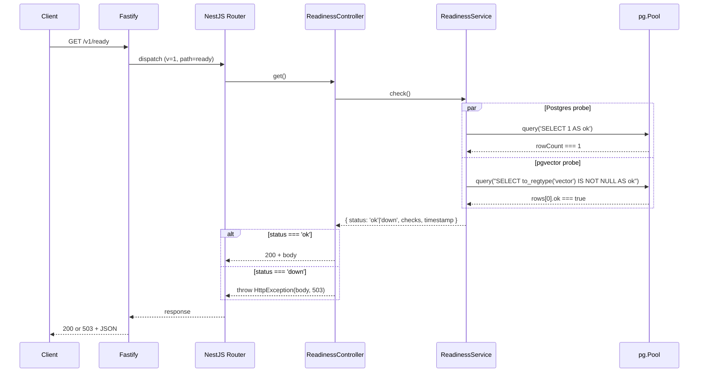
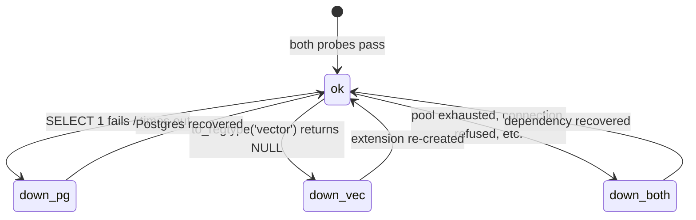

# 002 — apps/api Postgres wiring + GET /v1/ready (Design)

## 1. Architecture

Single Node process, same `apps/api` from spec 001 plus a real datastore connection. Two new feature areas:

1. **`DatabaseModule`** — a `@Global()` Nest module that constructs a `pg.Pool`, wraps it in a Drizzle handle via `createDrizzle(connectionString)` exported from `@ds/db`, and exposes both via DI tokens (`DRIZZLE_POOL`, `DRIZZLE_DB`). Lifecycle: pool created in the module's `useFactory`, closed in `onModuleDestroy`.
2. **`ReadinessModule`** — `ReadinessController` (`@Controller({ path: 'ready', version: '1' })`) + `ReadinessService.check()`. Two probes run via `Promise.allSettled`. Aggregate to `status: 'ok' | 'down'`. On `down`, the controller throws `HttpException(body, 503)` so the response body still conforms to the schema (default Nest filter passes the structured body through verbatim).

The Zod schema `ReadinessResponseSchema` lives in `packages/schemas/readiness/` (framework-agnostic, ADR-0005 «100% reuse»). `apps/api` wraps it via `createZodDto` to obtain a Nest-compatible DTO.



## 2. Readiness lifecycle (state diagram)



The states are emergent (a function of probe outcomes), not persisted. Every request re-evaluates from scratch — there is no in-process cache of the previous result.

## 3. Workspace layout (additions)

```
apps/api/
  drizzle/
    0000_initial.sql           # first migration (hand-edited for CREATE EXTENSION)
  src/
    config/
      env.schema.ts            # ApiEnvSchema (Zod, .passthrough())
    database/
      database.module.ts       # @Global() + DRIZZLE_POOL + DRIZZLE_DB providers
      database.tokens.ts       # DI token symbols
    readiness/
      readiness.module.ts
      readiness.controller.ts
      readiness.service.ts
      readiness.service.spec.ts   # EARS-2 unit
      readiness.dto.ts            # createZodDto(ReadinessResponseSchema)
  test/
    readiness.e2e-spec.ts      # EARS-1 e2e
    setup/
      migrate.ts               # Vitest globalSetup — runs drizzle:migrate

packages/db/
  package.json                 # graduates from stub; name "@ds/db"
  drizzle.config.ts            # out: '../../apps/api/drizzle'
  tsconfig.json
  src/
    index.ts                   # re-exports createDrizzle + schema
    client.ts                  # createDrizzle(connectionString) → { pool, db }
  schema/
    idempotency-keys.ts        # per ADR-0003 §5
    index.ts

packages/schemas/
  src/
    readiness/
      readiness.schema.ts      # ReadinessResponseSchema + CheckStatusSchema
      index.ts
    index.ts                   # adds `export * from './readiness'`
```

## 4. Code sketches

### 4.1 `packages/schemas/src/readiness/readiness.schema.ts`

```ts
import { z } from "zod";

export const CheckStatusSchema = z.enum(["ok", "down"]);
export type CheckStatus = z.infer<typeof CheckStatusSchema>;

export const ReadinessResponseSchema = z
  .object({
    status: CheckStatusSchema,
    checks: z
      .object({
        postgres: CheckStatusSchema,
        pgvector: CheckStatusSchema,
      })
      .strict(),
    timestamp: z.string().datetime({ offset: false }),
  })
  .strict();

export type ReadinessResponse = z.infer<typeof ReadinessResponseSchema>;
```

`CheckStatusSchema` is exported as a building block — when Redis / MinIO / Centrifugo probes land, they reuse this enum and extend the `checks` shape inside their own spec.

### 4.2 `packages/db/schema/idempotency-keys.ts`

```ts
import { pgTable, text, timestamp } from "drizzle-orm/pg-core";

export const idempotencyKeys = pgTable("idempotency_keys", {
  key: text("key").primaryKey(),
  scope: text("scope").notNull(),
  createdAt: timestamp("created_at", { withTimezone: true })
    .notNull()
    .defaultNow(),
  expiresAt: timestamp("expires_at", { withTimezone: true }).notNull(),
});

export type IdempotencyKey = typeof idempotencyKeys.$inferSelect;
export type NewIdempotencyKey = typeof idempotencyKeys.$inferInsert;
```

Definition is verbatim from ADR-0003 §5.

### 4.3 `packages/db/drizzle.config.ts`

```ts
import { defineConfig } from "drizzle-kit";

export default defineConfig({
  schema: "./schema/*.ts",
  out: "../../apps/api/drizzle",
  dialect: "postgresql",
  dbCredentials: {
    url: process.env.DATABASE_URL!,
  },
  strict: true,
  verbose: true,
});
```

`out: '../../apps/api/drizzle'` — verbatim per ADR-0003 §4. The path is relative to `packages/db/`.

### 4.4 `packages/db/src/client.ts`

```ts
import { drizzle, type NodePgDatabase } from "drizzle-orm/node-postgres";
import pg from "pg";
import * as schema from "../schema/index.js";

export interface DrizzleHandle {
  pool: pg.Pool;
  db: NodePgDatabase<typeof schema>;
}

export interface CreateDrizzleOptions {
  max?: number;
  statement_timeout?: number;
}

export function createDrizzle(
  connectionString: string,
  options: CreateDrizzleOptions = {},
): DrizzleHandle {
  const pool = new pg.Pool({
    connectionString,
    max: options.max ?? 10,
    statement_timeout: options.statement_timeout ?? 5_000,
  });
  const db = drizzle(pool, { schema });
  return { pool, db };
}
```

### 4.5 `apps/api/drizzle/0000_initial.sql`

```sql
-- Hand-edited atop drizzle-kit generate output:
-- drizzle-kit does not emit CREATE EXTENSION, so it is prepended manually.
-- Required by ADR-0003 §7 (pgvector in the main Postgres) and DSP-159
-- (dev-stand smoke probe matrix verifies SELECT '[1,2,3]'::vector).
CREATE EXTENSION IF NOT EXISTS vector;

CREATE TABLE "idempotency_keys" (
  "key" text PRIMARY KEY NOT NULL,
  "scope" text NOT NULL,
  "created_at" timestamptz NOT NULL DEFAULT now(),
  "expires_at" timestamptz NOT NULL
);
```

No domain tables, no `job_outbox`, no PD-bearing tables — those land in their own specs.

### 4.6 `apps/api/src/config/env.schema.ts`

```ts
import { z } from "zod";

export const ApiEnvSchema = z
  .object({
    DATABASE_URL: z.string().url(),
    PORT: z.coerce.number().int().positive().default(3000),
    DATABASE_POOL_MAX: z.coerce.number().int().positive().default(10),
    DATABASE_STATEMENT_TIMEOUT_MS: z.coerce
      .number()
      .int()
      .positive()
      .default(5_000),
  })
  .passthrough();

export type ApiEnv = z.infer<typeof ApiEnvSchema>;

export function loadEnv(source: NodeJS.ProcessEnv = process.env): ApiEnv {
  return ApiEnvSchema.parse(source);
}
```

`.passthrough()` is deliberate: the `.env` files in `infra/dev-stand/` carry many vars (`REDIS_URL`, `S3_ENDPOINT`, etc.) — we only validate the ones we currently consume; rejecting unknown keys would couple this schema to the full dev-stand contract.

### 4.7 `apps/api/src/database/database.tokens.ts`

```ts
export const DRIZZLE_POOL = Symbol("DRIZZLE_POOL");
export const DRIZZLE_DB = Symbol("DRIZZLE_DB");
```

### 4.8 `apps/api/src/database/database.module.ts`

```ts
import { Global, Module, type OnModuleDestroy } from "@nestjs/common";
import { createDrizzle, type DrizzleHandle } from "@ds/db";
import { loadEnv } from "../config/env.schema.js";
import { DRIZZLE_DB, DRIZZLE_POOL } from "./database.tokens.js";

@Global()
@Module({
  providers: [
    {
      provide: "DRIZZLE_HANDLE",
      useFactory: (): DrizzleHandle => {
        const env = loadEnv();
        return createDrizzle(env.DATABASE_URL, {
          max: env.DATABASE_POOL_MAX,
          statement_timeout: env.DATABASE_STATEMENT_TIMEOUT_MS,
        });
      },
    },
    {
      provide: DRIZZLE_POOL,
      inject: ["DRIZZLE_HANDLE"],
      useFactory: (h: DrizzleHandle) => h.pool,
    },
    {
      provide: DRIZZLE_DB,
      inject: ["DRIZZLE_HANDLE"],
      useFactory: (h: DrizzleHandle) => h.db,
    },
  ],
  exports: [DRIZZLE_POOL, DRIZZLE_DB],
})
export class DatabaseModule implements OnModuleDestroy {
  constructor() {}
  async onModuleDestroy(): Promise<void> {
    // Pool reference is fetched via DI at consumer level; the module
    // itself closes the handle by resolving the provider explicitly.
    // Implementation detail: capture the handle in a private field
    // populated via constructor injection in the actual implementation PR.
  }
}
```

The skeleton above is sufficient for the spec — the implementation PR will wire `onModuleDestroy` to the captured handle via constructor injection of `DRIZZLE_POOL`.

### 4.9 `apps/api/src/readiness/readiness.service.ts`

```ts
import { Inject, Injectable } from "@nestjs/common";
import type pg from "pg";
import { type CheckStatus, type ReadinessResponse } from "@ds/schemas";
import { DRIZZLE_POOL } from "../database/database.tokens.js";

@Injectable()
export class ReadinessService {
  constructor(@Inject(DRIZZLE_POOL) private readonly pool: pg.Pool) {}

  async check(): Promise<ReadinessResponse> {
    const [pgResult, vecResult] = await Promise.allSettled([
      this.pool.query("SELECT 1 AS ok"),
      this.pool.query("SELECT to_regtype('vector') IS NOT NULL AS ok"),
    ]);

    const postgres: CheckStatus =
      pgResult.status === "fulfilled" && pgResult.value.rows[0]?.ok === 1
        ? "ok"
        : "down";

    const pgvector: CheckStatus =
      vecResult.status === "fulfilled" && vecResult.value.rows[0]?.ok === true
        ? "ok"
        : "down";

    const status: CheckStatus =
      postgres === "ok" && pgvector === "ok" ? "ok" : "down";

    return {
      status,
      checks: { postgres, pgvector },
      timestamp: new Date().toISOString(),
    };
  }
}
```

### 4.10 `apps/api/src/readiness/readiness.controller.ts`

```ts
import { Controller, Get, HttpException, HttpStatus } from "@nestjs/common";
import { ReadinessService } from "./readiness.service.js";
import { ReadinessResponseDto } from "./readiness.dto.js";

@Controller({ path: "ready", version: "1" })
export class ReadinessController {
  constructor(private readonly readiness: ReadinessService) {}

  @Get()
  async get(): Promise<ReadinessResponseDto> {
    const body = await this.readiness.check();
    if (body.status === "down") {
      throw new HttpException(body, HttpStatus.SERVICE_UNAVAILABLE);
    }
    return body;
  }
}
```

`HttpException(body, 503)` — Nest's default exception filter serializes the passed object body verbatim, so `ReadinessResponseSchema.parse(responseBody)` succeeds for both 200 and 503.

### 4.11 `apps/api/src/readiness/readiness.dto.ts`

```ts
import { createZodDto } from "nestjs-zod";
import { ReadinessResponseSchema } from "@ds/schemas";

export class ReadinessResponseDto extends createZodDto(
  ReadinessResponseSchema,
) {}
```

### 4.12 `apps/api/test/setup/migrate.ts` (Vitest globalSetup)

```ts
import { spawnSync } from "node:child_process";

export default function globalSetup(): void {
  const result = spawnSync("pnpm", ["drizzle:migrate"], {
    stdio: "inherit",
    shell: process.platform === "win32",
  });
  if (result.status !== 0) {
    throw new Error(
      `drizzle:migrate failed with exit code ${result.status}; e2e suite cannot continue`,
    );
  }
}
```

`spawnSync` with the argv form (NOT `execSync` with a stringified command) — the repo's security guard rejects `exec`/`execSync` on native binaries because they pass through a shell unconditionally. `shell: process.platform === 'win32'` is required because `pnpm` is `pnpm.cmd` on Windows and Node's `spawnSync` does not resolve `.cmd` extensions without a shell.

## 5. `apps/api/package.json` script additions

```json
{
  "scripts": {
    "drizzle:generate": "drizzle-kit generate --config ../../packages/db/drizzle.config.ts",
    "drizzle:migrate": "pnpm -w run dev:snapshot pre-mig-auto && drizzle-kit migrate --config ../../packages/db/drizzle.config.ts"
  }
}
```

Adapted from local-dev-environment setup-design §9.2. The snapshot-then-migrate chain is a soft guardrail — if the snapshot step fails, migration does not proceed.

`pnpm -w run dev:snapshot` (not the bare `pnpm dev:snapshot` of setup-design §9.2): `dev:snapshot` is defined in the **workspace-root** `package.json`, but these scripts run with cwd = `apps/api`, and pnpm does not resolve a script up the workspace tree. `-w` targets the root package where `dev:snapshot` lives. Surfaced as decision-debt during #59; setup-design §9.2 is corrected to match.

## 6. Dependency manifest deltas

`apps/api/package.json`:

| Package       | Type    | Version pin policy                                          |
| ------------- | ------- | ----------------------------------------------------------- |
| `@ds/db`      | runtime | `workspace:*` (NEW — was previously stub, now imported)     |
| `pg`          | runtime | `^8.13.0` (transitively required for type annotations + DI) |
| `@types/pg`   | dev     | `^8.11.0`                                                   |
| `drizzle-kit` | dev     | `^0.30.0` (invoked via the `drizzle:*` scripts)             |

`packages/db/package.json` (graduating from stub):

| Package       | Type    | Version pin policy                                    |
| ------------- | ------- | ----------------------------------------------------- |
| `drizzle-orm` | runtime | `^0.36.0`                                             |
| `pg`          | runtime | `^8.13.0`                                             |
| `drizzle-kit` | dev     | `^0.30.0`                                             |
| `@types/pg`   | dev     | `^8.11.0`                                             |
| `zod`         | peer    | `^3.23.0` (transitively, via `@ds/schemas` consumers) |

`packages/schemas/package.json`: no new external deps — the readiness module only adds files inside the existing `zod`-only package.

## 7. tsconfig + Turbo

- `packages/db/tsconfig.json` extends the base, `composite: true`, `outDir: "./dist"`, `declaration: true`, `declarationMap: true`. Stays on base `module: "ESNext"` (no Node runtime entrypoint — consumed by `apps/api` which transpiles via NestJS CLI).
- `apps/api/tsconfig.json` already overrides to `NodeNext` (per spec 001 §7); no further change.
- Turbo task graph: `apps/api`'s `dev` / `build` / `test` already declare `dependsOn: ["^build"]`. Adding `@ds/db` as a workspace dep wires it into the graph automatically — no `turbo.json` edit needed.

## 8. Error handling

| Failure mode                                  | Detection                                                | Response                                                                                                |
| --------------------------------------------- | -------------------------------------------------------- | ------------------------------------------------------------------------------------------------------- |
| Postgres unreachable (TCP refused, DNS fail)  | `pool.query('SELECT 1')` rejects                         | `checks.postgres='down'`, `status='down'`, HTTP 503, body conforms                                      |
| Postgres query times out                      | `statement_timeout` exceeded → query rejects             | Same as above                                                                                           |
| pgvector extension missing                    | `to_regtype('vector')` returns NULL (rows[0].ok===false) | `checks.pgvector='down'`, `status='down'`, HTTP 503, body conforms                                      |
| Both fail simultaneously                      | Both `Promise.allSettled` entries rejected/falsy         | `checks.postgres='down'`, `checks.pgvector='down'`, `status='down'`, HTTP 503                           |
| Pool exhausted (acquire timeout)              | `pool.query` rejects with acquire-timeout error          | Same as Postgres unreachable                                                                            |
| Env validation fails (`DATABASE_URL` missing) | `loadEnv()` throws at module-factory time                | Process fails to boot — the readiness endpoint never serves; operator sees crash log (correct behavior) |

No custom RFC 7807 problem-details filter — Nest's default exception filter passes the body verbatim, which is what the spec requires. A global RFC 7807 filter lands in a later spec.

## 9. Open questions / known frictions

- **drizzle-kit does not emit `CREATE EXTENSION`.** The `0000_initial.sql` migration is hand-edited on top of the generator's output. This is acceptable per ADR-0003 §4 ("human-editable for complex migrations"). The implementation PR must document the regeneration procedure (run drizzle-kit, paste the SQL atop the `CREATE EXTENSION` line) so future migrations do not silently drop the extension creation.
- **RFC 7807 problem-details filter deferred.** The 503 body in this spec conforms to `ReadinessResponseSchema`, not to RFC 7807. When the global problem-details filter lands, this endpoint will need to either be exempted or have its schema reconciled — flagged here for the cross-cutting spec that introduces the filter.
- **`pnpm` on Windows perf nit.** The Vitest `globalSetup` spawns `pnpm` per test run, which on Windows is `pnpm.cmd` and requires `shell: true`. Each spawn pays ~200–500ms shell-init tax. Acceptable for an e2e smoke; if test count grows, consider invoking `drizzle-kit migrate` directly via its Node API rather than going through pnpm.
- **No CI job for `apps/api` e2e yet.** Same deferral as spec 001 — the e2e test must pass locally via `pnpm --filter @ds/api test` against a running dev-stand. CI integration is a follow-up after dev-stand smoke (DSP-159) confirms the contract.
- **`DatabaseModule.onModuleDestroy` skeleton.** The sketch in §4.8 captures the design intent; the implementation PR will pick one of two patterns — (a) capture the handle in a private field via constructor injection of `DRIZZLE_POOL`, or (b) use Nest's `ModuleRef` to resolve it at destroy time. Both are equivalent for the spec's purposes.
