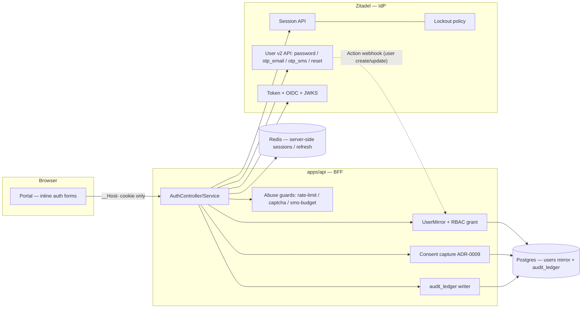
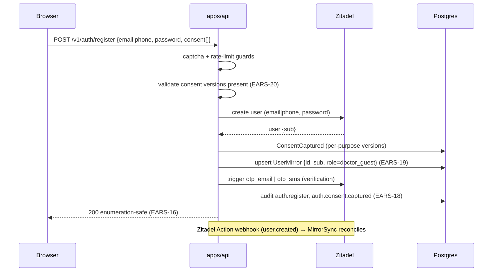
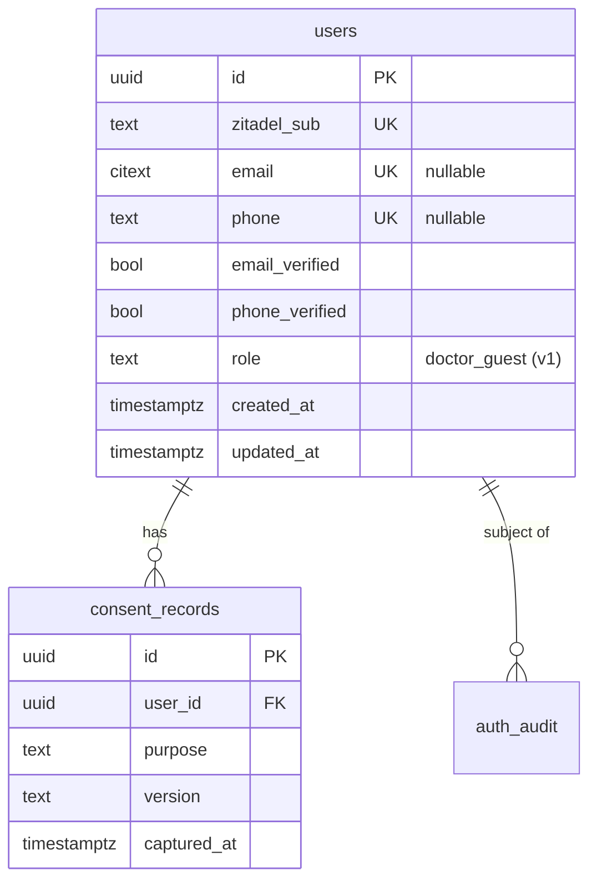

# 003 — User authentication (Design)

## 1. Architecture overview

`apps/api` is a **Backend-for-Frontend (BFF)** sitting between the portal's headless forms and Zitadel. It owns the domain mirror, consent, RBAC role grant, audit, and abuse guards; it delegates every credential operation to Zitadel via the Session / User v2 API. The portal renders inline forms on its own origin (Variant B, ADR-0001 §2) and talks only to the BFF; it never sees a token.



## 2. Native-vs-custom boundary (the hard rule)

Established by research against current Zitadel docs. `apps/api` builds **only** the right-hand column.

| Capability                     | Native Zitadel (consume, do not build)           | Custom in `apps/api` (build)                                                        |
| ------------------------------ | ------------------------------------------------ | ----------------------------------------------------------------------------------- |
| Password verification          | ✅ Session API password check                    | —                                                                                   |
| Token issue/rotate, JWKS, OIDC | ✅ core IdP                                      | BFF orchestration + `__Host-` cookie + server-side refresh store                    |
| Server-side sessions           | ✅ Session API                                   | session↔cookie binding, fingerprint                                                 |
| Email OTP code                 | ✅ `otp_email`                                   | request/verify orchestration                                                        |
| SMS OTP code                   | ✅ `otp_sms` (challenge on session create)       | toll-fraud guard + daily budget                                                     |
| Password reset / forgot        | ✅ User v2 reset code                            | enumeration-safe wrapper                                                            |
| Email/phone verification       | ✅ verification code / urlTemplate               | mirror flag sync                                                                    |
| Account lockout                | ✅ lockout policy (max password/OTP attempts)    | notification email                                                                  |
| Enumeration resistance         | ⚠️ "ignore unknown usernames" (had CVE bypasses) | idempotent responses + timing ≤50 ms + rate-limit backstop                          |
| MFA TOTP / passkeys            | ✅ (not used by `doctor_guest` in v1)            | — (seam only)                                                                       |
| Domain user mirror + RBAC      | —                                                | `users` table, `doctor_guest` grant, reconciliation                                 |
| Consent (ADR-0009)             | —                                                | per-purpose versioned capture                                                       |
| Domain audit ledger            | — (Zitadel has its own event log)                | `audit_ledger` writer (ADR-0003 §6)                                                 |
| Granular rate-limit (per-ASN)  | — (only instance quotas)                         | edge/BFF limiter                                                                    |
| Bot protection / CAPTCHA       | —                                                | `BotProtection` iface + SmartCaptcha adapter (token verify) + portal widget (§10.1) |

## 3. BFF session & token model (ADR-0001 §6)

The browser holds only the `__Host-` session cookie. The BFF holds the OIDC tokens server-side, keyed by the cookie's `sid`.

```mermaid
sequenceDiagram
  participant B as Browser (portal form)
  participant API as apps/api (BFF)
  participant Z as Zitadel
  participant R as Redis
  B->>API: POST /v1/auth/login {identifier, password}
  API->>API: rate-limit / captcha guards (EARS-13,17)
  API->>Z: create session + password check
  Z-->>API: session token (check ok)
  API->>Z: complete OIDC exchange (authorize w/ session)
  Z-->>API: access JWT (15m) + opaque refresh (rotating)
  API->>R: store {sid → refresh, zitadel_session_id, fingerprint}
  API-->>B: Set-Cookie __Host-sid (HttpOnly, Secure, SameSite=Lax); 200 (no token in body)
```

- **Fingerprint binding** (ADR-0001 §6): session metadata stores `hash(UA + IP/24 + accept-language)`; mismatch invalidates the session.
- **Refresh rotation** (EARS-9): each refresh is single-use; rotation issues a new refresh and revokes the old. A replay of a consumed refresh invalidates the whole chain (RFC 6819) and revokes the session.
- **No cross-subdomain cookie**: each app holds its own `__Host-` cookie; cross-app SSO continuity (future) is OIDC silent re-auth at the IdP, not a shared cookie (ADR-0001 §6).

## 4. Registration cascade (EARS-1/2, 19, 20, 3/4)



The Action webhook is the authoritative sync trigger; the inline upsert is an optimization so the mirror exists immediately. The periodic reconciliation sweep (EARS-19) closes any webhook-miss divergence.

## 5. Data model (mirror + consent + audit)



- CHECK constraint `email IS NOT NULL OR phone IS NOT NULL` (ADR-0001 §3).
- `consent_records` is the 003-local minimal slice; the full ADR-0009 consent subsystem (withdrawal, version migration) supersedes/extends it later — 003 references, does not own, the subsystem.
- `auth_audit` rows are the `audit_ledger` projection (ADR-0003 §6); PD columns store masked values, full values only in the encrypted ledger.

## 6. Login variants

- **Password (EARS-5):** session create + password check → §3 exchange.
- **Email-OTP (EARS-6):** `RequestEmailOtp` → Zitadel `otp_email` send; `LoginWithEmailOtp` → verify code in session → §3 exchange. The v1 passwordless email path; **no magic link**.
- **SMS-OTP (EARS-7):** `RequestSmsOtp` (gated by the toll-fraud guard, EARS-14) → `otp_sms`; verify → §3 exchange.

All three converge on the single session-establishment step (§3 / EARS-8), so the cookie/token logic exists once.

## 7. Seams (built as extension points, not implemented)

Each seam is a documented insertion point so the consuming vertical is additive, not a rewrite of this flow:

- **MFA** — the session JWT already carries `mfa`; a `role → mfa_required` policy check sits (as a no-op for v1 self-serve roles) right after the primary-auth step in §3. First mandatory-MFA role (admin/ops `platform_admin`; v2 `expert`) builds TOTP enroll/verify and flips the policy.
- **Legacy reactivation (ADR-0001 §9)** — the Directual first-login flow is composed of EARS-6 (email-OTP) / EARS-7 (SMS-OTP) + consent capture (EARS-20) + mirror sync (EARS-19) + an optional password-set. 003 exposes these; the cutover spec orchestrates them.
- **Mobile** — the §3 exchange swaps the `__Host-` cookie for device-id-bound refresh + Keychain/Keystore storage; the BFF endpoints are transport-agnostic.
- **Social OAuth (v2)** — a provider-redirect login converges on the same session-establishment step; account linking requires verified email on both sides (ADR-0001 §6.2).
- **Step-up (ADR-0001 §10)** — `StepUpGuard` + `acr=mfa-fresh` plug into the same JWT claim set when the first high-risk `doctor_guest` endpoint appears.
- **Magic-link** — a thin transport that emails a link wrapping the native one-time secret, verified through the same `otp_email` path; requires the ADR-0001 §8 security review.

## 8. UI model — Login v2 considered & rejected (recorded so it is not re-litigated)

Zitadel ships a self-hostable MIT Login v2 (Next.js, on the Session API) runnable on a custom domain. It would minimize custom UI code. It was **rejected for v1** because it implies a redirect hop to an auth subdomain, which contradicts ADR-0001 §2's deliberate choice of seamless inline forms for _credentials_ (the redirect model is accepted only for _social_ in §2). Variant B (headless inline forms over the BFF) keeps the chosen UX; the auth **primitives** stay native regardless of which UI shell is used, so "headless inline" is not "reinventing native". Login v2 remains a fallback note if the custom form layer proves more expensive than expected (would require an ADR-0001 §2 revision).

## 9. Decision-debt for ADR-0001 (separate adr-revision follow-up)

Surfaced per AGENTS.md §6; **not** changed inside this spec-authoring:

1. **§8 magic-link wording** — "custom build ~1–2 days" predates native email-OTP. The one-time secret is now native (`otp_email`); only the clickable-link transport is custom. Refine the wording; keep the mandatory security review for the link form.
2. **§7 enumeration/lockout** — record the Zitadel "ignore unknown usernames" CVE bypasses (CVE-2024-41952 flag bypass, CVE-2025-57770 "select account" page, CVE-2026-23511 reset-flow + Login UI V2) and pin a patched Zitadel release (≥ 4.9.1 / ≥ 3.4.6) in the DoD; our rate-limit + idempotent responses are the documented backstop (already consistent with §7).
3. **§2 Login v2** — note Login v2 as considered-and-rejected for credentials, so the choice is not re-opened by future contributors.

## 10. Error handling & security notes

- All failure responses on register/login/reset are generic and timing-equalized (EARS-16); specific reasons live only in `audit_ledger`.
- The BFF never logs raw credentials, codes, or tokens; PD is masked (ADR-0001 §7, ADR-0003 §6).
- SMS sends pass the budget circuit-breaker before reaching the provider (EARS-14); breaker-open returns a generic "try later".
- Bot protection gates registration, reset, and post-failure login (EARS-17) — see §10.1.
- Pinned, patched Zitadel release is a Definition-of-Done item (Constraints).

### 10.1 Bot protection (bootstrapped here, behind an abstraction)

003 is the first consumer of bot protection on the platform, so it bootstraps the mechanism rather than depending on a separate package (no other consumer yet). Two halves:

- **Backend** — a `BotProtection` provider interface (`verify(token, action, clientIp) → ok`) with a Yandex SmartCaptcha adapter, exposed as a NestJS `BotProtectionGuard` applied to the abuse-prone endpoints. The interface keeps the provider swappable (ADR-0001 open-q #7: SmartCaptcha default, alternatives → DSO-26) without touching call sites.
- **Frontend** — the SmartCaptcha widget rendered on the portal registration / reset / post-failure-login forms (in 003's Variant-B surface), emitting the token the guard verifies.

Policy (which surfaces, when) is EARS-17; mechanism lives behind the interface so a later vertical needing bot protection on a non-auth surface reuses it without a rewrite.

## 11. Open questions / known frictions

- **Endpoint-authz matrix bootstrap** — does 003 establish `tools/lint-endpoint-authz` + the metadata convention (ADR-0001 design §2.5), or is a preceding engineering-task required? Lead-agent decision before child-Issue planning (requirements §Dependencies).
- **Consent capture surface** — confirm the ADR-0009 capture API shape; 003 ships a minimal `consent_records` slice if the subsystem is not yet built.
- **Reconciliation depth** — 003 ships webhook upsert + a simple sweep; the full eventual-consistency reconciliation (conflict resolution, soft-delete handling) is deferred.
- **Zitadel Action webhook auth — decided: shared secret.** The webhook endpoint (`POST /v1/auth/zitadel/webhook`, EARS-19) authenticates Zitadel with a **shared secret** presented in the `x-zitadel-webhook-secret` header and checked against `IDP_WEBHOOK_SECRET`; an unset secret or a mismatch fails closed (`401`), so an unauthenticated mirror-write surface is never opened by default. mTLS is **rejected for v1**: Zitadel Actions v2 sends a plain HTTP POST with configurable static headers (the documented mechanism for signing/authenticating an Action target), and the BFF terminates TLS behind the platform reverse proxy (Caddy, engineering-readiness spec) rather than presenting a client cert per request — a per-Action client-cert handshake is neither what Zitadel Actions offer nor proportionate when the webhook is idempotent (it only triggers a reconciling upsert the periodic EARS-19 sweep would also close) and carries no secret beyond the user `sub`. Hardening that feeds #119: (a) rotate the secret via the platform secret store (Vault, engineering-readiness spec), not a long-lived static value; (b) replace the constant-string `!==` check with a constant-time compare (`crypto.timingSafeEqual`) to remove the timing side-channel; (c) bind the Action to the trusted LAN/zone target so the surface is not internet-reachable. The dev-stand Zitadel Actions config sets the header to `IDP_WEBHOOK_SECRET`; #119 owns provisioning the real Action against a live instance.
