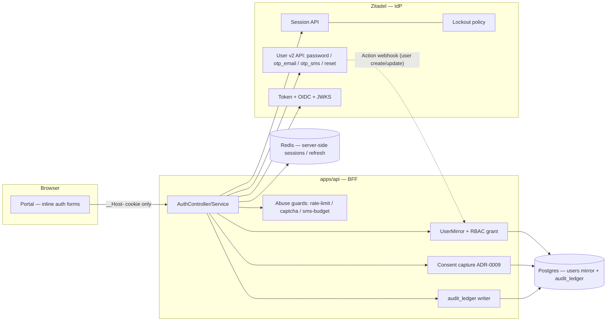
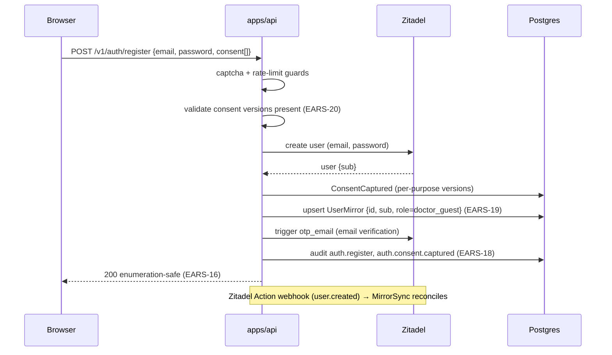
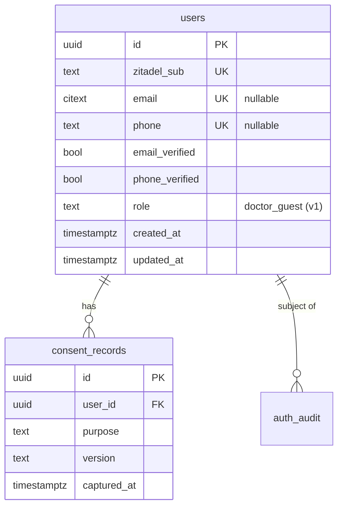

# 003 — User authentication (Design)

## 1. Architecture overview

`apps/api` is a **Backend-for-Frontend (BFF)** sitting between the portal's headless forms and Zitadel. It owns the domain mirror, consent, RBAC role grant, audit, and abuse guards; it delegates every credential operation to Zitadel via the Session / User v2 API. The portal renders inline forms on its own origin (Variant B, ADR-0001 §2) and talks only to the BFF; it never sees a token.



## 2. Native-vs-custom boundary (the hard rule)

Established by research against current Zitadel docs. `apps/api` builds **only** the right-hand column.

| Capability                     | Native Zitadel (consume, do not build)           | Custom in `apps/api` (build)                                                        |
| ------------------------------ | ------------------------------------------------ | ----------------------------------------------------------------------------------- |
| Password verification          | ✅ Session API password check                    | —                                                                                   |
| Token issue/rotate, JWKS, OIDC | ✅ core IdP                                      | BFF orchestration + `__Host-` cookie + server-side refresh store                    |
| Server-side sessions           | ✅ Session API                                   | session↔cookie binding, fingerprint                                                 |
| Email OTP code                 | ✅ `otp_email`                                   | request/verify orchestration                                                        |
| SMS OTP code                   | ✅ `otp_sms` (challenge on session create)       | toll-fraud guard + daily budget                                                     |
| Password reset / forgot        | ✅ User v2 reset code                            | enumeration-safe wrapper                                                            |
| Email/phone verification       | ✅ verification code / urlTemplate               | mirror flag sync                                                                    |
| Account lockout                | ✅ lockout policy (max password/OTP attempts)    | notification email                                                                  |
| Enumeration resistance         | ⚠️ "ignore unknown usernames" (had CVE bypasses) | idempotent responses + timing ≤50 ms + rate-limit backstop                          |
| MFA TOTP / passkeys            | ✅ (not used by `doctor_guest` in v1)            | — (seam only)                                                                       |
| Domain user mirror + RBAC      | —                                                | `users` table, `doctor_guest` grant, reconciliation                                 |
| Consent (ADR-0009)             | —                                                | per-purpose versioned capture                                                       |
| Domain audit ledger            | — (Zitadel has its own event log)                | `audit_ledger` writer (ADR-0003 §6)                                                 |
| Granular rate-limit (per-ASN)  | — (only instance quotas)                         | edge/BFF limiter                                                                    |
| Bot protection / CAPTCHA       | —                                                | `BotProtection` iface + SmartCaptcha adapter (token verify) + portal widget (§10.1) |

## 3. BFF session & token model (ADR-0001 §6)

The browser holds only the `__Host-` session cookie. The BFF holds the OIDC tokens server-side, keyed by the cookie's `sid`.

```mermaid
sequenceDiagram
  participant B as Browser (portal form)
  participant API as apps/api (BFF)
  participant Z as Zitadel
  participant R as Redis
  B->>API: POST /v1/auth/login {identifier, password}
  API->>API: rate-limit / captcha guards (EARS-13,17)
  API->>Z: create session + password check
  Z-->>API: session token (check ok)
  API->>Z: complete OIDC exchange (authorize w/ session)
  Z-->>API: access JWT (15m) + opaque refresh (rotating)
  API->>R: store {sid → refresh, zitadel_session_id, fingerprint}
  API-->>B: Set-Cookie __Host-sid (HttpOnly, Secure, SameSite=Lax); 200 (no token in body)
```

- **Fingerprint binding** (ADR-0001 §6): session metadata stores `hash(UA + IP/24 + accept-language)`; mismatch invalidates the session.
- **Refresh rotation** (EARS-9): each refresh is single-use; rotation issues a new refresh and revokes the old. A replay of a consumed refresh invalidates the whole chain (RFC 6819) and revokes the session.
- **No cross-subdomain cookie**: each app holds its own `__Host-` cookie; cross-app SSO continuity (future) is OIDC silent re-auth at the IdP, not a shared cookie (ADR-0001 §6).

## 4. Registration cascade (EARS-1/2, 19, 20, 3, 26)

**Email-primary registration (GH #202).** Registration takes **email + password** only — email is the primary registration identifier. Zitadel cannot create a login-capable human user without an email: the constraint is invariant across `AddHumanUser` v1/v2 and the newer `CreateUser` `/v2/users/new` (confirmed live and in `main` — `SetHumanEmail email … [(validate.rules).message.required = true]`, phone optional), and an empty-string email is rejected too. There is therefore **no phone-only registration channel** (it is removed, not hidden — no synthetic/derived email workaround). Phone is a **post-registration secondary identifier** (attach + verify after the account exists — a future increment); phone as a _login_ identifier (EARS-5) and SMS-OTP _login_ (EARS-7) are unaffected, operating on an already-attached verified phone. Registration verification is consequently **email-only** (EARS-3); EARS-4 phone verification is reserved for the future secondary-identifier path. The `register()` SMS-budget gate (the old phone-verify-at-register branch) is removed; `SmsBudgetService` still gates the SMS-OTP _login_ send (EARS-14).



The Action webhook is the authoritative sync trigger; the inline upsert is an optimization so the mirror exists immediately. The periodic reconciliation sweep (EARS-19) closes any webhook-miss divergence.

**Read-path mirror self-heal — the third sync layer (GH #709, EARS-26).** The `users` row is a **mirror** of the Zitadel account (§5) — Zitadel is the source of truth — so an authenticated request is itself a sync trigger: when the session subject resolves (the IdP already vouched for the caller) but no mirror row exists for its `zitadel_sub`, the session auth hook lazily re-materializes the row **before the handler runs** (`MirrorSelfHealService`: a targeted `IdpClient.getUser(sub)` read → the same idempotent `UserMirrorService.upsert` + `doctor_guest` re-grant the webhook/sweep perform), and the request proceeds as normal. This turns the **orphaned-session** state into a non-event. Without it the state is reachable in production — a webhook miss/lag while the sweep schedule is an unwired seam (#119/#220), or a mirror row lost while IdP sessions for the sub stay alive — and its symptom is a silent dead loop: a mirror-backed authed read throws `UnknownSubjectError` → the generic 401 (EARS-16, deliberately non-disclosing) → the portal maps it to `authenticated: false` → `redirect("/login")` → the #697 auth-surface redirect sees the live IdP session → `redirect("/account")`, with each rule individually correct. Layering: **webhook primary, sweep backstop, read-path self-heal lazy** — the sweep still owns directory-wide divergence (the heal fires per-sub, on demand). Properties: the presence probe is one indexed `SELECT` on the unique `zitadel_sub` per authenticated request (accepted at Phase-0 scale; no in-process positive cache, so a row lost mid-run heals on the very next request); the heal is **fail-soft** (a sub the IdP no longer knows, an identifier-less machine account — not a `doctor_guest` candidate under `users_email_or_phone` — or any IdP/DB fault heals nothing, logs, and the request proceeds to the handler's fail-closed 401, never a 500); enumeration safety (EARS-16) is untouched because the heal fires only for an IdP-vouched subject, and like the webhook/sweep upserts the healed row carries no consent record (EARS-20 governs the registration cascade, not mirror re-materialization). Residual (accepted): a session whose sub was **deleted at the IdP** still cannot heal and keeps today's 401-on-mirror-reads behavior — terminal invalidation of such sessions is future work if the state ever proves reachable outside a dev-stand wipe.

**`createUser` failure taxonomy — never a 500 for a deterministic IdP rejection (GH #202).** The IdP `createUser` port distinguishes three outcomes so `register()` can map each to an enumeration-safe client response: (a) a duplicate identifier → `alreadyExisted` (the EARS-16 hinge, no throw); (b) a **deterministic 4xx `invalid_argument`** (a malformed/unacceptable request the IdP rejects before creating anything — e.g. the now-removed phone-only shape, or any future bad-argument) → the typed `IdpInvalidArgumentError`, which `register()` maps to the generic, enumeration-safe `GENERIC_FAILURE` (a 4xx, NOT an existence oracle, EARS-16) — the same precedent as the password-policy → 422 mapping; (c) a genuine infra fault (5xx / network) → the typed `IdpUnavailableError`, mapped to a 503 "service temporarily unavailable" (actionable-errors rule: 5xx/net → "unavailable"). Any rejection that is deterministic and client-shaped must never surface as a bare 500. The in-memory `FakeIdpClient` mirrors the real adapter's create-time invariants — a no-email create raises the same `IdpInvalidArgumentError` — so a future phone-only regression fails in unit tests, not only live (fake no more permissive than real).

**Post-verify auto-login — client orchestration, no new session path (#175).** The EARS-1/3 journey is register → verify-channel-ownership → signed-in. `/v1/auth/verify` (EARS-3/4) proves the registrant controls the email/phone and mints **no session** — by contract it is a channel-verification primitive, not an authentication check, and the BFF holds no credential at verify time. To carry the freshly-registered user straight into `/account` without re-typing what they just set, the **portal** (not the BFF) orchestrates a replay: the password entered at `/register` is held in a **volatile, module-scoped in-memory store** in the client (`apps/portal/lib/pending-registration.ts`) across the `/register → /verify` SPA navigation, and on a successful verify the portal replays the **real EARS-5 password login** (`POST /v1/auth/login`) — which is what establishes the EARS-8 `__Host-ds_session` cookie. The session therefore still comes from the EARS-5 login, **not** from any new `/auth/verify` session-minting path; the `/v1/auth/verify` API contract is unchanged. Security envelope: the held password lives in client memory **only** for the in-flight registration; is **never** written to the URL, `localStorage`/`sessionStorage`, a cookie, or any persisted store (only the non-secret identifier rides the `/verify` query as before); is **atomically consumed-and-wiped on verify success** (the take is single-shot — the slot is cleared whether the replayed EARS-5 login then succeeds or throws); **self-expires after a short TTL** (5 min), which deterministically bounds how long an abandoned hold can linger; is **overwritten by a new registration** (single slot, cleared at the top of the register submit); and is **dropped on a hard reload** of `/verify` (re-loading the bundle clears the module store) — the latter being the desired property, after which the portal falls back to routing to `/login` for a manual sign-in. Abandonment is bounded by the TTL rather than an unmount handler: the password is stashed before the `/verify` navigation, so a `/verify`-mount cleanup would (under React Strict Mode's double-invoked effects in dev) wipe the slot before the user types the code and break the auto-login; the age-based TTL has no such hazard. (A server-side verify-session was analysed and rejected: the verify code is a user-email/phone-verification primitive and no credential is available BFF-side at verify time, so the clean path is the client replay.)

**Post-reset auto-login — BFF session mint, mirrors the login convergence (GH #221, EARS-12).** Unlike the post-verify journey above (where the BFF holds no credential at verify time, so the portal replays the login), the **password-reset-complete** call DOES carry a credential — the just-set password — so the BFF mints the session directly, with no client replay. On a successful `POST /v1/auth/password/reset/complete` the BFF (1) keeps the global force-logout (`revokeAllForSub` — every PRIOR session of the subject is revoked so the credential change leaves nothing stale behind) and the `PasswordResetCompleted` audit, then (2) trades the IdP's now-checked session for tokens via the **same `SessionService.establish` hop login uses** (design §6 convergence — the cookie/token logic exists once), emitting the identical session-created `LoginSucceeded` (method `password`) audit row, and sets the `__Host-ds_session` cookie. The response body stays token-free (`{status:"reset_completed"}`, EARS-8). The IdP port's `completePasswordReset` therefore returns a **checked `IdpSession`** (the same shape `passwordLogin` yields) instead of a bare `{sub}`; the real adapter creates the post-reset session by running a `POST /v2/sessions` password check with the new password, and the `FakeIdpClient` is no more permissive (it likewise hands back a checked session only after the code+password succeed). The portal `/reset` page routes to **`/account`** on success (not `/login`). A bad/expired code or unknown identifier is unchanged: the same generic 400, no session minted, no oracle (EARS-16).

**Auth rate-limit — relaxed ceiling + forgive-on-success (GH #222, EARS-13, ADR-0001 §7).** The per-user window is raised **5 → 10 / 15 min** so a normal forgot-password → login recovery flow (a reset request, a few login typos, then success) is not throttled mid-journey; per-IP (20 / 15 min) and per-ASN (100 / h) are unchanged. Additionally, a **successful** login AND a **successful** reset-complete **forgive** (clear) the per-user window for that identifier — the controller calls `RateLimitService.reset({ip, identifier})` on success, keyed identically to how the guard consumed the slot, **alongside** the existing `loginChallenge.reset(ip)`. Only the per-user window is forgiven; the per-IP / per-ASN windows are deliberately left intact, so a success cannot refund an origin's / network's broader budget (an attacker spraying many identifiers from one IP still hits the per-IP ceiling). The throttled response stays generic (no account-existence oracle).

**OTP auto-submit on completion (#175).** Every fixed-length one-time-code field in the portal submits the moment the final digit lands — the length is known, so the manual click is redundant. Two surfaces, two widgets, one rule. **Registration `/verify` (EARS-3/4)** uses the design-system slotted `InputOTP` (6 digits) and its native `onComplete` callback to fire the submit. **Login OTP `/login` (EARS-6/7)** uses a plain numeric `Input` — the Zitadel login email/SMS code is a fixed **8** digits (`LOGIN_OTP_LENGTH`), longer and looser than the registration code, so the slotted widget is the wrong control — and auto-submits via an `onChange` completion check that fires once the digits-only value reaches that length. Both keep the **explicit submit button** for a11y / fallback, and both share one **double-submit guard**: the request is skipped while a submit is already in flight (`formState.isSubmitting`), so `onComplete`/length-trigger, a manual button click, and the Enter key cannot fire the request twice and a trailing keystroke or paste cannot re-fire it. (The login-OTP request body remains `code: z.string().min(1)` at the BFF — the 8-digit length is a Zitadel runtime fact the portal uses only to decide _when_ to submit, not a tightened contract.)

**`doctor_guest` RBAC grant — Zitadel project-role authorization (#157).** The "RBAC role grant" (§3, §5) is performed as a **Zitadel project-role grant**: on register the BFF authorizes the new user for the `doctor_guest` project role via `POST /management/v1/users/{sub}/grants` (`{ projectId, roleKeys:["doctor_guest"] }`), and re-grants it idempotently on the EARS-19 Action webhook and on the reconciliation sweep. The OIDC token's `urn:zitadel:iam:org:project:roles` claim — which Zitadel asserts **only for granted roles** — is the authz source of truth the `AuthzGuard` reads (ADR-0001: Zitadel is the identity/authz authority). The `users.role` column written into the mirror is a **downstream projection**, not the authz authority: it must never be read for authorization. Without the grant a registered+verified user's token carries an empty roles claim and the guard denies with 403. The project that owns the role is configured via `IDP_PROJECT_ID` (the `PROJECT_ID` emitted by `infra/dev-stand/idp/provision.sh`); absent it the grant fails closed, consistent with the other OIDC-config-gated adapter paths.

**Account-exists notice on duplicate registration — uniform response, private inbox branch (GH #207, EARS-23).** The `alreadyExisted` branch above is the EARS-16 hinge: a register on a known email returns the **identical** `pending_verification` and creates nothing. Taken literally that stranded the legitimate owner — the portal routed them to the `/verify` "enter your code" screen for a code that, by design, is never sent (no `requestEmailVerification` on this branch). Enumeration resistance forbids the _form_ from disclosing "you already have an account" (that is precisely the oracle EARS-16 protects, sensitive on a medical platform), so the existing owner's correct path is delivered **privately, in their inbox**: on the `alreadyExisted` branch the BFF sends an **account-exists notice** email (a sign-in / password-reset prompt — **no** verification code, login code, token, or account/PD created). The API response, status, and timing are unchanged, so the branch stays externally indistinguishable. Properties that keep it enumeration- and abuse-safe: the send is **fire-and-forget** (dispatched off the response path, so SMTP latency never becomes a timing oracle and a provider outage cannot stall or differentiate the response — it only logs); it is **throttled per-address** via an **ephemeral** Redis marker keyed `register-notice:<HMAC(email, AUDIT_IDENTIFIER_PEPPER)>` with a short TTL (the #141 audit pepper makes the key non-reversible; the marker self-expires and is never a persistent, queryable per-email record), so the form cannot be weaponised to flood a victim's inbox; and the branch still writes **no** account, consent, or `auth.register` ledger row (a duplicate registers nothing, so nothing is owed — consistent with #128's silent-refusal precedent). The new-account branch is unchanged (Zitadel sends the verification code). The notice is sent through a **new BFF transactional-email channel** — a `MailerModule` (`Mailer` port + `SmtpMailer` adapter over `nodemailer`, + a `FakeMailer` whose create-time invariants mirror the real adapter so a regression fails in unit tests, not only live). This deliberately separates concerns: **Zitadel owns identity-credential emails** (verification / OTP / reset codes — the ones carrying a secret), while the **BFF owns product/security notices** (account-exists here; lockout and future welcome/security mails later) — the ones that must never carry a secret. The notice is the first consumer; it degrades to a logged no-op when the selected transport's host is unconfigured, like the other infra-gated adapter paths. **The transport honors the `email-delivery-real` Unleash flag (#209), mirroring the Zitadel `DeliveryReconcileService`:** the `SmtpMailer` carries a **dual transport** — the **Mailpit intercept** (`MAILER_SMTP_*`, the dev/test default) and the **real relay** (reusing the `IDP_SMTP_REAL_*` creds, where `IDP_SMTP_REAL_HOST` carries `host:port` and `secure` is derived from port 465) — and selects per send from the flag read **live** (env default `EMAIL_DELIVERY_MODE === "real"` as the Unleash-unreachable fallback). So **one** operator flag flip moves **both** Zitadel's identity-credential channel and the BFF notice between Mailpit-intercept and the real relay with no restart, rather than the former per-channel, per-environment (dev=Mailpit / prod=real) toggle. Fail-soft: flag ON but `IDP_SMTP_REAL_*` unconfigured ⇒ warn and use the intercept (never throw, never silently drop — the reconcile's "never activate the wrong provider" safety).

**Resend registration verification code — enumeration-safe wrapper (GH #318, EARS-25).** The existence-agnostic `/verify` screen (§8.3, EARS-24) needs a way to re-send the registration email code without the held password (re-`register` is the EARS-23 path and needs that password). `POST /v1/auth/verify/resend` takes `{ identifier }` (the email) and returns the same enumeration-safe ack on every path. It is a **new, identifier-keyed IdP port method** — `IdpClient.resendEmailVerification(identifier)` — mirroring how `requestPasswordReset(identifier)` (EARS-11) and `requestEmailOtp(identifier)` (EARS-6) already work: it resolves the identifier → Zitadel `sub` internally **without disclosing existence** and re-issues the `otp_email` code (the same native `POST /v2/users/{id}/email/resend` send EARS-1/3 use) **only** for an existing, **unverified** registrant; an unknown identifier, or an already-verified one, is a silent no-op. (The pre-existing `requestEmailVerification(sub)` is _not_ reused directly: it takes a resolved `sub` from the EARS-1 cascade — where the BFF just created the user — whereas this endpoint receives a raw identifier and the port carries no other targeted identifier→sub lookup (`listUsers` is the reconcile-sweep enumerator, not a per-request lookup), so the enumeration-safe resolution must live in its own port method.) The method **never throws or branches on existence** and returns a server-side boolean — `true` only when a code was actually issued — that the caller uses solely to decide whether the `otp.sent` ledger row is owed; the boolean is never reflected into the response. The response, status, and timing are therefore identical across all three paths (EARS-16, ≤ 50 ms). The endpoint sits behind the EARS-13 rate-limit guard (and the EARS-17 bot-protection surface as an abuse-prone unauthenticated path); it creates no `users`/consent row and appends an `otp.sent` ledger row (EARS-18) **only when a code is actually issued** — the no-op paths write nothing, so the ledger is not itself an existence oracle. The `FakeIdpClient` implements the same method and is no more permissive than the real adapter on the unverified-vs-verified distinction.

## 5. Data model (mirror + consent + audit)



- CHECK constraint `email IS NOT NULL OR phone IS NOT NULL` (ADR-0001 §3).
- `consent_records` is the 003-local minimal slice; the full ADR-0009 consent subsystem (withdrawal, version migration) supersedes/extends it later — 003 references, does not own, the subsystem.
- `auth_audit` rows are the `audit_ledger` projection (ADR-0003 §6); PD columns store masked values, full values only in the encrypted ledger.

## 6. Login variants

- **Password (EARS-5):** session create + password check → §3 exchange.
- **Email-OTP (EARS-6):** `RequestEmailOtp` → Zitadel `otp_email` send; `LoginWithEmailOtp` → verify code in session → §3 exchange. The v1 passwordless email path; **no magic link**.
- **SMS-OTP (EARS-7):** `RequestSmsOtp` (gated by the toll-fraud guard, EARS-14) → `otp_sms`; verify → §3 exchange.

All three converge on the single session-establishment step (§3 / EARS-8), so the cookie/token logic exists once.

## 7. Seams (built as extension points, not implemented)

Each seam is a documented insertion point so the consuming vertical is additive, not a rewrite of this flow:

- **MFA** — the session JWT already carries `mfa`; a `role → mfa_required` policy check sits (as a no-op for v1 self-serve roles) right after the primary-auth step in §3. First mandatory-MFA role (admin/ops `platform_admin`; v2 `expert`) builds TOTP enroll/verify and flips the policy.
- **Legacy reactivation (ADR-0001 §9)** — the Directual first-login flow is composed of EARS-6 (email-OTP) / EARS-7 (SMS-OTP) + consent capture (EARS-20) + mirror sync (EARS-19) + an optional password-set. 003 exposes these; the cutover spec orchestrates them.
- **Mobile** — the §3 exchange swaps the `__Host-` cookie for device-id-bound refresh + Keychain/Keystore storage; the BFF endpoints are transport-agnostic.
- **Social OAuth (v2)** — a provider-redirect login converges on the same session-establishment step; account linking requires verified email on both sides (ADR-0001 §6.2).
- **Step-up (ADR-0001 §10)** — `StepUpGuard` + `acr=mfa-fresh` plug into the same JWT claim set when the first high-risk `doctor_guest` endpoint appears.
- **Magic-link** — a thin transport that emails a link wrapping the native one-time secret, verified through the same `otp_email` path; requires the ADR-0001 §8 security review.

## 8. UI model — Login v2 considered & rejected (recorded so it is not re-litigated)

Zitadel ships a self-hostable MIT Login v2 (Next.js, on the Session API) runnable on a custom domain. It would minimize custom UI code. It was **rejected for v1** because it implies a redirect hop to an auth subdomain, which contradicts ADR-0001 §2's deliberate choice of seamless inline forms for _credentials_ (the redirect model is accepted only for _social_ in §2). Variant B (headless inline forms over the BFF) keeps the chosen UX; the auth **primitives** stay native regardless of which UI shell is used, so "headless inline" is not "reinventing native". Login v2 remains a fallback note if the custom form layer proves more expensive than expected (would require an ADR-0001 §2 revision).

### 8.1 UI language & i18n structure (EARS-21)

The portal UI renders in **Russian (primary)** — Doctor.School is an RF/Russian-speaking product (EARS-21). The auth surface carries **no hardcoded user-facing strings**: every label, description, button, placeholder, the consent line, the bot-protection note, and the inline error copy live in a typed message catalog (`apps/portal/messages/ru.json`), consumed through `next-intl` (Next-16-compatible — declares `next ^16` as a peer). `next-intl`'s `getRequestConfig` is pinned to a **fixed `ru` locale**; `<html lang>` is driven by that resolved locale.

Decision recorded: **RU-only now, no user-facing language switcher.** The i18n infrastructure is present so a future locale is **purely additive** — drop a `messages/<locale>.json`, resolve the locale from a cookie/header in `i18n/request.ts`, and surface a switcher; **no auth component is re-touched** because all copy already comes from the catalog. Because it is single-locale with no switcher, we deliberately **do not** adopt `next-intl`'s `[locale]` segment routing or locale middleware (that would churn every route for a capability not yet shipped) — the minimal non-routing `NextIntlClientProvider` + fixed-locale request config is the framework-idiomatic fit.

Validation messages from the `@ds/schemas` zod SSOT are English (the package is shared with `apps/api`, where a Russian DTO error would be wrong), so the portal localizes them at the form boundary: a small zod **error map** (`apps/portal/lib/use-localized-resolver.ts`) keys off the structured zod **issue code/shape** (not the English text) and resolves it to the `errors.validation.*` RU catalog. The canonical RU error copy authored in `errors.*` is the source consumed by the error-display rule (#175). Decision-debt seam: if `@ds/schemas` later adopts a first-class i18n message strategy, the resolver collapses to a pass-through.

**IdP-rendered notifications (out of `next-intl`'s reach).** The portal catalog above only governs strings the portal renders. The notification bodies Zitadel itself renders (registration InitCode, email-verify, password-reset, email-OTP, SMS-OTP) come from its message-text templates, so they are localized Zitadel-side, not by `next-intl`: the IdP instance default language and allowed-languages are locked to `ru` (provisioned in `infra/dev-stand/idp/provision.sh`, #177/#181). Most types reuse Zitadel's bundled `ru` copy; the **SMS-OTP (`verifysmsotp`)** body is the exception — it is explicitly overridden (ru + en) with branded copy `Doctor.School: код для входа - {{.OTP}}, никому его не сообщайте` (no OTP-jargon, dev-domain, expiry, or WebOTP-autofill line that the bundled default leaked), provisioned in the same script (#226), using the `{{.OTP}}` code variable. Known benign Zitadel quirk: each SMS-OTP send logs 6 `VerifySMSOTP.*` "not found in language ru" warnings (the Title/PreHeader/Subject/Greeting/ButtonText/Footer email-template label fields, which do not exist for the SMS message type in any language's i18n bundle, including `en`). They are not caused by the branding, are not fixable via the message-text API (the SMS type persists only `text`), and are purely cosmetic. Upstream: Zitadel issue [#9636](https://github.com/zitadel/zitadel/issues/9636) — originally blocked the send, since downgraded to a non-blocking warning. Optional log-cleanup tracked in #230.

### 8.2 Field-level client validation & input mask (EARS-22)

Every portal user-input field declares the client-side validation rule and input mask relevant to its data type — email shape, E.164 phone with mask, fixed-length numeric OTP, password policy — and surfaces obviously-malformed input before submit with localized (RU) copy from the §8.1 catalog (`errors.validation.*`). This is a **UX affordance only**: it is intentionally redundant with the server check, never a substitute for it — the BFF/IdP stays the credential authority (§2) and the `@ds/schemas` request contracts stay loose (the login/reset shape guards remain permissive, §9 #147), so a client-rejected value carries no security weight and a field with no relevant rule declares "none" with a one-line reason rather than inventing one.

Motivated by two identical live defects — #192 (`/login` identifier accepted invalid input, no mask) and #196 (`/reset` identifier, same) — the rule is **enforced**, not merely documented: #197 lands the semantic field primitives (email/phone/OTP/password inputs that carry their validation + mask) plus a custom ESLint gate that flags raw `<input>` on auth forms. The iteration-end checklist and Mode-(a) review focus pick up the per-field reject/accept browser check until that gate ships (and as defense-in-depth after).

### 8.3 Post-registration screen — existence-agnostic "check your email" (EARS-24)

Because the BFF returns the identical `pending_verification` for a new and an already-registered email (EARS-16, §4), the portal **cannot** know which visitor it is showing — so the post-register `/verify` screen must serve **both** without branching on existence. It is framed as **"check your email"** and presents two **co-equal** affordances rather than a single imperative "enter your code":

- **(a) Enter the email code** — the new registrant's path, unchanged: the slotted `InputOTP` auto-submits on completion and the portal replays the held password for post-verify auto-login (#175/#194). The common case stays slick.
- **(b) Sign in / Reset password** — prominent actions (not a footnote link) for the already-registered owner, routing to `/login` (where email-OTP login is one tap — a code sent because the user asked) and `/reset`.

The screen never inspects or infers account existence; the existing owner's path is reinforced **out-of-band** by the EARS-23 notice email. This is the on-screen half of the duplicate-registration fix (#207): the form leads everyone to the same honest place, and the per-case routing happens privately — in the inbox (EARS-23) or by the user's own choice of the co-equal sign-in affordance — never by the form disclosing existence. All copy is sourced from the §8.1 message catalog (RU).

## 9. Decision-debt for ADR-0001 (separate adr-revision follow-up)

Surfaced per AGENTS.md §6; **not** changed inside this spec-authoring:

1. **§8 magic-link wording** — "custom build ~1–2 days" predates native email-OTP. The one-time secret is now native (`otp_email`); only the clickable-link transport is custom. Refine the wording; keep the mandatory security review for the link form.
2. **§7 enumeration/lockout** — record the Zitadel "ignore unknown usernames" CVE bypasses (CVE-2024-41952 flag bypass, CVE-2025-57770 "select account" page, CVE-2026-23511 reset-flow + Login UI V2) and pin a patched Zitadel release (≥ 4.9.1 / ≥ 3.4.6) in the DoD; our rate-limit + idempotent responses are the documented backstop (already consistent with §7).
3. **§2 Login v2** — note Login v2 as considered-and-rejected for credentials, so the choice is not re-opened by future contributors.
4. **Password-policy SSOT (#147) — decided.** The `@ds/schemas` creation-password contract mirrors the Zitadel **default** complexity policy (`min8 + upper/lower/digit/symbol`) as a _baseline, not a ceiling_ — Zitadel remains the ultimate credential authority (§2, ADR-0001 §7) and may be configured stricter. Login keeps a permissive shape guard (`min8`, no complexity) so legacy credentials predating the policy can still authenticate. A residual stricter-than-baseline rejection (a Zitadel configured beyond the mirrored default) surfaces as a generic enumeration-safe **422**, never a 500 (verified live: Zitadel v4.15 checks complexity before uniqueness, so the weak-password response never correlates with account existence). See #147.

## 10. Error handling & security notes

- All failure responses on register/login/reset are generic and timing-equalized (EARS-16); specific reasons live only in `audit_ledger`.
- **Actionable client error rule (#175).** The portal maps a caught auth failure to user copy via a single shared helper (`apps/portal/lib/auth-error-message.ts`) that branches on the `AuthError.status` the BFF returns, reconciling actionability with EARS-16: **non-oracle** failures get a specific, truthful message — **429** → "too many attempts" (the throttled response is generic and names neither the breached dimension nor the account — a refusal reveals no account existence even on the per-user window, EARS-13/16) and **5xx / network / transport** → "temporarily unavailable" (availability, not an oracle) — while the **authentication outcome** (400/401: wrong credential, unknown account, failed factor) stays the **per-action generic** string, so the UI never leaks an existence oracle. The rule is applied uniformly across every portal auth action (register, verify, login, OTP request/verify, reset request/complete). All copy is in the `errors.*` RU catalog (§8.1).
- The BFF never logs raw credentials, codes, or tokens; PD is masked (ADR-0001 §7, ADR-0003 §6).
- SMS sends pass the budget circuit-breaker before reaching the provider (EARS-14); breaker-open returns a generic "try later".
- Bot protection gates registration, reset, and post-failure login (EARS-17) — see §10.1.
- Pinned, patched Zitadel release is a Definition-of-Done item (Constraints).

### 10.1 Bot protection (bootstrapped here, behind an abstraction)

003 is the first consumer of bot protection on the platform, so it bootstraps the mechanism rather than depending on a separate package (no other consumer yet). Two halves:

- **Backend** — a `BotProtection` provider interface (`verify(token, action, clientIp) → ok`) with a Yandex SmartCaptcha adapter, exposed as a NestJS `BotProtectionGuard` applied to the abuse-prone endpoints. The interface keeps the provider swappable (ADR-0001 open-q #7: SmartCaptcha default, alternatives → DSO-26) without touching call sites.
- **Frontend** — the SmartCaptcha widget rendered on the portal registration / reset / post-failure-login forms (in 003's Variant-B surface), emitting the token the guard verifies.

Policy (which surfaces, when) is EARS-17; mechanism lives behind the interface so a later vertical needing bot protection on a non-auth surface reuses it without a rewrite.

## 11. Open questions / known frictions

- **Endpoint-authz matrix bootstrap — resolved: established here.** 003 establishes the gate and the metadata convention (ADR-0001 design §2.5): the linter lives at `tools/lint/endpoint-authz-lint.ts` (invoked as `pnpm lint:endpoint-authz`) and runs green in CI as the dedicated `endpoint-authz` job (`.github/workflows/ci.yml`). No preceding engineering-task was required.
- **OTP-login live wiring deferred (passwordless paths only).** §6's email-OTP (EARS-6) and SMS-OTP (EARS-7) login variants are implemented and verified only against `FakeIdpClient`: the real `ZitadelIdpClient` OTP-login methods (`requestEmailOtp` / `loginWithEmailOtp` / `requestSmsOtp` / `loginWithSmsOtp` in `apps/api/src/auth/idp/zitadel.idp.ts`) are still **fail-closed seams** that reject pending live wiring. Password login (EARS-5/8/9) and email/phone verification **are** live-wired and verified against the dev-stand Zitadel v4.15 (#142/#146/#150) — only the passwordless OTP-login dance is the unwired seam. Follow-up: the register-verify SMS budget send-site (debt #128) plus a dedicated OTP-login live-wiring task.
- **Consent capture surface** — confirm the ADR-0009 capture API shape; 003 ships a minimal `consent_records` slice if the subsystem is not yet built.
- **Reconciliation depth — resolved: full depth shipped (#753).** 003 ships the webhook upsert, the periodic sweep backstop (`ReconcileService.sweep()` on a config-driven `ReconcileScheduler` interval, `RECONCILE_SWEEP_INTERVAL_MS`, with a manual ops trigger — #119), the read-path self-heal (EARS-26, #709), **and** the full reconciliation depth:
  - **Conflict resolution — Zitadel-wins.** Zitadel is the identity SoT (ADR-0001), so the sweep overwrites the mirror's identity fields (`email`, `phone`, `email_verified`, `phone_verified`) field-by-field; `role` (the local authz projection), `id`, `created_at`, and `deactivated_at` are **mirror-owned** and preserved (`UserMirrorService.upsert`). When an upsert actually changes an identity field on an existing row, the sweep appends an `auth.reconcile.divergence` audit event carrying only the **changed field names** (never the values — PD-minimal, ADR-0001 §7 / ADR-0003 §6).
  - **Soft-delete / deactivation.** A user Zitadel reports **inactive**, or one **absent** from the (fully paginated) enumeration entirely (hard-deleted at the IdP), has its still-active mirror row soft-deleted (`users.deactivated_at = now()`) and is not re-granted `doctor_guest`; the absent-row pass is skipped on an empty enumeration (an outage must not read as "everyone deleted"). Rows are **never hard-deleted** — the `audit_ledger` / `consent_records` / `registrations` / session references and the `users_email_or_phone` CHECK require identifiers to persist.
  - **Reactivation.** A soft-deleted user that reappears active in Zitadel is restored (`deactivated_at` cleared) on the next upsert — symmetric convergence in both directions.
  - `deactivated_at` is a projection flag, **not** an authz gate: authz stays Zitadel-token-driven (a Zitadel-deactivated user already cannot obtain tokens). Hard-purge / GDPR erasure of soft-deleted rows is out of 003 scope (no erasure requirement in 003) — a future product/legal concern, not open decision-debt.
- **Zitadel Action webhook auth — decided: shared secret.** The webhook endpoint (`POST /v1/auth/zitadel/webhook`, EARS-19) authenticates Zitadel with a **shared secret** presented in the `x-zitadel-webhook-secret` header and checked against `IDP_WEBHOOK_SECRET`; an unset secret or a mismatch fails closed (`401`), so an unauthenticated mirror-write surface is never opened by default. mTLS is **rejected for v1**: Zitadel Actions v2 sends a plain HTTP POST with configurable static headers (the documented mechanism for signing/authenticating an Action target), and the BFF terminates TLS behind the platform reverse proxy (Caddy, engineering-readiness spec) rather than presenting a client cert per request — a per-Action client-cert handshake is neither what Zitadel Actions offer nor proportionate when the webhook is idempotent (it only triggers a reconciling upsert the periodic EARS-19 sweep would also close) and carries no secret beyond the user `sub`. Hardening that feeds #119: (a) rotate the secret via the platform secret store (Vault, engineering-readiness spec), not a long-lived static value; (b) replace the constant-string `!==` check with a constant-time compare (`crypto.timingSafeEqual`) to remove the timing side-channel; (c) bind the Action to the trusted LAN/zone target so the surface is not internet-reachable. The dev-stand Zitadel Actions config sets the header to `IDP_WEBHOOK_SECRET`; #119 owns provisioning the real Action against a live instance.
