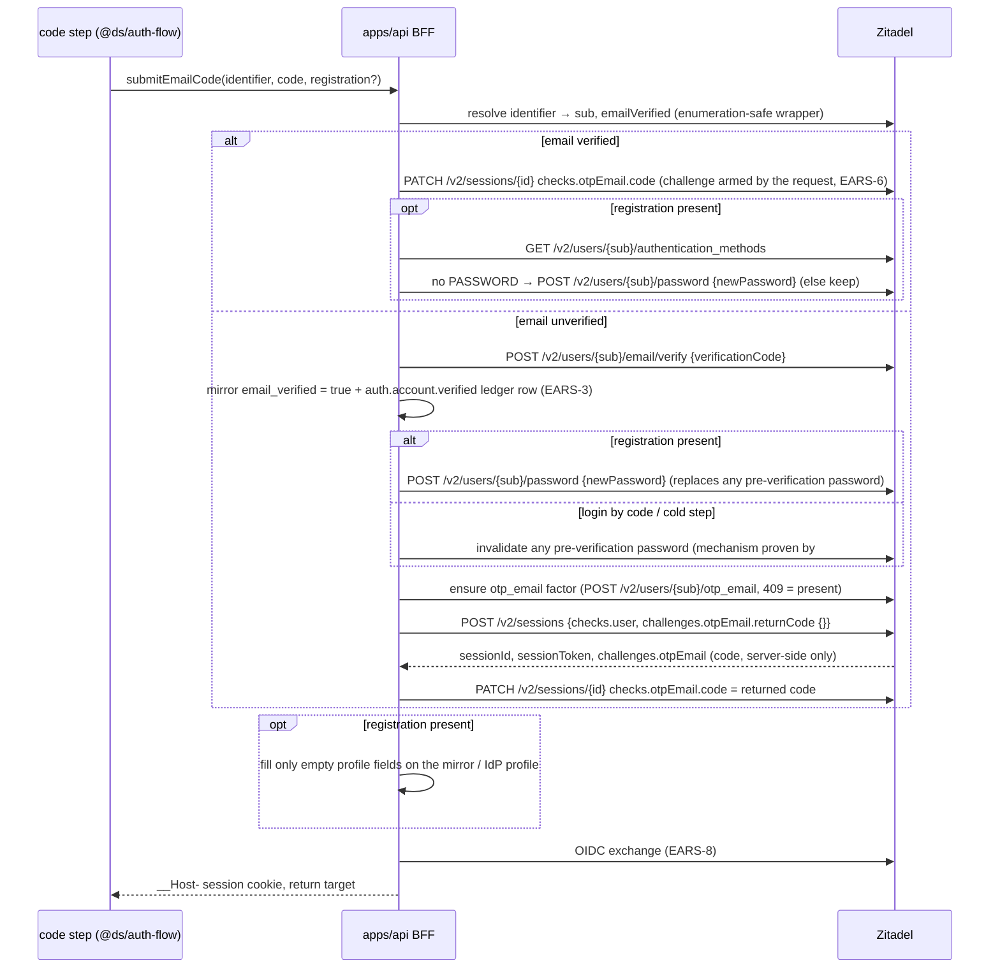
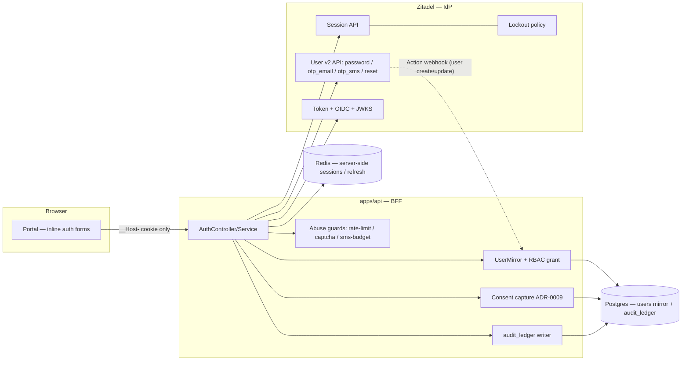
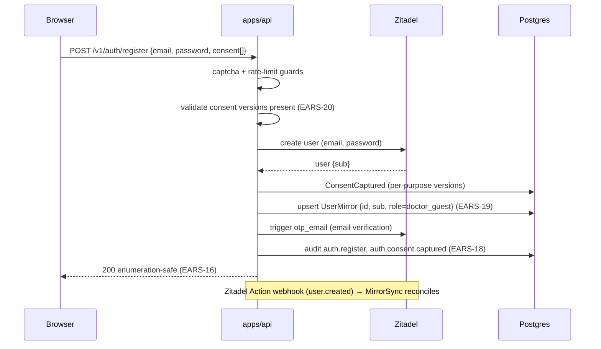
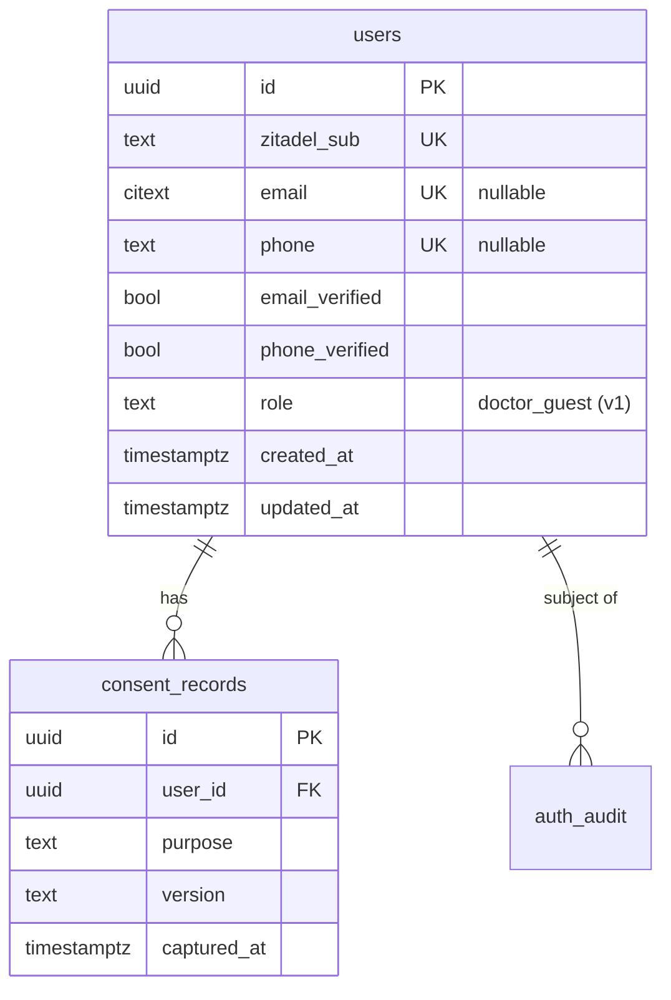
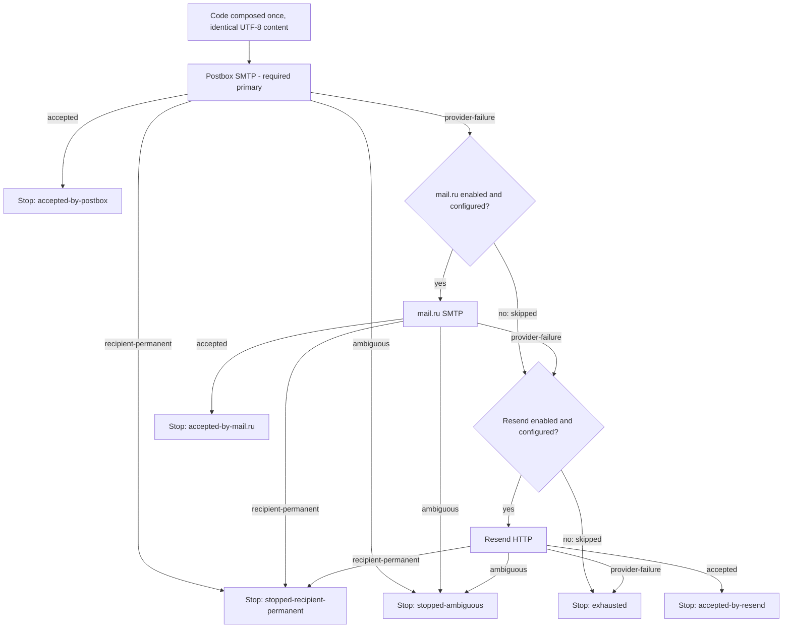

# 003 — User authentication (Design)

## Production amendment — login email through the existing mailer (2026-09-11, #2171 / #2145)

Native login email delivery is running in production. This amendment changes only that delivery/rendering decision in §2, §4, §6, §8.1, §11, §13.2/§13.5 and §14.1/§14.3: their native-login statements describe the deployed baseline, not the target of this fix. The four existing BFF email families already use the approved shared layout. The owner narrowed this increment to the remaining login email and approved proceeding: «Окей, приступай». No provider-chain change or redesign is included; the broader #2144/#2145 acceptance stays open.

The [official Session API guide](https://zitadel.com/docs/guides/integrate/login-ui/mfa) documents return-code delivery; [Create Session](https://zitadel.com/docs/reference/api/session/zitadel.session.v2.SessionService.CreateSession) requires `session.write` and returns `challenges.otpEmail`. For a verified-account email login, `requestOtpChallenge` requests `challenges.otpEmail.returnCode: {}` from `POST /v2/sessions`, with no `sendCode` alternative. Zitadel returns `challenges.otpEmail` server-side and sends no native email. Preserve the existing session ID/token challenge store and subsequent Zitadel verification/OIDC exchange; never generate, persist, log or expose the code in a public response. Missing code/session data sends nothing and retains the enumeration-safe response. SMS and unverified-account recovery are unchanged.

Pass the returned code to a login variant of the existing `Mailer` port, `code-emails.ts` and `email-layout.ts`, then the unchanged `SmtpMailer` delivery route. Preserve the eight-digit token and 300-second lifetime. Subject: `{{code}} — код для входа в Doctor.School`; expiry: «Код действует 5 минут». Reuse the existing greeting, requesting-tab instruction and neutral ignore guidance. HTML and plain text contain the same code/copy and no button, anchor or navigation URL, including the footer. No native fallback send is allowed.

Verification is scoped to this changed login path: meaningful failing regression before implementation; shared layout and no navigation; exact returned-code delivery without a native duplicate; normal session verification and enumeration-safe error handling. Reuse `zitadel-otp-login.e2e-spec.ts` for the installed Session API capability and login proof. Live-render the resulting login email for the applicable Stage-B approval before merge. Provider configuration, activation and three-provider failover are separate work, not prerequisites introduced by this fix.

## Production amendment — staff accounts are users, not participants (2026-09-30, #2456)

The account classification and the mirror role column are running in production. This amendment changes only the `doctor_guest`-only statements in §4 (read-path self-heal) and §12 (`GET /v1/me/profile` authz); the rest of both sections describes the deployed baseline. Requirements: the production amendment of the same date.

- **Authz.** `MeController` declares one `ACCOUNT_ROLES = ["doctor_guest", "platform_admin"]` for `GET /v1/me/profile` and `GET`/`PUT /v1/me/display-name`: still self-only by the session `sub`, no identifier parameter, `fast-path`; `apps/api/docs/endpoint-authz-matrix.md` is regenerated. `event-registrar` alone stays out (044 EARS-19).
- **Staff marker.** `MirrorSelfHealService.ensureMirrored(sub, roles)` receives the session's project-roles claim from both session auth hooks. Its presence probe is `UserMirrorService.findRoleBySub`, one indexed read that answers both «mirrored?» and «current role». When the claim projects onto a different value (`mirrorRoleFromClaims` in `apps/api/src/auth/staff-role.ts`: the first of `platform_admin`, `event-registrar`, `legacy_admin`, `pd_officer`, else `doctor_guest`), `setRole` writes it behind a `role <> target` guard; a freshly healed row is marked in the same pass. The steady state stays one read and no write. `upsert` never touches `role` on conflict, so the webhook and the sweep cannot undo the marker. Every fault stays fail-soft.
- **Participant predicate.** `isParticipant(userId)` in `staff-role.ts` is one `EXISTS` probe on the `users` primary key with `role = doctor_guest`. It applies in `DoctorEventsRepository.countSignUps`, `RegistrationRepository.findEventRoster` and `findEventRosterPage` (rows and total), `PresenceRepository.countLivePresence`, its expiry query and `deriveEventMinutes`. `statistics.countDoctors` already filtered on `users.role`.
- **Rollout.** Staff are onboarded with `doctor_guest` plus the staff role (`apps/docs/content/operations/admin-onboarding.md`, step 5). Existing production staff grants are widened after the release; each staff row flips on that person's next signed-in request.

## Production amendment — one email code (2026-10-02, #2552 / #2553)

Login by code, registration verification and re-registration run in production with two code kinds and two code screens. This amendment changes §2 (one boundary row), §4 (registration ends in a session from the code), §6 (one submission operation), §8.2 (code mask), §8.3 (the `/verify` step, its masked address included), §10 (security notes), §13.1/§13.2 (journeys, the masked `/verify` destination included), §13.3 (the verification mail is no longer the unverified sign-in artifact), §13.4 (the «8-digit login OTPs» contrast), §13.5 (the account-exists notice with «Войти», the «Six digits, 300 s» verified-login row and the shared verification copy for unverified sign-in) and §15.6 (cold step), and the eight-digit statements of the 2026-09-11 amendment; the rest of those sections describes the deployed baseline. Requirements: the production amendment of the same date (EARS-6/7/23/24/25/29/34/39 amended, EARS-41…43, and the lead security decision on pre-verification passwords).

**Code format — six digits (#2636).** Zitadel secret generators `VERIFY_EMAIL_CODE`, `PASSWORD_RESET_CODE`, `OTP_EMAIL`, `OTP_SMS` → `length: 6`, `includeDigits: true`, `includeUpperLetters: false`, `includeLowerLetters: false`, `includeSymbols: false`, set idempotently by `infra/dev-stand/idp/provision.sh` step 8.septies and read back by the production deploy (`tools/deploy/idp-policy.mjs`). Expiries are not changed (`VERIFY_EMAIL_CODE` and `PASSWORD_RESET_CODE` 3600 s, `OTP_EMAIL` and `OTP_SMS` 300 s). The BFF trims the submitted code and refuses anything that is not `^[0-9]{6}$` with the generic failure (EARS-16) before any IdP hop (`@ds/schemas` `VERIFY_CODE_PATTERN`). The shared code field (`@ds/design-system` OTP input, consumed by `@ds/auth-flow`) has six cells, accepts digits only and auto-submits on the sixth digit. A code with letters issued before the converge reached an environment is refused after it; the user requests a new code (resend).

**One submission operation (EARS-41).** The two submit endpoints (registration verify and login-code verify) converge on one BFF operation `submitEmailCode(identifier, code, registration?)`; both storefronts call it from the one code step (EARS-42). `registration` is present only when the step was reached from the registration form and still holds the volatile in-tab password and profile fields; a cold step sends none. Each storefront submits `registration` to the verify door that mirrors its register door: the Academy to `POST /v1/auth/verify` (the `RegisterRequest` consent shape), the doctor storefront to `POST /v1/storefront/doctor/verify` (the 021 `RegisterDoctor` fields, whose consent versions the server stamps exactly as its register door does, 021 EARS-7); both delegate to the one operation.


```mermaid
sequenceDiagram
    participant S as code step (@ds/auth-flow)
    participant B as apps/api BFF
    participant Z as Zitadel
    S->>B: submitEmailCode(identifier, code, registration?)
    B->>Z: resolve identifier → sub, emailVerified (enumeration-safe wrapper)
    alt email verified
        B->>Z: PATCH /v2/sessions/{id} checks.otpEmail.code (challenge armed by the request, EARS-6)
        opt registration present
            B->>Z: GET /v2/users/{sub}/authentication_methods
            B->>Z: no PASSWORD → POST /v2/users/{sub}/password {newPassword} (else keep)
        end
    else email unverified
        B->>Z: POST /v2/users/{sub}/email/verify {verificationCode}
        B->>B: mirror email_verified = true + auth.account.verified ledger row (EARS-3)
        alt registration present
            B->>Z: POST /v2/users/{sub}/password {newPassword} (replaces any pre-verification password)
        else login by code / cold step
            B->>Z: invalidate any pre-verification password (mechanism proven by #2556)
        end
        B->>Z: ensure otp_email factor (POST /v2/users/{sub}/otp_email, 409 = present)
        B->>Z: POST /v2/sessions {checks.user, challenges.otpEmail.returnCode {}}
        Z-->>B: sessionId, sessionToken, challenges.otpEmail (code, server-side only)
        B->>Z: PATCH /v2/sessions/{id} checks.otpEmail.code = returned code
    end
    opt registration present
        B->>B: fill only empty profile fields on the mirror / IdP profile
    end
    B->>Z: OIDC exchange (EARS-8)
    B-->>S: __Host- session cookie, return target
```

**Boundary (§2).** Zitadel stays the only generator, checker, attempt counter and session authority. The arm-and-complete step is the same pair of Session API calls the login path already makes (`challenges.otpEmail.returnCode: {}` on `POST /v2/sessions`, then `checks.otpEmail` on `PATCH`, `apps/api/src/auth/idp/zitadel.idp.ts` `requestOtpChallenge` / `loginWithEmailOtp`, proven by `zitadel-login-email.spec.ts`) and the same «return a fresh code and verify it immediately» technique the reset-completion flip already uses (`zitadel.idp.ts`, `markEmailVerified`, EARS-35). The BFF neither generates nor compares a code: it relays a Zitadel-returned value back to Zitadel within one request, held in a local only, never logged, persisted, mailed or returned (EARS-30). The `otp_email` factor registration requires a verified address, which is why the verify call comes first. `authentication_methods` and `SetPassword` are documented User v2 endpoints; #2556 proves both live against the dev-stand IdP (installed v4.15) before relying on them.

**Pre-verification password handling (lead security decision).** On the unverified branch the password step is part of the sign-in, not a soft tail: the session is established only after the pre-verification password has been replaced (registration path) or invalidated (login by code, cold step); if that step fails, the submission fails with the generic error and the user retries — a session must never coexist with an untrusted password. How Zitadel invalidates a password is not settled here: either `SetPassword` with a random, never-recorded value or a native credential removal, whichever #2556 proves live on the installed IdP (a removal must leave the user able to sign in by code and to set a password by reset). On the verified branch the set-if-none password and the profile fill stay fail-soft — logged, never turning an accepted code into a failed sign-in.

**Request side (EARS-34/23/25).** `requestEmailLoginCode`, the re-registration mail and the resend share one fire-and-forget decision: verified → arm `otp_email` with `returnCode` and mail the code; unverified → the deployed verification re-issue hop (`POST /v2/users/{sub}/email/resend` with `returnCode`, `zitadel.idp.ts` `resendEmailCode`) and mail the code; unknown → nothing. All three use one code-mail renderer with trigger copy (§13 amendment below). The account-exists notice with its «Войти» link is retired; the EARS-23 HMAC Redis throttle keys the re-registration mail unchanged.

**Mails (§13.3, §13.4, §13.5 amended).**

- §13.3: the verification mail stays the artifact of a fresh registration and its resend only (subject `{{code}} — код подтверждения Doctor.School`, «Код действует 1 час»). An unverified account that asked to sign in, or that re-registered, receives the verification code in the sign-in or re-registration mail below, not in this artifact.
- §13.4: the reset mail is unchanged; its code shape is now the same as every other code — the contrast with «8-digit login OTPs» is retired.
- §13.5 table, amended rows:

| Trigger / type                                    | Target                                                                                                                                                                                                                                         |
| ------------------------------------------------- | ---------------------------------------------------------------------------------------------------------------------------------------------------------------------------------------------------------------------------------------------- |
| Registration and verification resend (unverified) | Verification mail §13.3; six digits, 3600 s                                                                                                                                                                                                    |
| Sign-in code request or resend, verified email    | Sign-in mail: subject `{{code}} — код для входа в Doctor.School`; six digits, «Код действует 5 минут» (300 s)                                                                                                                                  |
| Sign-in code request or resend, unverified email  | The same sign-in mail carrying the verification code; expiry line states 1 hour (3600 s)                                                                                                                                                       |
| Duplicate registration (re-registration)          | Re-registration mail: the code EARS-34 would issue, «already registered» copy plus «Ваш пароль не изменился» for a verified account with a password, otherwise «the password you entered will be saved after the code»; no link, button or URL |
| Password reset                                    | Unchanged                                                                                                                                                                                                                                      |

The «single «Войти» action» of the account-exists notice and the «Registration and unverified-account sign-in share neutral verification copy» rule of §13.5 are retired with it; every code mail keeps the zero-link, HTML/text-parity and requesting-tab rules. Exact strings: #2554 / #2556 Stage-B.

**UI (§8.3, §13, §15.6).** `/verify` and the login code step render one `CodeStep` component of `@ds/auth-flow`: heading, «Мы отправили код на <destination>», six cells, resend with cooldown, back link («← Изменить почту» to the registration form with the entered fields kept in the tab, «← Изменить способ» to the login method choice). The co-equal sign-in/reset block, the #175 password replay and the cold-step `/login` routing are removed; `pending-registration.ts` keeps its envelope (volatile memory, single-shot take, TTL) and now feeds only the `registration` payload of the submit. `/login?method=code` preselects the email-code method; the two method tabs share one typed identifier held by `<LoginCard>` — each tab's form seeds its identifier from it on mount and writes every edit back, and a value that parses as an E.164 phone opens «По коду» on the sms channel where the host serves it (EARS-43, #2615); the password and the host's error state are not carried; `returnTo` is parsed by the existing `parseAccountReturnTarget`. Exact copy and the code-sent state come from the `auth` canvas redraw (#2554). The destination is the email or phone exactly as the visitor typed it, never masked (owner decision 2026-10-05, #2607): it is their own input, so nothing is disclosed, and two different addresses — or a typo — read apart on the step. The same holds on the reset «Новый пароль» step and in every resend note; the address stands bold and breaks anywhere inside the column (`wrap-anywhere`), and `maskDestination` is retired. The enumeration-safe responses (EARS-16) and PD masking in logs and audit (ADR-0003 §6) are unchanged.

**Security notes (§10).**

- _Verification code → session is no weaker than login OTP._ Both prove control of the same mailbox with a Zitadel-generated, single-use, six-digit code from the same alphabet (10⁶ values). Guessing is bounded by the EARS-13 per-user (10 / 15 min), per-IP and per-ASN windows on every branch, in addition to Zitadel's own counting where it applies (whether Zitadel counts failed email-verification checks is proven live by #2556, not assumed). The residual difference is lifetime: a verification code lives 3600 s against the login code's 300 s; it is single-use, invalidated by a resend (EARS-25), and the rate limits hold for its whole lifetime.
- _Enumeration._ Request and submission responses are identical across unknown, verified and unverified identifiers (EARS-16); which code kind a mailbox receives is visible only to the mailbox owner. The submit path equalizes the unknown-identifier failure to the wrong-code failure in timing.
- _Pre-account takeover (pre-registration squatting)._ EARS-1 creates the account with a password before the address is proven, so an attacker can register a victim's address with an attacker-chosen password. Under this amendment that password never survives the victim's first accepted code: login by code or a cold step invalidates it, a registration-path code replaces it with the victim's own, and the mail never tells an unverified account's owner «Ваш пароль не изменился». The window that remains is the one the baseline already had and cannot close without the mailbox: until the victim proves the address, the attacker can sign in to the unverified, empty account with their own password — it holds none of the victim's data, and the victim's first code ends it (the victim's session, profile and any password are created only after that code; the attacker's existing sessions on that account are revoked by #2556 together with the password invalidation, as EARS-12 does on reset).
- _Re-registration as a code-spam vector._ The registration form now mails a code to an existing address, so it is throttled per address by the EARS-23 marker and protected by EARS-17 CAPTCHA, like the login-code request it mirrors. On a verified account nothing — password, profile, consent — is written before the code proves the mailbox, an existing password is never replaced, and profile values never overwrite.
- _Password set on a credential-less account._ Only the mailbox owner, after the code is accepted, can give a congress-created account its first password; this is the same proof EARS-35 already treats as sufficient to mark the address verified.

## Production amendment — congress hand-off to the code step (2026-10-06, #2626)

Login by code runs in production; this amendment adds one way into its code step and changes nothing else in §2, §4 or §13.2. Requirements: EARS-44 (this feature) and 044 EARS-39.

### Congress hand-off

```mermaid
sequenceDiagram
    participant S as Congress site (orthobio-site)
    participant B as BFF (apps/api)
    participant L as /login (storefront)
    participant Z as Zitadel
    S->>B: POST /v1/congress/sign-up (captcha passed)
    B->>B: ensure account (044 EARS-7), mint opaque ref (32 random bytes), store SHA-256(ref) -> {accountId, identifier as typed, redemptions} in Redis, TTL 24h
    B-->>S: {status:"accepted", handoff:"<ref>"}
    S->>L: «Войти в кабинет» → /login?method=code&handoff=<ref>&returnTo=/account/congress
    L->>B: POST /v1/auth/login/otp/handoff {ref}
    B->>B: look up SHA-256(ref), redemptions < 3, EARS-13 count, equalize timing
    B->>Z: issue login code as EARS-34 (verified: otp_email; unverified: verification code)
    Z-->>B: code mailed to the account address
    B-->>L: {address as typed at sign-up}
    L->>L: open EARS-42 code step «Мы отправили код на address», history replace drops handoff
```

A bad reference at the verify step returns the one generic response and `/login` renders the EARS-43 state.

**A browser that is already signed in (#2659).** The link names one account and may be opened in a browser that holds another account's session (a shared clinic PC). The shared auth-route guard therefore renders `/login` to a signed-in visitor when the request carries a well-formed `handoff` (`carriesHandoff`; it opens `routes.login` only, and a malformed value is redirected as before), and the BFF reads the request's own session on the hand-off call. Before redeeming, it peeks the live reference without counting: when its `accountId` maps (`users.zitadel_sub`) to the session's subject the answer is `{status:"already_signed_in"}` — no code, no redemption, no EARS-13 unit — and the door navigates to the carried target exactly as after a sign-in. Any other session takes the ordinary redemption; the code step is the existing one, and `POST /v1/auth/login/otp` revokes the session the request carried before it set the new cookie, so the browser ends with the reference account's session only. A refused reference keeps the one fallback body; a signed-in visitor is then sent to the landing rather than left on the form. `already_signed_in` is reachable only by a holder of a live reference already signed in as its account, so the hand-off still discloses nothing to anyone without the reference.

**Reference format.** The reference is 32 random bytes, base64url — opaque and carrying no data at all: no account id, no time, no ordering, so there is nothing to decode and no existence or age oracle (EARS-7, EARS-16). The API stores only `SHA-256(ref)` → `{accountId, identifier, redemptions}` in Redis with a 24 h TTL counted from the sign-up, where `identifier` is the address exactly as typed in the sign-up form; redemption sends the code to that identifier and returns that same identifier for the EARS-42 step — never `users.email`, whose letter case is the existing account's first registration and would otherwise tell an existing address from a new one; the reference itself is never persisted or logged in clear. No signing secret exists (no `AUTH_HANDOFF_SECRET`), so rotation does not apply. The same reference is minted for every accepted sign-up, new or existing account, identically. A reference redeems at most three times within its 24 h; each redemption sends a code and counts as a code request under EARS-13 (per account and per IP). A fourth redemption and an expired, unknown or malformed reference get the one identical fallback response with no mail. The reference is a bearer for one thing only — asking the BFF to send the account's own login code to the account's own address; it never establishes a session. **Leak surface.** A leaked live link discloses the account address (the endpoint returns it) and can send at most three codes to that address within 24 h; the code itself still goes only to the mailbox. Controls: the `handoff` query and body are redacted from every log and audit row (EARS-18); `/login` responses carry `Referrer-Policy: no-referrer`; the page removes `handoff` from the address bar by history replace right after reading it; the congress site must not log or forward it (044 follow-up).

## 1. Architecture overview

`apps/api` is a **Backend-for-Frontend (BFF)** sitting between the portal's headless forms and Zitadel. It owns the domain mirror, consent, RBAC role grant, audit, and abuse guards; it delegates every credential operation to Zitadel via the Session / User v2 API. The portal renders inline forms on its own origin (Variant B, ADR-0001 §2) and talks only to the BFF; it never sees a token.


```mermaid
flowchart LR
  subgraph Browser
    P[Portal — inline auth forms]
  end
  subgraph apps_api[apps/api — BFF]
    AUTH[AuthController/Service]
    GUARD[Abuse guards: rate-limit / captcha / sms-budget]
    MIRROR[UserMirror + RBAC grant]
    CONSENT[Consent capture ADR-0009]
    AUDIT[audit_ledger writer]
  end
  subgraph Zitadel[Zitadel — IdP]
    SESS[Session API]
    USERV2[User v2 API: password / otp_email / otp_sms / reset]
    TOK[Token + OIDC + JWKS]
    LOCK[Lockout policy]
  end
  REDIS[(Redis — server-side sessions / refresh)]
  PG[(Postgres — users mirror + audit_ledger)]

  P -- "__Host- cookie only" --> AUTH
  AUTH --> GUARD
  AUTH --> SESS
  AUTH --> USERV2
  AUTH --> TOK
  AUTH --> MIRROR --> PG
  AUTH --> CONSENT --> PG
  AUTH --> AUDIT --> PG
  AUTH --> REDIS
  USERV2 -. "Action webhook (user create/update)" .-> MIRROR
  SESS --- LOCK
```

## 2. Native-vs-custom boundary (the hard rule)

Established by research against current Zitadel docs. `apps/api` builds **only** the right-hand column.

| Capability                     | Native Zitadel (consume, do not build)           | Custom in `apps/api` (build)                                                        |
| ------------------------------ | ------------------------------------------------ | ----------------------------------------------------------------------------------- |
| Password verification          | ✅ Session API password check                    | —                                                                                   |
| Token issue/rotate, JWKS, OIDC | ✅ core IdP                                      | BFF orchestration + `__Host-` cookie + server-side refresh store                    |
| Server-side sessions           | ✅ Session API                                   | session↔cookie binding, fingerprint                                                 |
| Email OTP code                 | ✅ `otp_email`                                   | request/verify orchestration                                                        |
| SMS OTP code                   | ✅ `otp_sms` (challenge on session create)       | toll-fraud guard + daily budget                                                     |
| Password reset / forgot        | ✅ User v2 reset code (`returnCode`)             | enumeration-safe wrapper + code-only BFF-mailer delivery (§14)                      |
| Email/phone verification       | ✅ verification code (`returnCode` for email)    | mirror flag sync + code-only BFF-mailer delivery (§14)                              |
| Account lockout                | ✅ lockout policy (max password/OTP attempts)    | notification email                                                                  |
| Enumeration resistance         | ⚠️ "ignore unknown usernames" (had CVE bypasses) | idempotent responses + timing ≤50 ms + rate-limit backstop                          |
| MFA TOTP / passkeys            | ✅ (not used by `doctor_guest` in v1)            | — (seam only)                                                                       |
| Domain user mirror + RBAC      | —                                                | `users` table, `doctor_guest` grant, reconciliation                                 |
| Consent (ADR-0009)             | —                                                | per-purpose versioned capture                                                       |
| Domain audit ledger            | — (Zitadel has its own event log)                | `audit_ledger` writer (ADR-0003 §6)                                                 |
| Granular rate-limit (per-ASN)  | — (only instance quotas)                         | edge/BFF limiter                                                                    |
| Bot protection / CAPTCHA       | —                                                | `BotProtection` iface + SmartCaptcha adapter (token verify) + portal widget (§10.1) |

## 3. BFF session & token model (ADR-0001 §6)

The browser holds only the `__Host-` session cookie. The BFF holds the OIDC tokens server-side, keyed by the cookie's `sid`.

```mermaid
sequenceDiagram
  participant B as Browser (portal form)
  participant API as apps/api (BFF)
  participant Z as Zitadel
  participant R as Redis
  B->>API: POST /v1/auth/login {identifier, password}
  API->>API: rate-limit / captcha guards (EARS-13,17)
  API->>Z: create session + password check
  Z-->>API: session token (check ok)
  API->>Z: complete OIDC exchange (authorize w/ session)
  Z-->>API: access JWT (15m) + opaque refresh (rotating)
  API->>R: store {sid → refresh, zitadel_session_id, fingerprint}
  API-->>B: Set-Cookie __Host-sid (HttpOnly, Secure, SameSite=Lax); 200 (no token in body)
```

- **Fingerprint binding** (ADR-0001 §6): session metadata stores `hash(UA + IP/24 + accept-language)`; mismatch invalidates the session.
- **Refresh rotation** (EARS-9): each refresh is single-use; rotation issues a new refresh and revokes the old. A replay of a consumed refresh invalidates the whole chain (RFC 6819) and revokes the session.
- **No cross-subdomain cookie**: each app holds its own `__Host-` cookie; cross-app SSO continuity (future) is OIDC silent re-auth at the IdP, not a shared cookie (ADR-0001 §6).

## 4. Registration cascade (EARS-1/2, 19, 20, 3, 26)

**Email-primary registration (GH #202).** Registration takes **email + password** only — email is the primary registration identifier. Zitadel cannot create a login-capable human user without an email: the constraint is invariant across `AddHumanUser` v1/v2 and the newer `CreateUser` `/v2/users/new` (confirmed live and in `main` — `SetHumanEmail email … [(validate.rules).message.required = true]`, phone optional), and an empty-string email is rejected too. There is therefore **no phone-only registration channel** (it is removed, not hidden — no synthetic/derived email workaround). Phone is a **post-registration secondary identifier** (attach + verify after the account exists — a future increment); phone as a _login_ identifier (EARS-5) and SMS-OTP _login_ (EARS-7) are unaffected, operating on an already-attached verified phone. Registration verification is consequently **email-only** (EARS-3); EARS-4 phone verification is reserved for the future secondary-identifier path. The `register()` SMS-budget gate (the old phone-verify-at-register branch) is removed; `SmsBudgetService` still gates the SMS-OTP _login_ send (EARS-14).


```mermaid
sequenceDiagram
  participant B as Browser
  participant API as apps/api
  participant Z as Zitadel
  participant PG as Postgres
  B->>API: POST /v1/auth/register {email, password, consent[]}
  API->>API: captcha + rate-limit guards
  API->>API: validate consent versions present (EARS-20)
  API->>Z: create user (email, password)
  Z-->>API: user {sub}
  API->>PG: ConsentCaptured (per-purpose versions)
  API->>PG: upsert UserMirror {id, sub, role=doctor_guest} (EARS-19)
  API->>Z: trigger otp_email (email verification)
  API->>PG: audit auth.register, auth.consent.captured (EARS-18)
  API-->>B: 200 enumeration-safe (EARS-16)
  Note over Z,API: Zitadel Action webhook (user.created) → MirrorSync reconciles
```

The Action webhook is the authoritative sync trigger; the inline upsert is an optimization so the mirror exists immediately. The periodic reconciliation sweep (EARS-19) closes any webhook-miss divergence.

**Read-path mirror self-heal — the third sync layer (GH #709, EARS-26).** The `users` row is a **mirror** of the Zitadel account (§5) — Zitadel is the source of truth — so an authenticated request is itself a sync trigger: when the session subject resolves (the IdP already vouched for the caller) but no mirror row exists for its `zitadel_sub`, the session auth hook lazily re-materializes the row **before the handler runs** (`MirrorSelfHealService`: a targeted `IdpClient.getUser(sub)` read → the same idempotent `UserMirrorService.upsert` + `doctor_guest` re-grant the webhook/sweep perform), and the request proceeds as normal. This turns the **orphaned-session** state into a non-event. Without it the state is reachable in production — a webhook miss/lag while the sweep schedule is an unwired seam (#119/#220), or a mirror row lost while IdP sessions for the sub stay alive — and its symptom is a silent dead loop: a mirror-backed authed read throws `UnknownSubjectError` → the generic 401 (EARS-16, deliberately non-disclosing) → the portal maps it to `authenticated: false` → `redirect("/login")` → the #697 auth-surface redirect sees the live IdP session → `redirect("/account")`, with each rule individually correct. Layering: **webhook primary, sweep backstop, read-path self-heal lazy** — the sweep still owns directory-wide divergence (the heal fires per-sub, on demand). Properties: the presence probe is one indexed `SELECT` on the unique `zitadel_sub` per authenticated request (accepted at Phase-0 scale; no in-process positive cache, so a row lost mid-run heals on the very next request); the heal is **fail-soft** (a sub the IdP no longer knows, an identifier-less machine account — not a `doctor_guest` candidate under `users_email_or_phone` — or any IdP/DB fault heals nothing, logs, and the request proceeds to the handler's fail-closed 401, never a 500); enumeration safety (EARS-16) is untouched because the heal fires only for an IdP-vouched subject, and like the webhook/sweep upserts the healed row carries no consent record (EARS-20 governs the registration cascade, not mirror re-materialization). Residual (accepted): a session whose sub was **deleted at the IdP** still cannot heal and keeps today's 401-on-mirror-reads behavior — terminal invalidation of such sessions is future work if the state ever proves reachable outside a dev-stand wipe.

**`createUser` failure taxonomy — never a 500 for a deterministic IdP rejection (GH #202).** The IdP `createUser` port distinguishes three outcomes so `register()` can map each to an enumeration-safe client response: (a) a duplicate identifier → `alreadyExisted` (the EARS-16 hinge, no throw); (b) a **deterministic 4xx `invalid_argument`** (a malformed/unacceptable request the IdP rejects before creating anything — e.g. the now-removed phone-only shape, or any future bad-argument) → the typed `IdpInvalidArgumentError`, which `register()` maps to the generic, enumeration-safe `GENERIC_FAILURE` (a 4xx, NOT an existence oracle, EARS-16) — the same precedent as the password-policy → 422 mapping; (c) a genuine infra fault (5xx / network) → the typed `IdpUnavailableError`, mapped to a 503 "service temporarily unavailable" (actionable-errors rule: 5xx/net → "unavailable"). Any rejection that is deterministic and client-shaped must never surface as a bare 500. The in-memory `FakeIdpClient` mirrors the real adapter's create-time invariants — a no-email create raises the same `IdpInvalidArgumentError` — so a future phone-only regression fails in unit tests, not only live (fake no more permissive than real).

**Post-verify auto-login — client orchestration, no new session path (#175).** The EARS-1/3 journey is register → verify-channel-ownership → signed-in. `/v1/auth/verify` (EARS-3/4) proves the registrant controls the email/phone and mints **no session** — by contract it is a channel-verification primitive, not an authentication check, and the BFF holds no credential at verify time. To carry the freshly-registered user straight into `/account` without re-typing what they just set, the **portal** (not the BFF) orchestrates a replay: the password entered at `/register` is held in a **volatile, module-scoped in-memory store** in the client (`packages/design-system/src/blocks/pending-registration.ts` — the ONE slot both storefronts replay through since #1996) across the `/register → /verify` SPA navigation, and on a successful verify the portal replays the **real EARS-5 password login** (`POST /v1/auth/login`) — which is what establishes the EARS-8 `__Host-ds_session` cookie. The session therefore still comes from the EARS-5 login, **not** from any new `/auth/verify` session-minting path; the `/v1/auth/verify` API contract is unchanged. Security envelope: the held password lives in client memory **only** for the in-flight registration; is **never** written to the URL, `localStorage`/`sessionStorage`, a cookie, or any persisted store (only the non-secret identifier rides the `/verify` query as before); is **atomically consumed-and-wiped on verify success** (the take is single-shot — the slot is cleared whether the replayed EARS-5 login then succeeds or throws); **self-expires after a short TTL** (5 min), which deterministically bounds how long an abandoned hold can linger; is **overwritten by a new registration** (single slot, cleared at the top of the register submit); and is **dropped on a hard reload** of `/verify` (re-loading the bundle clears the module store) — the latter being the desired property. Losing the hold loses only the auto-login, never the **registration**: a cold step still verifies and then routes to `/login` carrying the return target, where the registrant signs in with the password they just created; a replay the IdP refuses keeps them on the verification step with the generic EARS-16 error (EARS-39, §15.6). The security envelope above is unchanged by those exits: the credential is still not persisted to survive the reload. Abandonment is bounded by the TTL rather than an unmount handler: the password is stashed before the `/verify` navigation, so a `/verify`-mount cleanup would (under React Strict Mode's double-invoked effects in dev) wipe the slot before the user types the code and break the auto-login; the age-based TTL has no such hazard. (A server-side verify-session was analysed and rejected: the verify code is a user-email/phone-verification primitive and no credential is available BFF-side at verify time, so the clean path is the client replay.)

**Post-reset auto-login — BFF session mint, mirrors the login convergence (GH #221, EARS-12).** Unlike the post-verify journey above (where the BFF holds no credential at verify time, so the portal replays the login), the **password-reset-complete** call DOES carry a credential — the just-set password — so the BFF mints the session directly, with no client replay. On a successful `POST /v1/auth/password/reset/complete` the BFF (1) keeps the global force-logout (`revokeAllForSub` — every PRIOR session of the subject is revoked so the credential change leaves nothing stale behind) and the `PasswordResetCompleted` audit, then (2) trades the IdP's now-checked session for tokens via the **same `SessionService.establish` hop login uses** (design §6 convergence — the cookie/token logic exists once), emitting the identical session-created `LoginSucceeded` (method `password`) audit row, and sets the `__Host-ds_session` cookie. The response body stays token-free (`{status:"reset_completed"}`, EARS-8). The IdP port's `completePasswordReset` therefore returns a **checked `IdpSession`** (the same shape `passwordLogin` yields) instead of a bare `{sub}`; the real adapter creates the post-reset session by running a `POST /v2/sessions` password check with the new password, and the `FakeIdpClient` is no more permissive (it likewise hands back a checked session only after the code+password succeed). The portal `/reset` page routes to **`/account`** on success (not `/login`). A bad/expired code or unknown identifier is unchanged: the same generic 400, no session minted, no oracle (EARS-16).

**Auto-verify email on a proven password reset — proof-of-mailbox-ownership (GH #1131, EARS-35).** A completed reset already proves the subject controls the mailbox: the reset code was delivered to that email (§14, EARS-11/29) and the caller returned it. So on the **same** successful `completePasswordReset` — after the code+password succeed and **only** then (no mutation before a valid token, OWASP) — the BFF marks the account's email **verified** at the IdP (Zitadel `SetUser`/verify-email over the resolved `sub`), which the EARS-19 webhook + the read-path self-heal (EARS-26) mirror onto `UserMirror.email_verified`; the flip emits the terminal `auth.account.verified` (channel `email`) audit row (EARS-3/18) and is **idempotent** — an already-verified account is a no-op flip with no duplicate row. This closes the **stuck-unverified** trap through the existing recovery path: an owner who never verified at registration but proves mailbox ownership via reset is no longer barred from the verified-only login-code path (EARS-6/EARS-34), so A and B compose — the EARS-34 mail gets an unverified user to a proven state, and B lets the reset flow itself resolve it. A bad/expired code or unknown identifier flips nothing and stays the generic enumeration-safe 400 (EARS-16). The `FakeIdpClient` mirrors the verify-on-complete invariant so a regression fails in unit tests, not only live. (Owner decision A+B, #1131 comment 2026-07-23.)

**Auth rate-limit — relaxed ceiling + forgive-on-success (GH #222, EARS-13, ADR-0001 §7).** The per-user window is raised **5 → 10 / 15 min** so a normal forgot-password → login recovery flow (a reset request, a few login typos, then success) is not throttled mid-journey; per-IP (20 / 15 min) and per-ASN (100 / h) are unchanged. Additionally, a **successful** login AND a **successful** reset-complete **forgive** (clear) the per-user window for that identifier — the controller calls `RateLimitService.reset({ip, identifier})` on success, keyed identically to how the guard consumed the slot, **alongside** the existing `loginChallenge.reset(ip)`. Only the per-user window is forgiven; the per-IP / per-ASN windows are deliberately left intact, so a success cannot refund an origin's / network's broader budget (an attacker spraying many identifiers from one IP still hits the per-IP ceiling). The throttled response stays generic (no account-existence oracle).

**Auth rate-limit — per-IP window split by door (GH #2684, EARS-13 amended, production amendment 2026-10-07).** Overrides the per-IP clause of the paragraph above; per-user, per-ASN and the per-user forgive are retained. Every code sign-in used to spend two units (request + submission) of the one 20 / 15 min per-IP window, so one hospital address was throttled after ~10 sign-ins. The window now splits by door. **Verification doors** (`login`, `login/otp`, `verify` on both storefronts, `password/reset/complete`) keep the argument-less `@RateLimited()` and the bare-address per-IP key; the guard leaves a receipt on the request naming the per-IP window its unit was taken from (that window's `resetAtMs`), and on success the controller calls `RateLimitService.refundIpUnit(ip, consumedIpWindow)` next to `reset(...)` with that receipt (read through the `@ConsumedIpWindow()` parameter decorator). The refund decrements by one only the window the request's unit was consumed from, while it is still live and non-empty: if that window has rolled over, the refund is a no-op — it never decrements the fresh window, never grants credit and never clears — so the window counts failed verifications, 20 / 15 min. **Sending doors** (`register` on both storefronts, `login/otp/request`, `login/otp/handoff`, `verify/resend`, `password/reset`) are marked `@RateLimited({ door: "sending" })`; the guard passes `door: "sending"` and the service keys the per-IP window under the `auth:sending` bucket with its own ceiling, `scopedPerIpPer15Min["auth:sending"] = 60` — the same mechanism and number as the congress intake (#2294). A door is not a scope: the per-ASN key stays the bare ASN, shared by both doors. `RATE_LIMIT_PER_IP_15MIN` sets both per-IP ceilings, so the CI / stand / load-test overrides lift both windows. The admin session limiter (011) is unchanged.

**OTP auto-submit on completion (#175).** Every fixed-length one-time-code field in the portal submits the moment the final digit lands — the length is known, so the manual click is redundant. Two surfaces, two widgets, one rule. **Registration `/verify` (EARS-3/4)** uses the design-system slotted `InputOTP` (6 digits) and its native `onComplete` callback to fire the submit. **Login OTP `/login` (EARS-6/7)** uses a plain numeric `Input` — the Zitadel login email/SMS code is a fixed **6** digits, the same shape as the registration code, but the digits-only field is the login screen's control — and auto-submits via an `onChange` completion check that fires once the digits-only value reaches that length. Both keep the **explicit submit button** for a11y / fallback, and both share one **double-submit guard**: the request is skipped while a submit is already in flight (`formState.isSubmitting`), so `onComplete`/length-trigger, a manual button click, and the Enter key cannot fire the request twice and a trailing keystroke or paste cannot re-fire it. (The login-OTP request body remains `code: z.string().min(1)` at the BFF — the 6-digit length is a Zitadel runtime fact the portal uses only to decide _when_ to submit, not a tightened contract.)

**`doctor_guest` RBAC grant — Zitadel project-role authorization (#157).** The "RBAC role grant" (§3, §5) is performed as a **Zitadel project-role grant**: on register the BFF authorizes the new user for the `doctor_guest` project role via `POST /management/v1/users/{sub}/grants` (`{ projectId, roleKeys:["doctor_guest"] }`), and re-grants it idempotently on the EARS-19 Action webhook and on the reconciliation sweep. The OIDC token's `urn:zitadel:iam:org:project:roles` claim — which Zitadel asserts **only for granted roles** — is the authz source of truth the `AuthzGuard` reads (ADR-0001: Zitadel is the identity/authz authority). The `users.role` column written into the mirror is a **downstream projection**, not the authz authority: it must never be read for authorization. Without the grant a registered+verified user's token carries an empty roles claim and the guard denies with 403. The project that owns the role is configured via `IDP_PROJECT_ID` (the `PROJECT_ID` emitted by `infra/dev-stand/idp/provision.sh`); absent it the grant fails closed, consistent with the other OIDC-config-gated adapter paths.

**Account-exists notice on duplicate registration — uniform response, private inbox branch (GH #207, EARS-23).** The `alreadyExisted` branch above is the EARS-16 hinge: a register on a known email returns the **identical** `pending_verification` and creates nothing. Taken literally that stranded the legitimate owner — the portal routed them to the `/verify` "enter your code" screen for a code that, by design, is never sent (no `requestEmailVerification` on this branch). Enumeration resistance forbids the _form_ from disclosing "you already have an account" (that is precisely the oracle EARS-16 protects, sensitive on a medical platform), so the existing owner's correct path is delivered **privately, in their inbox**: on the `alreadyExisted` branch the BFF sends an **account-exists notice** email (a single «Войти» action to the configured portal `/login` route, with no password-reset link — **no** verification code, login code, token, or account/PD created). The API response, status, and timing are unchanged, so the branch stays externally indistinguishable. Properties that keep it enumeration- and abuse-safe: the send is **fire-and-forget** (dispatched off the response path, so SMTP latency never becomes a timing oracle and a provider outage cannot stall or differentiate the response — it only logs); it is **throttled per-address** via an **ephemeral** Redis marker keyed `register-notice:<HMAC(email, AUDIT_IDENTIFIER_PEPPER)>` with a short TTL (the #141 audit pepper makes the key non-reversible; the marker self-expires and is never a persistent, queryable per-email record), so the form cannot be weaponised to flood a victim's inbox; and the branch still writes **no** account, consent, or `auth.register` ledger row (a duplicate registers nothing, so nothing is owed — consistent with #128's silent-refusal precedent). The new-account branch obtains its verification code from Zitadel and sends it through the BFF mailer (EARS-29, §14.1). The notice uses the same `MailerModule` port and real/intercept transport selection as the BFF code emails; native login-OTP remains Zitadel-sent. **The transport honors the `email-delivery-real` Unleash flag (#209), mirroring the Zitadel `DeliveryReconcileService`:** per-send selection uses the live flag, with `EMAIL_DELIVERY_MODE` as the fallback when Unleash is unavailable. The real relay reuses `IDP_SMTP_REAL_*`; explicit intercept uses `MAILER_SMTP_*`. Under EARS-31/§14.3, an incomplete or inconsistent real-mode configuration is an internal configuration failure with sanitized diagnostics, **never a fallback to Mailpit**. The notice remains fire-and-forget, so that failure cannot alter the enumeration-safe response. A shared flag flip selects real delivery only with a valid explicitly selected provider; it cannot promote a provider from credentials or silently use an intercept.

**Resend registration verification code — enumeration-safe wrapper (GH #318, EARS-25).** The existence-agnostic `/verify` screen (§8.3, EARS-24) needs a way to re-send the registration email code without the held password (re-`register` is the EARS-23 path and needs that password). `POST /v1/auth/verify/resend` takes `{ identifier }` (the email) and returns the same enumeration-safe ack on every path. It is a **new, identifier-keyed IdP port method** — `IdpClient.resendEmailVerification(identifier)` — mirroring how `requestPasswordReset(identifier)` (EARS-11) and `requestEmailOtp(identifier)` (EARS-6) already work: it resolves the identifier → Zitadel `sub` internally **without disclosing existence** and re-issues the `otp_email` code (the same native `POST /v2/users/{id}/email/resend` send EARS-1/3 use) **only** for an existing, **unverified** registrant; an unknown identifier, or an already-verified one, is a silent no-op. (The pre-existing `requestEmailVerification(sub)` is _not_ reused directly: it takes a resolved `sub` from the EARS-1 cascade — where the BFF just created the user — whereas this endpoint receives a raw identifier and the port carries no other targeted identifier→sub lookup (`listUsers` is the reconcile-sweep enumerator, not a per-request lookup), so the enumeration-safe resolution must live in its own port method.) The method **never throws or branches on existence** and returns a server-side boolean — `true` only when a code was actually issued — that the caller uses solely to decide whether the `otp.sent` ledger row is owed; the boolean is never reflected into the response. The response, status, and timing are therefore identical across all three paths (EARS-16, ≤ 50 ms). The endpoint sits behind the EARS-13 rate-limit guard (and the EARS-17 bot-protection surface as an abuse-prone unauthenticated path); it creates no `users`/consent row and appends an `otp.sent` ledger row (EARS-18) **only when a code is actually issued** — the no-op paths write nothing, so the ledger is not itself an existence oracle. The `FakeIdpClient` implements the same method and is no more permissive than the real adapter on the unverified-vs-verified distinction.

**Login-by-email-code for an unverified account — out-of-band verification, never a silent dead-end (GH #1131, EARS-34).** `RequestEmailOtp(identifier)` (EARS-6) resolves the identifier → `sub` through the same enumeration-safe wrapper as `requestPasswordReset`/`resendEmailVerification` and returns the uniform ack on every path. Zitadel arms the `otp_email` **login** challenge only for a **verified** email — for an existing but **email-unverified** account the historic behavior was a silent no-op: the user asked for a login code that, by IdP design, is never sent, and the `/login` screen sat waiting for a code that never arrived (the login-side twin of the #207 register dead-end). The fix routes the unverified branch to **recovery, delivered privately**: instead of arming the login challenge, the BFF re-issues the **email-verification** code (the same `returnCode`-echoed `resendEmailVerification` hop the EARS-25 resend uses) and dispatches the branded, code-only verify-to-sign-in mail out-of-band via the §14 mailer — **fire-and-forget off the response path** exactly like the EARS-23 account-exists notice, so mailer latency and outages never differentiate the response. The three server-side branches — verified (arm `otp_email`), existing-unverified (send verification mail), nonexistent (no-op) — return the byte-identical status + body + timing (EARS-16, ≤ 50 ms), so neither the response nor the `/login` UI is an existence/verification oracle; the account owner's correct next step lives **only in the mailbox**. An `otp.sent` ledger row (EARS-18) is appended only when a verification code is actually issued; the branch writes no `users`/consent row, is subject to the EARS-13 rate limit + EARS-17 bot-protection surface, and makes **no Zitadel-side behavior change** (option C — a Zitadel Action / policy change to auto-send on the challenge — was rejected, #1131). Once verified (by this mail or by EARS-35), the account's next `RequestEmailOtp` arms the login challenge normally. The `FakeIdpClient`/`FakeMailer` are no more permissive than the real adapters on the verified-vs-unverified distinction. (Owner decision A+B, #1131 comment 2026-07-23; research note in #1131.)

**The verification email is code-only and BFF-sent — no CTA, no link, no Zitadel send (GH #869 → #910 → #1128, EARS-3/25/29).** Both email-verification send hops obtain a `returnCode`-echoed code that Zitadel **generates, stores, expires, and attempt-counts but sends no email for** — the BFF composes the **branded, Russian, code-only** mail (full artifact spec: §13.3) and dispatches it over the §14 transport chain (owner decision 2026-07-15, #910). The two hops differ in **where** the code comes from (GH #1128). The EARS-1/3 registration cascade's `requestEmailVerification(sub, email, code?)` delivers the **create-time code** Zitadel already echoed on `CreateUser` (the create body carries the `email.returnCode` oneof, so the response returns the code as `emailCode`); registration hands that code straight to the mailer, so a registrant receives exactly **one** verification code — never a second generation that would silently invalidate the first before it is read. It falls back to the resend regeneration hop (`POST /v2/users/{id}/email/resend` with the `SendEmailVerificationCode` oneof `returnCode`) **only** when a create response echoes no code — the implicit retry seam. The EARS-25 `resendEmailVerification(identifier)` always regenerates through that same resend hop (a deliberate re-issue). Either way Zitadel remains the code authority and sends nothing. The subject leads with the code, the body shows it as one unbroken, enlarged token with an explicit expiry line, and the mail carries **no link or button of any kind** — fully link-free (the Notion/Slack style). Rationale: mail-provider AV scanners (mail.ru's `checklink`) prefetch **every URL in a delivered message with a GET**, so any deep-link carrying the code (or any GET-consumed secret) is burned by a robot before the human ever clicks; and Zitadel's own template renders an **unsuppressible** CTA button into its hosted login-v2 UI — a dead end for portal registrants (the original #869 defect; the empty-`buttonText` fallthrough to the bundled default label was verified live on v4.15.0). Owning the send removes the button problem at the root instead of demoting it to a subordinate label. The registrant **types the code** on the portal `/verify` screen (§8.3), where the #175 auto-login replay signs them in — manual entry **is** the journey, not a degraded path. The former Zitadel-side machinery for this mail type — the `verifyemail` message-text override (`infra/dev-stand/idp/provision.sh` step 8.ter) and the bare-`urlTemplate` hop — is retired with the switch: Zitadel no longer sends this type. The SMS/phone hops keep the bare `{ sendCode: {} }`.

**The password-reset email is code-only and BFF-sent too — it never touches the IdP's template (GH #880 → #910, EARS-11/29).** The forgot-password send (`requestPasswordReset(identifier)`) requests the code with the `PasswordResetRequest` oneof **`returnCode`** and delivers the same branded, Russian, code-only artifact as the verification email (full artifact spec: §13.4) through the BFF mailer over the §14 transport chain. Zitadel's **default** reset CTA is a link to its hosted set-password page on the identity host — a surface the product's users must never see (the portal `/reset` screen owns the whole journey, including the #221 post-reset auto-login) — and any GET-consumed link is the same scanner bait the #869 contract bans; the BFF-composed mail is fully link-free, so neither hazard exists. The security trade this accepts — the reset code transits the BFF from the IdP response — is governed by EARS-30 (in memory for the in-flight send only; never logged, never persisted) and is the owner-decided price of a fully branded, button-free artifact (#910, 2026-07-15). The former Zitadel-side machinery — the `passwordreset` message-text override (`infra/dev-stand/idp/provision.sh` step 8.sexies) and the bare `sendLink.urlTemplate` hop (`ZitadelIdpClient#passwordResetBody`) — is retired with the switch: Zitadel no longer sends this type. The user types the code on `/reset` together with the new password (EARS-12).

## 5. Data model (mirror + consent + audit)


```mermaid
erDiagram
  users ||--o{ consent_records : "has"
  users ||--o{ auth_audit : "subject of"
  users {
    uuid id PK
    text zitadel_sub UK
    citext email UK "nullable"
    text phone UK "nullable"
    bool email_verified
    bool phone_verified
    text role "doctor_guest (v1)"
    timestamptz created_at
    timestamptz updated_at
  }
  consent_records {
    uuid id PK
    uuid user_id FK
    text purpose
    text version
    timestamptz captured_at
  }
```

- CHECK constraint `email IS NOT NULL OR phone IS NOT NULL` (ADR-0001 §3).
- `consent_records` is the 003-local minimal slice; the full ADR-0009 consent subsystem (withdrawal, version migration) supersedes/extends it later — 003 references, does not own, the subsystem.
- `auth_audit` rows are the `audit_ledger` projection (ADR-0003 §6); PD columns store masked values, full values only in the encrypted ledger.

## 6. Login variants

- **Password (EARS-5):** session create + password check → §3 exchange.
- **Email-OTP (EARS-6):** `RequestEmailOtp` → Zitadel `otp_email` send; `LoginWithEmailOtp` → verify code in session → §3 exchange. The v1 passwordless email path; **no magic link**. **Unverified-account branch (EARS-34):** when the identifier resolves to an existing but **email-unverified** account, `RequestEmailOtp` does **not** arm the `otp_email` challenge (Zitadel will not send a login code to an unverified email — the historic silent dead-end, GH #1131) — instead the BFF sends the verify-to-sign-in verification code out-of-band via the mailer (§4, EARS-29), and the synchronous ack is the same enumeration-safe response as the verified and nonexistent paths (§10, EARS-16).
- **SMS-OTP (EARS-7):** `RequestSmsOtp` (gated by the toll-fraud guard, EARS-14) → `otp_sms`; verify → §3 exchange.

All three converge on the single session-establishment step (§3 / EARS-8), so the cookie/token logic exists once.

## 7. Seams (built as extension points, not implemented)

Each seam is a documented insertion point so the consuming vertical is additive, not a rewrite of this flow:

- **MFA** — the session JWT already carries `mfa`; a `role → mfa_required` policy check sits (as a no-op for v1 self-serve roles) right after the primary-auth step in §3. First mandatory-MFA role (admin/ops `platform_admin`; v2 `expert`) builds TOTP enroll/verify and flips the policy.
- **Legacy reactivation (ADR-0001 §9)** — the Directual first-login flow is composed of EARS-6 (email-OTP) / EARS-7 (SMS-OTP) + consent capture (EARS-20) + mirror sync (EARS-19) + an optional password-set. 003 exposes these; the cutover spec orchestrates them.
- **Mobile** — the §3 exchange swaps the `__Host-` cookie for device-id-bound refresh + Keychain/Keystore storage; the BFF endpoints are transport-agnostic.
- **Social OAuth (v2)** — a provider-redirect login converges on the same session-establishment step; account linking requires verified email on both sides (ADR-0001 §6.2).
- **Step-up (ADR-0001 §10)** — `StepUpGuard` + `acr=mfa-fresh` plug into the same JWT claim set when the first high-risk `doctor_guest` endpoint appears.
- **Magic-link** — a thin transport that emails a link wrapping the native one-time secret, verified through the same `otp_email` path; requires the ADR-0001 §8 security review.

## 8. UI model — Login v2 considered & rejected (recorded so it is not re-litigated)

Zitadel ships a self-hostable MIT Login v2 (Next.js, on the Session API) runnable on a custom domain. It would minimize custom UI code. It was **rejected for v1** because it implies a redirect hop to an auth subdomain, which contradicts ADR-0001 §2's deliberate choice of seamless inline forms for _credentials_ (the redirect model is accepted only for _social_ in §2). Variant B (headless inline forms over the BFF) keeps the chosen UX; the auth **primitives** stay native regardless of which UI shell is used, so "headless inline" is not "reinventing native". Login v2 remains a fallback note if the custom form layer proves more expensive than expected (would require an ADR-0001 §2 revision).

### 8.1 UI language & i18n structure (EARS-21)

The portal UI renders in **Russian (primary)** — Doctor.School is an RF/Russian-speaking product (EARS-21). The auth surface carries **no hardcoded user-facing strings**: every label, description, button, placeholder, the consent line, the bot-protection note, and the inline error copy live in a typed message catalog (`apps/portal/messages/ru.json`), consumed through `next-intl` (Next-16-compatible — declares `next ^16` as a peer). `next-intl`'s `getRequestConfig` is pinned to a **fixed `ru` locale**; `<html lang>` is driven by that resolved locale.

Decision recorded: **RU-only now, no user-facing language switcher.** The i18n infrastructure is present so a future locale is **purely additive** — drop a `messages/<locale>.json`, resolve the locale from a cookie/header in `i18n/request.ts`, and surface a switcher; **no auth component is re-touched** because all copy already comes from the catalog. Because it is single-locale with no switcher, we deliberately **do not** adopt `next-intl`'s `[locale]` segment routing or locale middleware (that would churn every route for a capability not yet shipped) — the minimal non-routing `NextIntlClientProvider` + fixed-locale request config is the framework-idiomatic fit.

Validation messages from the `@ds/schemas` zod SSOT are English (the package is shared with `apps/api`, where a Russian DTO error would be wrong), so the auth forms localize them at the form boundary: they resolve through the ONE field-rule set of `@ds/auth-flow` (`packages/auth-flow/src/fields/index.ts`), whose sentences are the RU copy resolved per host (`resolveAuthFlowCopy`; the portal supplies its values through `apps/portal/lib/auth-flow.host-config.ts`), never the English zod text. The canonical RU error copy authored in `errors.*` is the source consumed by the error-display rule (#175). Decision-debt seam: if `@ds/schemas` later adopts a first-class i18n message strategy, the field rules stop carrying their own sentences.

**IdP-rendered notifications (out of `next-intl`'s reach).** The portal catalog above only governs strings the portal renders. The notification bodies Zitadel itself still renders (login email-OTP, SMS-OTP, the dormant types) come from its message-text templates, so they are localized Zitadel-side, not by `next-intl`: the IdP instance default language and allowed-languages are locked to `ru` (provisioned in `infra/dev-stand/idp/provision.sh`, #177/#181). The **email-verify and password-reset mails are not Zitadel-sent at all** — they ride `returnCode` and the BFF mailer (§4/§14, GH #910), which owns their RU copy directly (§13.3/§13.4), so those types carry no live override. The Zitadel-sent live types are overridden (ru + en) in the same script: **email-OTP (`verifyemailotp`)** with branded code-only copy (#878, §13.2), the dormant types `verifyphone`/`init` with a neutral greeting (#878), and **SMS-OTP (`verifysmsotp`)** with `Doctor.School: код для входа - {{.OTP}}, никому его не сообщайте` (no OTP-jargon, dev-domain, expiry, or WebOTP-autofill line that the bundled default leaked; #226 — the `{{.OTP}}` code variable). The `password_change` notice is not greeting-neutralized but **policy-suppressed** (never sent) via the notification policy's `passwordChange=false` flag (#896/#1061), because the user-facing password-change confirmation belongs to the BFF mailer channel, not Zitadel. Known benign Zitadel quirk: each SMS-OTP send logs 6 `VerifySMSOTP.*` "not found in language ru" warnings (the Title/PreHeader/Subject/Greeting/ButtonText/Footer email-template label fields, which do not exist for the SMS message type in any language's i18n bundle, including `en`). They are not caused by the branding, are not fixable via the message-text API (the SMS type persists only `text`), and are purely cosmetic. Upstream: Zitadel issue [#9636](https://github.com/zitadel/zitadel/issues/9636) — originally blocked the send, since downgraded to a non-blocking warning. Optional log-cleanup tracked in #230.

### 8.2 Field-level client validation & input mask (EARS-22)

Every portal user-input field declares the client-side validation rule and input mask relevant to its data type — email shape, E.164 phone with mask, fixed-length numeric OTP, password policy — and surfaces obviously-malformed input before submit with localized (RU) copy from the §8.1 catalog (`errors.validation.*`). This is a **UX affordance only**: it is intentionally redundant with the server check, never a substitute for it — the BFF/IdP stays the credential authority (§2) and the `@ds/schemas` request contracts stay loose (the login/reset shape guards remain permissive, §9 #147), so a client-rejected value carries no security weight and a field with no relevant rule declares "none" with a one-line reason rather than inventing one.

Motivated by two identical live defects — #192 (`/login` identifier accepted invalid input, no mask) and #196 (`/reset` identifier, same) — the rule is **enforced**, not merely documented: #197 lands the semantic field primitives (email/phone/OTP/password inputs that carry their validation + mask) plus a custom ESLint gate that flags raw `<input>` on auth forms. The iteration-end checklist and Mode-(a) review focus pick up the per-field reject/accept browser check until that gate ships (and as defense-in-depth after).

### 8.3 Post-registration screen — existence-agnostic "check your email" (EARS-24)

Because the BFF returns the identical `pending_verification` for a new and an already-registered email (EARS-16, §4), the portal **cannot** know which visitor it is showing — so the post-register `/verify` screen must serve **both** without branching on existence. It is framed as **"check your email"** and presents two **co-equal** affordances rather than a single imperative "enter your code":

- **(a) Enter the email code** — the new registrant's path, unchanged: the slotted `InputOTP` auto-submits on completion and the portal replays the held password for post-verify auto-login (#175/#194). The common case stays slick.
- **(b) Sign in / Reset password** — prominent actions (not a footnote link) for the already-registered owner, routing to `/login` (where email-OTP login is one tap — a code sent because the user asked) and `/reset`.

The screen never inspects or infers account existence; the existing owner's path is reinforced **out-of-band** by the EARS-23 notice email. This is the on-screen half of the duplicate-registration fix (#207): the form leads everyone to the same honest place, and the per-case routing happens privately — in the inbox (EARS-23) or by the user's own choice of the co-equal sign-in affordance — never by the form disclosing existence. All copy is sourced from the §8.1 message catalog (RU).

**Entry: the address seed, else the registration door (EARS-24, EARS-40).** Both storefronts confirm a new address on a `/verify` route of their own — one mechanism, the same package step (`@ds/auth-flow/verify`): the registration door hops there with `?email=` and the arrival `returnTo`, so the step survives a reload or a new tab. The verification mail is code-only and link-free (EARS-29), so the address only ever arrives in the query. The step always names the address the code went to, so the route resolves it before the step is shown:

| Order | Source                                                        | Where it is read             | Outcome                                                                                  |
| ----- | ------------------------------------------------------------- | ---------------------------- | ---------------------------------------------------------------------------------------- |
| 1     | `?email=` query — the same-tab hop from the registration door | server mount (`VerifyRoute`) | the step renders with the masked address, server-side                                    |
| 2     | none                                                          | client gate, after mount     | `router.replace` onto `/register`, carrying a same-origin `returnTo`; nothing is painted |

The replace runs in a client gate (`VerifyAddressGate`) that wraps the whole route frame — the shell and its return-context panel included — and renders nothing without an address, the way every other in-journey hop of the step navigates. There is no address-less step, so there is no generic-identifier description, no address-less submit error and no address-less resend; the canvas's address-less `ошибка` state of the «Подтверждение» frame is retired with it (canvas redraw: GH #2403).

## 9. Decision-debt for ADR-0001 (separate adr-revision follow-up)

Surfaced per AGENTS.md §6; **not** changed inside this spec-authoring:

1. **§8 magic-link wording** — "custom build ~1–2 days" predates native email-OTP. The one-time secret is now native (`otp_email`); only the clickable-link transport is custom. Refine the wording; keep the mandatory security review for the link form.
2. **§7 enumeration/lockout** — record the Zitadel "ignore unknown usernames" CVE bypasses (CVE-2024-41952 flag bypass, CVE-2025-57770 "select account" page, CVE-2026-23511 reset-flow + Login UI V2) and pin a patched Zitadel release (≥ 4.9.1 / ≥ 3.4.6) in the DoD; our rate-limit + idempotent responses are the documented backstop (already consistent with §7).
3. **§2 Login v2** — note Login v2 as considered-and-rejected for credentials, so the choice is not re-opened by future contributors.
4. **Password-policy SSOT (#147, #1331) — decided.** The creation-password policy is **minimum length only** — `minLength 8`, no character-class requirement — and it is **explicitly provisioned** in the Zitadel instance complexity policy rather than inherited as a provider default, so the policy is a managed, versioned artifact with a single owner (§15). The `@ds/schemas` creation-password contract mirrors that provisioned policy from one SSOT constant consumed by the API DTO and the portal pre-validation — a _baseline, not a ceiling_: Zitadel remains the ultimate credential authority (§2, ADR-0001 §7) and may be configured stricter. Login keeps a permissive shape guard (`min8`, no complexity) so credentials predating the policy can still authenticate; no existing password is rotated or re-validated. A residual stricter-than-baseline rejection (a Zitadel configured beyond the mirrored policy) surfaces as a generic enumeration-safe **422**, never a 500 (verified live: Zitadel v4.15 checks complexity before uniqueness, so the weak-password response never correlates with account existence). See #147, #1331 (EARS-36).

## 10. Error handling & security notes

- All failure responses on register/login/reset are generic and timing-equalized (EARS-16); specific reasons live only in `audit_ledger`.
- **Login-by-email-code preserves the no-oracle property (EARS-34).** The three `RequestEmailOtp` branches — verified (arm `otp_email`), existing-unverified (send the verification mail), nonexistent (no-op) — return the identical status + body + timing. The out-of-band verification mail cannot leak as a **timing** oracle because the send is **fire-and-forget off the critical path** (dispatched after the response is computed, mirroring the EARS-23 notice), so SMTP latency, a failover hop, or a total mailer outage (EARS-31) never differentiates the response and never turns into a 500; the only observable difference between an unverified and a nonexistent identifier is that a real mailbox receives a code, which is not visible to the requester. The verify-then-sign-in guidance therefore travels only in the mailbox (OWASP side-channel-free recovery).
- **Actionable client error rule (#175).** The portal maps a caught auth failure to user copy via a single shared helper (`apps/portal/lib/auth-error-message.ts`) that branches on the `AuthError.status` the BFF returns, reconciling actionability with EARS-16: **non-oracle** failures get a specific, truthful message — **429** → "too many attempts" (the throttled response is generic and names neither the breached dimension nor the account — a refusal reveals no account existence even on the per-user window, EARS-13/16) and **5xx / network / transport** → "temporarily unavailable" (availability, not an oracle) — while the **authentication outcome** (400/401: wrong credential, unknown account, failed factor) stays the **per-action generic** string, so the UI never leaks an existence oracle. The rule is applied uniformly across every portal auth action (register, verify, login, OTP request/verify, reset request/complete). All copy is in the `errors.*` RU catalog (§8.1).
- The BFF never logs raw credentials, codes, or tokens; PD is masked (ADR-0001 §7, ADR-0003 §6).
- SMS sends pass the budget circuit-breaker before reaching the provider (EARS-14); breaker-open returns a generic "try later".
- Bot protection gates registration, reset, and post-failure login (EARS-17) — see §10.1.
- Pinned, patched Zitadel release is a Definition-of-Done item (Constraints).

### 10.1 Bot protection (bootstrapped here, behind an abstraction)

003 is the first consumer of bot protection on the platform, so it bootstraps the mechanism rather than depending on a separate package (no other consumer yet). Two halves:

- **Backend** — a `BotProtection` provider interface (`verify(token, action, clientIp) → ok`) with a Yandex SmartCaptcha adapter, exposed as a NestJS `BotProtectionGuard` applied to the abuse-prone endpoints. A missing proof returns the shared, provider-independent `BOT_PROTECTION_REQUIRED` code; a supplied but invalid/expired proof returns `BOT_PROTECTION_REJECTED`. Provider diagnostics never cross the BFF boundary. The password-login threshold guard uses the same codes, so the portal branches on a stable contract rather than parsing English exception text. The interface keeps the provider swappable (ADR-0001 open-q #7: SmartCaptcha default, alternatives → DSO-26) without touching call sites.
- **Frontend mechanism** — `@yandex/smart-captcha`'s official MIT React adapter drives `InvisibleSmartCaptcha`; auth forms import only the provider-neutral `BotProtectionField`. A monotonically increasing request key creates one provider instance per protected action, and a pending closure is consumed atomically before its async request starts: duplicate success callbacks cannot replay the mutation and a token is never reused. The resolved portal theme (`html.dark` → dark, otherwise light) is part of the official widget's keyed React identity: a live class change retires the old adapter instance and creates a new one with the correct creation-time theme, while callbacks from the retiring instance are ignored so the remount cannot emit a false incomplete result or replay the action. This avoids `@yandex/smart-captcha@2.9.1`'s falsy-ID live-theme defect for the valid first widget ID `0` without patching the provider package. Provider expiry, network/JavaScript failure, or a hidden incomplete challenge is terminal: the widget/action resets to idle and the page maps it to localized `errors.captcha*` copy while retaining field values.
- **Frontend policy** — registration, initial email/SMS login-code request, initial password-reset request, and every verify/login/reset resend execute a fresh invisible check on click/submit; Yandex shows challenge UI only when it decides interaction is necessary, so there is no permanent CAPTCHA block in the form. Password login makes its first request unchallenged; `BOT_PROTECTION_REQUIRED` executes the check and retries the captured original request exactly once. Email verification, login-OTP verification, and password-reset completion are deliberately challenge-free. A successful solve clears only CAPTCHA-owned feedback; code/auth feedback remains owned by its action.

Policy is normative in EARS-17; the mechanism remains behind the interface so a later vertical needing bot protection on a non-auth surface reuses it without a rewrite. (Behavior and owner-approved Stage-A decision: #1184.)

## 11. Open questions / known frictions

- **Endpoint-authz matrix bootstrap — resolved: established here.** 003 establishes the gate and the metadata convention (ADR-0001 design §2.5): the linter lives at `tools/lint/endpoint-authz-lint.ts` (invoked as `pnpm lint:endpoint-authz`) and runs green in CI as the dedicated `endpoint-authz` job (`.github/workflows/ci.yml`). No preceding engineering-task was required.
- **OTP-login SMTP ownership.** Email-OTP login is native Zitadel-generated/rendered/sent (EARS-6, §13.2); Postbox onboarding changes its configured SMTP relay, not the login challenge or template. The BFF transport chain cannot fail over native Zitadel sends (§14.3).
- **Consent capture surface** — confirm the ADR-0009 capture API shape; 003 ships a minimal `consent_records` slice if the subsystem is not yet built.
- **Reconciliation depth — resolved: full depth shipped (#753).** 003 ships the webhook upsert, the periodic sweep backstop (`ReconcileService.sweep()` on a config-driven `ReconcileScheduler` interval, `RECONCILE_SWEEP_INTERVAL_MS`, with a manual ops trigger — #119), the read-path self-heal (EARS-26, #709), **and** the full reconciliation depth:
  - **Conflict resolution — Zitadel-wins.** Zitadel is the identity SoT (ADR-0001), so the sweep overwrites the mirror's identity fields (`email`, `phone`, `email_verified`, `phone_verified`) field-by-field; `role` (the local authz projection), `id`, `created_at`, and `deactivated_at` are **mirror-owned** and preserved (`UserMirrorService.upsert`). When an upsert actually changes an identity field on an existing row, the sweep appends an `auth.reconcile.divergence` audit event carrying only the **changed field names** (never the values — PD-minimal, ADR-0001 §7 / ADR-0003 §6).
  - **Soft-delete / deactivation.** A user Zitadel reports **inactive**, or one **absent** from the (fully paginated) enumeration entirely (hard-deleted at the IdP), has its still-active mirror row soft-deleted (`users.deactivated_at = now()`) and is not re-granted `doctor_guest`; the absent-row pass is skipped on an empty enumeration (an outage must not read as "everyone deleted"). Rows are **never hard-deleted** — the `audit_ledger` / `consent_records` / `registrations` / session references and the `users_email_or_phone` CHECK require identifiers to persist.
  - **Reactivation.** A soft-deleted user that reappears active in Zitadel is restored (`deactivated_at` cleared) on the next upsert — symmetric convergence in both directions.
  - `deactivated_at` is a projection flag, **not** an authz gate: authz stays Zitadel-token-driven (a Zitadel-deactivated user already cannot obtain tokens). PD value erasure / crypto-shred on retained user rows is out of 003 scope (no erasure requirement in 003) and follows ADR-0009 rather than a hard-purge path.
- **Zitadel Action webhook auth — decided: shared secret.** The webhook endpoint (`POST /v1/auth/zitadel/webhook`, EARS-19) authenticates Zitadel with a **shared secret** presented in the `x-zitadel-webhook-secret` header and checked against `IDP_WEBHOOK_SECRET`; an unset secret or a mismatch fails closed (`401`), so an unauthenticated mirror-write surface is never opened by default. mTLS is **rejected for v1**: Zitadel Actions v2 sends a plain HTTP POST with configurable static headers (the documented mechanism for signing/authenticating an Action target), and the BFF terminates TLS behind the platform reverse proxy (Caddy, engineering-readiness spec) rather than presenting a client cert per request — a per-Action client-cert handshake is neither what Zitadel Actions offer nor proportionate when the webhook is idempotent (it only triggers a reconciling upsert the periodic EARS-19 sweep would also close) and carries no secret beyond the user `sub`. Hardening that feeds #119: (a) rotate the secret via the platform secret store (Vault, engineering-readiness spec), not a long-lived static value; (b) replace the constant-string `!==` check with a constant-time compare (`crypto.timingSafeEqual`) to remove the timing side-channel; (c) bind the Action to the trusted LAN/zone target so the surface is not internet-reachable. The dev-stand Zitadel Actions config sets the header to `IDP_WEBHOOK_SECRET`; #119 owns provisioning the real Action against a live instance.

## 12. Account profile v1 — `GET /v1/me/profile` + the `/account` surface (GH #770, EARS-27/28)

**Why a new read exists.** The session claims (`sub, roles[], mfa, sid, …` — §3) deliberately carry no identity fields, and no shipped endpoint returns the session owner's email/phone: the `me` surface exposes only `GET/PUT /v1/me/display-name` and the events read. A product profile page therefore needs one thin, session-scoped self-read — nothing else. Owner Stage-A pick (Issue #770, 2026-07-13): Variant B — thin backend read increment (rejected: A — render from existing reads only, which cannot show email/phone; C — tabbed account hub, scope inflation).

**`GET /v1/me/profile` (EARS-27).** Lives in the existing `MeController` (`apps/api/src/me/`), behind the same session guard as the other `/v1/me/*` reads. It projects the caller's `users` mirror row — **data that already exists; no new columns, no migration, no IdP call, no writes on any path** — into:

```
{ email: string, emailVerified: boolean, phone: string|null, phoneVerified: boolean|null, displayName: string|null }
```

Response schema is authored in `packages/schemas` (zod SSOT → generated SDK). Self-only by construction: the subject comes from the session, the route takes no identifier parameter, so no authz-matrix widening beyond the existing `doctor_guest` `/me/*` classification. Unauthenticated → the same fail-closed generic 401 as the sibling reads (EARS-16-consistent); an orphaned session heals via the EARS-26 read-path self-heal like any other mirror-backed read.

**`/account` profile surface (EARS-28).** The portal replaces the raw session-claims dump at `apps/portal/app/account/page.tsx` with a product render composed of:

- **Avatar initials + display name** with inline edit — persisted through the **existing** `PUT /v1/me/display-name`; no new write endpoint.
- **Email row** with its verified state; **phone row** with an explicit «не указан» empty state (read-only — phone editing is the future secondary-identifier increment, EARS-2/4).
- **«Сменить пароль»** — a handoff to the **existing** `/reset` flow (EARS-11/12); no in-page password form, no new backend.
- **«Мои события»** link (`/account/events`) and **sign-out** (EARS-10).
- **No raw claims anywhere:** `sub`, the roles array, and the raw `mfa` boolean never reach the DOM (requirements Invariants).

Copy is catalog-sourced (§8.1, EARS-21); fields follow the §8.2 validation/mask rule (EARS-22). The **look is canvas-driven**: the Stage-A pick happens in claude.ai/design and the chosen canvas is vendored into `design-source/` before implementation (AGENTS.md §6) — this section pins behavior and composition, not pixels.

**Out of scope, tracked (F-22).** PD-lifecycle actions (152-ФЗ export / deletion / consent withdrawal — no backend exists; ADR-0009 vertical, separate follow-up Issue), MFA management, phone editing. None of these is silently implied by the surface.

## 13. End-to-end user journeys (registration & login)

The two core journeys written **through the user's eyes** — screen → inbox → email artifact → back to the screen → signed in. Each step names the EARS handler that owns it; the verification email itself is a **specified artifact** (§13.3), not an incidental byproduct. These journeys are the product-facing contract the live e2e drives (`apps/api/test/auth/zitadel-email-verify.e2e-spec.ts`, `apps/portal/e2e/auth-journeys.e2e.spec.ts`).

### 13.1 Registration: register → inbox → type the code → signed in

1. **`/register` (screen).** The visitor enters email + password (+ the consent checkbox) and submits (EARS-1/2, 19/20). The response is the identical `pending_verification` for a new and an already-registered email (EARS-16), so the next screen never knows which visitor it is showing.
2. **`/verify` (screen).** The existence-agnostic "check your email" view (§8.3, EARS-24): a masked destination (`a•••@p•••.com`), a 6-slot code field, a resend control with a cooldown (EARS-25), and co-equal sign-in/reset actions for an already-registered owner. The entered password is held in the volatile in-memory store for the #175 auto-login replay.
3. **Inbox.** The code-only verification email (§13.3) arrives; the subject alone (`482916 — код подтверждения Doctor.School`) already shows the code in the inbox list/notification preview — many users never need to open the mail.
4. **Back on `/verify`.** The user types the 6 digits exactly as the email shows them — one unbroken token (`482916`), so what is read is what is typed. The slotted `InputOTP` auto-submits on the last digit (#175); the screen confirms «Код принят — входим…» only after the server accepts (EARS-3).
5. **Signed in.** The portal replays the real EARS-5 password login from the held password and lands the user on `/account` signed in (EARS-8 cookie) — or completes the carried event registration (005 EARS-2). With no held password (hard reload, abandoned flow), the fallback is a manual sign-in at `/login`.

Divergences: a wrong/expired code → the same generic error, no oracle (EARS-16); resend → a fresh mail with a fresh code, the previous one invalidated (EARS-25); an already-registered email → the account-exists notice arrives instead of a code (EARS-23) and the on-screen path is the co-equal sign-in affordance.

### 13.2 Login: identifier → password or emailed code → signed in

1. **`/login` (screen).** One identifier box (email or phone) + the method choice: password (EARS-5) or a one-time code (EARS-6/7).
2. **Password path.** identifier + password → EARS-8 `__Host-ds_session` cookie → `/account`. No email round-trip.
3. **Email-OTP path.** The user asks for a code; the inbox receives Zitadel's `verifyemailotp` mail (branded code-only, GH #878: subject `{{.OTP}} — код для входа в Doctor.School`, neutral greeting «Здравствуйте!», a **6-digit** code, the same shape as every other code; SSOT `infra/dev-stand/idp/provision.sh` step 8.quinquies); the user types it on the focus screen, which auto-submits at the 6th digit (#175) → signed in. SMS-OTP mirrors this over the phone channel behind the toll-fraud budget (EARS-14).

The login mails carry secrets **sent because the user asked, at sign-in time** — the enumeration-safety and abuse-rate contracts (EARS-13/16/17) hold on every request path.

### 13.3 The verification email — specified artifact (EARS-3/25/29, GH #869 → #910)

SSOT: the BFF mailer template (`apps/api/src/mailer/` — the #910 impl slice adds the template module); pinned live by `zitadel-email-verify.e2e-spec.ts`. Composed and sent by the BFF (§4/§14, `returnCode` — Zitadel sends nothing) as an inline-CSS/table mail satisfying the same mail.ru/Yandex markup constraints Zitadel's bundled MJML template satisfied; both the initial EARS-3 send and every EARS-25 resend produce this same artifact.

| Field         | Content (ru)                                                                                                                                                                                                                                                                                                                                            |
| ------------- | ------------------------------------------------------------------------------------------------------------------------------------------------------------------------------------------------------------------------------------------------------------------------------------------------------------------------------------------------------- |
| **Subject**   | `{{.Code}} — код подтверждения Doctor.School` — the code **leads** (inbox-preview UX), rendered ~40 chars (< 50)                                                                                                                                                                                                                                        |
| **Preheader** | «Введите код в уже открытой вкладке Doctor.School»                                                                                                                                                                                                                                                                                                      |
| **Greeting**  | «Здравствуйте!»                                                                                                                                                                                                                                                                                                                                         |
| **Body**      | The code as **one unbroken token** (`482916`, enlarged/letter-spaced — what the user sees is exactly what they type), the instruction to enter it in the already-open requesting tab, the explicit expiry line «Код действует 1 час» (the `VERIFY_EMAIL_CODE` generator lifetime, 3600 s), and «Если вы не запрашивали код — проигнорируйте это письмо» |
| **Links**     | **None.** The mail contains zero `<a>` elements — no button, no navigation aid, no footer link (the owner-picked Notion/Slack style, #910)                                                                                                                                                                                                              |

Invariants: the **code format** is `[0-9]{6}` (Zitadel `VERIFY_EMAIL_CODE`: six digits — Zitadel still generates and verifies the code, §14); the mail contains **no URL at all** — stronger than the former bare-link contract — so a mail scanner's prefetch consumes nothing by construction. Copy changes must preserve the stable subject tail the e2e harnesses select by (`NOTIFICATION_SUBJECTS.verifyEmail`, substring match) or update those constants in the same PR.

### 13.4 Password reset: request → inbox → type the code → new password → signed in (EARS-11/12, GH #880)

1. **`/reset` (screen).** The user enters their identifier and requests a reset (EARS-11); the ack is enumeration-safe (EARS-16) and the screen advances to the code + new-password step regardless of existence.
2. **Inbox.** The code-only reset email (below) arrives; as with registration, the subject alone (`482916 — код сброса пароля Doctor.School`) already shows the code in the inbox preview.
3. **Back on `/reset`.** The user types the code and the new password; on success the BFF mints the session directly (§4, GH #221) and lands them on `/account` signed in (EARS-12) — the flow never leaves the portal.

The reset email is a **specified artifact** like §13.3 — SSOT: the BFF mailer template (`apps/api/src/mailer/`, the #910 impl slice), composed and sent by the BFF (§4/§14, `returnCode` — Zitadel sends nothing), same inline-CSS/table markup constraints:

| Field         | Content (ru)                                                                                                                                                                                                                                                                                                                                             |
| ------------- | -------------------------------------------------------------------------------------------------------------------------------------------------------------------------------------------------------------------------------------------------------------------------------------------------------------------------------------------------------- |
| **Subject**   | `{{.Code}} — код сброса пароля Doctor.School` — the code **leads** (inbox-preview UX), rendered ~40 chars (< 50)                                                                                                                                                                                                                                         |
| **Preheader** | «Введите код в уже открытой вкладке Doctor.School»                                                                                                                                                                                                                                                                                                       |
| **Greeting**  | «Здравствуйте!»                                                                                                                                                                                                                                                                                                                                          |
| **Body**      | The code as **one unbroken token** (enlarged/letter-spaced — what the user sees is exactly what they type), the instruction to enter it in the already-open requesting tab, the explicit expiry line «Код действует 1 час» (the `PASSWORD_RESET_CODE` generator lifetime, 3600 s), and «Если вы не запрашивали сброс пароля — проигнорируйте это письмо» |
| **Links**     | **None.** The mail contains zero `<a>` elements — no button, no navigation aid, no footer link (#910)                                                                                                                                                                                                                                                    |

Invariants: the **code format** is `[0-9]{6}` (Zitadel `PASSWORD_RESET_CODE`: six digits — the same shape as every other code; Zitadel still generates and verifies the code, §14); the mail contains **no URL at all**. The send-side half of the contract is the `PasswordResetRequest` oneof `returnCode` (§4/§14).

### 13.5 Shared existing email layout (#2171)

**Owner-authorized reuse, 2026-09-10.** In the #2171 implementation session the owner clarified: «Не надо ничего дизайнить. ... у нас ЕСТЬ готовые шаблоны, мы не делаем новых, мы все сводим к одному». The scope is reuse of the approved `apps/api/src/mailer/code-emails.ts` layout: preserve its inline-CSS/table structure, colors, dimensions, spacing and typography. No new template framework or visual design. The accepted implementation plan also selects a single «Войти» action for the account-exists notice; the owner replied «Приступай» after requiring the agent's tests before handback. Existing on-screen sign-in/reset actions are unchanged.

Compose each kind through one layout in the existing mailer, with only content, an optional code/expiry block and the permitted action varying. Use the same content data for HTML and plain text. Use the sender display name `Doctor.School` consistently for intercept, real and fallback sends while preserving each configured sender address; do not change the transport chain. Code emails contain no anchors, buttons or navigation URLs anywhere, including their footer; instruct entry in the already-open requesting tab. Registration and unverified-account sign-in share neutral verification copy: «Если вы не запрашивали код — проигнорируйте это письмо». Their instruction points to the requesting tab, without calling a sign-in request registration; no additional rendering parameter or copy family is required. Reset retains its reset-specific ignore guidance. Informational mail contains no code or token: the account-exists notice has only the configured portal `/login` action, while admin lockout retains its recovery/reporting instructions without attempt counts or unlock-time promises.

| Trigger / type                           | Current ownership                                           | Target / boundary                                                                                                                                           |
| ---------------------------------------- | ----------------------------------------------------------- | ----------------------------------------------------------------------------------------------------------------------------------------------------------- |
| Registration and verification resend     | BFF `returnCode`, verification template                     | Existing layout; six digits, 3600 s; enter in requesting tab                                                                                                |
| Login, unverified email                  | BFF verification template                                   | Same layout and verification generator; shared neutral instructions and ignore guidance                                                                     |
| Login, verified email (`verifyemailotp`) | Native Zitadel renderer/send, with native CTA still present | Six digits, 300 s; #2145 owns migration to BFF and suppression of native duplicate send, dependent on #2144; this revision does not claim migration shipped |
| Password reset                           | BFF `returnCode`, reset template                            | Existing layout; six digits, 3600 s; enter in requesting tab                                                                                                |
| Duplicate registration                   | BFF account-exists notice                                   | Shared layout, one «Войти» action; no reset link or secret                                                                                                  |
| Admin MFA lockout (011 EARS-7)           | BFF lockout notice                                          | Shared layout, existing recovery/reporting guidance; no secret, count or remaining lock time                                                                |
| Native `verifyemail` / `passwordreset`   | Native send bypassed through `returnCode`                   | Preserve BFF ownership                                                                                                                                      |
| Native `init` / `verifyphone`            | Dormant provisioned text types                              | Inventory only; do not activate; SMS is outside #2171                                                                                                       |
| Native `password_change`                 | Suppressed by `passwordChange:false`                        | Keep suppressed                                                                                                                                             |

Generator values above are documented settings, to be confirmed against the configured stand during verification; the BFF does not generate, validate, expire or count attempts for codes. Preserve enumeration resistance, throttling, off-response-path sending, secret scrubbing and transport behavior. Stable subject tails used by the API/portal e2e selectors remain intact or are updated with those selectors in the same implementation change.

**Verification before owner handback.** Extend existing mailer tests for every active kind: HTML/text parity, exact code/expiry, trigger-specific copy, zero links/buttons/navigation URLs in code mail, the single account-exists action and secret-free lockout recovery guidance. Run real registration/resend/reset and both login branches, duplicate registration and admin lockout on the controlled live stand, including reject/accept code-entry journeys in the requesting tab. Check received HTML/text and mobile/desktop, light/dark rendering. Distinguish client auto-linking from URLs introduced by our markup and publish no live codes. Fix failures and rerun affected checks before the owner's final live review (Stage B); no new Stage-A design is requested for this authorized reuse. Completion across all code types remains dependent on #2145.

## 14. Own-mailer code delivery & transport chain (GH #910 / #872 / #1068 / #2144, EARS-29–33, 45–46)

### 14.1 Send-hop mechanics — `returnCode`

The three affected IdP-port methods — `requestEmailVerification(sub, email, code?)` (EARS-1/3), `resendEmailVerification(identifier)` (EARS-25), and `requestPasswordReset(identifier)` (EARS-11) — obtain a **`returnCode`**-sourced code that Zitadel returns to the BFF while sending nothing. **Zitadel remains the code authority** — generation, storage, expiry (`VERIFY_EMAIL_CODE` / `PASSWORD_RESET_CODE`, 3600 s), attempt-counting, and verification (EARS-3/12) are untouched; the BFF is a transport. The registration hop's code source is the **create-time code** (GH #1128): the `CreateUser` body carries the `email.returnCode` oneof, so Zitadel echoes the code as `emailCode` in the create response, which `createUser` captures onto `CreatedUser.verificationCode` and `register()` passes to `requestEmailVerification(sub, email, code)` — mailed directly with **no** follow-up send hop, so the registrant gets a single code that no second generation invalidates. Only a create response that echoes no code makes the method fall back to the resend hop (`POST /v2/users/{id}/email/resend`, the `SendEmailVerificationCode.returnCode` oneof) that regenerates a fresh code — the same hop EARS-25 always uses, and the same `PasswordResetRequest.returnCode` shape the reset send uses. Each hop hands the resulting code to the `MailerModule`, which composes the §13.3/§13.4 artifact and dispatches it. The enumeration-safe wrappers are unchanged: the identifier-keyed hops still resolve identifier → `sub` without disclosing existence, and the no-op paths (unknown / already-verified) obtain no code and send nothing. The login email-OTP (EARS-6, `verifyemailotp`) and the SMS hops stay Zitadel-sent. The Postbox revision changes the native email relay through the existing SMTP reconcile, while generation/rendering and SMS are unchanged (requirements → Scope).

### 14.2 Mailer module (real paths) and flag-gated delivery

The channel already exists (#207/#209 — `reference_flag_gated_delivery_architecture`): `apps/api/src/mailer/` — `mailer.types.ts` (the `Mailer` port), `smtp-mailer.ts` (`SmtpMailer` — **dual transport**: the Mailpit intercept `MAILER_SMTP_*` and the real relay `IDP_SMTP_REAL_*`, selected **per send** from the `email-delivery-real` Unleash flag with the `EMAIL_DELIVERY_MODE` env default as the Unleash-unreachable fallback), `mailer.fake.ts` (`FakeMailer`, create-time invariants mirroring the real adapter), `mailer.module.ts` (wiring), `register-notice-throttle.ts` (the EARS-23 consumer). The verify/reset code sends are consumers of the same port: one operator flag flip selects Mailpit-intercept or the explicitly configured real relay for every BFF send. The flag-selection mechanism of #209 is retained, while invalid real configuration now fails loudly under EARS-31/§14.3 instead of falling back to the intercept. Unlike the fire-and-forget EARS-23 notice, the code sends are **journey-load-bearing** — hence the failover chain below.

### 14.3 Transport chain — Postbox → mail.ru → Resend (#1059/#2115/#2144)

**Prior decision.** Owner, 2026-09-09: «Можем в качестве резервного включить всё-таки mail.ru, а уже только в случае его отказа - Resend. Таким образом Postbox -> mail.ru -> Resend». It supersedes the earlier one-primary-plus-dormant-Resend target. Recording it activates nothing: production activation stays #2116, and the previous deliberately selected provider remains active until then. The owner also authorized continuing preparation while support investigates Microsoft on 2026-09-09: «Нет, не ждём. Они могут днями отвечать, погнали дальше». The link-free artifact requirement is unchanged: «Это должно быть обязательно - мы убираем двусмысленность путей из писем». [Decision and pilot evidence](https://github.com/doctor-school/ds-platform/issues/1059#issuecomment-5598335871).


```mermaid
flowchart TD
  S[Code composed once, identical UTF-8 content] --> P[Postbox SMTP - required primary]
  P -->|accepted| A1[Stop: accepted-by-postbox]
  P -->|recipient-permanent| R[Stop: stopped-recipient-permanent]
  P -->|ambiguous| X[Stop: stopped-ambiguous]
  P -->|provider-failure| M{mail.ru enabled and configured?}
  M -->|no: skipped| Q{Resend enabled and configured?}
  M -->|yes| MR[mail.ru SMTP]
  MR -->|accepted| A2[Stop: accepted-by-mail.ru]
  MR -->|recipient-permanent| R
  MR -->|ambiguous| X
  MR -->|provider-failure| Q
  Q -->|no: skipped| E[Stop: exhausted]
  Q -->|yes| RS[Resend HTTP]
  RS -->|accepted| A3[Stop: accepted-by-resend]
  RS -->|recipient-permanent| R
  RS -->|ambiguous| X
  RS -->|provider-failure| E
```

- **Order and activation.** One ordered chain: **Postbox** (SMTP, `postbox.cloud.yandex.net:465`, implicit TLS with hostname/certificate verification, API key ID/secret as SMTP username/password; required primary in real mode; all recipient domains, no domain routing) → **mail.ru** (SMTP, `smtp.mail.ru:465`) → **Resend** (HTTP). The primary is selected by the explicit `IDP_SMTP_REAL_PROVIDER` discriminator (`postbox`; the pre-activation `mail.ru` primary stays selectable, and then no mail.ru reserve exists). No credential-presence heuristic promotes a channel. The mail.ru reserve joins only with its own explicit enable switch **and** a complete credential set; Resend joins only with its existing enable switch **and** API key. A disabled or absent channel is skipped and is never counted or reported as operational reserve. An enabled channel with incomplete credentials is a **startup configuration error** (an explicit switch is intent, never a silent skip), as are a mail.ru reserve while the primary is also mail.ru, and missing, unknown or mismatched primary configuration — including when the Unleash flag selects real mode after startup; none of them falls through to Mailpit or another provider. Intercept delivery is possible only when explicitly selected by the existing flag/env contract (§14.2). Secrets stay in the operator secret store/environment, never in repository files or diagnostics.
- **Independent credentials (env names).** The primary keeps `IDP_SMTP_REAL_PROVIDER|HOST|PORT|USER|PASSWORD|SENDER_ADDRESS`, shared with the native Zitadel SMTP profile (2026-09-10 design). The mail.ru reserve has its **own** namespace — `MAILER_FALLBACK_SMTP_ENABLED` (explicit switch, default off), `MAILER_FALLBACK_SMTP_PROVIDER` (must be `mail.ru`), `MAILER_FALLBACK_SMTP_HOST`, `MAILER_FALLBACK_SMTP_PORT` (465), `MAILER_FALLBACK_SMTP_USER`, `MAILER_FALLBACK_SMTP_PASSWORD`, `MAILER_FALLBACK_SMTP_SENDER_ADDRESS` — never derived from or defaulted to the primary's values, and never part of the native Zitadel profile; its provider must differ from the primary. These names are distinct from the Mailpit intercept `MAILER_SMTP_*`. Resend keeps `RESEND_ENABLED` + `RESEND_API_KEY`. Enabling Resend retains the foreign-processing decision in §14.6.
- **Same code, composed once.** The EARS-29 artifact is composed once; every channel sends the **same one-time code** in identical canonical UTF-8 content. No channel injects a link, tracking or an unsubscribe/list-management footer; Resend click and open tracking must be off.

**Outcome classes (EARS-45).** Each attempt ends in exactly one class; the class — not the exception type — drives the chain.

| Class                                          | SMTP                                                                                                                                                                                                                                                                                                                                                                                         | Resend (HTTP)                                                         | Chain action                                                             |
| ---------------------------------------------- | -------------------------------------------------------------------------------------------------------------------------------------------------------------------------------------------------------------------------------------------------------------------------------------------------------------------------------------------------------------------------------------------- | --------------------------------------------------------------------- | ------------------------------------------------------------------------ |
| `accepted`                                     | final 2xx reply to the end-of-data sequence                                                                                                                                                                                                                                                                                                                                                  | 2xx response                                                          | stop; acceptance is never Inbox proof                                    |
| `recipient-permanent`                          | reply to `RCPT TO` with enhanced status `5.1.x` other than `5.1.7`/`5.1.8`                                                                                                                                                                                                                                                                                                                   | validation error on the recipient                                     | stop; another provider cannot fix the address                            |
| `provider-failure` (definitive non-acceptance) | connection refused; DNS/TLS failure; greeting/EHLO/AUTH failure (incl. 535); any reply to `MAIL FROM`; `X.1.7`/`X.1.8`, `5.7.x` and any other 5xx that is not recipient-permanent (incl. a 5xx with no enhanced code); any 4xx; all up to and including the final reply to the end-of-data sequence; any timeout or connection loss **provably before** the end-of-data sequence was written | network failure before the request was sent; 4xx (non-recipient); 429 | next enabled and configured channel; none left → `exhausted`             |
| `ambiguous`                                    | end-of-data sequence written and no final reply (timeout, connection loss); phase cannot be determined by the adapter                                                                                                                                                                                                                                                                        | request sent and no response; 5xx                                     | stop; no resend (avoids duplicate delivery after a lost acknowledgement) |

This narrows the earlier rule that any timeout or connection error is uncertain: a failure **provably** before the message body was committed is definitive, because the remote cannot have accepted a message it never received in full; when the adapter cannot tell the phase, the outcome is `ambiguous`. Recipient-permanent is deliberately narrow: a bare 550/551/553 without an enhanced code is often a relay or auth refusal and an invalid address merely costs one extra provider attempt, whereas losing the reserve on a provider fault is not acceptable; `5.1.7`/`5.1.8` are sender-address statuses and `MAIL FROM` replies describe the sender identity, so they are provider faults. After a stop or exhaustion nothing is retried automatically; recovery is the visitor's EARS-25 resend.

- **Bounded attempts and total budget.** Per-channel deadlines are unchanged: an SMTP attempt has connection and greeting limits of **5 s each**, socket inactivity **10 s** and a **15 s absolute deadline** from before socket establishment through the final reply; a Resend attempt has a **10 s absolute deadline** covering connection, response headers and body consumption. There is no retry within a channel. The **total chain budget is 40 s** (15 + 15 + 10); each attempt's effective deadline is the lesser of its channel deadline and the remaining budget. Budget expiry cancels the in-flight attempt, classifies it by phase (after end-of-data → `ambiguous`), tries no further channel and ends the chain as `stopped-budget`. The HTTP response stays detached and enumeration-safe, so chain duration never changes response timing; existing out-of-band/timing-safe auth orchestration and EARS-16 remain mandatory and are tested across stalled sends.
- **Cancellation is resource ownership.** Budget or deadline expiry destroys the attempt's owned socket/connection, aborts HTTP fetch/body consumption, clears timers and prevents a late handoff or callback from reporting success; a late result never overwrites the terminal local outcome. A bare `Promise.race` that leaves a send running is invalid. For Nodemailer SMTP, use supported socket ownership (`getSocket` returning a verified implicit-TLS connection, or an equivalent public cancellable connection API); `SMTPTransport.close()` alone does not prove that a per-send connection was cancelled. TLS certificate/hostname checks stay enabled; no opportunistic downgrade. Local cancellation cannot retract bytes already accepted remotely.
- **Observability (EARS-32).** Every attempt emits a redacted structured log and metric labelled with the **actual provider** and outcome class; every chain emits **one terminal outcome** — `accepted-by-<provider>`, `stopped-recipient-permanent`, `stopped-ambiguous`, `stopped-budget` or `exhausted` — with the count of skipped channels. Existing GlitchTip failure reporting is retained. No log, metric or report contains the code, recipient address, subject, body or credentials (EARS-30); no `delivered` claim is inferred from the synchronous SMTP result.
- **Failures and privacy.** Exhaustion, a stop, a timeout and configuration errors fail closed internally, retaining the enumeration-safe API response (EARS-16) and EARS-25 recovery.
- **Rollback.** Disabling the mail.ru switch returns the chain to Postbox → Resend; disabling Resend as well (or removing both reserves) returns it to Postbox only. Switching the primary back to the pre-activation `mail.ru` requires the mail.ru reserve switch to be off as well (otherwise the reserve equals the primary and startup fails), restoring the coherent previous BFF environment. No deployment step other than configuration is needed for either.

- **Native Zitadel path.** Verified-account login email-OTP remains generated, rendered and sent by Zitadel. The shared `IDP_SMTP_REAL_*` values select the same provider for BFF and native delivery. Identity is stable **within a provider profile**: the existing `real transactional sender` is retained unchanged for mail.ru; Postbox has one separate `real transactional sender:postbox` profile. Reconcile selects exactly one profile for the explicit provider, verifies its ID and effective host/sender/username/TLS, and never changes its credentials or silently creates a replacement. The profile reuses existing Postbox credentials; no new Yandex account, key or BFF template is required. Native send failures are observed in Zitadel, not attributed to the BFF chain (Postbox → mail.ru → Resend); the BFF deadlines above apply to its own attempts only. The mail.ru reserve uses its own `MAILER_FALLBACK_SMTP_*` credentials and is not the native Zitadel profile. Controlled activation must check native login OTP as well as BFF verify/reset (#2116; §14.5).

**SMTP provider coordination (#2116).** The existing runtime reconciler and BFF use the same explicit `IDP_SMTP_REAL_PROVIDER`; flag synchronization, nonproduction intercept and SMS behavior remain unchanged. Canonical deployment preserves the prior environment and native ID, verifies native readback before replacement and checks the selected active profile again after the new application starts. During replacement the old application can still use or reselect mail.ru; this is not an atomic switch. Failed activation requires restoration of the prior environment and retained native selection, with actual native/BFF receipt proof (§14.5).

### 14.3a Per-channel readiness (EARS-46)

Each channel reports one of: `disabled` (its switch is off), `absent` (not configured at all), `configured-unverified` (enabled and complete, not yet probed), `probe-failed` (the probe ran and failed) or `verified`. `verified` means an **authenticated SMTP handshake without sending a message** (Postbox, mail.ru) or a **Resend API-key check without sending** (a read-only call such as listing domains; a sending-only key's `restricted_api_key` 401 proves the key is live and counts as `verified`, whereas an invalid-key response is `probe-failed`). Only `verified` channels count as operational reserve; `disabled`, `absent`, `configured-unverified` and `probe-failed` never do, so a dormant, unproven or failing channel cannot be presented as safety margin. The probe is owned by the **mailer module** (a `probe()` on the existing relay-channel abstraction in `apps/api/src/mailer/`) and runs at startup and on every real-email flag change, so readiness exists wherever the mailer is loaded; `delivery-reconcile` (absent when no IdP issuer/service token is configured) only consumes and reports it. The statement is a structured log and a `mailer_channel_readiness{provider,state}` gauge; the #2116 activation evidence reads it. No new subsystem or scheduler is introduced, and the statement contains no secret, credential or recipient address (EARS-30).

### 14.4 Provider capacity and configuration baseline

The onboarded Postbox identity for `doctor.school` is Active with DKIM Success and permits `noreply@doctor.school`. Tracking, list management and subscription management are not enabled for code emails; the sender must not set unsubscribe/list-management options or permit injected footer/navigation links. The existing §13.3/§13.4 subject, UTF-8 text/HTML, expiry and layout remain unchanged.

The pilot default quota is **200 messages per 24 hours and 1 message per second**. It is a testing baseline, not the ≥5,000/day capacity commitment. Approved quota, sustained/burst budget and account billing must be recorded under #1059/#2116 before a mass-registration ramp. No claim that two providers' nominal plans automatically satisfy a throughput target remains. Quota and plan of the mail.ru reserve and of Resend must be recorded before either is deliberately enabled; a historic plan is not an activation assumption, and neither reserve adds to the Postbox sustained rate that the ramp target needs.

Provider references: [Postbox SMTP quickstart](https://yandex.cloud/ru/docs/postbox/quickstart), [quotas and limits](https://yandex.cloud/ru/docs/postbox/concepts/limits), [unsubscribe options](https://yandex.cloud/ru/docs/postbox/concepts/unsubscribe), [Nodemailer custom connection](https://nodemailer.com/smtp/proxies).

### 14.5 Activation, evidence and ramp (#1059/#2116; Microsoft #1120)

1. Merge this specification before runtime implementation. The implementation covers BFF transport/config/deadlines/observability **and** native Zitadel SMTP reconcile; no auth or email-content redesign is implied.
2. Verify the intercept and explicit real configurations, disabled and enabled-but-incomplete reserves, every EARS-45 outcome class, the 40 s total budget, readiness states and cancellation paths with local transports. Preserve synthetic-send suppression (EARS-33). Verify the unchanged rendered verify/reset artifacts on the live stand, subject to the existing approval gate; no production secret is needed to prove these code paths.
3. **#2116 is the release blocker for controlled production activation:** secret injection through the deployment contract, explicit Postbox selection, native SMTP reconcile/readback, safe rollback to the deliberate previous configuration, controlled real verify/resend/reset and verified-account login-OTP checks, and quota/usage readiness. The [native profile migration (EN)](../../tech/2026-09-10-postbox-native-smtp-profile-design-en.md) / [RU](../../tech/2026-09-10-postbox-native-smtp-profile-design-ru.md) defines create → verify inactive profile → controlled activation → verify active/native delivery, with the original mail.ru ID retained for rollback. Existing-profile metadata or password updates, projection replay/reset and blind retries are excluded. Preparation and an isolated pinned-version rehearsal do not authorize production writes; record the owner's migration choice and the applicable release approval before execution. Keeping the old provider selected while code is prepared is intentional, not an untracked manual switch.
4. Record provider acceptance, received-header authentication and mailbox placement **separately** for Gmail, Yandex, Mail.ru, a private domain and Microsoft. The 2026-09-09 pilot confirmed correct UTF-8 and no added visible footer on the four non-Microsoft destinations. Microsoft accepted the email but reported `dkim=timeout` for `doctor.school`, `dmarc=temperror` and `SCL=5`; a later Inbox result followed `TrustedSenderList`. This is **not** evidence of an unassisted Microsoft Inbox pass. #1120 and support NN500565 retain that diagnosis; code preparation does not wait for their response.
5. Before the **≥5,000/day** ramp, record approved Postbox quota and measured sustained/burst headroom plus the received-artifact checks. Do not close #1059 on unit tests or SMTP acceptance alone. #1120 is closed only by independent sender-auth and mailbox evidence, not allow-listing.

Asynchronous provider delivery-event ingestion is **out of scope for this revision**, not an implemented delivery-status facility. #1059 owns defining a separate contract if required (event source, authentication, deduplication, correlation, retention and redaction of subjects containing OTPs). #1120 owns the present Microsoft diagnostic work. This transport increment promises neither a delivered-status API nor a post-acceptance resend pipeline.

### 14.6 Data-processing posture (recorded decision, #872/#1059)

Postbox is the RF primary selection for transactional email and mail.ru, also RF, is its first reserve; Resend is the last, optional reserve. The earlier minimal foreign-fallback posture is retained explicitly, not newly activated: if deliberately enabled, Resend receives the recipient address and short-lived code, never medical/profile payload. An email address is not declared anonymous by this design, and provider selection is not a blanket legal-compliance guarantee. Enabling foreign fallback requires the recorded data-processing decision to cover the actual mail types and payloads; any extension beyond that minimal scope reopens the decision. Bulk/marketing sends remain outside this chain. The Postbox and mail.ru configuration themselves initiate no foreign fallback traffic.

### 14.7 Security invariants (EARS-30) and design-approval gates

With `returnCode` the one-time code transits the BFF — a surface it never touched before. The scrub clause is **testable**: across every send outcome (success, failover, total failure) no log line, trace, error report, serialized provider response, or `audit_ledger` row contains the code; the code lives in memory only for the in-flight send and persists nowhere. Transport-level errors are sanitized before logging (a provider rejection must not echo the outbound message body into the log).

Notification emails are a **user-facing surface** (AGENTS.md §6). **Stage A is satisfied**: the owner picked the code-only, fully link-free (Notion/Slack-style) artifact on 2026-07-15 (#910). **Before implementation merge (#2118),** live-verify the rendered §13.3/§13.4 emails on Mailpit (dev-stand) and satisfy the applicable Stage-B owner gate. **After implementation merge,** controlled production activation and cold received-artifact checks for register/resend/reset and native login OTP are owned by release-blocker #2116 (§14.5). Production activation is not a prerequisite for merging the implementation; the code may land while the deliberately selected previous provider remains active.

### 14.8 Synthetic-send suppression seam (load-test #873, EARS-33)

The #873 load-test campaign drives auth-bursts (register / reset / OTP) that fan out to the mailer and SMS send hops (§14.1–§14.3). Against prod those sends would hit the configured transactional relays with synthetic addresses — bouncing, burning sender reputation and consuming the approved provider quota (§14.4). Flipping the global `EMAIL_DELIVERY_MODE`/`SMS_DELIVERY_MODE` to sink everything is a forbidden workaround (it would also silence real users' mail mid-run). Instead a **recipient-scoped, env-gated suppression seam** sits at the same single send point as the §14.2 flag-gated delivery:

- **Toggle (default off → inert).** `LOADTEST_SUPPRESS_SYNTHETIC` (bool, default `false`) — off means the seam is a no-op branch: every send proceeds exactly as today, zero behaviour change for real users. Documented in the `packages/schemas` env schema alongside the existing `*_DELIVERY_MODE` flags (which are **not** changed).
- **Synthetic tag = reserved recipient domain.** A send is synthetic iff its recipient address matches the reserved suffix (`LOADTEST_SYNTHETIC_DOMAIN`, default `@loadtest.invalid` — the IANA-reserved `.invalid` TLD, which can never be a real mailbox). The SMS path uses the analogous reserved-recipient match (a reserved test-MSISDN tag) under the same toggle.
- **Suppression point — before the relay call.** With the toggle on and the recipient tagged, the send is dropped **before** the provider/relay hop (§14.3): the transport is never contacted, so zero real send leaves the box. The drop happens **after** the identical request-shape pipeline (enumeration-safe wrapper, `register-notice-throttle`, artifact composition) the load test must measure — the campaign exercises the real pipeline minus the relay hop only.
- **Loud observability.** Each suppressed send increments a dedicated `mailer_synthetic_suppressed_total` counter (labelled `channel = email|sms`) and emits a structured log line, so the #873 load report can prove **zero real sends** left the platform. It reuses the §14.2/§14.5 observability surface; unlike EARS-30 there is nothing to scrub — a suppressed send carries only the synthetic address, no one-time code.
- **Three-state matrix (fail-closed on the toggle).** off → normal send in every case; on + tagged → suppressed + counted; on + untagged → normal send. The toggle is the only switch; a missing/false toggle can never suppress a real user's mail.

This is a **backend-only** seam — no UI trigger anywhere, EARS-33 verified by Vitest unit/e2e alone (F-22) — and a #873 phase-2 prerequisite: the prod auth-burst run must not start until it ships (#1068 blocks #873).

## 15. Password friction — length-only policy, visible rule, reveal toggle (GH #1331, EARS-36–39)

The registration barrier this increment removes is composition: a four-character-class rule that a low-tech doctor audience fails repeatedly, retries, and abandons. The product decision (2026-08-20) is to keep **length** and drop every class requirement — «Кол-ва символов достаточно, убрать требование цифр, спецсимволов, заглавных букв».

### 15.1 Rationale — length over composition

NIST SP 800-63B (Digital Identity Guidelines, memorized secrets) explicitly recommends **against** composition rules: they push users toward predictable transformations (`Password1!`), raise abandonment, and buy little entropy. The verifier requirement is a minimum length plus a blocklist check; character-class mandates are called out as a control that should **not** be imposed. Our baseline therefore becomes `min 8`, no classes — the same direction OWASP's Authentication Cheat Sheet takes.

### 15.2 Three enforcement points, one policy (EARS-36)

The rule exists in exactly two authorities and is consumed in three places:

1. **The IdP instance policy — the credential authority.** Zitadel's instance password-complexity policy is converged to `minLength = 8`, `hasUppercase = false`, `hasLowercase = false`, `hasNumber = false`, `hasSymbol = false` via `PUT /admin/v1/policies/password/complexity`, added as an **idempotent converge step** in `infra/dev-stand/idp/provision.sh` next to the existing login-policy and notification-policy converges, and applied to the prod instance the same way — `pnpm deploy:prod` performs that prod run on every deploy, converging the instance and then reading the policy back (compared against `PASSWORD_MIN_LENGTH` at the deployed SHA) before the deploy may succeed (#1997). Today that policy is an **inherited provider default** that provisioning never touches; after this change provisioning is its managed owner, so the policy is versioned with the repo and cannot silently drift back on an instance rebuild.
2. **`packages/schemas/src/auth/auth.schema.ts`** — `PASSWORD_MIN_LENGTH` / `NewPasswordSchema`, the single SSOT constant that mirrors the provisioned policy, consumed by the API DTO contract.
3. **`packages/design-system/src/primitives/fields/field-schemas.ts`** — the portal's `NewPasswordFieldSchema` composes the **same** constant for client-side pre-validation (EARS-22), so the portal cannot state a rule the API does not enforce.

Relaxing (or later tightening) the policy is therefore a **three-place, one-decision** change — IdP converge + the constant + its regenerated copy — with no fourth place to forget. The login-side guard is deliberately excluded: it stays a permissive shape check so every credential created under the old four-class policy keeps authenticating; nothing is rotated or re-validated (EARS-36).

**Ordering matters.** The IdP is the authority: a relaxed schema in front of a still-strict instance does not fail loudly — it surfaces as the generic enumeration-safe **422** residual (§9 item 4), which looks to the user like an unexplained rejection. Hence the policy converge ships first (requirements → Dependencies & sequencing, slice 1).

### 15.3 Honest residual and the compensating controls

Length-only means a long but weak or breached passphrase (`password123456`) passes. The control that would catch it — a **HIBP k-anonymity compromised-password check** — is deferred (ADR-0001 deferred-gaps table, DSO-26) and named as out of scope rather than silently implied. Meanwhile the risk is carried by controls that are already shipped: EARS-13 rate limits (per-user / per-IP / per-ASN), EARS-15 native Zitadel lockout with our notification email, and EARS-16 enumeration-resistant, timing-equalized responses. Those bound online guessing; they do not bound offline cracking of a stolen hash, which is why the HIBP gap stays on the deferred list with an owner rather than being closed by assertion.

### 15.4 Presentation — one message slot, hint or error (EARS-37)

`PasswordField` renders the requirement hint and the validation error through **one** shared `FormMessage` slot (ADR-0013 §7): the hint stands from first render, and on a validation error the error takes its place until the field is valid again — hint or error, never both. That single slot is the contract, in the design system and in the canvas alike (`design-source/auth.dc.html`, `#d-register`, where the hint node is hidden in the error state). The swap is lossless: with a length-only policy the hint and the error carry the **same single rule**, so the message that replaces the rule restates it.

Because the policy is length-only there is exactly **one** rule to show: «Не менее 8 символов». No checklist of requirements, no strength meter, no second requirement revealed after the first is satisfied — those UI patterns exist to serve composition rules that no longer exist here. The hint and the error copy name the same single rule and both resolve from the RU message catalog (EARS-21, §8.1); neither is a hardcoded string — which is what keeps one slot sufficient.

### 15.5 Reveal toggle (EARS-38)

A show-password toggle is the standard recommended control for exactly this audience: it converts a blind-typing failure (the dominant cause of "wrong password" on mobile) into a visible one. Default state is **masked**; the control is a real keyboard-operable button inside the field, exposing its state to assistive technology with localized labels from the catalog; toggling preserves the entered value and caret and is never persisted across a page load or shared with another field. Revealing changes rendering only — no value is copied, logged, submitted, or stored as a side effect. Shoulder-surfing on shared or kiosk screens is the one hazard, which is why the control is opt-in per interaction and always returns to masked on reload. It ships as a `@ds/design-system` primitive so register, reset-complete, and password login get identical behaviour rather than three hand-rolled variants.

### 15.6 The verification step's exits without a session (EARS-39)

The verification step has two exits that end with a confirmed email and no session, and both hosts share them (owner decision 2026-09-15, tech spec §5 Q1/Q2). A **cold** step — the in-memory password hold (§4) lost to a hard reload, a restored tab, or an expired hold — routes, on a successful verification, to `/login` carrying the return target onward; the registrant signs in with the password they just created. An auto-login replay the IdP **refuses or that throws** keeps the registrant on the verification step with the generic EARS-16 error, with no routing. The `packages/design-system/src/blocks/pending-registration.ts` security envelope is **unchanged** — volatile client memory only, single-shot take, TTL-bounded, never written to URL, storage, or cookie. Nothing about the credential is stored to survive the reload.
