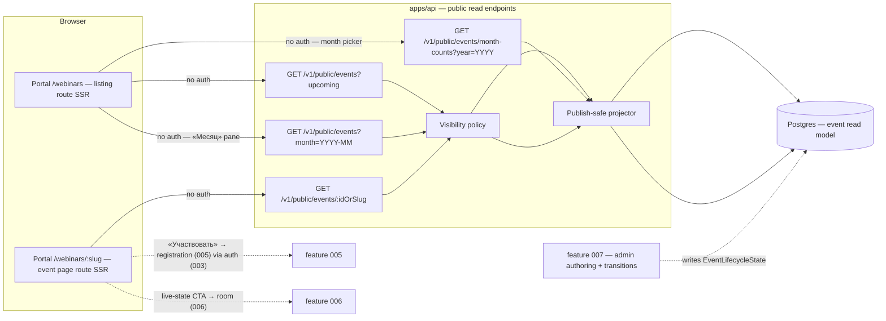
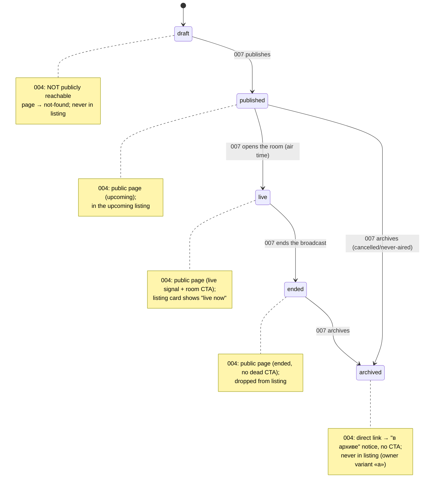
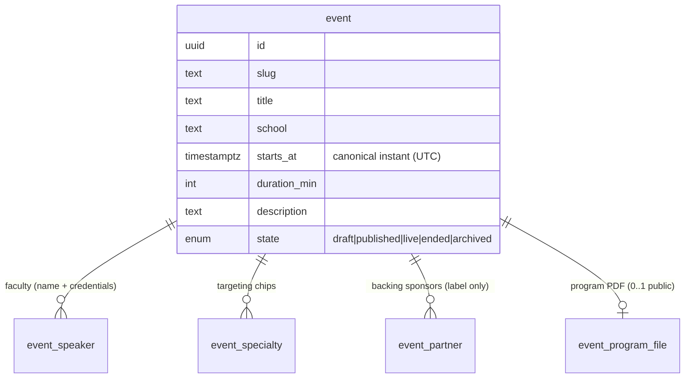
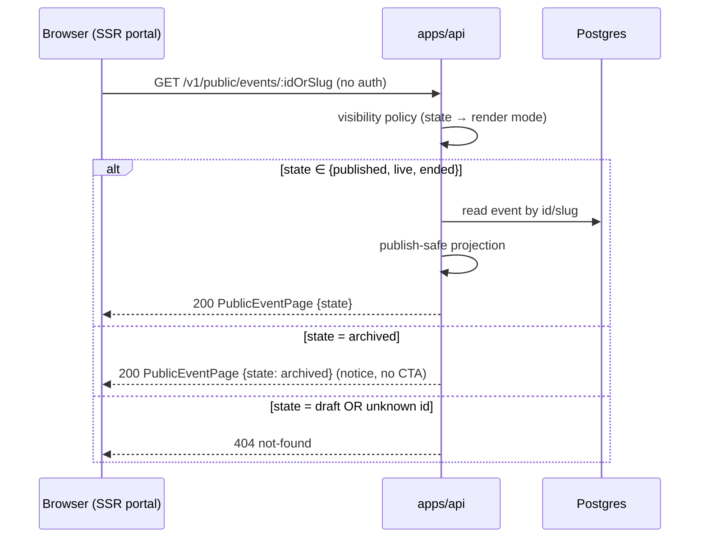

# 004 — Public event page & upcoming-broadcasts listing (Design)

## 1. Architecture overview

Feature 004 is the **read side** of the webinar aggregate. It adds two **public** (unauthenticated) query endpoints in `apps/api` over a publish-safe projection of the event read model, and two **server-rendered portal routes** (the public event page and the upcoming-broadcasts listing) built from `@ds/design-system` tokens to the vendored neo-brutalist canvases. It owns **no** write path — event authoring and the lifecycle transitions that move `EventLifecycleState` are feature 007; 004 reads the state they leave.

The portal renders **server-side** so the sponsor's distributed link resolves to complete HTML for an unauthenticated crawler/recipient (US-1, US-5) — there is no client soft-wall (the retired legacy anti-pattern, recon §7a/§8). The only gated surface in the whole webinar flow is the **room** behind the live join path (feature 006); the page itself is always open.

## 2. The single lifecycle state machine

Public behaviour is a pure function of one enum — no boolean scatter (recon §7d). 004 **reads** these states; feature 007 **drives** the transitions.

**Visibility policy (the one table 004 owns):**

| State       | Event-page request                            | In upcoming listing?           |
| ----------- | --------------------------------------------- | ------------------------------ |
| `draft`     | not-found (≡ non-existent id)                 | no                             |
| `published` | full public page, **upcoming** render         | yes (if air-date future / now) |
| `live`      | full public page, **live** render + room CTA  | yes ("live now")               |
| `ended`     | full public page, **ended** render, no CTA    | no                             |
| `archived`  | public **"в архиве" notice**, no CTA (EARS-5) | no                             |

`draft` and `archived` are the two non-page states, and they differ deliberately: a draft was never distributed, so it is indistinguishable from a bad id (no information leak); an archived event **was** distributed (a sponsor link is in the wild), so it degrades to a readable notice rather than a dead 404 (owner decision, variant «а»).

## 3. Read model & publish-safe projection

The event read model lives in Postgres (Drizzle, ADR-0003). 004 does not design the full write-side aggregate (007 owns authoring); it defines the **publish-safe projections** the public endpoints return and the columns they read.

- **`PublicEventPage`** (returned by `GET /v1/public/events/:idOrSlug`) — `id, slug, title, school, startsAt, durationMin, description, speakers[]{name, credentials}, programPdfUrl?, specialties[], partners[]{label}, state`. **Excludes** every operator/commercial field and all registrant PII — the projector is an allow-list, not a redactor (a new column is invisible to the public API until explicitly added to the projection). This is the structural guard behind EARS-10 and the recon §6 lesson (the `getEmailsForOrder` roster never touches a public surface).
- **`UpcomingBroadcastCard`** (returned by `GET /v1/public/events?upcoming`) — `id, slug, title, school, startsAt, specialties[], speakers[]{name}, state∈{published,live}`. A thinner projection (no description, no partners, no PDF) — only the card choose-set.
- **`MonthBroadcastEntry`** (returned by `GET /v1/public/events?month=YYYY-MM`, indicative shape) — `id, slug, title, school, startsAt, state∈{published,live,ended}`. The month view's projection: every publish-visible event whose start instant (МСК month boundaries) falls in the requested month, **including the month's already-past (`ended`) events** — the portal renders future/today entries as pills and past days as muted aggregate notes (EARS-15/EARS-19). Same allow-list discipline as `PublicEventPage`; `draft`/`archived` have no month projection.
- **`MonthlyEventCount`** (returned by `GET /v1/public/events/month-counts?year=YYYY`, indicative shape) — 12 rows `{month, count}` counting only publish-visible events; feeds the month picker's per-month notes (EARS-16). Both month endpoints are public, cacheable, and carry the §4 short `Cache-Control` like the wave-1 reads.
- **`programPdfUrl?`** is optional: the canvas always shows a program block, but a real event may lack a PDF; the projection omits the field (never emits a broken/null link) and the page renders the program section without the download affordance when absent (EARS-2).

DTOs are Zod schemas in `packages/schemas/` (ADR-0002 SSOT), consumed by both the API and the portal via the generated SDK.

## 4. Public query endpoints

Four endpoints (the page read, the upcoming listing, the month-range read, and the per-month counts), all classified **public** in the endpoint-authz matrix (ADR-0001 §2) — the first unauthenticated classified endpoints in the webinar domain.

- **`GET /v1/public/events/:idOrSlug`** → `PublicEventPage`. Resolves by slug (the sponsor-distributed stable link) or id. `draft`/unknown → 404; `archived` → 200 with `state: archived` (the portal renders the notice); otherwise → 200 full projection. **No auth, no cookie required**; the response is identical whether or not a session cookie is present (EARS-1).
- **`GET /v1/public/events?upcoming`** → `UpcomingBroadcastCard[]`, filtered `state ∈ {published, live} AND starts_at ≥ now() − airWindow` (a live event that started recently still lists), ordered `starts_at ASC`. Empty result is a valid `200 []` (the portal renders the empty-state, EARS-11).
- **`GET /v1/public/events?month=YYYY-MM`** (indicative) → `MonthBroadcastEntry[]`, filtered `state ∈ {published, live, ended} AND starts_at within the requested month` (МСК month boundaries) — past events of the month included by design (EARS-15), ordered `starts_at ASC`. An empty month is a valid `200 []` (the grid renders with no pills/notes).
- **`GET /v1/public/events/month-counts?year=YYYY`** (indicative) → `MonthlyEventCount[12]` for the picker (EARS-16).
- **Caching.** Both are public and cacheable; responses carry a short `Cache-Control` max-age so the SSR render and any CDN edge cache stay fresh against a lifecycle transition (a `live`↔`ended` flip must surface within the max-age — this backs the "never stale" half of EARS-9). No per-user variation ⇒ safe shared cache.

## 5. Portal routes (server-rendered, canvas-faithful)

Two Next.js 15 routes in `apps/portal`, server-rendered, built from `@ds/design-system` tokens to the vendored canvases (ADR-0013; canvas = fidelity spec).

### 5.1 Event page — `/webinars/:slug` (`webinar-page.dc.html`)

- Blue poster header (breadcrumbs, uppercase school kicker, `clamp(30px,5.5vw,50px)` H1, specialty chips `2px #6BB1F7`, rotated status badge) with the status card pulled up `-80px`, reusing the webinar-card geometry (desktop `196px 1fr` + 2px border + `6px 6px 0` shadow, time 56px; mobile ≤900 flat full-bleed, time 40px).
- **Status render swap** driven by the projection `state` (the canvas `status` prop enum `upcoming | live | ended`): the hero badge, the time plate, the CTA pair, and the footer CTA band all swap (EARS-4). `archived` → the "в архиве" notice variant with no CTA (EARS-5), the fourth render mode 004 adds beyond the canvas's three (the canvas encodes `upcoming|live|ended`; the archived notice is a 004 addition on the same shell — a text notice replacing the status card's CTA column, no new geometry).
- Body: two columns `1fr 380px` (program rows `96px 1fr`, sponsor plate, speaker cards `4px 4px 0`); bottom blue CTA band.
- **The one CTA.** «Участвовать» is the single primary action (EARS-3). It links into the registration route (feature 005) with the event slug as context; a guest is bounced through auth (003) and returns. In the `ended` render the CTA column shows the ended affordance (recording/materials copy per canvas) with **no** participation link; in `live` it routes toward the room (006).

### 5.2 Listing — `/webinars` (`webinars-listing.dc.html`, minimal wave-1 cut)

- Blue poster header + a **day-grouped** card list (the §09 rhythm: desktop day header = label + 2px ink rule, margins 48/24, card list `gap:28px`; mobile day header = full-bleed section band `margin:0 -16px`, cards bleed `gap:0`), each card the `webinar-card.dc.html` unit.
- **Scope cut (owner PRD scope).** The vendored listing canvas also carries a specialty filter, week-paging, and free-text search — those are later wave-2 slices and are **not built** in 004 (named out-of-scope, requirements Scope). What 004 does build around the week list is the «Неделя / Месяц» view switcher and the month-calendar view (§5.4). The card unit and the §09 rhythm are in scope; the filter/search chrome is not.
- **Empty state** (EARS-11): the canvas dashed-border empty block ("no upcoming broadcasts") when the projection is `[]`.
- Cards link to `/webinars/:slug` (EARS-8).

### 5.3 Cross-surface consistency (EARS-9)

Both routes read `state` from the same projection sourced from the same `EventLifecycleState` column — there is no second source of truth to drift. A live event's card and page both derive "live now" from `state === 'live'`; the short cache max-age (§4) bounds how long a just-transitioned event can look stale. The month view's red live pill (§5.4) reads the same column — three surfaces, one state.

### 5.4 Month view — the «Месяц» pane of `/webinars` (`webinars-month.dc.html`, wave-2 slice #701)

- **Switcher.** The listing route carries the «Неделя / Месяц» switcher (EARS-18): «Неделя» renders §5.2's day-grouped list (default), «Месяц» renders the month calendar; both panes public, switching loss-free (view selection is presentation state, e.g. a query param — no auth, no mutation).
- **Data.** The pane reads `MonthBroadcastEntry[]` for the shown month plus `MonthlyEventCount[]` for the picker year (§3/§4). Month paging ‹ › and picker selection just re-query the month — pure reads (EARS-17).
- **Rendering (EARS-19).** Desktop: 7-column grid, event pills (`time · title`), red live pill from `state === 'live'`, muted aggregate notes on past days, today outline, state legend. Mobile (≤900): dot-grid calendar (event dots, red live dot, muted past dot) + selected-day agenda below with a past-/empty-day note. Both breakpoints × both themes.
- **Build approach (epic-brief verdict).** Adopt the **shadcn event-calendar blocks** (brief adopt-vs-build table); final block pick at delivery via the `build-ui-from-design-system` gate; adopted blocks are re-skinned to the vendored canvas geometry with `@ds/design-system` tokens. Stage A is satisfied by the owner-approved canvas; Stage B live verify applies at delivery.

## 6. Timezone presentation (МСК)

The read model stores `starts_at` as a canonical UTC instant (ADR-0003). Every surface formats it in `Europe/Moscow` with an explicit **МСК** label (EARS-12) via a shared formatter — the presentation never reads the viewer's local timezone. This closes the legacy gap (recon §7d: "always Moscow, no TZ") by making МСК **explicit and single-sourced** rather than implicit. Playwright asserts no local drift by overriding `timezoneId` in the E2E run.

## 7. Copy & i18n (EARS-13)

All user-facing copy on the two surfaces (labels, status badges, CTA text, the archived-notice copy, the empty-state copy) resolves through the typed message catalog established in 003 (EARS-21) over the i18n-ready structure. RU ships now; no language switcher. No hardcoded string survives the `apps/portal` ESLint gate.

## 8. Seams (consumed by later verticals)

Each seam is a **tracked** dependency, not a silent stub (AGENTS.md §6 F-22; wired by `open-ears-issues` step 4).

| Seam                          | Owner   | 004's stand-in                                                                       | "Done against the real dependency" criterion                                               |
| ----------------------------- | ------- | ------------------------------------------------------------------------------------ | ------------------------------------------------------------------------------------------ |
| Event authoring + transitions | 007     | Seeded fixture events per lifecycle state; 004 reads them read-only.                 | 004 surfaces render events authored + transitioned via 007, not only seeds.                |
| Registration + auth handoff   | 005/003 | «Участвовать» enters the flow with the event context; E2E stubs the handoff target.  | The guest→auth→registered round-trip completes and returns to the event (verified in 005). |
| Webinar room                  | 006     | Live-state CTA routes _toward_ the room target; 004 asserts the route, not the room. | The registered doctor lands in the gated room (verified in 006).                           |

004 is completable end-to-end **as its own vertical** on seeds: open a seeded published link → read the page → open the listing → click a card → back to the page, across upcoming/live/ended/archived. That is the F-22 "vertical slice is completable" bar for 004; the seams above are the boundaries of _other_ slices, not unfinished parts of this one.

## 9. Test strategy

- **API read side (Vitest e2e + unit, `apps/api`):** the projection (EARS-1, EARS-2, EARS-10), visibility policy (EARS-5, EARS-6, EARS-7), ordering, and the month reads — month-range incl. past events + per-month counts (EARS-15, EARS-16) — against dev-stand Postgres, `skipIf(!DATABASE_URL)`.
- **Portal browser E2E (Playwright, `apps/portal`):** the required user-journey deliverable (requirements Verification, `all` row) — direct-link read, listing→card→page navigation, the four lifecycle renders, the «Неделя / Месяц» round-trip + month paging/picker (EARS-17, EARS-18), empty-state, МСК-no-drift, canvas fidelity at both breakpoints × both themes, and the axe accessibility scan of the month view + switcher (`playwright-axe` BLOCK guard). Owned + tracked by the 004 portal-integration + E2E child Issue (`open-ears-issues` step 3a), never a bare footnote.
- **Fidelity (EARS-14):** eyes-on full-page screenshots, both breakpoints × both themes, verified element-by-element against the vendored canvases before Stage-B (AGENTS.md §6 canvas-derived-UI rule); token-lint green (no arbitrary Tailwind).
