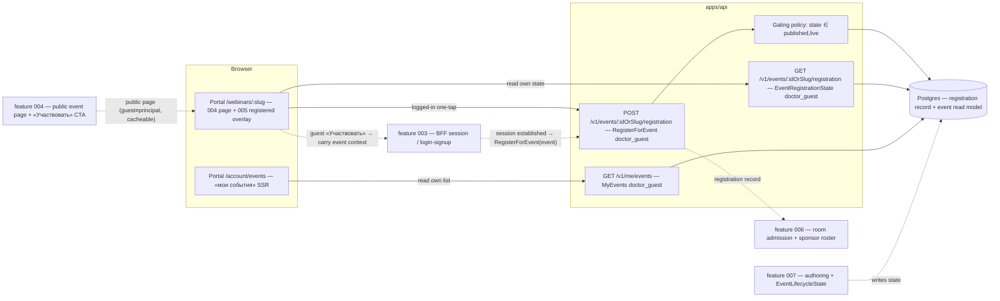
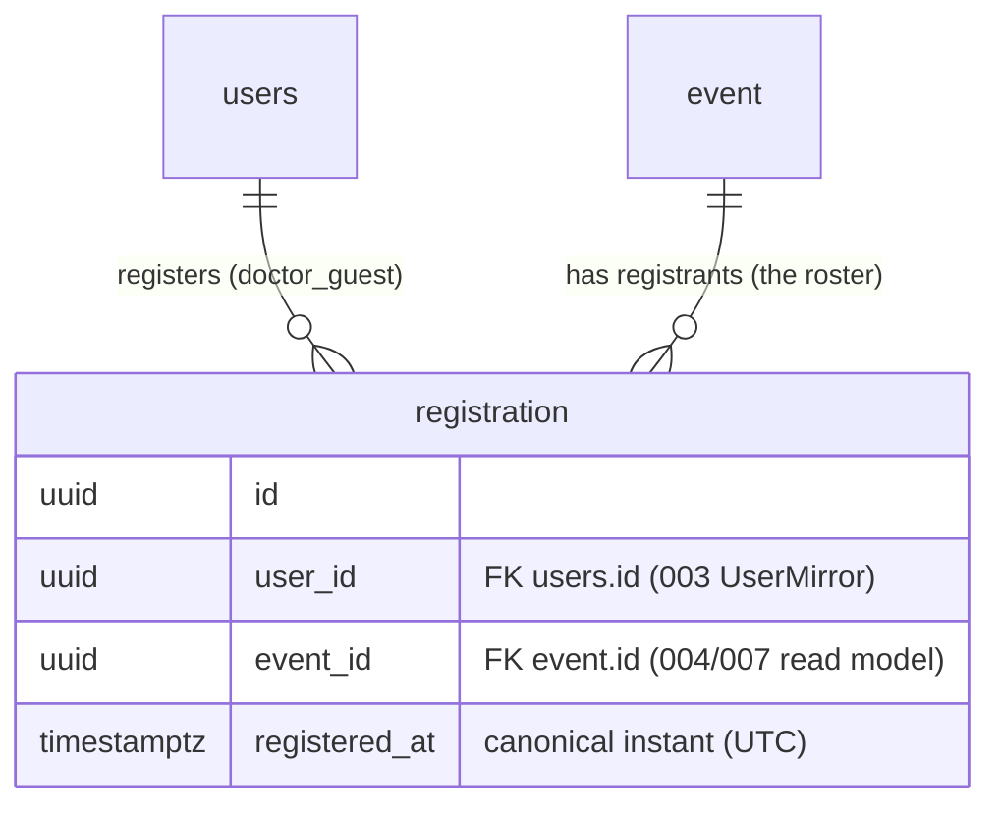
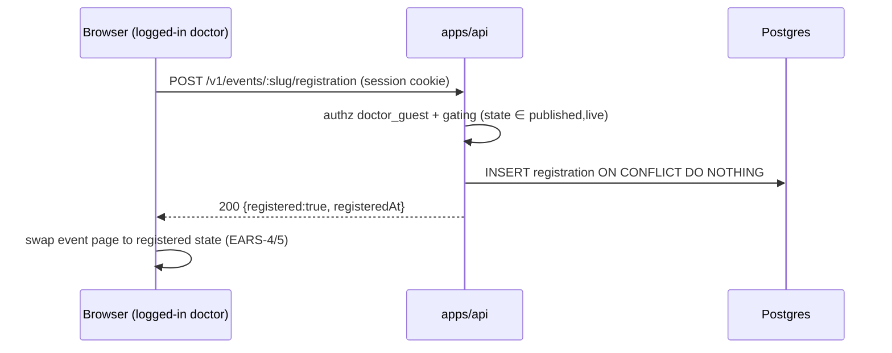
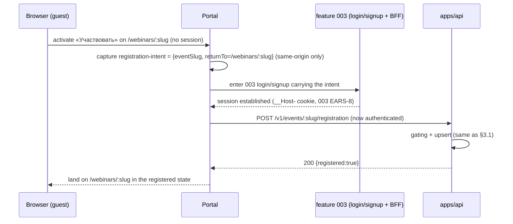

# 005 — Event registration & «мои события» (Design)

## 1. Architecture overview

Feature 005 is the **write side** of webinar registration plus two **per-user read sides**. It adds one `doctor_guest`-authenticated registration command and two authenticated read models in `apps/api`, and two portal concerns in `apps/portal`: the **registered-state overlay** on the 004 event page and the **«мои события»** account surface. It owns **no** auth primitive (reuses shipped 003), **no** public event content (reads 004's page/CTA), and **no** room admission (produces the record 006 admits against).

The public event page (004) stays public, content-identical for guest and principal, and cacheable. 005's **per-user** registration state is a **separate authenticated read** composed onto that page for a logged-in doctor — it never enters the public projection or its shared cache (§4). The only write 005 owns is the registration record; the only surfaces it owns are the registered overlay and «мои события».

## 2. The registration record & the one-registration invariant

Registration is a thin, durable fact: a doctor registered for an event at an instant. There is **no** cancelled state in wave 1 (owner decision) — every row is current.

- **`UNIQUE (user_id, event_id)`** is the structural guard behind EARS-3: at most one registration per (doctor, event). `RegisterForEvent` is an **upsert** (`INSERT … ON CONFLICT (user_id, event_id) DO NOTHING` + read-back) — a repeat via any path (one-tap, guest-through-auth, «мои события» re-entry) returns the existing row and emits **no** second `DoctorRegisteredForEvent` and **no** second `audit_ledger` entry. The invariant is enforced in the database, not by client discipline (Constraints).
- **No `cancelled` / `status` column, no soft-delete.** Cancellation is a wave-2 vertical shipped with notifications; adding it later is an additive migration, not a shape 005 pre-builds. The `EventRoster` is therefore "every registration row for the event" — no filter needed (EARS-8).
- **The record carries only the `(doctor, event, registeredAt)` fact** — no denormalized PII. The sponsor roster and room admission (006) join to the `users` mirror (003) at read time; no registrant PII is ever copied onto a public 004 surface (EARS-8, EARS-10; recon §6).

## 3. Registration flows (the two paths converge on one command)

Both the logged-in one-tap and the guest-through-auth completion fire the **same** `RegisterForEvent` — the difference is only whether a session already exists.

### 3.1 Logged-in one-tap (US-1, EARS-1)

One action, no confirmation round-trip. The page then reads `EventRegistrationState` (or uses the command's response) to render the registered state, and the event appears in «мои события» on the next read (EARS-7).

### 3.2 Guest through auth (US-2, EARS-2) — event context survives the round-trip

- **The registration-intent is a safe, same-origin value** — the event slug + a same-origin `returnTo` path only. It carries **no** PII and **no** credential, and a cross-origin / open return target is rejected (Constraints; a `return-target.guard` unit test asserts this — EARS-2 verification row). This replaces the retired legacy "postponed registration" server-side parking mechanism (004 Scope out; 005 PRD Out of scope): there is **no** server record of a pending registration — the intent lives in the round-trip and the real `RegisterForEvent` fires once, after the session exists.
- **No lost context.** The doctor returns to the originally chosen event, registered — never dropped to the listing or a re-search, never asked to tap «Участвовать» twice (Invariants).
- **003 is reused verbatim.** 005 adds no auth step; whether the guest logs in or signs up (003's existence-agnostic flow, 003 EARS-24) is 003's concern — 005 only resumes on `SessionEstablished`.

## 4. Per-user reads vs the public page (the cache-safety boundary)

004's `GetPublicEventPage` is **public, unauthenticated, content-identical for guest and principal, and cacheable** (004 EARS-1/EARS-10). 005 must show a per-doctor state on the same page **without** breaking any of that.

- **`EventRegistrationState`** — `GET /v1/events/:idOrSlug/registration`, **`doctor_guest`-authenticated**, returns `{ registered, registeredAt? }` **for the calling doctor only**. The portal composes it onto the 004 page for a logged-in caller (a separate client/SSR-authenticated fetch), leaving the public page body and its shared cache untouched. A guest simply never issues this read — they see 004's register CTA.
- **`MyEvents`** — `GET /v1/me/events`, **`doctor_guest`-authenticated**, returns the caller's registered upcoming events (`state ∈ {published, live}`, `starts_at` future/now), ordered `starts_at ASC`. Never returns another doctor's registrations (EARS-10).
- **No public exposure of the roster.** `EventRoster` has **no** public endpoint; it is an internal read consumed by 006 (admission) and the wave-2 report. A public 004 request can never surface a registrant (cross-checked in the EARS-8/EARS-10 e2e against the public projection).
- DTOs are Zod schemas in `packages/schemas/` (ADR-0002 SSOT), consumed by both the API and the portal via the generated SDK.

## 5. Registration endpoints

Three endpoints, all classified **`doctor_guest`-authenticated** in the endpoint-authz matrix (ADR-0001 §2) — the first authenticated `doctor_guest` endpoints in the webinar domain (004 added the public ones).

- **`POST /v1/events/:idOrSlug/registration`** → `RegisterForEvent`. Authz `doctor_guest`; gating `state ∈ {published, live}` (else `409`/`422` — the affordance is absent client-side, and the command is refused server-side, EARS-9); upsert on `(user_id, event_id)`; returns `200 { registered:true, registeredAt }` on both first-insert and idempotent repeat. First insert appends one `audit_ledger` row (`webinar.registration.created`, PD-masked) and emits `DoctorRegisteredForEvent`.
- **`GET /v1/events/:idOrSlug/registration`** → `EventRegistrationState` for the caller. `200 { registered:false }` when not registered, `{ registered:true, registeredAt }` when registered. Per-user ⇒ **not** cacheable as a shared resource (private cache only).
- **`GET /v1/me/events`** → `MyEvents[]` for the caller, `state ∈ {published, live}` future/now, `starts_at ASC`. Empty result is a valid `200 []` (the portal renders the «мои события» empty-state, EARS-6/EARS-12).

Gating reads the single `EventLifecycleState` (owned by 007, §7 seam). There is **no** per-event registration-cutoff configuration — the register affordance is a pure function of the lifecycle state (owner decision 2026-07-06).

## 6. Portal surfaces (canvas-faithful)

Built from `@ds/design-system` tokens to the vendored canvases (ADR-0013; canvas = fidelity spec), reusing the `webinar-card` unit graduated in 004.

### 6.1 Event-page registered overlay — `/webinars/:slug` (`webinar-page.dc.html`, registered states)

- For an authenticated doctor, the 004 status card's CTA column swaps by registration state on top of the lifecycle `status`:
  - **unregistered + upcoming/live** → the 004 «Участвовать» register CTA (unchanged).
  - **registered + upcoming** → a "you are registered" confirmation + the start date/time (МСК) and join signposting, replacing the register CTA (EARS-4/EARS-5).
  - **registered + live** → the confirmation + an obvious onward path toward the room (feature 006 target); the room itself is 006 (EARS-5).
  - **ended / archived** → no register affordance regardless of registration (EARS-9; 004 owns the ended/archived render).
- The registered signposting is the `webinar-page.dc.html` `upcoming`/`live` registered states + the `webinar-card.dc.html` `registered` variant («вы записаны» time plate + join CTA when live). No new geometry beyond the canvas.

### 6.2 «Мои события» — `/account/events` (`my-events.dc.html`, Предстоящие tab only)

- The **Предстоящие** tab: the doctor's registered upcoming events, **day-grouped**, nearest first, each rendered as the `webinar-card.dc.html` unit (`registered` / `live` variants), linking to `/webinars/:slug` (EARS-6).
- **Wave-1 cut (owner PRD scope).** The canvas also carries **Записи** and **Сертификаты** tabs and a specialty filter — those are wave 2+ and are **not built** in 005 (named out-of-scope, requirements Scope). Only the Предстоящие tab and the day-grouped card rhythm are in scope.
- **Empty state** (EARS-6/EARS-12): the canvas empty block ("you have no upcoming registered events") when `MyEvents` is `[]`.
- A just-registered event appears here immediately on the next read (EARS-7) — no stale list.

## 7. Timezone, copy & i18n

- **МСК (EARS-11).** «Мои события» and the registered signposting format each event's canonical UTC instant in `Europe/Moscow` with an explicit **МСК** label via the shared 004 formatter — never the viewer's local timezone. Playwright asserts no local drift by overriding `timezoneId`.
- **Copy & i18n (EARS-12).** All user-facing copy (the registered confirmation, join signposting, «мои события» labels/tab/empty-state, CTA text) resolves through the typed message catalog established in 003 (EARS-21) and reused in 004 (EARS-13). RU ships now; no language switcher; no hardcoded string survives the `apps/portal` ESLint gate.

## 8. Seams (consumed by / consumed from other verticals)

Each seam is a **tracked** dependency, not a silent stub (AGENTS.md §6 F-22; wired by `open-ears-issues` step 4).

| Seam                                  | Owner  | 005's relationship                                                                                        | "Done against the real dependency" criterion                                                      |
| ------------------------------------- | ------ | --------------------------------------------------------------------------------------------------------- | ------------------------------------------------------------------------------------------------- |
| Auth login/signup + session           | 003    | Reused verbatim; the guest path resumes on `SessionEstablished`. 005 adds no auth primitive.              | The guest→auth→registered round-trip completes on the live stand's real 003 flow (verified here). |
| Public event page + «Участвовать» CTA | 004    | 005 lands the registration behind 004's CTA + overlays the per-user registered state.                     | The registered overlay composes onto the real 004 page (sequenced after 004 on `main`).           |
| Event authoring + lifecycle           | 007    | Gating reads `EventLifecycleState`; built on seeded fixture events until 007 lands.                       | Registration gates on events authored + transitioned via 007, not only seeds.                     |
| Webinar room admission                | 006    | 005 **produces** the registration record; 006 admits against it. Live signposting routes toward the room. | The registered doctor is admitted to the gated room against the 005 record (verified in 006).     |
| Sponsor roster / report               | 006/w2 | 005 owns the durable `EventRoster` membership.                                                            | The roster/report draws exactly the recorded registrations (verified in the report vertical).     |

005 is completable end-to-end **as its own vertical** on seeds + real 003: a guest opens a seeded published event → «Участвовать» → 003 auth → returns registered → the page shows the registered state → «мои события» lists it → back to the event page; plus logged-in one-tap and ended/archived gating. That is the F-22 "vertical slice is completable" bar for 005; the seams above are the boundaries of _other_ slices (006's room, 007's authoring, the report), not unfinished parts of this one.

## 9. Test strategy

- **API write + read side (Vitest e2e + unit, `apps/api`):** the registration upsert + one-registration invariant (EARS-1, EARS-3), the DB uniqueness constraint, gating (EARS-9), the per-user reads + authz (EARS-4, EARS-6, EARS-10), the return-target guard (EARS-2), and the roster/no-PII cross-check (EARS-8) — against dev-stand Postgres + Zitadel, `skipIf(!DATABASE_URL || !IDP_ISSUER)`.
- **Portal browser E2E (Playwright, `apps/portal`):** the required user-journey deliverable (requirements Verification, `all` row) — guest → «Участвовать» → **real 003 auth on the live stand** → returns registered → event-page registered state → «мои события» → back to the page; plus logged-in one-tap, register-during-live routing toward the room (006 target stubbed), and ended/archived gating. Owned + tracked by the 005 portal-integration + E2E child Issue (`open-ears-issues` step 3a), never a bare footnote.
- **Fidelity (EARS-13):** eyes-on full-page screenshots, both breakpoints × both themes, verified element-by-element against the vendored canvases (registered event-page states, `registered` card variant, «мои события» Предстоящие) before Stage-B (AGENTS.md §6 canvas-derived-UI rule); token-lint green (no arbitrary Tailwind).
