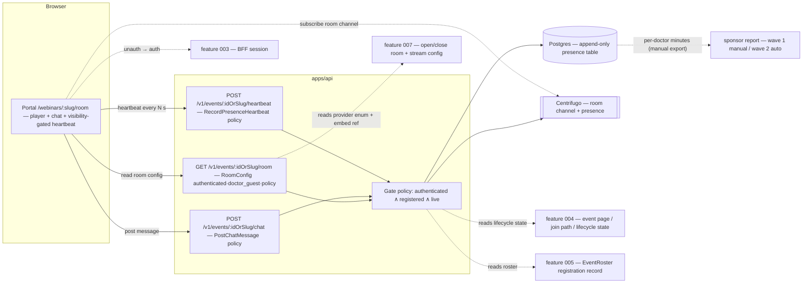
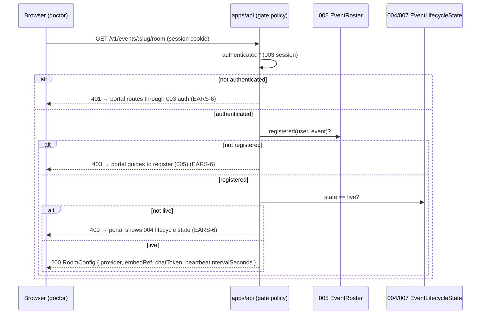
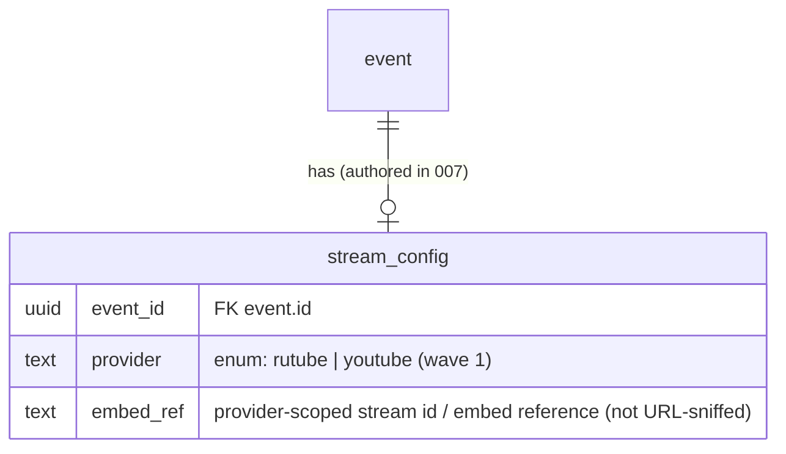
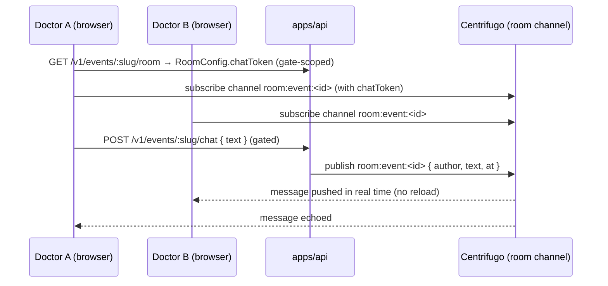
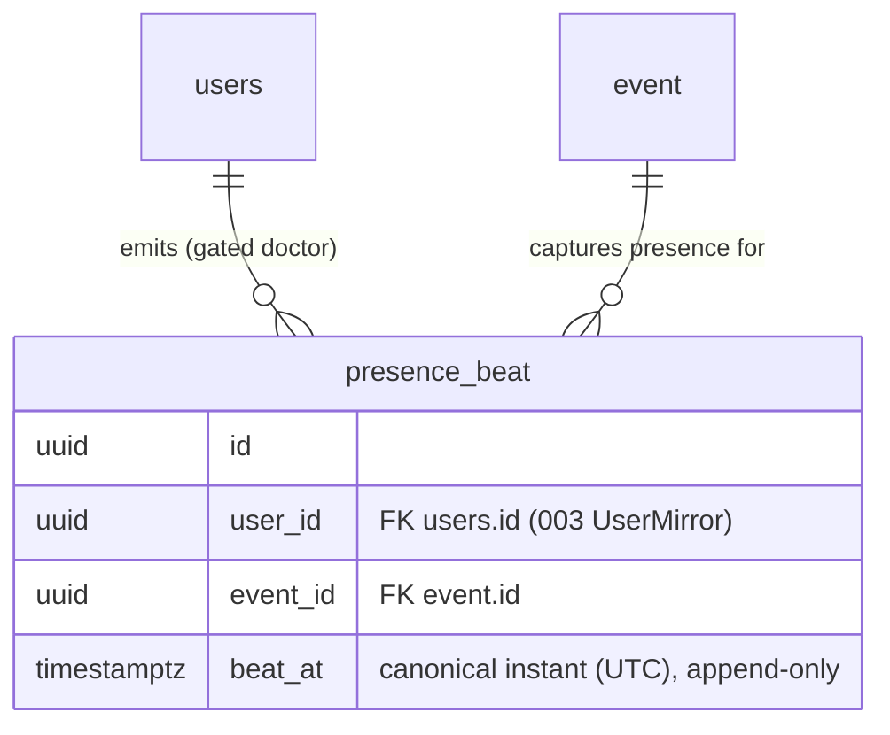
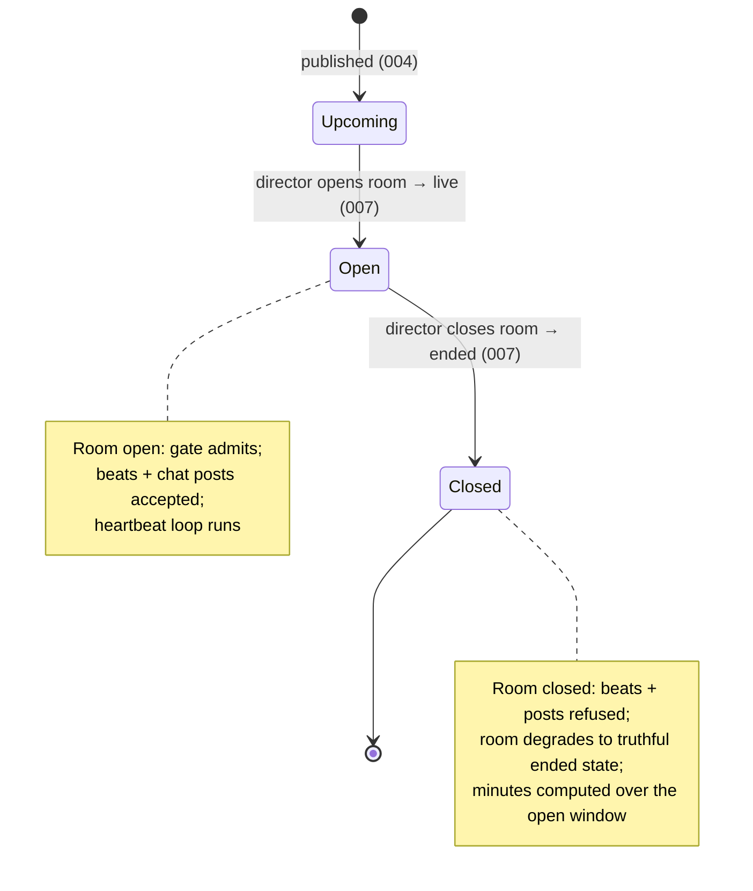

# 006 — Webinar room: embed player, live chat, heartbeat presence (Design)

## 1. Architecture overview

Feature 006 is the **room vertical**: one registration-and-live-gated read (`RoomConfig`) and two gated commands (`PostChatMessage`, `RecordPresenceHeartbeat`) in `apps/api`, plus the room surface in `apps/portal`. It owns **no** auth primitive (reuses shipped 003), **no** registration (reads the 005 `EventRoster` as the admission basis), and **no** event authoring / room open-close (reads the 007-owned `EventLifecycleState` + stream config). It **produces** the durable presence beats the sponsor report draws from.

The gate is **server-side and singular** — the same policy (`authenticated ∧ registered ∧ live`) guards the config read, the chat publish, and the heartbeat append. There is **no** soft UI wall: an ungated caller never receives player config, a chat credential, or a recorded beat (§2). The only durable write 006 owns is the append-only presence beat; the only surface it owns is the room.

## 2. The gate — one policy, three protected operations

Admission is a **policy** evaluation (ADR-0001 §2, `auth_check: policy`), not a role fast-path: role alone (`doctor_guest`) is necessary but not sufficient. The three conditions:

1. **Authenticated** — a valid 003 BFF session (else EARS-6 routes through auth).
2. **Registered** — `(user_id, event_id)` is present in the 005 `EventRoster` (else EARS-6 guides to register).
3. **Live** — the single `EventLifecycleState` is `live` (else EARS-6 shows the 004 lifecycle state; and EARS-7 closes an open room when it leaves `live`).

- The **same gate** wraps `PostChatMessage` and `RecordPresenceHeartbeat` — a message or beat from an ungated caller is refused server-side (EARS-1, EARS-8). The gate is enforced in the backend before any Centrifugo publish or Postgres append.
- **No soft wall.** The portal never renders the player, subscribes to the chat channel, or starts the heartbeat loop before a `200 RoomConfig` — a denied read routes (EARS-6), it does not hide a rendered player behind a modal.
- The distinction from earlier slices: 004's reads are `public`, 005's writes/reads are `fast-path` `doctor_guest`; 006 is the **first `policy` auth_check** in the webinar domain, because registration+live is a resource-scoped decision the role alone cannot make.

## 3. The embed player — explicit provider enum, never URL-sniffing

`RoomConfig.provider` is a **closed enum** authored in the event stream config (007): wave 1 is exactly `rutube | youtube`.

- The portal instantiates the embed by **switching on `provider`** — `react-player` for `youtube`, a thin iframe for `rutube` (epic adopt-vs-build) — using `embedRef` as the provider-scoped stream identifier. It **never** parses the URL string to guess the provider (the legacy mistake, recon §5).
- **Unknown/absent provider** → a truthful "stream unavailable" room state (EARS-2), never a guessed embed. This is the fail-closed default when 007's stream config is incomplete.
- **Extending the enum is a migration.** SDN Player (or any third provider) is **not** wave 1; adding it later is an additive change to the enum + a new embed branch, not a shape 006 pre-builds (owner decision 2026-07-06). The enum lives in `packages/schemas/` (Zod), the single SSOT the API and portal share.

## 4. Live chat over Centrifugo

Chat rides **Centrifugo** (already in the stack — dev stand + engineering-readiness spec); 006 adds a room channel and a gate-scoped connection token, not a new transport.

- **Posting is server-mediated.** A message is posted through the gated `PostChatMessage` command; the backend authorizes the gate, then publishes to the channel. The `chatToken` grants **subscribe** to the room channel only — a client **cannot** publish directly to the channel without going through the gated command (EARS-3, EARS-8). This keeps the post path behind the same server-side gate as everything else.
- **Real-time fan-out, no reload** — subscribers receive each published message over the live connection (EARS-3).
- **Chat is not the presence record.** Centrifugo per-channel presence is ephemeral; it is not relied on for the sponsor minutes (§5). Chat availability tracks the room's open window: once the room closes (EARS-7), posting is refused.

## 5. Presence — server-authoritative heartbeat + durable append-only table

Presence is the **B2B deliverable** (per-doctor minutes for the sponsor). It is captured server-authoritatively and stored durably — never a client-trusted count, never the exposed-service-key client pings the legacy used (recon §6).

- **Append-only.** Each accepted heartbeat is one immutable row `(user_id, event_id, beat_at)` — no in-place update, no client-supplied minute count (ADR-0003 §3). The room open/close and first-entry facts are appended to `audit_ledger` (§6, ADR-0003 §6).
- **Cadence N is server config, default 60 s.** `RoomConfig.heartbeatIntervalSeconds` carries N to the client, which posts on that interval. The presence-minute derivation is **parameterized over N** — an operator-confirmed different cadence changes the config value, not the spec or the code (owner decision 2026-07-06). Legacy evidence was 60 s (recon §10-3), the default.
- **Visibility-gated client loop.** The client posts beats **only while the room tab is the visible, active tab** (Page Visibility API — `document.hidden` false). A backgrounded tab emits no beats, so its minutes never count toward the sponsor report; the loop resumes when the tab becomes visible again (EARS-4, owner decision 2026-07-07). This is a **client-side capture gate** — the server still refuses any beat from an ungated caller or a closed room (§2, §6), and tab-coalescing is unchanged: two _visible_ sessions in the same interval still count once (concurrent-tabs bullet, EARS-5). NMO thresholds and interactive presence confirmations remain wave 2.
- **Concurrent tabs never inflate.** Per-doctor minutes are computed from the **distinct covered time**, not the raw beat count: beats from a doctor's parallel sessions for the same event **coalesce into one presence timeline** (e.g. bucket beats to the N-second grid and count distinct buckets, or union the covered intervals). Two tabs open in the same minute count as **one** minute (EARS-5). This is asserted in the presence-minutes e2e.
- **Minutes formula (illustrative).** `minutes ≈ (distinct N-second buckets a doctor emitted a beat in during the open window) × N / 60`, clamped to the room-open window (EARS-7). The exact aggregation is an implementation detail of the derivation, but it MUST be (a) parameterized over N and (b) tab-coalesced.
- **Wave-1 export is manual.** No report UI: the derivation yields a per-doctor `{ doctor, event, minutes }` set the operator exports manually for the first webinar's sponsor (EARS-5). The wave-2 auto-report «Отчёт партнёра V2» and auto-NMO consume this same data — 006 only captures it; the exact V2 columns/joins are a wave-2 owner call (PRD open question).
- **No PII on public surfaces.** The presence data joins to the `users` mirror (003) at read/export time; no registrant PII is ever copied onto a public 004 surface (EARS-8; recon §6).

## 6. Room lifecycle & close (the 007 seam)

The room's **open window** is the event's `live` state, owned + driven by 007's director controls.

- **Open** = `live`: the gate admits registered doctors, beats and posts are accepted, the client heartbeat loop runs (EARS-1, EARS-3, EARS-4).
- **Close** = leaving `live` (→ `ended`): the server **stops accepting** heartbeats and chat posts for the event; a late beat/post is refused; the room degrades to the truthful ended state (EARS-7). Per-doctor minutes are computed over the beats captured **while open**.
- **006 does not drive the transition** — it reads the state 007 writes. Until 007 lands, the open/close is simulated by transitioning **seeded** events (Dependencies); the "done against the real dependency" criterion is _the room opens/closes via 007 director controls and reads 007-authored stream config_ (§8).

## 7. Room endpoints

Three endpoints, all classified **`access: authenticated`, `required_roles: doctor_guest`, `auth_check: policy`** in the endpoint-authz matrix (ADR-0001 §2) — the registration-and-live gate is a policy eval (§2). DTOs are Zod schemas in `packages/schemas/` (ADR-0002 SSOT), shared by the API and the portal via the generated SDK.

- **`GET /v1/events/:idOrSlug/room`** → `RoomConfig` for the gated caller: `{ provider ∈ {rutube, youtube}, embedRef, chatToken, heartbeatIntervalSeconds }`. `200` only when authenticated ∧ registered ∧ live; `401`/`403`/`409` respectively drive the three EARS-6 branches. Per-caller (the `chatToken` is caller-scoped) ⇒ not a shared-cacheable resource.
- **`POST /v1/events/:idOrSlug/chat`** → `PostChatMessage`. Gate → publish to Centrifugo `room:event:<id>`; refused if the room is not open or the caller is ungated (EARS-3, EARS-7). Emits `ChatMessagePosted` (transient, not the presence record).
- **`POST /v1/events/:idOrSlug/heartbeat`** → `RecordPresenceHeartbeat`. Gate → append one `presence_beat` row; refused once the room is closed (EARS-4, EARS-7). Idempotent within an interval (concurrent tabs coalesce, §5). Emits `PresenceHeartbeatRecorded`.

## 8. Portal surface (canvas-faithful)

Built from `@ds/design-system` tokens to the vendored `webinar-room.dc.html` (ADR-0013; canvas = fidelity spec). The room's net-new units (the embed player frame, the chat panel) run the `build-ui-from-design-system` registry gate first (shadcn chat primitives / react-player + thin Rutube iframe per the epic adopt-vs-build), recorded in the PR.

### 8.1 The room — `/webinars/:slug/room`

- **Desktop** (`webinar-room.dc.html`): a `1fr 400px` grid — the player (2px border, `6px 6px 0` shadow, `16/9`, live pulse badge + HD chip + control bar overlay) on the left, the chat **aside** (2px border, `6px 6px 0` shadow) on the right with a moderator pin, the message list, and the composer. Below the player: the event context (school/series eyebrow, title, speakers) + a "сейчас" program pointer.
- **Mobile**: a full-bleed `16/9` player, a slim "what's on air" bar, then a tab strip. **Wave-1 tab set = Чат / О эфире** (the canvas's **Вопросы** tab is the named wave-2 deferral, §requirements Out of scope) — Чат is the live chat; О эфире is the read-only event context (title, speakers, program). The composer sits pinned at the bottom of the Чат tab.
- **The «Задать вопрос» / «Вопросы» affordances are not built** in wave 1 (question-to-lecturer is wave 2) — the desktop aside is a single chat pane, and the mobile tab strip omits Вопросы. This is the exact analogue of 005 shipping only the `my-events` Предстоящие tab.
- **"Stream unavailable" state** (EARS-2): when the provider is unknown/absent, the player frame renders a truthful unavailable state (no guessed embed), keeping the room chrome.
- **Visibility-gated heartbeat** (EARS-4): no visible affordance — the heartbeat loop runs from the room mount on the `RoomConfig.heartbeatIntervalSeconds` cadence **while the room tab is the visible, active tab** (Page Visibility API — `document.hidden`), with **no** doctor-facing "prove you're here" control; when the tab is backgrounded the loop pauses (its minutes do not count toward the sponsor report) and re-focusing the tab resumes it.

### 8.2 Time, copy & i18n

- **МСК (EARS-10).** Any **absolute** time in the room (the «О эфире» program schedule) is formatted in `Europe/Moscow` labeled **МСК** via the shared 004/005 formatter — never the viewer's local timezone (Playwright asserts no drift by overriding `timezoneId`). The live-elapsed indicator («В эфире · N мин») derives from the event's canonical `startsAt`.
- **Copy & i18n (EARS-10).** All user-facing copy (the live badge, room chrome, chat placeholder/labels/empty-state, the access-branch guidance, the "stream unavailable"/ended states) resolves through the typed message catalog established in 003 (EARS-21) and reused in 004/005. RU ships now; no hardcoded string survives the `apps/portal` ESLint gate.

## 9. Seams (consumed by / consumed from other verticals)

Each seam is a **tracked** dependency, not a silent stub (AGENTS.md §6 F-22; wired by `open-ears-issues` step 4).

| Seam                                | Owner              | 006's relationship                                                                                            | "Done against the real dependency" criterion                                                          |
| ----------------------------------- | ------------------ | ------------------------------------------------------------------------------------------------------------- | ----------------------------------------------------------------------------------------------------- |
| Auth session                        | 003                | Reused verbatim; an unauthenticated visitor routes through 003. 006 adds no auth primitive.                   | The room gate reads the live stand's real 003 session (verified here).                                |
| Event page / join path / lifecycle  | 004                | The room is entered from the 004 page/join path; a non-`live` event falls back to the 004 lifecycle state.    | The room is entered from the real 004 page (sequenced after 004 on `main`).                           |
| Registration record / `EventRoster` | 005                | Admission reads the 005 roster; an unregistered doctor routes to 005. 006 creates no registration.            | Admission gates on real 005 registrations (sequenced after 005 on `main`; the 005↔006 blocking link). |
| Director open/close + stream config | 007                | 006 reads the `live` window + provider enum/embed ref; built on seeded live events + stream config until 007. | The room opens/closes via 007 director controls and instantiates the player from 007-authored config. |
| Realtime transport                  | Centrifugo (stack) | Chat + a gate-scoped connection token on a room channel; no new infra decision.                               | Chat fans out over the dev-stand Centrifugo (verified on the live stand).                             |
| Sponsor report / auto-NMO           | wave 2             | 006 **produces** the durable presence beats; wave-2 verticals derive the auto-report + NMO from them.         | The wave-2 report/NMO draws exactly the captured beats (verified in the report vertical).             |

006 is completable end-to-end **as its own vertical** on seeds + real 003/004/005: a registered doctor opens a seeded live event's room → the player renders from the seeded provider enum → chat posts fan out over Centrifugo → the heartbeat loop appends beats → per-doctor minutes derive (tab-coalesced, over N) → the room closes and capture stops. That is the F-22 "vertical slice is completable" bar for 006; the 007 open/close, the wave-2 report, and auto-NMO are the boundaries of _other_ slices, not unfinished parts of this one.

## 10. Test strategy

- **API gate + write/read side (Vitest e2e + unit, `apps/api`):** the three-condition gate (EARS-1, EARS-8), the provider-enum-not-URL-sniff read (EARS-2), the chat publish gate (EARS-3), the heartbeat append + append-only shape (EARS-4), the presence-minute derivation parameterized over N + concurrent-tab coalescing (EARS-5), room-close refusal (EARS-7), and the embed-boundary contract (EARS-9) — against dev-stand Postgres + Zitadel + Centrifugo, `skipIf(!DATABASE_URL || !IDP_ISSUER || !CENTRIFUGO_URL)`.
- **Portal browser E2E (Playwright, `apps/portal`):** the required user-journey deliverable (requirements Verification, `all` row) — a registered doctor enters a live room → the player renders from the provider enum → a message posts and fans out to a second doctor **without reload** (real Centrifugo) → the heartbeat network call fires on the N-second cadence with no doctor action → the three access branches (guest → 003, unregistered → 005, not-live → 004) → room close stops capture. Owned + tracked by the 006 portal-integration + E2E child Issue (`open-ears-issues` step 3a), never a bare footnote.
- **Fidelity (EARS-11):** eyes-on full-page screenshots, both breakpoints × both themes, verified element-by-element against the vendored `webinar-room.dc.html` (desktop `1fr 400px` player + chat aside; mobile full-bleed player + Чат / О эфире tabs) before Stage-B (AGENTS.md §6 canvas-derived-UI rule); token-lint green (no arbitrary Tailwind).
