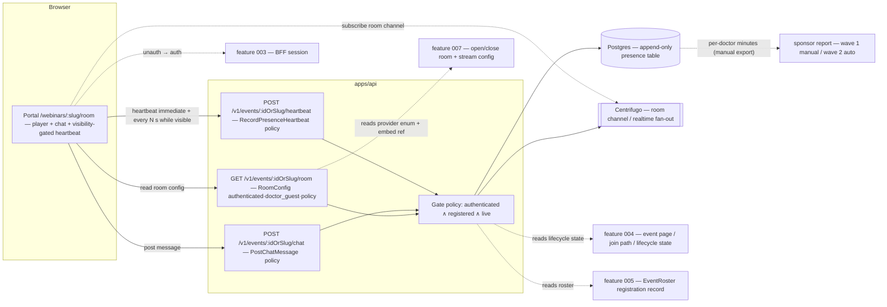
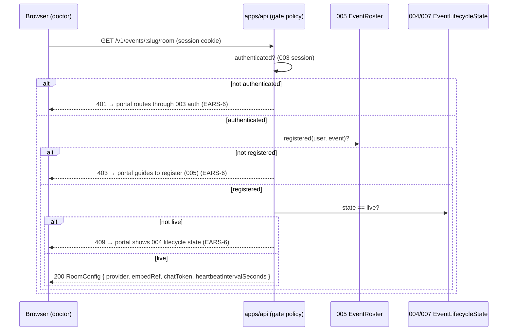
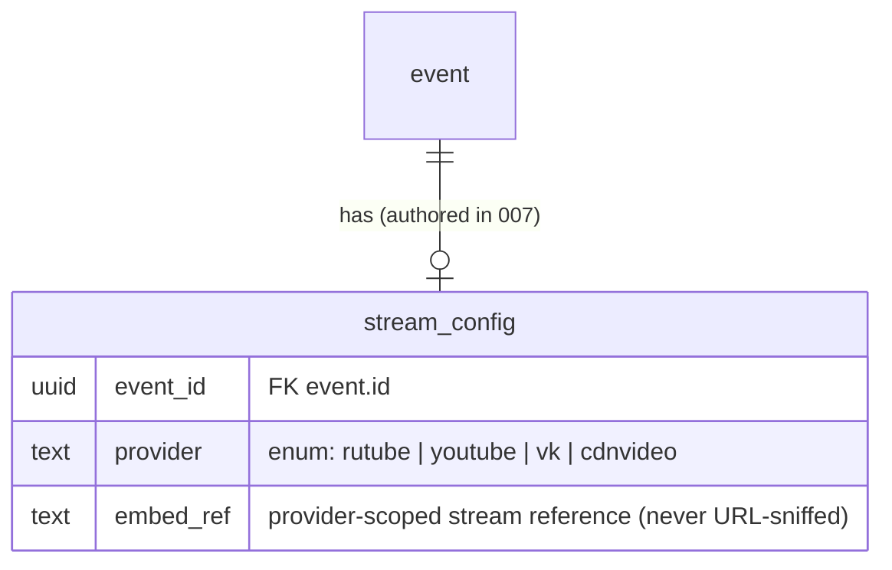
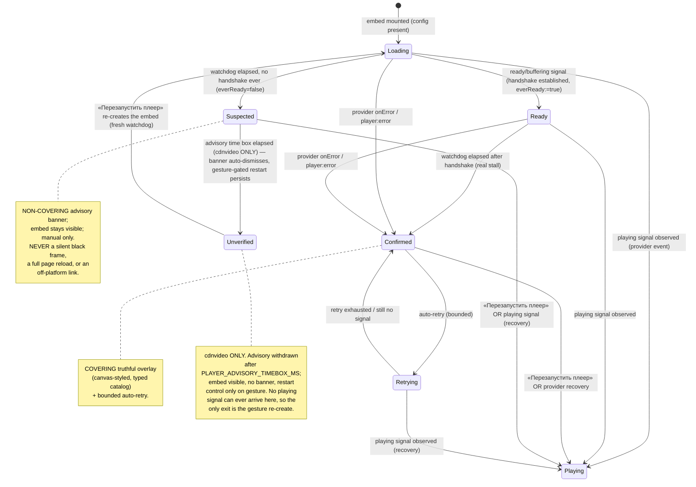
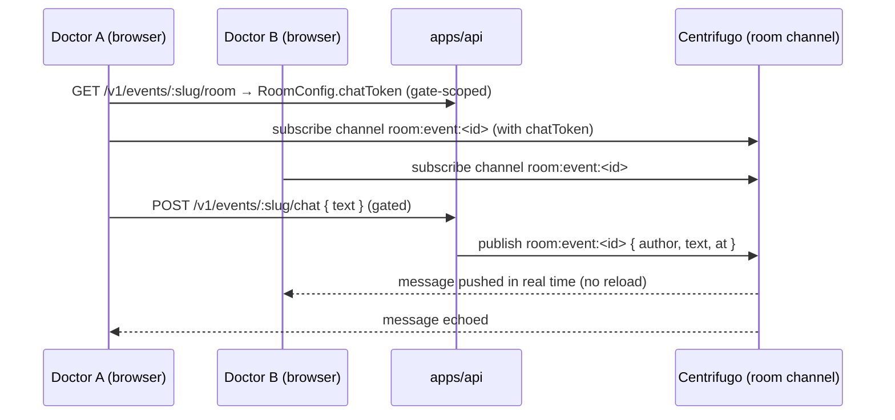
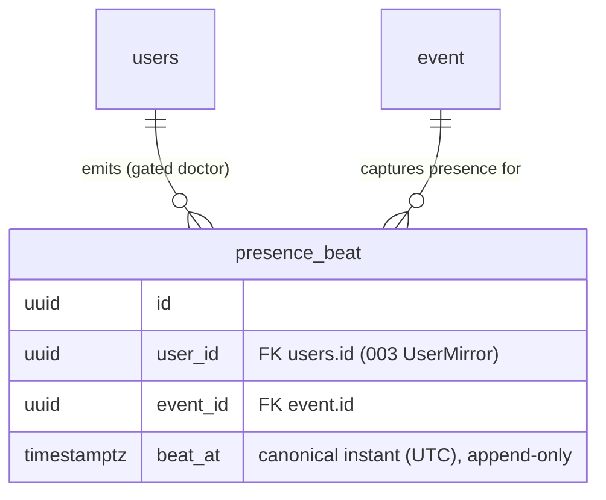
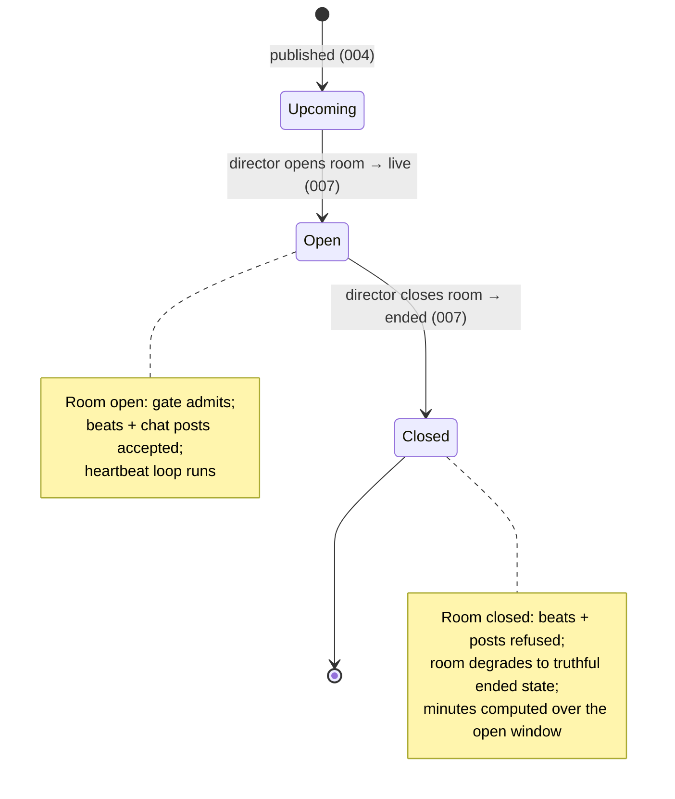
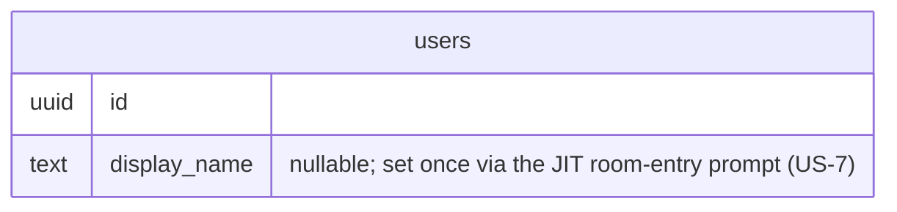
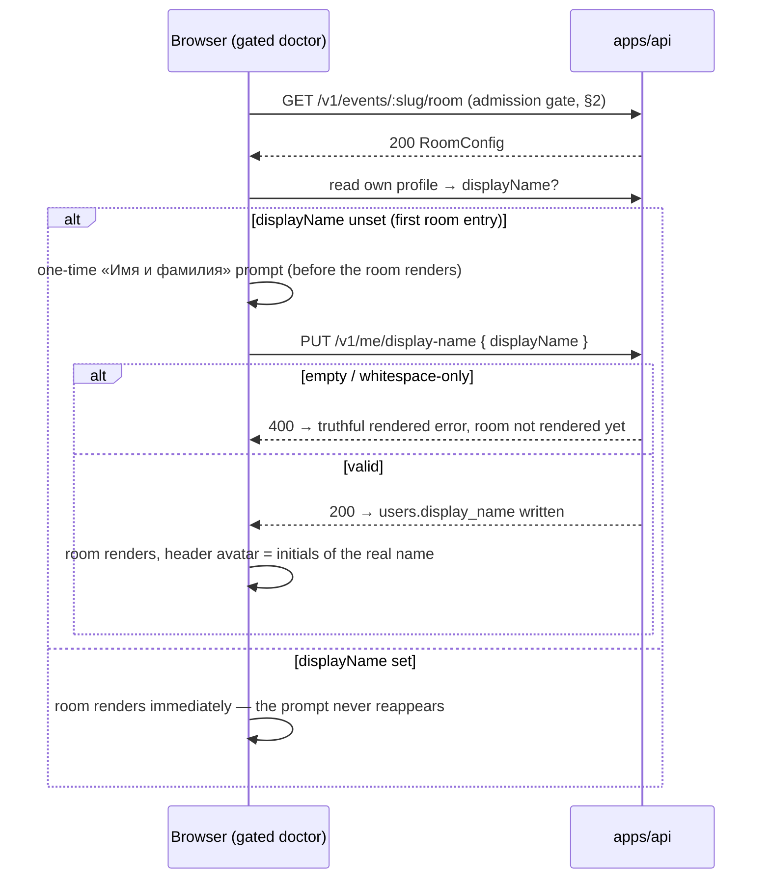

# 006 — Webinar room: embed player, live chat, heartbeat presence (Design)

## 1. Architecture overview

Feature 006 is the **room vertical**: one registration-and-live-gated read (`RoomConfig`) and two gated commands (`PostChatMessage`, `RecordPresenceHeartbeat`) in `apps/api`, plus the room surface in `apps/portal`. It owns **no** auth primitive (reuses shipped 003), **no** registration (reads the 005 `EventRoster` as the admission basis), and **no** event authoring / room open-close (reads the 007-owned `EventLifecycleState` + stream config). It **produces** the durable presence beats the sponsor report draws from.

```mermaid
flowchart LR
  subgraph Browser
    RM[Portal /webinars/:slug/room — player + chat + visibility-gated heartbeat]
  end
  subgraph apps_api[apps/api]
    Q1[GET /v1/events/:idOrSlug/room — RoomConfig  authenticated·doctor_guest·policy]
    C1[POST /v1/events/:idOrSlug/chat — PostChatMessage  policy]
    C2[POST /v1/events/:idOrSlug/heartbeat — RecordPresenceHeartbeat  policy]
    GATE[Gate policy: authenticated ∧ registered ∧ live]
  end
  PG[(Postgres — append-only presence table)]
  CF[[Centrifugo — room channel / realtime fan-out]]
  AUTH[feature 003 — BFF session]
  P004[feature 004 — event page / join path / lifecycle state]
  P005[feature 005 — EventRoster registration record]
  W007[feature 007 — open/close room + stream config]

  RM -->|read room config| Q1 --> GATE
  RM -->|post message| C1 --> GATE --> CF
  RM -->|heartbeat immediate + every N s while visible| C2 --> GATE --> PG
  GATE -. reads roster .-> P005
  GATE -. reads lifecycle state .-> P004
  Q1 -. reads provider enum + embed ref .-> W007
  RM -. subscribe room channel .-> CF
  RM -. unauth → auth .-> AUTH
  PG -. per-doctor minutes (manual export) .-> RPT[sponsor report — wave 1 manual / wave 2 auto]
```

The gate is **server-side and singular** — the same policy (`authenticated ∧ registered ∧ live`) guards the config read, the chat publish, and the heartbeat append. There is **no** soft UI wall: an ungated caller never receives player config, a chat credential, or a recorded beat (§2). The only durable write 006 owns is the append-only presence beat; the only surface it owns is the room.

## 2. The gate — one policy, three protected operations

Admission is a **policy** evaluation (ADR-0001 §2, `auth_check: policy`), not a role fast-path: role alone (`doctor_guest`) is necessary but not sufficient. The three conditions:

1. **Authenticated** — a valid 003 BFF session (else EARS-6 routes through auth).
2. **Registered** — `(user_id, event_id)` is present in the 005 `EventRoster` (else EARS-6 guides to register).
3. **Live** — the single `EventLifecycleState` is `live` (else EARS-6 shows the 004 lifecycle state; and EARS-7 closes an open room when it leaves `live`).

```mermaid
sequenceDiagram
  participant B as Browser (doctor)
  participant API as apps/api (gate policy)
  participant R as 005 EventRoster
  participant L as 004/007 EventLifecycleState
  B->>API: GET /v1/events/:slug/room  (session cookie)
  API->>API: authenticated? (003 session)
  alt not authenticated
    API-->>B: 401 → portal routes through 003 auth (EARS-6)
  else authenticated
    API->>R: registered(user, event)?
    alt not registered
      API-->>B: 403 → portal guides to register (005) (EARS-6)
    else registered
      API->>L: state == live?
      alt not live
        API-->>B: 409 → portal shows 004 lifecycle state (EARS-6)
      else live
        API-->>B: 200 RoomConfig { provider, embedRef, chatToken, heartbeatIntervalSeconds }
      end
    end
  end
```

- The **same gate** wraps `PostChatMessage` and `RecordPresenceHeartbeat` — a message or beat from an ungated caller is refused server-side (EARS-1, EARS-8). The gate is enforced in the backend before any Centrifugo publish or Postgres append.
- **No soft wall.** The portal never renders the player, subscribes to the chat channel, or starts the heartbeat loop before a `200 RoomConfig` — a denied read routes (EARS-6), it does not hide a rendered player behind a modal.
- The distinction from earlier slices: 004's reads are `public`, 005's writes/reads are `fast-path` `doctor_guest`; 006 is the **first `policy` auth_check** in the webinar domain, because registration+live is a resource-scoped decision the role alone cannot make.

## 3. The embed player — explicit provider enum, never URL-sniffing

`RoomConfig.provider` is a **closed enum** authored in the event stream config (007): `rutube | youtube | vk | cdnvideo` — the RU-reachable, embeddable providers.

```mermaid
erDiagram
    event ||--o| stream_config : "has (authored in 007)"
    stream_config {
      uuid event_id "FK event.id"
      text provider "enum: rutube | youtube | vk | cdnvideo"
      text embed_ref "provider-scoped stream reference (never URL-sniffed)"
    }
```

- The portal instantiates the embed by **switching on `provider`**, using `embedRef` as the provider-scoped stream reference — an iframe to each provider's own published embed endpoint. It **never** parses the URL string to guess the provider (the legacy mistake, recon §5). The per-provider `embedRef` shape is validated at the 007 SSOT boundary (`@ds/schemas` `EMBED_REF_SHAPES`):
  - `rutube` / `youtube` — an opaque provider id (`rutube.ru/play/embed/<id>`, `youtube.com/embed/<id>`).
  - `vk` — `oid_id` with an **optional** `_hash` suffix. VK's current «Встроить» dialog for a **public** video emits `video_ext.php?oid&id&hd` with **no hash** and the player renders from oid+id alone (live-verified 2026-07-24), so a bare `oid_id` is valid; **private/unlisted** embeds carry the extra server-minted `hash`. Either way the reference stays an opaque id (not a link), so the no-URL-sniffing invariant holds unchanged: the portal re-composes `vk.com/video_ext.php?oid&id` and appends `&hash` only when the ref carried one. Live broadcasts use the same shape.
  - `cdnvideo` — the **stored-URL exception**. CDNVideo provisions a whole hosted Aloha-player page per stream and hands the customer that URL; there is no bare stream id, so `embedRef` **is** the full player URL and the room embeds it verbatim. Because that value flows straight into the `<iframe src>`, its `EMBED_REF_SHAPES` entry is a strict **https + host + path allowlist** pinned to `playercdn.cdnvideo.ru/aloha/players/` — the **SSRF guard** that keeps a mis-authored 007 config from pointing the frame at an arbitrary origin. This is the one provider whose reference is a URL; the id-style providers still reject a URL-shaped paste.
- **No off-platform / direct link in the room.** The room renders the embed **only** — there is deliberately no "watch on the provider's site" affordance. The platform must not invite viewers off-platform: heartbeat-covered in-room time is the sponsor value — a browser-observed record, not proof of physical attention; an off-platform link moves viewing outside that evidence and directs the audience away (owner decision 2026-07-24). A refused embed degrades to the truthful "stream unavailable" state, not an escape hatch.
- **Operational default — RU audience → RU-reachable, embedding-enabled provider (Rutube the standing default).** RU-audience events broadcast on a **RU-reachable provider with embedding enabled**, and **Rutube is the standing default**; the provider per event stays an **owner call** authored in 007. This is an operational broadcasting default (which provider a given эфир uses), **not** a code constraint — the enum and the embed switch are provider-neutral. The four enum values (`rutube | youtube | vk | cdnvideo`) are exactly the RU-reachable, embeddable providers vetted for the audience (#1154); the admin surface (007) warns when a chosen provider risks embedding restrictions for the RU audience (#1135).
- **Unknown/absent provider** → a truthful "stream unavailable" room state (EARS-2), never a guessed embed. This is the fail-closed default when 007's stream config is incomplete.
- **Extending the enum is a migration.** Adding a further provider is an additive change to the enum (`ALTER TYPE … ADD VALUE`) + a new embed branch + its `EMBED_REF_SHAPES` entry, not a shape 006 pre-builds. The enum lives in `packages/schemas/` (Zod), the single SSOT the API, the DB enum, and the portal share.

### 3.1 Player failure states — watchdog + truthful status + in-room retry (EARS-18)

`resolveEmbed()` historically knew only two states — «config present → iframe» and «config absent → unavailable», decided **solely by config presence**. A failure **inside** the iframe (the 2026-07-22 case: a Rutube CDN-edge timeout, an endless spinner) is invisible to the room: a cross-origin iframe is opaque to the parent, and `iframe.onload` **fires even on a provider error page**. So the room needs an explicit **runtime player-state machine**, distinct from the config-absent EARS-2 "stream unavailable" state.

**Two failure grades keep the status truthful.** The watchdog alone cannot distinguish a genuinely-stalled stream from a healthy-but-unobservable one (cdnvideo exposes nothing to the parent at all, and any embed whose handshake never arrived — youtube, rutube, or a vk src built without `js_api=1` — is equally opaque). Covering a possibly-healthy video with a "stream not loading" overlay + auto-retry would itself be untruthful (and an auto re-create would interrupt working playback). So a watchdog stall is **graded** by whether any positive signal was ever observed (`everReady`):

- **CONFIRMED** — an observed provider error (`onError` / `player:error`), OR a watchdog stall **after** the handshake was established (a real signal loss). The room COVERS the embed with a specific truthful overlay and runs the bounded auto-retry.
- **SUSPECTED** — a watchdog stall with **no** positive signal ever seen. The room CANNOT prove failure, so it shows a **non-covering advisory banner** beside the still-visible, still-interactive embed and does **not** auto-retry (manual «Перезапустить плеер» only). cdnvideo — and any embed whose handshake never arrived (youtube, rutube, or a vk src built without `js_api=1`) — can only ever reach this grade.

```mermaid
stateDiagram-v2
  [*] --> Loading: embed mounted (config present)
  Loading --> Playing: playing signal observed (provider event)
  Loading --> Ready: ready/buffering signal (handshake established, everReady:=true)
  Ready --> Playing: playing signal observed
  Loading --> Suspected: watchdog elapsed, no handshake ever (everReady=false)
  Suspected --> Unverified: advisory time box elapsed (cdnvideo ONLY) — banner auto-dismisses, gesture-gated restart persists
  Unverified --> Loading: «Перезапустить плеер» re-creates the embed (fresh watchdog)
  Ready --> Confirmed: watchdog elapsed after handshake (real stall)
  Loading --> Confirmed: provider onError / player:error
  Ready --> Confirmed: provider onError / player:error
  Confirmed --> Retrying: auto-retry (bounded)
  Confirmed --> Playing: «Перезапустить плеер» OR provider recovery
  Suspected --> Playing: «Перезапустить плеер» OR playing signal (recovery)
  Retrying --> Playing: playing signal observed (recovery)
  Retrying --> Confirmed: retry exhausted / still no signal
  note right of Confirmed
    COVERING truthful overlay
    (canvas-styled, typed catalog)
    + bounded auto-retry.
  end note
  note right of Unverified
    cdnvideo ONLY. Advisory withdrawn
    after PLAYER_ADVISORY_TIMEBOX_MS;
    embed visible, no banner, restart
    control only on gesture. No playing
    signal can ever arrive here, so the
    only exit is the gesture re-create.
  end note
  note right of Suspected
    NON-COVERING advisory banner;
    embed stays visible; manual only.
    NEVER a silent black frame,
    a full page reload, or an
    off-platform link.
  end note
```

- **Watchdog is the detection floor (provider-agnostic).** A named portal design constant `PLAYER_WATCHDOG_MS` (default **~20 s**) bounds the time from embed mount to the first observed playing signal; elapsing with no signal grades to `Suspected` (no handshake) or `Confirmed` (post-handshake stall) (EARS-18.1). This is the **only** universal detector — it works even for providers that expose nothing to the parent, but on its own it can only ever raise the SUSPECTED grade (it cannot prove a failure it cannot observe).
- **Provider events layer on top where they exist (EARS-18.2).** A `ready`/`buffering`/`playing` signal establishes the handshake (`everReady`); an `onError`/`player:error` is a CONFIRMED failure. Observed from official provider docs (design facts, cited):

  | Provider     | Parent-observable API                                          | ready / playing / buffering                                                                                           | Errors (codes)                                                                                  | In-place reload (no iframe re-create) |
  | ------------ | -------------------------------------------------------------- | --------------------------------------------------------------------------------------------------------------------- | ----------------------------------------------------------------------------------------------- | ------------------------------------- |
  | **youtube**  | IFrame Player API (`enablejsapi=1` + `origin`)                 | yes / yes / yes                                                                                                       | **yes, with codes** — 100 = unavailable; 101 / 150 = embedding disabled by owner; 153 = referer | yes (`loadVideoById`)                 |
  | **rutube**   | postMessage JSON API                                           | yes (`player:ready`) / yes / yes (`player:changeState`)                                                               | yes (`player:error`) — **message only, no cause codes**                                         | yes (`player:changeVideo`)            |
  | **vk**       | postMessage JS API — **only with `js_api=1` in the embed src** | yes (`inited` handshake) / yes (`started`, `timeupdate` `state: "playing"`) / yes (`timeupdate` `state: "unstarted"`) | no error event observed — a stall shows as an absent/non-advancing `timeupdate`                 | no — iframe re-create only            |
  | **cdnvideo** | none — the served bundles emit **no** parent-directed message  | nothing from a cross-origin iframe                                                                                    | nothing (its error UI renders inside the iframe only)                                           | no (in iframe mode)                   |

  So for **youtube** the room establishes the handshake on `onReady`/`onStateChange`, clears the watchdog on `PLAYING`, and maps `onError` to distinct CONFIRMED copy — **101/150 → «встраивание запрещено владельцем трансляции»** vs **100 → «видео недоступно»**; for **rutube** it establishes on `player:ready`, clears on `player:changeState(playing)`, and shows a generic CONFIRMED failure on `player:error` (no code to distinguish).

  **vk is observable — conditional on the embed src (`js_api=1`).** A live probe of a real VK live embed (2026-08-20) established that VK Video **does** emit parent `postMessage` traffic, but **only when the src carries `js_api=1`**: an `inited` handshake at roughly `t+4.5 s`, a `started` message when playback begins, and a recurring `timeupdate` (~every 265 ms) carrying a `state` of `"playing"` / `"unstarted"` plus an advancing `time`. The URL shape the portal builds today omits `js_api`, which is exactly why the parent observes **zero** events. Therefore:

  - `EMBED_REF_SHAPES` / the vk embed branch **must build the src with `js_api=1`** — `PROVIDER_EMBED_SRC.vk` appends it, and this parameter is a **contract of the design, not an optional tweak**: without it vk is unobservable and degrades to SUSPECTED-only.
  - `PROVIDER_HAS_PARENT_API.vk` is **true**. The room establishes the handshake on `inited`, clears the watchdog on `started` or a `timeupdate` whose `state` is `"playing"`, and — since VK exposes no error event — treats a post-handshake absence of advancing `timeupdate` beyond the watchdog as the CONFIRMED post-handshake stall, exactly like any other provider.
  - A vk embed whose `inited` never arrives is a **failed handshake** ⇒ SUSPECTED, never covered.

  **cdnvideo is structurally silent — permanently SUSPECTED-only.** A byte-identical probe of the served clappr bundle (60+ s of decoded playback → **zero** parent messages) plus a static scan of all three served bundles (no parent-directed `postMessage`; the clappr hits found are hls.js **worker** traffic, not parent traffic) establishes that no parent-observable signal exists to layer on. Its own error UI renders **inside** the iframe. So cdnvideo detection is **watchdog-only** forever — it can never reach CONFIRMED, and the room never covers the embed or auto-retries it. This is a structural capability constraint verified by probe, not a TODO and not a deferral; the remedy is the time-boxed advisory below.

- **Bounded retry (CONFIRMED); manual-only (SUSPECTED), in-room always (EARS-18.3).** On `Confirmed`, the room **auto-retries up to `PLAYER_MAX_AUTO_RETRIES` (default 2)** with a delay (`PLAYER_RETRY_DELAY_MS`), re-creating the embed each attempt (or an in-place provider reload where supported); exhausted → the manual **«Перезапустить плеер»** affordance in the covering overlay. On `Suspected` there is **no** auto-retry (re-creating a possibly-healthy embed would interrupt it) — the advisory banner offers the same manual **«Перезапустить плеер»** from the start. For the permanently-unobservable **cdnvideo** the suspected-grade remedy is explicitly **time-boxed and gesture-gated**: a named constant `PLAYER_ADVISORY_TIMEBOX_MS` (default **~60 s** from the moment the banner appears — a **lead-chosen starting default**, not a probe- or owner-derived number, tunable as a design/config edit after the first live cdnvideo эфир) after which the banner **auto-dismisses**, leaving a persistent low-emphasis **«Перезапустить плеер»** control that re-creates the embed **only on an explicit doctor gesture** (a click) — never on a timer, never on mount. The time box exists because a silent provider means an indefinitely-shown advisory would sit over a stream that is most likely playing fine; the gesture gate exists because a re-create the room cannot justify is an interruption, not a repair. **The time box is cdnvideo-only** (the `Suspected --> Unverified` transition above carries that guard): every other SUSPECTED case — a failed youtube/rutube/vk handshake — keeps its advisory banner until a playing signal or a manual restart clears it, because for those providers a signal genuinely can still arrive and a self-withdrawing banner would hide a real, observable failure. Both grades re-create the embed on the manual control and clear the status. **Never** `window.location.reload()` (a full page reload tears down the room, the chat connection, and resets the heartbeat context), and **never** a "watch on the provider's site" / off-platform link — heartbeat-covered in-room time is the browser-observed sponsor evidence, not proof of physical attention; an off-platform link moves viewing outside that evidence and directs the audience away (owner decision 2026-07-22; §3 no-off-platform bullet).
- **Recovery clears the status (EARS-18.4).** A playing signal observed after `Confirmed`/`Retrying`/`Suspected` — from an auto-retry, the manual restart, or the provider self-recovering — transitions back to `Playing` and clears the covering overlay or the advisory banner. The 2026-07-22 Rutube CDN edge self-recovered after ~22 s failover; with the watchdog + retry the doctor sees a truthful status and can restart rather than stare at a black frame while the CDN heals.
- **Presence is decoupled from player state (EARS-18.5).** The visibility-gated heartbeat loop (§5) runs from the room mount and is **not** wired to player state — a failed/retrying/unavailable player neither pauses nor resets the heartbeat, and the in-room presence count (§5) is unaffected. The doctor stays counted present while the room tab is visible, exactly as before. `room-presence.tsx` is already structurally independent of the player (EARS-4/EARS-5); this invariant records that the failure-state work must keep it so.
- **Rationale / evidence trail (#1125).** The defect is real and re-confirmed live 2026-07-22: a Rutube CDN edge (`river-*.rtbcdn.ru`) timed out on the HLS manifest → endless spinner in the embed; the player self-recovered only after ~22 s CDN failover, and on one browser never did. The always-present direct-watch link (PR #1133) was **NO-GO'd** by the owner (2026-07-22) because it routes doctors off-platform and in-room presence control is a key platform function; the on-platform truthful-status-and-retry remedy (Stage-A Вариант 1, owner pick 2026-07-24) is this section.

## 4. Live chat over Centrifugo

Chat rides **Centrifugo** (already in the stack — dev stand + engineering-readiness spec); 006 adds a room channel and a gate-scoped connection token, not a new transport.

```mermaid
sequenceDiagram
  participant B1 as Doctor A (browser)
  participant B2 as Doctor B (browser)
  participant API as apps/api
  participant CF as Centrifugo (room channel)
  B1->>API: GET /v1/events/:slug/room → RoomConfig.chatToken (gate-scoped)
  B1->>CF: subscribe channel room:event:<id>  (with chatToken)
  B2->>CF: subscribe channel room:event:<id>
  B1->>API: POST /v1/events/:slug/chat { text }   (gated)
  API->>CF: publish room:event:<id> { author, text, at }
  CF-->>B2: message pushed in real time (no reload)
  CF-->>B1: message echoed
```

- **Posting is server-mediated.** A message is posted through the gated `PostChatMessage` command; the backend authorizes the gate, then publishes to the channel. The `chatToken` grants **subscribe** to the room channel only — a client **cannot** publish directly to the channel without going through the gated command (EARS-3, EARS-8). This keeps the post path behind the same server-side gate as everything else.
- **Real-time fan-out, no reload** — subscribers receive each published message over the live connection (EARS-3).
- **History retention spans the session, not a window.** The `room` namespace keeps bounded history (`history_size: 100`, `history_ttl` = a full webinar + margin, 12 h) so a doctor reloading or (re)subscribing at any point in the эфир hydrates the recent conversation — the pane never states «Пока нет сообщений» over a live room after a quiet stretch. Retention is a config contract kept longer than the longest product session; `history_size` stays bounded so the buffer is capped regardless of TTL.
- **A dropped connection is truthful, never silent.** The connection token has a finite TTL and a long-lived websocket can drop and re-handshake, so the pane tracks the Centrifugo connection state across the whole session: a transient drop shows a reconnecting banner while the SDK retries with backoff; a terminal disconnect (the gate no longer admits — `getToken` threw `UnauthorizedError`, so the SDK stopped) prompts a reload. An established conversation is never left silently stale, and is never replaced by the empty-state (EARS-3). Copy resolves through the typed catalog (EARS-10).
- **Chat is not the presence record.** Centrifugo per-channel presence is ephemeral; it is not relied on for the sponsor minutes (§5). Chat availability tracks the room's open window: once the room closes (EARS-7), posting is refused.

## 5. Presence — server-authoritative heartbeat + durable append-only table

Presence is the **B2B deliverable** (per-doctor minutes for the sponsor). It is captured server-authoritatively and stored durably — never a client-trusted count, never the exposed-service-key client pings the legacy used (recon §6).

```mermaid
erDiagram
    users ||--o{ presence_beat : "emits (gated doctor)"
    event ||--o{ presence_beat : "captures presence for"
    presence_beat {
      uuid id
      uuid user_id "FK users.id (003 UserMirror)"
      uuid event_id "FK event.id"
      timestamptz beat_at "canonical instant (UTC), append-only"
    }
```

- **Append-only.** Each accepted heartbeat is one immutable row `(user_id, event_id, beat_at)` — no in-place update, no client-supplied minute count (ADR-0003 §3). The room open/close and first-entry facts are appended to `audit_ledger` (§6, ADR-0003 §6).
- **Cadence N is server config, default 60 s.** `RoomConfig.heartbeatIntervalSeconds` carries N to the client, which posts on that interval. The presence-minute derivation is **parameterized over N** — an operator-confirmed different cadence changes the config value, not the spec or the code (owner decision 2026-07-06). Legacy evidence was 60 s (recon §10-3), the default.
- **Visibility-gated client loop.** The client posts beats **only while the room tab is the visible, active tab** (Page Visibility API — `document.hidden` false): an immediate beat on entry/re-entry, then the N-second grid. A backgrounded tab emits no beats, so its minutes never count toward the sponsor report; returning visible emits an immediate beat and restarts the grid (EARS-4, owner decision 2026-07-07). A still-visible foreground tab keeps beating even if the person physically walks away — there is no truthful signal to distinguish that case without the deferred interactive confirmation. This is a **client-side capture gate** — the server still refuses any beat from an ungated caller or a closed room (§2, §6), and tab-coalescing is unchanged: two _visible_ sessions in the same interval still count once (concurrent-tabs bullet, EARS-5). NMO thresholds and interactive presence confirmations remain wave 2.
- **Concurrent tabs never inflate.** Per-doctor minutes are computed from the **distinct covered time**, not the raw beat count: beats from a doctor's parallel sessions for the same event **coalesce into one presence timeline** (e.g. bucket beats to the N-second grid and count distinct buckets, or union the covered intervals). Two tabs open in the same minute count as **one** minute (EARS-5). This is asserted in the presence-minutes e2e.
- **Minutes formula (illustrative).** `minutes ≈ (distinct N-second buckets a doctor emitted a beat in during the open window) × N / 60`, clamped to the room-open window (EARS-7). The exact aggregation is an implementation detail of the derivation, but it MUST be (a) parameterized over N and (b) tab-coalesced.
- **Wave-1 export is manual.** No report UI: the derivation yields a per-doctor `{ doctor, event, minutes }` set the operator exports manually for the first webinar's sponsor (EARS-5). The wave-2 auto-report «Отчёт партнёра V2» and auto-NMO consume this same data — 006 only captures it; the exact V2 columns/joins are a wave-2 owner call (PRD open question).
- **Realtime presence-count push (server-authoritative).** One durable accepted-beat source feeds two separate derivations: the live in-room counter (« · N» in the chat-column header, §8.1) counts distinct doctors whose latest beat remains fresh; sponsor minutes count accepted-beat N-buckets and receive no trailing grace. The live count is **never** Centrifugo native channel presence: native presence counts connections/tabs and would make the distinct-doctor count wrong. Sponsor reporting reads neither Centrifugo presence nor the `2 × N` count grace. On the beat/expiry path — when an accepted heartbeat, or a presence-window expiry, **changes** the distinct-doctor count — the api **publishes the recomputed count** to the room's realtime channel; the portal `RoomPresenceProvider` consumes the published value and renders it instantly, without waiting on the observer's own next beat. **Channel:** the count rides the **existing** room channel (`room:event:<id>`, §7) as a typed `RoomPresenceCountMessage` (a `type: "presence-count"` discriminant, so it never cross-parses a chat message) — reusing the already-provisioned Centrifugo AND the subscribe-only credential the `RoomConfig` grant already carried, so there is **no** dedicated presence channel, **no** second credential, and **no** new endpoint (the room's single Centrifugo connection, owned by the always-mounted chat panel, routes both). The api publishes only on a **change** (a per-room `lastPublished` latch). An accepted beat from a doctor **not already inside** the freshness window publishes the +1 within ~1 s; a concurrent-tab beat or quick re-entry while still fresh changes nothing and emits nothing. A **per-room timer**, armed for exactly the next `last accepted beat + 2 × N` freshness expiry and re-armed on each beat, catches stopped beats (a WebSocket close is irrelevant) and publishes the decrease within ~1 s **after** that expiry. This `2 × N` window is live-counter grace only: sponsor minutes are still derived from accepted-beat buckets over N and receive no trailing `2 × N` award. **Truthful degradation:** while the realtime channel is unavailable, `RoomPresenceProvider` falls back to the heartbeat-ack refresh path (#1136) — the count returned on each accepted beat — so the counter is beat-paced but **never silently frozen** on a stale value (EARS-5). Runtime/unit tests assert the timer-path causality. The #1139 low-N behavioral harness observes the end-to-end result with a fresh synthetic participant: +1 publication ≤~1 s after the accepted beat; stopped-beat age-out at `2 × N`, then decrease publication ≤~1 s.
- **No PII on public surfaces.** The presence data joins to the `users` mirror (003) at read/export time; no registrant PII is ever copied onto a public 004 surface (EARS-8; recon §6).

## 6. Room lifecycle & close (the 007 seam)

The room's **open window** is the event's `live` state, owned + driven by 007's director controls.

```mermaid
stateDiagram-v2
  [*] --> Upcoming: published (004)
  Upcoming --> Open: director opens room → live (007)
  Open --> Closed: director closes room → ended (007)
  Closed --> [*]
  note right of Open
    Room open: gate admits;
    beats + chat posts accepted;
    heartbeat loop runs
  end note
  note right of Closed
    Room closed: beats + posts refused;
    room degrades to truthful ended state;
    minutes computed over the open window
  end note
```

- **Open** = `live`: the gate admits registered doctors, beats and posts are accepted, the client heartbeat loop runs (EARS-1, EARS-3, EARS-4).
- **Close** = leaving `live` (→ `ended`): the server **stops accepting** heartbeats and chat posts for the event; a late beat/post is refused; the room degrades to the truthful ended state — the **end card** of §8.3 (EARS-7). Per-doctor minutes are computed over the beats captured **while open**.
- **Publishing the close to an open room is a 006↔007 seam.** A doctor sitting in the room learns the room closed only when their next gated request is refused; there is no realtime `room-closed` publication yet, because the close transition is 007's write. That publication (007 emits on `live → ended`, 006 subscribes on the room channel and swaps in the end card without a reload) is a **tracked seam**, not a silent gap — until it lands the room must never guess closure from the clock or the schedule, only from a server answer.
- **006 does not drive the transition** — it reads the state 007 writes. Until 007 lands, the open/close is simulated by transitioning **seeded** events (Dependencies); the "done against the real dependency" criterion is _the room opens/closes via 007 director controls and reads 007-authored stream config_ (§8).

## 7. Room endpoints

Three endpoints, all classified **`access: authenticated`, `required_roles: doctor_guest`, `auth_check: policy`** in the endpoint-authz matrix (ADR-0001 §2) — the registration-and-live gate is a policy eval (§2). DTOs are Zod schemas in `packages/schemas/` (ADR-0002 SSOT), shared by the API and the portal via the generated SDK.

- **`GET /v1/events/:idOrSlug/room`** → `RoomConfig` for the gated caller: `{ provider ∈ {rutube, youtube, vk, cdnvideo}, embedRef, chatToken, heartbeatIntervalSeconds }`. `200` only when authenticated ∧ registered ∧ live; `401`/`403`/`409` respectively drive the three EARS-6 branches. Per-caller (the `chatToken` is caller-scoped) ⇒ not a shared-cacheable resource.
- **`POST /v1/events/:idOrSlug/chat`** → `PostChatMessage`. Gate → publish to Centrifugo `room:event:<id>`; refused if the room is not open or the caller is ungated (EARS-3, EARS-7). Emits `ChatMessagePosted` (transient, not the presence record).
- **`POST /v1/events/:idOrSlug/heartbeat`** → `RecordPresenceHeartbeat`. Gate → append one immutable raw `presence_beat` row for every accepted call; refused once the room is closed (EARS-4, EARS-7). Concurrent tabs are not suppressed at write time. Only the EARS-5 derivations coalesce: the live count by distinct doctor within the freshness window, and sponsor minutes by distinct doctor/N bucket (§5). Emits `PresenceHeartbeatRecorded`.

## 8. Portal surface (canvas-faithful)

Built from `@ds/design-system` tokens to the vendored `webinar-room.dc.html` (ADR-0013; canvas = fidelity spec). The room's net-new units (the embed player frame, the chat panel) run the `build-ui-from-design-system` registry gate first (shadcn chat primitives / react-player + thin Rutube iframe per the epic adopt-vs-build), recorded in the PR.

### 8.1 The room — `/webinars/:slug/room`

- **Desktop** (Twitch-model, `webinar-room-frame.dc.html` + `chat-column.dc.html`): a **viewport-bounded flex shell** — the room fills the viewport height under the app header (`h-dvh`, `overflow-hidden`) and **nothing but the chat ledger scrolls**; the page never scrolls. A flex row: the **maximized player region** (`flex-1`, a dark letterbox filling the region — the embed iframe pinned `inset-0`, EARS-9: **no custom player chrome**, the provider owns its own controls; the live overlay badge + the canvas-styled unavailable state ride on top) on the left, with a **one-line context strip** under it (school/series eyebrow · title · speakers). The chat is a fixed **340px aside** (2px left border) that **collapses to a 44px rail** — a vertical «Чат эфира» label + a red unread badge that accumulates while folded (client state, no persistence); collapsing hides the chat panel but keeps it **mounted** so the Centrifugo connection never tears down on a UI fold. The chat column carries a header (heading + live presence count « · N» from the same aggregate the room header reads), the moderator pin, the **message ledger**, and the composer pinned at the bottom.
- **Chat ledger anatomy** (`chat-column.dc.html`): a `flex-col-reverse` **stick-to-bottom** ledger — while pinned to the newest message (|scrollTop| < 32), arrivals autoscroll in; scrolled up, autoscroll pauses and a **«Новые сообщения ↓» chip** surfaces on each new message (cleared by a jump-to-newest or by re-sticking). Rows are **borderless single paragraphs** — a bold name slot inline with the text, **no timestamp, no avatar** (own message → «Вы» in the accent colour; others → the participant label + tag; the real-name + Спикер/Мод badge slot presumes #1121, out of scope — no dead placeholder).
- **Mobile**: **height-bounded** — a full-bleed `16/9` player (fixed), a one-line "what's on air" strip (red kicker · ellipsized title), then a tab strip. **Wave-1 tab set = Чат / О эфире** (the canvas's **Вопросы** tab is the named wave-2 deferral, §requirements Out of scope) — the active pane owns the remaining height, the chat ledger scrolls inside it, and the composer is pinned at the bottom of the Чат tab; О эфире is the read-only event context (title, speakers, program).
- **The «Задать вопрос» / «Вопросы» affordances are not built** in wave 1 (question-to-lecturer is wave 2) — the desktop aside is a single chat pane, and the mobile tab strip omits Вопросы. This is the exact analogue of 005 shipping only the `my-events` Предстоящие tab.
- **"Stream unavailable" state** (EARS-2): when the provider is unknown/absent (no stream configured), the player region renders a truthful, canvas-styled unavailable state (dark region) — no guessed embed, keeping the room chrome. This is the **config-absent** dead-end (pending 007 config); it is distinct from the **runtime failure** state below (a configured embed that fails to play).
- **Player failure state** (EARS-18, §3.1): a configured embed that mounts but never starts playing (watchdog elapsed, or a provider `onError`) renders the truthful in-frame status overlay (canvas-styled, «Трансляция не загружается» / for YouTube the distinct «встраивание запрещено владельцем трансляции» vs «видео недоступно») over the dark player region — the room auto-retries (bounded) and then surfaces the **«Перезапустить плеер»** outline button that **re-creates the embed** (never a full page reload, never an off-platform link), clearing on recovery. A SUSPECTED grade instead renders the non-covering advisory beside the live embed; for cdnvideo that advisory withdraws itself after `PLAYER_ADVISORY_TIMEBOX_MS`, leaving only the gesture-gated restart control. The room chrome, chat, and heartbeat keep running throughout.
- **Ended state — the end card** (EARS-7, §8.3): distinct from both of the above. Once the room is closed the player region carries the calm end card, chat history stays readable, and the composer is replaced by the truthful ended line.
- **Visibility-gated heartbeat** (EARS-4): no visible affordance — room entry sends an immediate beat, then the heartbeat loop runs on the `RoomConfig.heartbeatIntervalSeconds` cadence **while the room tab is the visible, active tab** (Page Visibility API — `document.hidden`), with **no** doctor-facing "prove you're here" control; when the tab is backgrounded the loop pauses (its minutes do not count toward the sponsor report), and returning it to visible sends an immediate beat before restarting the N-second cadence.
- **Room header (canvas):** alongside the room chrome the header carries two doctor-facing controls from the canvas — the light/dark **theme toggle** (the canvas **44×44 icon-button** in the header's icon-button family, the portal's only visible theme control until #510; mechanism + look in §10) and the **initials avatar** derived from the doctor's real display name (JIT-collected; §11). The avatar is the shipped DS `avatar.tsx` primitive; the theme toggle is the canvas icon-button built from tokens — the DS `switch.tsx` stays the FORM switch primitive and is **not** the room-header theme control (owner Stage-B decision 2026-07-12; ADR-0013 canvas-wins).

### 8.2 Time, copy & i18n

- **МСК (EARS-10).** Any **absolute** time in the room (the «О эфире» program schedule) is formatted in `Europe/Moscow` labeled **МСК** via the shared 004/005 formatter — never the viewer's local timezone (Playwright asserts no drift by overriding `timezoneId`). The live-elapsed indicator («В эфире · N мин») derives from the event's canonical `startsAt`.
- **Copy & i18n (EARS-10).** All user-facing copy (the live badge, room chrome, chat placeholder/labels/empty-state, the access-branch guidance, the "stream unavailable"/ended states) resolves through the typed message catalog established in 003 (EARS-21) and reused in 004/005. RU ships now; no hardcoded string survives the `apps/portal` ESLint gate.

### 8.3 The ended state — the end card (EARS-7)

The closed room is a **product surface**, not a dead page. Owner decision 2026-08-20 (verbatim): «Вариант 2 по #1238».

- **Composition.** The player region — the whole area the embed occupied — is replaced by a calm, full-area **end card**: the эфир has ended, the **recording will appear in «Мои события»** (the 005 surface; the recording hand-off itself is the tracked #1188 obligation, so the card promises the destination, never a link that does not yet resolve), and a pointer to the **nearest upcoming эфиры**. Room chrome (header, theme toggle, avatar) stays.
- **Chat degrades, it does not vanish.** The ledger stays mounted and **readable/scrollable** — the transcript is the value the doctor came back for. Only the **composer** is swapped for a truthful ended line from the typed catalog; a silently disabled input, or one that accepts text and then fails, is banned (EARS-10 copy rules apply).
- **Option 1 is the first step, not a competing design.** The minimal «ТВ-заставка» (the plain "broadcast has ended" placard) is the card's **first increment** — the same component, the same slot; the recording pointer and the upcoming-эфиры block layer into it afterwards without a rewrite. Shipping the placard first is planned sequencing, not a stub.
- **Entering the ended state.** Today: on the next gated request being refused (the room never infers closure from the clock). With the §6 006↔007 realtime `room-closed` publication: immediately, without a reload.
- **The look is a product decision, not a lead call.** The card's visual design goes through the ADR-0013 cycle — vendored canvas → Stage-A option choice by the product owner → Stage-B live re-confirmation — **before** it is built.

## 9. Seams (consumed by / consumed from other verticals)

Each seam is a **tracked** dependency, not a silent stub (AGENTS.md §6 F-22; wired by `open-ears-issues` step 4).

| Seam                                | Owner              | 006's relationship                                                                                            | "Done against the real dependency" criterion                                                          |
| ----------------------------------- | ------------------ | ------------------------------------------------------------------------------------------------------------- | ----------------------------------------------------------------------------------------------------- |
| Auth session                        | 003                | Reused verbatim; an unauthenticated visitor routes through 003. 006 adds no auth primitive.                   | The room gate reads the live stand's real 003 session (verified here).                                |
| Event page / join path / lifecycle  | 004                | The room is entered from the 004 page/join path; a non-`live` event falls back to the 004 lifecycle state.    | The room is entered from the real 004 page (sequenced after 004 on `main`).                           |
| Registration record / `EventRoster` | 005                | Admission reads the 005 roster; an unregistered doctor routes to 005. 006 creates no registration.            | Admission gates on real 005 registrations (sequenced after 005 on `main`; the 005↔006 blocking link). |
| Director open/close + stream config | 007                | 006 reads the `live` window + provider enum/embed ref; built on seeded live events + stream config until 007. | The room opens/closes via 007 director controls and instantiates the player from 007-authored config. |
| Realtime transport                  | Centrifugo (stack) | Chat + a gate-scoped connection token on a room channel; no new infra decision.                               | Chat fans out over the dev-stand Centrifugo (verified on the live stand).                             |
| Sponsor report / auto-NMO           | wave 2             | 006 **produces** the durable presence beats; wave-2 verticals derive the auto-report + NMO from them.         | The wave-2 report/NMO draws exactly the captured beats (verified in the report vertical).             |

006 is completable end-to-end **as its own vertical** on seeds + real 003/004/005: a registered doctor opens a seeded live event's room → the player renders from the seeded provider enum → chat posts fan out over Centrifugo → the heartbeat loop appends beats → per-doctor minutes derive (tab-coalesced, over N) → the room closes and capture stops. That is the F-22 "vertical slice is completable" bar for 006; the 007 open/close, the wave-2 report, and auto-NMO are the boundaries of _other_ slices, not unfinished parts of this one.

## 10. Theme — portal-wide mechanism, room-header control (EARS-12, EARS-13)

The portal gains its first **runtime theme mechanism**; the `@ds/design-system` dark tokens have been shipping unused (`packages/design-system/tokens/semantic.dark.json` + `.dark`-scoped CSS in `packages/design-system/src/styles/tokens.css`) — 006 wires the class application they wait on.

- **Application.** The theme is the `.dark` class on `<html>` (`document.documentElement`), matching the `.dark` scope the DS token CSS already targets. Light = class absent, dark = class present.
- **Resolution order.** `localStorage` key **`ds-theme`** (`"light" | "dark"`; key absent = no explicit choice) → system `prefers-color-scheme`. A stored explicit choice always wins; with no stored choice the portal follows the system value live (a media-query change re-resolves).
- **FOUC guard.** An inline `<script>` in the portal root layout `<head>` (`apps/portal/app/layout.tsx`), executed synchronously **before first paint and hydration**, reads `localStorage` + the media query and sets the class — the page never flashes the wrong theme on load or reload.
- **The control.** The room-header toggle is the **canvas 44×44 icon-button** (`webinar-room.dc.html` line 25, sitting in the header's icon-button family alongside the 44px mobile ✕): a `<button>` with a transparent background, a 2px border at half-strength header-foreground (the `header-hairline` token, next bullet), a full-strength `header-foreground` glyph — **☾ in the light theme / ☀ in the dark** (the canvas `themeIcon`) — and hover raising the border to full-strength header-foreground. Accessibility: `aria-pressed` reflects the dark state, the accessible name is «Переключить тему» from the typed message catalog, and focus-visible uses the DS focus ring. Activating it flips the class and writes `ds-theme`. The DS `switch.tsx` primitive remains the FORM switch — it is **not** the room-header theme control (owner Stage-B decision 2026-07-12; ADR-0013 canvas-wins). The toggle is the **only** visible theme control in the portal; rolling the control out across portal chrome is the tracked **#510** unified-portal-chrome deferral (owner decision 2026-07-11) — the mechanism itself (class, guard, storage) is portal-wide from day one, so #510 adds placement, not plumbing.
- **The `header-hairline` token.** The half-strength on-header border is a dedicated semantic token — tokens-only styling, never an opacity-dimmed foreground (ADR-0013 §7): **`header-hairline`** (on-header muted border — white at 50% over the blue header band, the canvas `rgba(255,255,255,.5)`), added to `packages/design-system/tokens/semantic.json` **and** `semantic.dark.json` with the **same value in both sets** (white at 50% reads on both header fills — now the same navy `#114D9E` in both themes since owner verdict #4, #1085) by the code PR.
- **A11y gate.** The portal axe e2e (`apps/portal/e2e/a11y/a11y-axe.e2e.spec.ts`) extends its `THEMES` matrix to `["light", "dark"]` — dark must introduce no new violations (EARS-13).
- **No backend footprint.** No endpoint, no column, no event — client-only (`<html>` class + `localStorage`).

## 11. Display name & avatar — JIT collection, self-only exposure (EARS-14…16)

No display name exists server-side today: `users` has no name column, registration collects email+password only, and the Zitadel profile is an explicit never-read placeholder — that stays true. 006 adds the SSOT column and the one-time room-entry collection.

```mermaid
erDiagram
    users {
      uuid id
      text display_name "nullable; set once via the JIT room-entry prompt (US-7)"
    }
```

```mermaid
sequenceDiagram
  participant B as Browser (gated doctor)
  participant API as apps/api
  B->>API: GET /v1/events/:slug/room (admission gate, §2)
  API-->>B: 200 RoomConfig
  B->>API: read own profile → displayName?
  alt displayName unset (first room entry)
    B->>B: one-time «Имя и фамилия» prompt (before the room renders)
    B->>API: PUT /v1/me/display-name { displayName }
    alt empty / whitespace-only
      API-->>B: 400 → truthful rendered error, room not rendered yet
    else valid
      API-->>B: 200 → users.display_name written
      B->>B: room renders, header avatar = initials of the real name
    end
  else displayName set
    B->>B: room renders immediately — the prompt never reappears
  end
```

- **Endpoint.** `PUT /v1/me/display-name` → `SetDisplayName`. Classified `access: authenticated`, `required_roles: doctor_guest`, `auth_check: fast-path` (self-scoped — no room policy gate) in the endpoint-authz matrix. Zod schema in `packages/schemas/`: trimmed, non-empty after trim (whitespace-only rejected), bounded length. The caller's own profile read returns `displayName` (nullable) — never another user's.
- **Ordering.** The JIT prompt is a **portal pre-render step after admission** (§2's server gate is unchanged — `authenticated ∧ registered ∧ live`); the name is not a fourth admission condition. The prompt fires only when the gated doctor's own `displayName` is unset, exactly once per user lifetime.
- **Avatar initials.** Derived client-side from the saved name: the first letters of the first and last words, uppercased (a single-word name yields one initial), rendered in the DS `avatar.tsx` primitive. **Forbidden fallbacks:** initials from the email, the never-read Zitadel placeholder, or any stand-in — with no saved name, no fabricated avatar renders (EARS-15).
- **Identity stance.** `users.display_name` has two surfaces: (1) the **self-profile read/write** (`GET`/`PUT /v1/me/display-name`) is served only to its owner's session (EARS-16) and never returns another user's name; (2) the doctor's **own live-chat authorship** — every chat message the doctor posts carries their own `display_name` in the `authorName` field, shown to all participants (EARS-17, owner decision 2026-07-23, Option A — a reversal of the earlier «visible only to you» stance). The name never appears on a **public** surface, and the Zitadel profile placeholder stays never-read. Registration is untouched (owner decision 2026-07-11 — zero added funnel friction on live prod).
- **Named chat authorship (EARS-17).** The `PostChatMessage` path (§4) resolves the poster's own `display_name` alongside their `authorTag` and stamps the fanned-out `RoomChatMessage` with `authorName: string | null`. When the poster has no name set — and for **legacy history** minted before the field existed — `authorName` is `null` and the portal renders the non-PII «Участник <tag>» participant label; the stable `authorTag` still rides every payload as the self-identity key the client matches its `selfTag` against. The JIT prompt copy discloses the participant-visibility up front («Ваше имя будут видеть участники чата эфира»), replacing the old «видно только вам» promise; names collected under the old promise are shown immediately with no re-consent round (owner decision, recorded against the lead recommendation).
- **Migration.** One nullable column on the `users` mirror (Drizzle; snapshot-first per dev-stand rules; already shipped for EARS-14). The `RoomChatMessage` `authorName` is a **nullable** payload field — no schema migration and no backfill: legacy messages simply carry no name and fall back to the tag; every existing user without a name hits the JIT prompt on their next room entry.

## 12. Test strategy

- **API gate + write/read side (Vitest e2e + unit, `apps/api`):** the three-condition gate (EARS-1, EARS-8), the provider-enum-not-URL-sniff read (EARS-2), the chat publish gate (EARS-3), the heartbeat append + append-only shape (EARS-4), the presence-minute derivation parameterized over N + concurrent-tab coalescing (EARS-5), room-close refusal (EARS-7), and the embed-boundary contract (EARS-9) — against dev-stand Postgres + Zitadel + Centrifugo, `skipIf(!DATABASE_URL || !IDP_ISSUER || !CENTRIFUGO_URL)`.
- **Portal browser E2E (Playwright, `apps/portal`):** the required user-journey deliverable (requirements Verification, `all` row) — a registered doctor enters a live room → the player renders from the provider enum → a message posts and fans out to a second doctor **without reload** (real Centrifugo) → the heartbeat network call fires on the N-second cadence with no doctor action → the three access branches (guest → 003, unregistered → 005, not-live → 004) → room close stops capture. Owned + tracked by the 006 portal-integration + E2E child Issue (`open-ears-issues` step 3a), never a bare footnote.
- **Fidelity (EARS-11):** eyes-on full-page screenshots, both breakpoints × both themes, verified element-by-element against the vendored Twitch-model canvases `webinar-room-frame.dc.html` + `chat-column.dc.html` (desktop viewport-bounded maximized player + collapsible 340px/44px chat rail; mobile full-bleed player + Чат / О эфире tabs) before Stage-B (AGENTS.md §6 canvas-derived-UI rule); token-lint green (no arbitrary Tailwind in `apps/*`).
- **Player failure states (EARS-18, `apps/portal`):** a Vitest unit test drives the player state machine on a **fake clock**, TWO-GRADE — a watchdog stall with **no handshake** (cdnvideo always, or a failed youtube/rutube/vk handshake) raises the **SUSPECTED** non-covering advisory banner beside the still-visible embed and **never** auto-retries (asserted: no covering overlay, no embed re-create); a watchdog stall **after** a handshake, and any `onError`/`player:error`, is **CONFIRMED** — the covering overlay + bounded auto-retry; a YouTube `onError` 101/150 vs 100 renders the distinct "embedding disabled" vs "video unavailable" copy; a rutube/youtube `playing` event clears the status; a CONFIRMED auto-retry runs the bounded attempts then surfaces «Перезапустить плеер», which re-creates the embed (asserted: **no** `window.location.reload`, **no** off-platform anchor in the DOM); a playing signal after failure clears the overlay/banner; the heartbeat keeps firing across a player failure (presence decoupled, EARS-18.5); **vk** asserts the parent-observable path (every built src carries `js_api=1`; `inited` establishes the handshake; `started` / `timeupdate` with `state: "playing"` clears the watchdog; a src without `js_api=1` degrades to SUSPECTED-only); **cdnvideo** asserts **watchdog-only, SUSPECTED-only forever**, plus the time-boxed advisory (the banner auto-dismisses after `PLAYER_ADVISORY_TIMEBOX_MS` on the fake clock) and the gesture-gated restart (no embed re-create without an explicit click). A Playwright spec drives the visible overlay + banner + restart affordance in the live room.
- **Theme + display name + chat authorship (EARS-12…17):** Playwright drives the header icon-button toggle (`.dark` class flip + glyph swap ☾/☀ with `aria-pressed`, `localStorage` persistence across reload, the system default via emulated `prefers-color-scheme` — both directions, followed live while no explicit choice is stored — stored-choice precedence, resolved-theme first paint) and the both-theme axe sweep (`THEMES = ["light", "dark"]`); Vitest e2e covers `SetDisplayName` (reject empty/whitespace-only + unauthenticated, accept trimmed real name, self-only profile authz) and the chat authorship (EARS-17: a publish payload carries the poster's own `authorName` when set, `null` → tag-only fallback when unset, never a fabricated name); a Vitest unit test covers the portal render (author's real name for others, «Вы» for self, «Участник <tag>» for the null/legacy fallback); the browser run drives the JIT prompt (appears once before the first room render, reject + accept with rendered error language, the participant-visibility disclosure copy, never re-prompts) and the avatar initials (two-word + single-word names; no fabricated avatar when unset).
