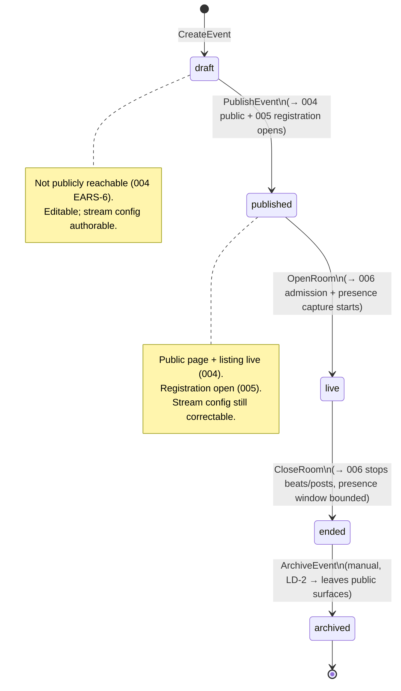
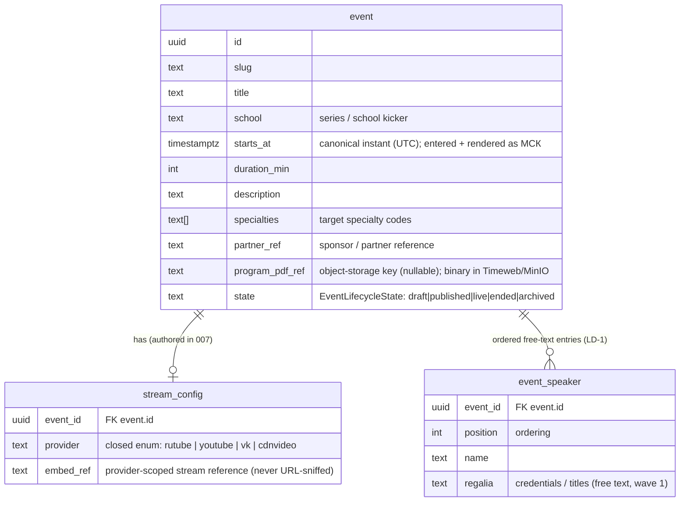
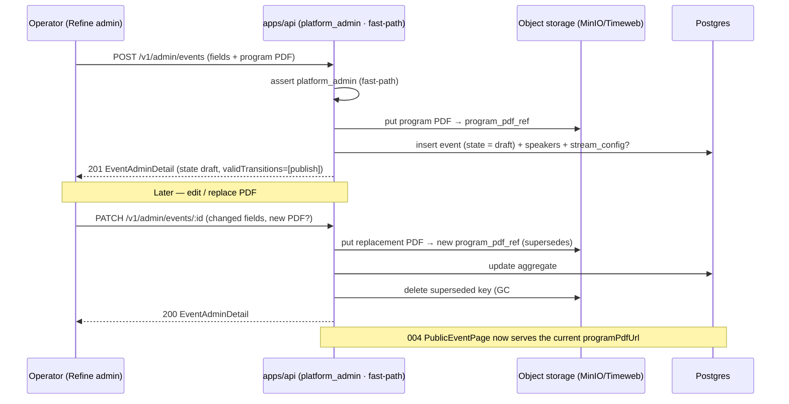
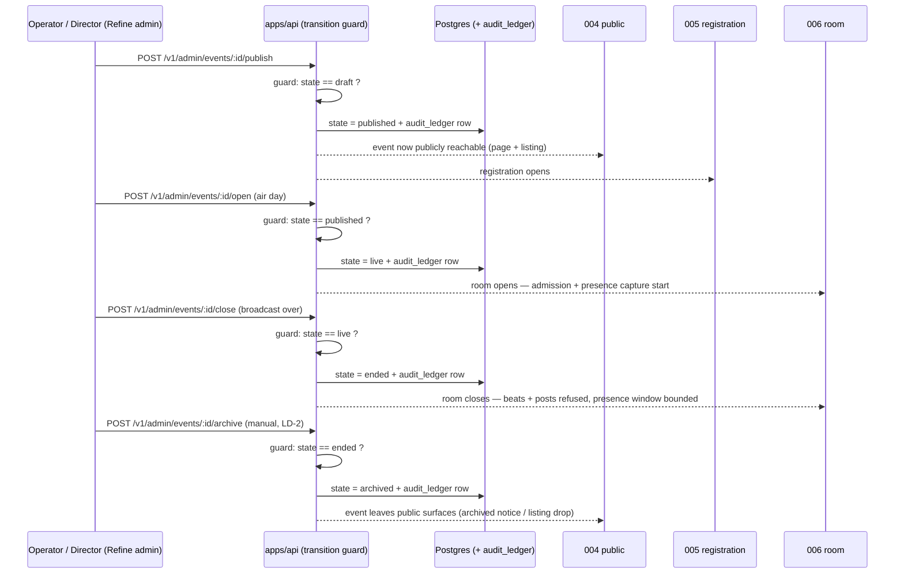
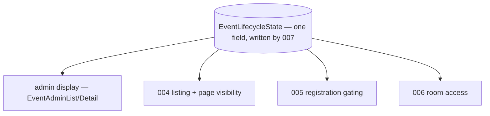

# 007 — Minimal event admin: create/edit, stream config, room control, lifecycle (Design)

## 1. Architecture overview

Feature 007 is the **authoring vertical**: the **write side** of the webinar aggregate in `apps/api` (seven `platform_admin` commands + two admin reads) plus the admin surface in `apps/admin` (stock Refine, ADR-0004). It owns the event aggregate, the `stream_config`, the program-PDF reference, and the single `EventLifecycleState` state machine. It **produces** the state the read-side slices consume — `EventLifecycleState`, the 004 `PublicEventPage`/`UpcomingBroadcastCard` projections, and the 006 stream config — and consumes only the shipped 003 auth (the `platform_admin` principal) and object storage (the program PDF binary).

```mermaid
flowchart LR
  subgraph Browser
    ADM[apps/admin — Refine: event list, create/edit form, lifecycle actions, stream config]
  end
  subgraph apps_api[apps/api — platform_admin · fast-path]
    C1[POST /v1/admin/events — CreateEvent]
    C2[PATCH /v1/admin/events/:id — UpdateEvent incl. program-PDF replace]
    C3[PUT /v1/admin/events/:id/stream — ConfigureStream]
    T1[POST /v1/admin/events/:id/publish — PublishEvent]
    T2[POST /v1/admin/events/:id/open — OpenRoom]
    T3[POST /v1/admin/events/:id/close — CloseRoom]
    T4[POST /v1/admin/events/:id/archive — ArchiveEvent]
    SM[Transition guard: closed set draft→published→live→ended→archived]
    QR[GET /v1/admin/events(/:id) — EventAdminList / EventAdminDetail]
  end
  PG[(Postgres — event aggregate + stream_config + audit_ledger)]
  S3[[Object storage — program PDF (Timeweb / MinIO)]]
  AUTH[feature 003 — platform_admin session / IdP]
  P004[feature 004 — public page / listing]
  P005[feature 005 — registration gating]
  W006[feature 006 — room admission + stream config consumer]

  ADM -->|authoring writes| C1 & C2 & C3
  ADM -->|lifecycle actions| T1 & T2 & T3 & T4 --> SM --> PG
  ADM -->|list/detail| QR --> PG
  C1 & C2 --> PG
  C2 -->|upload/replace| S3
  C3 --> PG
  ADM -. platform_admin session .-> AUTH
  PG -. EventLifecycleState + PublicEventPage projection .-> P004
  PG -. EventLifecycleState (register gating) .-> P005
  PG -. stream config + live window .-> W006
  S3 -. current programPdfUrl .-> P004
```

The authoring side is **server-authoritative and role-gated**: every command and admin read requires `platform_admin` (§7), and the state machine is enforced in the backend, never merely hidden in the Refine UI (§2). The only public output is the 004 projection — 007 writes it, 004 renders it.

## 2. The single state machine (the heart of 007)

Lifecycle is **one** `EventLifecycleState` enum field, replacing the legacy boolean scatter (`draft` / `published?` / `archive` / `visible_in_rg` / …) that made "is this event visible?" ambiguous (recon §7d). The transition set is **closed**: exactly four forward moves, each a distinct command with distinct product side-effects.



- **Closed set, server-enforced (EARS-7).** The only legal transitions are `draft→published`, `published→live`, `live→ended`, `ended→archived`. Every other move — `draft→live`, `published→ended`, reopening an `archived` event, or **any backward move** — is refused server-side with a 4xx; the admin UI derives the offered actions from the current state (`EventAdminDetail.validTransitions`), so an invalid transition is never even presented. Hiding it in the UI is necessary but not sufficient — the guard lives in the command handler and is asserted directly against the API (§10).
- **No unpublish.** The PRD names no `published → draft` transition, so 007 invents none. A correction to a published event is an **edit** (`UpdateEvent`, EARS-2) or a **stream-config fix** (`ConfigureStream`, EARS-3), never a state reversal.
- **Each transition is a distinct vertical.** Publish opens public reachability + registration; open/close bound the 006 room + presence window; archive removes the event from public surfaces. Each is its own child Issue (EARS-4/5/6), and `audit_ledger` gets exactly one terminal row per transition (ADR-0003 §6).
- **`ended → archived` is manual (LD-2, owner review pending).** No scheduler, no time-based automation in wave 1 — archiving is an explicit operator command. A time-based auto-archive policy is a named wave-2 candidate.

## 3. The event aggregate + stream config + program PDF

007 owns the write model; 004/005/006 read projections of it. The program-PDF **binary** lives in object storage; the aggregate holds only a reference.



- **МСК → canonical instant (EARS-1, EARS-10).** The operator enters a date + time understood as **МСК**; the system converts and stores **one canonical UTC instant** (`starts_at`). Every absolute time — admin list/detail and the produced 004 projection — is rendered back in `Europe/Moscow` labeled **МСК** from that instant (mirrors 004 EARS-12 / 005 EARS-11 / 006 EARS-10). The stored instant never drifts to the operator's local timezone.
- **Speakers = ordered free-text entries (LD-1, owner review pending).** `event_speaker` is an ordered list of `{ name, regalia }` text rows. Wave 1 validates text only; **real-record references are wave 2** (bundled with speaker-directory management — a ref without a directory has nothing to point at). The list shape is extensible, so the wave-2 ref variant is an additive migration, not a reshape.
- **Stream config = explicit enum, never URL-sniffing (EARS-3).** `provider` is the closed enum `rutube | youtube | vk | cdnvideo`; `embed_ref` is the provider-scoped stream reference. The operator picks the provider explicitly and the reference is validated against that provider's real shape (`@ds/schemas` `EMBED_REF_SHAPES`): an opaque id for `rutube`/`youtube`, VK's `oid_id_hash` **triple** for `vk` (the hash is mandatory and non-derivable), and the **host-allowlisted player URL** for `cdnvideo` — the one stored-URL exception, whose `playercdn.cdnvideo.ru/aloha/players/` allowlist is the SSRF guard on the value the 006 room drops into its `<iframe src>` (the id-style providers still reject a URL-shaped paste). The 006 room instantiates the player by switching on `provider` (never parsing the URL — the legacy mistake, recon §5). Extending the enum later is an additive migration. The enum lives in `packages/schemas/` (Zod), the SSOT the API, the admin app, the DB enum, and 006 share.
- **Program PDF in object storage (EARS-2).** The binary is uploaded to Timeweb Object Storage (MinIO on the dev stand) — never in the repo or the DB row; `program_pdf_ref` is the storage key. **Replacing** the PDF after publish overwrites the reference so 004 serves the current file; the superseded file is no longer served. Endpoint/bucket read from `.env.local` (`.claude/rules/dev-stand.md`), never hardcoded.
- **GC-on-supersede (EARS-2, #627).** When a replacement upload successfully supersedes the previous PDF, the api **deletes the superseded object key** from object storage, so the bucket's steady state is exactly the referenced set — no orphan accumulation, no new periodic machinery. A bucket **age-based lifecycle rule was rejected**: it cannot distinguish referenced from unreferenced keys (an event's _current_ PDF may be arbitrarily old, so a blanket age rule would delete live objects), while delete-on-supersede is bounded to exactly the orphan just produced. Ordering is safety-critical: the delete fires **only after** the reference swap is durably committed — never before (a crash between delete and commit must not lose a still-referenced object). The delete is **best-effort by documented policy**: a storage failure is warn-logged with the orphan key and the edit still succeeds — a rare orphan from a failed delete is acceptable; the upload is never failed over GC.

## 4. Create + edit (the authoring commands)



- **Create → `draft` (EARS-1).** A new event is not publicly reachable until published (004 EARS-6). Stream config may be authored at create or later.
- **Edit + PDF replace (EARS-2).** Editing works at any pre-archive state; the operator never has to unpublish to correct a detail. A replacement PDF supersedes `program_pdf_ref`; 004's `PublicEventPage.programPdfUrl` resolves to the current object. The superseded object is then garbage-collected from storage (GC-on-supersede, §3 — post-commit, best-effort).

## 5. Publish / open / close / archive (the lifecycle side-effects)



Each transition validates the **current** state (guard §2) and refuses an out-of-order call; the side-effects (public reachability, registration, room admission/presence, archival) are consumed downstream from the single `EventLifecycleState`, never signalled by a second flag.

## 6. Admin ↔ portal single source of truth



The state 007 writes is the **only** state everything reads (EARS-9). There is no `published?`/`archive`/`visible_in_rg` scatter to reconcile; admin and the portal cannot present a contradictory state for one event because they resolve the same field. This is the PRD "no drift" acceptance, and the direct answer to the legacy ambiguity the epic set out to kill.

## 7. Endpoint-authz classification

All 007 authoring commands, lifecycle transitions, and admin reads are classified **`access: authenticated`, `required_roles: platform_admin`, `auth_check: fast-path`** in the endpoint-authz matrix (ADR-0001 §2). Wave 1 is one trusted admin group (LD-3), so role alone is sufficient — no object-level `policy` scoping (that arrives with wave-2 manager/owner-of-record lists). DTOs are Zod schemas in `packages/schemas/` (ADR-0002 SSOT), shared by the API and the Refine admin app via the generated SDK.

| Endpoint                            | Command / read     | access        | required_roles   | auth_check | step_up (posture)                |
| ----------------------------------- | ------------------ | ------------- | ---------------- | ---------- | -------------------------------- |
| `POST /v1/admin/events`             | `CreateEvent`      | authenticated | `platform_admin` | fast-path  | high-stakes tier (introspection) |
| `PATCH /v1/admin/events/:id`        | `UpdateEvent`      | authenticated | `platform_admin` | fast-path  | high-stakes tier                 |
| `PUT /v1/admin/events/:id/stream`   | `ConfigureStream`  | authenticated | `platform_admin` | fast-path  | high-stakes tier                 |
| `POST /v1/admin/events/:id/publish` | `PublishEvent`     | authenticated | `platform_admin` | fast-path  | high-stakes tier                 |
| `POST /v1/admin/events/:id/open`    | `OpenRoom`         | authenticated | `platform_admin` | fast-path  | high-stakes tier                 |
| `POST /v1/admin/events/:id/close`   | `CloseRoom`        | authenticated | `platform_admin` | fast-path  | high-stakes tier                 |
| `POST /v1/admin/events/:id/archive` | `ArchiveEvent`     | authenticated | `platform_admin` | fast-path  | high-stakes tier                 |
| `GET /v1/admin/events`              | `EventAdminList`   | authenticated | `platform_admin` | fast-path  | —                                |
| `GET /v1/admin/events/:id`          | `EventAdminDetail` | authenticated | `platform_admin` | fast-path  | —                                |

- **Never `doctor_guest` / public (EARS-8).** No lifecycle transition or authoring write is ever callable by a doctor or a public caller; the endpoint-authz matrix + the `endpoint-authz` BLOCK guard (AGENTS.md §5) enforce it.
- **Admin mutations are high-stakes.** ADR-0001 §2.5/§8 routes admin mutations through the introspection validation tier — that is the wave-1 step-up posture; no bespoke per-action step-up is added. The admin session follows ADR-0004's **staged model** (design §3.2): wave 1 rides the shipped 003 session cookie `__Host-ds_session`; the dedicated `__Host-ds_admin_session` + mandatory 2FA for `platform_admin` is pre-pilot hardening (#718).
- **Produced public projections stay `public`.** `PublicEventPage`/`UpcomingBroadcastCard` keep 004's `public` classification — 007 authors the data, 004 owns the public read.

## 8. Admin surface (stock Refine — no canvas)

Built on **stock Refine UI** (ADR-0004 §3: Refine + custom data/auth/access providers over the NestJS API, `admin.doctor.school`). **No admin canvas exists** (recorded Stage-A gap, PRD «Approved mockup») — so, unlike 004/005/006, 007 carries **no** canvas-fidelity requirement (EARS-11).

- **Resources.** A Refine `events` resource: a list (all states, current lifecycle badge, air date/time in МСК, stream-config completeness), a create/edit form (the aggregate fields incl. the program-PDF upload and the ordered speaker list), and lifecycle **actions** (publish / open / close / archive) whose availability derives from `EventAdminDetail.validTransitions` — an action for a transition the current state disallows is never rendered (§2).
- **Adopt-before-bespoke (EARS-11).** The `build-ui-from-design-system` gate runs before any bespoke element; stock Refine components are the default. ADR-0013 token discipline (no arbitrary Tailwind) applies to any bespoke styling; token-lint stays green.
- **Owner checkpoint.** Keep stock Refine for the minimal admin vs commission an admin canvas is an **owner decision at the next Stage-A checkpoint** (PRD) — named, not settled here.
- **Copy & i18n (EARS-10).** All admin copy (field labels, state names, transition-action labels, validation/error messages, provider choices) resolves through the typed message catalog established in 003 (EARS-21) and reused in 004/005/006. RU ships now; no hardcoded string survives the `apps/admin` ESLint gate. Absolute times render in МСК via the shared formatter (Playwright asserts no drift by overriding `timezoneId`).

## 9. Seams — 007 is the producer that closes the wave-1 seams

Each seam is a **tracked** dependency (AGENTS.md §6 F-22; wired by `open-ears-issues` step 4). 004/005/006 named these seams from the **consuming** side and were built on seeds; 007 is the **producing** side. Landing 007 is what flips those slices off seeds onto the real authored aggregate.

| Seam                              | Counterpart | 007's relationship (producer)                                                                                   | "Done against the real dependency" criterion (the counterpart's)                                                  |
| --------------------------------- | ----------- | --------------------------------------------------------------------------------------------------------------- | ----------------------------------------------------------------------------------------------------------------- |
| Auth session                      | 003         | Consumes the shipped `platform_admin` session; adds no auth primitive.                                          | The admin gate reads the live stand's real 003 `platform_admin` session.                                          |
| Public page / listing / lifecycle | 004         | **Produces** `EventLifecycleState` + `PublicEventPage`/`UpcomingBroadcastCard`; owns the transitions 004 reads. | 004 renders events authored + transitioned through 007, not seeds (the 004↔007 blocking link).                    |
| Registration gating               | 005         | **Produces** the lifecycle state 005 gates the register affordance on; publish opens registration.              | 005 gates on events published/archived through 007, not seeds (the 005↔007 blocking link).                        |
| Room admission + stream config    | 006         | **Produces** the stream config (provider enum + embed ref) + the `live` window via `OpenRoom`/`CloseRoom`.      | The 006 room opens/closes via 007 director controls and instantiates from 007-authored config (the 006↔007 link). |
| Object storage (program PDF)      | infra       | Uploads/replaces the program PDF binary in Timeweb/MinIO; the aggregate holds a reference.                      | The PDF round-trips through the dev-stand MinIO (`S3_ENDPOINT`), verified on the live stand.                      |

007 is completable end-to-end **as its own vertical**: an operator creates a draft event with fields + program PDF → publishes → configures the stream provider → opens the room → closes the room → archives — the create → publish → configure → open → close arc the 2026-07-17 webinar needs, plus archive. The 004 render, the 005 registration record, and the 006 room/presence are the boundaries of _other_ slices consuming 007's output, not unfinished parts of this one.

## 10. Test strategy

- **API command + transition guard (Vitest e2e + unit, `apps/api`):** the seven commands + two reads against dev-stand Postgres + Zitadel + MinIO, `skipIf(!DATABASE_URL || !IDP_ISSUER || !S3_ENDPOINT)`. The **transition guard** (EARS-7) is asserted **directly against the API** — every invalid jump (`draft→live`, `published→ended`, reopen `archived`, any backward move) returns 4xx regardless of the UI — plus the МСК-instant round-trip (EARS-1/10), the provider-enum validation (EARS-3), the program-PDF replace-and-serve-current + GC-on-supersede — the superseded key deleted from the real bucket after the swap; the best-effort branch (a throwing delete still succeeds the edit, warn-logging the orphan key) unit-tested against the in-memory storage (EARS-2, #627), the publish/open/close/archive side-effects + one `audit_ledger` row each (EARS-4/5/6), the single-source-of-truth resolution across 004/005/006 reads (EARS-9), and the `platform_admin` fast-path authz with `doctor_guest`/public refused (EARS-8).
- **Admin browser E2E (Playwright, `apps/admin`):** the required user-journey deliverable (requirements Verification, `all` row) — an operator drives the full arc in the Refine admin on the live stand: create (fields + program PDF) → publish → configure the stream provider → open the room → close the room → archive, with the invalid-transition action never offered, an unknown provider rejected at config, and a non-`platform_admin` refused. Owned + tracked by the 007 admin-integration + E2E child Issue (`open-ears-issues` step 3a), never a bare footnote.
- **i18n + МСК (EARS-10):** the `apps/admin` no-hardcoded-strings ESLint gate + a Playwright `timezoneId`-override run asserting every absolute admin time renders in МСК with no local drift.
- **UI discipline (EARS-11):** stock Refine adopt-before-bespoke recorded in the PR (`registry-research:` marker); token-lint green on any bespoke styling. **No** canvas-fidelity screenshot check — no canvas exists (Stage-A gap); the keep-stock-vs-commission-canvas owner checkpoint is recorded, not a code gate.
