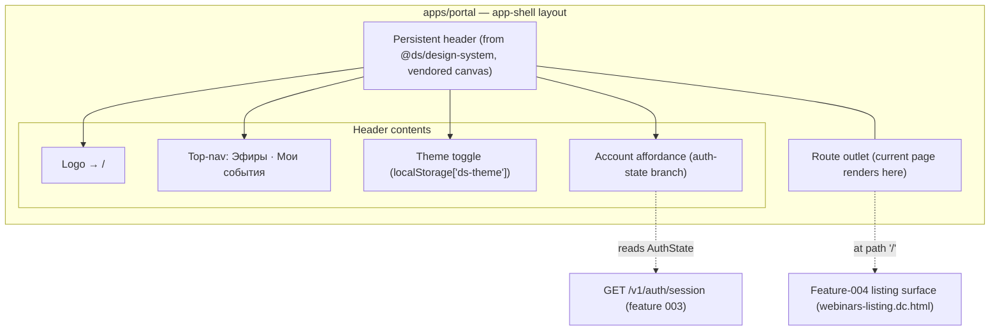
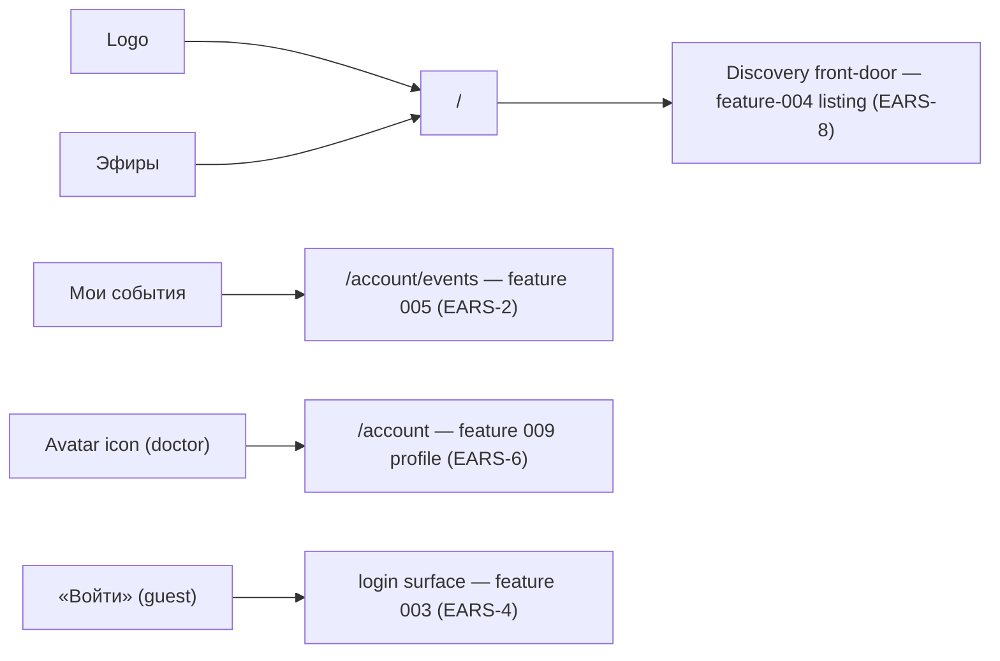
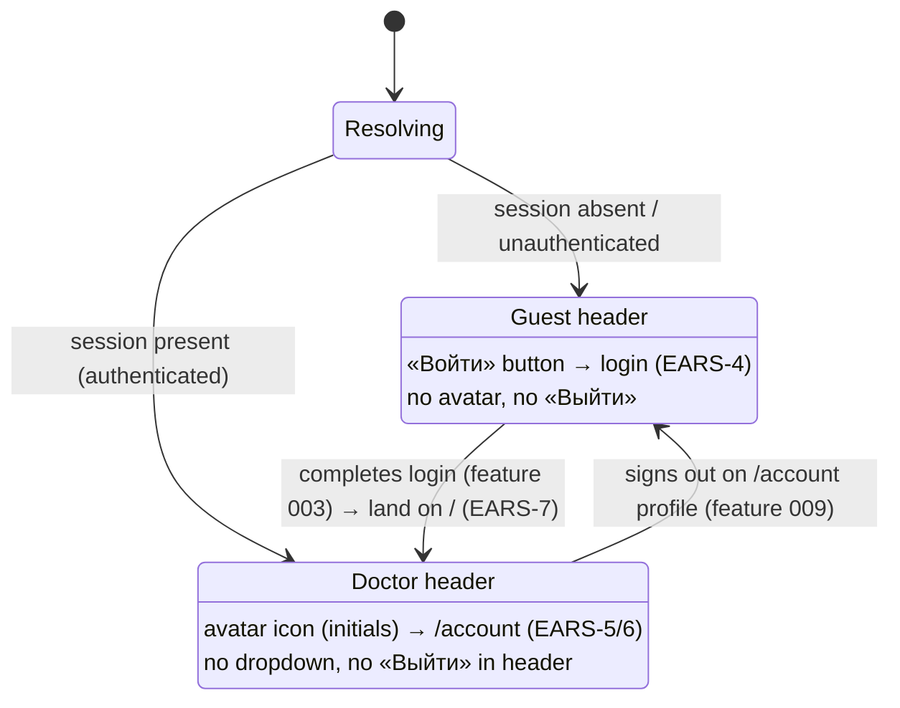
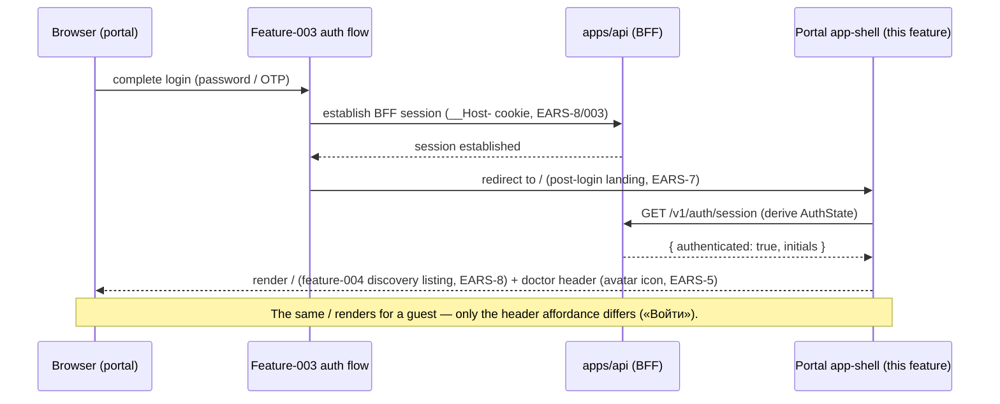

# 008 — Portal shell & discovery front-door (Design)

Engineer-facing companion to [`008-requirements-en.md`](./008-requirements-en.md). This feature is a **UI-composition / information-architecture slice** in `apps/portal` (Next.js 15 + Refine, ADR-0004): it mounts the persistent app-shell header as the app-level layout, wires the nav to shipped surfaces, branches the account affordance on the feature-003 session, and makes `/` the discovery front-door and post-login landing. It introduces **no backend aggregate** and mints **no session** — it consumes the feature-003 auth state (`GET /v1/auth/session`) and reuses the feature-004 listing surface.

**Visual source of truth (ADR-0013).** The header and `/` are built from the vendored canvas under [`design-source/`](../../../../../../design-source/README.md) — `webinars-listing.dc.html` (canvas `Эфиры.dc.html`, the `/` front-door), with the same persistent header appearing across `my-events.dc.html` and `webinar-page.dc.html`. Build to those files, not to this document's prose; where prose and the canvas disagree, the canvas wins. Diagrams below describe **composition and routing**, not pixel geometry (which lives in the canvas).

## 1. App-shell composition

The header is a **layout invariant**: `apps/portal` mounts it once in the app-level layout so every route renders inside it, rather than each page opting in. The shell composes shipped surfaces and reads the session for the account-affordance branch only.

The `ShellRendered` invariant (EARS-1): no portal route renders without this header. The theme toggle (EARS-3) persists to `localStorage['ds-theme']` — the exact key the vendored canvas uses, so the built artifact and the canvas share one persistence contract.

## 2. Nav route resolution to shipped surfaces

Every nav target resolves to a **shipped** surface (EARS-2) — the v1 nav carries no deferred or inert target. Route targets are resolved through the portal routing layer, never string-duplicated.

«Школы» is **not rendered in the v1 nav** (EARS-10 _Retired_, owner 2026-07-15) — no inert placeholder ships, so there is no decision-debt seam to track. «Школы» becomes a nav target only when its own feature is specced and built, entering via that feature's discovery.

## 3. Auth-state header branch

The header truthfully reflects the session state (EARS-4 / EARS-5). `AuthState` is derived from `GET /v1/auth/session`: `{ authenticated, initials? }`. Only the account affordance branches — the rest of the header (logo, nav, theme toggle) and the whole of `/` are auth-invariant.

Note the sign-out edge is **owned by feature 009** (the profile), not this header — the header carries no «Выйти» and no dropdown menu (Invariant). The avatar is an icon-link, a single tap to one destination.

## 4. Post-login landing sequence

Post-login landing is `/` (EARS-7). This feature does **not** mint the session — the feature-003 auth flow does — it only supplies `/` as the return target and guarantees the doctor lands on the discovery front-door, not a scaffold.

`/` reuses the feature-004 listing surface verbatim (`DiscoveryListing` read model). It does not branch on auth (EARS-8) — the guest and the doctor see the identical listing; the sole difference is the header's account affordance (§3). The `/` «Каркас приложения» scaffold is removed and unreachable (EARS-9), `/` serving the listing in its place.

## 5. Mobile collapse

At the canvas mobile breakpoint (`≤900px`) the top-nav collapses into a `≡` dropdown carrying the same **[Эфиры · Мои события]** (EARS-11). Every target's resolution (§2) is preserved inside the dropdown. The geometry (the flat, full-bleed mobile treatment of the listing and header) is specified in the vendored canvas (`webinars-listing.dc.html` mobile band + the header's responsive rules); this feature reproduces it element-by-element, verified at Stage-B across both breakpoints × both themes (EARS-12, ADR-0013).

## 6. What this feature does NOT own (seams & boundaries)

- **Discovery listing internals** — cards, ordering, lifecycle signalling, the listing's own empty/error states — are **feature 004**. `/` reuses that surface; this feature specifies only that `/` _is_ that surface, rendered identically for both auth states.
- **The profile at `/account`** and the **sign-out** affordance — **feature 009**. The avatar icon only navigates there; 009 retires the `/account` session-claims debug dump.
- **«Мои события» content and the room** — features **005 / 006**. This feature only wires the `/account/events` nav target.
- **«Школы»** — **not in the v1 nav** (EARS-10 _Retired_). No inert placeholder ships and there is no seam to track; «Школы» enters the nav only via its own future feature.
- **No new backend primitive** — the session is read-only input; this feature adds no endpoint and mints no session.
