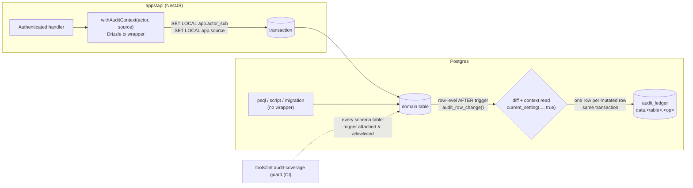
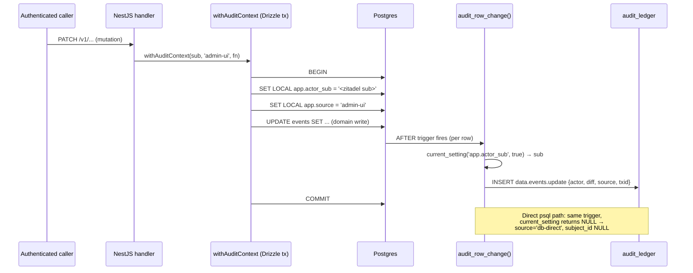
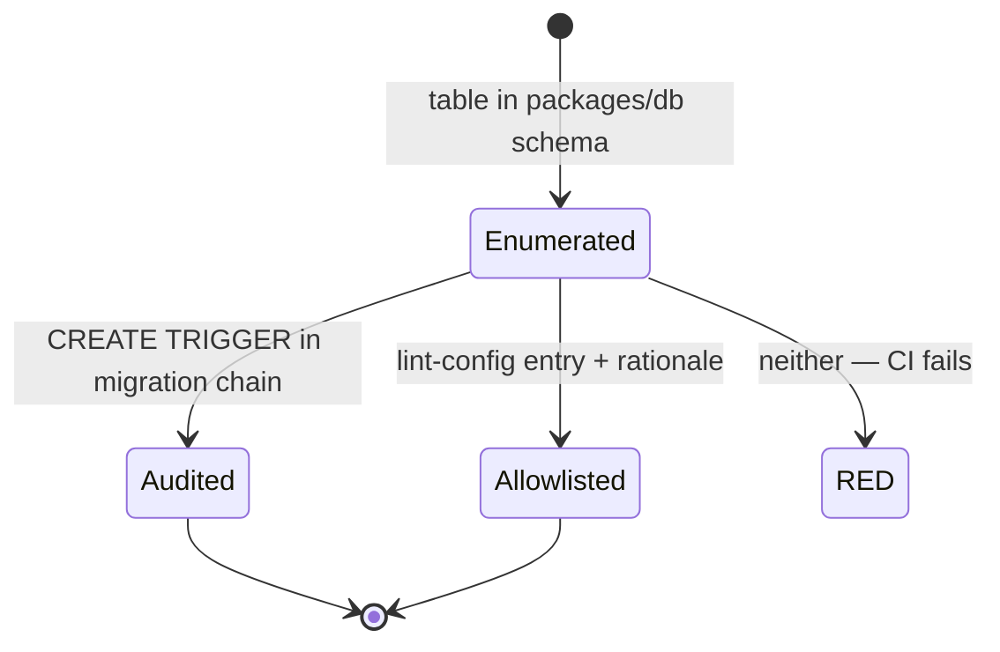

# 010 — Universal edit audit (Design)

> Companion to [`010-requirements.md`](./010-requirements.md). Backend-only infra; no UI artifacts.

## 1. Architecture at a glance



Two write doors, one capture point: the trigger sees every path. The API door adds attribution (WHO + SOURCE) via transaction-local GUCs; the direct door degrades to `source = 'db-direct'`, actor NULL — audited either way.

## 2. Capture: the generic trigger function (EARS-1, EARS-2)

One PL/pgSQL function, hand-managed SQL in the `packages/db` migration chain (the same pattern as the ledger's partition DDL — drizzle-kit does not model triggers; ADR-0003 §3.4).

```sql
-- Migration NNNN_universal_edit_audit.sql (indicative shape, not final code)
CREATE OR REPLACE FUNCTION audit_row_change() RETURNS trigger AS $$
DECLARE
  v_actor   text  := current_setting('app.actor_sub', true);   -- NULL when unset
  v_source  text  := coalesce(current_setting('app.source', true), 'db-direct');
  v_old     jsonb := to_jsonb(OLD);
  v_new     jsonb := to_jsonb(NEW);
  v_diff    jsonb;
  v_pk      jsonb;
BEGIN
  -- diff per op-kind (EARS-2): UPDATE = changed fields only (IS DISTINCT FROM),
  -- excluding 'updated_at'; INSERT = {field:{new}} full row; DELETE = {field:{old}} full row.
  -- PD masking (EARS-7): fields listed for TG_TABLE_NAME in the pd-column registry
  -- are emitted as {"masked": true} with old/new omitted.
  v_diff := audit_compute_diff(TG_OP, TG_TABLE_NAME, v_old, v_new);
  IF TG_OP = 'UPDATE' AND v_diff = '{}'::jsonb THEN
    RETURN NULL;                        -- no-op update ⇒ no trail row (EARS-2)
  END IF;
  v_pk := audit_extract_pk(TG_TABLE_NAME, coalesce(v_new, v_old));
  INSERT INTO audit_ledger (id, event_id, event_type, subject_id, metadata, created_at)
  VALUES (
    gen_random_uuid(), gen_random_uuid(),
    format('data.%s.%s', TG_TABLE_NAME, lower(TG_OP)),
    v_actor,
    jsonb_build_object('table', TG_TABLE_NAME, 'pk', v_pk, 'diff', v_diff,
                       'source', v_source, 'txid', txid_current()::text),
    now()
  );
  RETURN NULL;                          -- AFTER trigger: return value ignored
END $$ LANGUAGE plpgsql;
```

Per-table attachment — one line per table, in that table's (or the attach-sweep) migration:

```sql
CREATE TRIGGER events_audit AFTER INSERT OR UPDATE OR DELETE
  ON events FOR EACH ROW EXECUTE FUNCTION audit_row_change();
```

Design points:

- **Table-agnostic** — `TG_TABLE_NAME` + `to_jsonb(OLD/NEW)` iterate whatever columns the table has now or gains later; new columns are covered with zero code change (the "future fields" half of universality).
- **Diff rule** (EARS-2): UPDATE — keys where `v_old->key IS DISTINCT FROM v_new->key`, minus the exclusion set (`updated_at` only, v1); INSERT — every key as `{new: value}`; DELETE — every key as `{old: value}` (full-row reconstruction of deleted records).
- **No-op suppression** — an UPDATE whose post-exclusion diff is empty writes nothing: the trail records _changes_, not touches.
- **Row-level AFTER** — fires per affected row (a bulk UPDATE of N rows yields N trail rows, sharing `txid`); AFTER means the audit observes the committed-shape row and cannot alter the domain write.
- **`event_id`** — trigger-generated `gen_random_uuid()` per row; the ledger's partition-scoped dedup unique applies as-built (no idempotent-replay semantics are needed for trigger-originated rows — each fire is a distinct fact).

## 3. Attribution: the GUC contract + Drizzle wrapper (EARS-3, EARS-4, EARS-5)



The GUC contract:

| GUC             | Set by                                             | Value                                                                    | Read by                             |
| --------------- | -------------------------------------------------- | ------------------------------------------------------------------------ | ----------------------------------- |
| `app.actor_sub` | `withAuditContext` (`SET LOCAL`)                   | Zitadel `sub` of the authenticated principal                             | trigger, `current_setting(_, true)` |
| `app.source`    | `withAuditContext` / job runner / migration runner | `admin-ui \| portal-api \| system:<job-name> \| migration \| manual-dba` | trigger; absent ⇒ `db-direct`       |

- **`SET LOCAL`** scopes both GUCs to the transaction — no leakage across pooled connections (the reason session-level `SET` is not used).
- **`current_setting(name, true)`** (missing-ok) returns NULL instead of raising when unset — the degradation seam that makes EARS-4 free: no context, still one honest row.
- **Wrapper placement** — `withAuditContext(actor, source, fn)` lives beside the Drizzle client in `packages/db` (exported) and is adopted by the API's mutating services; the source value per door: admin app requests ⇒ `admin-ui`, portal/API-origin ⇒ `portal-api`, background jobs ⇒ `system:<job-name>`, migration runner ⇒ `migration`, an announced operator psql session ⇒ `manual-dba` (set by hand at the prompt).
- **EARS-5 enforcement** — the guarantee "authenticated mutation ⇒ attributed row" is verified two ways: the e2e endpoint sweep (Verification row 5) and a unit-level seam pin so a handler that bypasses the wrapper fails the suite. It is a _test-enforced_ convention in v1; escalating to a runtime interceptor (NestJS-level: every mutating route wrapped by construction) is an implementation option for the child Issue, not mandated here.

## 4. Storage mapping onto the as-built ledger (EARS-6)

No new table, no new columns. Mapping:

| `audit_ledger` column | `data.*` usage                                                                                                                                                                                                                                 |
| --------------------- | ---------------------------------------------------------------------------------------------------------------------------------------------------------------------------------------------------------------------------------------------- |
| `id`, `created_at`    | As-built (composite PK; `created_at` = mutation time = partition key, monthly ranges)                                                                                                                                                          |
| `event_id`            | Trigger-generated UUID per trail row                                                                                                                                                                                                           |
| `event_type`          | `data.<table>.<insert\|update\|delete>` — extends ADR-0001 §7.3 (`auth.*` untouched)                                                                                                                                                           |
| `subject_id`          | **Actor** sub (WHO) — NULL for context-less writes. Note: in `auth.*` rows this column is the _subject_ of the event; for `data.*` it is deliberately the acting principal — recorded here so readers of mixed queries don't conflate the two. |
| `sid`, `reason`       | NULL for `data.*` rows                                                                                                                                                                                                                         |
| `metadata`            | `{table, pk, diff, source, txid}` — `pk` as jsonb (composite-PK-safe), `txid` groups all rows of one transaction                                                                                                                               |

Inherited invariants: append-only enforcement trigger (UPDATE/DELETE on any ledger row refused — `data.*` corrections are compensating records), partition-pruned history queries, 5y retention with crypto-shred at term (ADR-0009 §2.4/§2.6), pg_partman-managed monthly partitions + DEFAULT safety net.

## 5. PD masking + coverage guard (EARS-7, EARS-8)

**PD-column registry.** The masking set is data, not code: a per-table list of PD columns (as-built tables: `users` — name/email/phone/identifier fields; `consent_records` — subject-identifying fields), maintained in `packages/db` next to the schema and mirrored into the trigger's masking source (implementation option for the child Issue: a SQL lookup table seeded by migration, or an array baked into `audit_compute_diff` and regenerated by migration — chosen at implementation, both keep the registry under the coverage guard's eye). A masked field appears in the diff as `{"masked": true}` — presence proves _that_ the field changed; values are omitted entirely (nothing to erase, ADR-0009 §2.4-compatible by construction). The tracked follow-up (per-subject-key encryption of masked values via the §2.4 Vault contract) upgrades "omitted" to "recoverable by authorized investigation" without changing the row shape.

**Coverage guard** — `tools/lint/audit-coverage-lint.ts`, sibling of `migration-index-lint.ts` / `endpoint-authz-lint.ts`:

1. Enumerate tables from the `packages/db` schema source (the drizzle-config schema file list is the SSOT of "domain table exists").
2. Scan the migration chain for `CREATE TRIGGER ... EXECUTE FUNCTION audit_row_change()` attachments (minus any later `DROP TRIGGER`).
3. Every table must be attached **or** allowlisted; the allowlist lives in the lint config with a mandatory rationale string per entry. Initial allowlist:
   - `audit_ledger` — recursion (the ledger cannot audit itself);
   - `idempotency_keys` — technical request-dedup cache, no domain truth;
   - `presence_beats` — append-only telemetry stream, itself an event log; auditing would duplicate the stream 1:1 with no WHO/WHAT gain.
4. Any table in (1) missing from (2)∪(3) ⇒ red, listing the offenders — a new table cannot ship unaudited _silently_; allowlisting it is a visible, reviewed, rationale-carrying diff.



## 6. Rejected alternatives

| Alternative                                                    | Why rejected                                                                                                                                                                                                                                                                                                                 |
| -------------------------------------------------------------- | ---------------------------------------------------------------------------------------------------------------------------------------------------------------------------------------------------------------------------------------------------------------------------------------------------------------------------- |
| **App-layer capture** (Drizzle wrapper writes the trail)       | Misses direct-DB, psql, and migration writes — exactly the SOURCE classes the owner asked to distinguish; universality would depend on every caller remembering the wrapper, the failure mode this feature exists to eliminate. The wrapper survives, but only as the _attribution_ carrier (GUCs), never the capture point. |
| **`pgaudit`** (ADR-0003 design §7 "under consideration")       | Statement-level auditing into the server log: not a queryable ledger, no per-row field-level before→after diff, no structured actor/source, retention/erasure discipline would live outside the ADR-0009 contract. 010 resolves the ADR's open consideration against it.                                                     |
| **Per-table bespoke triggers / history tables**                | Per-table re-implementation is the anti-goal; N history tables drift, one generic function + one ledger does not.                                                                                                                                                                                                            |
| **CDC / logical replication capture** (e.g. wal2json consumer) | Out-of-transaction (a crash window between commit and capture breaks the "no unaudited mutation commits" invariant), new infra component, and no access to `SET LOCAL` GUCs for attribution.                                                                                                                                 |

## 7. Failure semantics & performance

- **Fail-closed append.** The ledger INSERT is part of the mutating transaction: if it fails (ledger constraint, partition missing beyond the DEFAULT net), the domain write rolls back — no unaudited commit. The graceful path is _attribution_ degradation only (EARS-4), never append omission. Consequence to name honestly: an outage of the ledger blocks domain writes — acceptable for a low-write medical platform where an unaudited write is the worse failure; the DEFAULT partition removes the routine "partition not yet created" hazard.
- **Cost envelope.** Per mutated row: one `to_jsonb` pair + key comparison + one partitioned INSERT. Domain tables are low-write-rate (admin authoring, registrations); the two high-volume tables are allowlisted with rationale (§5). Revisit only if a future high-write domain table must be audited — options then (batching, sampled diffs) are that spec's problem, named here so it isn't rediscovered.
- **Trigger vs ledger enforcement ordering.** The append-only enforcement trigger on `audit_ledger` guards UPDATE/DELETE; `audit_row_change()` only ever INSERTs — no interaction. `audit_ledger` is allowlisted from capture, so there is no recursion.
- **Migrations as a source class.** The migration runner sets `app.source = 'migration'` for data-bearing migrations; schema-only migrations produce no row-level mutations and thus no trail noise. Attach order inside the 010 migration: function first, then per-table triggers, so the attach migration itself audits nothing retroactively (no retro-backfill by scope).
