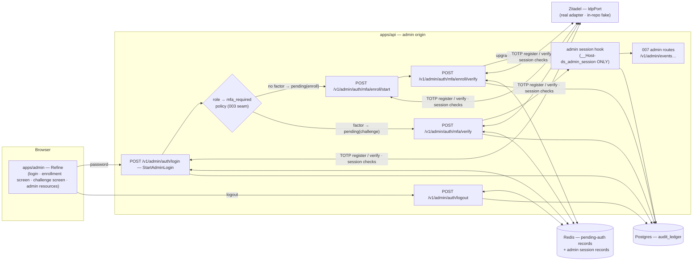
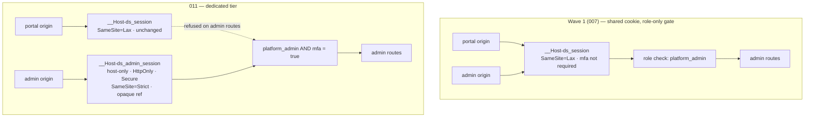
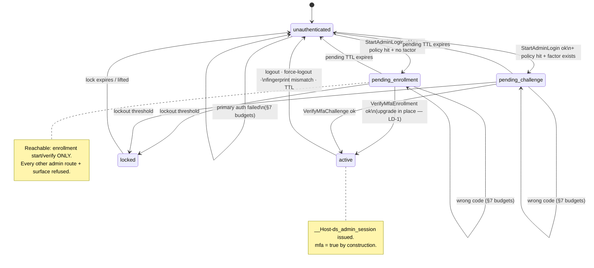
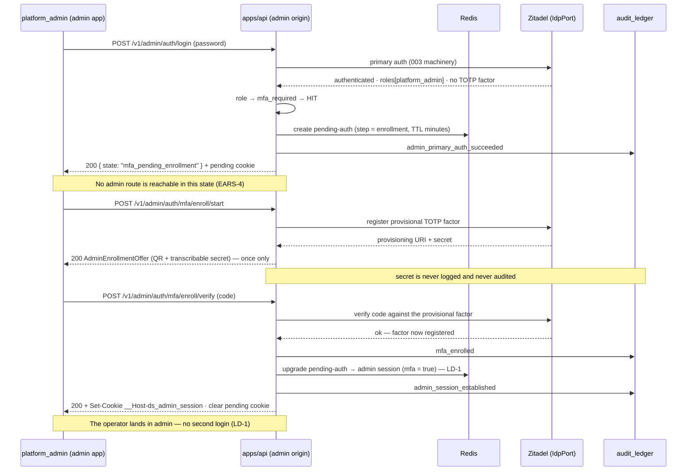
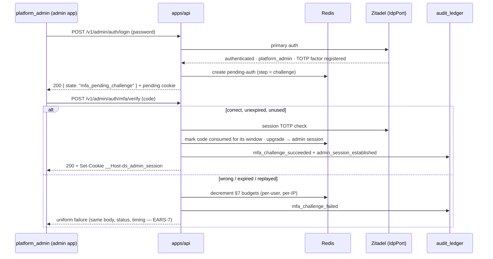
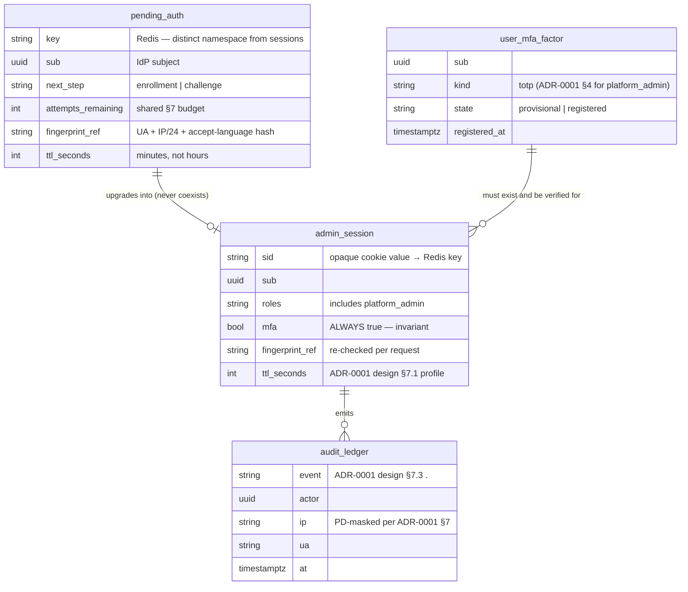
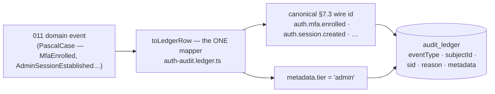

# 011 — Admin session hardening (Design)

## 1. Architecture overview

011 sits on the **authentication write path at the admin origin**. It changes one thing structurally: primary authentication at the admin origin **no longer produces a session**. It produces a _pending authentication_ — a short-lived, server-side, single-purpose reference — and only a satisfied TOTP factor converts that into the dedicated `__Host-ds_admin_session`.

Everything else is composition: the 003 BFF-over-Zitadel machinery (session establish/validate, `mfa` claim derived from `amr`, Redis session store, fingerprint binding) and the ADR-0001 §6 / design §7.1 session profile are reused unchanged.

Three properties carry the whole design, and each is asserted directly against the API rather than through the UI (§10):

1. **Two cookies, enforced apart.** `__Host-ds_admin_session` authenticates admin routes; `__Host-ds_session` authenticates portal routes; neither is ever accepted on the other's routes (§2, EARS-1/EARS-2).
2. **No session without a factor.** There is no code path from primary auth to an admin session that skips the policy check (§3, EARS-3/EARS-5/EARS-6).
3. **Pending-auth is not a session.** It is stored separately, accepted by exactly two endpoint groups, and rejected by the admin session hook (§3, EARS-3/EARS-4).

## 2. Cookie topology — from borrowed to dedicated

Today the admin app has **no cookie of its own**: it reaches `/v1/*` same-origin through the admin proxy, so the browser attaches the portal's `__Host-ds_session` and the role check (`ADMIN_ROLE = "platform_admin"`) alone gates the admin surface. ADR-0004 design §3.2 recorded this as the accepted wave-1 compromise and named #718 as its expiry.

- **Attributes (EARS-1).** No `Domain` (the `__Host-` prefix forbids it and the browser enforces host-only), `Path=/`, `HttpOnly`, `Secure`, `SameSite=Strict`. The value is an **opaque reference** into the Redis session store — never a JWT, never claims. Tests assert non-decodability, not just the attribute string.
- **Separation is an explicit refusal, not an absence (EARS-2).** The admin session hook reads _only_ `__Host-ds_admin_session`. Because the admin app is same-origin with its `/v1/*` proxy, a browser holding a portal session **will** attach it — so "the portal cookie doesn't work here" must be code, not luck. Symmetrically the portal hook ignores the admin cookie. Both refusals emit the canonical `auth.session.rejected` row (§8a) / the portal's existing rejection path.
- **`SameSite=Strict` and its cost.** Strict suppresses the cookie on cross-site navigations _into_ the admin origin: a link from email or chat lands the operator on the login screen. For a console used by a handful of operators navigating by bookmark this is the right trade (ADR-0004 design §3.2.1 names `strict` for admin/cms). The login screen therefore preserves the intended route and returns the operator to it after authentication.
- **No silent re-auth for admin.** ADR-0004 design §3.2.1's `prompt=none` continuity is deliberately not extended here: a `SameSite=Strict`, MFA-gated tier that silently re-materialises from another app's IdP session would undo the separation (requirements Scope → Out).
- **Logout is scoped.** Admin logout deletes the admin session record + its IdP session and clears only the admin cookie; a concurrent portal session survives untouched.

## 3. The admin auth state machine

This is the heart of 011. The state a principal is in determines exactly which endpoints exist for them.

- **The policy is the fork (EARS-3).** `role → mfa_required` — the seam 003 shipped as a documented no-op (`003-design.md` §Seams: _"a `role → mfa_required` policy check sits (as a no-op for v1 self-serve roles) right after the primary-auth step"_) — is populated with `platform_admin` and evaluated exactly there. It stays a **map**, so adding `expert` / `moderator` later is a data change (their factor kinds differ per ADR-0001 §4, which is why they are out of scope, not merely unlisted).
- **Pending-auth is a distinct artifact (EARS-3, EARS-4).** A separate Redis key namespace, minutes-long TTL, single-purpose, carrying `sub`, the required next step, the attempt budget, and the fingerprint. The admin session hook does not know how to read it. A pending reference that could resolve `AdminSessionPrincipal` would defeat the spec, so the two record kinds are structurally distinct rather than a boolean on one record.
- **The pending cookie.** The reference travels in its own host-only, `HttpOnly`, `Secure`, `SameSite=Strict`, short-TTL cookie, cleared on transition to `active` (replaced by the session cookie) or on expiry. Naming it distinctly from the session cookie keeps "is this a session?" unambiguous at the hook.
- **Forced enrollment is not dismissible (EARS-4).** The gate lives in the API, so a direct URL to an admin resource is refused server-side; the admin app additionally routes `mfa_pending_enrollment` to the enrollment screen. Hiding navigation is necessary but never sufficient — the same discipline 007 applies to its transition guard.
- **`locked` is terminal for the attempt (EARS-7).** A soft-locked account is refused a session even on a subsequently correct code, until the lock expires or is lifted. Otherwise the lockout would be a speed bump rather than a control.

## 4. Enrollment — the forced first-factor flow (EARS-4, EARS-5)

- **Why no forced re-login (LD-1).** ADR-0001 design §8.5 step 4 terminates the enrollment session and demands a fresh MFA login — because its vehicle is a **magic link**, a weaker primary credential that must not be reused. 011's vehicle is a completed **password** authentication (PD-1), and the enrollment verify **is** a successful TOTP verification of the factor just registered: both factors are already present in this login. The §8.5 invariant that matters — _the UI does not allow continuing without enrollment_ — is preserved by the gate, not by the re-login.
- **The offer is one-shot.** `AdminEnrollmentOffer` (provisioning URI, QR payload, transcribable secret, issuer/account labels) is returned once to the pending principal. It is not re-servable; a re-start replaces the provisional factor rather than re-reading the old secret. The secret never enters a log line, an audit row, or any later response.
- **Transcribable, not image-only.** The secret is rendered as selectable text alongside the QR (EARS-12) — some authenticators cannot scan, and a screen-reader user cannot scan at all. The QR carries a text alternative.
- **This is also the bootstrap (PD-1).** Existing admins hit exactly this screen at their next login. There is no cutover mailing, no support ticket, no IdP console step in the happy path.

## 5. Challenge — every login thereafter (EARS-6)

- **Single-use inside the window.** A TOTP code valid for its 30-second step is consumed on acceptance and refused on replay within that window — otherwise a code observed over the operator's shoulder or in a proxy log is reusable for the remainder of the step.
- **Nothing is reachable in between.** Between primary auth and a satisfied challenge the principal holds only a pending reference; every admin route refuses it. Asserted directly against the API (§10), because a UI-only guard would be exactly the F-22 shape this repo rejects.

## 6. Failure handling — rate limits, lockout, uniform errors (EARS-7)

011 **applies** the ADR-0001 §7 baseline rather than inventing thresholds:

| Control             | Value (ADR-0001 §7)                                 | Applied to                                                   |
| ------------------- | --------------------------------------------------- | ------------------------------------------------------------ |
| Per-user rate limit | 10 attempts / 15 min                                | primary auth + enrollment verify + challenge verify (shared) |
| Per-IP rate limit   | 20 attempts / 15 min                                | same                                                         |
| Account lockout     | 10 failed / 30 min → soft-lock + email notification | the account, across both verify endpoints                    |
| Response discipline | uniform body/status, timing delta ≤50 ms            | every verification failure                                   |

- **Uniform means uniform.** Wrong code, unregistered factor, expired pending reference, and locked account return the **same** body, the same status, and land inside the ≤50 ms timing band. A caller must not be able to learn whether an account exists, holds `platform_admin`, or has a factor registered — the admin login screen is internet-facing, and ADR-0001 §7 already records that Zitadel has shipped repeated enumeration bypasses, so our own responses are the backstop.
- **Budgets are shared across the two verify endpoints.** Splitting them would double an attacker's budget for free.
- **The lock beats a correct code.** During a soft-lock, a correct code still yields the uniform failure (§3, `locked`).
- **The operator can still recover.** The screen's copy points at the LD-2 operator path (factor removal by the Tech Lead → next login re-enters forced enrollment), sourced from the message catalog like every other string (EARS-12).

## 7. Zitadel — capability provisioned as code (EARS-8)

The critical distinction: **Zitadel login policies are organisation-scoped, not role-scoped.**

| Layer                                                    | Owner            | What it does                                                         | What it must NOT do                                                                 |
| -------------------------------------------------------- | ---------------- | -------------------------------------------------------------------- | ----------------------------------------------------------------------------------- |
| Login policy: OTP second factor                          | Zitadel (org)    | Makes TOTP an _available_ factor and gives register/verify endpoints | —                                                                                   |
| `secondFactorCheckLifetime` / `multiFactorCheckLifetime` | Zitadel (org)    | Short enough that a factor check does **not** survive across logins  | Be left unset (the current state) — a long-lived check silently skips the challenge |
| `mfaInitSkipLifetime`                                    | Zitadel (org)    | Set so enrollment cannot be skipped                                  | Allow a skip window that would bypass EARS-4                                        |
| `forceMfa` / `forceMfaLocalOnly`                         | Zitadel (org)    | —                                                                    | **Never enabled** — org-wide, it would impose TOTP on every `doctor_guest`          |
| `role → mfa_required`                                    | `apps/api` (011) | The **mandate**, scoped to `platform_admin`                          | Be replaced by an IdP switch                                                        |

- **Current state (recon).** `infra/dev-stand/idp/provision.sh` already exposes the three lifetime knobs but leaves them **unset**, and no TOTP/multifactor configuration is enabled anywhere. `SEED_ROLE` already includes `platform_admin`, so the seeded admin exists and simply has no factor — meaning a freshly provisioned stand lands the seeded admin straight into forced enrollment, which is the correct first-run behaviour.
- **Provisioned, never clicked (EARS-8).** The settings are declared in `provision.sh` so a fresh stand is MFA-capable with no hand steps — the AGENTS.md §6 "no manual one-off step" rule applies to security configuration with particular force.
- **Prod parity is a deploy-time obligation.** The same policy must be applied to the production Zitadel org and recorded in the deploy documentation. An admin who can enroll on the stand but not in prod is a shipped outage, and the failure mode is discovered at the worst moment — first prod admin login after release.
- **Adapter surface.** `IdpPort` (`apps/api/src/auth/idp/idp.types.ts`) gains TOTP register/verify; the real adapter (`zitadel.idp.ts`) implements them over the Zitadel **User v2** TOTP register/verify endpoints and the **Session v2** TOTP check, alongside the existing `parseIdpClaims` (`mfa = amr.includes("mfa")`) derivation — the claim already exists and is simply true from now on for admin sessions.
- **The fake is no more permissive than the real adapter.** `idp.fake.ts` implements the same seam and rejects everything the real one rejects: wrong code, unregistered factor, replayed code, expired window. A fake accepting any six digits would make the EARS-5/6/7 suites vacuous — the recorded project rule (_fakes reject what real rejects_) is load-bearing precisely here.

## 8. Data + record shapes

- **The factor lives in the IdP, not in our tables.** `user_mfa_factor` above describes what the IdP holds and what our code observes through `IdpPort`; 011 introduces no second credential store (requirements Constraints). Our persistence is the two Redis record kinds plus the `audit_ledger` rows.
- **`mfa: true` is an invariant, not a field to check.** No code path writes an `admin_session` record with `mfa = false`; the guard in §9 re-asserts it defensively, and a violation is a bug rather than a supported state.
- **Two record kinds, not one flag.** Structurally distinct types make "the hook accidentally accepts a pending record" a compile/shape error rather than a boolean someone forgets.

## 8a. Audit — canonical wire ids and the tier discriminator (EARS-9)

011 writes **no new event ids of its own invention**. Every domain event maps to a canonical ADR-0001 design §7.3 `<class>.<event>` id through the normative table in requirements → Event Model → Events, and the reconciliation happens in the **single shipped mapper** `apps/api/src/auth/session/auth-audit.ledger.ts` (`toLedgerRow`) — which already translates PascalCase domain events into exactly this form. 011 extends that switch; it does not add a second mapping site, because a second site is a guaranteed drift source.

**Why a tier field and not a new class.** The admin tier and the doctor portal genuinely share the same _kinds_ of event — a session is created, a login succeeds — so they belong in the same canonical classes. What separates them is an attribute, and §7.3 already discriminates within a class by attribute: `method` on `auth.mfa.*` and `auth.login.success`, `reason` on `auth.session.terminated` and `auth.login.failure`, `by_admin` on `auth.mfa.reset`. `tier: "admin"` is that same idiom, carried in the ledger row's existing `metadata` jsonb — **no schema migration**. Minting an `admin_*` class family instead would fork the taxonomy: two names for one concept, every future auth query written twice, and the §7.3 table no longer the single answer to "what auth events exist". Without _some_ discriminator an admin-session forensic query silently returns portal rows, which is the failure this section exists to prevent.

**The one id 011 adds.** `auth.session.rejected` has no counterpart in §7.3 today. It is a **new event inside the existing `auth.session` class** — not a new class — covering an admin route refusing a request (wrong cookie, pending-auth reference, fingerprint mismatch, expiry, role-without-MFA), with the cause in the row's `reason`. The taxonomy is owned upstream (`identity-auth-rbac-design §7.3`, per ADR-0001 design §7.3), and the repo's established registration form is that the introducing spec defines the event while the owning taxonomy doc records a forward reference to that spec — the precedent being ADR-0009's forward-reference line registering ADR-0010's `ai_dual_llm` class. 011 therefore carries a tracked obligation to land that forward-reference line in ADR-0001 design §7.3 in the same slice as EARS-9. An id shipped without its upstream registration is an untracked seam (AGENTS.md §6), not a shortcut.

**Two ids that are 003's, not 011's.** `auth.login.success` / `auth.login.failure` are already emitted by the shipped 003 login path; the admin origin's primary auth reuses them rather than minting admin-specific twins — the tier field is the whole of the difference. This is why they appear in the mapping table but not as new work.

## 9. Endpoint-authz — the raised floor (EARS-11)

Every admin route keeps its 007 classification and gains one requirement: the resolved principal carries `mfa = true`.

| Endpoint group                               | access        | required_roles   | mfa      | auth_check                                         | Notes                                          |
| -------------------------------------------- | ------------- | ---------------- | -------- | -------------------------------------------------- | ---------------------------------------------- |
| `POST /v1/admin/auth/login`                  | public        | —                | —        | —                                                  | Primary auth; issues **no** session (§3)       |
| `POST /v1/admin/auth/mfa/enroll/start`       | pending-auth  | `platform_admin` | pending  | pending reference                                  | Reachable **only** in `mfa_pending_enrollment` |
| `POST /v1/admin/auth/mfa/enroll/verify`      | pending-auth  | `platform_admin` | pending  | pending reference                                  | On success → session (LD-1)                    |
| `POST /v1/admin/auth/mfa/verify`             | pending-auth  | `platform_admin` | pending  | pending reference                                  | Reachable **only** in `mfa_pending_challenge`  |
| `POST /v1/admin/auth/logout`                 | authenticated | `platform_admin` | **true** | admin session                                      | Clears only the admin cookie                   |
| `DELETE /v1/admin/users/:id/mfa` (EARS-13)   | authenticated | `platform_admin` | **true** | high-stakes introspection + **`step_up: true`**    | LD-2 recovery; emits `auth.mfa.reset`          |
| `GET/POST/PATCH/PUT /v1/admin/events…` (007) | authenticated | `platform_admin` | **true** | fast-path + high-stakes introspection on mutations | Shapes unchanged; floor raised                 |

- **`pending-auth` is its own access class.** It is not `public` (it requires a completed primary auth) and not `authenticated` (it resolves no `AdminSessionPrincipal`). Modelling it explicitly in the matrix is what keeps the `endpoint-authz` BLOCK guard meaningful for these routes.
- **Role without MFA is refused, never downgraded.** A `platform_admin` session lacking a verified factor gets a refusal on **every** admin route — no read-only fallback, no partial data. A "safe subset" would be a silent policy exception of exactly the kind AGENTS.md §6 forbids.
- **007 is untouched.** No 007 command or read changes shape; 007's own spec already forward-references #718, so this resolves that reference.
- **Step-up stays orthogonal — with one consuming row.** 011 builds no `StepUpGuard` and redesigns nothing: ADR-0001 §10 governs re-verification _within_ a session, 011 governs the _entry_, and the 007 admin routes are not swept onto step-up. The **single** `step_up: true` row is the EARS-13 factor-removal endpoint, and it is there because ADR-0001 §7/§10 already class "MFA change" and "admin user-management writes" as step-up-gated — declaring it is _consuming_ the ADR's decision, whereas omitting it would leave an ADR-mandated control unreachable on the most destructive action in the spec (stripping another admin's second factor). Concretely: route metadata `@Authz({ step_up: true })`, enforcement by the existing `StepUpGuard` (`acr=mfa-fresh` ∧ `mfa_fresh_at ≥ now − 30 min`), and the normative `401 { error: "step_up_required", step_up_url }` on failure — all pre-existing machinery. Admin mutations otherwise keep the ADR-0001 §2.5/§8 introspection posture.
- **Self-removal of the last factor is refused.** Otherwise an operator holding a live session could strip their own factor and walk back in through forced enrollment, converting the recovery endpoint into an MFA opt-out.

## 10. Test strategy

- **API + state machine (Vitest e2e + unit, `apps/api`).** Against dev-stand Zitadel + Redis + Postgres, `skipIf(!IDP_ISSUER || !REDIS_URL || !DATABASE_URL)`. The load-bearing assertions run **directly against the API**, never only through the UI:
  - **Cookie shape (EARS-1):** exactly one `Set-Cookie` for `__Host-ds_admin_session`, no `Domain`, `Path=/`, `HttpOnly`, `Secure`, `SameSite=Strict`; the value asserted **non-decodable as a JWT** (opaque reference, not a token); no token in the body; `__Host-ds_session` untouched.
  - **Separation (EARS-2):** table-driven over the full 007 route set — portal cookie only → refused + an `auth.session.rejected` row; admin cookie on a portal route → refused; both cookies → admin principal only; admin logout leaves a concurrent portal session valid.
  - **Policy + pending (EARS-3, EARS-4):** primary auth for `platform_admin` never emits an admin-session `Set-Cookie`; the pending reference is refused on every admin route except the two enrollment/challenge groups; a non-policy role is unaffected.
  - **Enrollment (EARS-5):** the offer is served once and is not re-servable; a correct first code registers the factor, writes `auth.mfa.enrolled`, and **issues the session in place** (LD-1 — the regression that would matter is a re-introduced forced re-login); a wrong code leaves the factor provisional.
  - **Challenge (EARS-6):** correct code → session with `mfa = true`; **replay inside the same window refused**; no admin route reachable between primary auth and a satisfied challenge.
  - **Failure discipline (EARS-7):** wrong code / unregistered factor / locked account produce an **identical** body + status within the ≤50 ms band; §7 per-user and per-IP budgets enforced and **shared** across both verify endpoints; the threshold soft-locks, writes `auth.lockout.triggered`, notifies; a locked account is refused on a **correct** code.
  - **Audit (EARS-9):** exactly one terminal row per lifecycle action whose `eventType` equals **exactly** the canonical §7.3 id from the §8a mapping (table-driven over all ten rows — an invented or drifted id fails), carrying `tier: "admin"`, actor, IP, UA; admin rows asserted separable from portal rows on the shared `auth.session.*` / `auth.login.*` classes by the tier field alone; a **property assertion scans every emitted row** for the secret / provisioning URI / submitted code and fails on any occurrence; PD fields masked.
  - **Session profile (EARS-10):** record in Redis; fingerprint mismatch (UA / IP /24 / accept-language) invalidates; TTL + rotation per design §7.1; force-logout revokes immediately; a state-changing admin endpoint without the CSRF double-submit header is refused.
  - **Authz floor (EARS-11):** table-driven — `platform_admin` + `mfa` → allowed; `platform_admin` without `mfa` → refused on **all** admin routes; `doctor_guest` / anonymous → refused; the `endpoint-authz` BLOCK guard green.
  - **Factor removal (EARS-13):** with a fresh step-up, the target's factor is removed, exactly one `auth.mfa.reset` row is written carrying the acting operator in `by_admin`, and the target's next login enters `mfa_pending_enrollment` — the producing path for the row, which is the point of putting the action behind an endpoint. Without a fresh step-up the call returns the normative `401 { error: "step_up_required", step_up_url }` from the **existing** `StepUpGuard` (not a bespoke check); a `doctor_guest` is refused; **removing the operator's own last factor is refused**.
  - **Read-model non-disclosure (EARS-7 / Read models):** the `AdminAuthState` response for a locked account is byte-identical to the unlocked one in the same state, and the payload carries no attempt-budget, lock-state, or factor-existence field — the uniform-failure rule is tested on the state endpoint, not only on the verify endpoints.
- **IdP provisioning (integration, EARS-8).** A freshly provisioned stand exposes TOTP as an allowed second factor with the check lifetimes set and `mfaInitSkipLifetime` disallowing skip — **no manual console step**; the org-wide `forceMfa` asserted **off**; a `doctor_guest` login unaffected. Prod parity is a documented deploy obligation, verified at review rather than by a test.
- **Fake-parity (unit).** A shared contract suite runs against **both** `IdpPort` implementations, asserting the fake rejects every case the real adapter rejects (wrong / unregistered / replayed / expired). Without this the entire e2e suite could be green against a permissive fake.
- **Admin browser E2E (Playwright, `apps/admin`) — the required user-journey deliverable.** A factor-less `platform_admin` logs in → is forced to the enrollment screen → cannot navigate away or reach an admin resource by direct URL → transcribes the secret and verifies → lands in admin **without a second login**; logs out → logs back in → is challenged → enters a code → lands in admin. Failure branches: wrong code, lockout, and an admin route refused when only the portal cookie is present. Owned + tracked by the 011 admin-integration + E2E child Issue (`open-ears-issues` step 3a), never a footnote.
- **a11y + i18n (EARS-12).** The `apps/admin` no-hardcoded-strings ESLint gate over both screens; axe clean; both code fields keyboard-operable and screen-reader-labelled; the secret selectable as text (not image-only) and the QR carrying a text alternative; token-lint green on any bespoke styling. Stage-A approval and Stage-B live re-confirmation recorded on the PR (AGENTS.md §6).

## 11. Seams & sequencing

| Seam                         | Counterpart          | 011's relationship                                                                                        | "Done against the real dependency" criterion                                                                                                                                                                                    |
| ---------------------------- | -------------------- | --------------------------------------------------------------------------------------------------------- | ------------------------------------------------------------------------------------------------------------------------------------------------------------------------------------------------------------------------------- |
| Primary auth + session store | 003                  | **Consumes** the shipped BFF/Zitadel machinery; adds no auth primitive.                                   | The admin tier issues its session through the real 003 session service against the live stand's Zitadel.                                                                                                                        |
| `role → mfa_required` seam   | 003                  | **Populates** the documented no-op seam with its first elevated role.                                     | The policy is evaluated on a real login and demonstrably blocks session issuance without a factor.                                                                                                                              |
| Admin surface + commands     | 007                  | **Raises the floor**; 007 command/read shapes unchanged.                                                  | Every 007 route refuses a `platform_admin` session without `mfa = true`, verified against the live route set.                                                                                                                   |
| TOTP capability              | Zitadel              | **Requires** login-policy provisioning (EARS-8) before EARS-5/6/7 are testable.                           | A freshly provisioned stand enrolls + challenges with no console step; prod parity recorded in the deploy docs.                                                                                                                 |
| `IdpPort` TOTP seam          | infra/api            | **Extends** the port; real adapter + fake both implement, fake no more permissive.                        | The contract suite passes identically against both implementations.                                                                                                                                                             |
| Step-up (`acr=mfa-fresh`)    | ADR-0001 §10         | **Consumes** the existing `StepUpGuard` for one route (EARS-13); builds nothing.                          | The EARS-13 endpoint returns the normative `401 step_up_required` without a fresh step-up, enforced by the shipped guard.                                                                                                       |
| MFA recovery                 | follow-up            | **Delivers** the LD-2 interim path as the audited EARS-13 endpoint; **defers** self-serve recovery codes. | The endpoint writes a real `auth.mfa.reset` row and returns the target to forced enrollment on the live stand; a tracked follow-up Issue carries recovery codes with a real done-criterion; the runbook documents the endpoint. |
| Audit taxonomy               | ADR-0001 design §7.3 | **Maps onto** canonical ids + a `tier` field; adds one event to an existing class.                        | Every emitted `eventType` matches the §8a table, and the `auth.session.rejected` forward-reference line is landed in ADR-0001 design §7.3.                                                                                      |

**Sequencing.** EARS-8 (IdP provisioning) and EARS-1/EARS-2 (the cookie tier) are independent of each other and both precede the MFA handlers: EARS-8 because enrollment/challenge cannot be exercised without the capability, EARS-1/2 because the session the handlers issue must exist first. EARS-3 (policy) gates EARS-4/5/6; EARS-7 and EARS-9 attach to the verify handlers; EARS-13 follows EARS-5 (a factor must be registrable before it is removable) and consumes the shipped `StepUpGuard`; EARS-10/11/12 are cross-cutting and land with the surface. `open-ears-issues` step 4 wires these as native `blocked_by` edges, each with its recorded rationale.

011 is completable end-to-end as its own vertical: an admin with no factor logs in, is forced to enroll, enrolls, works in admin, logs out, and logs back in through a TOTP challenge — with the portal cookie provably unable to reach an admin route. Nothing in that arc waits on another slice.
