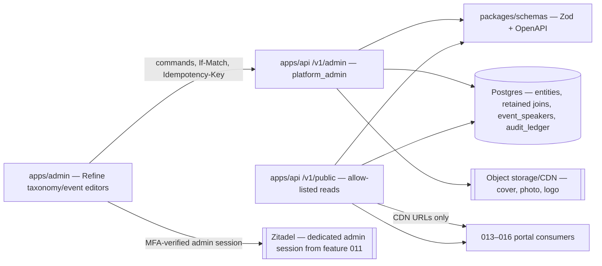
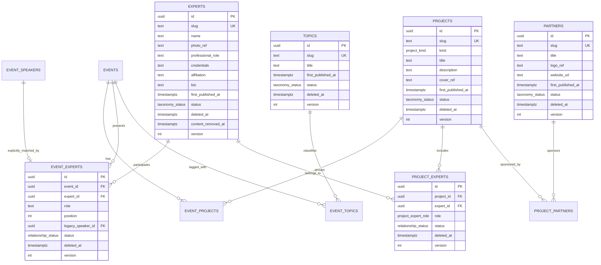
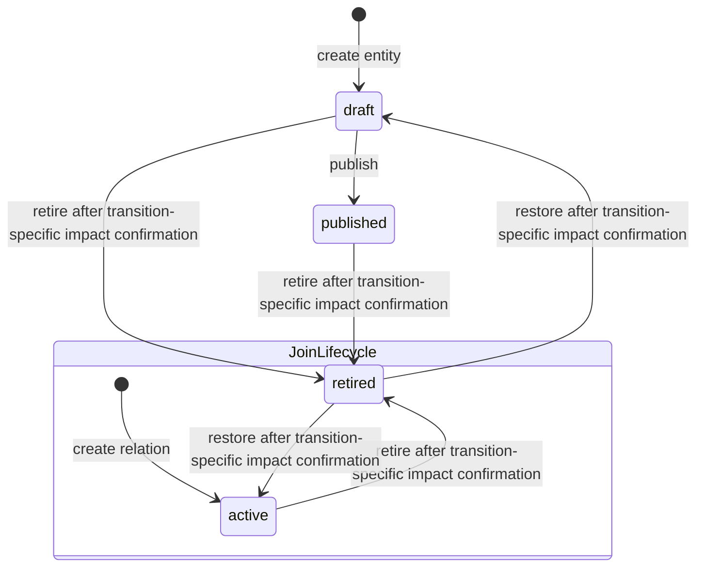
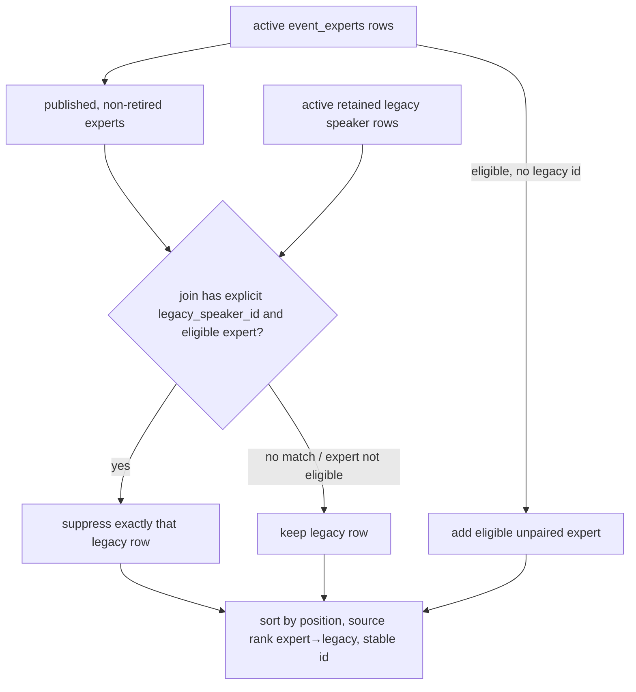

# 012 — Content taxonomy (Design)

## 1. Architecture

012 is one vertical spanning `packages/db` (retained schema + migrations), `packages/schemas` (Zod/OpenAPI SSOT), `apps/api` (admin commands and public reads), generated `@ds/api-client`, and `apps/admin` (Refine resources plus event/project relationship editors). It extends the 007 event aggregate; it does not add a second content store and renders no doctor-facing page.

Every taxonomy field is ordinary editorial text: an expert's name, professional role, credentials, affiliation and bio are the same public regalia the expert already publishes on conference sites and professional profiles. They are stored as plain `text`/`varchar` columns like any other editorial content — 012 introduces no encryption, key management or compliance workflow of its own.



Every domain mutation runs inside feature 010's audit-context transaction. No taxonomy-specific audit table or history viewer is introduced.

## 2. Data model



The omitted joins use the same envelope: UUID id, their two endpoint FKs, `active | retired`, `deleted_at`, `version`, `created_at`, `updated_at`; `project_partners` additionally has `is_primary boolean NOT NULL DEFAULT false`. Logical endpoint pairs are unique across active and ordinarily retained rows: a retired relation is restored, never reinserted. `cover_ref`, `logo_ref`, `website_url` and `first_published_at` are nullable; publish-required draft fields may remain null only until publication. Every value column above is an ordinary Postgres column — no derived digest, no external key reference, no shadow copy. `event_speakers.name/regalia` and `event_experts.role` stay plain `text` exactly as feature 007 already stores them.

### 2.1 Database constraints

- `taxonomy_status = draft | published | retired`; `relationship_status = active | retired`; `project_kind = school | media | program`; `project_expert_role = curator | member`.
- CHECK constraints bind lifecycle to deletion timestamp: top rows `(status = 'retired') = (deleted_at IS NOT NULL)`; joins and migrated speakers `(status = 'retired') = (deleted_at IS NOT NULL)`.
- Every FK is the default `NO ACTION` or explicit `RESTRICT`; no cascade appears in generated migration SQL.
- Unique `(project_id, expert_id)`, `(event_id, project_id)`, `(event_id, expert_id)`, `(project_id, partner_id)`, `(event_id, topic_id)` include retained rows while their endpoints are present. A partial unique index permits at most one active `project_experts(role='curator')` per project; another permits at most one active `project_partners(is_primary=true)` per project.
- Publishing a project additionally requires exactly one active curator whose expert is `published` and non-retired; drafts may be incomplete.
- Slug identity is plain per-kind uniqueness: each entity table carries `UNIQUE (slug)` over every retained row of that table, so the four kinds occupy naturally disjoint namespaces and no cross-kind reservation table exists. Authored slugs match `[a-z0-9]+(?:-[a-z0-9]+)*`, and canonical UUID text is forbidden for every kind so `/:idOrSlug` stays unambiguous: a request token that parses as a canonical UUID resolves only by `id`, every other token only by `slug`. `first_published_at` is set once by the first publish transaction, and a migration guard rejects clearing/changing it. A removed expert keeps its authored slug: the retained row permanently holds that slug through the same unique index, so the public URL cannot later resolve to a different person, and the row is simply not published.
- `experts.content_removed_at IS NOT NULL` implies `status='retired'`, non-null `deleted_at`, and null `name`, `photo_ref`, `professional_role`, `credentials`, `affiliation` and `bio`; a CHECK pins that shape. The admin and any audit renderer supply the fixed label `[удалён]` for such a row rather than storing a sentinel string. `event_speakers.name` and `event_speakers.regalia` stay plain nullable `text`; a row whose values were cleared on request has both of those columns null and a non-null `content_removed_at`, never sentinel person text. Restore predicates require `content_removed_at IS NULL`; a removed row returns 409 `CONTENT_REMOVED` without changing versions.
- [#1278](https://github.com/doctor-school/ds-platform/issues/1278) replaces the old `event_speakers(event_id, position)` primary key with UUID `id` as row identity, retains an explicit `UNIQUE(event_id, id)` for the composite reference, and adds partial active-slot `UNIQUE(event_id, position) WHERE status='active'`; retained and replacement rows may therefore share a position but two active rows may not. It adds retained-lifecycle columns (`status`, `deleted_at`, nullable `content_removed_at`, `version`, timestamps) and leaves the existing `name`/`regalia` text columns as they are. `event_experts.legacy_speaker_id` is nullable and unique, and its executable FK is `event_experts(event_id, legacy_speaker_id) REFERENCES event_speakers(event_id, id) ON DELETE RESTRICT`. A PK/UNIQUE on `event_speakers.id` alone is not treated as sufficient for this composite reference.
- `version` starts at 1 and is incremented atomically by every successful update or lifecycle command.

### 2.2 Authoring fields and validation

The Zod schemas in `packages/schemas` encode the requirements matrix directly: project title 1–160, kind enum and description 1–2000; expert name 1–160, professional role 1–160, credentials 1–500, affiliation 1–240 and bio 1–4000; topic title 1–120; partner title 1–160 and optional absolute HTTPS website up to 2048. Display labels are required on create; the other required public fields may be null only on a draft. PATCH omission means unchanged, while explicit null is accepted only for optional fields or an incomplete draft field. Updates to a published row re-run the publish contract.

If create omits `slug`, the service generates it with one shared canonical lowercase-ASCII transliteration/slugification function that the admin preview also imports. A conflict with any retained slug of the same kind is 409 `SLUG_CONFLICT`; the service does not silently choose a different public identity. PATCH predicates slug updates on `first_published_at IS NULL`; otherwise it returns 409 `SLUG_IMMUTABLE`. First publish sets `first_published_at` and status atomically.

Media schemas accept one still JPEG, PNG or WebP at most 10 MiB, with post-orientation width/height at most 6000 px and at most 25 million aggregate decoded pixels. The streaming header/parser rejects APNG, animated WebP, any page/frame count other than one, oversized dimensions or aggregate decode budget before allocating all frames or uploading. The shared normalizer introduced by #1283 applies orientation, converts to sRGB, then deterministically re-encodes the single frame to canonical WebP using the repository-pinned codec build, quality/lossless/alpha/chroma options and `media_profile_version`; that version and the exact option set enter the request fingerprint. It strips EXIF/XMP/GPS/ICC/original filename and every ancillary block, derives MIME from canonical output bytes, and persists only those bytes under a server-generated key. Original bytes/name exist only in bounded request processing. #1284 photos and #1286 logos consume the same component/fixtures byte-for-byte. Expert photo absence yields deterministic initials from the name; admin checks are only preflight and API normalization is authoritative.

Input-mask declaration is `none` for every 012 field: each value is editorial text, a separately validated slug/URL/integer, or a file—not a fixed-format identifier—so a mask would fabricate or rewrite content rather than assist entry. Refine uses plain text/textarea controls with trim and character counters. Slug has generated preview plus pattern/length feedback, partner website uses a URL input, `event_experts.position` is integer step 1 from 0 through 32767, and its role is trimmed 1–80. Field validation is 400 `VALIDATION_FAILED`; a valid-shaped mutation that would leave a published projection incomplete is 409 `PUBLISH_REQUIREMENTS_NOT_MET` with field-addressed errors.

Admin expert search is ordinary case-insensitive substring search over the stored `experts.name`, `slug` and (for other kinds) `title` columns. The chosen mechanism is `pg_trgm`: the migration enables the extension and creates `experts_name_trgm_idx USING gin (name gin_trgm_ops)`, and the query is `name ILIKE '%' || <query> || '%'` with the same predicate reused for slug. The server trims and NFKC-normalizes the query before matching so visually identical inputs behave the same; no separate token table, derived digest or bounded batch verification exists, and the index keeps the query off a full-roster scan. 016 later consumes the same physical columns in its own read model.

### 2.3 Existing-row conformance prerequisite (#1278)

The current 007 table is position-keyed and its editor replaces rows with delete-then-insert. GitHub [#1278](https://github.com/doctor-school/ds-platform/issues/1278) owns conformance of that existing table: stable retained `event_speakers` and removal of its cascade/delete paths. 012 does not duplicate that migration. Its scope is the legacy-speaker seam alone — only the EARS-7/8 handlers (#1289 → #1290) touch `event_speakers`, so #1278 gates those and nothing else; the W1 entity verticals neither read nor write that table. Before the legacy-speaker matching handler, #1278 must provide:

1. add/backfill stable UUID `id`, make it the row identity replacing the old `(event_id, position)` primary key, add `status: active | retired`, `deleted_at`, nullable `content_removed_at`, `version` and timestamps, pin the exact removed-speaker CHECK, and add explicit `UNIQUE (event_id, id)` for 012's same-event composite FK;
2. enforce the active authoring order with partial `UNIQUE (event_id, position) WHERE status='active'`, allowing a retired predecessor and active replacement at the same position;
3. replace the event FK cascade with `NO ACTION`/`RESTRICT`;
4. change the 007 DTO/editor reconciliation to carry row ids and retire/restore ordinary removed rows instead of deleting them, while rejecting restore or payload repopulation when `content_removed_at IS NOT NULL` with 409 `CONTENT_REMOVED`;
5. attach feature 010's audit trigger and coverage entry;
6. make every legacy-speaker reconciliation lock the parent `events` row before reading or mutating child rows, then revalidate active `(event_id, position)` slots under that lock so 012 can share the same per-event serialization boundary.

The retained idempotency-record contract of §6 — extending the existing `idempotency_keys` table with the actor/route binding, request fingerprint, stored response, fenced `lease_epoch` and 24-hour retained expiry — is not part of that seam: it is owned by the first W1 vertical (#1283), which is the first 012 mutation and the first upload, and every later handler including #1278's speaker writes consumes it unchanged.

The #1278 backfill changes no speaker text, ordering or current projection. 012 consumes the resulting stable `event_speakers.id`; creating an `event_experts` match never updates the matched row's name, regalia, status or `deleted_at`. If #1278 is not merged, EARS-7/8 are blocked—no positional-FK workaround is permitted.

### 2.4 Editorial removal of an expert or legacy speaker

An expert or a legacy speaker sometimes asks to be taken off the site — a withdrawn consent to be listed, a changed employer, a request from the person themselves. In 012 that is an editorial flow, not a compliance programme: the operator unpublishes the record, retires it and clears its descriptive values. Nothing is physically deleted, no key material is involved, and no legal-hold, backup-purge or publication-disablement gate exists.

[#1306](https://github.com/doctor-school/ds-platform/issues/1306) owns `RemoveExpertContent(expertId)` in the taxonomy admin. In one transaction, with the ordinary `platform_admin` authority of §5.3, it:

1. resolves every published project where the subject is the sole active curator, by the operator-supplied replacement expert (published and non-retired) or by retiring the project — the same demote-first order as §3.2;
2. sets the expert row to `status='retired'`, `deleted_at = now()`, `content_removed_at = now()` and nulls `name`, `photo_ref`, `professional_role`, `credentials`, `affiliation` and `bio` while keeping the row, its id and its slug;
3. retires every incident `event_experts` and `project_experts` row and clears `event_experts.role`;
4. inserts a `media_cleanup_jobs` row for the released photo reference, exactly as an ordinary media clear does (§5.1);
5. writes the ordinary feature-010 audit rows for each affected table.

`RemoveLegacySpeakerContent(eventId, speakerId)` is the same flow for a free-text speaker who was never migrated: it nulls `event_speakers.name` and `event_speakers.regalia`, sets `content_removed_at`, retires the row and leaves the event untouched. A speaker already matched by an active `event_experts` row is removed through its expert instead.

After removal, the admin renders the fixed label `[удалён]` wherever a name would appear, public reads return 404 for the retired row, and restore is refused with 409 `CONTENT_REMOVED` — re-listing that person is a fresh authoring act, not an undo. ADR-0009 remains the platform's PD lifecycle decision and its "value erasure on a retained row" mechanism is exactly what this flow performs for editorial content; 012 adds no ADR-0009 queue, worker, approval route or key-destruction outbox.

## 3. Lifecycles



Retiring a top-level entity leaves every join unchanged. Public traversal filters the endpoint and therefore hides it; restoring the entity to `draft` still does not publish it. Republish is deliberate. Retiring a join affects only that relationship. A restore reuses the same row/id and fails with 412 if the caller's version is stale. Two narrow refusal overlays exist: the published-project curator invariant below blocks an invalidating mutation, while an expert or legacy speaker with `content_removed_at` returns 409 `CONTENT_REMOVED` on restore/repopulation because the person asked to be taken off the site. Neither overlay physically deletes a row.

### 3.1 Lifecycle-impact preview

```mermaid
sequenceDiagram
  participant O as Operator
  participant A as Refine admin
  participant API as apps/api
  participant DB as Postgres
  O->>A: choose Retire or Restore
  A->>API: GET .../:id/lifecycle-impact?transition=retire|restore
  API->>DB: read target + all incident relations and opposite-endpoint eligibility inputs
  API-->>A: LifecycleImpact(transition, version, affected ids, signed impactToken)
  A-->>O: confirmation dialog (no Delete wording)
  O->>A: confirm
  A->>API: POST .../:id/{retire|restore} + If-Match + Lifecycle-Impact-Token + Idempotency-Key
  API->>DB: SERIALIZABLE recompute + token/version check; apply one lifecycle transition + version++
  DB-->>API: row + feature-010 audit record
  API-->>A: updated detail + ETag
```

`impactToken` is an opaque server-signed envelope binding transition, target kind/id/version, issued-at and a 15-minute expiry to a canonical fingerprint of every retained incident relation and every opposite endpoint input that determines current public eligibility. The fingerprint is over sorted tuples of table/kind, stable id, monotonic version where present, lifecycle state and the exact event-public-eligibility inputs; it therefore covers inactive relations and non-public endpoints that could become visible, without returning their hidden content to the client.

The signed envelope also binds the requested transition, so a retire preview cannot authorize restore or vice versa. Confirmation requires both the target `If-Match` and `Lifecycle-Impact-Token`. It runs at PostgreSQL `SERIALIZABLE` and acquires the target plus dependencies in the applicable LD-2/LD-4 canonical order—not target-first for relation commands. It optimistically discovers the set before locking, aborts with 412 and restarts from a new preview if that set changes, then verifies signature/expiry and recomputes transition/target identity/version/fingerprint before changing lifecycle. A changed target, inserted/restored/retired incident relation, changed opposite-endpoint eligibility, tampered/expired token, wrong transition/target or serialization abort returns 412 `LIFECYCLE_IMPACT_STALE` with zero domain/media/audit mutation; the service never auto-retries it, and the UI must reload impact before asking again. A missing token is 428 `LIFECYCLE_IMPACT_REQUIRED`. Thus both changes committed between preview and confirmation and phantoms overlapping the confirmation transaction are covered for retire and restore; an entity restore may truthfully show an empty affected list because it returns to `draft`, while a join restore previews public relations it would add immediately.

### 3.2 Published-project curator invariant

Every committed `published` project has exactly one active curator whose expert is `published` and non-retired. The partial unique index enforces the upper bound; publish, curator mutation and expert lifecycle services enforce the lower bound and eligibility through one shared lock protocol. Every affected expert row is locked first in stable-id order, then every affected project row in stable-id order, then `project_experts` rows. State and relations are re-read only after those locks. Directly retiring the curator expert, retiring the sole curator relation or changing its role to `member` returns 409 `PUBLISHED_PROJECT_REQUIRES_CURATOR` without any row, version, media or audit mutation.

`ReplaceProjectCurator(projectId, expertId)` is the only curator-change path while the project is published. With the project's `If-Match`, one transaction identifies the current and candidate expert ids, locks both experts in stable-id order, locks the project and relation rows, re-reads them, verifies that the replacement expert is still published/non-retired, demotes the former curator row to `member`, then creates/restores/promotes the candidate row, increments both affected relation versions and the project version, and writes the ordinary feature-010 audit rows. The demote-first order is required because PostgreSQL's partial unique index on the active curator is immediate, not deferrable; if candidate promotion fails, rollback restores the former curator and its version/audit state. Project publication optimistically identifies its curator, locks that expert before the project, and post-lock revalidates; if the curator set changed it returns 412/restarts from a fresh request rather than discovering and locking another expert after the project lock.

An expert lifecycle mutation locks the expert first, then re-queries all active curator relations, locks their project rows in stable-id order and revalidates them before changing expert state. Every `project_experts` mutation participates in the same order, so a relation inserted while retirement is discovering dependencies either commits before the expert lock and is seen on re-read, or waits and then rejects the retired endpoint. Under replacement-versus-candidate-retirement, exactly one operation can commit: the loser revalidates to 409 `PUBLISHED_PROJECT_REQUIRES_CURATOR`; under concurrent replacements, the stale project version returns 412. Retiring the project itself is allowed and leaves joins untouched; restore yields `draft`, and a later publish revalidates curator eligibility. `RemoveExpertContent` (§2.4) uses the same order and the same replacement-or-retire resolution, so a removal can never leave a published project without a curator.

As defense in depth, public project reads repeat the eligibility predicate and fail closed: an inconsistent imported or manually corrupted `published` project is omitted/404 and emits an operational error rather than leaking an invalid public projection.

## 4. Legacy speaker merge

The public projection is a query policy, not a migration job.



Names are never compared. A draft or retired expert cannot suppress the fallback. Retiring the join makes the fallback visible again; restoring it suppresses the same stable legacy row again. The total order is `position ASC`, source rank (`expert` before `legacy`), stable row id ASC (LD-2). The public page/endpoint item is the exact §5.2 discriminated union: legacy carries only `source, name, credentials`; expert carries `source, expertId, expertSlug, name, credentials, photoUrl, role`, with nullable `photoUrl`. Internal storage keys and retained-row state are absent.

Position conflicts are rejected at write time: the active current projection must have one deterministic slot per visible row. A mapped expert may take the matched legacy row's position because that row is suppressed; an unpaired expert must use an unoccupied position. Every 012 `event_experts` create/update/retire/restore first locks every old/new affected expert row in stable-id order, then locks the parent `events` row, re-reads expert lifecycle and both child tables, and only then mutates/recomputes the would-be visible projection. Every 007 `event_speakers` reconciliation locks the same parent event before reading or mutating either child table. This preserves the global expert→project→event order while allowing a legacy-only write to begin at the event boundary.

Expert publish/retire also changes speaker visibility: publish can reveal an unpaired expert or suppress a matched fallback, while retire can reveal that fallback. The lifecycle transaction therefore locks the expert first, discovers and locks every linked parent event in stable-id order (after any curator project locks from §3.2, before child rows), re-reads all `event_experts`/`event_speakers` rows and validates every affected projection before changing expert status. A concurrent `event_experts` mutation must acquire that same expert lock before its event lock: if the relation commits first, lifecycle discovers and revalidates it; if lifecycle commits first, the relation re-reads the new expert state and revalidates before writing. Within-table partial uniqueness remains a DB backstop; any would-be cross-table collision returns 409 `SPEAKER_POSITION_OCCUPIED`. Legacy-row, expert-link and linked-expert lifecycle writes therefore serialize for the same event, while different experts/events remain independent unless they share an affected lock.

## 5. HTTP surface

### 5.1 Admin entities and relationships

For each entity resource `{projects|experts|topics|partners}`:

| Method/path                                                                | Purpose                                                                  |
| -------------------------------------------------------------------------- | ------------------------------------------------------------------------ |
| `GET /v1/admin/<resource>?page&pageSize&q&status&includeRetired`           | Refine list; offset/page + total; defaults exclude retired.              |
| `POST /v1/admin/<resource>`                                                | Create draft; UUID `Idempotency-Key`, no `If-Match`.                     |
| `GET /v1/admin/<resource>/:id`                                             | Detail by stable id, including retired rows.                             |
| `PATCH /v1/admin/<resource>/:id`                                           | Edit same row; target `If-Match`.                                        |
| `POST /v1/admin/<resource>/:id/publish`                                    | Draft → published; target `If-Match`.                                    |
| `GET /v1/admin/<resource>/:id/lifecycle-impact?transition=retire\|restore` | Preview transition consequences plus signed `impactToken`.               |
| `POST /v1/admin/<resource>/:id/retire`                                     | Target `If-Match` + matching `Lifecycle-Impact-Token`.                   |
| `POST /v1/admin/<resource>/:id/restore`                                    | Target `If-Match` + matching `Lifecycle-Impact-Token`; retained → draft. |

Projects additionally expose `POST /v1/admin/projects/:id/replace-curator` with `{ expertId }`, project `If-Match` and `Idempotency-Key`; this is the atomic command from §3.2.

The §2.4 editorial removal is `POST /v1/admin/experts/:id/remove-content` with `{ curatorResolutions: { projectId: uuid, replacementExpertId?: uuid, retireProject?: true }[] }`, the expert `If-Match` and an `Idempotency-Key`. Its legacy-speaker counterpart is `POST /v1/admin/events/:eventId/speakers/:speakerId/remove-content` with the speaker `If-Match`. Both are ordinary `platform_admin` commands and both are irreversible in the sense of §3: the retained row afterwards refuses restore with 409 `CONTENT_REMOVED`. There is no Delete route anywhere in the taxonomy controller.

For `{event-projects|event-experts|project-experts|project-partners|event-topics}`, the same retained command pattern is exposed at `/v1/admin/<join>`: filtered list; POST create with no `If-Match`; PATCH attributes with the join ETag; GET transition-specific lifecycle impact; POST retire/restore with the join ETag and lifecycle token. There is no DELETE route. The Refine provider maps `deleteOne` to an unsupported operation rather than an HTTP call.

Request content types are exact:

- Topics and every request without a binary use `application/json`.
- A project/expert/partner create or PATCH with a binary uses `multipart/form-data` containing exactly one `payload` part with `Content-Type: application/json` plus at most one kind-specific file part named `cover`, `photo` or `logo`. Multipart without a file is rejected as 415 `UNSUPPORTED_MEDIA_TYPE`; JSON is the canonical no-file shape.
- Client JSON never exposes or accepts `coverRef`, `photoRef`, `logoRef`, an object key or an arbitrary storage URL; strict-schema input of one is 400 `VALIDATION_FAILED`. Create omission yields no media. PATCH omission keeps the current reference; JSON PATCH `mediaAction: "clear"` clears the optional media. `mediaAction` is not accepted on create.
- A multipart file means set/replace. Supplying a file together with `mediaAction: "clear"`, multiple files or the wrong kind-specific part returns 400 `MEDIA_INPUT_CONFLICT` before upload. Every valid project/expert/partner file then crosses the shared #1283 decoder/normalizer from §2.2 before storage. A replacement always uses a fresh deterministic idempotency-scoped object key and never overwrites a referenced object in place.

Media idempotency follows the ordinary fingerprint rule of §6: the request fingerprint covers the concrete target path/route parameters, canonical JSON, the uploaded file's SHA-256 and byte length, `media_profile_version` and every semantic conditional header. Two byte-different uploads under the same key are different semantic inputs and return 409 `IDEMPOTENCY_KEY_REUSED`, even when they would normalize to identical canonical output; an exact retry replays the stored response.

The failure order follows the existing feature-007 storage policy. Dedicated-session/MFA/CSRF and `platform_admin` authorization happen before request/key validation; canonical UUID-key validation happens before fingerprint binding, normalization or upload. An object-storage PUT failure returns 503 `MEDIA_STORAGE_UNAVAILABLE`, completes that idempotency outcome for replay and makes no taxonomy/speaker-domain or audit mutation. After a successful upload, the DB transaction rechecks method-specific preconditions, swaps or clears the reference, writes domain audit and completes the idempotency response atomically. A refused/failed transaction's newly uploaded unreferenced object stays discoverable through §6's orphan cleanup. A committed replace/clear additionally inserts a retained `media_cleanup_jobs` row for the old referenced key in the same transaction as the ref change; this is a distinct handle because the idempotency record describes only the new upload.

`media_cleanup_jobs` is a constrained technical table with stable UUID `id`, `status: active | expired`, `execution_state: pending | processing | completed`, nullable `deleted_at`, cleanup kind, entity kind/id and media slot, server-generated object/CDN keys, monotonic `lease_epoch`, bounded lease owner/expiry, enum-only last error, attempt count and timestamps. The ref-swap transaction creates one `active/pending` job; a worker CAS-acquires a newer epoch, rechecks every current media reference, deletes all object versions/derivatives, purges or invalidates the CDN key, and retries/alerts until both providers acknowledge absence. Completion under the matching owner+epoch sets `expired/completed`, `deleted_at` and `completed_at`, clears raw keys, entity id, lease and error content, and retains only job id, cleanup kind, outcome and timestamps. A zero-row fencing update cannot declare cleanup complete. No row is deleted/reactivated. Feature 010 continues to audit the domain ref mutation; the job table is an explicit technical-table audit exclusion with allowlist-parity tests. Best-effort immediate cleanup may reduce latency but never replaces this durable obligation.

### 5.2 Public reads

- `GET /v1/public/{projects|experts|topics|partners}` and `/:idOrSlug` return cursor-paginated base lists / one allow-listed projection. A canonical UUID token is id-only; any other token is slug-only. Full DTOs are exact: `PublicProject { id, slug, kind, title, description, coverUrl, primaryPartner }`; `PublicExpert { id, slug, name, professionalRole, credentials, affiliation, bio, photoUrl, initials }`; `PublicTopic { id, slug, title }`; `PublicPartner { id, slug, title, logoUrl, websiteUrl }`. `primaryPartner` is `PublicPartnerSummary | null`; optional URLs are present and nullable.
- Relationship summaries are exact: `PublicEventSummary { id, slug, title, school, startsAt, state }`; `PublicProjectSummary { id, slug, kind, title, description, coverUrl, primaryPartner }`; `PublicExpertSummary { id, slug, name, professionalRole, credentials, affiliation, photoUrl }`; `PublicTopicSummary { id, slug, title }`; `PublicPartnerSummary { id, slug, title, logoUrl, websiteUrl }`. Optional URLs are present and nullable; no status, storage key, retained-row id or admin field is present.
- Nested route item DTOs are fixed rather than inferred from the opposite full entity:
  - `/events/:key/projects` → `PublicProjectSummary`; `/projects/:key/events` → `PublicEventSummary`;
  - `/events/:key/experts` → `PublicEventExpertItem = PublicExpertSummary + { role, position }`; `/experts/:key/events` → `PublicExpertEventItem = PublicEventSummary + { role, position }`;
  - `/projects/:key/experts` → `PublicProjectExpertItem = PublicExpertSummary + { role: curator | member }`; `/experts/:key/projects` → `PublicExpertProjectItem = PublicProjectSummary + { role: curator | member }`;
  - `/projects/:key/partners` → `PublicProjectPartnerItem = PublicPartnerSummary + { isPrimary }`; `/partners/:key/projects` → `PublicPartnerProjectItem = PublicProjectSummary + { isPrimary }`;
  - `/events/:key/topics` → `PublicTopicSummary`; `/topics/:key/events` → `PublicEventSummary`.
- The canonical merged page-speaker item is a strict discriminated union: legacy `{ source: "legacy", name, credentials }`; linked expert `{ source: "expert", expertId, expertSlug, name, credentials, photoUrl, role }`, with `photoUrl` present and nullable. No expert-only key appears on a legacy item. `GET /v1/public/events/:key/speakers` and shipped `PublicEventPage.speakers` return that exact ordered union. Shipped `UpcomingBroadcastCard.speakers` remains its exact thinner `{ name }` array, mapped from the same ordered resolver—not a second query or merge implementation.

Every growing base route accepts bounded `limit` and opaque `cursor`, returns ADR-0002's exact envelope `{ data, pagination: { nextCursor, hasMore } }`, and orders by a stable tuple ending in id; the speaker endpoint follows LD-2 order. Unknown/ineligible source is 404 `RESOURCE_NOT_FOUND`; an eligible source with no eligible relations is 200 with `data: []`, `nextCursor: null`, `hasMore: false`; inactive/ineligible children are filtered. Event traversals reuse the existing public-event policy. Base search/aggregate totals are deliberately absent: feature 015 must own one bounded-SQL project catalog/page read returning kind-specific content count, nullable primary partner and enriched team, and feature 016 one bounded-SQL expert catalog read accepting `q` plus one project filter and returning filtered/total counts. Those features may join/aggregate the same tables but may not issue one 012 relationship request/query per card.

### 5.3 Authorization and errors

Taxonomy admin routes inherit feature 011 exactly as feature 007 does: only `__Host-ds_admin_session` with local fingerprint and MFA succeeds, state changes pass `x-ds-admin-csrf`, and the route guard requires the `platform_admin` role carried by that session. There is no per-mutation live IdP revalidation, no second role and no step-up elevation in 012 — the editorial removal command of §2.4 is an ordinary `platform_admin` mutation. Inactive/missing/mismatched admin session is 401 `ADMIN_SESSION_REQUIRED`; a session without the role is 403 `PLATFORM_ADMIN_REQUIRED`. Every pre-fingerprint refusal has zero idempotency/domain/media/audit effect. Public routes are `public`, with no session variation. All DTOs live in `packages/schemas` and generate OpenAPI/client types.

| Status | Exact stable `errorCode`                                                                                                                                                                                                                                                                        |
| ------ | ----------------------------------------------------------------------------------------------------------------------------------------------------------------------------------------------------------------------------------------------------------------------------------------------- |
| 400    | `VALIDATION_FAILED`, `MEDIA_INVALID`, `MEDIA_INPUT_CONFLICT`, `CURSOR_INVALID`, `IDEMPOTENCY_KEY_INVALID`.                                                                                                                                                                                      |
| 401    | `ADMIN_SESSION_REQUIRED`.                                                                                                                                                                                                                                                                       |
| 403    | `PLATFORM_ADMIN_REQUIRED`.                                                                                                                                                                                                                                                                      |
| 404    | `RESOURCE_NOT_FOUND` for unknown admin id or unknown/ineligible public source.                                                                                                                                                                                                                  |
| 409    | `RELATIONSHIP_CONFLICT`, `SLUG_CONFLICT`, `SLUG_IMMUTABLE`, `PUBLISH_REQUIREMENTS_NOT_MET`, `PUBLISHED_PROJECT_REQUIRES_CURATOR`, `INVALID_TRANSITION`, `LEGACY_SPEAKER_CONFLICT`, `SPEAKER_POSITION_OCCUPIED`, `CONTENT_REMOVED`, `IDEMPOTENCY_KEY_REUSED`, `IDEMPOTENCY_REQUEST_IN_PROGRESS`. |
| 412    | `PRECONDITION_FAILED`; `LIFECYCLE_IMPACT_STALE` for invalid/wrong-transition/wrong-target/changed dependency token or overlapping serialization abort.                                                                                                                                          |
| 415    | `UNSUPPORTED_MEDIA_TYPE`.                                                                                                                                                                                                                                                                       |
| 428    | `IDEMPOTENCY_KEY_REQUIRED`, `PRECONDITION_REQUIRED`, `LIFECYCLE_IMPACT_REQUIRED`.                                                                                                                                                                                                               |
| 503    | `MEDIA_STORAGE_UNAVAILABLE`; no taxonomy/speaker-domain or audit mutation.                                                                                                                                                                                                                      |

Every error is `application/problem+json` with RFC 7807 fields plus `errorCode` and `traceId`; no database key or hidden lifecycle state leaks.

## 6. Idempotency, concurrency and audit

- Every mutating taxonomy HTTP endpoint requires `Idempotency-Key` as lowercase canonical UUID text. Missing/blank is 428 `IDEMPOTENCY_KEY_REQUIRED`; malformed/non-canonical is 400 `IDEMPOTENCY_KEY_INVALID`, both before any record/upload/domain/audit work. The retained `idempotency_keys` row is the plain 007-shaped contract that the first W1 vertical (#1283) extends: globally unique `key` (the canonical UUID itself), `scope`, actor id, method+route, a `request_fingerprint` SHA-256, the stored response (status, body, allow-listed `ETag`/`Location`), `execution_state: processing | completed`, fenced `lease_epoch`, `status: active | expired`, nullable `deleted_at`, `created_at` and `expires_at = created_at + 24 hours`. Uniqueness of `key` spans actors, methods, routes and expiry; during the active window replay is permitted only to the original actor on the original route, and any other actor/route gets 409 `IDEMPOTENCY_KEY_REUSED`.
- The insert/CAS transaction atomically binds the fingerprint over concrete path/query, canonical JSON, `If-Match`, `Lifecycle-Impact-Token`, the uploaded file's SHA-256 and byte length (null for JSON-only requests) and `media_profile_version`. A crash before that transaction leaves no record. Afterwards the binding is immutable: every retry recomputes the fingerprint from its own supplied bytes, and a mismatch is 409 `IDEMPOTENCY_KEY_REUSED` before normalization or upload. An exact-input retry may take over the record by CAS-acquiring a newer `lease_epoch` and resuming the command. Two byte-different files that would normalize identically therefore remain two different requests.
- Request takeover and orphan cleanup are disjoint. A retry re-derives the fingerprint, takes over the lease, then verifies or produces the canonical normalized object and resumes. Each PUT uses a deterministic record-scoped object key with `If-None-Match: *`, so no stale owner overwrites an existing object. Cleanup never invokes the domain handler: it retains the deterministic locator, waits past the lease expiry plus the provider's documented maximum in-flight-write duration and clock-skew grace, rechecks references/HEAD, deletes if needed and repeats until absence is acknowledged. A late old-owner PUT is therefore visible to a later sweep. PUT failure is a fenced terminal 503 `MEDIA_STORAGE_UNAVAILABLE` with zero domain/audit mutation.
- Every deterministic post-record result is fenced and terminal: exact status/body/allow-listed `ETag`/`Location` are stored for successful commands, 409 invariants and 412 refusals. Retire/restore target, token, dependency or serialization mismatch has precedence as 412 `LIFECYCLE_IMPACT_STALE`; a stale `If-Match` on PATCH/publish/replace-curator/remove-content is 412 `PRECONDITION_FAILED`. Both complete/replay the refusal while changing no domain/media/audit state. Unclassified DB/provider timeout, disconnect or uncertain commit is not terminal: domain work rolls back/remains uncommitted and a newer owner reruns post-lock checks. Pre-record auth/key/shape refusals create no row.
- A successful domain transaction rechecks method-specific conditions, mutates taxonomy/speaker rows, writes feature-010 audit, stores the response and completes the record where its status and the request owner's `lease_epoch` still match. A zero-row fence rolls back all domain/audit/record writes; only an immutable unreferenced object can remain for cleanup. POST create requires only the UUID key; PATCH/publish/remove-content require target `If-Match`; replace-curator requires project `If-Match`; retire/restore require target `If-Match` plus lifecycle token. Missing conditions are 428.
- At 24 hours, one database transaction sets `expired` + `deleted_at`, closes replay and every upload capability, and clears actor/request/response/header/fingerprint content while permanently retaining the globally unique `key`, the terminal enum/timestamps and the non-content object-cleanup locator/state until the quiescent reconciler acknowledges absence, after which that locator is cleared too. The row is never deleted, reactivated or reused. Record cleanup remains distinct from §5.1 `media_cleanup_jobs`; §6's exact two-table technical allowlist covers both with explicit parity tests.
- Shared invariant protocols add pessimistic serialization where per-row ETags are insufficient: every `event_experts` mutation locks affected experts before its parent event, linked-expert lifecycle uses the same expert-first/event-next boundary, curator plus speaker eligibility follows expert-first/project-second/event-third locking, and lifecycle-fingerprint confirmation is `SERIALIZABLE`. All commands revalidate after acquiring their shared dependencies; invariant failures and serialization aborts write no domain audit row. Unique constraints remain the final race guard.
- Feature 010's `withAuditContext` and DB trigger wrap taxonomy entity, relationship and migrated speaker-domain mutations. Lifecycle actions and the §2.4 removal produce ordinary attributed `data.<table>.update`; no duplicate writer is added. Expert and speaker values are ordinary audited columns like every other editorial field. Where feature 010 keeps a masked-column list, 012 contributes only plain column names — `experts.name/professional_role/credentials/affiliation/bio/photo_ref` and `event_speakers.name/regalia` — so a removal UPDATE is recorded as a diff without re-publishing the cleared values in a new plaintext row. Only the constrained coordination tables `idempotency_keys` and `media_cleanup_jobs` are feature-010 technical exclusions, each named in both SQL/TS allowlists with parity and retained-lifecycle tests; no implicit "technical" exemption exists.

## 7. Refine admin composition

The admin owns four resource lists/details/forms plus relationship editors embedded in the existing 007 event form and the project detail. Tables show status, search, page controls and an explicit "include retired" filter; selectors exclude retired rows; detail routes can open them for restore. Lifecycle actions are Publish, Retire and Restore. Delete is absent from navigation, action menus, provider and API. The §2.4 removal is a separate, clearly labelled destructive-content action on the expert and legacy-speaker detail: it states that descriptive values are cleared irreversibly, requires the sole-curator resolution for each affected published project, and is never presented as Delete.

EARS-18 Stage A is the first UI gate: before any entity, join or removal-flow UI slice, run `build-ui-from-design-system`, inventory the existing Refine/event patterns and `@ds/design-system`, search the approved registry whitelist, present 2–3 concrete compositions, and record the product-owner choice. The options include the removal confirmation and its curator-resolution controls; they never introduce a Delete action. Stage B drives each chosen real UI on the live stand before merge. All copy uses the typed RU catalog; primitives own focus/hover/active/disabled/loading states.

Implementation WBS stays vertical and bounded, and matches the four parallel waves the EARS Issues are wired into:

- **W1 — entity verticals** ([#1283](https://github.com/doctor-school/ds-platform/issues/1283) EARS-1 project, [#1284](https://github.com/doctor-school/ds-platform/issues/1284) EARS-2 expert, [#1285](https://github.com/doctor-school/ds-platform/issues/1285) EARS-3 topic, [#1286](https://github.com/doctor-school/ds-platform/issues/1286) EARS-4 partner), each blocked only by [#1282](https://github.com/doctor-school/ds-platform/issues/1282) Stage A. Each is its own schema→API→SDK→Refine→browser slice. There is no separate media-normalizer Issue: the shared still-image normalizer of §2.2 is introduced by the first vertical that uploads (#1283, project cover) and consumed byte-for-byte by #1284 photos and #1286 logos.
- **W2 — relationships** ([#1288](https://github.com/doctor-school/ds-platform/issues/1288), [#1291](https://github.com/doctor-school/ds-platform/issues/1291), [#1292](https://github.com/doctor-school/ds-platform/issues/1292), [#1293](https://github.com/doctor-school/ds-platform/issues/1293), then [#1289](https://github.com/doctor-school/ds-platform/issues/1289) → [#1290](https://github.com/doctor-school/ds-platform/issues/1290) for the expert link and merged projection).
- **W3 — publication, lifecycle, admin lists and public reads** ([#1287](https://github.com/doctor-school/ds-platform/issues/1287), [#1294](https://github.com/doctor-school/ds-platform/issues/1294), [#1295](https://github.com/doctor-school/ds-platform/issues/1295), [#1296](https://github.com/doctor-school/ds-platform/issues/1296), [#1297](https://github.com/doctor-school/ds-platform/issues/1297)), plus [#1306](https://github.com/doctor-school/ds-platform/issues/1306)'s editorial removal flow, which is blocked only by the expert vertical #1284 and is best not started before real `project_experts`, `event_experts` and publication handlers exist, so its curator resolution is tested against real published state.
- **W4 — cross-route sweeps** ([#1298](https://github.com/doctor-school/ds-platform/issues/1298) → [#1299](https://github.com/doctor-school/ds-platform/issues/1299) → [#1300](https://github.com/doctor-school/ds-platform/issues/1300)).

#1278 is not a W1 gate: it is scoped to the `event_speakers` seam of §2.3 and blocks only #1289. No "all taxonomy CRUD" issue is acceptable, and UI waits for EARS-18 Stage A. EARS-16/17 safeguards are acceptance criteria from each handler's first commit; their dedicated W4 children only verify the assembled route set.

## 8. Verification strategy

- **DB/migration:** all four entities/five joins satisfy lifecycle CHECKs, stable uniqueness/restrictive FKs, primary-partner uniqueness and set-once publication identity with per-table slug uniqueness; same-event speaker FK is executable; #1278 proves retained speakers with stable UUID identity; #1283 proves the retained idempotency records with quiescent upload cleanup plus deterministic still-WebP fixtures and retained cleanup jobs.
- **API/worker e2e:** real Postgres/object storage with production-parity fencing; fingerprint binding before exact JSON/multipart still-only canonical normalization, durable cleanup, the §2.4 removal (cleared columns, retired joins, curator resolution, refused restore), acquisition/pre-response record races, exact 012 base DTOs with no surface aggregates; lifecycle-token abuse and exact 412 replay; global UUID cross-actor/expiry behavior; bounded upload authorization and late-owner quiescence. Tests use `it('EARS-N: ...')`.
- **Browser:** Playwright BDD on the live Refine app creates all kinds, exercises counters/previews/URL/integer/file controls without masks, links event/project/expert/topic/partner, replaces a curator, maps a legacy speaker, runs an editorial removal with its curator resolution, verifies reject and accept branches, retires/restores, and proves no Delete/inline-topic creation. Axe, keyboard state, desktop/mobile and light/dark checks accompany the Stage-B owner verdict.
- **No stub acceptance:** browser and API tests operate on committed schemas/migrations and generated SDK types, not seeds standing in for authoring or relationship endpoints.

## 9. Dependencies and sequencing

1. Merge this accepted SDD artifact and open/wire its bounded EARS Issues.
2. Complete EARS-18 Stage A ([#1282](https://github.com/doctor-school/ds-platform/issues/1282)) before any EARS-1…15 UI work; #1283 then owns the retained idempotency-record contract and the deterministic still-only shared media component before any cover/photo/logo reaches storage.
3. Complete [#1278](https://github.com/doctor-school/ds-platform/issues/1278) before the legacy-speaker matching handler #1289 — and only that handler: it owns retained `event_speakers` with stable UUID identity, parent-event locking and removal of existing cascade/delete paths. It does not gate Stage A or the W1 entity verticals, which never touch `event_speakers`.
4. Deliver the W1 entity verticals, then W2 relationships, then W3 publication/lifecycle/reads including [#1306](https://github.com/doctor-school/ds-platform/issues/1306)'s editorial removal flow, then the W4 cross-route sweeps. Every handler includes EARS-16/17 safeguards from its first commit.
5. Only after the complete 012 parent closes may 013–016 consume base relationships; 015/016 then own their declared batched surface projections instead of N+1 composition.

The dependency is real, not a scaffold license: 012 keeps the observable legacy-speaker contract, but it must consume #1278's committed stable row identity and may not add a temporary positional mapping, hardcoded seed or duplicate migration.
