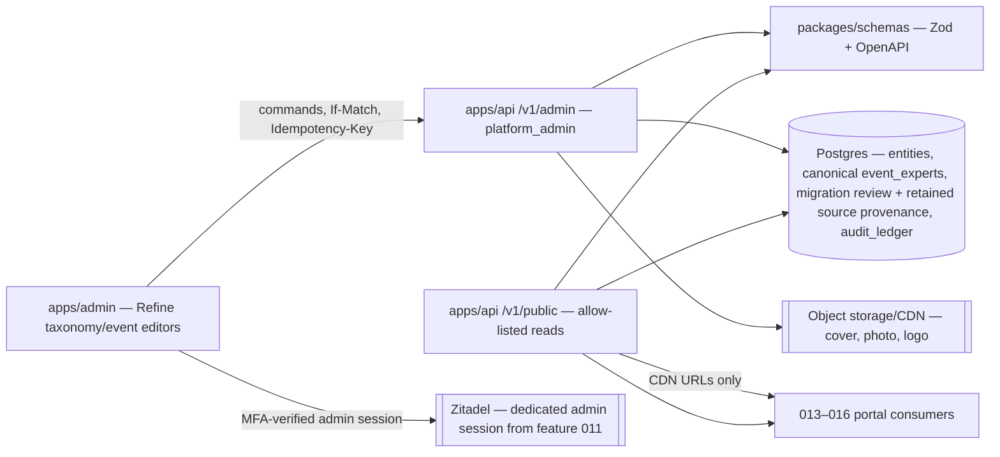
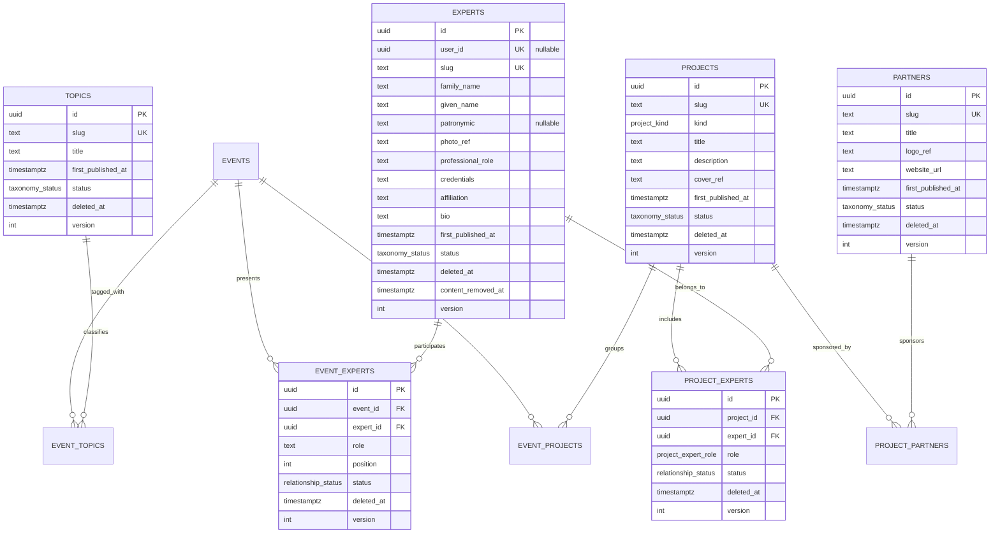
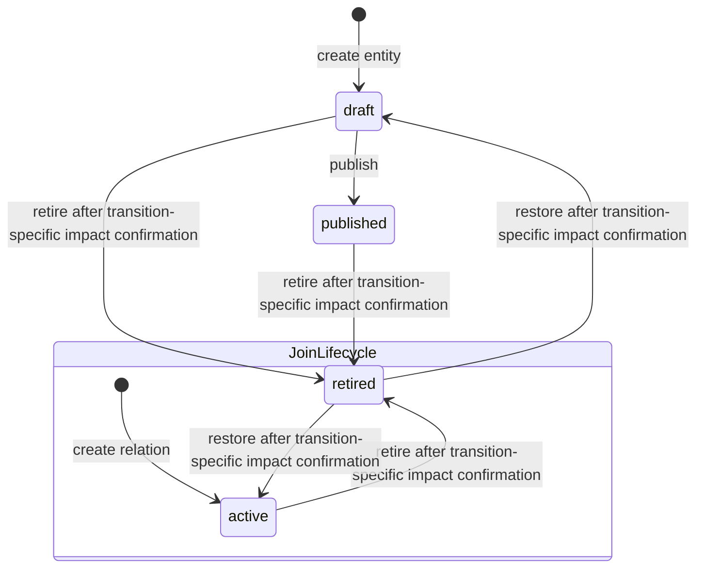

# 012 — Content taxonomy (Design)

## 1. Architecture

012 is one vertical spanning `packages/db` (retained schema + migrations), `packages/schemas` (Zod/OpenAPI SSOT), `apps/api` (admin commands and public reads), generated `@ds/api-client`, and `apps/admin` (Refine resources plus event/project relationship editors). It extends the 007 event aggregate; it does not add a second content store and renders no doctor-facing page.

Every taxonomy field is ordinary editorial text: an expert's name, professional role, credentials, affiliation and bio are the same public regalia the expert already publishes on conference sites and professional profiles. They are stored as plain `text`/`varchar` columns like any other editorial content — 012 introduces no encryption, key management or compliance workflow of its own.



Every domain mutation runs inside feature 010's audit-context transaction. No taxonomy-specific audit table or history viewer is introduced.

## 2. Data model



The omitted joins use the same envelope: UUID id, their two endpoint FKs, `active | retired`, `deleted_at`, `version`, `created_at`, `updated_at`; `project_partners` additionally has `is_primary boolean NOT NULL DEFAULT false`. Logical endpoint pairs are unique across active and ordinarily retained rows: a retired relation is restored, never reinserted. `cover_ref`, `logo_ref`, `website_url`, `user_id`, `patronymic` and `first_published_at` are nullable; publish-required draft fields may remain null only until publication. Expert `name` is a derived display value from structured person fields, never a stored identity column.

### 2.1 Database constraints

- `taxonomy_status = draft | published | retired`; `relationship_status = active | retired`; `project_kind = school | media | program`; `project_expert_role = curator | member`.
- CHECK constraints bind lifecycle to deletion timestamp: top rows `(status = 'retired') = (deleted_at IS NOT NULL)`; joins `(status = 'retired') = (deleted_at IS NOT NULL)`.
- Every FK is the default `NO ACTION` or explicit `RESTRICT`; no cascade appears in generated migration SQL.
- Unique `(project_id, expert_id)`, `(event_id, project_id)`, `(event_id, expert_id)`, `(project_id, partner_id)`, `(event_id, topic_id)` include retained rows while their endpoints are present. A partial unique index permits at most one active `project_experts(role='curator')` per project; another permits at most one active `project_partners(is_primary=true)` per project.
- Publishing a project additionally requires exactly one active curator whose expert is `published` and non-retired; drafts may be incomplete.
- Slug identity is plain per-kind uniqueness over retained rows. Every project/expert/topic/partner create mutation generates a collision-safe canonical slug server-side; no mutation schema or form accepts a slug. Canonical UUID text is never generated, keeping `/:idOrSlug` unambiguous. A removed row permanently reserves its slug.
- `experts.user_id` has a nullable unique index and restrictive FK to Users. `content_removed_at IS NOT NULL` implies `status='retired'`, non-null `deleted_at`, and null structured names, photo, role, credentials, affiliation and bio; audit/admin derive `[удалён]` rather than storing sentinel text.
- `version` starts at 1 and is incremented atomically by every successful update or lifecycle command.

### 2.2 Authoring fields and validation

The Zod schemas encode project title/kind/description; Expert `familyName` and `givenName` (1–80 each), optional `patronymic` (≤80), role, credentials, affiliation and bio; Topic title; Partner title and optional HTTPS website. Display labels are derived where needed. PATCH omission means unchanged; explicit null is accepted only for optional fields or incomplete drafts.

For all four entity kinds the service always generates a stable collision-safe slug with one shared lowercase-ASCII function. Client `slug` input is rejected on create and update. Forms display only the generated public URL and Copy public link. First publish still sets `first_published_at` atomically.

Media schemas accept one still JPEG, PNG or WebP at most 10 MiB and apply the shared canonical normalizer. Expert photo absence yields initials from `family_name` and `given_name`. Upload, replace and remove are explicit reversible actions; storage keys are never client input.

Input-mask declaration is `none`. Refine uses text/textarea controls for structured names and editorial fields, URL input for Partner website, file controls for media, and integer position. Slug is not an input. Field validation is 400 `VALIDATION_FAILED`; invalid published shape is 409 `PUBLISH_REQUIREMENTS_NOT_MET`.

Expert search NFKC-normalizes the query and uses trigram indexes over `family_name`, `given_name`, `patronymic` plus the system slug. The derived display `name` is returned by DTOs but is not a searched storage column.

### 2.3 Legacy-speaker migration review queue

`speaker_migration_reviews` is a real retained admin queue keyed by stable source `event_speakers.id`. Every eligible source row is imported once with immutable source provenance (event id, source id, original position and content fingerprint) and an original classification `unmatched | ambiguous | duplicate`. No automatic or suggested name match is stored or displayed.

For each queue item, the operator explicitly selects an existing unlinked Expert or creates a new Expert with structured names, then confirms role and order; alternatively the operator explicitly marks the source content-removed. Resolution is idempotent and writes canonical `event_experts`, reviewer identity, reviewed-at, selected/created Expert id, disposition and original classification to audit. The original classification/provenance never changes.

Cutover is an executable guarded command: it succeeds only when every eligible source row is resolved to one canonical `event_experts` relation or content-removed. It then disables all free-text speaker mutation schemas/routes and switches every public/admin speaker read to `event_experts`. Retained `event_speakers` remains provenance only. Reject and accept paths run against real Postgres rows; no manual SQL, name merge, seed or one-off script satisfies EARS-24.

### 2.4 Editorial removal of an Expert

An Expert may need to be taken off the site. The operator unpublishes and retires the retained record and clears its descriptive values. Nothing is physically deleted.

[#1306](https://github.com/doctor-school/ds-platform/issues/1306) owns `RemoveExpertContent(expertId)` in the taxonomy admin. In one transaction, with the ordinary `platform_admin` authority of §5.3, it:

1. resolves every published project where the subject is the sole active curator, by the operator-supplied replacement expert (published and non-retired) or by retiring the project — the same demote-first order as §3.2;
2. sets the Expert to retired/content-removed and nulls `family_name`, `given_name`, `patronymic`, photo, role, credentials, affiliation and bio while keeping id, slug and optional User link;
3. retires every incident `event_experts` and `project_experts` row and clears `event_experts.role`;
4. inserts a `media_cleanup_jobs` row for the released photo reference, exactly as an ordinary media clear does (§5.1);
5. writes the ordinary feature-010 audit rows for each affected table.

After removal, the admin renders the fixed label `[удалён]` wherever a name would appear, public reads return 404 for the retired row, and restore is refused with 409 `CONTENT_REMOVED` — re-listing that person is a fresh authoring act, not an undo. ADR-0009 remains the platform's PD lifecycle decision and its "value erasure on a retained row" mechanism is exactly what this flow performs for editorial content; 012 adds no ADR-0009 queue, worker, approval route or key-destruction outbox.

## 3. Lifecycles



Retiring a top-level entity leaves every join unchanged. Public traversal filters the endpoint and therefore hides it; restoring the entity to `draft` still does not publish it. Retiring a join affects only that relationship. A restore reuses the same row/id and fails with 412 if stale. A content-removed Expert returns 409 `CONTENT_REMOVED`; no row is physically deleted.

### 3.1 Lifecycle-impact preview

```mermaid
sequenceDiagram
  participant O as Operator
  participant A as Refine admin
  participant API as apps/api
  participant DB as Postgres
  O->>A: choose Retire or Restore
  A->>API: GET .../:id/lifecycle-impact?transition=retire|restore
  API->>DB: read target + all incident relations and opposite-endpoint eligibility inputs
  API-->>A: LifecycleImpact(transition, version, affected rows {kind,id,title,slug,status}, signed impactToken)
  A-->>O: confirmation dialog (no Delete wording)
  O->>A: confirm
  A->>API: POST .../:id/{retire|restore} + If-Match + Lifecycle-Impact-Token + Idempotency-Key
  API->>DB: SERIALIZABLE recompute + token/version check; apply one lifecycle transition + version++
  DB-->>API: row + feature-010 audit record
  API-->>A: updated detail + ETag
```

Every affected row in the response is operator-readable on its own: exactly `{ kind, id, title, slug, status }`. `kind` is `event | project | expert | topic | partner` for an entity row and `event↔project | event↔expert | event↔topic | project↔expert | project↔partner` for a join row. `id` is its stable identifier. `title` is always present and never null: for an entity it is the row's title, or the person's name for an expert; for a join it is the operator-readable pairing of its two endpoints' display forms, `«<left display form> — <right display form>»` in the endpoint order the kind names — the preview has already loaded both endpoints to compute eligibility, so no additional read is needed to build it. `slug` is the entity's public slug, and is `null` exactly for join rows and for any entity kind that has none. `status` is the row's own current lifecycle state — `published | retired` for an entity, `active | retired` for a join; `draft` never appears here, because the affected list is scoped to currently-public projections. The confirmation dialog therefore renders the complete affected list from one preview response, with no follow-up read per affected id.

The added fields widen no disclosure boundary. Every entity display field is one the corresponding public summary DTO already exposes, and `status` is read from the affected row itself and disclosed only because this preview is an admin-only route behind the `platform_admin` guard. Rows the caller may not see are still only counted by the fingerprint below, never listed here.

`impactToken` is an opaque server-signed envelope binding transition, target kind/id/version, issued-at and a 15-minute expiry to a canonical fingerprint of every retained incident relation and every opposite endpoint input that determines current public eligibility. The fingerprint is over sorted tuples of table/kind, stable id, monotonic version where present, lifecycle state and the exact event-public-eligibility inputs; it therefore covers inactive relations and non-public endpoints that could become visible, without returning their hidden content to the client.

The signed envelope also binds the requested transition, so a retire preview cannot authorize restore or vice versa. Confirmation requires both the target `If-Match` and `Lifecycle-Impact-Token`. It runs at PostgreSQL `SERIALIZABLE` and acquires the target plus dependencies in the applicable LD-2/LD-4 canonical order—not target-first for relation commands. It optimistically discovers the set before locking, aborts with 412 and restarts from a new preview if that set changes, then verifies signature/expiry and recomputes transition/target identity/version/fingerprint before changing lifecycle. A changed target, inserted/restored/retired incident relation, changed opposite-endpoint eligibility, tampered/expired token, wrong transition/target or serialization abort returns 412 `LIFECYCLE_IMPACT_STALE` with zero domain/media/audit mutation; the service never auto-retries it, and the UI must reload impact before asking again. A missing token is 428 `LIFECYCLE_IMPACT_REQUIRED`. Thus both changes committed between preview and confirmation and phantoms overlapping the confirmation transaction are covered for retire and restore; an entity restore may truthfully show an empty affected list because it returns to `draft`, while a join restore previews public relations it would add immediately.

### 3.2 Published-project curator invariant

Every committed `published` project has exactly one active curator whose expert is `published` and non-retired. The partial unique index enforces the upper bound; publish, curator mutation and expert lifecycle services enforce the lower bound and eligibility through one shared lock protocol. Every affected expert row is locked first in stable-id order, then every affected project row in stable-id order, then `project_experts` rows. State and relations are re-read only after those locks. Directly retiring the curator expert, retiring the sole curator relation or changing its role to `member` returns 409 `PUBLISHED_PROJECT_REQUIRES_CURATOR` without any row, version, media or audit mutation.

`ReplaceProjectCurator(projectId, expertId)` is the only curator-change path while the project is published. With the project's `If-Match`, one transaction identifies the current and candidate expert ids, locks both experts in stable-id order, locks the project and relation rows, re-reads them, verifies that the replacement expert is still published/non-retired, demotes the former curator row to `member`, then creates/restores/promotes the candidate row, increments both affected relation versions and the project version, and writes the ordinary feature-010 audit rows. The demote-first order is required because PostgreSQL's partial unique index on the active curator is immediate, not deferrable; if candidate promotion fails, rollback restores the former curator and its version/audit state. Project publication optimistically identifies its curator, locks that expert before the project, and post-lock revalidates; if the curator set changed it returns 412/restarts from a fresh request rather than discovering and locking another expert after the project lock.

An expert lifecycle mutation locks the expert first, then re-queries all active curator relations, locks their project rows in stable-id order and revalidates them before changing expert state. Every `project_experts` mutation participates in the same order, so a relation inserted while retirement is discovering dependencies either commits before the expert lock and is seen on re-read, or waits and then rejects the retired endpoint. Under replacement-versus-candidate-retirement, exactly one operation can commit: the loser revalidates to 409 `PUBLISHED_PROJECT_REQUIRES_CURATOR`; under concurrent replacements, the stale project version returns 412. Retiring the project itself is allowed and leaves joins untouched; restore yields `draft`, and a later publish revalidates curator eligibility. `RemoveExpertContent` (§2.4) uses the same order and the same replacement-or-retire resolution, so a removal can never leave a published project without a curator.

As defense in depth, public project reads repeat the eligibility predicate and fail closed: an inconsistent imported or manually corrupted `published` project is omitted/404 and emits an operational error rather than leaking an invalid public projection.

## 4. User–Expert convergence and speaker migration

`experts.user_id` is nullable and uniquely constrained when present. Creating an Expert without a User, creating it from an existing unlinked User, and linking later all call one command path. The command rejects existing ownership with `USER_EXPERT_CONFLICT`. Person fields are `family_name`, `given_name`, and nullable `patronymic`; display names are derived.

`event_experts(event_id, expert_id, role, position)` is the sole current speaker model. The real review queue and guarded cutover are defined in §2.3; runtime projection never joins legacy rows or compares names.

### 4.1 Shared authoring composition

- Slugs are generated server-side, absent from mutation forms/schemas, and rendered as a public URL with **Copy public link**.
- Entity media uses one file uploader with replace/remove and retained cleanup; no storage key/URL is operator-facing.
- Every relationship editor appears on both endpoint details and delegates to one join command/storage owner.
- Every list and combobox is paginated; search/filters commit immediately, active values render as chips, one Reset all clears them, and no-op actions are absent or disabled.

The migration and cutover are executable deployment steps, not a runtime query policy. Speaker position conflicts are rejected by the active `event_experts(event_id, position)` uniqueness rule. Expert lifecycle commands lock the Expert and linked Events, then revalidate relation eligibility; retained legacy rows are never consulted by the post-cutover resolver.

## 5. HTTP surface

### 5.1 Admin entities and relationships

For each entity resource `{projects|experts|topics|partners}`:

| Method/path                                                                | Purpose                                                                  |
| -------------------------------------------------------------------------- | ------------------------------------------------------------------------ |
| `GET /v1/admin/<resource>?page&pageSize&q&status&includeRetired`           | Refine list; offset/page + total; defaults exclude retired.              |
| `POST /v1/admin/<resource>`                                                | Create draft; UUID `Idempotency-Key`, no `If-Match`.                     |
| `GET /v1/admin/<resource>/:id`                                             | Detail by stable id, including retired rows.                             |
| `PATCH /v1/admin/<resource>/:id`                                           | Edit same row; target `If-Match`.                                        |
| `POST /v1/admin/<resource>/:id/publish`                                    | Draft → published; target `If-Match`.                                    |
| `GET /v1/admin/<resource>/:id/lifecycle-impact?transition=retire\|restore` | Preview transition consequences plus signed `impactToken`.               |
| `POST /v1/admin/<resource>/:id/retire`                                     | Target `If-Match` + matching `Lifecycle-Impact-Token`.                   |
| `POST /v1/admin/<resource>/:id/restore`                                    | Target `If-Match` + matching `Lifecycle-Impact-Token`; retained → draft. |

Projects additionally expose `POST /v1/admin/projects/:id/replace-curator` with `{ expertId }`, project `If-Match` and `Idempotency-Key`; this is the atomic command from §3.2.

The §2.4 editorial removal is `POST /v1/admin/experts/:id/remove-content` with `{ curatorResolutions: { projectId: uuid, replacementExpertId?: uuid, retireProject?: true }[] }`, the expert `If-Match` and an `Idempotency-Key`. Its legacy-speaker counterpart is `POST /v1/admin/events/:eventId/speakers/:speakerId/remove-content` with the speaker `If-Match`. Both are ordinary `platform_admin` commands and both are irreversible in the sense of §3: the retained row afterwards refuses restore with 409 `CONTENT_REMOVED`. There is no Delete route anywhere in the taxonomy controller.

For `{event-projects|event-experts|project-experts|project-partners|event-topics}`, the same retained command pattern is exposed at `/v1/admin/<join>`: filtered list; POST create with no `If-Match`; PATCH attributes with the join ETag; GET transition-specific lifecycle impact; POST retire/restore with the join ETag and lifecycle token. There is no DELETE route. The Refine provider maps `deleteOne` to an unsupported operation rather than an HTTP call.

Request content types are exact:

- Topics and every request without a binary use `application/json`.
- A project/expert/partner create or PATCH with a binary uses `multipart/form-data` containing exactly one `payload` part with `Content-Type: application/json` plus at most one kind-specific file part named `cover`, `photo` or `logo`. Multipart without a file is rejected as 415 `UNSUPPORTED_MEDIA_TYPE`; JSON is the canonical no-file shape.
- Client JSON never exposes or accepts `coverRef`, `photoRef`, `logoRef`, an object key or an arbitrary storage URL; strict-schema input of one is 400 `VALIDATION_FAILED`. Create omission yields no media. PATCH omission keeps the current reference; JSON PATCH `mediaAction: "clear"` clears the optional media. `mediaAction` is not accepted on create.
- A multipart file means set/replace. Supplying a file together with `mediaAction: "clear"`, multiple files or the wrong kind-specific part returns 400 `MEDIA_INPUT_CONFLICT` before upload. Every valid project/expert/partner file then crosses the shared #1283 decoder/normalizer from §2.2 before storage. A replacement always uses a fresh deterministic idempotency-scoped object key and never overwrites a referenced object in place.

Media idempotency follows the ordinary fingerprint rule of §6: the request fingerprint covers the concrete target path/route parameters, canonical JSON, the uploaded file's SHA-256 and byte length, `media_profile_version` and every semantic conditional header. Two byte-different uploads under the same key are different semantic inputs and return 409 `IDEMPOTENCY_KEY_REUSED`, even when they would normalize to identical canonical output; an exact retry replays the stored response.

The failure order follows the existing storage policy. Authorization and canonical UUID-key validation precede normalization/upload. Storage failure returns 503 with no taxonomy, relationship, migration-review or audit mutation. Committed replace/clear atomically writes retained cleanup.

`media_cleanup_jobs` is a constrained technical table with stable UUID `id`, `status: active | expired`, `execution_state: pending | processing | completed`, nullable `deleted_at`, cleanup kind, entity kind/id and media slot, server-generated object/CDN keys, monotonic `lease_epoch`, bounded lease owner/expiry, enum-only last error, attempt count and timestamps. The ref-swap transaction creates one `active/pending` job; a worker CAS-acquires a newer epoch, rechecks every current media reference, deletes all object versions/derivatives, purges or invalidates the CDN key, and retries/alerts until both providers acknowledge absence. Completion under the matching owner+epoch sets `expired/completed`, `deleted_at` and `completed_at`, clears raw keys, entity id, lease and error content, and retains only job id, cleanup kind, outcome and timestamps. A zero-row fencing update cannot declare cleanup complete. No row is deleted/reactivated. Feature 010 continues to audit the domain ref mutation; the job table is an explicit technical-table audit exclusion with allowlist-parity tests. Best-effort immediate cleanup may reduce latency but never replaces this durable obligation.

### 5.2 Public reads

- `GET /v1/public/{projects|experts|topics|partners}` and `/:idOrSlug` return cursor-paginated base lists / one allow-listed projection. A canonical UUID token is id-only; any other token is slug-only. Full DTOs are exact: `PublicProject { id, slug, kind, title, description, coverUrl, primaryPartner }`; `PublicExpert { id, slug, name, professionalRole, credentials, affiliation, bio, photoUrl, initials }`; `PublicTopic { id, slug, title }`; `PublicPartner { id, slug, title, logoUrl, websiteUrl }`. `primaryPartner` is `PublicPartnerSummary | null`; optional URLs are present and nullable.
- Relationship summaries are exact: `PublicEventSummary { id, slug, title, school, startsAt, state }`; `PublicProjectSummary { id, slug, kind, title, description, coverUrl, primaryPartner }`; `PublicExpertSummary { id, slug, name, professionalRole, credentials, affiliation, photoUrl }`; `PublicTopicSummary { id, slug, title }`; `PublicPartnerSummary { id, slug, title, logoUrl, websiteUrl }`. Optional URLs are present and nullable; no status, storage key, retained-row id or admin field is present.
- Nested route item DTOs are fixed rather than inferred from the opposite full entity:
  - `/events/:key/projects` → `PublicProjectSummary`; `/projects/:key/events` → `PublicEventSummary`;
  - `/events/:key/experts` → `PublicEventExpertItem = PublicExpertSummary + { role, position }`; `/experts/:key/events` → `PublicExpertEventItem = PublicEventSummary + { role, position }`;
  - `/projects/:key/experts` → `PublicProjectExpertItem = PublicExpertSummary + { role: curator | member }`; `/experts/:key/projects` → `PublicExpertProjectItem = PublicProjectSummary + { role: curator | member }`;
  - `/projects/:key/partners` → `PublicProjectPartnerItem = PublicPartnerSummary + { isPrimary }`; `/partners/:key/projects` → `PublicPartnerProjectItem = PublicProjectSummary + { isPrimary }`;
  - `/events/:key/topics` → `PublicTopicSummary`; `/topics/:key/events` → `PublicEventSummary`.
- The canonical page-speaker item is an Expert projection `{ expertId, expertSlug, name, credentials, photoUrl, role }`, with `photoUrl` present and nullable. `GET /v1/public/events/:key/speakers`, `PublicEventPage.speakers` and `UpcomingBroadcastCard.speakers` are mapped from the same ordered `event_experts` resolver.

Every growing base route accepts bounded `limit` and opaque `cursor`, returns ADR-0002's exact envelope `{ data, pagination: { nextCursor, hasMore } }`, and orders by a stable tuple ending in id; the speaker endpoint follows LD-2 order. Unknown/ineligible source is 404 `RESOURCE_NOT_FOUND`; an eligible source with no eligible relations is 200 with `data: []`, `nextCursor: null`, `hasMore: false`; inactive/ineligible children are filtered. Event traversals reuse the existing public-event policy. Base search/aggregate totals are deliberately absent: feature 015 must own one bounded-SQL project catalog/page read returning kind-specific content count, nullable primary partner and enriched team, and feature 016 one bounded-SQL expert catalog read accepting `q` plus one project filter and returning filtered/total counts. Those features may join/aggregate the same tables but may not issue one 012 relationship request/query per card.

### 5.3 Authorization and errors

Taxonomy admin routes inherit feature 011 exactly as feature 007 does: only `__Host-ds_admin_session` with local fingerprint and MFA succeeds, state changes pass `x-ds-admin-csrf`, and the route guard requires the `platform_admin` role carried by that session. There is no per-mutation live IdP revalidation, no second role and no step-up elevation in 012 — the editorial removal command of §2.4 is an ordinary `platform_admin` mutation. Inactive/missing/mismatched admin session is 401 `ADMIN_SESSION_REQUIRED`; a session without the role is 403 `PLATFORM_ADMIN_REQUIRED`. Every pre-fingerprint refusal has zero idempotency/domain/media/audit effect. Public routes are `public`, with no session variation. All DTOs live in `packages/schemas` and generate OpenAPI/client types.

| Status | Exact stable `errorCode`                                                                                                                                                                                                                                                   |
| ------ | -------------------------------------------------------------------------------------------------------------------------------------------------------------------------------------------------------------------------------------------------------------------------- |
| 400    | `VALIDATION_FAILED`, `MEDIA_INVALID`, `MEDIA_INPUT_CONFLICT`, `CURSOR_INVALID`, `IDEMPOTENCY_KEY_INVALID`.                                                                                                                                                                 |
| 401    | `ADMIN_SESSION_REQUIRED`.                                                                                                                                                                                                                                                  |
| 403    | `PLATFORM_ADMIN_REQUIRED`.                                                                                                                                                                                                                                                 |
| 404    | `RESOURCE_NOT_FOUND` for unknown admin id or unknown/ineligible public source.                                                                                                                                                                                             |
| 409    | `RELATIONSHIP_CONFLICT`, `SLUG_CONFLICT`, `USER_EXPERT_CONFLICT`, `PUBLISH_REQUIREMENTS_NOT_MET`, `PUBLISHED_PROJECT_REQUIRES_CURATOR`, `INVALID_TRANSITION`, `SPEAKER_POSITION_OCCUPIED`, `CONTENT_REMOVED`, `IDEMPOTENCY_KEY_REUSED`, `IDEMPOTENCY_REQUEST_IN_PROGRESS`. |
| 412    | `PRECONDITION_FAILED`; `LIFECYCLE_IMPACT_STALE` for invalid/wrong-transition/wrong-target/changed dependency token or overlapping serialization abort.                                                                                                                     |
| 415    | `UNSUPPORTED_MEDIA_TYPE`.                                                                                                                                                                                                                                                  |
| 428    | `IDEMPOTENCY_KEY_REQUIRED`, `PRECONDITION_REQUIRED`, `LIFECYCLE_IMPACT_REQUIRED`.                                                                                                                                                                                          |
| 503    | `MEDIA_STORAGE_UNAVAILABLE`; no taxonomy, relationship, migration-review or audit mutation.                                                                                                                                                                                |

Every error is `application/problem+json` with RFC 7807 fields plus `errorCode` and `traceId`; no database key or hidden lifecycle state leaks.

## 6. Idempotency, concurrency and audit

- Every mutating taxonomy HTTP endpoint requires `Idempotency-Key` as lowercase canonical UUID text. Missing/blank is 428 `IDEMPOTENCY_KEY_REQUIRED`; malformed/non-canonical is 400 `IDEMPOTENCY_KEY_INVALID`, both before any record/upload/domain/audit work. The retained `idempotency_keys` row is the plain 007-shaped contract that the first W1 vertical (#1283) extends: globally unique `key` (the canonical UUID itself), `scope`, actor id, method+route, a `request_fingerprint` SHA-256, the stored response (status, body, allow-listed `ETag`/`Location`), `execution_state: processing | completed`, fenced `lease_epoch`, `status: active | expired`, nullable `deleted_at`, `created_at` and `expires_at = created_at + 24 hours`. Uniqueness of `key` spans actors, methods, routes and expiry; during the active window replay is permitted only to the original actor on the original route, and any other actor/route gets 409 `IDEMPOTENCY_KEY_REUSED`.
- The insert/CAS transaction atomically binds the fingerprint over concrete path/query, canonical JSON, `If-Match`, `Lifecycle-Impact-Token`, the uploaded file's SHA-256 and byte length (null for JSON-only requests) and `media_profile_version`. A crash before that transaction leaves no record. Afterwards the binding is immutable: every retry recomputes the fingerprint from its own supplied bytes, and a mismatch is 409 `IDEMPOTENCY_KEY_REUSED` before normalization or upload. An exact-input retry may take over the record by CAS-acquiring a newer `lease_epoch` and resuming the command. Two byte-different files that would normalize identically therefore remain two different requests.
- Request takeover and orphan cleanup are disjoint. A retry re-derives the fingerprint, takes over the lease, then verifies or produces the canonical normalized object and resumes. Each PUT uses a deterministic record-scoped object key with `If-None-Match: *`, so no stale owner overwrites an existing object. Cleanup never invokes the domain handler: it retains the deterministic locator, waits past the lease expiry plus the provider's documented maximum in-flight-write duration and clock-skew grace, rechecks references/HEAD, deletes if needed and repeats until absence is acknowledged. A late old-owner PUT is therefore visible to a later sweep. PUT failure is a fenced terminal 503 `MEDIA_STORAGE_UNAVAILABLE` with zero domain/audit mutation.
- Every deterministic post-record result is fenced and terminal: exact status/body/allow-listed `ETag`/`Location` are stored for successful commands, 409 invariants and 412 refusals. Retire/restore target, token, dependency or serialization mismatch has precedence as 412 `LIFECYCLE_IMPACT_STALE`; a stale `If-Match` on PATCH/publish/replace-curator/remove-content is 412 `PRECONDITION_FAILED`. Both complete/replay the refusal while changing no domain/media/audit state. Unclassified DB/provider timeout, disconnect or uncertain commit is not terminal: domain work rolls back/remains uncommitted and a newer owner reruns post-lock checks. Pre-record auth/key/shape refusals create no row.
- A successful domain transaction rechecks method-specific conditions, mutates taxonomy/relationship/migration-review rows, writes feature-010 audit, stores the response and completes the record where its status and `lease_epoch` still match. A zero-row fence rolls back all domain/audit/record writes. POST create requires the UUID key; PATCH/publish/remove-content require `If-Match`; retire/restore additionally require the lifecycle token.
- At 24 hours, one database transaction sets `expired` + `deleted_at`, closes replay and every upload capability, and clears actor/request/response/header/fingerprint content while permanently retaining the globally unique `key`, the terminal enum/timestamps and the non-content object-cleanup locator/state until the quiescent reconciler acknowledges absence, after which that locator is cleared too. The row is never deleted, reactivated or reused. Record cleanup remains distinct from §5.1 `media_cleanup_jobs`; §6's exact two-table technical allowlist covers both with explicit parity tests.
- Shared invariant protocols add pessimistic serialization where per-row ETags are insufficient: every `event_experts` mutation locks affected experts before its parent event, linked-expert lifecycle uses the same expert-first/event-next boundary, curator plus speaker eligibility follows expert-first/project-second/event-third locking, and lifecycle-fingerprint confirmation is `SERIALIZABLE`. All commands revalidate after acquiring their shared dependencies; invariant failures and serialization aborts write no domain audit row. Unique constraints remain the final race guard.
- Feature 010 wraps taxonomy entities, relationships and `speaker_migration_reviews`. Expert audited columns are `family_name/given_name/patronymic/professional_role/credentials/affiliation/bio/photo_ref`; the migration audit preserves immutable provenance, original classification, reviewer and resolution. Coordination tables remain explicit tested exclusions.

## 7. Refine admin composition

The admin owns four resource lists/details/forms, relationship editors on both endpoint details, and the migration review queue. Tables and selectors share pagination, immediate search/filters, chips and Reset all. Delete is absent. Expert content removal is a separate clearly labelled action, never Delete.

EARS-18 Stage A is the first UI gate: before any entity, join or removal-flow UI slice, run `build-ui-from-design-system`, inventory the existing Refine/event patterns and `@ds/design-system`, search the approved registry whitelist, present 2–3 concrete compositions, and record the product-owner choice. The options include the removal confirmation and its curator-resolution controls; they never introduce a Delete action. Stage B drives each chosen real UI on the live stand before merge. All copy uses the typed RU catalog; primitives own focus/hover/active/disabled/loading states.

Existing EARS-1–18 handlers retain their recorded Issue ownership. The recorded rework first passes revised shared Stage A [#1605](https://github.com/doctor-school/ds-platform/issues/1605), then stays within three bounded PR waves:

- **Model/migration (≤3 PR):** [#1606](https://github.com/doctor-school/ds-platform/issues/1606) delivers EARS-19–20 (optional User convergence, structured names and system-owned entity slugs), then [#1607](https://github.com/doctor-school/ds-platform/issues/1607) delivers the executable EARS-24 review queue and guarded cutover, then feature-014 [#1608](https://github.com/doctor-school/ds-platform/issues/1608) consumes canonical `event_experts` only after that cutover.
- **Reversible media/relations (≤3 PR):** [#1609](https://github.com/doctor-school/ds-platform/issues/1609) delivers EARS-21, [#1610](https://github.com/doctor-school/ds-platform/issues/1610) delivers all ten EARS-22 endpoint-direction cases, and feature-014 [#1611](https://github.com/doctor-school/ds-platform/issues/1611) delivers reversible recording-poster/program-PDF media.
- **Shared UX:** existing [#1297](https://github.com/doctor-school/ds-platform/issues/1297) also owns EARS-23 and lands before feature-014 [#1612](https://github.com/doctor-school/ds-platform/issues/1612) consumes the same immediate filters, chips, Reset all, combobox and pagination contract.

There is no legacy matching prerequisite or dual runtime projection: #1607 resolves every retained source row explicitly and guards cutover before #1608 reads canonical `event_experts`.

## 8. Verification strategy

- **DB/migration:** all four entities/five joins satisfy lifecycle CHECKs, restrictive FKs, User→Expert uniqueness, structured names and system-slug uniqueness; the review queue covers every retained source row and cutover refuses unresolved rows.
- **API/worker e2e:** real Postgres/object storage with production-parity fencing; fingerprint binding before exact JSON/multipart still-only canonical normalization, durable cleanup, the §2.4 removal (cleared columns, retired joins, curator resolution, refused restore), acquisition/pre-response record races, exact 012 base DTOs with no surface aggregates; lifecycle-token abuse and exact 412 replay; global UUID cross-actor/expiry behavior; bounded upload authorization and late-owner quiescence. Tests use `it('EARS-N: ...')`.
- **Browser:** Playwright BDD creates all kinds, exercises structured names/system links/media controls, all relationship directions, migration review reject/accept/cutover, Expert removal, retire/restore, and proves no Delete/free-text speaker path.
- **No stub acceptance:** browser and API tests operate on committed schemas/migrations and generated SDK types, not seeds standing in for authoring or relationship endpoints.

## 9. Dependencies and sequencing

1. Merge this accepted SDD artifact and open/wire its bounded EARS Issues.
2. Complete revised Stage A #1605 before any reworked runtime UI.
3. Run the model/migration wave in strict order #1606 → #1607 → feature-014 #1608; #1607 cuts over only after every eligible retained source row is resolved or content-removed, and #1608 cannot project speakers earlier.
4. Run at most three PRs for reversible media/relations (#1609, #1610, feature-014 #1611), then land shared taxonomy UX #1297 before feature-014 #1612 consumes it.
5. Only after the complete 012 parent closes may 013–016 consume base relationships; 015/016 then own their declared batched surface projections instead of N+1 composition.

The migration is real, not a scaffold or manual step: it uses committed retained source identity, an operator review queue, audited resolution and guarded cutover; no name merge, seed or temporary dual projection is allowed.
