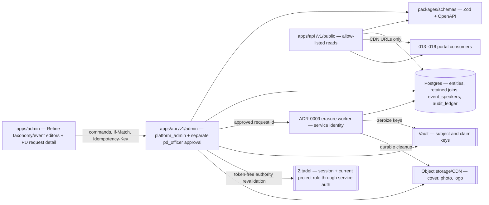
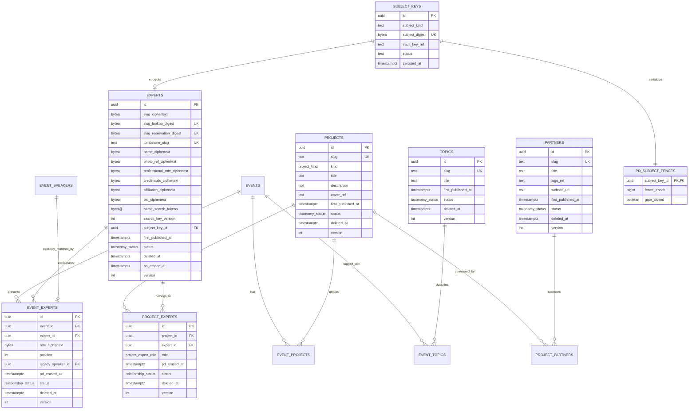
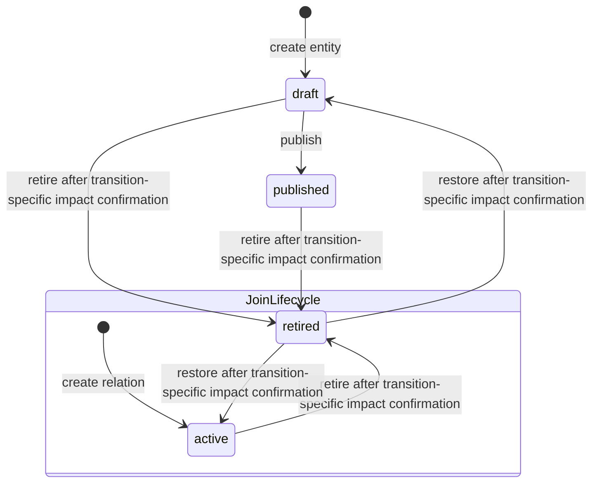
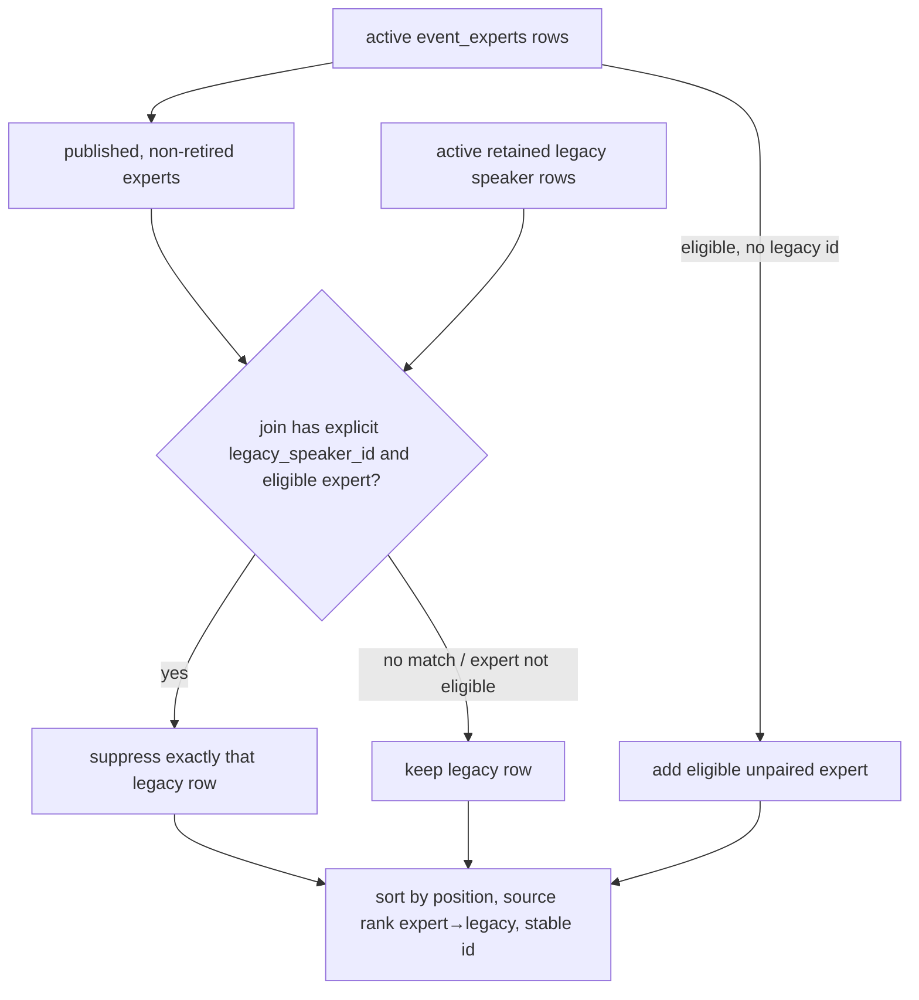

# 012 — Content taxonomy (Design)

## 1. Architecture

012 is one vertical spanning `packages/db` (retained schema + migrations), `packages/schemas` (Zod/OpenAPI SSOT), `apps/api` (admin commands and public reads), generated `@ds/api-client`, and `apps/admin` (Refine resources plus event/project relationship editors). It extends the 007 event aggregate; it does not add a second content store and renders no doctor-facing page.



Every domain mutation runs inside feature 010's audit-context transaction. No taxonomy-specific audit table or history viewer is introduced.

## 2. Data model



The omitted joins use the same envelope: UUID id, their two endpoint FKs, `active | retired`, `deleted_at`, `version`, `created_at`, `updated_at`; `project_partners` additionally has `is_primary boolean NOT NULL DEFAULT false`. Logical endpoint pairs are unique across active and ordinarily retained rows: a retired relation is restored, never reinserted. `cover_ref`, `logo_ref`, `website_url` and `first_published_at` are nullable; publish-required draft fields may remain null only until publication. The diagram names logical expert values through their encrypted physical columns: AES-256-GCM ciphertext lives in Postgres, lookup uses purpose-keyed digests, and the external Vault key is referenced only by ADR-0009's retained `subject_keys` row, never stored with the ciphertext. #1305's formal ADR-0009 amendment extends that table for editorial `expert | legacy_speaker` subject kinds and adds a one-to-one `pd_subject_fences` row containing only the concurrency gate/epoch; it does not create a second key SoT. `event_speakers.name/regalia`, `event_experts.role` and PD-bearing idempotency content follow the same rule. Only approved erasure may null the encrypted values/endpoints into the exact tombstone shapes below; it is not an authoring shortcut or a fourth taxonomy status.

### 2.1 Database constraints

- `taxonomy_status = draft | published | retired`; `relationship_status = active | retired`; `project_kind = school | media | program`; `project_expert_role = curator | member`.
- CHECK constraints bind lifecycle to deletion timestamp: top rows `(status = 'retired') = (deleted_at IS NOT NULL)`; joins and migrated speakers `(status = 'retired') = (deleted_at IS NOT NULL)`.
- Every FK is the default `NO ACTION` or explicit `RESTRICT`; no cascade appears in generated migration SQL.
- Unique `(project_id, expert_id)`, `(event_id, project_id)`, `(event_id, expert_id)`, `(project_id, partner_id)`, `(event_id, topic_id)` include retained rows while their endpoints are present. A partial unique index permits at most one active `project_experts(role='curator')` per project; another permits at most one active `project_partners(is_primary=true)` per project.
- Publishing a project additionally requires exactly one active curator whose expert is `published` and non-retired; drafts may be incomplete.
- Authored slugs match `[a-z0-9]+(?:-[a-z0-9]+)*`, but canonical UUID text is forbidden for every kind and the prefix `erased-` is reserved for expert tombstones. A request token that parses as a canonical UUID resolves only by `id`; every other token resolves only by the kind's slug lookup digest. `first_published_at` is set once by the first publish transaction, and a migration guard rejects clearing/changing it. Expert normal rows have non-null `slug_ciphertext` and `slug_lookup_digest`, null `tombstone_slug`; create/pre-publication change locks candidate lookup/reservation digests. Erasure locks the old reservation digest and deterministic `erased-<id>` candidate, nulls readable slug ciphertext/lookup, sets the non-authored `tombstone_slug`, and stores `slug_reservation_digest = HMAC-SHA-256(Vault expert-slug-reservation/v1, canonical old slug)`. This non-exportable purpose HMAC key is a permanent reservation verifier and is never zeroized while a reservation exists; infrastructure rotates only its Vault wrapping KEK, so stored digests remain verifiable without retaining/recovering the old slug. Unique indexes cover live lookup digests, reservation digests and tombstone slugs, so create-versus-erasure and id-versus-slug collisions are impossible.
- `experts.pd_erased_at IS NOT NULL` implies `status='retired'`, non-null `deleted_at`, `tombstone_slug='erased-' || id`, null `slug_ciphertext`, `slug_lookup_digest`, every identifying ciphertext, `photo_ref_ciphertext`, `name_search_tokens`, `search_key_version` and `subject_key_id`, plus non-null `slug_reservation_digest`; the UI/admin audit renderer supplies the fixed label `[erased]` rather than storing it as PD. A CHECK pins that exact physical tombstone. `event_speakers.name` and `event_speakers.regalia` retain those physical column names but migrate to nullable `bytea` ciphertext; an erased row has both plus `subject_key_id` null, never sentinel person text. Subject `event_experts` tombstones are retired with non-null `deleted_at/pd_erased_at`, null `expert_id`, `legacy_speaker_id` and `role_ciphertext`, while retaining event id/position; `project_experts` tombstones are retired with non-null `deleted_at/pd_erased_at`, null `expert_id` and fixed `role='member'`, while retaining project id. Restore predicates require `pd_erased_at IS NULL`; erased rows return 409 `PD_ERASED` without changing versions/tombstones.
- #1278 replaces the old `event_speakers(event_id, position)` primary key with UUID `id` as row identity, retains an explicit `UNIQUE(event_id, id)` for the composite reference, and adds partial active-slot `UNIQUE(event_id, position) WHERE status='active'`; retained and replacement rows may therefore share a position but two active rows may not. It changes the existing physical `name`/`regalia` columns from plaintext to nullable subject-key ciphertext and adds nullable `subject_key_id`/`pd_erased_at`; non-null `pd_erased_at` implies `status='retired'`, non-null `deleted_at`, null ciphertext/key reference under a CHECK, and every ordinary restore/update predicate requires `pd_erased_at IS NULL`. Keeping the column names makes the exact SQL/TS audit mask `event_speakers.name/regalia` cover both historical keys and every future diff. `event_experts.legacy_speaker_id` is nullable and unique, and its executable FK is `event_experts(event_id, legacy_speaker_id) REFERENCES event_speakers(event_id, id) ON DELETE RESTRICT`. A PK/UNIQUE on `event_speakers.id` alone is not treated as sufficient for this composite reference.
- `version` starts at 1 and is incremented atomically by every successful update or lifecycle command.

### 2.2 Authoring fields and validation

The Zod schemas in `packages/schemas` encode the requirements matrix directly: project title 1–160, kind enum and description 1–2000; expert name 1–160 raw Unicode scalars and no more than 160 after the search normalization from §2.2, professional role 1–160, credentials 1–500, affiliation 1–240 and bio 1–4000; topic title 1–120; partner title 1–160 and optional absolute HTTPS website up to 2048. Display labels are required on create; the other required public fields may be null only on a draft. PATCH omission means unchanged, while explicit null is accepted only for optional fields or an incomplete draft field. Updates to a published row re-run the publish contract.

If create omits `slug`, the service generates it with one shared canonical lowercase-ASCII transliteration/slugification function that the admin preview also imports. A conflict with any retained slug of the same kind is 409 `SLUG_CONFLICT`; the service does not silently choose a different public identity. PATCH predicates slug updates on `first_published_at IS NULL`; otherwise it returns 409 `SLUG_IMMUTABLE`. First publish sets `first_published_at` and status atomically.

Media schemas accept one still JPEG, PNG or WebP at most 10 MiB, with post-orientation width/height at most 6000 px and at most 25 million aggregate decoded pixels. The streaming header/parser rejects APNG, animated WebP, any page/frame count other than one, oversized dimensions or aggregate decode budget before allocating all frames or uploading. The shared normalizer introduced by #1283 applies orientation, converts to sRGB, then deterministically re-encodes the single frame to canonical WebP using the repository-pinned codec build, quality/lossless/alpha/chroma options and `media_profile_version`; that version and the exact option set enter the request fingerprint. It strips EXIF/XMP/GPS/ICC/original filename and every ancillary block, derives MIME from canonical output bytes, and persists only those bytes under a server-generated key. Original bytes/name exist only in bounded request processing. #1284 photos and #1286 logos consume the same component/fixtures byte-for-byte. Expert photo absence yields deterministic initials from the normalized name; admin checks are only preflight and API normalization is authoritative.

Input-mask declaration is `none` for every 012 field: each value is editorial text, a separately validated slug/URL/integer, or a file—not a fixed-format identifier—so a mask would fabricate or rewrite content rather than assist entry. Refine uses plain text/textarea controls with trim and character counters. Slug has generated preview plus pattern/length feedback, partner website uses a URL input, `event_experts.position` is integer step 1 from 0 through 32767, and its role is trimmed 1–80. Field validation is 400 `VALIDATION_FAILED`; a valid-shaped mutation that would leave a published projection incomplete is 409 `PUBLISH_REQUIREMENTS_NOT_MET` with field-addressed errors.

Case-insensitive expert-name search never decrypts or scans the full roster. Before persistence or tokenization, the server applies NFKC, full Unicode case-folding and whitespace normalization and rejects a normalized sequence longer than 160 Unicode scalars with field-addressed 400 `VALIDATION_FAILED`; the raw display-name limit remains 160 scalars as well. Physical `experts.name_search_tokens` is `bytea[] NOT NULL DEFAULT '{}'::bytea[]`: a sorted, duplicate-free array of 32-byte HMAC-SHA-256 digests for every contiguous 1–3 normalized Unicode-scalar gram under a non-exportable versioned Vault search key. The post-normalization 160-scalar limit yields at most 477 tokens; CHECKs reject null elements, non-32-byte elements and larger arrays. `experts_name_search_tokens_gin` is `USING gin (name_search_tokens array_ops)`, and candidate selection is `name_search_tokens @> <all normalized query grams>::bytea[]` plus `search_key_version = <active>`; bounded batch decryption under subject keys then performs the exact contains-match/order before cursor/page counts. On approved subject erasure, #1306 clears that subject's array immediately, rebuilds every non-erased expert into a shadow token version, atomically flips the active version, then destroys the old search key before completion. Thus old snapshot/WAL tokens cannot be tested after erasure, while admin search remains indexed rather than full-catalog loading; 016 later consumes the same physical contract in its own runtime. These tokens/key version are PD-masked audit columns.

### 2.3 Existing-row conformance prerequisite (#1278)

The current 007 table is position-keyed and its editor replaces rows with delete-then-insert. GitHub [#1278](https://github.com/doctor-school/ds-platform/issues/1278) is the critical-path retained-row runtime prerequisite that owns conformance of current tables: stable retained `event_speakers`, idempotency rows and removal of existing cascade/delete paths. It starts affected speaker writes only after #1305's future mask and historical-remediation gate. 012 does not duplicate that migration. Before any 012 entity implementation, #1278 must provide:

1. add/backfill stable UUID `id`, make it the row identity replacing the old `(event_id, position)` primary key, add `status: active | retired`, `deleted_at`, nullable `pd_erased_at`, `version` and timestamps, pin the exact erased-speaker CHECK, and add explicit `UNIQUE (event_id, id)` for 012's same-event composite FK;
2. enforce the active authoring order with partial `UNIQUE (event_id, position) WHERE status='active'`, allowing a retired predecessor and active replacement at the same position;
3. replace the event FK cascade with `NO ACTION`/`RESTRICT`;
4. change the 007 DTO/editor reconciliation to carry row ids and retire/restore ordinary removed rows instead of deleting them, while rejecting restore or payload repopulation when `pd_erased_at IS NOT NULL` with 409 `PD_ERASED`;
5. attach feature 010's audit trigger and coverage entry;
6. make every legacy-speaker reconciliation lock the parent `events` row before reading or mutating child rows, then revalidate active `(event_id, position)` slots under that lock so 012 can share the same per-event serialization boundary; and
7. implement the generic globally reserved UUID idempotency claim plus `pd_subject_fences`: claim content is encrypted under a claim DEK, every known subject digest/epoch is reserved before upload or handler entry, completion checks lease and subject epochs, and media authorization cannot outlive its request lease plus the cleanup quiescence rule in §6.

The #1278 backfill changes no speaker text, ordering or current projection. 012 consumes the resulting stable `event_speakers.id`; creating an `event_experts` match never updates the matched row's name, regalia, status or `deleted_at`. If #1278 is not merged, EARS-7/8 are blocked—no positional-FK workaround is permitted.

### 2.4 Expert PD classification prerequisite (#1305)

ADR-0009 makes the retention matrix a pre-migration gate. [#1305](https://github.com/doctor-school/ds-platform/issues/1305) is the policy/schema-readiness prerequisite only: fresh explicit Product Lead and Legal/Compliance sign-off records lawful basis, exact term, owner, legal-hold handling, retained tombstone and key-erasure mechanism; #1240's product approval and Mode (a) do not approve that policy. The inventory covers expert fields/media, `event_speakers.name/regalia` for mapped and explicitly identified legacy-only people, every `event_experts`/`project_experts` field/link, active claim content, object/CDN/API/HTML/card/search caches, logs/metrics and Postgres MVCC/WAL/offsite backups.

From the first affected write, logical PD is AES-256-GCM ciphertext under purpose-separated external Vault DEKs. Expert and each legacy-only subject have one retained ADR-0009 `subject_keys` row (`subject_kind`, purpose-keyed `subject_digest`, opaque `vault_key_ref`, lifecycle/zeroization evidence) plus one `pd_subject_fences` row keyed by that subject-key id; each idempotency claim has a separate DEK and references every affected subject key/fence. Postgres contains ciphertext and opaque external references, never a decrypting key. On acknowledged zeroization `subject_keys.status='zeroized'`, `vault_key_ref` is null and its retained evidence remains; the service-only outbox destruction handle is also cleared. The separately keyed expert-name search tokens are the only searchable derivative and follow §2.2's rotate/rebuild/destroy contract. Expert publication and erasure-request acceptance stay disabled until #1305 inventories every pre-encryption DB/audit/snapshot/WAL/offsite copy, the approved expiry/purge record says those copies are gone, Vault destroys any remediation key, and a restore drill plus unique-marker scan proves plaintext cannot be recovered. This is the backup acknowledgement used by the 30-day erasure SLA, not an assumption that UPDATE reaches backups.

Before another affected write, #1305 adds exact future masks/encryption classification to both SQL `audit_pd_columns()` and TypeScript `AUDIT_PD_COLUMNS`. The physical list is `experts.slug_ciphertext/slug_lookup_digest/slug_reservation_digest/name_ciphertext/photo_ref_ciphertext/professional_role_ciphertext/credentials_ciphertext/affiliation_ciphertext/bio_ciphertext/name_search_tokens/subject_key_id`, `event_speakers.name/regalia/subject_key_id`, `event_experts.expert_id/legacy_speaker_id/role_ciphertext`, `project_experts.expert_id/role`, and `subject_keys.subject_kind/subject_digest/vault_key_ref`.

Historical `data.event_speakers.*` plaintext cannot be called remediated by an ordinary UPDATE, DELETE, compensating event or access-control view. Because ADR-0009 and feature 010 are running decisions, #1305 must add formal production amendment blocks to ADR-0009 EN/RU/design and feature 010 requirements/design/scenarios before admitting one exact monotonic redaction transition. Those amendments correct the normative integrity model to the as-built v1 ledger: the enforcement trigger is append-only and there is no hash chain yet. A future chain bootstraps from the post-remediation ledger bytes plus immutable redaction-evidence root; it never asserts a fictitious pre-remediation chain. If chain columns exist when remediation runs, the migration refuses unless that amendment's signed old-root→new-root bridge and suffix re-seal protocol is available.

The retained `audit_pd_remediation_manifests` contains only target ledger PK/JSON pointer, opaque retention-key/commitment references, legal basis, finite term and owner—never plaintext or a bare plaintext hash. For each approved leaf, a Vault-held per-row audit-retention DEK encrypts the canonical old value into retained `audit_legacy_pd_ciphertexts`; an HKDF-separated commitment subkey produces `HMAC-SHA-256(ledger PK || JSON pointer || canonical old value)`. Postgres stores the keyed commitment but never its verification key, so the value is not an offline dictionary oracle. One SECURITY DEFINER function under a dedicated migration role may replace only that manifest-bound plaintext leaf with `{ masked: true, legacyCiphertextRef, commitmentRef }`, leave ledger identity/event fields/non-PD diff/timestamps and every unlisted byte unchanged, append one immutable `audit_pd_redaction_evidence` row containing only manifest/target ids, keyed commitment, ciphertext/envelope hashes, signer/key version and an external signature over the old→new attestation, then consume the manifest in the same transaction. The enforcement trigger permits only that fixed transition; ordinary UPDATE/DELETE, trigger disable, raw DBA rewrite, plaintext compensating rows and replay stay forbidden. `audit_pd_remediation_manifests`, `audit_legacy_pd_ciphertexts`, `audit_retention_keys` and `audit_pd_redaction_evidence` each have an explicit retained lifecycle and SQL/TS PD-field classification before creation. At the approved term—or immediately when no exception applies—Vault destroys both the DEK and commitment subkey and the live key reference is cleared; retained ciphertext, keyed commitment and ciphertext/envelope hashes can no longer reveal or test the old value. Future ledger rows contain only `{ masked: true }`. Marker, manifest-completeness, signature and restore tests must prove no unclassified plaintext before affected writes or publication.

ADR-0009's compliance queue—not a taxonomy route—owns `review_required → approved → executing → completed`. #1305 must add formal production amendment blocks to ADR-0009 EN/RU/design so an editorial expert or legacy-speaker request always enters `review_required` and is never eligible for the generic automated `pending → approved` branch; other subject classes remain outside 012. With a dedicated admin session, current `pd_officer`, CSRF, live authority revalidation and MFA elevation no older than 30 minutes, `ApproveEditorialErasurePlan(erasureRequestId, curatorResolutions)` locks an unexpired `review_required` request, proves no legal hold, binds its exact subject kind/id digest, reviewer/time, `plan_expires_at = approved_at + 24 hours`, all server-derived current mapped legacy rows and every affected join/project/event version. For each published sole-curator project the plan requires exactly one replacement expert who is distinct from the erasure subject and currently published/non-retired, or project retirement. An unmapped-legacy request binds one stable `event_speakers.id`; a currently/retained mapped row is not eligible for that path. The approval atomically stores this immutable plan, moves once to `approved`, and enqueues only the request id. Wrong role/elevation, cross-subject id, stale/extra/missing/ineligible resolution, expired/already-used request or legal hold produces the exact §5.3 refusal with no plan/job/domain change.

[#1306](https://github.com/doctor-school/ds-platform/issues/1306), deliberately sequenced after real `project_experts`, `event_experts` and publication handlers, owns internal `ExecuteApprovedEditorialErasure(erasureRequestId)`. The worker has no human bearer/session or caller-supplied subject list. Hold creation/clear, approval and worker entry share one subject-policy advisory lock; under it the worker locks the request and current hold rows, re-reads the hold, then checks expiry before it may consume `approved → executing`. A current hold has precedence: one transaction returns the request to `review_required`, records `hold_detected_at` plus retained `hold_evidence_id`, preserves the immutable plan, completes that queue delivery as terminal no-op 409 `LEGAL_HOLD_ACTIVE`, and changes no subject gate/domain/claim/audit/key/cleanup state. If no hold exists but `clock_timestamp() >= plan_expires_at`, the same no-side-effect pattern records `approval_expired_at` and yields 409 `ERASURE_PLAN_EXPIRED`. A later approval after the hold clears or the plan expires must derive a fresh plan. If worker entry wins the shared serialization boundary and atomically sets `executing`, a concurrent hold write linearizes afterward rather than ambiguously between validation and consumption; the former plan deadline does not cancel in-flight erasure. The worker then locks subject/replacement experts, projects, events and child rows in expert→project→event order, re-derives the all-and-only current subject set, and requires exact equality with the approved plan; omission, unrelated addition, a mapped row sent through the legacy-only path or a changed dependency returns the request to `review_required` with `ERASURE_SCOPE_STALE` and zero erasure mutation. It closes every subject gate and increments fence epochs before finding/expiring both processing and completed claims; a concurrently acquired claim must reserve the pre-closed gate and cannot start, and a paused owner fails its subject-epoch completion fence.

One database transaction resolves every sole-curator project by demote-first replacement or project retirement, writes the exact expert/speaker/join tombstones from §2.1, clears live subject endpoint FKs/free text/search tokens and matching claim content, and records durable service-only outbox obligations for every subject/claim Vault-key destruction plus media/cache/index cleanup. Failure to persist any obligation rolls back the tombstones; no external provider call is presented as atomic with PostgreSQL, and key destruction never starts before this commit. It never physically deletes a Postgres row.

`pd_key_destruction_jobs` is the shared retained outbox used by #1278 claim expiry and #1306 subject erasure. It has stable UUID id, `status: active | expired`, `execution_state: pending | processing | completed`, nullable `deleted_at`, closed key-purpose and owner-kind enums, temporary owner id plus opaque Vault key handle, monotonic fenced `lease_epoch`, bounded lease/attempt/error fields and timestamps. A worker invokes irreversible destroy only after acquiring the current epoch; a crash after Vault destroy but before DB acknowledgement is safe because retry treats “already destroyed” as success. Fenced completion sets `expired/completed` + `deleted_at`, clears the Vault handle, owner id, lease/error content and retains only job id, key purpose, outcome and timestamps. The row is never deleted or reactivated and is the explicit feature-010 technical exclusion named in §6.

After that commit, idempotent outbox workers zeroize every subject/claim DEK and collect the remaining external acknowledgements: object-version/derivative deletion, CDN purge, API/HTML/card/search invalidation, §2.2 search-token rekey/old-key destruction and log/metric red-team scans. The request stays `executing` through Vault/storage/cache outages; an opaque destruction/cleanup handle remains service-only until its provider acknowledgement, then is cleared. Only after every acknowledgement proves old current/MVCC/WAL/backup ciphertext unreadable and every projection absent does the request become `completed` within the approved term. Replayed jobs observe the same request/outbox states and never re-execute a domain mutation; old public URLs resolve as ordinary unknown/ineligible.

## 3. Lifecycles



Retiring a top-level entity leaves every join unchanged. Public traversal filters the endpoint and therefore hides it; restoring the entity to `draft` still does not publish it. Republish is deliberate. Retiring a join affects only that relationship. A restore reuses the same row/id and fails with 412 if the caller's version is stale. Two narrow refusal overlays exist: the published-project curator invariant below blocks an invalidating mutation, while an expert or migrated legacy speaker with `pd_erased_at` returns 409 `PD_ERASED` on restore/repopulation because legal erasure is intentionally irreversible. Neither overlay physically deletes a row.

### 3.1 Lifecycle-impact preview

```mermaid
sequenceDiagram
  participant O as Operator
  participant A as Refine admin
  participant API as apps/api
  participant DB as Postgres
  O->>A: choose Retire or Restore
  A->>API: GET .../:id/lifecycle-impact?transition=retire|restore
  API->>DB: read target + all incident relations and opposite-endpoint eligibility inputs
  API-->>A: LifecycleImpact(transition, version, affected ids, signed impactToken)
  A-->>O: confirmation dialog (no Delete wording)
  O->>A: confirm
  A->>API: POST .../:id/{retire|restore} + If-Match + Lifecycle-Impact-Token + Idempotency-Key
  API->>DB: SERIALIZABLE recompute + token/version check; apply one lifecycle transition + version++
  DB-->>API: row + feature-010 audit record
  API-->>A: updated detail + ETag
```

`impactToken` is an opaque server-signed envelope binding transition, target kind/id/version, issued-at and a 15-minute expiry to a canonical fingerprint of every retained incident relation and every opposite endpoint input that determines current public eligibility. The fingerprint is over sorted tuples of table/kind, stable id, monotonic version where present, lifecycle state and the exact event-public-eligibility inputs; it therefore covers inactive relations and non-public endpoints that could become visible, without returning their hidden content to the client.

The signed envelope also binds the requested transition, so a retire preview cannot authorize restore or vice versa. Confirmation requires both the target `If-Match` and `Lifecycle-Impact-Token`. It runs at PostgreSQL `SERIALIZABLE` and acquires the target plus dependencies in the applicable LD-2/LD-4 canonical order—not target-first for relation commands. It optimistically discovers the set before locking, aborts with 412 and restarts from a new preview if that set changes, then verifies signature/expiry and recomputes transition/target identity/version/fingerprint before changing lifecycle. A changed target, inserted/restored/retired incident relation, changed opposite-endpoint eligibility, tampered/expired token, wrong transition/target or serialization abort returns 412 `LIFECYCLE_IMPACT_STALE` with zero domain/media/audit mutation; the service never auto-retries it, and the UI must reload impact before asking again. A missing token is 428 `LIFECYCLE_IMPACT_REQUIRED`. Thus both changes committed between preview and confirmation and phantoms overlapping the confirmation transaction are covered for retire and restore; an entity restore may truthfully show an empty affected list because it returns to `draft`, while a join restore previews public relations it would add immediately.

### 3.2 Published-project curator invariant

Every committed `published` project has exactly one active curator whose expert is `published` and non-retired. The partial unique index enforces the upper bound; publish, curator mutation and expert lifecycle services enforce the lower bound and eligibility through one shared lock protocol. Every affected expert row is locked first in stable-id order, then every affected project row in stable-id order, then `project_experts` rows. State and relations are re-read only after those locks. Directly retiring the curator expert, retiring the sole curator relation or changing its role to `member` returns 409 `PUBLISHED_PROJECT_REQUIRES_CURATOR` without any row, version, media or audit mutation.

`ReplaceProjectCurator(projectId, expertId)` is the only curator-change path while the project is published. With the project's `If-Match`, one transaction identifies the current and candidate expert ids, locks both experts in stable-id order, locks the project and relation rows, re-reads them, verifies that the replacement expert is still published/non-retired, demotes the former curator row to `member`, then creates/restores/promotes the candidate row, increments both affected relation versions and the project version, and writes the ordinary feature-010 audit rows. The demote-first order is required because PostgreSQL's partial unique index on the active curator is immediate, not deferrable; if candidate promotion fails, rollback restores the former curator and its version/audit state. Project publication optimistically identifies its curator, locks that expert before the project, and post-lock revalidates; if the curator set changed it returns 412/restarts from a fresh request rather than discovering and locking another expert after the project lock.

An expert lifecycle mutation locks the expert first, then re-queries all active curator relations, locks their project rows in stable-id order and revalidates them before changing expert state. Every `project_experts` mutation participates in the same order, so a relation inserted while retirement is discovering dependencies either commits before the expert lock and is seen on re-read, or waits and then rejects the retired endpoint. Under replacement-versus-candidate-retirement, exactly one operation can commit: the loser revalidates to 409 `PUBLISHED_PROJECT_REQUIRES_CURATOR`; under concurrent replacements, the stale project version returns 412. Retiring the project itself is allowed and leaves joins untouched; restore yields `draft`, and a later publish revalidates curator eligibility.

As defense in depth, public project reads repeat the eligibility predicate and fail closed: an inconsistent imported or manually corrupted `published` project is omitted/404 and emits an operational error rather than leaking an invalid public projection.

## 4. Legacy speaker merge

The public projection is a query policy, not a migration job.



Names are never compared. A draft or retired expert cannot suppress the fallback. Retiring the join makes the fallback visible again; restoring it suppresses the same stable legacy row again. The total order is `position ASC`, source rank (`expert` before `legacy`), stable row id ASC (LD-2). The public page/endpoint item is the exact §5.2 discriminated union: legacy carries only `source, name, credentials`; expert carries `source, expertId, expertSlug, name, credentials, photoUrl, role`, with nullable `photoUrl`. Internal storage keys and retained-row state are absent.

Position conflicts are rejected at write time: the active current projection must have one deterministic slot per visible row. A mapped expert may take the matched legacy row's position because that row is suppressed; an unpaired expert must use an unoccupied position. Every 012 `event_experts` create/update/retire/restore first locks every old/new affected expert row in stable-id order, then locks the parent `events` row, re-reads expert lifecycle and both child tables, and only then mutates/recomputes the would-be visible projection. Every 007 `event_speakers` reconciliation locks the same parent event before reading or mutating either child table. This preserves the global expert→project→event order while allowing a legacy-only write to begin at the event boundary.

Expert publish/retire also changes speaker visibility: publish can reveal an unpaired expert or suppress a matched fallback, while retire can reveal that fallback. The lifecycle transaction therefore locks the expert first, discovers and locks every linked parent event in stable-id order (after any curator project locks from §3.2, before child rows), re-reads all `event_experts`/`event_speakers` rows and validates every affected projection before changing expert status. A concurrent `event_experts` mutation must acquire that same expert lock before its event lock: if the relation commits first, lifecycle discovers and revalidates it; if lifecycle commits first, the relation re-reads the new expert state and revalidates before writing. Within-table partial uniqueness remains a DB backstop; any would-be cross-table collision returns 409 `SPEAKER_POSITION_OCCUPIED`. Legacy-row, expert-link and linked-expert lifecycle writes therefore serialize for the same event, while different experts/events remain independent unless they share an affected lock.

## 5. HTTP surface

### 5.1 Admin entities and relationships

For each entity resource `{projects|experts|topics|partners}`:

| Method/path                                                                | Purpose                                                                  |
| -------------------------------------------------------------------------- | ------------------------------------------------------------------------ |
| `GET /v1/admin/<resource>?page&pageSize&q&status&includeRetired`           | Refine list; offset/page + total; defaults exclude retired.              |
| `POST /v1/admin/<resource>`                                                | Create draft; UUID `Idempotency-Key`, no `If-Match`.                     |
| `GET /v1/admin/<resource>/:id`                                             | Detail by stable id, including retired rows.                             |
| `PATCH /v1/admin/<resource>/:id`                                           | Edit same row; target `If-Match`.                                        |
| `POST /v1/admin/<resource>/:id/publish`                                    | Draft → published; target `If-Match`.                                    |
| `GET /v1/admin/<resource>/:id/lifecycle-impact?transition=retire\|restore` | Preview transition consequences plus signed `impactToken`.               |
| `POST /v1/admin/<resource>/:id/retire`                                     | Target `If-Match` + matching `Lifecycle-Impact-Token`.                   |
| `POST /v1/admin/<resource>/:id/restore`                                    | Target `If-Match` + matching `Lifecycle-Impact-Token`; retained → draft. |

Projects additionally expose `POST /v1/admin/projects/:id/replace-curator` with `{ expertId }`, project `If-Match` and `Idempotency-Key`; this is the atomic command from §3.2.

There is no expert/speaker erase endpoint in the taxonomy controller or Refine resource. The separate ADR-0009 queue exposes `POST /v1/admin/pd-erasure-requests/:id/approve` with only `{ curatorResolutions: { projectId: uuid, replacementExpertId?: uuid, retireProject?: true }[] }`; subject ids and legacy-speaker ids come from the locked request and server-derived plan, never the body. It requires the compliance authority in §5.3 and atomically returns 202 `{ requestId, status: "approved" }` only from `review_required`; the internal queue payload is exactly `{ erasureRequestId }`. Reject/review flows stay owned by ADR-0009. There is no `If-Match` or caller `Idempotency-Key` on execution: request-state locking and unique job id make the approved request one-use.

The corresponding Refine `PD requests` detail is the only human approval surface; a manual curl/admin script is not an accepted seam. It shows the locked request status, legal-hold verdict, server-derived affected expert/legacy/event/project summaries and one required resolution control for each sole-curator project, but never accepts a free-form subject or speaker id. The approve action is absent/disabled without current `pd_officer` plus fresh step-up and submits only those curator resolutions. `approved/executing/completed` are read-only, stale scope reloads the server plan, and ordinary taxonomy entity pages continue to show only Retire/Restore—not Erase/Delete.

For `{event-projects|event-experts|project-experts|project-partners|event-topics}`, the same retained command pattern is exposed at `/v1/admin/<join>`: filtered list; POST create with no `If-Match`; PATCH attributes with the join ETag; GET transition-specific lifecycle impact; POST retire/restore with the join ETag and lifecycle token. There is no DELETE route. The Refine provider maps `deleteOne` to an unsupported operation rather than an HTTP call.

Request content types are exact:

- Topics and every request without a binary use `application/json`.
- A project/expert/partner create or PATCH with a binary uses `multipart/form-data` containing exactly one `payload` part with `Content-Type: application/json` plus at most one kind-specific file part named `cover`, `photo` or `logo`. Multipart without a file is rejected as 415 `UNSUPPORTED_MEDIA_TYPE`; JSON is the canonical no-file shape.
- Client JSON never exposes or accepts `coverRef`, `photoRef`, `logoRef`, an object key or an arbitrary storage URL; strict-schema input of one is 400 `VALIDATION_FAILED`. Create omission yields no media. PATCH omission keeps the current reference; JSON PATCH `mediaAction: "clear"` clears the optional media. `mediaAction` is not accepted on create.
- A multipart file means set/replace. Supplying a file together with `mediaAction: "clear"`, multiple files or the wrong kind-specific part returns 400 `MEDIA_INPUT_CONFLICT` before upload. Every valid project/expert/partner file then crosses the shared #1283 decoder/normalizer from §2.2 before storage. A replacement always uses a fresh deterministic idempotency-claim-scoped object key and never overwrites a referenced object in place.

Media idempotency uses raw-distinct semantics. Before normalization, the provisional fingerprint binds normalized concrete target path/route parameters, canonical JSON, raw source SHA-256 and byte length, `media_profile_version` and every semantic conditional header. Byte-different uploads are different semantic inputs and return 409 `IDEMPOTENCY_KEY_REUSED` under the same key even when they would normalize to identical canonical output. Only an exact provisional-input retry may normalize or take over; the final binding additionally records canonical output SHA-256 for object verification and replay, never to collapse distinct raw requests.

The failure order follows the existing feature-007 storage policy. Dedicated-session/MFA/CSRF and #1304 live-authority revalidation happen before request/key validation; canonical UUID-key validation happens before claim ownership, normalization or upload. An object-storage PUT failure returns 503 `MEDIA_STORAGE_UNAVAILABLE`, completes that idempotency outcome for replay and makes no taxonomy/speaker-domain or audit mutation. After a successful claim-scoped upload, the DB transaction rechecks method-specific preconditions, swaps or clears the reference, writes domain audit and completes the idempotency response atomically. A refused/failed transaction's newly uploaded unreferenced object stays discoverable through §6's claim cleanup. A committed replace/clear additionally inserts a retained `media_cleanup_jobs` row for the old referenced key in the same transaction as the ref change; this is a distinct handle because the idempotency claim describes only the new upload.

`media_cleanup_jobs` is a constrained technical table with stable UUID `id`, `status: active | expired`, `execution_state: pending | processing | completed`, nullable `deleted_at`, cleanup kind, entity kind/id and media slot, server-generated object/CDN keys, monotonic `lease_epoch`, bounded lease owner/expiry, enum-only last error, attempt count and timestamps. The ref-swap transaction creates one `active/pending` job; a worker CAS-acquires a newer epoch, rechecks every current media reference, deletes all object versions/derivatives, purges or invalidates the CDN key, and retries/alerts until both providers acknowledge absence. Completion under the matching owner+epoch sets `expired/completed`, `deleted_at` and `completed_at`, clears raw keys, entity id, lease and error content, and retains only job id, cleanup kind, outcome and timestamps. A zero-row fencing update cannot declare cleanup complete. No row is deleted/reactivated. Feature 010 continues to audit the domain ref mutation; the job table is an explicit technical-table audit exclusion with allowlist-parity tests, while #1305 classifies its active expert linkage and consumes completion acknowledgement. Best-effort immediate cleanup may reduce latency but never replaces this durable obligation.

### 5.2 Public reads

- `GET /v1/public/{projects|experts|topics|partners}` and `/:idOrSlug` return cursor-paginated base lists / one allow-listed projection. A canonical UUID token is id-only; any other token is slug-only. Full DTOs are exact: `PublicProject { id, slug, kind, title, description, coverUrl, primaryPartner }`; `PublicExpert { id, slug, name, professionalRole, credentials, affiliation, bio, photoUrl, initials }`; `PublicTopic { id, slug, title }`; `PublicPartner { id, slug, title, logoUrl, websiteUrl }`. `primaryPartner` is `PublicPartnerSummary | null`; optional URLs are present and nullable.
- Relationship summaries are exact: `PublicEventSummary { id, slug, title, school, startsAt, state }`; `PublicProjectSummary { id, slug, kind, title, description, coverUrl, primaryPartner }`; `PublicExpertSummary { id, slug, name, professionalRole, credentials, affiliation, photoUrl }`; `PublicTopicSummary { id, slug, title }`; `PublicPartnerSummary { id, slug, title, logoUrl, websiteUrl }`. Optional URLs are present and nullable; no status, storage key, retained-row id or admin field is present.
- Nested route item DTOs are fixed rather than inferred from the opposite full entity:
  - `/events/:key/projects` → `PublicProjectSummary`; `/projects/:key/events` → `PublicEventSummary`;
  - `/events/:key/experts` → `PublicEventExpertItem = PublicExpertSummary + { role, position }`; `/experts/:key/events` → `PublicExpertEventItem = PublicEventSummary + { role, position }`;
  - `/projects/:key/experts` → `PublicProjectExpertItem = PublicExpertSummary + { role: curator | member }`; `/experts/:key/projects` → `PublicExpertProjectItem = PublicProjectSummary + { role: curator | member }`;
  - `/projects/:key/partners` → `PublicProjectPartnerItem = PublicPartnerSummary + { isPrimary }`; `/partners/:key/projects` → `PublicPartnerProjectItem = PublicProjectSummary + { isPrimary }`;
  - `/events/:key/topics` → `PublicTopicSummary`; `/topics/:key/events` → `PublicEventSummary`.
- The canonical merged page-speaker item is a strict discriminated union: legacy `{ source: "legacy", name, credentials }`; linked expert `{ source: "expert", expertId, expertSlug, name, credentials, photoUrl, role }`, with `photoUrl` present and nullable. No expert-only key appears on a legacy item. `GET /v1/public/events/:key/speakers` and shipped `PublicEventPage.speakers` return that exact ordered union. Shipped `UpcomingBroadcastCard.speakers` remains its exact thinner `{ name }` array, mapped from the same ordered resolver—not a second query or merge implementation.

Every growing base route accepts bounded `limit` and opaque `cursor`, returns ADR-0002's exact envelope `{ data, pagination: { nextCursor, hasMore } }`, and orders by a stable tuple ending in id; the speaker endpoint follows LD-2 order. Unknown/ineligible source is 404 `RESOURCE_NOT_FOUND`; an eligible source with no eligible relations is 200 with `data: []`, `nextCursor: null`, `hasMore: false`; inactive/ineligible children are filtered. Event traversals reuse the existing public-event policy. Base search/aggregate totals are deliberately absent: feature 015 must own one bounded-SQL project catalog/page read returning kind-specific content count, nullable primary partner and enriched team, and feature 016 one bounded-SQL expert catalog read accepting `q` plus one project filter and returning filtered/total counts. Those features may join/aggregate the same tables but may not issue one 012 relationship request/query per card.

### 5.3 Authorization and errors

Ordinary taxonomy admin routes inherit feature 011: only `__Host-ds_admin_session` with local fingerprint/MFA succeeds, state changes pass `x-ds-admin-csrf`, and #1304 calls token-free `IdpClient.revalidateAdminAuthority({ zitadelSessionId, sub, requiredRole })` with `requiredRole: 'platform_admin'` before request validation/idempotency/normalization/upload. Inactive/missing/mismatched provider session is 401 `ADMIN_SESSION_REQUIRED`; role loss is 403 `PLATFORM_ADMIN_REQUIRED`; transport/timeout/429/5xx/service-auth/config/malformed response is 503 `IDP_REVALIDATION_UNAVAILABLE` and leaves the local session intact. The ADR-0009 approval route uses the same call with `requiredRole: 'pd_officer'` plus `@Authz({ step_up: true })`; #1304 records a server-verified elevation no older than 30 minutes without retaining an IdP token. Missing/stale elevation is 401 `STEP_UP_REQUIRED` with `stepUpUrl`; current-role loss is 403 `PD_OFFICER_REQUIRED`. The worker accepts only its service identity and approved request id. Every pre-claim refusal has zero idempotency/domain/media/audit effect. Public routes are `public`, with no session variation. All DTOs live in `packages/schemas` and generate OpenAPI/client types.

| Status | Exact stable `errorCode`                                                                                                                                                                                                                                                                                                                                                                                                            |
| ------ | ----------------------------------------------------------------------------------------------------------------------------------------------------------------------------------------------------------------------------------------------------------------------------------------------------------------------------------------------------------------------------------------------------------------------------------- |
| 400    | `VALIDATION_FAILED`, `MEDIA_INVALID`, `MEDIA_INPUT_CONFLICT`, `CURSOR_INVALID`, `IDEMPOTENCY_KEY_INVALID`.                                                                                                                                                                                                                                                                                                                          |
| 401    | `ADMIN_SESSION_REQUIRED`; `STEP_UP_REQUIRED` with `stepUpUrl` for missing/stale erasure-approval elevation.                                                                                                                                                                                                                                                                                                                         |
| 403    | `PLATFORM_ADMIN_REQUIRED`; `PD_OFFICER_REQUIRED`.                                                                                                                                                                                                                                                                                                                                                                                   |
| 404    | `RESOURCE_NOT_FOUND` for unknown admin id or unknown/ineligible public source; `ERASURE_REQUEST_NOT_FOUND` on the compliance route.                                                                                                                                                                                                                                                                                                 |
| 409    | `RELATIONSHIP_CONFLICT`, `SLUG_CONFLICT`, `SLUG_IMMUTABLE`, `PUBLISH_REQUIREMENTS_NOT_MET`, `PUBLISHED_PROJECT_REQUIRES_CURATOR`, `INVALID_TRANSITION`, `LEGACY_SPEAKER_CONFLICT`, `SPEAKER_POSITION_OCCUPIED`, `PD_ERASED`, `IDEMPOTENCY_KEY_REUSED`, `IDEMPOTENCY_REQUEST_IN_PROGRESS`, `ERASURE_REQUEST_NOT_APPROVABLE`, `ERASURE_REQUEST_ALREADY_CONSUMED`, `ERASURE_PLAN_EXPIRED`, `ERASURE_SCOPE_STALE`, `LEGAL_HOLD_ACTIVE`. |
| 412    | `PRECONDITION_FAILED`; `LIFECYCLE_IMPACT_STALE` for invalid/wrong-transition/wrong-target/changed dependency token or overlapping serialization abort.                                                                                                                                                                                                                                                                              |
| 415    | `UNSUPPORTED_MEDIA_TYPE`.                                                                                                                                                                                                                                                                                                                                                                                                           |
| 428    | `IDEMPOTENCY_KEY_REQUIRED`, `PRECONDITION_REQUIRED`, `LIFECYCLE_IMPACT_REQUIRED`.                                                                                                                                                                                                                                                                                                                                                   |
| 503    | `MEDIA_STORAGE_UNAVAILABLE`, `IDP_REVALIDATION_UNAVAILABLE`; no taxonomy/speaker-domain or audit mutation.                                                                                                                                                                                                                                                                                                                          |

Every error is `application/problem+json` with RFC 7807 fields plus `errorCode` and `traceId`; no database key or hidden lifecycle state leaks.

## 6. Idempotency, concurrency and audit

- Every ordinary mutating taxonomy HTTP endpoint requires `Idempotency-Key` as lowercase canonical UUID text. Missing/blank is 428 `IDEMPOTENCY_KEY_REQUIRED`; malformed/non-canonical is 400 `IDEMPOTENCY_KEY_INVALID`, both before claim/upload/domain/audit. The first use inserts globally unique `key_digest = HMAC-SHA-256(Vault idempotency-key-reservation/v1, canonical UUID)`; this uniqueness spans actors, methods, routes and expiry. During the active window a purpose-keyed actor digest permits exact replay only to the original actor; another actor/route gets 409 `IDEMPOTENCY_KEY_REUSED`. Expiry clears actor/method/route content but permanently retains the global digest. Like the slug verifier, this non-exportable reservation HMAC key remains available for the lifetime of tombstones and only its Vault wrapping KEK rotates; it is distinct from disposable subject/claim DEKs.
- After auth/key/content-type gates and before claim acquisition, a multipart request streams its bounded file once through an in-process buffer solely to compute `raw_source_sha256` and byte length; no normalization, object PUT, domain work or audit occurs. The insert/CAS claim transaction atomically binds concrete path/query, canonical JSON, `If-Match`, `Lifecycle-Impact-Token`, raw digest/length and `media_profile_version`; JSON-only requests bind null raw-file fields. A crash before that transaction leaves no claim. A crash after it leaves an immutable provisional input: every retry must hash its supplied bytes first, and any changed raw bytes or non-file input returns 409 `IDEMPOTENCY_KEY_REUSED` before normalization/upload. Exact input may win a newer request epoch and normalize; final binding adds canonical normalized-media SHA-256. Thus even byte-different files that normalize identically are different requests, and no takeover can choose a new semantic fingerprint after a pre-normalization crash. Request/response/headers/fingerprint/upload digest and domain reference are AES-256-GCM ciphertext under a per-claim external Vault DEK; expiry/erasure clears the live content/reference and durably moves only a service-only destruction handle to the outbox until Vault acknowledges zeroization.
- Before normalization, upload or handler entry, claim acquisition derives every PD subject from the locked target; expert create first allocates its stable id/subject fence. In the same transaction it locks each `pd_subject_fences` row in stable `subject_key_id` order, refuses a closed gate, and inserts a retained `idempotency_claim_subjects` row with stable id, `claim_id`, nullable `subject_key_id`, `reserved_fence_epoch`, `status: active | expired` and nullable `deleted_at`; active rows require a non-null subject key and are unique on `(claim_id, subject_key_id)`, while expiry/erasure sets `expired` + `deleted_at` and clears that link. These rows exist while `execution_state=processing`, not only after a response. Every INSERT/takeover increments `lease_epoch`; a 20-second heartbeat extends the 60-second request lease only when owner+lease epoch and all subject epochs still match. Completion uses the same predicates. Thus erasure can close gates/advance epochs and enumerate processing plus completed claims, while a concurrent new claim either reserves first and is fenced by erasure or sees the closed gate and never starts.
- Request takeover and orphan cleanup are disjoint. A request retry re-hashes and compares the immutable provisional input before CAS-acquiring a newer request epoch, then verifies or produces the canonical normalized digest/object and resumes the command. Each PUT uses a provider-enforced capability scoped to that object/epoch with `notAfter <= lease_expires_at` and `If-None-Match: *`; no stale owner can obtain a later capability or overwrite an existing object. Cleanup never invokes the domain handler. It retains the deterministic locator plus `last_write_authorization_expires_at`, and cannot finalize absence or clear the locator until that time plus the provider's documented maximum in-flight-write duration and clock-skew grace. It then rechecks references/HEAD, deletes if needed, and repeats through that quiescence boundary until absence is acknowledged. A late old-owner PUT is therefore either rejected by capability/fence or visible to a later sweep. PUT failure is a fenced terminal 503 `MEDIA_STORAGE_UNAVAILABLE` with zero domain/audit mutation.
- Every deterministic post-claim result is fenced and terminal: exact status/body/allow-listed `ETag`/`Location` are stored for successful commands, 409 invariants and 412 refusals. Retire/restore target, token, dependency or serialization mismatch has precedence as 412 `LIFECYCLE_IMPACT_STALE`; a stale `If-Match` on PATCH/publish/replace-curator is 412 `PRECONDITION_FAILED`. Both complete/replay the refusal while changing no domain/media/audit state. Unclassified DB/provider timeout, disconnect or uncertain commit is not terminal: domain work rolls back/remains uncommitted and a newer owner reruns post-lock checks. Pre-claim auth/key/shape refusals create no claim.
- A successful domain transaction rechecks method-specific conditions, mutates taxonomy/speaker rows, writes feature-010 audit, stores the response and conditionally completes where claim status, request owner/epoch and every subject epoch still match. A zero-row fence rolls back all domain/audit/claim writes; only an immutable unreferenced object can remain for cleanup. POST create requires only the UUID key; PATCH/publish require target `If-Match`; replace-curator requires project `If-Match`; retire/restore require target `If-Match` plus lifecycle token. Missing conditions are 428. Erasure approval/execution instead use the one-use locked ADR-0009 request id described in §2.4, never this caller key.
- At 24 hours, one database transaction sets `expired` + `deleted_at`, closes replay and every upload capability, clears actor/request/response/header/fingerprint/digest/domain/subject ciphertext and live key references, and records a durable service-only claim-DEK destruction obligation independently of Vault or object-storage availability. No application path can decrypt/replay the claim after that commit. A retrying worker then obtains Vault's zeroization acknowledgement and clears the opaque destruction handle; only the global key digest, terminal enum/timestamps and non-content object-cleanup locator/state remain until the quiescent reconciler acknowledges absence, after which that locator is cleared too. The row is never deleted/reactivated/reused. Subject erasure performs the same DB clearing immediately for every matching processing/completed claim and does not complete until every key-destruction acknowledgement arrives. Claim cleanup remains distinct from §5.1 `media_cleanup_jobs`; §6's exact five-table technical allowlist covers both flows and their fences/outbox with explicit parity tests.
- Shared invariant protocols add pessimistic serialization where per-row ETags are insufficient: every `event_experts` mutation locks affected experts before its parent event, linked-expert lifecycle uses the same expert-first/event-next boundary, curator plus speaker eligibility follows expert-first/project-second/event-third locking, and lifecycle-fingerprint confirmation is `SERIALIZABLE`. All commands revalidate after acquiring their shared dependencies; invariant failures and serialization aborts write no domain audit row. Unique constraints remain the final race guard.
- Feature 010's `withAuditContext` and DB trigger wrap taxonomy entity, relationship, migrated speaker-domain and retained `subject_keys` mutations. Lifecycle actions produce ordinary attributed `data.<table>.update`; no duplicate writer is added. Before each affected table's first write, SQL `audit_pd_columns()` and TS `AUDIT_PD_COLUMNS` gain §2.4's exact physical expert/speaker/join/key list; future parity/no-plaintext tests include erasure UPDATEs, while the formal feature-010 amendment's manifest-bound one-way redaction and audit-retention-key expiry prove historical rows without disabling append-only enforcement. Only the constrained coordination tables `idempotency_keys`, `idempotency_claim_subjects`, `pd_subject_fences`, `pd_key_destruction_jobs` and `media_cleanup_jobs` are feature-010 technical exclusions, each named in both SQL/TS allowlists with parity and retained-lifecycle tests; no implicit “technical” exemption exists.

## 7. Refine admin composition

The admin owns four resource lists/details/forms plus relationship editors embedded in the existing 007 event form and the project detail. Tables show status, search, page controls and an explicit “include retired” filter; selectors exclude retired rows; detail routes can open them for restore. Lifecycle actions are Publish, Retire and Restore. Delete is absent from navigation, action menus, provider and API. Separately, #1306 adds §5.1's ADR-0009 `PD requests` detail/approval composition; it is a compliance queue, not an entity action, and has no caller-entered subject list.

EARS-18 Stage A is the first UI gate: before any entity, join or compliance-queue UI slice, run `build-ui-from-design-system`, inventory the existing Refine/event/ADR-0009 queue patterns and `@ds/design-system`, search the approved registry whitelist, present 2–3 concrete compositions, and record the product-owner choice. The queue options include server-derived scope, legal-hold/step-up states and curator-resolution controls after #1305's approved policy; they never introduce a Delete action. Stage B drives each chosen real UI on the live stand before merge. All copy uses the typed RU catalog; primitives own focus/hover/active/disabled/loading states.

Implementation WBS stays vertical and bounded. #1305 first fixes policy/masks/remediation without testing future tables; #1278 then delivers retained speaker rows, global claims, subject fences and bounded upload authorization. Project, encrypted expert, topic and partner retain separate schema→API→SDK→Refine→browser slices. `project_experts` and `event_experts` land next, followed by the real shared publication/public-projection handler; only then may #1306 implement and test the approved-plan worker against those real published states. The exact order is #1305 → #1278 → project → expert → topic → partner → `project_experts` → `event_experts` → publication → #1306 → remaining joins/projections. Each remaining EARS-6/8/10/11 slice stays bounded. No prerequisite asserts tests against a future table/handler, no “all taxonomy CRUD” issue is acceptable, and UI waits for EARS-18 Stage A. EARS-16/17 safeguards are acceptance criteria from each handler's first commit; their dedicated children only verify the assembled route set. The 012 parent is a hard pre-release gate: publication may merge so #1306 has a real dependency, but no partial 012 runtime is deployed before #1306 and the final sweep close.

## 8. Verification strategy

- **DB/migration:** all four entities/five joins satisfy lifecycle CHECKs, stable uniqueness/restrictive FKs, primary-partner uniqueness and set-once publication identity with disjoint slug namespaces; same-event speaker FK is executable; #1278 proves encrypted retained speakers, globally reserved claims, claim-time subject fences and quiescent upload cleanup; #1283 proves deterministic still-WebP fixtures and retained cleanup jobs. SQL↔TS PD/audit parity and restored-backup unique-marker scans prove no plaintext before expert publication.
- **API/worker e2e:** real Postgres/object storage/Vault fake with production-parity fencing; raw-input claim binding before exact JSON/multipart still-only canonical normalization, Unicode-normalization expansion refusal, durable cleanup, pd-officer/fresh-step-up one-use plan approval, post-approval legal-hold race and queued-plan expiry, all-and-only subject derivation, acquisition/pre-response claim races, curator resolution, DEK zeroization and external acknowledgements; publication/curator/speaker invariants; exact 012 base DTOs with no surface aggregates; lifecycle-token abuse and exact 412 replay; global UUID cross-actor/expiry behavior; bounded upload authorization and late-owner quiescence. Tests use `it('EARS-N: ...')`.
- **Browser:** Playwright BDD on the live Refine app creates all kinds, exercises counters/previews/URL/integer/file controls without masks, links event/project/expert/topic/partner, replaces a curator, maps a legacy speaker, verifies reject and accept branches, retires/restores, and proves no Delete/inline-topic creation. The separate compliance detail exercises scope reload, legal hold, step-up, curator resolutions, one-use approval and read-only executing/completed states without a manual API call. Axe, keyboard state, desktop/mobile and light/dark checks accompany the Stage-B owner verdict.
- **No stub acceptance:** browser and API tests operate on committed schemas/migrations and generated SDK types, not seeds standing in for authoring or relationship endpoints.

## 9. Dependencies and sequencing

1. Merge this accepted SDD artifact and open/wire its bounded EARS Issues.
2. Complete [#1305](https://github.com/doctor-school/ds-platform/issues/1305) as policy/schema readiness: explicit Product Lead + Legal/Compliance sign-off, key/tombstone contract, future masks, historical ledger/snapshot/WAL/backup remediation and restore proof. It must not require runtime tests for tables that have not landed.
3. Complete [#1278](https://github.com/doctor-school/ds-platform/issues/1278) before any new 012 entity handler: it owns encrypted retained `event_speakers`, parent-event locking, globally reserved claims, claim DEKs, claim-time subject fences and bounded upload authorization/cleanup.
4. Complete [#1304](https://github.com/doctor-school/ds-platform/issues/1304) before the first taxonomy mutation or erasure approval; it owns token-free `platform_admin`/`pd_officer` revalidation, fresh step-up and ADR-0001/011 alignment. #1283 then owns the deterministic still-only shared media component before any cover/photo/logo reaches storage.
5. Complete EARS-18 Stage A before any EARS-1…15 UI work.
6. Deliver project → encrypted expert → topic → partner → `project_experts` → `event_experts` → the real publication/public-projection handler; then complete [#1306](https://github.com/doctor-school/ds-platform/issues/1306)'s approved-plan worker before remaining projections, final protocol sweeps or any 012 release. Every handler includes EARS-16/17 safeguards from its first commit.
7. Only after the complete 012 parent closes may 013–016 consume base relationships; 015/016 then own their declared batched surface projections instead of N+1 composition.

The dependency is real, not a scaffold license: 012 keeps the observable legacy-speaker contract, but it must consume #1278's committed stable row identity and may not add a temporary positional mapping, hardcoded seed or duplicate migration.
