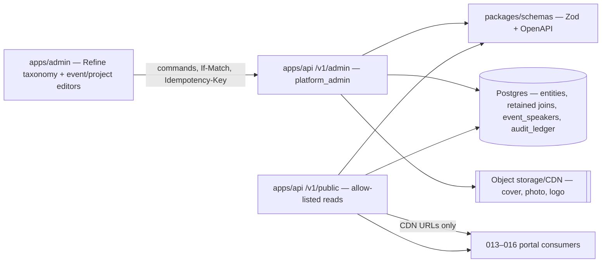
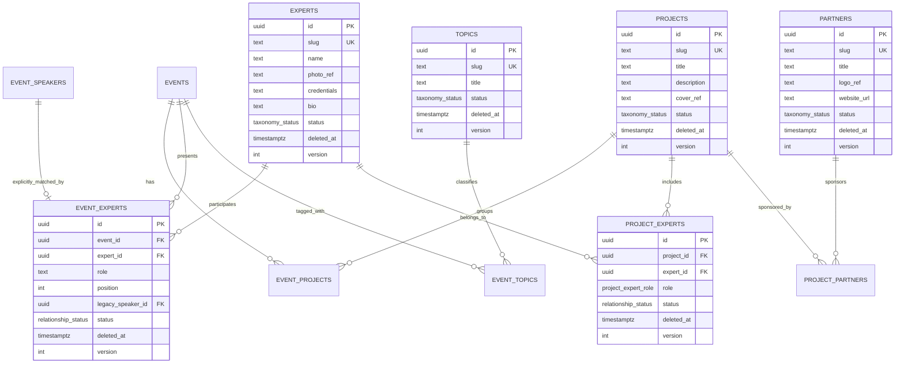
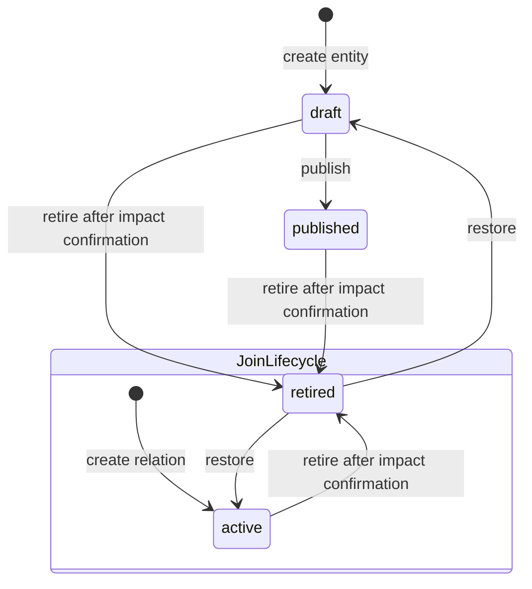
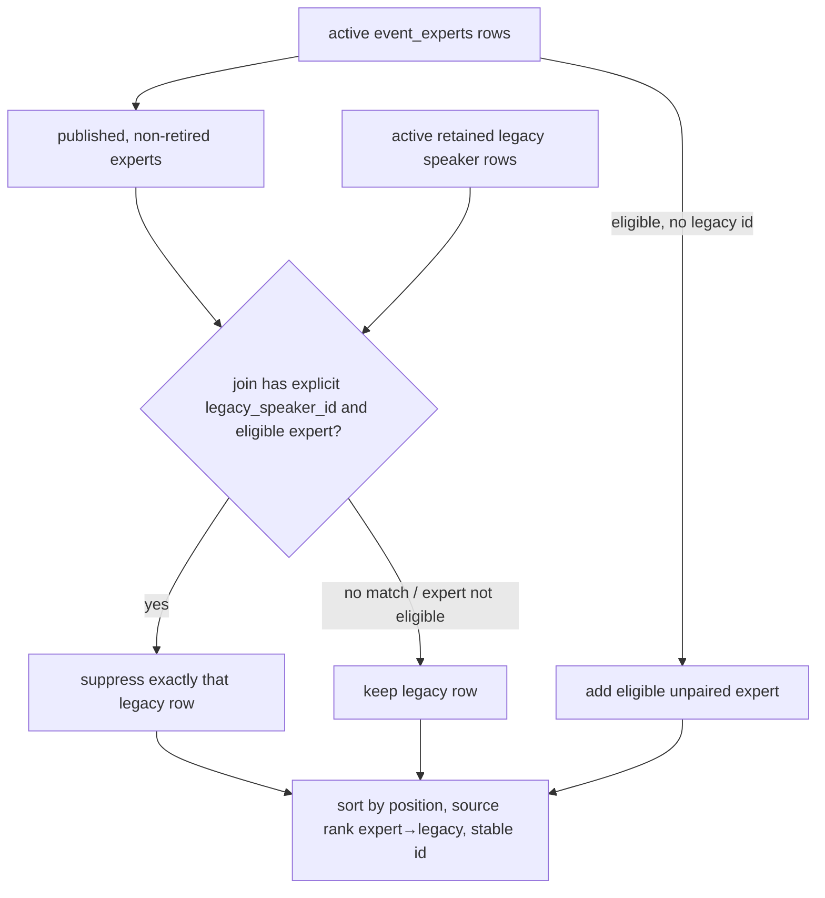

# 012 — Content taxonomy (Design)

## 1. Architecture

012 is one vertical spanning `packages/db` (retained schema + migrations), `packages/schemas` (Zod/OpenAPI SSOT), `apps/api` (admin commands and public reads), generated `@ds/api-client`, and `apps/admin` (Refine resources plus event/project relationship editors). It extends the 007 event aggregate; it does not add a second content store and renders no doctor-facing page.



Every domain mutation runs inside feature 010's audit-context transaction. No taxonomy-specific audit table or history viewer is introduced.

## 2. Data model



The omitted joins use the same envelope: UUID id, their two endpoint FKs, `active | retired`, `deleted_at`, `version`, `created_at`, `updated_at`. All logical endpoint pairs are unique across active and retained rows: a previously retired relation is restored, never reinserted under a new id.

### 2.1 Database constraints

- `taxonomy_status = draft | published | retired`; `relationship_status = active | retired`; `project_expert_role = curator | member`.
- CHECK constraints bind lifecycle to deletion timestamp: top rows `(status = 'retired') = (deleted_at IS NOT NULL)`; joins and migrated speakers `(status = 'retired') = (deleted_at IS NOT NULL)`.
- Every FK is the default `NO ACTION` or explicit `RESTRICT`; no cascade appears in generated migration SQL.
- Unique `(project_id, expert_id)`, `(event_id, project_id)`, `(event_id, expert_id)`, `(project_id, partner_id)`, `(event_id, topic_id)` include retained rows. A partial unique index permits at most one active `project_experts(role='curator')` per project.
- Publishing a project additionally requires exactly one active curator whose expert is `published` and non-retired; drafts may be incomplete.
- `event_experts.legacy_speaker_id` is nullable and unique. A composite FK/constraint over `(event_id, legacy_speaker_id)` proves that the legacy row belongs to the same event.
- `version` starts at 1 and is incremented atomically by every successful update or lifecycle command.

### 2.2 Existing-row conformance prerequisite (#1278)

The current 007 table is position-keyed and its editor replaces rows with delete-then-insert. GitHub [#1278](https://github.com/doctor-school/ds-platform/issues/1278) is the critical-path retained-row runtime prerequisite that owns conformance of current tables: stable retained `event_speakers`, idempotency rows and removal of existing cascade/delete paths. 012 does not duplicate that migration. Before any 012 entity implementation, #1278 must provide:

1. add/backfill stable UUID `id`, `status: active | retired`, `deleted_at`, `version` and timestamps;
2. retain uniqueness of `(event_id, position)` for the active authoring order;
3. replace the event FK cascade with `NO ACTION`/`RESTRICT`;
4. change the 007 DTO/editor reconciliation to carry row ids and retire/restore removed rows instead of deleting them;
5. attach feature 010's audit trigger and coverage entry.

The #1278 backfill changes no speaker text, ordering or current projection. 012 consumes the resulting stable `event_speakers.id`; creating an `event_experts` match never updates the matched row's name, regalia, status or `deleted_at`. If #1278 is not merged, EARS-7/8 are blocked—no positional-FK workaround is permitted.

## 3. Lifecycles



Retiring a top-level entity leaves every join unchanged. Public traversal filters the endpoint and therefore hides it; restoring the entity to `draft` still does not publish it. Republish is deliberate. Retiring a join affects only that relationship. A restore reuses the same row/id and fails with 412 if the caller's version is stale.

### 3.1 Retirement preview

```mermaid
sequenceDiagram
  participant O as Operator
  participant A as Refine admin
  participant API as apps/api
  participant DB as Postgres
  O->>A: choose Retire
  A->>API: GET .../:id/retirement-impact
  API->>DB: read current row version + currently-public traversals
  API-->>A: RetirementImpact(version, affected ids)
  A-->>O: confirmation dialog (no Delete wording)
  O->>A: confirm
  A->>API: POST .../:id/retire + If-Match + Idempotency-Key
  API->>DB: atomic version check; status=retired, deleted_at=now(), version++
  DB-->>API: row + feature-010 audit record
  API-->>A: updated detail + ETag
```

If anything changed after preview, `If-Match` fails with 412 and the UI reloads the impact before it can ask again. This prevents confirmation against stale blast-radius data.

## 4. Legacy speaker merge

The public projection is a query policy, not a migration job.



Names are never compared. A draft or retired expert cannot suppress the fallback. Retiring the join makes the fallback visible again; restoring it suppresses the same stable legacy row again. The total order is `position ASC`, source rank (`expert` before `legacy`), stable row id ASC (LD-2). The additive public speaker DTO keeps `name` and `credentials` for legacy compatibility and may carry `expertId`, `expertSlug`, `photoUrl`, `role` for linked experts; internal storage keys and retained-row state are absent.

Position conflicts are rejected at write time: the active current projection must have one deterministic slot per visible row. A mapped expert may take the matched legacy row's position because that row is suppressed; an unpaired expert must use an unoccupied position.

## 5. HTTP surface

### 5.1 Admin entities and relationships

For each entity resource `{projects|experts|topics|partners}`:

| Method/path                                                      | Purpose                                                     |
| ---------------------------------------------------------------- | ----------------------------------------------------------- |
| `GET /v1/admin/<resource>?page&pageSize&q&status&includeRetired` | Refine list; offset/page + total; defaults exclude retired. |
| `POST /v1/admin/<resource>`                                      | Create draft; multipart where a media file is present.      |
| `GET /v1/admin/<resource>/:id`                                   | Detail by stable id, including retired rows.                |
| `PATCH /v1/admin/<resource>/:id`                                 | Edit same row; `If-Match` required.                         |
| `POST /v1/admin/<resource>/:id/publish`                          | Draft → published.                                          |
| `GET /v1/admin/<resource>/:id/retirement-impact`                 | Preview current visible consequences.                       |
| `POST /v1/admin/<resource>/:id/retire`                           | Confirmed retire.                                           |
| `POST /v1/admin/<resource>/:id/restore`                          | Retired → draft.                                            |

For `{event-projects|event-experts|project-experts|project-partners|event-topics}`, the same retained command pattern is exposed at `/v1/admin/<join>`: filtered list, POST create, PATCH attributes, GET retirement impact, POST retire, POST restore. There is no DELETE route. The Refine provider maps `deleteOne` to an unsupported operation rather than an HTTP call.

### 5.2 Public reads

- `GET /v1/public/{projects|experts|topics|partners}` and `/:idOrSlug` return cursor-paginated lists / one allow-listed projection.
- Both directions of every join are concrete nested resources:
  - `/events/:key/projects` ↔ `/projects/:key/events`;
  - `/events/:key/experts` ↔ `/experts/:key/events`;
  - `/projects/:key/experts` ↔ `/experts/:key/projects`;
  - `/projects/:key/partners` ↔ `/partners/:key/projects`;
  - `/events/:key/topics` ↔ `/topics/:key/events`.
- `GET /v1/public/events/:key/speakers` returns the merged projection from §4 (and may be folded additively into the existing `PublicEventPage` DTO by the handler).

Each growing collection accepts bounded `limit` and opaque `cursor`, returns ADR-0002's exact envelope `{ data, pagination: { nextCursor, hasMore } }`, and orders by a stable tuple that ends in id. Public taxonomy search is deliberately absent. Event traversals reuse the existing public event eligibility policy rather than inventing another lifecycle.

### 5.3 Authorization and errors

Admin routes: `authenticated`, `required_roles: platform_admin`; public routes: `public`, no session variation. All DTOs live in `packages/schemas` and generate OpenAPI/client types.

| Status    | Stable reason                                                                                          |
| --------- | ------------------------------------------------------------------------------------------------------ |
| 400       | Zod/query/cursor validation (`VALIDATION_FAILED`, `CURSOR_INVALID`).                                   |
| 401 / 403 | Missing admin session / missing `platform_admin`.                                                      |
| 404       | Unknown admin id, or unknown/non-public public resource (`RESOURCE_NOT_FOUND`, identical public body). |
| 409       | Duplicate slug/pair, invalid transition, cross-event legacy match, occupied speaker position.          |
| 412 / 428 | Stale `If-Match` / required precondition absent.                                                       |

Every error is `application/problem+json` with RFC 7807 fields plus `errorCode` and `traceId`; no database key or hidden lifecycle state leaks.

## 6. Idempotency, concurrency and audit

- Every mutation requires `Idempotency-Key`. Scope is authenticated actor + method + normalized route; Postgres stores request hash and completed response. The application-owned row stays `active` for the 24 h replay window, then expires by UPDATE to `status='expired'` + `deleted_at=now()`; it is retained forever and never TTL-deleted. During the active window, the same scope/key/hash replays the original status/body and another hash returns 409 `IDEMPOTENCY_KEY_REUSED`; an expired stable key is not reused or reactivated.
- Admin detail/mutation responses expose `ETag` derived from `version`. PATCH, relationship mutation and lifecycle commands require `If-Match`; the SQL update predicates on both id and version, increments version and returns 412 on zero rows caused by a race.
- Unique constraints remain the final race guard. A second relation insert cannot produce a duplicate even when requests arrive concurrently.
- Feature 010's `withAuditContext` and DB trigger wrap all mutations. Retained lifecycle actions therefore produce ordinary `data.<table>.update` history with actor/source; no duplicate manual audit writer is added.

## 7. Refine admin composition

The admin owns four resource lists/details/forms plus relationship editors embedded in the existing 007 event form and the project detail. Tables show status, search, page controls and an explicit “include retired” filter; selectors exclude retired rows; detail routes can open them for restore. Lifecycle actions are Publish, Retire and Restore. Delete is absent from navigation, action menus, provider and API.

EARS-18 Stage A is the first UI gate: before any entity or join UI slice, run `build-ui-from-design-system`, inventory the existing Refine/event patterns and `@ds/design-system`, search the approved registry whitelist, present 2–3 concrete compositions, and record the product-owner choice. Stage B drives the chosen real UI on the live stand before merge. All copy uses the typed RU catalog; primitives own focus/hover/active/disabled/loading states.

Implementation WBS stays vertical and bounded: project, expert, topic and partner each have their own schema→API→SDK→Refine→browser slice (EARS-1…4); publish/public projection is EARS-5; each join/projection is its own EARS-6…11 slice. No “build all taxonomy CRUD” issue is acceptable, and none may start its UI portion before EARS-18 Stage A.

## 8. Verification strategy

- **DB/migration:** all four new entities and five joins satisfy lifecycle CHECKs, stable uniqueness and restrictive FKs; #1278 separately proves migrated current tables/speakers/idempotency and removal of pre-existing delete/cascade paths; audit-trigger coverage is green.
- **API e2e:** real Postgres and object storage; create/edit/publish, all relationship directions, public default-deny, cursor edges, search/offset, retire preview/confirm/restore, partial speaker migration, exact Problem Details, authz, idempotency and optimistic races. Tests use `it('EARS-N: ...')`.
- **Browser:** Playwright BDD on the live Refine app creates all kinds, links event/project/expert/topic/partner, maps a legacy speaker, verifies reject and accept branches, retires/restores, and proves no Delete/inline-topic creation. Axe, keyboard state, desktop/mobile and light/dark checks accompany the Stage-B owner verdict.
- **No stub acceptance:** browser and API tests operate on committed schemas/migrations and generated SDK types, not seeds standing in for authoring or relationship endpoints.

## 9. Dependencies and sequencing

1. Merge this accepted SDD artifact and open/wire its bounded EARS Issues.
2. Complete [#1278](https://github.com/doctor-school/ds-platform/issues/1278) before any new 012 entity handler: it owns retained-row runtime conformance for current tables, including `event_speakers`, idempotency expiry and existing cascade/delete removal.
3. Complete EARS-18 Stage A before any EARS-1…15 UI work.
4. Deliver the bounded entity and relationship verticals; only then may 013–016 consume the public relationships.

The dependency is real, not a scaffold license: 012 keeps the observable legacy-speaker contract, but it must consume #1278's committed stable row identity and may not add a temporary positional mapping, hardcoded seed or duplicate migration.
