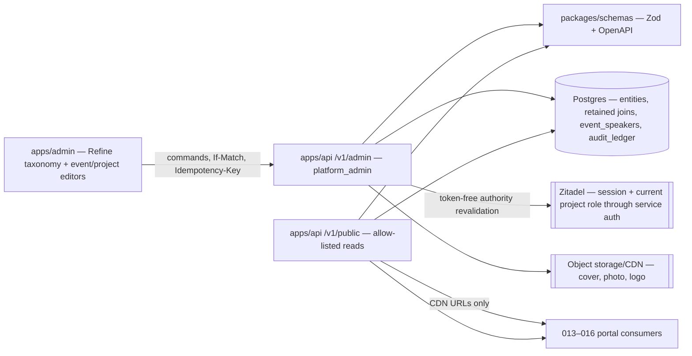
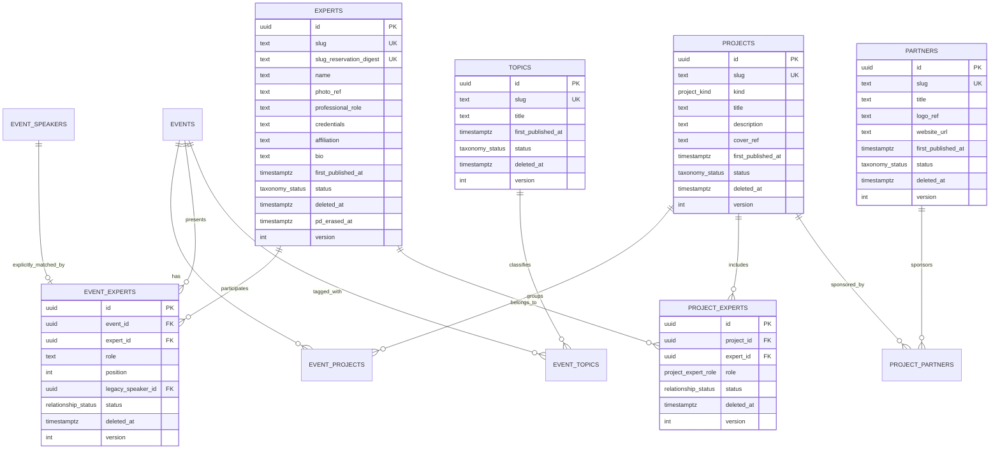
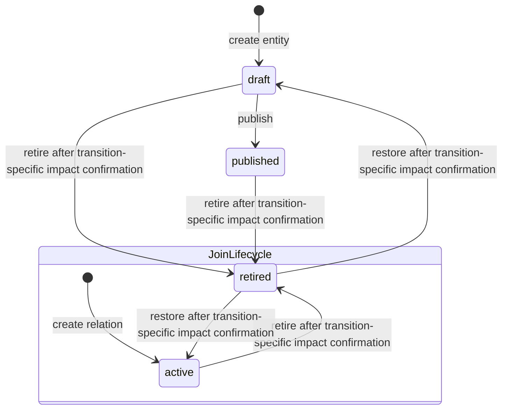
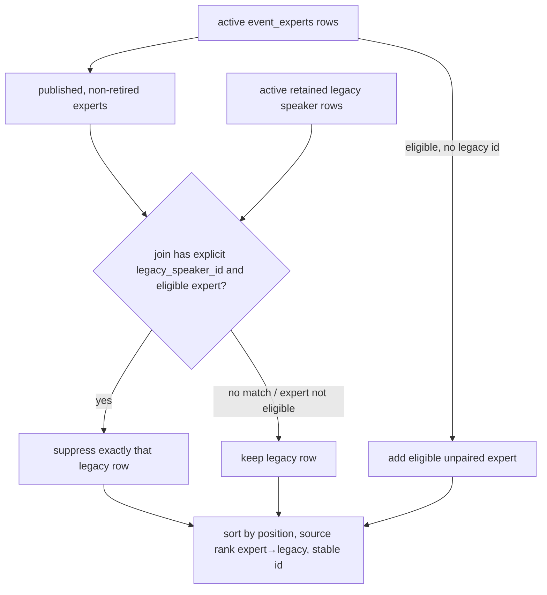

# 012 — Content taxonomy (Design)

## 1. Architecture

012 is one vertical spanning `packages/db` (retained schema + migrations), `packages/schemas` (Zod/OpenAPI SSOT), `apps/api` (admin commands and public reads), generated `@ds/api-client`, and `apps/admin` (Refine resources plus event/project relationship editors). It extends the 007 event aggregate; it does not add a second content store and renders no doctor-facing page.



Every domain mutation runs inside feature 010's audit-context transaction. No taxonomy-specific audit table or history viewer is introduced.

## 2. Data model



The omitted joins use the same envelope: UUID id, their two endpoint FKs, `active | retired`, `deleted_at`, `version`, `created_at`, `updated_at`. All logical endpoint pairs are unique across active and retained rows: a previously retired relation is restored, never reinserted under a new id. `cover_ref`, `photo_ref`, `logo_ref`, `website_url` and `first_published_at` are nullable; publish-required draft fields may remain null only until publication. Expert identifying fields may additionally be null/replaced only under the #1305 compliance overlay when `pd_erased_at IS NOT NULL`; that overlay is not an authoring shortcut or a fourth taxonomy status.

### 2.1 Database constraints

- `taxonomy_status = draft | published | retired`; `relationship_status = active | retired`; `project_kind = school | media | program`; `project_expert_role = curator | member`.
- CHECK constraints bind lifecycle to deletion timestamp: top rows `(status = 'retired') = (deleted_at IS NOT NULL)`; joins and migrated speakers `(status = 'retired') = (deleted_at IS NOT NULL)`.
- Every FK is the default `NO ACTION` or explicit `RESTRICT`; no cascade appears in generated migration SQL.
- Unique `(project_id, expert_id)`, `(event_id, project_id)`, `(event_id, expert_id)`, `(project_id, partner_id)`, `(event_id, topic_id)` include retained rows. A partial unique index permits at most one active `project_experts(role='curator')` per project.
- Publishing a project additionally requires exactly one active curator whose expert is `published` and non-retired; drafts may be incomplete.
- A slug is unique per entity kind across retained rows and matches `[a-z0-9]+(?:-[a-z0-9]+)*`; `first_published_at` is nullable before publication and set by the first publish transaction. A migration-level `BEFORE UPDATE` guard permits only `NULL → timestamp` and rejects clearing or changing a non-null value, so application bugs cannot unlock the slug. Its sole explicit bypass is the #1305 compliance function: it substitutes `erased-<stable-id>` while atomically preserving `slug_reservation_digest = HMAC-SHA-256(Vault expert-slug-reservation/v1, canonical old slug)`. The purpose DEK never leaves Vault and is retained while any reservation exists; infrastructure rotates its wrapping KEK without changing the HMAC key/digests. A unique index covers non-null reservation digests. Create/pre-publication slug changes and erasure take the same transaction advisory lock derived from the candidate digest and check both readable slugs and reservations, so a race cannot reuse an erased slug; no raw old slug is retained or recoverable from Postgres.
- `experts.pd_erased_at IS NOT NULL` implies `status='retired'`, non-null `deleted_at`, `slug='erased-' || id`, `name='[erased]'`, null `professional_role`, `credentials`, `affiliation`, `bio` and `photo_ref`, plus non-null `slug_reservation_digest`. A CHECK pins that exact tombstone shape. Restore predicates `pd_erased_at IS NULL`; an erased expert returns 409 `PD_ERASED` without changing its version/tombstones.
- #1278 replaces the old `event_speakers(event_id, position)` primary key with UUID `id` as row identity, retains an explicit `UNIQUE(event_id, id)` for the composite reference, and adds partial active-slot `UNIQUE(event_id, position) WHERE status='active'`; retained and replacement rows may therefore share a position but two active rows may not. It also adds nullable `pd_erased_at`; non-null implies `status='retired'`, non-null `deleted_at`, `name='[erased]'` and `regalia=''` under a CHECK, and every ordinary restore/update predicate requires `pd_erased_at IS NULL`. `event_experts.legacy_speaker_id` is nullable and unique, and its executable FK is `event_experts(event_id, legacy_speaker_id) REFERENCES event_speakers(event_id, id) ON DELETE RESTRICT`. A PK/UNIQUE on `event_speakers.id` alone is not treated as sufficient for this composite reference.
- `version` starts at 1 and is incremented atomically by every successful update or lifecycle command.

### 2.2 Authoring fields and validation

The Zod schemas in `packages/schemas` encode the requirements matrix directly: project title 1–160, kind enum and description 1–2000; expert name 1–160, professional role 1–160, credentials 1–500, affiliation 1–240 and bio 1–4000; topic title 1–120; partner title 1–160 and optional absolute HTTPS website up to 2048. Display labels are required on create; the other required public fields may be null only on a draft. PATCH omission means unchanged, while explicit null is accepted only for optional fields or an incomplete draft field. Updates to a published row re-run the publish contract.

If create omits `slug`, the service generates it with one shared canonical lowercase-ASCII transliteration/slugification function that the admin preview also imports. A conflict with any retained slug of the same kind is 409 `SLUG_CONFLICT`; the service does not silently choose a different public identity. PATCH predicates slug updates on `first_published_at IS NULL`; otherwise it returns 409 `SLUG_IMMUTABLE`. First publish sets `first_published_at` and status atomically.

Media schemas accept optional JPEG/PNG/WebP, at most 10 MiB, decoded width and height at most 6000 px and total pixels at most 25 million, with no minimum dimensions. Validation decodes the actual binary rather than trusting filename/client MIME, then one shared normalizer introduced by the first media vertical #1283 re-encodes to a canonical JPEG/PNG/WebP output, strips EXIF/XMP/GPS/original filename and every ancillary metadata block, derives stored MIME from normalized bytes, and persists only that normalized output under a server-generated key. Original bytes/name exist only in bounded request processing and are never put in CDN storage. #1284 expert photos and #1286 partner logos consume the same component and contract. Expert photo absence yields deterministic display initials derived from the normalized name. The admin mirrors bounds for preflight, but API normalization remains authoritative.

Input-mask declaration is `none` for every 012 field: each value is editorial text, a separately validated slug/URL/integer, or a file—not a fixed-format identifier—so a mask would fabricate or rewrite content rather than assist entry. Refine uses plain text/textarea controls with trim and character counters. Slug has generated preview plus pattern/length feedback, partner website uses a URL input, `event_experts.position` is integer step 1 from 0 through 32767, and its role is trimmed 1–80. Field validation is 400 `VALIDATION_FAILED`; a valid-shaped mutation that would leave a published projection incomplete is 409 `PUBLISH_REQUIREMENTS_NOT_MET` with field-addressed errors.

### 2.3 Existing-row conformance prerequisite (#1278)

The current 007 table is position-keyed and its editor replaces rows with delete-then-insert. GitHub [#1278](https://github.com/doctor-school/ds-platform/issues/1278) is the critical-path retained-row runtime prerequisite that owns conformance of current tables: stable retained `event_speakers`, idempotency rows and removal of existing cascade/delete paths. It starts affected speaker writes only after #1305's future mask and historical-remediation gate. 012 does not duplicate that migration. Before any 012 entity implementation, #1278 must provide:

1. add/backfill stable UUID `id`, make it the row identity replacing the old `(event_id, position)` primary key, add `status: active | retired`, `deleted_at`, nullable `pd_erased_at`, `version` and timestamps, pin the exact erased-speaker CHECK, and add explicit `UNIQUE (event_id, id)` for 012's same-event composite FK;
2. enforce the active authoring order with partial `UNIQUE (event_id, position) WHERE status='active'`, allowing a retired predecessor and active replacement at the same position;
3. replace the event FK cascade with `NO ACTION`/`RESTRICT`;
4. change the 007 DTO/editor reconciliation to carry row ids and retire/restore ordinary removed rows instead of deleting them, while rejecting restore or payload repopulation when `pd_erased_at IS NOT NULL` with 409 `PD_ERASED`;
5. attach feature 010's audit trigger and coverage entry;
6. make every legacy-speaker reconciliation lock the parent `events` row before reading or mutating child rows, then revalidate active `(event_id, position)` slots under that lock so 012 can share the same per-event serialization boundary.

The #1278 backfill changes no speaker text, ordering or current projection. 012 consumes the resulting stable `event_speakers.id`; creating an `event_experts` match never updates the matched row's name, regalia, status or `deleted_at`. If #1278 is not merged, EARS-7/8 are blocked—no positional-FK workaround is permitted.

### 2.4 Expert PD classification prerequisite (#1305)

ADR-0009 makes the retention matrix a pre-migration gate. [#1305](https://github.com/doctor-school/ds-platform/issues/1305) blocks `experts` until a fresh explicit Product Lead and Legal/Compliance sign-off records the lawful basis, exact term, retained-row erasure mechanism, audit exception and owner; #1240's package approval does not approve this later compliance policy, and Mode (a) is not legal approval. The matrix covers all expert fields/media, every `event_experts`/`project_experts` field and endpoint link, active idempotency replay content, public API/HTML/card/CDN caches, search/index replicas if present, logs/metrics, and the entire legacy `event_speakers.name`/`regalia` table—including an explicitly identified legacy-only person with no expert relation. The candidate is documented subject consent for processing/public dissemination while the purpose remains active, with non-exempt erasure completed within 30 days; exact legal terms remain the required sign-off output.

Before any expert migration, #1305 runs a read-only inventory of historical `audit_ledger` rows with `event_type LIKE 'data.event_speakers.%'` and plaintext `metadata.diff.name|regalia`. The future-write mask registry lands first, adding all identifying `experts` columns, `slug_reservation_digest`, `event_speakers.name` and `event_speakers.regalia` to both SQL `audit_pd_columns()` and TS `AUDIT_PD_COLUMNS`. Every historical hit must then receive Legal/Compliance classification and an approved feature-010/ADR-0009 remediation: append-only evidence rows remain, but raw output is made non-plaintext through the approved per-row audit-retention encryption/crypto-shred path; any lawful retention exception names its term, owner and separate retention key. No ad-hoc UPDATE/DELETE bypass of feature 010 is allowed, and #1305 cannot close while an unclassified plaintext marker remains.

`EraseExpertPd(expertId, explicitLegacySpeakerIds, approvedRequestId, curatorResolutions)` and `EraseLegacySpeakerPd(eventSpeakerId, approvedRequestId)` are compliance commands, never Refine Delete or ordinary retire. The latter addresses one stable legacy row explicitly and never matches by name. Expert erasure optimistically discovers every affected expert/project/event/relation, requires one owner-supplied resolution for each published project where the subject is sole curator (`replacementExpertId` for an eligible replacement or `retireProject=true`), then locks every subject/replacement expert by stable id, every project by stable id, every event by stable id and child rows. A changed dependency set aborts/restarts before taking a newly discovered lock. In one database transaction it:

1. resolves every sole-curator project: demote the subject first and install the eligible replacement, or set the project `retired` + `deleted_at` so catalog/detail and all project relationships disappear by filtering while their rows remain; a missing/invalid resolution keeps the erasure request `review_required` with zero mutation;
2. sets the expert to the exact CHECK-backed tombstone: `status='retired'`, non-null `deleted_at`/`pd_erased_at`, `slug='erased-<stable-id>'`, `name='[erased]'`, null `professional_role`/`credentials`/`affiliation`/`bio`/`photo_ref`, and the mandatory stable-Vault-HMAC old-slug reservation digest;
3. retires every explicitly mapped/approved legacy row with non-null `deleted_at`/`pd_erased_at`, `name='[erased]'` and `regalia=''`, clears `event_experts.legacy_speaker_id`, and never guesses another row by name; `EraseLegacySpeakerPd` applies this same exact irreversible CHECK-backed row shape without requiring an expert;
4. retires subject `event_experts`/`project_experts`; `event_experts.role` becomes `[erased]` and a former curator role becomes `member`. Their stable endpoint ids/position remain only as pseudonymous operational evidence under #1305's recorded lawful basis and term, are never public, and have no retained free-text person payload once every cache/audit mapping is erased or crypto-shredded;
5. uses the active-only sorted `pd_subject_refs` attached to every PD-bearing idempotency response to lock all claims containing the expert, advance their fencing epoch, set them `expired` + `deleted_at`, and clear response/headers/fingerprint/upload/domain-target/actor/subject content; a paused processing owner therefore loses its completion fence, and every later use of any affected key returns 409 `IDEMPOTENCY_KEY_REUSED`; and
6. writes retained durable outbox/cleanup jobs for every photo object version/derivative, CDN object, public JSON/HTML/page/card cache tag and registered search/index projection, plus the non-PD attributed `ExpertPdErased` evidence event.

The database transaction commits tombstones/value erasure, curator resolutions and durable jobs—not external deletion. The erasure request remains `executing`; retrying workers must acknowledge object-store deletion, CDN purge and every registered projection/cache invalidation before it becomes `completed` within the 30-day term. An outage or a late stale-owner upload keeps reconciliation live and alerted without rolling back or republishing erased DB values. After acknowledgement, old expert/profile/media URLs return the ordinary unknown/ineligible response and a red-team unique-marker scan finds no plaintext in raw ledger, API/page/CDN/search caches, logs or metrics. Parity/no-plaintext tests prove future audit old/new values are only `{ masked: true }`. No Postgres row is physically deleted.

## 3. Lifecycles



Retiring a top-level entity leaves every join unchanged. Public traversal filters the endpoint and therefore hides it; restoring the entity to `draft` still does not publish it. Republish is deliberate. Retiring a join affects only that relationship. A restore reuses the same row/id and fails with 412 if the caller's version is stale. Two narrow refusal overlays exist: the published-project curator invariant below blocks an invalidating mutation, while an expert or migrated legacy speaker with `pd_erased_at` returns 409 `PD_ERASED` on restore/repopulation because legal erasure is intentionally irreversible. Neither overlay physically deletes a row.

### 3.1 Lifecycle-impact preview

```mermaid
sequenceDiagram
  participant O as Operator
  participant A as Refine admin
  participant API as apps/api
  participant DB as Postgres
  O->>A: choose Retire or Restore
  A->>API: GET .../:id/lifecycle-impact?transition=retire|restore
  API->>DB: read target + all incident relations and opposite-endpoint eligibility inputs
  API-->>A: LifecycleImpact(transition, version, affected ids, signed impactToken)
  A-->>O: confirmation dialog (no Delete wording)
  O->>A: confirm
  A->>API: POST .../:id/{retire|restore} + If-Match + Lifecycle-Impact-Token + Idempotency-Key
  API->>DB: SERIALIZABLE recompute + token/version check; apply one lifecycle transition + version++
  DB-->>API: row + feature-010 audit record
  API-->>A: updated detail + ETag
```

`impactToken` is an opaque server-signed envelope binding transition, target kind/id/version, issued-at and a 15-minute expiry to a canonical fingerprint of every retained incident relation and every opposite endpoint input that determines current public eligibility. The fingerprint is over sorted tuples of table/kind, stable id, monotonic version where present, lifecycle state and the exact event-public-eligibility inputs; it therefore covers inactive relations and non-public endpoints that could become visible, without returning their hidden content to the client.

The signed envelope also binds the requested transition, so a retire preview cannot authorize restore or vice versa. Confirmation requires both the target `If-Match` and `Lifecycle-Impact-Token`. It runs at PostgreSQL `SERIALIZABLE` and acquires the target plus dependencies in the applicable LD-2/LD-4 canonical order—not target-first for relation commands. It optimistically discovers the set before locking, aborts with 412 and restarts from a new preview if that set changes, then verifies signature/expiry and recomputes transition/target identity/version/fingerprint before changing lifecycle. A changed target, inserted/restored/retired incident relation, changed opposite-endpoint eligibility, tampered/expired token, wrong transition/target or serialization abort returns 412 `LIFECYCLE_IMPACT_STALE` with zero domain/media/audit mutation; the service never auto-retries it, and the UI must reload impact before asking again. A missing token is 428 `LIFECYCLE_IMPACT_REQUIRED`. Thus both changes committed between preview and confirmation and phantoms overlapping the confirmation transaction are covered for retire and restore; an entity restore may truthfully show an empty affected list because it returns to `draft`, while a join restore previews public relations it would add immediately.

### 3.2 Published-project curator invariant

Every committed `published` project has exactly one active curator whose expert is `published` and non-retired. The partial unique index enforces the upper bound; publish, curator mutation and expert lifecycle services enforce the lower bound and eligibility through one shared lock protocol. Every affected expert row is locked first in stable-id order, then every affected project row in stable-id order, then `project_experts` rows. State and relations are re-read only after those locks. Directly retiring the curator expert, retiring the sole curator relation or changing its role to `member` returns 409 `PUBLISHED_PROJECT_REQUIRES_CURATOR` without any row, version, media or audit mutation.

`ReplaceProjectCurator(projectId, expertId)` is the only curator-change path while the project is published. With the project's `If-Match`, one transaction identifies the current and candidate expert ids, locks both experts in stable-id order, locks the project and relation rows, re-reads them, verifies that the replacement expert is still published/non-retired, demotes the former curator row to `member`, then creates/restores/promotes the candidate row, increments both affected relation versions and the project version, and writes the ordinary feature-010 audit rows. The demote-first order is required because PostgreSQL's partial unique index on the active curator is immediate, not deferrable; if candidate promotion fails, rollback restores the former curator and its version/audit state. Project publication optimistically identifies its curator, locks that expert before the project, and post-lock revalidates; if the curator set changed it returns 412/restarts from a fresh request rather than discovering and locking another expert after the project lock.

An expert lifecycle mutation locks the expert first, then re-queries all active curator relations, locks their project rows in stable-id order and revalidates them before changing expert state. Every `project_experts` mutation participates in the same order, so a relation inserted while retirement is discovering dependencies either commits before the expert lock and is seen on re-read, or waits and then rejects the retired endpoint. Under replacement-versus-candidate-retirement, exactly one operation can commit: the loser revalidates to 409 `PUBLISHED_PROJECT_REQUIRES_CURATOR`; under concurrent replacements, the stale project version returns 412. Retiring the project itself is allowed and leaves joins untouched; restore yields `draft`, and a later publish revalidates curator eligibility.

As defense in depth, public project reads repeat the eligibility predicate and fail closed: an inconsistent imported or manually corrupted `published` project is omitted/404 and emits an operational error rather than leaking an invalid public projection.

## 4. Legacy speaker merge

The public projection is a query policy, not a migration job.



Names are never compared. A draft or retired expert cannot suppress the fallback. Retiring the join makes the fallback visible again; restoring it suppresses the same stable legacy row again. The total order is `position ASC`, source rank (`expert` before `legacy`), stable row id ASC (LD-2). The public page/endpoint item is the exact §5.2 discriminated union: legacy carries only `source, name, credentials`; expert carries `source, expertId, expertSlug, name, credentials, photoUrl, role`, with nullable `photoUrl`. Internal storage keys and retained-row state are absent.

Position conflicts are rejected at write time: the active current projection must have one deterministic slot per visible row. A mapped expert may take the matched legacy row's position because that row is suppressed; an unpaired expert must use an unoccupied position. Every 012 `event_experts` create/update/retire/restore first locks every old/new affected expert row in stable-id order, then locks the parent `events` row, re-reads expert lifecycle and both child tables, and only then mutates/recomputes the would-be visible projection. Every 007 `event_speakers` reconciliation locks the same parent event before reading or mutating either child table. This preserves the global expert→project→event order while allowing a legacy-only write to begin at the event boundary.

Expert publish/retire also changes speaker visibility: publish can reveal an unpaired expert or suppress a matched fallback, while retire can reveal that fallback. The lifecycle transaction therefore locks the expert first, discovers and locks every linked parent event in stable-id order (after any curator project locks from §3.2, before child rows), re-reads all `event_experts`/`event_speakers` rows and validates every affected projection before changing expert status. A concurrent `event_experts` mutation must acquire that same expert lock before its event lock: if the relation commits first, lifecycle discovers and revalidates it; if lifecycle commits first, the relation re-reads the new expert state and revalidates before writing. Within-table partial uniqueness remains a DB backstop; any would-be cross-table collision returns 409 `SPEAKER_POSITION_OCCUPIED`. Legacy-row, expert-link and linked-expert lifecycle writes therefore serialize for the same event, while different experts/events remain independent unless they share an affected lock.

## 5. HTTP surface

### 5.1 Admin entities and relationships

For each entity resource `{projects|experts|topics|partners}`:

| Method/path                                                                | Purpose                                                                  |
| -------------------------------------------------------------------------- | ------------------------------------------------------------------------ |
| `GET /v1/admin/<resource>?page&pageSize&q&status&includeRetired`           | Refine list; offset/page + total; defaults exclude retired.              |
| `POST /v1/admin/<resource>`                                                | Create draft; UUID `Idempotency-Key`, no `If-Match`.                     |
| `GET /v1/admin/<resource>/:id`                                             | Detail by stable id, including retired rows.                             |
| `PATCH /v1/admin/<resource>/:id`                                           | Edit same row; target `If-Match`.                                        |
| `POST /v1/admin/<resource>/:id/publish`                                    | Draft → published; target `If-Match`.                                    |
| `GET /v1/admin/<resource>/:id/lifecycle-impact?transition=retire\|restore` | Preview transition consequences plus signed `impactToken`.               |
| `POST /v1/admin/<resource>/:id/retire`                                     | Target `If-Match` + matching `Lifecycle-Impact-Token`.                   |
| `POST /v1/admin/<resource>/:id/restore`                                    | Target `If-Match` + matching `Lifecycle-Impact-Token`; retained → draft. |

Projects additionally expose `POST /v1/admin/projects/:id/replace-curator` with `{ expertId }`, project `If-Match` and `Idempotency-Key`; this is the atomic command from §3.2.

The compliance-only retained-erasure routes are exact and are not Refine Delete actions: `POST /v1/admin/experts/:id/erase-pd` accepts `{ explicitLegacySpeakerIds: uuid[], approvedRequestId: uuid, curatorResolutions: { projectId: uuid, replacementExpertId?: uuid, retireProject?: true }[] }` with the subject expert `If-Match` and UUID `Idempotency-Key`; `POST /v1/admin/event-speakers/:id/erase-pd` accepts `{ approvedRequestId: uuid }` with the subject speaker-row `If-Match` and UUID `Idempotency-Key`. The curator-resolution validator requires exactly one of `replacementExpertId` or `retireProject=true` for every affected sole-curator project and rejects any extra/missing project resolution before mutation.

For `{event-projects|event-experts|project-experts|project-partners|event-topics}`, the same retained command pattern is exposed at `/v1/admin/<join>`: filtered list; POST create with no `If-Match`; PATCH attributes with the join ETag; GET transition-specific lifecycle impact; POST retire/restore with the join ETag and lifecycle token. There is no DELETE route. The Refine provider maps `deleteOne` to an unsupported operation rather than an HTTP call.

Request content types are exact:

- Topics and every request without a binary use `application/json`.
- A project/expert/partner create or PATCH with a binary uses `multipart/form-data` containing exactly one `payload` part with `Content-Type: application/json` plus at most one kind-specific file part named `cover`, `photo` or `logo`. Multipart without a file is rejected as 415 `UNSUPPORTED_MEDIA_TYPE`; JSON is the canonical no-file shape.
- Client JSON never exposes or accepts `coverRef`, `photoRef`, `logoRef`, an object key or an arbitrary storage URL; strict-schema input of one is 400 `VALIDATION_FAILED`. Create omission yields no media. PATCH omission keeps the current reference; JSON PATCH `mediaAction: "clear"` clears the optional media. `mediaAction` is not accepted on create.
- A multipart file means set/replace. Supplying a file together with `mediaAction: "clear"`, multiple files or the wrong kind-specific part returns 400 `MEDIA_INPUT_CONFLICT` before upload. Every valid project/expert/partner file then crosses the shared #1283 decoder/normalizer from §2.2 before storage. A replacement always uses a fresh deterministic idempotency-claim-scoped object key and never overwrites a referenced object in place.

The idempotency fingerprint includes the normalized concrete target path/route parameters, canonical JSON, the canonical normalized output bytes' SHA-256 digest and every semantic conditional header. Different raw uploads that normalize to the same canonical output are one semantic input; a different normalized output/digest, target or precondition under the same scope/key is 409 `IDEMPOTENCY_KEY_REUSED`.

The failure order follows the existing feature-007 storage policy. Dedicated-session/MFA/CSRF and #1304 live-authority revalidation happen before request/key validation; canonical UUID-key validation happens before claim ownership, normalization or upload. An object-storage PUT failure returns 503 `MEDIA_STORAGE_UNAVAILABLE`, completes that idempotency outcome for replay and makes no taxonomy/speaker-domain or audit mutation. After a successful claim-scoped upload, the DB transaction rechecks method-specific preconditions, swaps or clears the reference, writes domain audit and completes the idempotency response atomically. A refused/failed transaction's newly uploaded unreferenced object stays discoverable through §6's claim cleanup. A committed replace/clear additionally inserts a retained `media_cleanup_jobs` row for the old referenced key in the same transaction as the ref change; this is a distinct handle because the idempotency claim describes only the new upload.

`media_cleanup_jobs` is a constrained technical table with stable UUID `id`, `status: active | expired`, `execution_state: pending | processing | completed`, nullable `deleted_at`, cleanup kind, entity kind/id and media slot, server-generated object/CDN keys, monotonic `lease_epoch`, bounded lease owner/expiry, enum-only last error, attempt count and timestamps. The ref-swap transaction creates one `active/pending` job; a worker CAS-acquires a newer epoch, rechecks every current media reference, deletes all object versions/derivatives, purges or invalidates the CDN key, and retries/alerts until both providers acknowledge absence. Completion under the matching owner+epoch sets `expired/completed`, `deleted_at` and `completed_at`, clears raw keys, entity id, lease and error content, and retains only job id, cleanup kind, outcome and timestamps. A zero-row fencing update cannot declare cleanup complete. No row is deleted/reactivated. Feature 010 continues to audit the domain ref mutation; the job table is an explicit technical-table audit exclusion with allowlist-parity tests, while #1305 classifies its active expert linkage and consumes completion acknowledgement. Best-effort immediate cleanup may reduce latency but never replaces this durable obligation.

### 5.2 Public reads

- `GET /v1/public/{projects|experts|topics|partners}` and `/:idOrSlug` return cursor-paginated lists / one allow-listed projection. Full entity DTOs are exact: project `id, slug, kind, title, description, coverUrl`; expert `id, slug, name, professionalRole, credentials, affiliation, bio, photoUrl, initials`; topic `id, slug, title`; partner `id, slug, title, logoUrl, websiteUrl`. Optional URLs are present and nullable.
- Relationship summaries are exact: `PublicEventSummary { id, slug, title, school, startsAt, state }`; `PublicProjectSummary { id, slug, kind, title, coverUrl }`; `PublicExpertSummary { id, slug, name, professionalRole, photoUrl }`; `PublicTopicSummary { id, slug, title }`; `PublicPartnerSummary { id, slug, title, logoUrl, websiteUrl }`. Optional URLs are present and nullable; no status, storage key, retained-row id or admin field is present.
- Nested route item DTOs are fixed rather than inferred from the opposite full entity:
  - `/events/:key/projects` → `PublicProjectSummary`; `/projects/:key/events` → `PublicEventSummary`;
  - `/events/:key/experts` → `PublicEventExpertItem = PublicExpertSummary + { role, position }`; `/experts/:key/events` → `PublicExpertEventItem = PublicEventSummary + { role, position }`;
  - `/projects/:key/experts` → `PublicProjectExpertItem = PublicExpertSummary + { role: curator | member }`; `/experts/:key/projects` → `PublicExpertProjectItem = PublicProjectSummary + { role: curator | member }`;
  - `/projects/:key/partners` → `PublicPartnerSummary`; `/partners/:key/projects` → `PublicProjectSummary`;
  - `/events/:key/topics` → `PublicTopicSummary`; `/topics/:key/events` → `PublicEventSummary`.
- The canonical merged page-speaker item is a strict discriminated union: legacy `{ source: "legacy", name, credentials }`; linked expert `{ source: "expert", expertId, expertSlug, name, credentials, photoUrl, role }`, with `photoUrl` present and nullable. No expert-only key appears on a legacy item. `GET /v1/public/events/:key/speakers` and shipped `PublicEventPage.speakers` return that exact ordered union. Shipped `UpcomingBroadcastCard.speakers` remains its exact thinner `{ name }` array, mapped from the same ordered resolver—not a second query or merge implementation.

Every growing route accepts bounded `limit` and opaque `cursor`, returns ADR-0002's exact envelope `{ data, pagination: { nextCursor, hasMore } }`, and orders by a stable tuple that ends in id; the speaker endpoint follows LD-2 order. A source id/slug that is unknown or ineligible under that route's entity/event public policy returns 404 `RESOURCE_NOT_FOUND`; an eligible source with no eligible related rows returns 200 with `data: []`, `nextCursor: null`, `hasMore: false`. An ineligible related endpoint or inactive join is filtered from an otherwise valid collection. Public taxonomy search is deliberately absent. Event traversals reuse the existing public event eligibility policy rather than inventing another lifecycle.

### 5.3 Authorization and errors

Admin routes inherit the shipped feature-011 floor rather than only checking a role string. Reads and commands accept exclusively `__Host-ds_admin_session` resolving to `platform_admin` with `mfa=true`; every state-changing request passes `x-ds-admin-csrf` double-submit. Because feature 011 deliberately discards IdP access/refresh tokens, #1304 adds `IdpClient.revalidateAdminAuthority({ zitadelSessionId, sub })`: the real adapter uses service-authenticated `GET /v2/sessions/:id` plus the current project-role read, with strict fake parity. It runs after local session/fingerprint/MFA/CSRF checks but before request validation, idempotency ownership, normalization/upload or handler entry. Inactive/missing/mismatched session is 401 `ADMIN_SESSION_REQUIRED`; active session with revoked/missing `platform_admin` is 403 `PLATFORM_ADMIN_REQUIRED`; transport/timeout/429/provider 5xx/service-auth/config/malformed response raises `IdpUnavailableError` and maps to 503 `IDP_REVALIDATION_UNAVAILABLE`, leaving the local session intact. Every refusal makes zero idempotency/domain/media/audit side effect. Public routes are `public`, with no session variation. All DTOs live in `packages/schemas` and generate OpenAPI/client types.

| Status | Exact stable `errorCode`                                                                                                                                                                                                                                                                  |
| ------ | ----------------------------------------------------------------------------------------------------------------------------------------------------------------------------------------------------------------------------------------------------------------------------------------- |
| 400    | `VALIDATION_FAILED`, `MEDIA_INVALID`, `MEDIA_INPUT_CONFLICT`, `CURSOR_INVALID`, `IDEMPOTENCY_KEY_INVALID`.                                                                                                                                                                                |
| 401    | `ADMIN_SESSION_REQUIRED` for every feature-011 security-floor refusal named above.                                                                                                                                                                                                        |
| 403    | `PLATFORM_ADMIN_REQUIRED`.                                                                                                                                                                                                                                                                |
| 404    | `RESOURCE_NOT_FOUND` for unknown admin id or unknown/ineligible public source; public bodies are identical.                                                                                                                                                                               |
| 409    | `RELATIONSHIP_CONFLICT`, `SLUG_CONFLICT`, `SLUG_IMMUTABLE`, `PUBLISH_REQUIREMENTS_NOT_MET`, `PUBLISHED_PROJECT_REQUIRES_CURATOR`, `INVALID_TRANSITION`, `LEGACY_SPEAKER_CONFLICT`, `SPEAKER_POSITION_OCCUPIED`, `PD_ERASED`, `IDEMPOTENCY_KEY_REUSED`, `IDEMPOTENCY_REQUEST_IN_PROGRESS`. |
| 412    | `PRECONDITION_FAILED`; `LIFECYCLE_IMPACT_STALE` for invalid/wrong-transition/wrong-target/changed dependency token or overlapping serialization abort.                                                                                                                                    |
| 415    | `UNSUPPORTED_MEDIA_TYPE`.                                                                                                                                                                                                                                                                 |
| 428    | `IDEMPOTENCY_KEY_REQUIRED`, `PRECONDITION_REQUIRED`, `LIFECYCLE_IMPACT_REQUIRED`.                                                                                                                                                                                                         |
| 503    | `MEDIA_STORAGE_UNAVAILABLE`, `IDP_REVALIDATION_UNAVAILABLE`; no taxonomy/speaker-domain or audit mutation.                                                                                                                                                                                |

Every error is `application/problem+json` with RFC 7807 fields plus `errorCode` and `traceId`; no database key or hidden lifecycle state leaks.

## 6. Idempotency, concurrency and audit

- Every mutating HTTP endpoint requires `Idempotency-Key` in canonical UUID text form (`8-4-4-4-12`, lowercase after parse). Missing/blank returns 428 `IDEMPOTENCY_KEY_REQUIRED`; malformed/non-canonical returns 400 `IDEMPOTENCY_KEY_INVALID`. Both are refused before ownership, normalization/upload, domain mutation or audit. During the 24-hour active window scope is actor + method + route template, but the row stores no raw UUID or admin `sub`: `key_digest = SHA-256(canonical UUID)` and `actor_digest = HMAC-SHA-256(versioned Vault purpose key, sub)`. Actor-digest key rotation uses dual lookup for the maximum 24-hour window plus cleanup grace; once those active claims expire, the old version and every actor digest are destroyed/cleared. The permanent tombstone therefore retains only key digest + non-identifying method/route template, not an actor identifier.
- The request fingerprint includes normalized concrete path/query parameters, canonical JSON, canonical normalized-output SHA-256, and semantic conditional headers (`If-Match`, `Lifecycle-Impact-Token`). Different source bytes that normalize identically share a fingerprint; a different target, JSON, normalized output/digest or precondition under the same active key returns 409 `IDEMPOTENCY_KEY_REUSED`. An expired key is rejected before fingerprint comparison, so it can never authorize replay with an older ETag/token.
- The retained record has `status: active | expired`, `deleted_at`, `execution_state: processing | completed | abandoned`, `lease_purpose: request | cleanup`, `lease_owner`, monotonic `lease_epoch`, `lease_expires_at`, actor/request digests, optional deterministic `upload_object_key`/digest, domain target reference, sorted active-only `pd_subject_refs` for every expert/legacy subject contained in a cached response, and cached status/body/allow-listed representation headers. `pd_subject_refs` are classified pseudonymous data used only for exact #1305 lookup and are cleared on ordinary expiry or subject erasure. Every INSERT/CAS acquire or takeover increments `lease_epoch`; a 20-second heartbeat extends the 60-second lease only when owner+epoch+purpose still match. A waiter polls at most 2 seconds: completed → exact replay; live request lease → 409 `IDEMPOTENCY_REQUEST_IN_PROGRESS` with `Retry-After: 1`; expired request lease → one CAS winner receives a new epoch. Different-fingerprint reuse returns 409 immediately.
- Request takeover and orphan cleanup are disjoint. A request retry CAS-acquires `lease_purpose=request`, HEADs the deterministic claim object and verifies normalized digest metadata, reuses it if present/unreferenced or uploads with `If-None-Match: *` so no stale owner can overwrite an existing object, then resumes the domain command. Only after the cleanup grace and no live request owner may a worker CAS-acquire `lease_purpose=cleanup`; it never invokes a domain handler, checks references, deletes an unreferenced object, records outcome/marks `abandoned`, and releases the claim. A later request may acquire a newer request epoch and conditionally re-upload if cleanup removed the object. Explicit PUT failure is a known deterministic 503 `MEDIA_STORAGE_UNAVAILABLE` outcome and is fenced/completed for exact replay.
- Every deterministic result reached after claim ownership is fenced and terminal, not only success: the same owner+epoch+purpose conditional completion stores exact status/body/allow-listed headers for 409 invariant/unique conflicts, 412 precondition/lifecycle refusals and other classified 4xx/known storage outcomes. Their domain transaction contains no successful domain write, but the completed refusal replays exactly even if underlying state later changes. An unclassified provider/DB timeout, disconnect or uncertain commit verdict is never cached as terminal: the transaction rolls back or remains uncommitted, the lease becomes takeover-eligible, and the next owner re-runs post-lock checks. Pre-claim auth/key/validation refusals create no claim.
- A successful domain transaction rechecks method-specific preconditions, changes taxonomy/speaker rows, writes feature-010 domain audit, stores status/body plus `ETag`/`Location`, and conditionally marks the claim completed where `status=active`, purpose/owner/epoch still match. Those actions share one Postgres transaction; a zero-row fencing update means a newer owner won, so all domain/audit/claim writes roll back. A paused stale owner can leave only an unreferenced immutable object for cleanup, never a committed domain mutation. POST create requires only the UUID key; PATCH/publish/retire/restore require target `If-Match`; replace-curator requires project `If-Match`; `EraseExpertPd`/`EraseLegacySpeakerPd` require the subject expert/speaker `If-Match`; retire/restore also require the lifecycle token. Missing conditional ETag is 428 `PRECONDITION_REQUIRED`; stale is 412 `PRECONDITION_FAILED`.
- At exactly 24 hours, expiry clears response/body headers, actor digest/key version, request fingerprint, normalized-output/upload digest, domain target, `pd_subject_refs`, lease owner/purpose and every content-bearing field in the same UPDATE that sets `expired` + `deleted_at`; this minimization never waits for object storage. Before clearing, the server derives a non-content cleanup handle from claim id + media slot (the server-generated claim-object key is deterministically recoverable from that handle without payload/digest) and retains it only while `cleanup_pending=true`. A recurring reconciler CAS-acquires cleanup epochs and rechecks every abandoned/expired pending claim until HEAD is absent or the object is referenced; it therefore catches a late `If-None-Match` PUT by a stale owner after an earlier delete. Operational alerting keeps failed sweeps live rather than declaring cleanup complete. This claim track never substitutes for §5.1's `media_cleanup_jobs`, which durably own old referenced objects after committed replace/clear. The tombstone otherwise retains only `key_digest`, method/route template, terminal status/lifecycle timestamps and non-content cleanup outcome. Every later UUID use in scope returns 409 `IDEMPOTENCY_KEY_REUSED`; no row is deleted/reactivated. #1305 additionally fences and scrubs still-active replay content for an erased expert. `idempotency_keys` and `media_cleanup_jobs` remain feature 010's explicit technical-table audit exclusions.
- Shared invariant protocols add pessimistic serialization where per-row ETags are insufficient: every `event_experts` mutation locks affected experts before its parent event, linked-expert lifecycle uses the same expert-first/event-next boundary, curator plus speaker eligibility follows expert-first/project-second/event-third locking, and lifecycle-fingerprint confirmation is `SERIALIZABLE`. All commands revalidate after acquiring their shared dependencies; invariant failures and serialization aborts write no domain audit row. Unique constraints remain the final race guard.
- Feature 010's `withAuditContext` and DB trigger wrap taxonomy entity, relationship and migrated speaker-domain mutations. Their lifecycle actions therefore produce ordinary `data.<table>.update` history with actor/source; no duplicate manual audit writer is added. Idempotency lease/expiry/claim cleanup and committed-media cleanup-job writes produce no audit row only through the recorded feature-010 technical-table allowlist, whose SQL/TS parity tests must name both tables; the audited domain ref swap remains the attributable evidence. Before the expert migration, SQL `audit_pd_columns()` and TS `AUDIT_PD_COLUMNS` gain all expert PD and all legacy-speaker `name`/`regalia` columns with parity/no-plaintext tests, and #1305 inventories/classifies/remediates historical `data.event_speakers.*` plaintext as §2.4 requires.

## 7. Refine admin composition

The admin owns four resource lists/details/forms plus relationship editors embedded in the existing 007 event form and the project detail. Tables show status, search, page controls and an explicit “include retired” filter; selectors exclude retired rows; detail routes can open them for restore. Lifecycle actions are Publish, Retire and Restore. Delete is absent from navigation, action menus, provider and API.

EARS-18 Stage A is the first UI gate: before any entity or join UI slice, run `build-ui-from-design-system`, inventory the existing Refine/event patterns and `@ds/design-system`, search the approved registry whitelist, present 2–3 concrete compositions, and record the product-owner choice. Stage B drives the chosen real UI on the live stand before merge. All copy uses the typed RU catalog; primitives own focus/hover/active/disabled/loading states.

Implementation WBS stays vertical and bounded: project, expert, topic and partner each have their own schema→API→SDK→Refine→browser slice (EARS-1…4); `project_experts` (EARS-9) and then `event_experts` (EARS-7) land before shared publication/public projection (EARS-5), so project publication consumes a real curator relation and expert publication consumes the real speaker-visibility relation/locks. The order is project → expert → topic → partner → `project_experts` → `event_experts` → publication → remaining joins/projections. Each remaining EARS-6/8/10/11 slice stays bounded. No “build all taxonomy CRUD” issue is acceptable, and none may start its UI portion before EARS-18 Stage A. EARS-16/17 safeguards are acceptance criteria from each handler's first commit; their dedicated children only verify the assembled route set.

## 8. Verification strategy

- **DB/migration:** all four entities/five joins satisfy lifecycle CHECKs, stable uniqueness/restrictive FKs and set-once publication identity with the narrow expert-erasure override; same-event speaker FK is executable; #1278 proves migrated current rows plus fenced retained idempotency; #1283 proves the fenced retained cleanup-job lifecycle and explicit audit-exclusion parity; expert and erased legacy-speaker PD registries have SQL↔TS parity and no-plaintext ledger proof.
- **API e2e:** real Postgres/object storage; exact JSON/multipart/shared normalization and metadata stripping, durable old-reference cleanup, expert/legacy retained PD erasure plus join/replay/cache/audit scrub and external acknowledgements, publication/curator/speaker invariants, exact DTOs, lifecycle canonical lock order plus token abuse/stale snapshots, #1304 401/403/503 outcomes, UUID-key validation, semantic fingerprints including different normalized outputs, replay, fenced stale-owner rollback, separate request takeover/cleanup and full expiry minimization. Tests use `it('EARS-N: ...')`.
- **Browser:** Playwright BDD on the live Refine app creates all kinds, exercises counters/previews/URL/integer/file controls without masks, links event/project/expert/topic/partner, replaces a curator, maps a legacy speaker, verifies reject and accept branches, retires/restores, and proves no Delete/inline-topic creation. Axe, keyboard state, desktop/mobile and light/dark checks accompany the Stage-B owner verdict.
- **No stub acceptance:** browser and API tests operate on committed schemas/migrations and generated SDK types, not seeds standing in for authoring or relationship endpoints.

## 9. Dependencies and sequencing

1. Merge this accepted SDD artifact and open/wire its bounded EARS Issues.
2. Complete [#1305](https://github.com/doctor-school/ds-platform/issues/1305), including explicit Product Lead + Legal/Compliance sign-off, future speaker/expert audit masking and historical-ledger remediation, before #1278 performs another speaker write and before the expert migration.
3. Complete [#1278](https://github.com/doctor-school/ds-platform/issues/1278) before any new 012 entity handler: it owns retained-row conformance, stable `event_speakers`, parent-event locking and the fenced retained idempotency schema/expiry boundary.
4. Complete [#1304](https://github.com/doctor-school/ds-platform/issues/1304) before the first taxonomy mutation; it owns token-free authority revalidation and ADR-0001/011 alignment. #1283 then owns the shared normalized-media component before any cover/photo/logo reaches storage.
5. Complete EARS-18 Stage A before any EARS-1…15 UI work.
6. Deliver project → expert → topic → partner → `project_experts` → `event_experts` → publication, then remaining bounded joins/projections. Every handler includes EARS-16/17 safeguards from its first commit.
7. Only after the complete 012 parent closes may 013–016 consume the public relationships.

The dependency is real, not a scaffold license: 012 keeps the observable legacy-speaker contract, but it must consume #1278's committed stable row identity and may not add a temporary positional mapping, hardcoded seed or duplicate migration.
