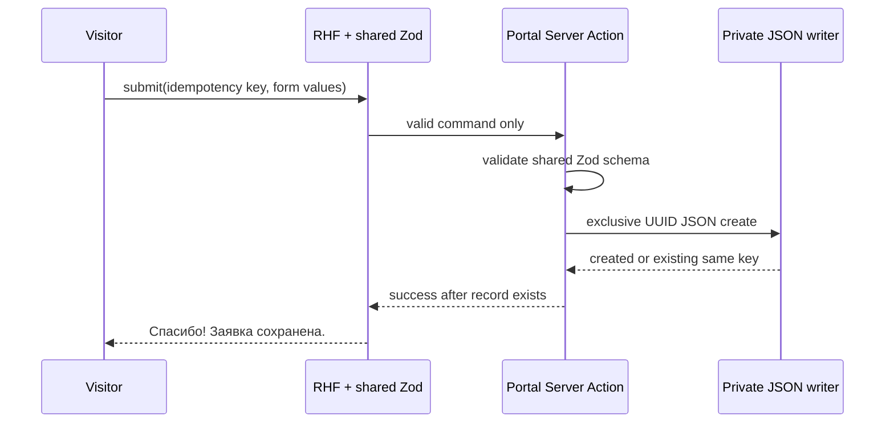

# 013 — Academy home and partnership form (Design)

> **INTERIM STATIC STUB — NOT the Feature 013 contract.** This design covers the
> temporary demo stub live at `/` since release-2026.08.16-2 (Issues
> [#1311](https://github.com/doctor-school/ds-platform/issues/1311) /
> [#1312](https://github.com/doctor-school/ds-platform/issues/1312)). The canonical
> Feature 013 product contract is [013-product.md](./013-product.md), US-1…US-12.
> Superseded by [#1324](https://github.com/doctor-school/ds-platform/issues/1324);
> dismantled by [#1323](https://github.com/doctor-school/ds-platform/issues/1323).

## Architecture

The portal route `/` keeps the shipped Academy composition. Its client form uses
React Hook Form and `@ds/design-system` controls with a shared Zod schema. The
role selector uses the Stage-A-approved official shadcn `NativeSelect`
recommendation. A Next.js Server Action repeats schema validation and calls the
private JSON writer; no API route, database, CMS, queue, worker, CRM,
Mattermost, notification, or admin surface is introduced.

## Form and validation states

The enabled controls are required name, optional company or clinic, required
combined `Email или Telegram` with exact placeholder
`name@company.ru или @username`, required NativeSelect role in the PRD order,
and required consent linked exactly to the policy URL. The shared schema trims
text, applies the requirements field table, and accepts contact only as a
Zod-valid email or `^@[A-Za-z0-9_]{5,32}$`; no text field has an input mask for
the stated field-specific reasons. Invalid client or server input stays in the
form, creates no file, and shows inline errors plus the DS `FormErrorSummary`
below submit; because this form has over three fields, focus moves to that
summary. Pending disables repeated submissions without losing values. Write or
transport failure preserves all values and renders the exact approved error
above submit. Success replaces the form only after persistence.

## Private persistence boundary

The production Docker named volume is writable only by the portal. Its directory
is configured by environment, fails closed if unavailable or unsafe, and is
`0700`; each UUID-named JSON file is exclusively created atomically with `0600`.
The record contains id, acceptedAt, form fields, idempotency key, and consent
`{ purpose: "academy_partnership_contact", versionTag:
"academy-partnership-v1", text, textSha256, accepted: true, acceptedAt,
policyUrl }`. The exact accepted text and digest make the file immutable consent
evidence even if the linked page later changes; a copy change must introduce a
new version tag before accepting more submissions. The linked policy §6.4 sets
an unlimited processing period until withdrawal by `info@doctor.school`; live
files and same-zone backups follow that existing rule, with no invented duration
or automated deletion. This is the Product Lead-mandated file store, not a new
Postgres entity, so ADR-0009's table retention matrix is not extended. The writer
performs no outbound call, logging of raw values, read/list API, or partial-file
recovery. A transient in-memory no-egress abuse limit protects the action; there
is no CAPTCHA.

## Failure and idempotency

An exclusive create makes a retry for the same idempotency key resolve to the
single already-created record, never a duplicate. Any validation, volume,
serialization, or transport failure returns failure without success and without
a partial record. The implementation must not surface raw submitted data in
errors or logs.

## Verification

Browser coverage drives rejection, accept, idempotent retry, write failure,
pending/double-submit, keyboard, mobile, light/dark, and axe. Integration tests
exercise exclusive creation and exact record shape. This design follows ADR-0002
design §4.3/§4.4/§4.6/§5.5, ADR-0004 §5/§6/§11 and design §9/§14, ADR-0006 §4,
ADR-0009 §2.1, ADR-0011 §2.1–§2.4, ADR-0012 §1/§4, ADR-0013 §4/§7, and
ADR-0014 §1–§5.
