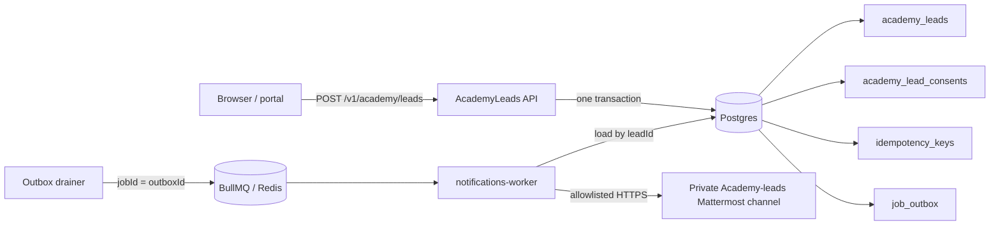
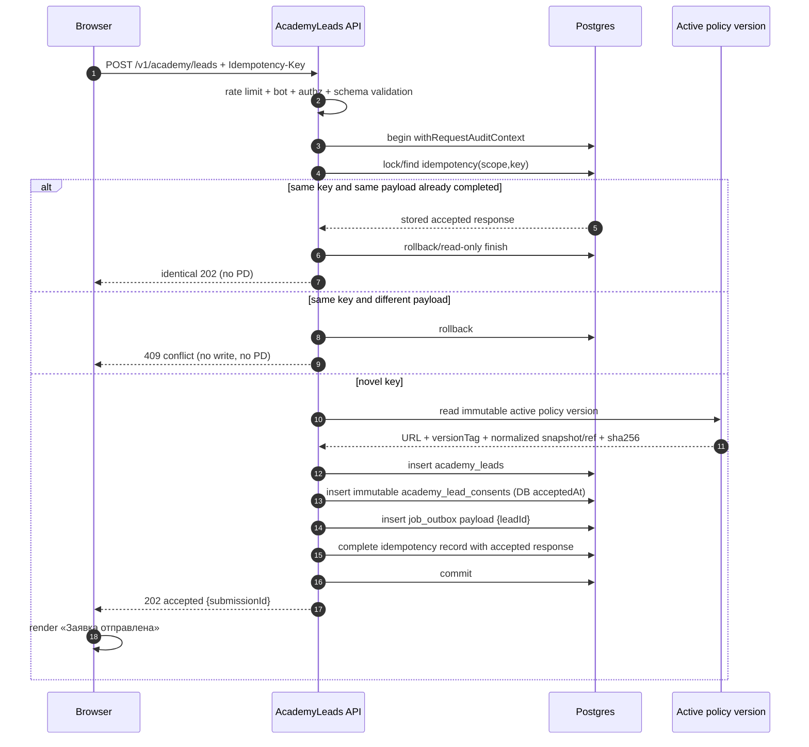
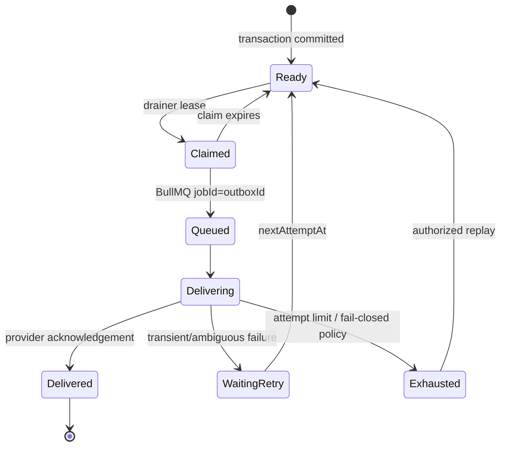

# 013 — Public Academy home and durable partner-lead capture (Design)

## 1. Architecture

Feature 013 is one user-facing vertical slice across `apps/portal`, `apps/api`, Postgres, a first production `job_outbox` drainer, and the independently configured `notifications-worker` process. The portal renders the immutable owner-curated home and submits a typed request. The API validates/protects it and atomically records the retained lead, immutable consent proof, outbox intent, audit context, and idempotency result. Delivery happens after commit and can fail/retry without changing visitor success.

The content/composition SoT is `013-product.md` plus the clean `apps/academy-demo` tree at `7330e4d8a99bdeca73285e2b4eabf09d7021788c`. Dynamic CMS/taxonomy reads are deliberately absent.



## 2. Portal composition and behavior

- `apps/portal/app/page.tsx` renders public `/`; the former permanent redirect is removed.
- Composition is exact: hero → What → People (Project block, then six experts) → Events → Why → Projects → partner value → formats → lead form → footer.
- Content and copied asset binaries come from the pinned source. Both Events and the People Project block consume one shared two-row constant; the B2B href includes `?r=wd` exactly. Six expert cards consume the six supplied WEBP portraits. Quantitative project metrics are not represented.
- All UI is composed from `@ds/design-system` primitives/tokens. Desktop/mobile navigation, menu, theme, login, canonical links, contact links, privacy link, CTAs, and form states are real.
- `/webinars` is the login default when no stronger resume target exists. An explicit authenticated request for `/` still renders the public home.
- The client creates a cryptographically random `Idempotency-Key` at the start of a valid submission and retains it until a definitive accepted/conflict/rejection result. A transport retry reuses that key and the same canonical payload.
- Client validation rejects missing name/contact/consent and malformed email-or-Telegram before any request. The form preserves valid fields and focuses the first actionable error.

## 3. Public API contract

`POST /v1/academy/leads`

```text
Headers: Idempotency-Key: <opaque random key>       required
Body:    { name, company?, contact, role?, consent: true }
202:     { status: "accepted", submissionId }       no PD echo
400:     generic typed validation errors             no PD echo
409:     idempotency key reused with different canonical payload
429:     generic retry-later response                 no contact/account oracle
```

Controller decorators are explicit: `@Public`, a dedicated Academy-lead `@RateLimited` scope, `@BotProtected("academy-lead")`, and high-stakes/audited `@Authz`. Zod schemas live in `packages/schemas`; no hand-written DTO diverges from the contract.

Canonicalization trims surrounding whitespace, normalizes the selected contact form without changing its identity, and uses a stable ordered representation for the payload hash. The database idempotency record binds `(scope, key)` to that hash and the opaque accepted response.

## 4. Atomic acceptance and consent



The consent record is purpose-built for a guest lead. It does not reuse `consent_records` unchanged because that model requires a user FK. Its restrictive FK prevents consent evidence from outliving or detaching from the retained lead while the retained-row lifecycle forbids cascade deletion. The server ignores any client-provided policy version/hash/time and stamps:

- exact URL `https://doctor.school/index/privacy-pay`;
- immutable active `versionTag`;
- normalized content snapshot or stable retained reference plus SHA-256;
- `acceptedAt = database clock`;
- request/audit metadata only as permitted by ADR-0009 and the retention matrix.

## 5. Data model

```mermaid
erDiagram
  ACADEMY_LEADS ||--|| ACADEMY_LEAD_CONSENTS : "restrictive lead_id"
  ACADEMY_LEADS ||--o{ JOB_OUTBOX : "payload leadId only"
  IDEMPOTENCY_KEYS }o--|| ACADEMY_LEADS : "completed response identifies"
  ACTIVE_POLICY_VERSIONS ||--o{ ACADEMY_LEAD_CONSENTS : "immutable version evidence"

  ACADEMY_LEADS {
    uuid id PK
    text name_encrypted
    text company_encrypted_nullable
    text contact_encrypted
    text role_nullable
    text status
    timestamptz created_at
    timestamptz deleted_at_nullable
  }
  ACADEMY_LEAD_CONSENTS {
    uuid id PK
    uuid lead_id FK_UK
    text policy_url
    text version_tag
    text normalized_snapshot_or_ref
    text content_sha256
    timestamptz accepted_at
  }
  JOB_OUTBOX {
    uuid id PK
    text kind
    jsonb payload_lead_id_only
    text status
    int attempts
    timestamptz claimed_until_nullable
    timestamptz next_attempt_at
    timestamptz delivered_at_nullable
  }
  IDEMPOTENCY_KEYS {
    text scope_key PK
    text canonical_payload_sha256
    jsonb response_without_pd
    text status
  }
  ACTIVE_POLICY_VERSIONS {
    uuid id PK
    text version_tag
    text policy_url
    text normalized_snapshot_or_ref
    text sha256
    timestamptz effective_from
  }
```

Exact encryption/key fields follow ADR-0009 implementation conventions. Before schema migration, `academy_leads`, `academy_lead_consents`, and `job_outbox` are classified in the code retention matrix. Ordinary lifecycle never issues `DELETE`, cascading delete, or partition drop. Audit masking registers every PD-bearing lead field.

## 6. Durable notification delivery

The feature introduces the repository's first live generic `job_outbox` producer/drainer and activates the first `notifications-worker` process. Postgres remains authoritative; Redis is a dispatch accelerator, never the only queue copy.

```mermaid
sequenceDiagram
  autonumber
  participant D as Outbox drainer
  participant DB as Postgres
  participant Q as BullMQ
  participant W as notifications-worker
  participant MM as Mattermost

  D->>DB: claim ready/expired job_outbox row
  D->>Q: add job(jobId = outboxId)
  D->>DB: record queued lease
  Q->>W: deliver outboxId (at least once)
  W->>DB: load outbox + lead by leadId
  W->>W: verify secret + RF/perimeter allowlist
  alt egress approved and Mattermost acknowledges
    W->>MM: minimum fields + stable lead id
    MM-->>W: acknowledged
    W->>DB: mark retained outbox delivered
    W-->>Q: ack
  else timeout / transient failure
    W->>DB: increment attempt; nextAttemptAt = backoff + jitter
    W-->>Q: retryable failure
  else destination not approved or secret absent
    W->>DB: retain pending/exhausted + PD-free alert code
    Note over W,MM: fail closed; no request sent
  else attempts exhausted
    W->>DB: retain exhausted, alert, enable authorized replay
    W-->>Q: terminal for automatic attempts
  end
```

An ambiguous timeout may mean Mattermost accepted the message before the connection failed. The message includes the stable lead id, allowing the private team to recognize duplicates; the worker remains consumer-idempotent at the outbox boundary and never creates another lead. Expired database claims are reclaimable after crashes.



## 7. Form state

```mermaid
stateDiagram-v2
  [*] --> Editing
  Editing --> Invalid: local validation fails
  Invalid --> Editing: visitor corrects input
  Editing --> Submitting: valid + consent + generated key
  Submitting --> Submitting: transport ambiguity; retry same key/payload
  Submitting --> Success: committed 202
  Submitting --> Editing: actionable definitive rejection
  Success --> [*]
```



Rate-limit/bot failures show a generic actionable retry message and retain non-sensitive input locally; they do not reveal whether any contact is already stored. The accepted response and UI never wait for Mattermost.

## 8. Secret, privacy, and egress controls

- `ACADEMY_LEADS_MATTERMOST_WEBHOOK_URL` is required by environment schema and deployment preflight for the worker only. API/portal containers do not receive it; there is no fallback to release `MATTERMOST_WEBHOOK_URL` and no `NEXT_PUBLIC_*` alias.
- The destination must be a private authorized Academy-leads channel. Only the minimum operational contact fields are sent; no consent snapshot, policy hash, IP, UA, or internal audit data is included.
- ADR-0011 is fail-closed: provider endpoint residency/perimeter is verified and allowlisted before enabling the worker. Missing proof means no egress; the retained lead/outbox remains pending/exhausted for later authorized replay.
- Structured logs use ids and classified error codes only. Logger serializers, exception filters, metrics labels, tracing attributes, audit before/after images, and test snapshots redact name/company/contact, webhook URL, and provider payload.

## 9. Minimal production file map

Indicative ownership; exact co-location may follow existing module layout without changing boundaries.

| Area     | Minimal files/responsibility                                                                                                                                                                                                                                                                                                              |
| -------- | ----------------------------------------------------------------------------------------------------------------------------------------------------------------------------------------------------------------------------------------------------------------------------------------------------------------------------------------- |
| Portal   | `apps/portal/app/page.tsx`; Academy-home section components/fixtures/assets; real mobile menu; lead-form client; login-resume default and Playwright tests.                                                                                                                                                                               |
| Schemas  | `packages/schemas/src/academy-leads.ts` request/response and canonical enum schemas; API client generation from OpenAPI.                                                                                                                                                                                                                  |
| API      | `apps/api/src/academy-leads/academy-leads.controller.ts`, service, repository, module, authz/rate-limit registration, API e2e.                                                                                                                                                                                                            |
| Database | Drizzle schemas/migration for `academy_leads`, `academy_lead_consents`, generic `job_outbox`; idempotency integration; retention matrix and audit masking entries.                                                                                                                                                                        |
| Outbox   | API-side generic outbox writer plus lifecycle-safe drainer/claim repository with recovery tests.                                                                                                                                                                                                                                          |
| Worker   | `apps/api/src/notifications-worker/` bootstrap/entrypoint, BullMQ consumer, Mattermost adapter, egress policy, environment schema, health/observability and integration tests. The deployed `notifications-worker` process uses the existing API image with this dedicated entrypoint, matching ADR-0012; it is not a new standalone app. |
| Deploy   | Compose/service declaration for the API-image `notifications-worker` process, worker-only secret injection, deploy preflight, operations notes/alerts/replay procedure.                                                                                                                                                                   |

**Stub graduation:** none. No existing stub package is being promoted. The `notifications-worker` is introduced/activated directly as a real production process with its durable dependency, health contract, tests, and deployment configuration; it is not a scaffold or placeholder.

## 10. Verification strategy

- **Portal Playwright:** exact source-pin content/order/assets, real controls, same two canonical rows, login `/webinars`, invalid no-request, valid submit, same-key ambiguous retry, success during notification outage/fail-closed, screenshots and axe for desktop/mobile × light/dark, plus hover/active/focus/loading/error/success.
- **API Vitest e2e:** public decorator/authz matrix, rate/bot protection, schema errors, atomic rollback, policy stamping, idempotency replay/conflict, PD-free responses.
- **Postgres integration:** restrictive lead-consent relation, DB-clock evidence, retention/masking lints, outbox payload `{leadId}`, claim expiry and recovery.
- **Worker integration:** Redis restart, duplicate BullMQ delivery, provider acknowledgement boundary, timeout retry/backoff/jitter, exhaustion/replay, worker-only secret, and ADR-0011 fail-closed.
- Every production test names its clause `it('EARS-N: …')`; the Gherkin file covers the complete browser story and principal failure branches.
