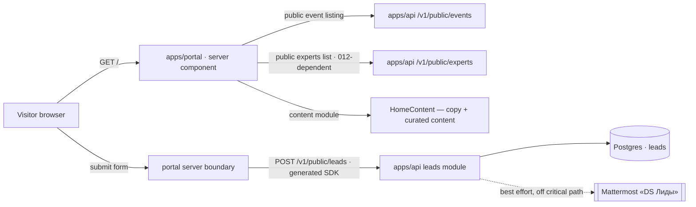
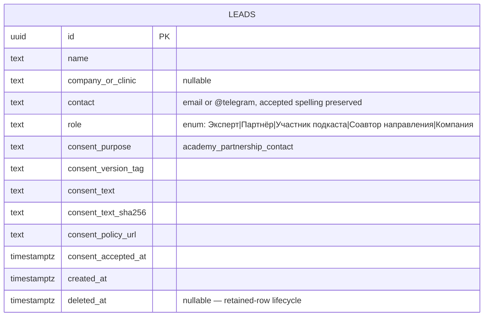
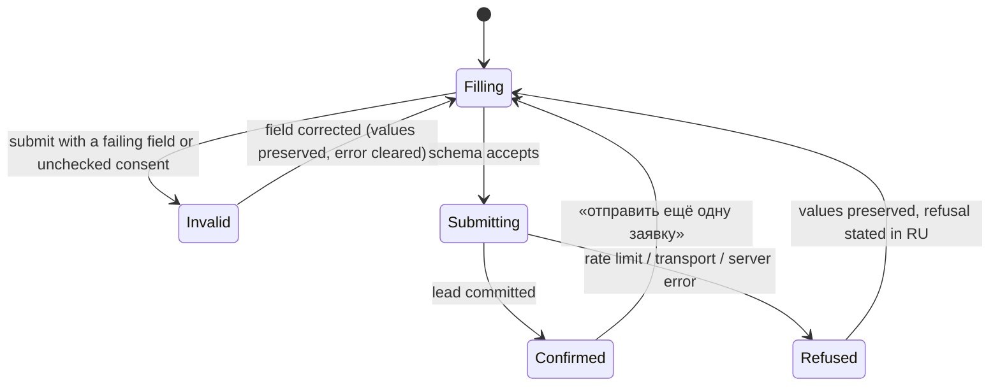
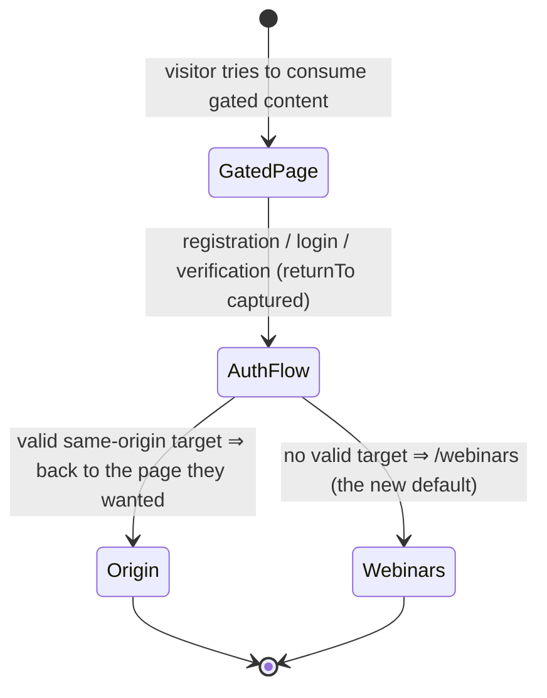

> Requirements: [`013-requirements-en.md`](./013-requirements-en.md) · [`013-requirements-ru.md`](./013-requirements-ru.md) · Scenarios: [`013-scenarios.feature`](./013-scenarios.feature) · PRD: [`013-product.md`](./013-product.md).
>
> Engineer-facing artifact, EN only (ADR-0006 §4).

# 013 — Academy home page and partner lead capture (Design)

## 1. Shape of the feature

Three things meet on one route:

1. **A composition** — the approved canvas rendered as a public server component (`independent`).
2. **Two reads** — feature 004's public event listing (`independent`) and feature 012's public experts list (`012-dependent`).
3. **One write** — the partner lead, with a persisted record and a channel notification (`independent`).

A fourth change lives off the page but ships with it: the post-login landing default moves from `/` to `/webinars` through feature 014's return-to-origin mechanism, which requires an amendment to feature 008 (live in production).

## 2. Composition — the canvas is the source of truth

Built from [`design-source/home.dc.html`](../../../../../../design-source/home.dc.html) in **variant «в»** (`variant: v`, the canvas prop default and the owner's Stage-A pick), plus the two units it `dc-import`s: [`webinar-card.dc.html`](../../../../../../design-source/webinar-card.dc.html) (rendered through feature 014's list unit) and [`expert-card.dc.html`](../../../../../../design-source/expert-card.dc.html).

The canvas encodes the section order as `order:` values on the flex `main`; for variant «в» they resolve to:

| #   | Section                                 | Anchor          | Data source                                | Wave                              |
| --- | --------------------------------------- | --------------- | ------------------------------------------ | --------------------------------- |
| —   | Split hero (doctor card + partner card) | —               | content module                             | independent                       |
| 1   | Эфиры feed                              | —               | feature 004 public listing → 014 list unit | independent                       |
| 2   | «Что такое Doctor.School» — 4 pillars   | —               | content module                             | independent                       |
| 3   | «Зачем» — dashed vs solid comparison    | —               | content module                             | independent                       |
| 4   | Ecosystem — «Что мы создаём»            | `#projects`     | content module (curated tiles)             | independent                       |
| 5   | People + podcast                        | `#people`       | feature 012 experts + content module       | 012-dependent (experts grid only) |
| 6   | Partner value band                      | `#partners`     | content module                             | independent                       |
| 7   | Participation formats                   | —               | content module                             | independent                       |
| 8   | Closing CTA + lead form                 | `#partner-form` | the lead write path                        | independent                       |

Structural notes taken from the canvas rather than from prose:

- The hero is two columns in one `auto-fit minmax(290px,1fr)` grid — the doctor column is a white raised card, the partner column an outlined block on the blue band. Below the breakpoint they stack; **neither column is tabbed, collapsed or dropped** (EARS-2).
- The feed list is `flex-direction: column` with `gap: 28px` on desktop and **full-bleed, borderless** below 900px (`margin: 0 -16px`, top rule) — the same mobile rhythm the webinar card canvas defines. That behaviour belongs to feature 014's unit, not to this page.
- In-page navigation is anchor-based (`#partner-form` from the hero, the value band and every format card), with `scroll-behavior: smooth` from the canvas.
- The composition switcher drawn bottom-left of the canvas is a design-review aid and **is not a product control**.
- The canvas's stat strips and tile counters are placeholder data — LD-4 governs them: real count or omitted.

## 3. Runtime topology



Two properties of this topology are deliberate:

- **The page is a server read.** The landing has no session dimension, so nothing on it is fetched from the browser; the feed and the experts grid are rendered from server-side reads (LD-1). The 014 unit is controlled and fetch-free (014 LD-7), which is exactly what makes this possible without forking it.
- **The write lives in the API.** The Mattermost credential is an API-only secret and the record is a Postgres row, so the portal posts through the generated SDK from its server side rather than owning the sink (LD-3).

## 4. Reads

### 4.1 Эфиры feed (EARS-3, EARS-4)

The feed asks feature 004's existing public event listing for its first page and renders the first three items. No home-specific endpoint, projection or ordering exists (LD-2) — the landing is a view of `/webinars`, so the two cannot disagree.

Rendering goes through feature 014's shared unit:

```ts
// consumed, not built — feature 014 owns this component (014 EARS-10, #1346)
<EventList items={items} />        // no tab bar, no pager, no facets on the home instance
```

`tab`, `counts`, `pageCursor`, `onTabChange` and `onPageChange` are the unit's props for the `/webinars` surface; the home instance supplies items only. A capability the home needs and the unit lacks is an Issue against 014's unit — never a home-local fork (EARS-3).

Failure and emptiness are page-local: a failed or empty listing read degrades **the section**, never the document (EARS-4), because the landing's other seven screens carry the argument on their own.

### 4.2 Experts grid (EARS-8, `012-dependent`)

One bounded read of `GET /v1/public/experts` (cursor envelope per ADR-0002), capped at the canvas's four cards, rendered through the expert-card unit with `name`, `professionalRole`, `credentials`, `affiliation`, `photoUrl`.

The canvas's «N эфиров» meta line is **omitted** (LD-13): 012's base reads carry no aggregates by design and forbid per-card relationship fan-out; the enriched expert read with counts belongs to feature 016. Until the 012 wave lands the grid is absent and the surrounding screen — its heading, its narrative and the podcast block — renders unchanged.

## 5. The lead write path

### 5.1 Data model



Retained per ADR-0003 §4: no physical delete, no cascade, no id reuse; an erasure request clears descriptive values in place and leaves the row. The consent group is the ADR-0009 §2.1 evidence semantics realized on the row itself rather than in `consent_records`, whose purpose model is account-scoped (LD-7).

### 5.2 Submission sequence

```mermaid
sequenceDiagram
  participant B as Browser (form)
  participant P as Portal server boundary
  participant A as API /v1/public/leads
  participant D as Postgres
  participant M as Mattermost «DS Лиды»
  B->>B: shared Zod schema — client validation
  B->>P: submit (values + Idempotency-Key)
  P->>A: POST /v1/public/leads
  A->>A: same shared Zod schema — authoritative validation
  A->>A: rate limit check
  A->>D: INSERT lead + consent evidence (idempotent)
  D-->>A: committed
  A-->>P: 201 accepted
  P-->>B: confirmation state replaces the form
  A-->>M: post lead (after commit, off the critical path)
  Note over A,M: failure ⇒ operational error with lead id, no personal data;<br/>lead stays persisted, visitor sees success
```

Ordering is the whole design: the record is committed **before** the visitor is told «yes», and the notification is dispatched **after**, so no failure mode can produce a confirmed-but-unrecorded lead or a recorded-but-denied one.

### 5.3 Form states



The canvas fixes the wording and the mechanics of the invalid branch (per-field message under the field, `⚠` marker, danger-tinted control) and the confirmed branch (check plate, «Заявка отправлена», the two-working-day promise, the re-submit affordance). The accessible error summary below submit, with focus moved to it, is the owner-approved pattern already shipped by the stub (LD-5).

### 5.4 What is reused from the interim stub, and what is replaced

| Stub artifact                                                                                                | Fate                                                                                                          |
| ------------------------------------------------------------------------------------------------------------ | ------------------------------------------------------------------------------------------------------------- |
| `lib/academy-partnership-schema.ts` (fields, roles, consent constants, policy URL)                           | **Promoted** to `packages/schemas` as the request SSOT (LD-5).                                                |
| Design-system primitives (`Button variant="on-primary"`, `NativeSelect`, `FormErrorSummary`, checkbox, link) | **Kept** — owner-approved, reusable, already in `@ds/design-system`.                                          |
| `lib/academy-partnership-store.ts` (private JSON files, `ACADEMY_SUBMISSIONS_DIR`)                           | **Replaced** by the `leads` table (LD-3). Migration of already-saved production submissions belongs to #1323. |
| `app/academy-partnership-action.ts` in-process rate limiter                                                  | **Replaced** by the API's shared rate limit (LD-9).                                                           |
| `app/academy-home-view.tsx` + its fixtures and copy                                                          | **Replaced.** No string is imported from it (Copy work).                                                      |

## 6. Post-login landing (EARS-15) and the feature-008 amendment

Today `/` is both the front door and the post-login landing: `DEFAULT_LANDING = "/"` in `apps/portal/lib/registration-resume.ts`, asserted by two tests in `apps/portal/app/login/page.test.tsx`, and pinned by **feature 008 EARS-7**, which is live in production.



Three consequences:

- The **mechanism** is feature 014's (014 EARS-6 / LD-6, Issue #1342): one signed same-origin `returnTo` in the portal auth entry. 013 does not add a second redirect rule (LD-12).
- The **default** changes from `/` to `/webinars`, in `registration-resume.ts` and in the two tests that pin it — a named deliverable of EARS-15's Issue, never a silent test edit.
- Feature **008 is amended, not rewritten**: `008-requirements-en.md` / `-ru.md` and `008-design.md` gain an amendment block naming 013 EARS-15 as its source, and the superseded clauses carry inline pointers to it (AGENTS.md §6). The 008 scenario that asserts landing on `/` is updated by EARS-15's Issue at delivery time, in the same way feature 007's transition assertion is owned by 014 EARS-18.

Sequencing is not optional: the moment `/` stops redirecting to `/webinars`, an unchanged default lands every doctor on the marketing page. EARS-1 and EARS-15 ship in the same release.

## 7. App-shell integration (EARS-16)

The landing renders inside feature 008's shell — blue header with the эфиры entry, the theme control and the auth affordance, the ≤900px burger menu, and the footer nav — and adds only its own footer partnership anchor and the canvas watermark.

The canvas header and footer draw **Проекты** and **Эксперты** entries. Those routes do not exist yet, so they are **not** added here (LD-10): the shell gains them with features 015 and 016, and until then the landing carries projects and experts as content with the onward controls omitted. Two tracked Issues restore them — omission with an Issue, never a disabled control, a `#` href or a placeholder page.

## 8. Copy as content (EARS-20)

Every string of the page — hero, pillar cards, comparison rows, ecosystem tiles, podcast rows, partner cards, format cards, form labels, error messages, confirmation text, the consent sentence — resolves from one structured content module. Two consequences the implementation must hold:

- A copy change is a one-file edit with no component, layout or test-selector change. Tests therefore address content by role and label, not by literal marketing text.
- The consent sentence is content **and** evidence: changing it changes the digest recorded with new leads (LD-7), so the constant and the version tag move together.

The shipped copy is reworked from the canvas draft in the approved tone; the owner's editorial pass is recorded before Stage-B GO.

## 9. Accessibility and mobile (EARS-17)

Both breakpoints × both themes, from the canvas: stacked hero, full-bleed feed list, stacked comparison, stacked form controls, the shell's burger menu. Every action is a real labelled element (the canvas already uses links and buttons, not clickable `div`s), every field is labelled and associated with its error, and focus is visible from the design system's own `:focus-visible` treatment. `playwright-axe` runs over the whole page with no serious or critical violations.

## 10. Test topology

| Layer                | Where                                                                                 | What it proves                                                                                                          |
| -------------------- | ------------------------------------------------------------------------------------- | ----------------------------------------------------------------------------------------------------------------------- |
| Schema unit          | `packages/schemas`                                                                    | Field rules, role enum and order, consent literal, both contact syntaxes.                                               |
| API e2e              | `apps/api/test/leads/*.e2e-spec.ts`                                                   | Validation parity, idempotent persistence, consent evidence, rate limit, notification isolation and failure.            |
| Portal component     | `apps/portal` unit tests                                                              | Content module resolution, error summary focus, confirmation state.                                                     |
| Browser (Playwright) | `apps/portal/e2e/academy-home*.spec.ts`, `apps/portal/e2e/post-login-landing.spec.ts` | The whole journey: guest doctor → feed → event page; partner → form → confirmation; post-login landing; mobile and axe. |
| BDD                  | `013-scenarios.feature`                                                               | Every EARS tag against the real portal → NestJS → Postgres stack.                                                       |

No clause is satisfied by a seeded card, a fake sink or a manual database step.
