# 014 — Event recordings and the archived-event page (Design)

Requirements: [`014-requirements-en.md`](./014-requirements-en.md) · PRD: [`014-product.md`](./014-product.md) · Canvases: `design-source/webinar-archive.dc.html`, `design-source/events-filter.dc.html`, `design-source/my-events.dc.html`.

Every EARS clause in the requirements carries a `wave: core | facets` tag. This design marks each section the same way, so an implementation Issue reads its layer boundaries and its wave from one place.

## 1. Architecture

014 is one vertical spanning `packages/db` (the retained `event_recordings` table, the `events.recording_expected_by` column and their migration), `packages/schemas` (the Zod/OpenAPI SSOT for recording admin commands, the source-free public projection and the authenticated playback contract), `apps/api` (admin commands, public reads, playback read, archive listing, facet reads), the generated `@ds/api-client`, `apps/admin` (the recordings panel on the existing feature-007 event detail) and `apps/portal` (the post-live page state, «Мои события», the `/webinars` tabs, and the shared list + facet units).

It adds no second content store and no new provider abstraction: the playable source reference reuses the `stream_provider` / `embed_ref` shape that `stream_config` already uses for the live room in feature 006.

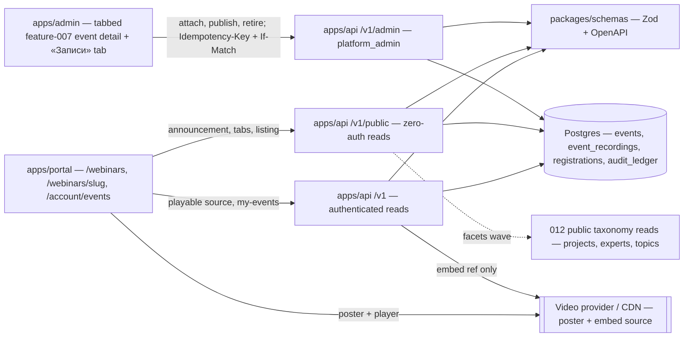

The single hard boundary in this design is the one drawn by the login gate: **`APIP` never emits a playable source.** That is a contract fact, asserted on the response body, not a rendering rule in the portal.

### 1.1 «Finished» is one state

Every 014 rule keyed on «finished» reads `EventLifecycleState = ended` and nothing else. `hidden` — the broadcast terminal state renamed from `archived` by EARS-28 — is deliberately excluded: feature 004 routes a cancelled or never-aired event `published -> hidden` and renders it as a notice with no CTA, absent from every public listing (`004-design.md` visibility policy, owner variant «а»). Treating `hidden` as post-live would hand a player to a broadcast that never happened and would contradict a merged contract. 014 therefore supersedes no 004 clause; the requirements carry the full state table.

That leaves one real gap, which §3.1 closes with a second lifecycle: the platform's own `ended` is unreachable for a broadcast the platform never hosted — `ended` sits behind `OpenRoom` + `CloseRoom`, so every эфир held before features 006/007 existed could never become finished and its recording could never be published. Such an эфир is not a platform event pushed into `ended` by a backfill command; it is a `legacy` event with its own two-state machine.

## 2. Data model (`wave: core`)

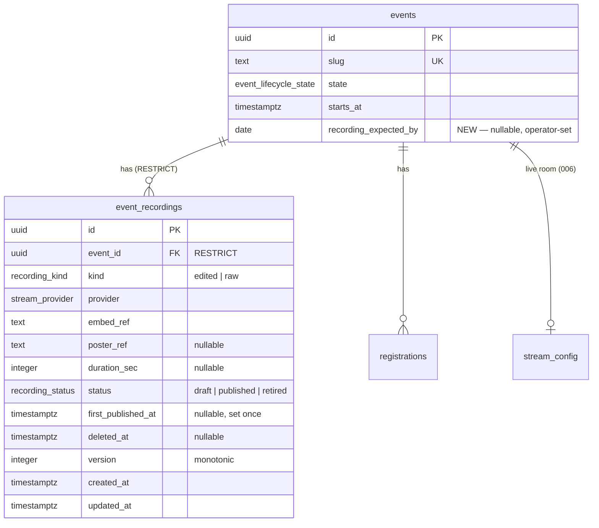

- New enums: `recording_kind ('edited','raw')`, `recording_status ('draft','published','retired')`.
- Partial unique index — the LD-1 at-most-one-per-kind rule, written so a retired row frees the slot:
  `CREATE UNIQUE INDEX event_recordings_event_kind_active_uniq ON event_recordings (event_id, kind) WHERE deleted_at IS NULL;`
- Read index for the projection and the listing badge:
  `CREATE INDEX event_recordings_event_published_idx ON event_recordings (event_id, kind) WHERE status = 'published' AND deleted_at IS NULL;`
- `events.recording_expected_by` is a `date`, not a timestamp: the plaque promises a day, and a timezone-bearing instant would invite a false precision the operator never entered.
- `event_id` is `RESTRICT` / `NO ACTION` per ADR-0003 §3.6. No 014 path issues `DELETE`.
- The table joins feature 010's generic audit trigger; there is no 014-specific audit table and no technical-table exclusion.

**Migration order.** One migration adds the two enums, the table, both indexes and the `events` column. It is additive and backward-compatible: existing event reads are unaffected until the projection ships, so the schema Issue can land ahead of the API Issue without a partial-deployment hazard.

## 3. Recording lifecycle (`wave: core`)

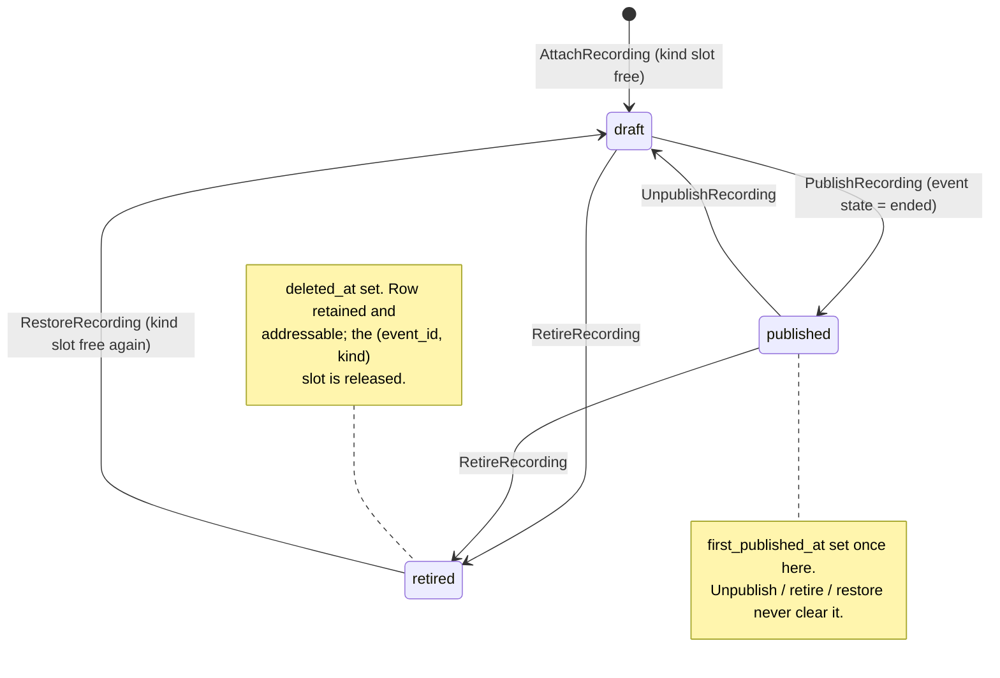

Refusals:

| Attempt                                                                      | Result                                                                                                             |
| ---------------------------------------------------------------------------- | ------------------------------------------------------------------------------------------------------------------ |
| Attach a kind that already has a non-retired row                             | 409 `RECORDING_KIND_OCCUPIED` naming that row                                                                      |
| Publish while a `platform` event is `draft`, `published`, `live` or `hidden` | 409 `EVENT_NOT_FINISHED` — publishing requires exactly `ended`; on a `legacy` event the gate does not apply (§3.1) |
| Restore while the kind slot is taken by another row                          | 409 `RECORDING_KIND_OCCUPIED`                                                                                      |
| Any transition not on the diagram                                            | 409 `INVALID_TRANSITION`                                                                                           |
| Stale `If-Match`                                                             | 412 `PRECONDITION_FAILED`, no mutation                                                                             |
| Any Delete attempt                                                           | No route exists — 404 from the router, never a soft delete                                                         |

### 3.1 The `legacy` broadcast lifecycle (`wave: core`)

Feature 007's transition set is closed and server-enforced, and `ended` sits behind `OpenRoom` + `CloseRoom`. An эфир held before features 006/007 existed never passed through the platform's room, so it can never legally reach `ended` — and under the §3 publish gate its recording could never be published. That is not an edge case: it is the launch content of the archive.

014 does **not** loosen the guard and adds no edge to 007's machine. The owner rejected that model on 2026-09-02, before it reached production: «Трансляция не может пройти вне платформы. […] у них же должен быть отдельный жизненный цикл, а не развилка из двух вариантов в одном ЖЦ.» and «сам дизайн жизненного цикла неправильный. Если это эфир, который прошёл ДО запуска платформы, то зачем там кнопка "Выйти в эфир"? Для него должен быть другой жизненный цикл!». Instead, a **second lifecycle** stands beside 007's, selected by a discriminator.

**The discriminator.** `events.origin: platform | legacy` is set once at creation and rejected by every update path (EARS-23). It picks the machine and never changes; no command moves an event between machines, and no event ever holds a state of the other machine.

**Machine 1 — `platform` (feature 007, unchanged by this design):**

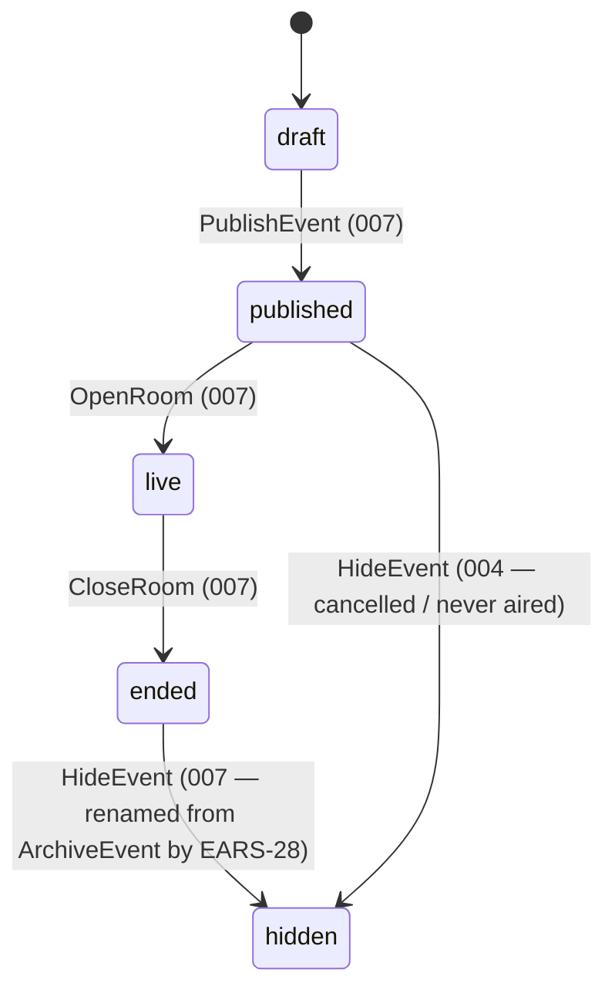

**Machine 2 — `legacy` (this design), the owner's shape verbatim, «два состояния — "Архивирован" (отображается в Архиве) и "Скрыто"»:**

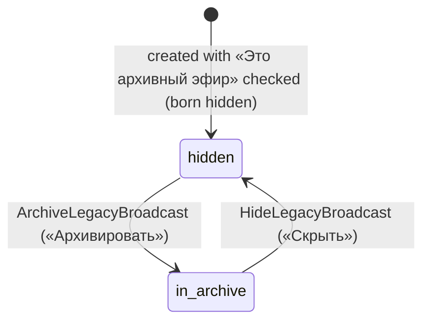

A `legacy` эфир is **born `hidden`**: the operator creates it with a title, a held-at instant, a duration, speakers and a recording, and it appears on no public surface until it is archived by an explicit act. It never acquires a room record, a stream config, a presence window or a `live` state, so its lifecycle bar can never offer «Выйти в эфир».

`ArchiveLegacyBroadcast` — admin label «Архивировать»:

| Aspect        | Contract                                                                                                                                                                   |
| ------------- | -------------------------------------------------------------------------------------------------------------------------------------------------------------------------- |
| Preconditions | `origin = legacy` **and** `state = hidden` **and** the эфир already carries a published, non-retired recording under 014's own recording rules                             |
| Effect        | `hidden → in_archive` in one transaction; from that instant the эфир is listed in the public archive exactly like an `ended` platform broadcast with a published recording |
| Authorization | ordinary `platform_admin` on the dedicated admin session — no new role, no elevation                                                                                       |
| Protocol      | `If-Match` on the event ETag + `Idempotency-Key`, exactly like every other lifecycle transition                                                                            |
| Refusals      | 409 `EVENT_NOT_FINISHED` when no published recording exists; 409 `INVALID_TRANSITION` from any other state or on a `platform` event — no mutation in either case           |
| Audit         | exactly one feature-010 row                                                                                                                                                |
| Admin UI      | derived from `EventAdminDetail.validTransitions` as 007 already does, so the control appears only when the precondition holds                                              |

`HideLegacyBroadcast` — admin label «Скрыть»:

| Aspect        | Contract                                                                                                              |
| ------------- | --------------------------------------------------------------------------------------------------------------------- |
| Preconditions | `origin = legacy` **and** `state = in_archive`                                                                        |
| Effect        | `in_archive → hidden`; the эфир leaves every listing, tab and count, and its direct link renders feature 004's notice |
| Authorization | ordinary `platform_admin`                                                                                             |
| Protocol      | `If-Match` + `Idempotency-Key`                                                                                        |
| Refusals      | 409 `INVALID_TRANSITION` from any other state or on a `platform` event, no mutation                                   |
| Audit         | exactly one feature-010 row                                                                                           |
| Admin UI      | derived from `EventAdminDetail.validTransitions`                                                                      |

**Mutual exclusion (both directions).** Every broadcast command — `PublishEvent`, `OpenRoom`, `CloseRoom`, `HideEvent`, `ConfigureStream` — invoked on a `legacy` event is refused with 409 `INVALID_TRANSITION` and no mutation; every legacy command — `ArchiveLegacyBroadcast`, `HideLegacyBroadcast` — invoked on a `platform` event is refused the same way. The admin lifecycle bar renders only the commands of the event's own machine, so the two vocabularies never appear together on one screen.

**The `archived → hidden` rename (EARS-28).** The broadcast terminal state is renamed `archived → hidden`, labelled «Скрыто», with its command `ArchiveEvent → HideEvent` labelled «Скрыть». Owner ruling, 2026-09-02: «Архивировать означает ровно одно — поместить в архив. […] Архив мы ПОКАЗЫВАЕМ и это легитимное название статуса. Явно надо переименовать этот статус в "Скрыто с платформы" или что-то вроде того, но точно не "Архивирован".» The meaning is unchanged — no platform surface lists the event, it stays admin-only, and a direct link renders feature 004's notice — so this is a data migration plus a contract rename, executed as one cutover across the database enum, the Zod contract, the generated SDK and both admin and portal copy, with no dual-read shim and no compatibility alias. With the word «Архив» freed, «Архивировать» is the legacy command and means precisely «поместить в архив».

Because feature 007 runs in production, the discriminator, the second machine and the rename are recorded across the 007 triplet as the **«Amendment — 2026-09-02»** block naming 014 as the source (AGENTS.md §6 amendment rule) rather than as an inline rewrite of its state machine — `007-design.md` §2, `007-requirements-en.md` and `007-requirements-ru.md` (inline pointers at the closed-set constraint, the transition policy, EARS-7, the invariant and verification row 7) and an annotated `007-scenarios.feature` example — so 007 does not contradict itself across files. The 2026-08-17 `published → ended` amendment is removed with it: it never reached production.

### 3.2 Recording backfill for platform-born эфиры (`wave: core`, EARS-29)

The эфиры this platform ran itself are already `ended` with a real `live_at`; only their recordings are missing. The backfill is therefore **a driver over the §3 commands, not a new mechanism**: no new table, no new enum, no schema migration, no second write path. It reads a manifest — one row per event (id or slug, an `edited` and/or a `raw` source as `provider` + `embed_ref`, an optional poster) — and for each row issues the ordinary `AttachRecording` + `PublishRecording` calls with a per-row `Idempotency-Key`, exactly as an operator would through the «Записи» tab. Everything the §3 diagram, the §11 error set and feature 010's audit capture already guarantee holds unchanged, because the same handlers execute.

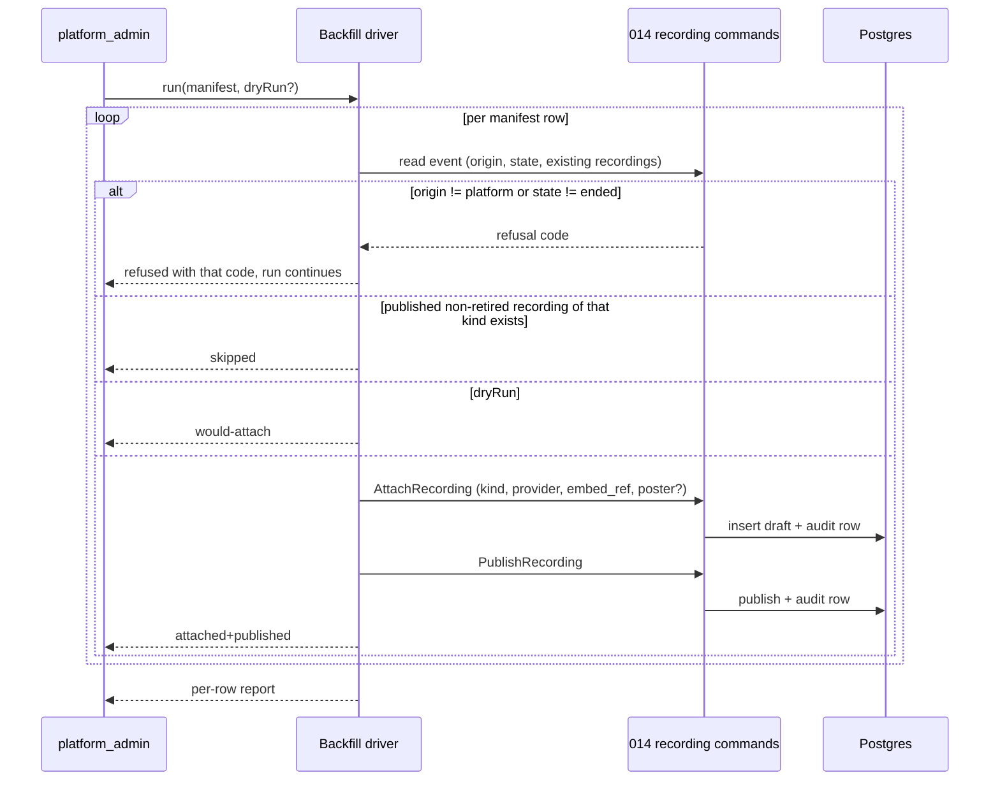

Refusals and outcomes, per manifest row:

| Row condition                                                    | Outcome                                                                                                                          |
| ---------------------------------------------------------------- | -------------------------------------------------------------------------------------------------------------------------------- |
| `origin: platform`, `state: ended`, kind slot free               | `attached+published` — two audit rows                                                                                            |
| The kind already has a published non-retired recording           | `skipped` — no write, no duplicate                                                                                               |
| The kind has a non-retired **draft**                             | `published` only — attach is skipped, publish runs                                                                               |
| `origin: platform`, state ≠ `ended` (incl. a passed `published`) | `refused(EVENT_NOT_FINISHED)` — 409, reported, the run continues                                                                 |
| `origin: legacy`                                                 | `refused(INVALID_TRANSITION)` — 409, per EARS-27; that path is [#1879](https://github.com/doctor-school/ds-platform/issues/1879) |
| Unknown event id or slug                                         | `refused` carrying the 404 the existing event read already returns — reported, the run continues                                 |
| Dry-run, any of the above                                        | The same verdict as `would-attach \| skipped \| refused(<code>)`, zero mutations                                                 |

**Idempotency.** The guard is the LD-1 partial unique index on `(event_id, kind) WHERE deleted_at IS NULL` plus the per-row `Idempotency-Key` — a re-run of the same manifest produces `skipped` on every row and writes nothing, and a partially failed run is safely resumed by re-running the whole manifest. The driver never writes `live_at`, `starts_at`, `state` or `origin`; the honest timestamps are the ones the room recorded.

**Not decided here.** A `published` platform event whose date has passed and which never went live is refused, not repaired: its exit is the `published → hidden` edge owned by [#1814](https://github.com/doctor-school/ds-platform/issues/1814). The delivery form of the run is the owner’s Stage-A choice recorded in the requirements Scope (2026-09-05, «1»): **an operator CLI in `apps/api`** — a `tsx` script under `apps/api/scripts/` in the pattern of the existing `reconcile:sweep` / `seed:events` commands, taking the manifest path and a dry-run flag, calling the same recording service the admin controller calls. No admin action, no admin route; this design is unchanged by that choice.

## 4. The derived projection (`wave: core`)

One resolver, `resolveRecordingProjection(eventId | eventIds)`, is the only place the display rule lives.

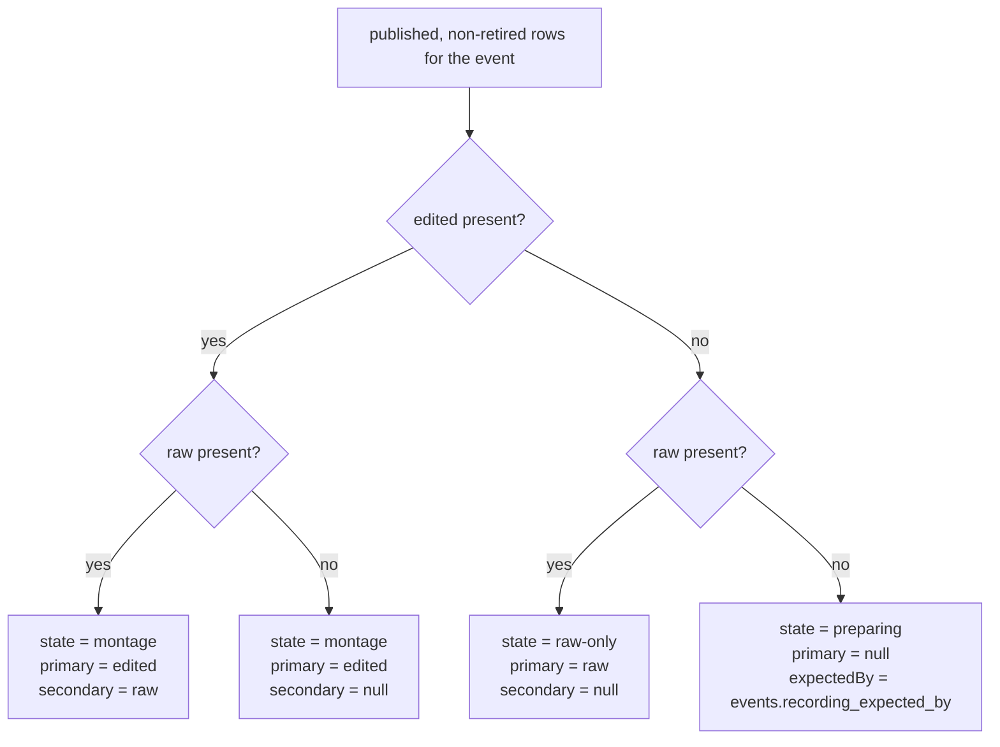

Four consumers, one resolver:

| Consumer                                  | What it takes from the projection                                  |
| ----------------------------------------- | ------------------------------------------------------------------ |
| `GET /v1/public/events/:idOrSlug`         | `state`, `primaryKind`, `secondaryKind`, `posterUrl`, `expectedBy` |
| `GET /v1/events/:idOrSlug/recordings`     | `primaryKind` / `secondaryKind` → the playable rows                |
| `GET /v1/public/events` (archive listing) | `state` only, as `PublicEventSummary.recordingState`               |
| `GET /v1/me/events`                       | `state` only, per registered past event                            |

The batch form takes an id array and returns a map, so a listing page resolves every card's badge in one statement — the LD-8 bounded-query rule. A per-card call is the N+1 shape review refuses.

## 5. The login gate as a read split (`wave: core`)

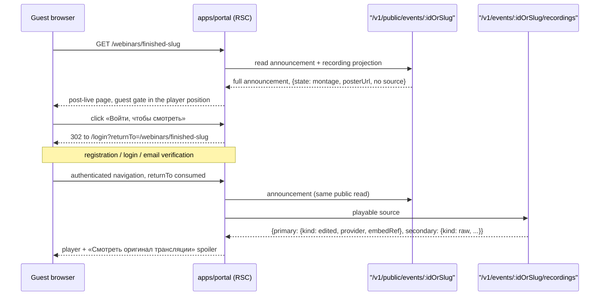

- The public read is identical for a guest and for a signed-in doctor, which keeps it cacheable and keeps one announcement projection under test.
- The authenticated read is the only source-bearing response in the feature. Its guard is `access: authenticated`; it checks no registration, no role, no attendance.
- A `preparing` event returns 200 with `{primary: null, secondary: null}` on the authenticated read too — the plaque is not an error.
- The API hands out an embed reference and never fetches the media, so it has no way to know the provider is unreachable. Player unavailability is therefore a **client** branch: the portal's player boundary treats a load error or a load timeout as the honest «запись временно недоступна» state with a retry action. There is no server status for it, and there must be no fake one.
- The portal renders the player in a client boundary that receives the `embedRef` from the server component; the source never lands in a public HTML payload for a guest.

## 6. Return-to-origin (`wave: core`, platform-wide rule)

The owner's rule is broader than 014: _any_ login-gated content returns the user to the page they were consuming. This design implements it once, as a portal-auth mechanism, and 014 is its first consumer.

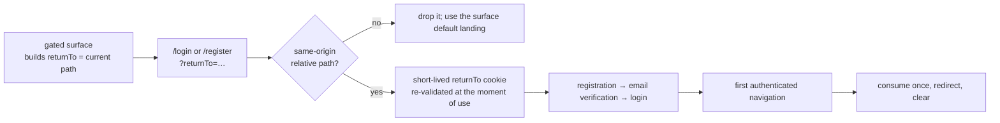

Rules the mechanism must satisfy:

- Accept only a relative path on this origin. An absolute URL, a protocol-relative `//host`, a backslash-escaped variant or a path escaping the app are dropped in favour of the default landing — the mechanism must never become an open redirect.
- The cookie carries no signature; its integrity control is re-running the same same-origin guard at the moment of consumption — a tampered value fails validation and falls back to the default landing, so a signature would add no property the guard does not already enforce.
- Survive the interruption of email verification, because the registration branch leaves the browser and comes back.
- Consume exactly once, then clear, so a later unrelated login does not teleport the user into an old page.
- Have a per-surface default landing when no target exists. For 013 that default is `/webinars` ([#1324](https://github.com/doctor-school/ds-platform/issues/1324)) — a default, never an override of a present target.

014 owns the mechanism and its `/webinars/[slug]` consumer. Carrying it into the 003/008 auth triplets and the 013 default is tracked outside this spec.

## 7. Operator surface (`wave: core`)

Recording poster and existing Event program-PDF authoring use shared file uploaders. Both support upload, replace and explicit remove, submit bytes rather than storage references, and atomically enqueue retained cleanup for superseded objects. Recording duration is extracted and validated from provider/file metadata after ingestion; it is read-only and never operator-authored.

All recording lists/selectors use the shared paginated combobox/list contract: every filter including text search applies immediately, active values render as chips, one Reset all clears them, and a control with no possible state change is disabled or absent.

The recordings panel is an own **«Записи» tab** of the existing feature-007 event detail in `apps/admin`, which this feature turns into a tabbed detail — not a new Refine resource tree. An operator attaches a recording while looking at the event, which is where they already are; the tab keeps the recording work out of the announcement fields it has nothing to do with.

The tabbed composition is the Product Lead's Stage-A pick — option B, 2026-08-17, recorded in [`014-product.md`](./014-product.md) → Approved mockup — and matches the 012 admin decision ([#1282](https://github.com/doctor-school/ds-platform/issues/1282)) so both admin verticals compose the same way. The surface stays stock Refine plus `@ds/design-system` primitives (admin carries no canvas by design, ADR-0004 §3). Every status-changing action — the lifecycle commands and the panel's publish / unpublish / retire / restore alike — confirms in a modal before it fires.

**The lifecycle bar renders the event's own machine and nothing else** (§3.1). On a `platform` event it offers 007's commands, with «Скрыть» as the terminal one; on a `legacy` event it offers exactly «Архивировать» and «Скрыть», derived from `EventAdminDetail.validTransitions` as 007 already does, so «Выйти в эфир» is never on a `legacy` эфир and the two vocabularies never share a screen.

**«Это архивный эфир» — a checkbox on the ordinary create-event form**, not a second entry and not a second page. There is ONE admin creation surface; checking the box switches it to the legacy variant: the date field reads «Дата и время проведения (МСК)», the partner field and the «Программа (PDF)» section disappear, and a mandatory «Запись» section appears (kind, provider, embed reference — and those only: a poster is a file to upload and a duration is read off the recording's metadata, per §7's opening paragraph and EARS-20, never typed on this form). Checked, the form posts `POST /v1/admin/legacy-broadcasts` instead of the ordinary multipart create; unchecked, the form behaves exactly as 007 authored it. The client never sends `origin` or `state` — the server selects the machine by route and creates the эфир with `origin: legacy` in `hidden`, and the operator archives it by the explicit «Архивировать» command once the recording is published. Owner decision, 2026-09-03: «Просто при создании мероприятия должна быть галочка "Это архивный эфир" и всё.» The automated import of old-platform broadcasts ([#1879](https://github.com/doctor-school/ds-platform/issues/1879)) lands events through this same route, never a second one.

```mermaid
sequenceDiagram
  participant OP as Operator (platform_admin)
  participant RF as apps/admin (Refine)
  participant API as "/v1/admin/events/:id/recordings"
  participant DB as Postgres

  OP->>RF: open event detail → Recordings panel
  RF->>API: POST (kind, provider, embedRef, poster?) + Idempotency-Key
  API->>DB: insert draft; partial unique index guards the kind slot
  DB-->>API: row v1
  API-->>RF: 201 + ETag
  OP->>RF: Publish
  RF->>API: POST :recordingId/publish + If-Match + Idempotency-Key
  API->>DB: check event finished; set published + first_published_at once
  API-->>RF: 200 + ETag v2
  Note over OP,RF: the public page changes by itself — no page edit
```

Panel contract: inside the «Записи» tab, one row per kind with its status chip, the source and poster fields, the action set from §3 behind modal confirmation, and the event-level readiness-date field beside it. No Delete control exists anywhere in the panel; retire is the terminal action and it is reversible.

## 8. Portal surfaces (`wave: core`)

The archived-event speaker projection consumes only 012's canonical eligible `event_experts` ordered by relation position after migration. It has no `event_speakers` fallback and performs no name matching.

### 8.1 `/webinars/[slug]` post-live state

Built from `design-source/webinar-archive.dc.html`, whose props map one-to-one onto the projection:

| Canvas prop                                   | Source                                                   |
| --------------------------------------------- | -------------------------------------------------------- |
| `viewer: authed \| guest`                     | session presence                                         |
| `recording: montage \| raw-only \| preparing` | `RecordingProjection.state`                              |
| `secondaryUi: spoiler`                        | fixed — the canvas default is the operative Stage-A pick |

The page is the same route and the same layout as the pre-live state; the hero, meta row, «О чём эфир» timecode rows, speaker/materials aside and bottom CTA are the canvas composition. The player card holds exactly one of: the player, the guest gate, the plaque, or the unavailability message.

**Content fields split across the two waves.** The `core` page renders every field of feature 004's existing `PublicEventPage` allow-list — title, school, start instant, duration, description, `speakers[]`, `specialties[]`, `partners[]`, `programPdfUrl?` — and is complete on its own. The event's **project(s) and topics** are 012 entities that the 004 projection does not carry, so they are EARS-19 in the `facets` wave; until it lands those two blocks are simply absent, never a placeholder or a «скоро» stub. This is why the `core` wave's «no 012 dependency» claim holds for the page as well as for the listing.

### 8.2 The shared event card / list / pagination unit

014 builds it (epic decision #7) because 014 starts before the 013 build. Two controlled, fetch-free components:

- `EventList` — props `items`, `tab`, `counts`, `pageCursor`, `onTabChange`, `onPageChange`; renders the `ВебинарКарточка` card, the tab bar and the pager.
- `EventFilters` — props `project`, `expert`, `topic`, `projects`, `experts`, `topics`, `counts`, `onChange`; the `events-filter.dc.html` shape exactly (`wave: facets`).

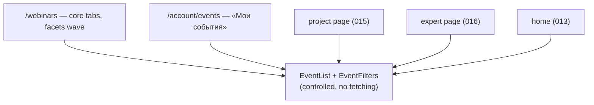

Because the unit does not fetch, the `facets` wave adds a capability to it without touching the `core` surfaces already consuming it — that is the whole reason for the controlled shape.

### 8.3 «Мои события»

Exactly two tabs — «Предстоящие» (default) and «Записи» — per the owner's canvas decision; the canvas's third «Сертификаты» tab is a review miss and is not built. Each tab is the full registration history for its side over `registrations ⋈ events`, with the projection's `state` supplying the per-row badge. The two tabs order in opposite directions, because each leads with the row the doctor came for: **Предстоящие** is nearest-first (`starts_at ASC`) so the most imminent эфир is on top — the order feature 005 already ships for this surface — while **Записи** is newest-first (`starts_at DESC`) so the most recently attended эфир leads. A single «newest first» rule across both would bury the next эфир under the furthest-future one. A past registered event with no recording is present and carries the preparing badge.

### 8.4 `/webinars` tabs

«Предстоящие · N | Прошедшие · N», mirroring the tab pattern already drawn on `project-page.dc.html` / `expert-page.dc.html`. Tab membership for the past tab is `ended` on a `platform` event and `in_archive` on a `legacy` one — the two are indistinguishable in the tab, its count and its cards (§3.1); feature 004's existing upcoming rule fills the other. `draft` and `hidden` are in neither tab and in neither count, whichever machine they belong to. The «Неделя | Месяц» views' rendering and the upcoming discovery behaviour are untouched — this is a refinement, not a redesign.

**State persistence follows LD-11** (requirements → Lead technical decisions): the selected tab, every facet value, the page cursor **and** the week/month view are query parameters of `/webinars`. One surface, one persistence rule — the week/month switcher moves onto the same mechanism rather than keeping its own, because mixed persistence on one page is a fidelity trap. The rationale (linkable filtered archive, reload and back/forward survival, and the fact that a deliberately fetch-free unit leaves the URL as the only place a server component can read the selection from) is recorded there as a lead decision, since the PRD left URL persistence to Stage A and no canvas carries it.

## 9. Facets (`wave: facets`)

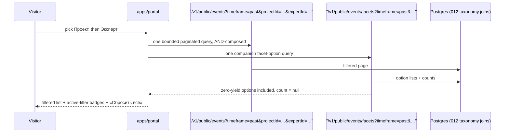

- AND across facets: project ∧ expert ∧ topic. Single-select per facet, per the canvas.
- A facet's option counts reflect the _other_ facets' current selections, not its own — otherwise selecting a value collapses its own list to one option.
- A zero-yield option is returned with `count: null` and stays selectable; the resulting empty page is a successful terminal-pagination response, not a 404.
- Filtering happens in SQL over 012's join tables with its published/active allow-lists at every hop. 014 stores no taxonomy and issues no per-card taxonomy call.
- An unknown or ineligible facet id is 404 `RESOURCE_NOT_FOUND` — it must not distinguish a draft or retired taxonomy record from a nonexistent one.

## 10. API surface

| Method | Path                                             | Access           | Wave   |
| ------ | ------------------------------------------------ | ---------------- | ------ |
| POST   | `/v1/admin/events/:id/recordings`                | `platform_admin` | core   |
| PATCH  | `/v1/admin/events/:id/recordings/:rid`           | `platform_admin` | core   |
| POST   | `/v1/admin/events/:id/recordings/:rid/publish`   | `platform_admin` | core   |
| POST   | `/v1/admin/events/:id/recordings/:rid/unpublish` | `platform_admin` | core   |
| POST   | `/v1/admin/events/:id/recordings/:rid/retire`    | `platform_admin` | core   |
| POST   | `/v1/admin/events/:id/recordings/:rid/restore`   | `platform_admin` | core   |
| GET    | `/v1/admin/events/:id/recordings`                | `platform_admin` | core   |
| PATCH  | `/v1/admin/events/:id` (`recordingExpectedBy`)   | `platform_admin` | core   |
| GET    | `/v1/public/events/:idOrSlug`                    | `public`         | core   |
| GET    | `/v1/public/events` (`timeframe`, cursor)        | `public`         | core   |
| GET    | `/v1/public/events/facets`                       | `public`         | facets |
| GET    | `/v1/events/:idOrSlug/recordings`                | `authenticated`  | core   |
| GET    | `/v1/me/events` (`tab=upcoming\|recordings`)     | `doctor_guest`   | core   |
| POST   | `/v1/admin/legacy-broadcasts`                    | `platform_admin` | core   |
| POST   | `/v1/admin/events/:id/archive-legacy`            | `platform_admin` | core   |
| POST   | `/v1/admin/events/:id/hide-legacy`               | `platform_admin` | core   |

No Delete route exists for any 014 resource. `/v1/public/events` and `/v1/public/events/:idOrSlug` are extensions of the existing feature-004 controllers, not new ones; `/v1/me/events` extends the existing feature-005 controller and keeps that feature's `doctor_guest` classification, so the endpoint-authz matrix carries one wording for it rather than two. EARS-29 adds no row to this table: the backfill drives the existing `POST …/recordings` and `POST …/recordings/:rid/publish` endpoints, and its entry point is the operator CLI of §3.2 (owner Stage-A choice, 2026-09-05) — not an admin route. The three legacy routes extend the feature-007 admin controller: `/v1/admin/legacy-broadcasts` is the «Архивный эфир» creation entry (EARS-24), and `/v1/admin/events/:id/archive-legacy` / `…/hide-legacy` carry the two commands of the legacy machine (EARS-25).

## 11. Errors

RFC 7807 Problem Details with `traceId` and an exact `errorCode`, per ADR-0002 §9.

| Status | Codes                                                                                           |
| ------ | ----------------------------------------------------------------------------------------------- |
| 400    | `VALIDATION_FAILED`, `CURSOR_INVALID`, `IDEMPOTENCY_KEY_INVALID`                                |
| 401    | `AUTHENTICATION_REQUIRED` (playback), `ADMIN_SESSION_REQUIRED` (admin)                          |
| 403    | `PLATFORM_ADMIN_REQUIRED`                                                                       |
| 404    | `RESOURCE_NOT_FOUND` (unknown/ineligible event, recording or facet id — one shape)              |
| 409    | `RECORDING_KIND_OCCUPIED`, `EVENT_NOT_FINISHED`, `INVALID_TRANSITION`, `IDEMPOTENCY_KEY_REUSED` |
| 412    | `PRECONDITION_FAILED`                                                                           |
| 428    | `IDEMPOTENCY_KEY_REQUIRED`, `PRECONDITION_REQUIRED`                                             |

014 defines **no 5xx of its own**, and deliberately no `RECORDING_SOURCE_UNAVAILABLE`: the API returns an embed reference and never fetches the media, so a server status for «source unreachable» would have no producer. The portal's player boundary owns the honest «запись временно недоступна» message and its retry action (§5, EARS-7 second branch); a dead or forever-spinning player is never an acceptable rendering of it.

## 12. Design-system and Stage gates

- Every new surface runs the `build-ui-from-design-system` gate first. Portal composition comes from the vendored canvases, read from the files rather than from prose; admin composition comes from the #1282/#1337 tabbed Refine decisions plus #1578 blocks/state matrices.
- The recorded canvas defaults are decisions, not questions: `secondaryUi: spoiler`; «Мои события» = two tabs; the `/webinars` past control = tabs mirroring the project and expert pages.
- The original portal-surface Stage A is recorded in `014-product.md` → «Approved mockup», and those portal surfaces continue to use the vendored canvases. Shared Stage A #1605 separately confirms that #1282/#1337 tabbed Refine compositions and #1578 design-system blocks are the baseline for the revised admin rework; Stage B remains a live-stand owner confirmation per changed surface before merge.
- `design-source/README.md` carries the note that the canvas's «Сертификаты» tab is out of 014's scope (owner, 2026-08-17, canvas review miss) — the vendored copy is not edited here, since it is a verbatim mirror of the owner's canvas.

## 13. Sequencing

Revised shared Stage A [#1605](https://github.com/doctor-school/ds-platform/issues/1605) completes before runtime rework. Delivery then stays within three bounded waves: **model/migration** [#1606](https://github.com/doctor-school/ds-platform/issues/1606) → [#1607](https://github.com/doctor-school/ds-platform/issues/1607) → [#1608](https://github.com/doctor-school/ds-platform/issues/1608) (EARS-21; blocked until 012's speaker cutover to `event_experts`); **reversible media/relations** [#1609](https://github.com/doctor-school/ds-platform/issues/1609), [#1610](https://github.com/doctor-school/ds-platform/issues/1610), [#1611](https://github.com/doctor-school/ds-platform/issues/1611) (EARS-20); then **shared UX** [#1297](https://github.com/doctor-school/ds-platform/issues/1297) before [#1612](https://github.com/doctor-school/ds-platform/issues/1612) (EARS-22). The first two waves are each at most three PRs.

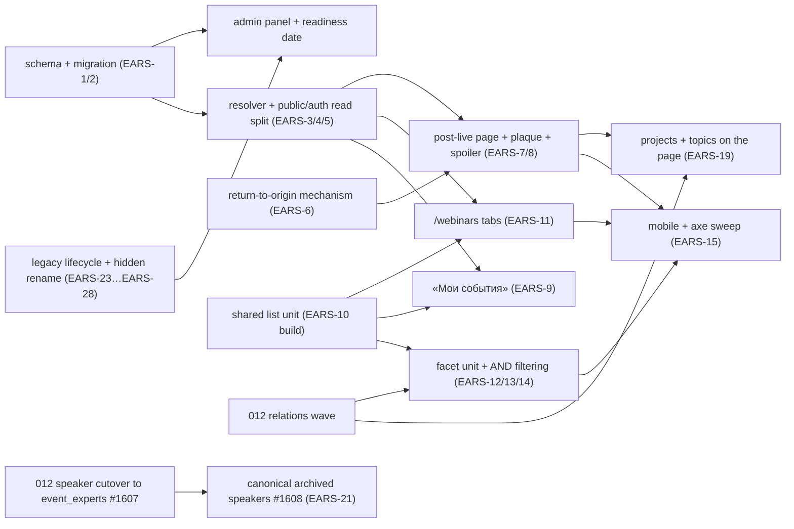

The original `core` runs end to end without the 012 track. The two taxonomy `facets` boxes wait on 012's relations wave, and the revised archived-speaker projection #1608 separately waits on #1607's cutover, after which it simply reads `event_experts`; it never reads a legacy free-text speaker row.

**The rename lands first, then the legacy lifecycle.** EARS-28 is a single cutover — migration, contract, generated SDK and labels in one step — and it is sequenced before EARS-23…EARS-27 so no two names for the terminal state ever coexist in the tree. The legacy lifecycle follows immediately: without it there is nothing in the archive but the platform's own room history, so the archive the PRD premises ships empty. It touches the `origin` discriminator, two command handlers, the «Архивный эфир» create surface and the 007 amendment, and it unblocks every downstream demonstration of the feature.

Two clauses are **process gates rather than code Issues** and must not be opened as implementation work: EARS-10's «the unit exists once and everyone consumes it» ownership rule (the unit's actual build lands with the first consuming surface, and the rule is verified by the unit contract test) and EARS-16's Stage-A/Stage-B gate (verified by the recorded owner artifacts).
