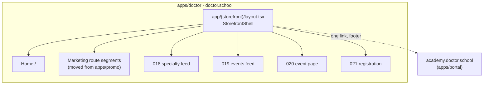
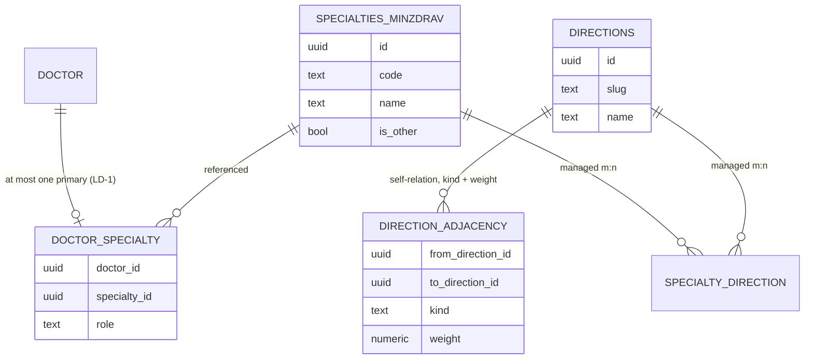
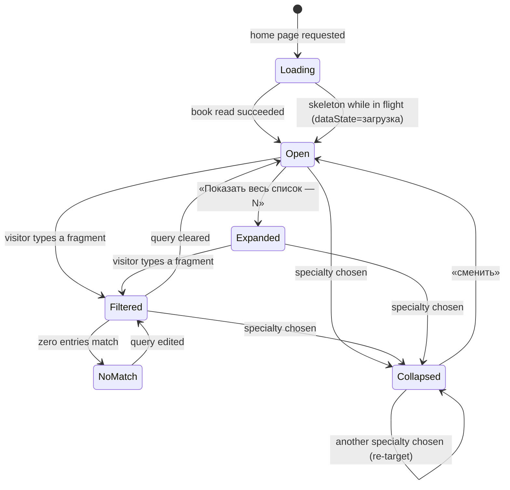
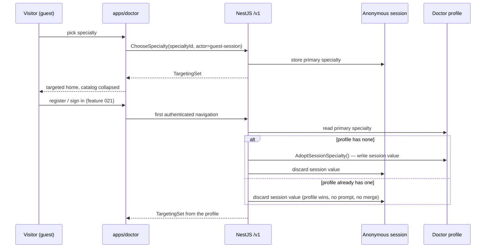
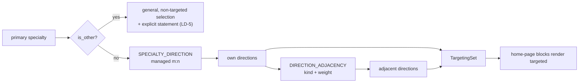

> Requirements: [`017-requirements-en.md`](./017-requirements-en.md) · PRD: [`017-product.md`](./017-product.md) · Scenarios: [`017-scenarios.feature`](./017-scenarios.feature)
>
> Composition source of truth: `design-source/doctor-home.dc.html` (screen `#d-home`), with the event card (`webinar-card.dc.html`) and the compact month calendar (`webinars-month.dc.html`) reused as-is.

# 017 — Design

## 1. Application and shell topology

`apps/doctor` is a new Next.js 15 application (ADR-0015 §2). The shell is one route-group layout; every doctor-facing route of 017 and of features 018–021 renders inside it. There is no second header, no per-page footer and no host-based routing branch.

**Shell composition** (canvas `d-home · шапка` / `d-home · футер`):

| Slot           | Guest                      | Signed in                       | Notes                                                                              |
| -------------- | -------------------------- | ------------------------------- | ---------------------------------------------------------------------------------- |
| Logo           | present                    | present                         | links to `/`                                                                       |
| Search slot    | reserved, **empty**        | reserved, **empty**             | LD-6 — the input lands with the feature that owns the results surface              |
| Theme control  | present                    | present                         | design-system primitive                                                            |
| Action cluster | «Войти» + «Регистрация»    | points plate + «Личный кабинет» | EARS-1 — exactly one cluster renders; the branch is server-resolved, not flickered |
| Footer col. 1  | logo + free-education line | same                            | —                                                                                  |
| Footer col. 2  | «Документы и контакты»     | same                            | agreement, PD policy, contacts                                                     |
| Footer col. 3  | «Academy.Doctor.School ↗»  | same                            | EARS-12 / LD-4 — the single Academy crossing on this surface                       |

The sign-in branch is decided on the server from the host-only session cookie (ADR-0015 §4) so no guest cluster is ever painted for a signed-in doctor and back.

## 2. The two reference books and what 017 reads

017 introduces no taxonomy of its own. It reads ADR-0016 §5's two books and the managed links between them.

- `SPECIALTIES_MINZDRAV` is **closed**: one row per entry of the Минздрав nomenclature order in force at ship time, plus the `is_other` row. The row count is a property of the seed, never a constant in code, spec or copy — the book is re-seeded when the order changes (current provenance: Приказ от 14.05.2026 № 435н, Раздел I, in force from 01.09.2026; it supersedes 700н, which expires 31.08.2026). No 017 path writes it.
- `DIRECTIONS` is the feature-012 `topics` row family extended per ADR-0016 §5 — not a third axis.
- `DOCTOR_SPECIALTY` carries `role = primary` (LD-1). One row per doctor today; the shape leaves room to raise the cap additively without a re-model.

## 3. Catalog state machine (Stage-A variant Б)

- **Open** renders the hero search field, the frequent set and the expand control (canvas `vB` branch).
- **Filtered** narrows over the **whole** book, not the frequent set (EARS-5).
- **NoMatch** keeps the query editable and «Другое» reachable — the canvas line «Ничего не найдено. Проверьте написание или выберите „Другое“.»
- **Collapsed** is the canvas `chosen` row: name + «сменить» + the adjacency explanation line.
- There is no **Blocked** state. Nothing about this machine gates the rest of the page (EARS-4).

## 4. Choice persistence and the sign-in cascade

LD-2 in one line: **adopt if empty, profile wins otherwise, never ask, never merge, never carry across devices.**

## 5. Targeting resolution

`TargetingSet` is resolved on read; there is no per-page targeting configuration and no cached targeting decision that can drift from the books.

Two rules the review enforces: nothing enters `TargetingSet` without a managed row behind it, and items reached only through `ADJ` are labelled adjacent in the UI — never as the doctor's own specialty (EARS-8).

## 6. Home-page block × `dataState` matrix

Every block resolves to exactly one render per state. An empty labelled box, a bare zero and an unresolving spinner are each defects.

| Block             | `обычно`                                    | `загрузка`           | `пусто`                                               | `ошибка`                                     |
| ----------------- | ------------------------------------------- | -------------------- | ----------------------------------------------------- | -------------------------------------------- |
| Hero + statistics | 4 counters + goal verbatim                  | counters as skeleton | a counter with no source is **omitted**, not zeroed   | counters omitted, hero copy intact           |
| Specialty catalog | variant Б open, or the collapsed chosen row | tile skeletons       | n/a — the book is closed and never empty              | error with retry; the page stays readable    |
| Nearest events    | cards + compact month calendar              | card skeletons       | «Пока ничего не запланировано…» + adjacent-areas link | «Не удалось загрузить события.» + «Обновить» |
| «Что исследовать» | **deferred (LD-8)** — nothing renders       | n/a                  | n/a                                                   | n/a                                          |
| Leaderboard       | consented rows + voluntary note             | row skeletons        | calm explanation instead of rows                      | error with retry, note still shown           |

The `loggedIn` × `specialtyChosen` axes multiply this: 4 × 2 × 2 renders per block are the review surface EARS-15 signs off. «Что исследовать» has no row to multiply — the composition reserves its slot between the events block and the leaderboard and 017 renders nothing in it (LD-8): the block has no read contract in §7, no endpoint and no content entity, and it lands with the features that own school, lesson and clinical-case content.

## 7. Read contracts

| Read                      | Access                                               | Shape                                                                    |
| ------------------------- | ---------------------------------------------------- | ------------------------------------------------------------------------ |
| specialty book            | `public`                                             | `SpecialtyBook` — full book + «Другое», `total`, stable ids              |
| frequent specialties      | `public`                                             | `FrequentSpecialties`                                                    |
| specialty search          | `public`                                             | `SpecialtySearchResult` — substring, case- and ё/е-insensitive           |
| scale statistics          | `public`                                             | `ScaleStatistics` with `computedAt` (LD-3)                               |
| home events               | `public`                                             | `HomeEvents` — general or targeted                                       |
| leaderboard               | `public`                                             | `Leaderboard` — consented rows only; `viewerHasConsent` null for a guest |
| choose / change specialty | `public` (guest session) / `authenticated` (profile) | idempotent; rejects a non-member specialty                               |

`SpecialtyBook` exposes `total` — the actual number of book entries served by the read — and every surface that shows a specialty count (the expand control «Показать весь список — N», the hero scale counter) binds to it; no surface carries a count literal.

Every failure is an RFC 7807 Problem Details document with `traceId` and an exact `errorCode` (ADR-0002).

## 8. Sequencing the build

1. **EARS-1** — the shell layout, after `apps/doctor` exists (#1440). Everything else renders inside it.
2. **EARS-3** — the reference-book read; the substrate of 4–8.
3. **EARS-2, EARS-4, EARS-5** — hero and the catalog in variant Б.
4. **EARS-6, EARS-7** — persistence, the collapsed row and re-choice.
5. **EARS-8** — targeting over the managed books; carries a `blocked_by` edge to the ADR-0016 §5 directions extension where that is not yet in place.
6. **EARS-9, EARS-11** — the remaining home-page sections; independent of each other. EARS-10 builds nothing here: its block is deferred per LD-8 and only its reserved slot exists.
7. **EARS-13** — inventory, owner confirmation, then the route move.
8. **EARS-14, EARS-15** — the accessibility/mobile bar and the design gate, run against each surface as it lands rather than at the end.
