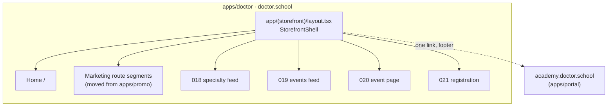
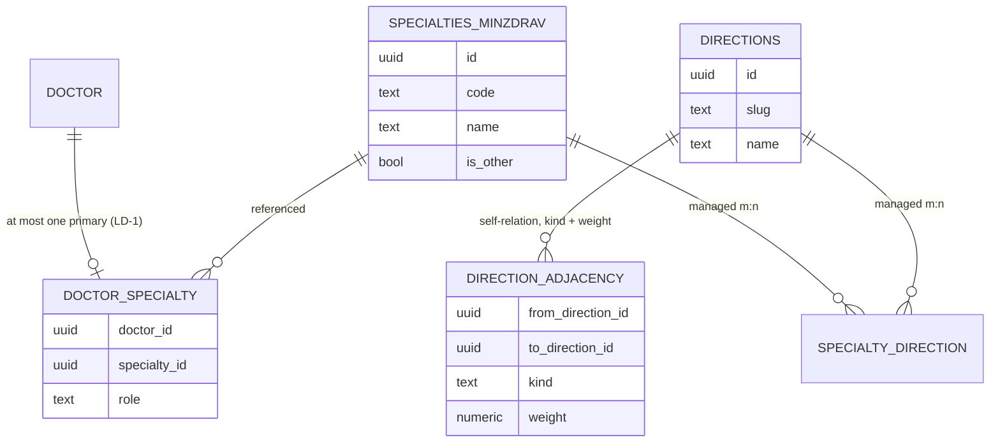
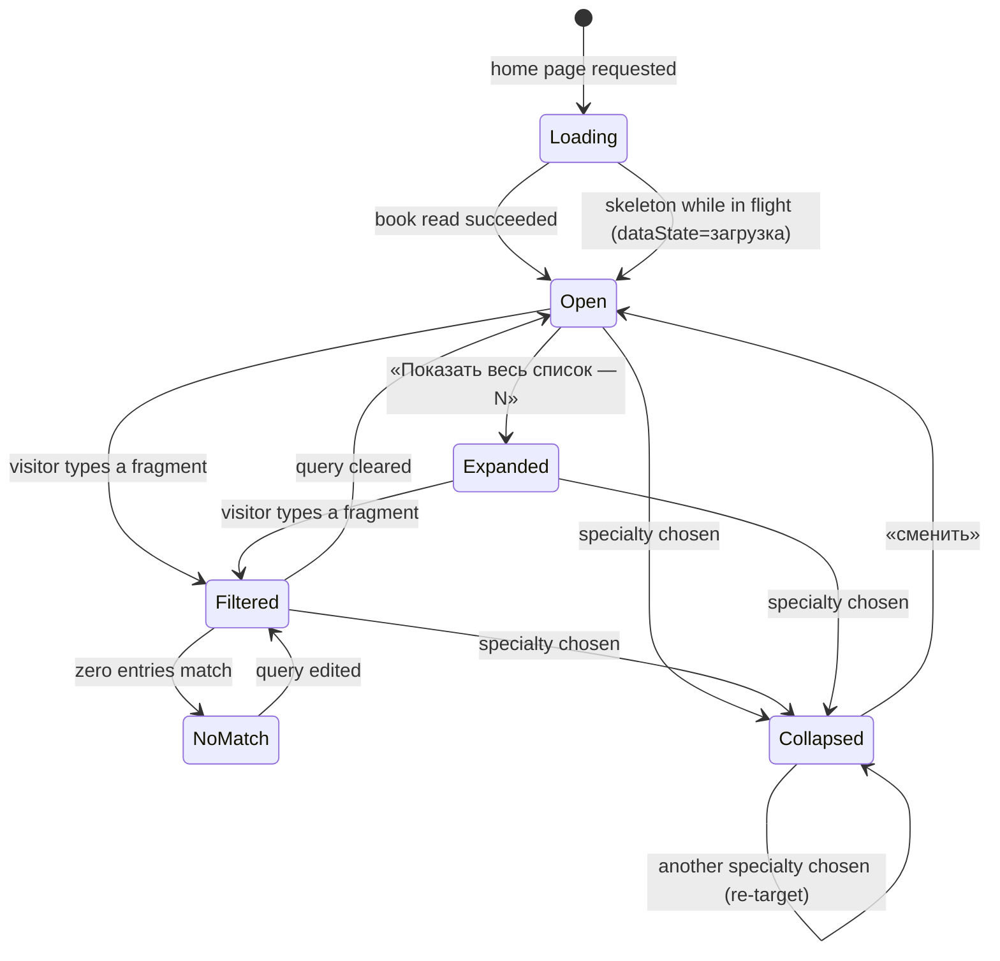
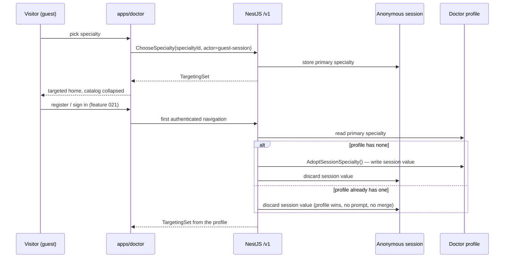
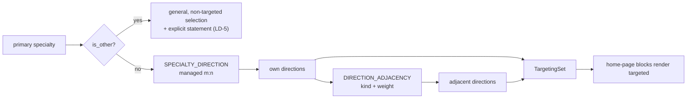

> Requirements: [`017-requirements-en.md`](./017-requirements-en.md) · PRD: [`017-product.md`](./017-product.md) · Scenarios: [`017-scenarios.feature`](./017-scenarios.feature)
>
> Composition source of truth: `design-source/doctor-home.dc.html` (screen `#d-home`), with the event card (`webinar-card.dc.html`) and the compact month calendar (`webinars-month.dc.html`) reused as-is.

# 017 — Design

## 1. Application and shell topology

`apps/doctor` is a new Next.js 15 application (ADR-0015 §2). The shell is one route-group layout; every doctor-facing route of 017 and of features 018–021 renders inside it. There is no second header, no per-page footer and no host-based routing branch.

**Shell composition** (canvas `d-home · шапка` / `d-home · футер`):

| Slot           | Guest                      | Signed in                       | Notes                                                                              |
| -------------- | -------------------------- | ------------------------------- | ---------------------------------------------------------------------------------- |
| Logo           | present                    | present                         | links to `/`                                                                       |
| Search slot    | reserved, **empty**        | reserved, **empty**             | LD-6 — the input lands with the feature that owns the results surface              |
| Theme control  | present                    | present                         | design-system primitive                                                            |
| Action cluster | «Войти» + «Регистрация»    | points plate + «Личный кабинет» | EARS-1 — exactly one cluster renders; the branch is server-resolved, not flickered |
| Footer col. 1  | logo + free-education line | same                            | —                                                                                  |
| Footer col. 2  | «Документы и контакты»     | same                            | agreement, PD policy, contacts                                                     |
| Footer col. 3  | «Academy.Doctor.School ↗»  | same                            | EARS-12 / LD-4 — the single Academy crossing on this surface                       |

The sign-in branch is decided on the server from the host-only session cookie (ADR-0015 §4) so no guest cluster is ever painted for a signed-in doctor and back.

## 2. The two reference books and what 017 reads

017 introduces no taxonomy of its own. It reads ADR-0016 §5's two books and the managed links between them.

- `SPECIALTIES_MINZDRAV` is **closed**: one row per entry of the Минздрав nomenclature order in force at ship time, plus the `is_other` row. The row count is a property of the seed, never a constant in code, spec or copy — the book is re-seeded when the order changes (current provenance: Приказ от 14.05.2026 № 435н, Раздел I, in force from 01.09.2026; it supersedes 700н, which expires 31.08.2026). No 017 path writes it.
- `DIRECTIONS` is the feature-012 `topics` row family extended per ADR-0016 §5 — not a third axis.
- `DOCTOR_SPECIALTY` carries `role = primary` (LD-1). One row per doctor today; the shape leaves room to raise the cap additively without a re-model.

## 3. Catalog state machine (Stage-A variant Б)

- **Open** renders the hero search field, the frequent set and the expand control (canvas `vB` branch).
- **Filtered** narrows over the **whole** book, not the frequent set (EARS-5).
- **NoMatch** keeps the query editable and «Другое» reachable — the canvas line «Ничего не найдено. Проверьте написание или выберите „Другое“.»
- **Collapsed** is the canvas `chosen` row: name + «сменить» + the adjacency explanation line.
- There is no **Blocked** state. Nothing about this machine gates the rest of the page (EARS-4).

## 4. Choice persistence and the sign-in cascade

LD-2 in one line: **adopt if empty, profile wins otherwise, never ask, never merge, never carry across devices.**

## 5. Targeting resolution

`TargetingSet` is resolved on read; there is no per-page targeting configuration and no cached targeting decision that can drift from the books.

Two rules the review enforces: nothing enters `TargetingSet` without a managed row behind it, and items reached only through `ADJ` are labelled adjacent in the UI — never as the doctor's own specialty (EARS-8).

**An empty targeted set is honest, not a failure.** A non-«Другое» specialty with no managed `SPECIALTY_DIRECTION` rows resolves to `mode: "targeted"` with empty `directions` — and therefore empty adjacent directions, since adjacency is reachable only through the doctor's own rows. That is the truthful answer: the specialty _is_ targeted, the managed books simply hold no rows behind it yet. Consumers MUST render their documented `пусто` state from the §6 matrix — nearest events show «Пока ничего не запланировано…» with the adjacent-areas link, the leaderboard shows its calm explanation. Silently falling back to general or non-targeted content is forbidden: unmanaged content would enter the doctor's view without a managed row behind it, breaking the first rule above.

`mode: "general"` with the explicit LD-5 statement is reserved for «Другое» and nothing else. Consumers must never infer generality from emptiness — the two states are distinguished by `mode`, never by the size of `directions`. This contract binds the block consumers #1485 (nearest events) and #1487 (leaderboard).

## 6. Home-page block × `dataState` matrix

Every block resolves to exactly one render per state. An empty labelled box, a bare zero and an unresolving spinner are each defects.

| Block             | `обычно`                                    | `загрузка`           | `пусто`                                               | `ошибка`                                     |
| ----------------- | ------------------------------------------- | -------------------- | ----------------------------------------------------- | -------------------------------------------- |
| Hero + statistics | 4 counters + goal verbatim                  | counters as skeleton | a counter with no source is **omitted**, not zeroed   | counters omitted, hero copy intact           |
| Specialty catalog | variant Б open, or the collapsed chosen row | tile skeletons       | n/a — the book is closed and never empty              | error with retry; the page stays readable    |
| Nearest events    | cards + compact month calendar              | card skeletons       | «Пока ничего не запланировано…» + adjacent-areas link | «Не удалось загрузить события.» + «Обновить» |
| «Что исследовать» | **deferred (LD-8)** — nothing renders       | n/a                  | n/a                                                   | n/a                                          |
| Leaderboard       | consented rows + voluntary note             | row skeletons        | calm explanation instead of rows                      | error with retry, note still shown           |

The `loggedIn` × `specialtyChosen` axes multiply this: 4 × 2 × 2 renders per block are the review surface EARS-15 signs off. «Что исследовать» has no row to multiply — the composition reserves its slot between the events block and the leaderboard and 017 renders nothing in it (LD-8): the block has no read contract in §7, no endpoint and no content entity, and it lands with the features that own school, lesson and clinical-case content.

## 7. Read contracts

| Read                      | Access                                               | Shape                                                                    |
| ------------------------- | ---------------------------------------------------- | ------------------------------------------------------------------------ |
| specialty book            | `public`                                             | `SpecialtyBook` — full book + «Другое», `total`, stable ids              |
| frequent specialties      | `public`                                             | `FrequentSpecialties`                                                    |
| specialty search          | `public`                                             | `SpecialtySearchResult` — substring, case- and ё/е-insensitive           |
| scale statistics          | `public`                                             | `ScaleStatistics` with `computedAt` (LD-3)                               |
| home events               | `public`                                             | `HomeEvents` — general or targeted                                       |
| leaderboard               | `public`                                             | `Leaderboard` — consented rows only; `viewerHasConsent` null for a guest |
| choose / change specialty | `public` (guest session) / `authenticated` (profile) | idempotent; rejects a non-member specialty                               |

`SpecialtyBook` exposes `total` — the actual number of book entries served by the read — and every surface that shows a specialty count (the expand control «Показать весь список — N», the hero scale counter) binds to it; no surface carries a count literal.

The guest half of «choose / change specialty» is the only unauthenticated WRITE on this surface, and each accepted call mints an `idempotency_keys` row keyed by a caller-chosen header, so it carries the EARS-13 rate limiter (`@RateLimited`, 003 F6) — with its OWN bucket, not the auth surface's. The decorator takes a scope tag (`storefront:specialty-choice`); the limiter keys its source-address windows inside that tag, so this route can neither exhaust nor be exhausted by the ceiling `/v1/auth/register`, login and `password/reset` share. The budget is 20 requests / 15 minutes **per source address as the api resolves it**, and no other dimension engages: the body carries no `identifier`/`email`/`phone`, so there is no per-user window, and the per-ASN ceiling is inert because no infrastructure layer sets `x-asn` in this deployment. The refusal is a generic 429 problem naming neither threshold nor dimension.

What that bounds today is stated plainly, because the deployed topology does not resolve the caller: `trustProxy` is unconfigured and nothing reads `x-forwarded-for` (tracked platform-wide as #1655), while guest calls reach the api through the doctor app's server-side `/v1/:path*` rewrite — so every visitor presents as one source address. Until #1655 lands, the effective production behaviour of this control is therefore a SINGLE shared 20 / 15 min bucket for the route: enough to bound anonymous `idempotency_keys` growth globally, which is what the D2 finding asked for, and explicitly not a per-caller control. Once the real-client-IP chain is established the same keying becomes per caller with no change here.

Every failure is an RFC 7807 Problem Details document with `traceId` and an exact `errorCode` (ADR-0002).

## 8. Sequencing the build

1. **EARS-1** — the shell layout, after `apps/doctor` exists (#1440). Everything else renders inside it.
2. **EARS-3** — the reference-book read; the substrate of 4–8.
3. **EARS-2, EARS-4, EARS-5** — hero and the catalog in variant Б.
4. **EARS-6, EARS-7** — persistence, the collapsed row and re-choice.
5. **EARS-8** — targeting over the managed books; carries a `blocked_by` edge to the ADR-0016 §5 directions extension where that is not yet in place.
6. **EARS-9 API/read, EARS-11** — the remaining home-page data slices; independent of each other. EARS-9's API projection may land here, but its rendered composition and mandatory working «Все события» CTA wait for the product-complete `/events` integration [#1516](https://github.com/doctor-school/ds-platform/issues/1516); no blank route, placeholder or «скоро» front door satisfies that dependency. EARS-10 builds nothing here: its block is deferred per LD-8 and only its reserved slot exists.
7. **EARS-13** — inventory, owner confirmation, then the route move.
8. **EARS-14, EARS-15** — the accessibility/mobile bar and the design gate, run against each surface as it lands rather than at the end.

The admin clauses (EARS-16…EARS-20) run on their own track: they touch `apps/admin` and `packages/design-system`, not `apps/doctor`, so they neither wait on #1440 nor block the storefront sequence above.

## 9. Admin maintenance surfaces

017 owns the operator side of the two reference books because the storefront reads them and nothing else does: targeting is only as good as the rows an operator can maintain (EARS-8), and a book with no maintenance surface is maintained by hand in SQL — a workaround AGENTS.md §6 forbids. The surfaces live in `apps/admin`, over the same API the storefront reads.

### 9.1 The block tier is the constitution

Every surface here composes the `@ds/design-system` block tier (`packages/design-system/src/blocks/`) — `DataTable`, `FilterBar`, `Combobox`, `EmptyState`, `Pagination` and the `Field`/`FormSection` family — landed under #1578 and documented in the showcase. This design does not restate the token or interaction-state rules: they are the design-system constitution and ADR-0013, and the showcase page for each block is the reference render. What is spec-level is that an admin section composes those blocks and never hand-assembles a table, a toolbar or a chip of its own — a section-local list is a defect, not a variation.

### 9.2 List surfaces (EARS-16)

| Breakpoint | Render                                                                                                       |
| ---------- | ------------------------------------------------------------------------------------------------------------ |
| ≥ md       | Two-line record row: title on the first line, wrapping in full; a muted context line beneath. No truncation. |
| < md       | Record card per row — the same fields stacked. **Never** a horizontally scrolled table.                      |

Truncation and horizontal scroll are both refusals of the same kind: a Russian reference title that does not fit is a title the operator must read in full, so the row grows instead of the text shrinking.

The «Действия» column is conditional on cardinality: **one** action per record ⇒ no column, and the whole row is the affordance (a click anywhere opens the record); **two or more** ⇒ the column, with the row click still opening the record. This is why the column is not a `DataTable` default — the block takes the actions it is given, and a section that passes exactly one is rendering a column of identical buttons beside a row that already opens.

Navigation labels follow the entity the section maintains: the link surface is «Связи специальностей», not «Специальности» — the section maintains the link between the two books, and the closed book itself is a separate, read-only entry (§9.4).

### 9.3 Filters (EARS-17) and record surfaces (EARS-18)

Filters apply on change: text search debounced ≈400 ms, every other control immediately. `FilterBar`'s apply-mode is therefore fixed to instant: no «Применить» exists on a surface rebuilt on the block tier, and none anywhere in the admin application once EARS-20 converts the last feature-012 section — until then the unconverted sections keep their mixed apply model, which is what EARS-20 exists to end. The applied set renders as removable chips with «Сбросить всё» beside them, so the current narrowing is always readable off the screen rather than reconstructed from the controls.

Record surfaces:

- **Tabs are conditional.** One tab ⇒ no tab bar at all. A single-tab bar is chrome that states nothing.
- **Ruled sections.** A record form is one framed panel whose sections are separated by hairlines, each led by a statement heading with its explanatory line, composed from the `Field`/`FieldSet`/`FieldGroup` family of the block tier. The section, not the field, is the unit of scanning: an operator reads what a group is for before reading what is in it, and a section that needs its own card is a section that belongs on its own tab.
- **«Вид связи»** is a closed vocabulary rendered through `Combobox`, each option carrying an explanation line — an operator picking an adjacency kind is making a taxonomy decision and needs to know what each kind means at the point of choice. The stored value stays the existing slug; the RU label is presentation. The constraint moves from the `kind` CHECK to an enum in `packages/db` and `packages/schemas` so the vocabulary is closed in one place and the SDK regenerates from it. That is an intended API change, not a compatibility break to route around: the accepted value set is unchanged.
- **«Вес»** is absent from the operator interface. Weight is a tuning parameter of the targeting resolution, not an editorial decision, and a number an operator cannot reason about is a number they will guess at. The declared default applies server-side; changing the weighting model is a code change with a test, not a field.
- **«Адрес страницы»** (the slug) is derived, never authored: transliterated from the Russian title on create, frozen on first publish so no live URL moves, and rendered nowhere — list, record and create form alike. The Stage-A pick is full hiding, so the block tier's `FormDerivedNote` affordance is deliberately **not** used for the address: a note explaining a field the operator never sees re-introduces that field as prose. The affordance stays in the block tier for genuinely visible derived values elsewhere.
- **Status chips** use the semantic tint tokens (`success-tint` / `warning-tint` with `text-foreground`); a bare `bg-tint` badge sits on the same ground as the row hover state and disappears under the cursor. There is no `warning-text` token, and inventing one is out of scope here.

### 9.4 The closed book, read-only (EARS-19 · LD-9)

`specialties_minzdrav` gets a list surface over the public read of EARS-3 — the same one the storefront calls — with the DataTable patterns of §9.2 and no write affordance in any state. The book is re-seeded from the nomenclature order in force (§2); the admin surface exists so the operator can see the other side of the link they maintain, and API write paths against it stay refused whether or not a UI offers them.

### 9.5 Sequencing and fixtures (EARS-20)

The three reference-book sections are rebuilt on the blocks first, on the #1575 branch under #1483. The remaining admin sections — events, experts, partners, projects and topics, delivered by feature 012 — are converted afterwards as a separate PR under #1578 in the same wave; splitting the conversion keeps the reference-book slice reviewable and lets the pattern settle before it is applied eight times.

Fixtures are production-representative wherever a stand is put in front of the product owner, e2e seeds included: real Russian titles that produce real transliterated addresses. A stand seeded with `x` rows cannot answer the questions Stage B asks — whether a long title wraps, whether a derived address reads sensibly, whether the two-line row is legible with real content — so unrealistic fixtures are a defect of the surface, not of the data.
