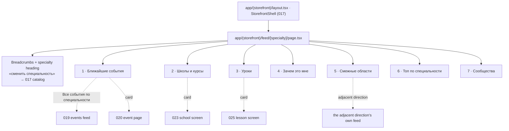
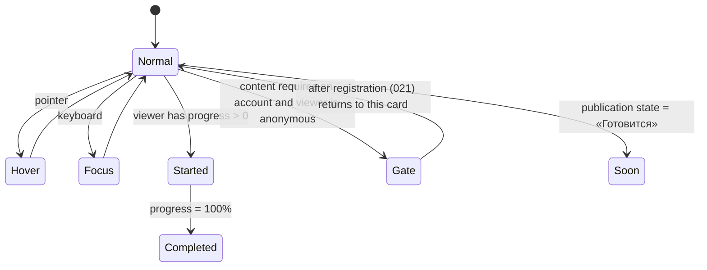
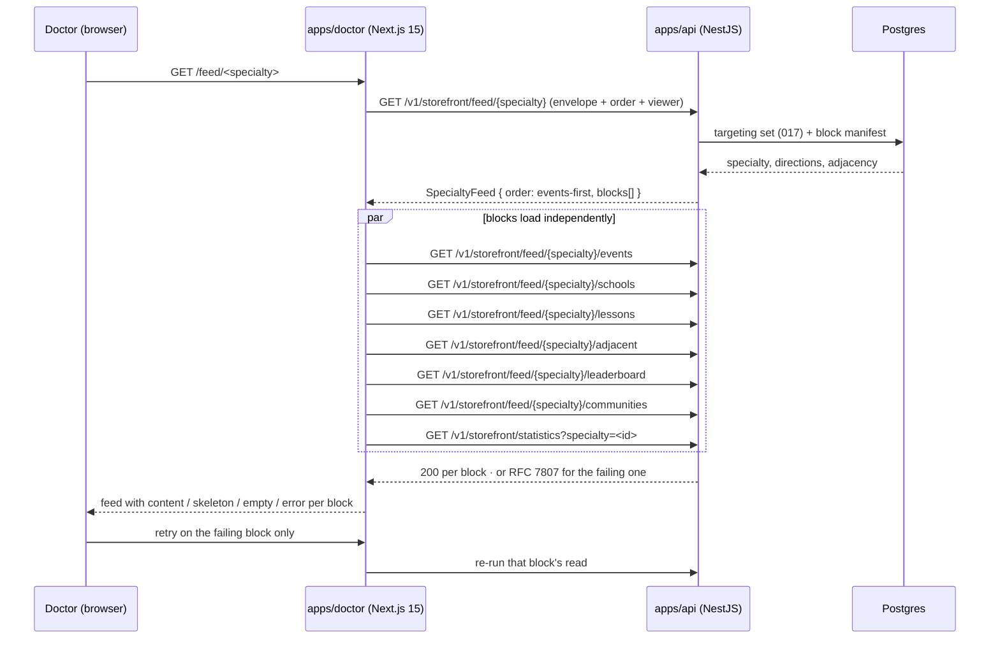
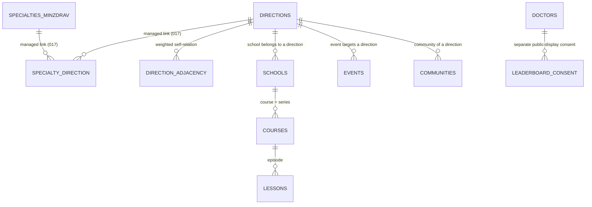

> Requirements: [`018-requirements-en.md`](./018-requirements-en.md) · PRD: [`018-product.md`](./018-product.md) · Scenarios: [`018-scenarios.feature`](./018-scenarios.feature)
>
> Composition source of truth: `design-source/doctor-feed.dc.html` (screen `#d-feed`), with the event card (`webinar-card.dc.html`), the expert card (`expert-card.dc.html`) and the points plate in its base form reused as-is. Stage-A picks in force: F-018-1 = **Б** (events first), F-018-2 = **Б** (typographic card, no cover), F-018-3 = adjacent areas as their own block. The canvas payer line is a known defect and is not built (LD-9).

# 018 — Design

## 1. Route topology and the fixed block order

The feed is one route of `apps/doctor` rendered inside 017's `StorefrontShell`. It adds breadcrumbs and the specialty heading and nothing else of the chrome.



The statistics line sits between the heading and block 1. The order above is the F-018-1 constant of **LD-1**: it is a server-side value, identical for every viewer holding the same specialty, and there is no ranking input, no weighting and no per-viewer ordering anywhere in the read path.

## 2. The doctor content card unit

The card is the load-bearing deliverable of 018 (**LD-2**). It lives in `@ds/design-system`, is built in variant **Б** — kicker, title, metadata row, counter — and carries **no cover-image field**, so no content-production obligation follows from the component's shape.



`Started`, `Completed` and `Gate` are viewer-dependent and therefore resolved on the server from the session plus the points/progress ledger (ADR-0016 §6); `Soon` is content-dependent and resolved from the publication state (**LD-4**). Hover and focus are pure presentation states of the primitive.

| Consumer               | Uses the card for                        | Owns                    |
| ---------------------- | ---------------------------------------- | ----------------------- |
| 018 · schools block    | schools, courses (with `seriesEpisodes`) | this spec               |
| 018 · lessons block    | lesson of the day                        | this spec               |
| 023 · school screen    | modules / courses inside the school      | feature 023             |
| 024 · learning module  | lessons inside the module                | feature 024             |
| home page · selections | mixed selections                         | feature 017's home page |

Events use Feature 004's shared **`WebinarCard`** (`packages/design-system/src/primitives/webinar-card.tsx`, composition source `webinar-card.dc.html`), not the doctor content card — Feature 019 widens that existing event unit, and an offline meet-up is a `format` of the same card (EARS-4), never a new card kind.

## 3. Per-block read topology (LD-7)

Each block owns its read, its skeleton and its error. There is no page-level aggregate read and no page-level error state.



The «Зачем это мне» block is editorial copy carried by the feed envelope; it has no independent read and therefore no error state of its own — but it is still subject to EARS-7's copy rule in every state.

### `dataState` × block matrix

| Block             | `обычно`                             | загрузка | пусто по специальности                             | частично пусто                | ошибка блока                               |
| ----------------- | ------------------------------------ | -------- | -------------------------------------------------- | ----------------------------- | ------------------------------------------ |
| Statistics line   | three specialty-scoped counters      | skeleton | line renders with the counters it has              | missing counter omitted       | line omitted, feed unaffected              |
| Ближайшие события | event cards + counter                | skeleton | «Общие события платформы →»                        | fewer cards, block stays      | «Не удалось загрузить события» + Повторить |
| Школы и курсы     | cards, course as «N серий»           | skeleton | «По вашей специальности пока нет школ» + Смежные ↓ | «Готовится» card, block stays | reason + retry                             |
| Уроки             | lesson of the day + «Все N уроков →» | skeleton | honest empty statement                             | block stays                   | reason + retry                             |
| Зачем это мне     | four value items + free statement    | n/a      | unchanged (editorial)                              | unchanged                     | n/a                                        |
| Смежные области   | adjacent directions                  | skeleton | «нет смежных областей» statement                   | fewer entries                 | reason + retry                             |
| Топ специальности | consented rows                       | skeleton | no consented doctors yet — stated                  | fewer rows                    | reason + retry                             |
| Сообщества        | communities + link out               | skeleton | honest empty statement                             | fewer entries                 | reason + retry                             |

A whole feed with nothing at all (EARS-12) renders the plain statement plus the adjacent areas and the general platform events — never a blank page.

## 4. Guest read and server-side gating (LD-8)

```mermaid
sequenceDiagram
  participant G as Guest (no session)
  participant N as apps/doctor
  participant A as apps/api

  G->>N: GET /feed/<specialty>
  N->>A: block reads, no session cookie
  A->>A: per item — does the content require an account?
  alt public content
    A-->>N: full card payload, state = normal
  else gated content
    A-->>N: public metadata + state = gate (payload withheld)
  end
  N-->>G: every block readable; gated cards show «нужна регистрация»
  G->>N: follow the gate
  N-->>G: 021 registration, with the return target = the originating card
```

The gate marker and the access rule are one mechanism: there is no code path where the gated payload reaches an anonymous client and is hidden by CSS or a client-side route guard.

## 5. Targeting and adjacency resolution

018 issues no targeting logic of its own. It consumes 017's `TargetingSet`, resolved from ADR-0016 §5's managed books.



Every targeted block filters on `TargetingSet.directions`; the adjacent-areas block reads `TargetingSet.adjacentDirections` and renders it as its own labelled block (F-018-3). No block derives adjacency from names, prefixes or embeddings, and no item from `adjacentDirections` is rendered inside a main block as the doctor's own specialty.

## 6. Statistics and leaderboard reads

- `SpecialtyStatistics` is a computed read scoped to the specialty, carrying `computedAt`; a counter whose source is unavailable is omitted rather than zeroed (EARS-3). The platform-wide counterpart belongs to 017's home page and is a different read — the two are never substituted for one another.
- `SpecialtyLeaderboard` filters on the specialty **and** on a recorded public-display consent (REQ-34). The query joins the consent row; there is no post-filter in the client and no anonymised row. `viewerHasConsent` is `null` for a guest, `false` for a signed-in doctor without consent — which is what drives the calm in-block explanation rather than a missing block.

## 7. Read contracts

| Read                                              | Auth   | Shape                  | Notes                                      |
| ------------------------------------------------- | ------ | ---------------------- | ------------------------------------------ |
| `GET /v1/storefront/feed/{specialty}`             | public | `SpecialtyFeed`        | envelope, fixed order (LD-1)               |
| `GET /v1/storefront/feed/{specialty}/events`      | public | `FeedEvents`           | `signUpCount` always, `format`, `nmo` attr |
| `GET /v1/storefront/feed/{specialty}/schools`     | public | `FeedSchools`          | `seriesEpisodes`, `preparing[]` (LD-4)     |
| `GET /v1/storefront/feed/{specialty}/lessons`     | public | `FeedLessons`          | `sharedWithMobileApp: true`                |
| `GET /v1/storefront/feed/{specialty}/adjacent`    | public | `AdjacentAreas`        | from the managed relation only             |
| `GET /v1/storefront/feed/{specialty}/leaderboard` | public | `SpecialtyLeaderboard` | consented rows only                        |
| `GET /v1/storefront/feed/{specialty}/communities` | public | `SpecialtyCommunities` | read-only (LD-5)                           |
| `GET /v1/storefront/statistics?specialty=`        | public | `SpecialtyStatistics`  | `computedAt`, omit-on-missing              |

All reads are `access: public` per ADR-0001; the session only changes card `state` and `viewer`. Errors are RFC 7807 Problem Details (ADR-0002) rendered as the block's Russian-language error with a retry.

## 8. Sequencing the build

1. **EARS-2 — the doctor content card unit** in `@ds/design-system` with all seven states and the showcase entry. Schools, lessons and later doctor-content consumers compose it; event surfaces do not.
2. **EARS-1 + EARS-3** — the route inside exact landed 017 artifacts: shell #1478, specialty choice #1482 and targeting/adjacency #1484; breadcrumbs, specialty heading, fixed order, statistics line. Route integration #1496 consumes the doctor content card #1497 without waiting for parent-level 017 completion.
3. **EARS-4 → EARS-5 → EARS-6** — events (first), schools and courses, lessons, each with its own read. EARS-4 waits for route composition #1496, Feature 019's widening of the Feature-004 `WebinarCard` #1517, and the product-complete `/events` destination #1516; no blank route or placeholder satisfies the link-out.
4. **EARS-7 + EARS-8 + EARS-9 + EARS-10** — value block, adjacent areas, leaderboard, communities.
5. **EARS-11 + EARS-12** — guest gating end-to-end and the five `dataState` renders per block.
6. **EARS-13 + EARS-14** — mobile composition, axe, and the purity scan.
7. **EARS-15** — the process gate around all of the above: design-system gate before each surface, Stage-B live confirmation before merge.
