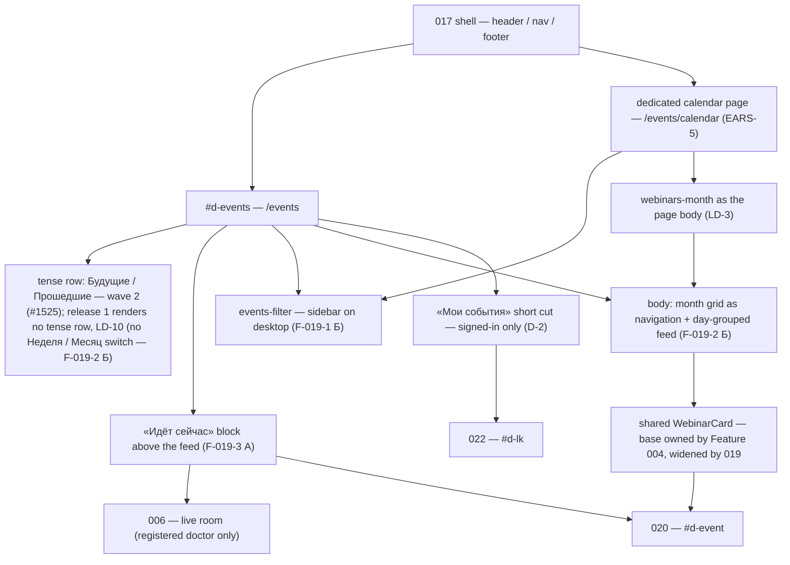
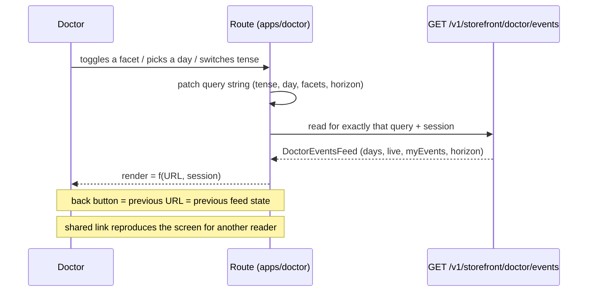
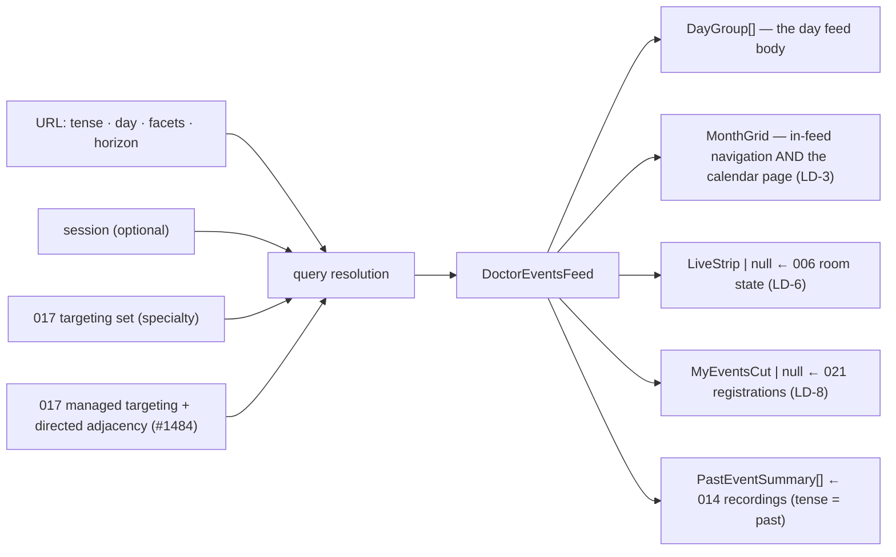
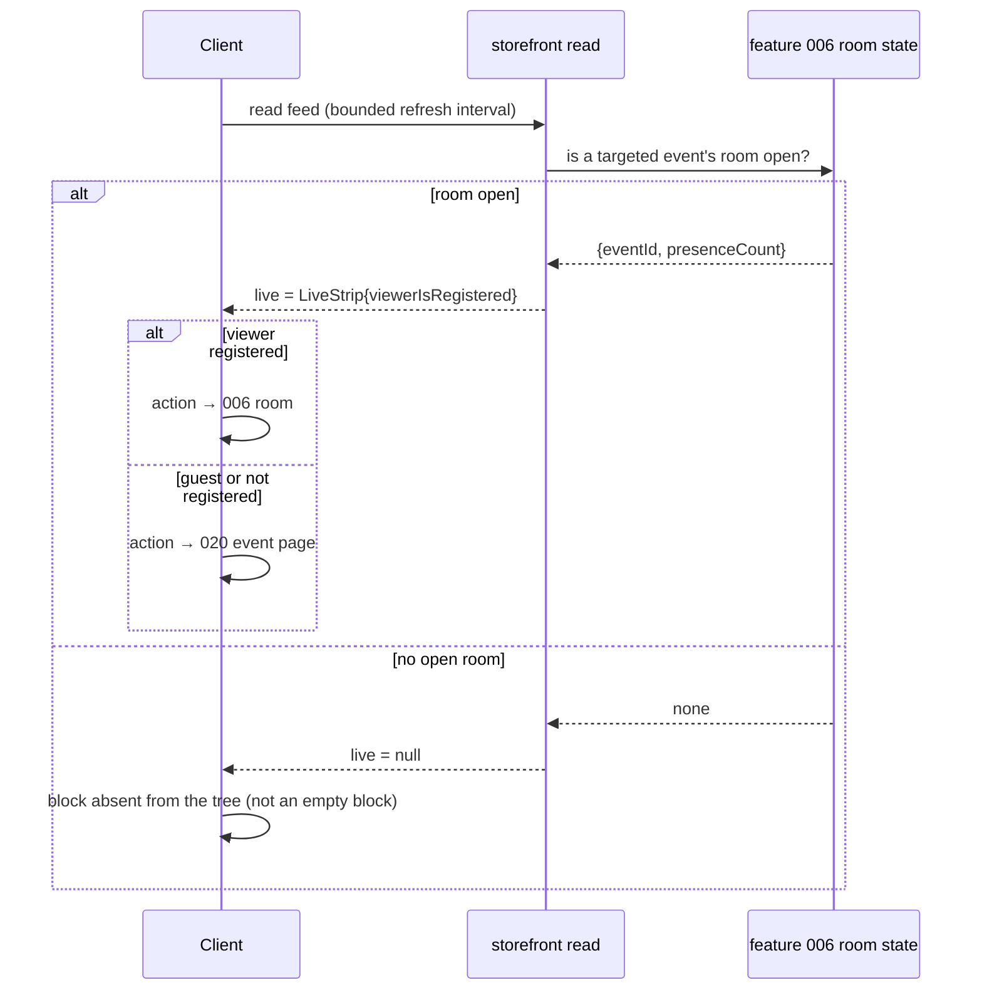
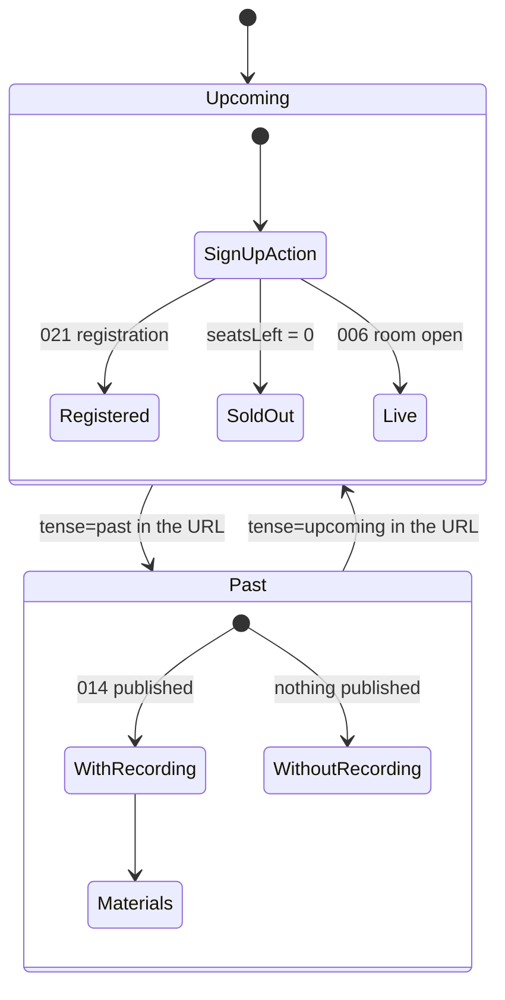
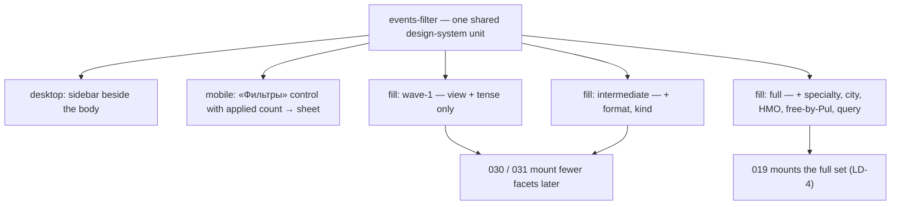

> Companion to [`019-requirements-en.md`](./019-requirements-en.md). Engineer-facing, EN-only per ADR-0006 §4. Composition source of truth is the vendored canvas [`design-source/doctor-events.dc.html`](../../../../../../design-source/doctor-events.dc.html); where this document and the canvas disagree on geometry, the canvas wins, and where they disagree on behaviour, the requirements win.

# 019 — Design

## 1. Route topology and screen composition

Two routes of `apps/doctor`, both inside feature 017's shell, both over one read contract (LD-3).

`019` owns the two Doctor route compositions, not a second events engine or room. The host-specific `DoctorEventsFeed` response is a thin projection over the canonical event, room and registration services named below; it is not a parallel read model implementation. Managed specialty targeting and directed adjacency come from the landed 017 artifact #1484; 018's doctor content card and rendered adjacent-areas block are not substrates here.

### 1.1 Cross-front ownership and extraction matrix (EARS-15)

This checked-in matrix is the required pre-implementation inventory. An implementation Issue updates its row if repository reality has moved before writing product code.

| Capability                                           | Current Academy owner / precedent                                                                                                                                                                                                 | Canonical owner or extraction target                                                                                                                                                                                                                               | Doctor boundary                                                                                                                                                                |
| ---------------------------------------------------- | --------------------------------------------------------------------------------------------------------------------------------------------------------------------------------------------------------------------------------- | ------------------------------------------------------------------------------------------------------------------------------------------------------------------------------------------------------------------------------------------------------------------ | ------------------------------------------------------------------------------------------------------------------------------------------------------------------------------ |
| Event domain, listing query and lifecycle vocabulary | `apps/api/src/events/events.service.ts`, `events.repository.ts`, `events.public.controller.ts`; `packages/schemas/src/events/events.schema.ts`                                                                                    | Keep domain/query execution in `apps/api/src/events/EventsService` + repository and portable contracts in `packages/schemas/src/events/`; extract the common query schema/codec to `packages/schemas/src/events/event-listing-query.schema.ts`                     | `/v1/storefront/doctor/events` supplies specialty targeting/defaults and maps the shared result into `DoctorEventsFeed`; `/v1/public/events` remains Academy's host projection |
| Event list / day-group composition                   | `apps/portal/components/discovery-listing.tsx`; Feature 014's shared controlled `EventList` is still open in #1346                                                                                                                | Feature 014 / #1346 extracts the route-independent controlled unit to `packages/design-system/src/blocks/event-list.tsx` and migrates Portal; 019 consumes or additively widens that same unit                                                                     | Doctor owns placement, day headings/copy and route links only; #1516 waits for #1346 rather than creating a rival list                                                         |
| Event card                                           | `packages/design-system/src/primitives/webinar-card.tsx`                                                                                                                                                                          | Keep `WebinarCard` in `@ds/design-system`; widen its shared format/state contract additively                                                                                                                                                                       | Doctor supplies data and destination, not JSX fork                                                                                                                             |
| Month calendar                                       | `apps/portal/components/month-calendar-view.tsx`, `month-calendar-mobile.tsx`, `calendar-shell.tsx` over `packages/design-system/src/blocks/month-calendar-grid.tsx`                                                              | Keep `MonthCalendarGrid` / `MonthDotGrid` canonical in `@ds/design-system`; share portable month contracts in `packages/schemas/src/events/`                                                                                                                       | Doctor owns its page/sidebar composition; it reuses the grids and shared month query core                                                                                      |
| Facets                                               | Academy listing controls are currently host composition; no canonical `events-filter` block exists                                                                                                                                | Build the first canonical reusable block at `packages/design-system/src/blocks/events-filter.tsx` and the shared query vocabulary in `event-listing-query.schema.ts`                                                                                               | Doctor mounts `full`; later hosts mount another declared fill state, never fork controls                                                                                       |
| LIVE resolution and room entry                       | `apps/api/src/room/room.service.ts`, `room.repository.ts`; `apps/api/src/registration/registration.service.ts`; `packages/schemas/src/events/room.schema.ts`, `registration.schema.ts`; `apps/portal/app/webinars/[slug]/room/**` | Keep room truth/entry policy in `RoomService` + `RegistrationService` and portable contracts in `packages/schemas`; extract only a reusable presentation strip to `packages/design-system/src/blocks/live-event-strip.tsx` when the second consumer is implemented | Doctor reads/adapts canonical room state; registered users enter the existing Academy room route, unregistered readers go to 020; Doctor creates no room or LIVE state machine |
| Past/archive recording projection                    | Feature 014 owns `apps/api/src/recordings/RecordingsProjectionService` and `packages/schemas/src/recordings/`; Academy's `/webinars` past tab + shared archive list remain open in #1346                                          | Keep publication/edited-over-raw truth in `RecordingsProjectionService`, schemas in `packages/schemas/src/recordings/`, and land the controlled `EventList` archive state in `packages/design-system/src/blocks/event-list.tsx` through Feature 014 / #1346        | EARS-10 reads the 014 projection and renders the shared card/list state; it creates no Doctor recording projection, archive unit or playback policy                            |

Thin host projections are intentional: Academy and Doctor have different targeting and response envelopes, but both delegate to the same services/contracts. Direct `apps/doctor` → `apps/portal` imports, copied query logic, a second room, or a second lifecycle resolver fail EARS-15.

## 2. The URL is the state (LD-1)

Every control writes to the URL; the render reads only the URL and the session.

Consequences that are part of the contract rather than side effects:

- **The guest round-trip has a real target.** The card action carries `eventId` + the current feed URL into 021; 021 returns to that URL (LD-7). No "last page" heuristic exists to drift.
- **The horizon is a URL range, not a scroll position** (LD-2), so «показать ещё» is reproducible and there is no infinite scroll whose position cannot be linked.
- **Nothing is restored from a previous visit.** The screen has no per-viewer memory; the only viewer-dependent parts are the live block's action target, the card `state` and the presence of the «Мои события» cut.

## 3. Read topology

Within Doctor, one host projection serves the feed; the month grid and the calendar page project the same result. Across storefronts, `/v1/public/events` and `/v1/storefront/doctor/events` are thin adapters over the same `EventsService` / repository query core and portable schemas, not duplicate engines.

`dataState` × surface matrix — every cell is a real render, none is a placeholder:

| Surface       | обычно           | загрузка       | пусто по фасетам             | пусто по специальности       | ошибка                       | нет живого эфира     |
| ------------- | ---------------- | -------------- | ---------------------------- | ---------------------------- | ---------------------------- | -------------------- |
| Day feed      | day groups       | feed skeleton  | narrowest facet + weakening  | adjacent areas offered       | RU cause + retry (this read) | n/a                  |
| Month grid    | day counts       | grid skeleton  | empty month, facets retained | adjacent areas offered       | RU cause + retry             | no live markers      |
| Calendar page | month as body    | grid skeleton  | same as month grid           | same as month grid           | RU cause + retry             | no live markers      |
| Live block    | LIVE + presence  | not rendered   | n/a                          | n/a                          | not rendered                 | **absent from tree** |
| Facet panel   | facets + applied | panel skeleton | applied + reset stay visible | applied + reset stay visible | panel stays operable         | n/a                  |
| «Мои события» | short cut        | cut skeleton   | «пока ничего» statement      | «пока ничего» statement      | RU cause + retry             | n/a                  |

The two empty reasons are distinct renders (LD-9): a doctor in a rare specialty is never told to loosen a facet they did not set.

## 4. Live-block resolution (LD-6, EARS-6)

The client never derives liveness from `startsAt`. A stale LIVE badge is a defect, and so is a rendered-but-empty live container — the grid must close over the absent block. This resolver and entry policy are the same canonical capability used by Academy; `apps/doctor` supplies route composition, not a second lifecycle implementation.

## 5. Tense switch and the past reading (EARS-10)

The card unit is the same in both tenses; only the action and the state change. `WithoutRecording` renders the card with no recording action — never a link that resolves to nothing. The community-discussion affordance of PRD US-11 is **not drawn in either state** (deferred; see the requirements' Scope → Out).

## 6. Facet panel — form and fill states (F-019-1 Б, D-1, LD-4)

The fill states are a property of the **unit**, not of this screen: 019 mounts `full`, and the unit must still lay out correctly at `wave-1` and `intermediate` so a later consumer breaks neither the panel nor the host grid. That obligation is verified in the showcase, not only on this route.

## 7. Read contracts

`GET /v1/storefront/doctor/events` — public, session-optional (ADR-0001: `access: public`; the viewer-dependent parts degrade rather than gate). Its controller applies Doctor specialty targeting and envelope mapping, then delegates event selection/lifecycle to `apps/api/src/events/EventsService`, LIVE truth to `apps/api/src/room/RoomService`, and registration/entry policy to `apps/api/src/registration/RegistrationService`. Academy's existing `/v1/public/events` remains a separate host projection over those same canonical owners; neither controller contains a second query engine.

| Query       | Values                                                                       | Notes                                                                                                                                                                                                                                                                                                                                           |
| ----------- | ---------------------------------------------------------------------------- | ----------------------------------------------------------------------------------------------------------------------------------------------------------------------------------------------------------------------------------------------------------------------------------------------------------------------------------------------- |
| `day`       | ISO date                                                                     | the day the feed body is scrolled to; written by a month-grid selection (EARS-4). There is no `view` parameter: under F-019-2 Б the month grid and the day feed render together and the «Неделя / Месяц» switch is not built (owner decision 2026-08-26). The month as a page body is the dedicated calendar route (EARS-5), not a query value. |
| `tense`     | `upcoming` \| `past`                                                         | drives the 014 join                                                                                                                                                                                                                                                                                                                             |
| `from/to`   | ISO dates                                                                    | the LD-2 horizon; «показать ещё» widens it                                                                                                                                                                                                                                                                                                      |
| `format`    | `webinar` \| `online-meeting` \| `offline-meetup` \| `congress` \| `podcast` | repeatable                                                                                                                                                                                                                                                                                                                                      |
| `kind`      | reference ids                                                                | repeatable                                                                                                                                                                                                                                                                                                                                      |
| `specialty` | `mine-and-adjacent` \| `all` \| ids                                          | default `mine-and-adjacent`                                                                                                                                                                                                                                                                                                                     |
| `city`      | reference ids                                                                | offline events only                                                                                                                                                                                                                                                                                                                             |
| `nmo`       | boolean                                                                      | badge-backed facet                                                                                                                                                                                                                                                                                                                              |
| `free`      | boolean                                                                      | `pulCost = 0`                                                                                                                                                                                                                                                                                                                                   |
| `q`         | string                                                                       | name search                                                                                                                                                                                                                                                                                                                                     |

Response shape is the read-model set of the requirements' Event Model. Errors are RFC 7807 Problem Details (ADR-0002) and are rendered per block in Russian with a retry that re-runs only that read.

`GET /v1/storefront/doctor/events/month` serves the `MonthGrid` projection for both the in-feed navigation and the calendar page — one contract, two compositions (LD-3).

## 8. Sequencing the build

1. **Cross-front inventory and route-independent substrates:** before code, verify and update §1.1, then make each touched row true in the owning slice (ADR-0013 A1). Feature 014 / #1346 first extracts Academy's controlled `EventList` to its named design-system target and migrates `/webinars`; EARS-2 / #1517 widens `WebinarCard` at its canonical owner; EARS-7 / #1522 builds `events-filter` at its named shared target. None of the 019 substrate Issues mounts or publishes `/events`.
2. **Read contract:** EARS-3 / #1518 consumes #1517, #1522, and landed targeting/adjacency #1484, and proves only the API/read contract with e2e tests. Rendered-feed Playwright waits for #1516; #1518 exposes no partial route.
3. **Route-independent presentation and state:** EARS-4 / #1519 proves the shared Feature 004 / #1050 `MonthCalendarGrid` and `MonthDotGrid` components — it does not first create the calendar — while EARS-8 / #1523 extracts/proves the portable query codec at `packages/schemas/src/events/event-listing-query.schema.ts` with only thin host-default adapters, and EARS-9 / #1524 proves a component/state matrix. Each consumes #1518; none requires a browser route.
4. **First published integration:** EARS-1 / #1516 consumes shell #1478, Feature 014's shared `EventList` #1346, #1519, #1523, #1524, and sequencing correction #1620. Before first publication it integrates every route-level Playwright obligation of EARS-2, EARS-3, EARS-4, EARS-7, EARS-8, and EARS-9: shared card/list/filter mounting and interactions, rendered API feed, calendar/feed navigation, URL/back/shared-link behaviour, and loading/empty/error/retry states. Only then does it publish product-complete `/events` in the declared canvas order. This is the explicit same-WBS deferral: before #1516 there is no public partial route; at #1516, later-handler content regions are absent rather than empty labelled boxes, stubs, placeholders, or «скоро» markers.
5. **Dedicated calendar page (EARS-5)** over the same projection.
6. **Live block (EARS-6)** adapts `RoomService` + `RegistrationService`, extracts only the cross-front `live-event-strip` presentation block, and links registered doctors into the existing Academy room; it never creates a second room or lifecycle resolver.
7. **Past tense (EARS-10)** consumes Feature 014's `RecordingsProjectionService`, portable recording schemas and the #1346 archive state; 019 owns no recording projection or archive unit.
8. **Guest path (EARS-12)** — depends on EARS-8's addressable state and 021's return.
9. **«Мои события» (EARS-11)** — last, behind 021 (data) and 022 (destination) per LD-8.
10. **Mobile + axe (EARS-13)** and **purity scan (EARS-14)** across the finished surfaces; **EARS-15** is the process gate that wraps the whole sequence.
