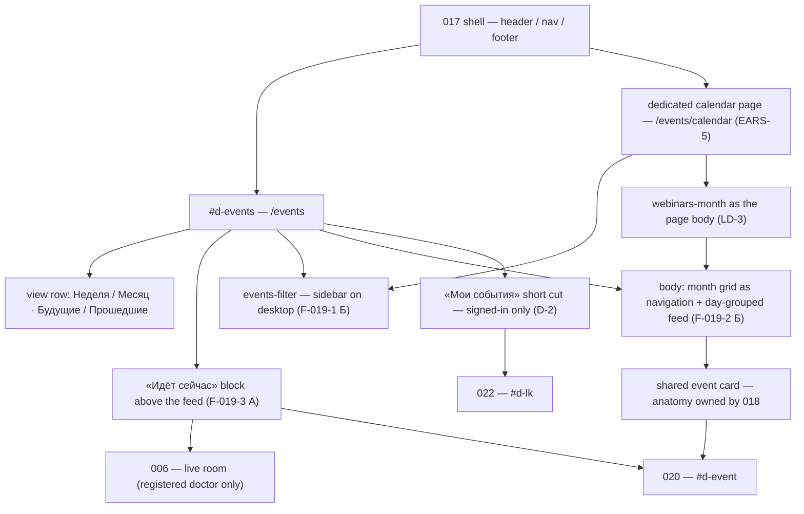
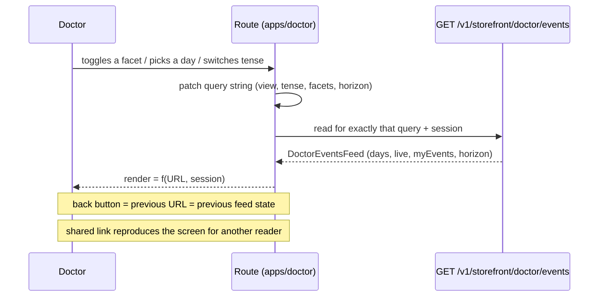
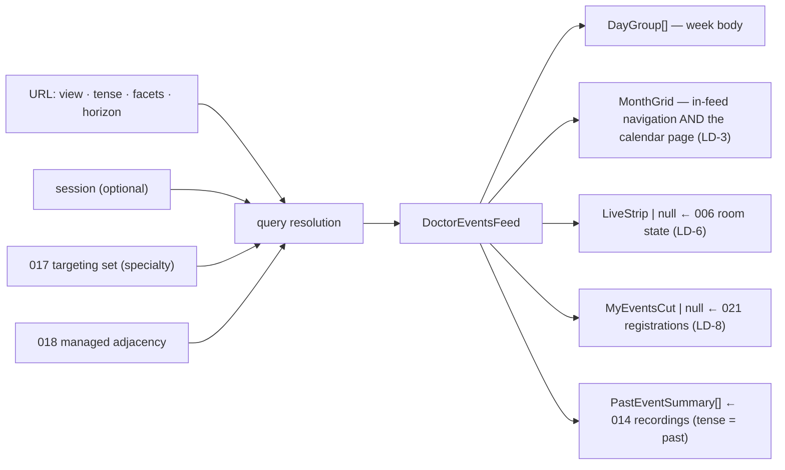
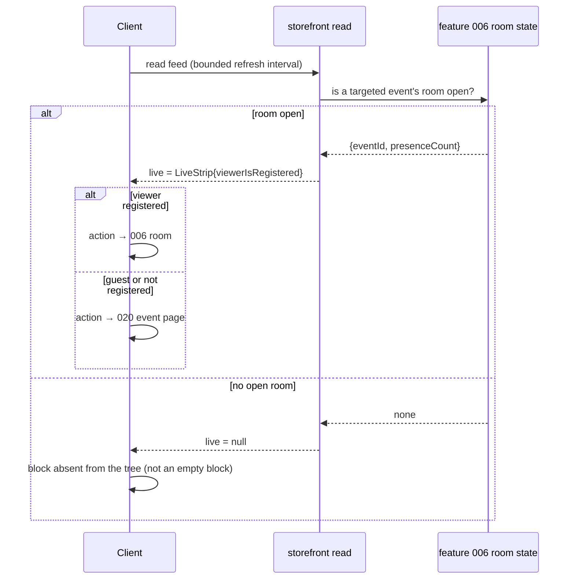
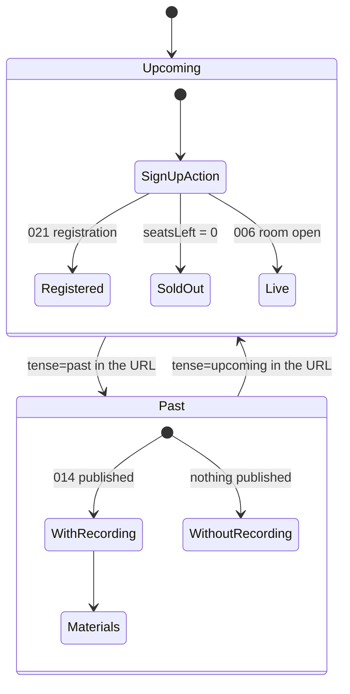
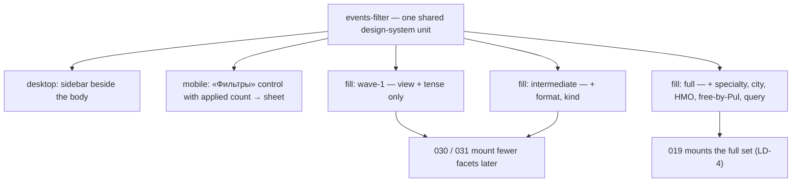

> Companion to [`019-requirements-en.md`](./019-requirements-en.md). Engineer-facing, EN-only per ADR-0006 §4. Composition source of truth is the vendored canvas [`design-source/doctor-events.dc.html`](../../../../../../design-source/doctor-events.dc.html); where this document and the canvas disagree on geometry, the canvas wins, and where they disagree on behaviour, the requirements win.

# 019 — Design

## 1. Route topology and screen composition

Two routes of `apps/doctor`, both inside feature 017's shell, both over one read contract (LD-3).

`019` owns the composition and nothing beneath it: `webinars-listing`, `webinars-month`, `webinar-archive`, `webinar-card` and `events-filter` are consumed as shared units (REQ-137). The only new UI artefacts of this feature are the two route compositions and the widened format vocabulary the card already has a slot for.

## 2. The URL is the state (LD-1)

Every control writes to the URL; the render reads only the URL and the session.

Consequences that are part of the contract rather than side effects:

- **The guest round-trip has a real target.** The card action carries `eventId` + the current feed URL into 021; 021 returns to that URL (LD-7). No "last page" heuristic exists to drift.
- **The horizon is a URL range, not a scroll position** (LD-2), so «показать ещё» is reproducible and there is no infinite scroll whose position cannot be linked.
- **Nothing is restored from a previous visit.** The screen has no per-viewer memory; the only viewer-dependent parts are the live block's action target, the card `state` and the presence of the «Мои события» cut.

## 3. Read topology

One read serves the feed; the month grid and the calendar page project the same result.

`dataState` × surface matrix — every cell is a real render, none is a placeholder:

| Surface       | обычно           | загрузка       | пусто по фасетам             | пусто по специальности       | ошибка                       | нет живого эфира     |
| ------------- | ---------------- | -------------- | ---------------------------- | ---------------------------- | ---------------------------- | -------------------- |
| Day feed      | day groups       | feed skeleton  | narrowest facet + weakening  | adjacent areas offered       | RU cause + retry (this read) | n/a                  |
| Month grid    | day counts       | grid skeleton  | empty month, facets retained | adjacent areas offered       | RU cause + retry             | no live markers      |
| Calendar page | month as body    | grid skeleton  | same as month grid           | same as month grid           | RU cause + retry             | no live markers      |
| Live block    | LIVE + presence  | not rendered   | n/a                          | n/a                          | not rendered                 | **absent from tree** |
| Facet panel   | facets + applied | panel skeleton | applied + reset stay visible | applied + reset stay visible | panel stays operable         | n/a                  |
| «Мои события» | short cut        | cut skeleton   | «пока ничего» statement      | «пока ничего» statement      | RU cause + retry             | n/a                  |

The two empty reasons are distinct renders (LD-9): a doctor in a rare specialty is never told to loosen a facet they did not set.

## 4. Live-block resolution (LD-6, EARS-6)

The client never derives liveness from `startsAt`. A stale LIVE badge is a defect, and so is a rendered-but-empty live container — the grid must close over the absent block.

## 5. Tense switch and the past reading (EARS-10)

The card unit is the same in both tenses; only the action and the state change. `WithoutRecording` renders the card with no recording action — never a link that resolves to nothing. The community-discussion affordance of PRD US-11 is **not drawn in either state** (deferred; see the requirements' Scope → Out).

## 6. Facet panel — form and fill states (F-019-1 Б, D-1, LD-4)

The fill states are a property of the **unit**, not of this screen: 019 mounts `full`, and the unit must still lay out correctly at `wave-1` and `intermediate` so a later consumer breaks neither the panel nor the host grid. That obligation is verified in the showcase, not only on this route.

## 7. Read contracts

`GET /v1/storefront/doctor/events` — public, session-optional (ADR-0001: `access: public`; the viewer-dependent parts degrade rather than gate).

| Query       | Values                                                                       | Notes                                                  |
| ----------- | ---------------------------------------------------------------------------- | ------------------------------------------------------ |
| `view`      | `week` \| `month`                                                            | desktop renders both; the value selects the body focus |
| `tense`     | `upcoming` \| `past`                                                         | drives the 014 join                                    |
| `from/to`   | ISO dates                                                                    | the LD-2 horizon; «показать ещё» widens it             |
| `format`    | `webinar` \| `online-meeting` \| `offline-meetup` \| `congress` \| `podcast` | repeatable                                             |
| `kind`      | reference ids                                                                | repeatable                                             |
| `specialty` | `mine-and-adjacent` \| `all` \| ids                                          | default `mine-and-adjacent`                            |
| `city`      | reference ids                                                                | offline events only                                    |
| `nmo`       | boolean                                                                      | badge-backed facet                                     |
| `free`      | boolean                                                                      | `pulCost = 0`                                          |
| `q`         | string                                                                       | name search                                            |

Response shape is the read-model set of the requirements' Event Model. Errors are RFC 7807 Problem Details (ADR-0002) and are rendered per block in Russian with a retry that re-runs only that read.

`GET /v1/storefront/doctor/events/month` serves the `MonthGrid` projection for both the in-feed navigation and the calendar page — one contract, two compositions (LD-3).

## 8. Sequencing the build

1. **Card format vocabulary (EARS-2)** on 018's unit — offline city/seats, congress span, podcast broadcast; everything below composes it.
2. **Read contract + URL state (EARS-3, EARS-8)** — the feed read, the query mapping and the horizon; nothing is addressable before this.
3. **Facet panel (EARS-7)** as the shared unit with its three fill states.
4. **Feed body + month beside it (EARS-1, EARS-4)**, then **the calendar page (EARS-5)** over the same projection.
5. **Live block (EARS-6)** once 006's room state is readable.
6. **Past tense (EARS-10)** once 014's recordings are readable.
7. **States (EARS-9)** across every surface built above.
8. **Guest path (EARS-12)** — depends on EARS-8's addressable state and 021's return.
9. **«Мои события» (EARS-11)** — last, behind 021 (data) and 022 (destination) per LD-8.
10. **Mobile + axe (EARS-13)** and **purity scan (EARS-14)** across the finished surfaces; **EARS-15** is the process gate that wraps the whole sequence.
