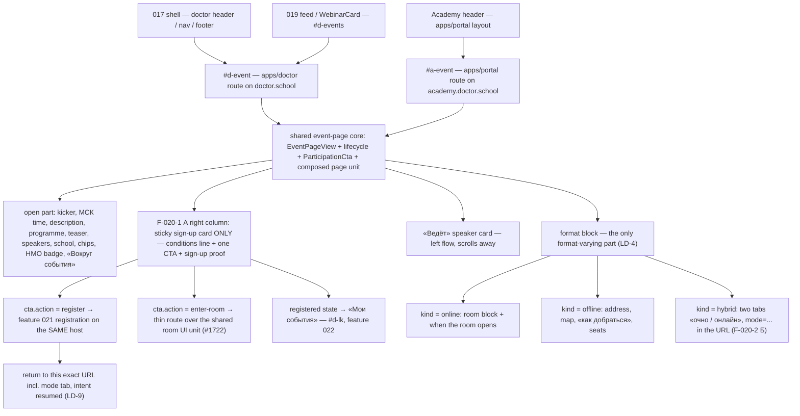
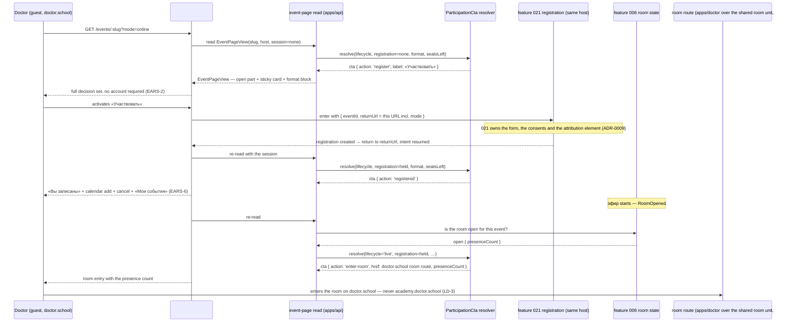
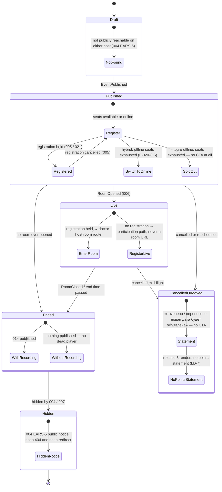
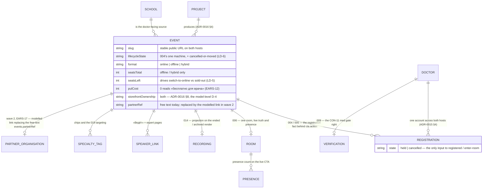

> Companion to [`020-requirements-en.md`](./020-requirements-en.md). Engineer-facing, EN-only per ADR-0006 §4. Composition source of truth is the vendored canvas [`design-source/webinar-page-variant-a.dc.html`](../../../../../../design-source/webinar-page-variant-a.dc.html) over its base [`design-source/webinar-page.dc.html`](../../../../../../design-source/webinar-page.dc.html); where this document and the canvas disagree on geometry, the canvas wins, and where they disagree on behaviour, the requirements win.

# 020 — The event page for both storefronts (Design)

## 1. Route topology and screen composition

Two thin host routes over one core (LD-1). The doctor route is the release-3 primary surface; the Academy route is a projection of the same core under the Academy header and ships in the same slice (LD-10).

020 owns the two route compositions, the page core they mount and the way **into** the room. It owns no room, no registration form, no listing and no recording projection: those stay at features 006, 021 / 005, 019 and 014.

### 1.1 Cross-front ownership and extraction matrix (EARS-21)

This checked-in matrix is the required pre-implementation inventory. An implementation Issue verifies its row against repository reality and updates it before writing product code; a row that has moved is corrected in this file, not worked around in the app.

| Capability                       | Current owner / precedent                                                                                                                                                                                                                                                                                                                                                                                                                                                                    | Canonical owner or extraction target                                                                                                                                                                                                                                                                                                                                                                                                                                                                                                                                     | Host boundary                                                                                                                                                                                                                                                                                                                                                                                                                                                              |
| -------------------------------- | -------------------------------------------------------------------------------------------------------------------------------------------------------------------------------------------------------------------------------------------------------------------------------------------------------------------------------------------------------------------------------------------------------------------------------------------------------------------------------------------- | ------------------------------------------------------------------------------------------------------------------------------------------------------------------------------------------------------------------------------------------------------------------------------------------------------------------------------------------------------------------------------------------------------------------------------------------------------------------------------------------------------------------------------------------------------------------------ | -------------------------------------------------------------------------------------------------------------------------------------------------------------------------------------------------------------------------------------------------------------------------------------------------------------------------------------------------------------------------------------------------------------------------------------------------------------------------- |
| Public event read                | **Widened in place (slice 1, #1764).** `packages/schemas/src/events/public-page.schema.ts` now exports `EventPageViewSchema`, carrying `format` (`online`/`offline`/`hybrid`) and `seatsLeft` beside the existing allow-list and `recording`; `PublicEventPageSchema`/`PublicEventPage` remain aliases of it, so feature 004's consumers are untouched. Storage: `participation_format` + `seats_left` on `events` (`packages/db/src/schema/events.ts`, additive migration, back-fill safe). | Same owner, further widening as its own EARS lands: the `FormatBlock` sub-block union (EARS-8, #1771), sign-up proof (#1767), med gate (#1774), «Вокруг события» links. Still no 020-local read model and no second projection.                                                                                                                                                                                                                                                                                                                                          | **Realised.** `GET /v1/storefront/doctor/events/:idOrSlug` delegates to the one `EventsService.publicEventPage`; `020 EARS-1` in `apps/api/test/events/event-page-view.e2e-spec.ts` pins deep-equal bodies across both hosts, and no-auth reachability per state.                                                                                                                                                                                                          |
| Page composition                 | `apps/portal/app/webinars/[slug]/page.tsx` with `register-one-tap.tsx`, `register-action.ts`, `recording-gate.tsx`, `recording-player.tsx` — the composition is host-local today                                                                                                                                                                                                                                                                                                             | **Realised (slice 2, #1764).** The composed page is now four shared blocks at `packages/design-system/src/blocks/` — `EventPageShell`/`EventPageHero`, `EventSignupCard`, `EventSpeakerCard`, `EventFormatBlock` (online only; offline and hybrid arrive with EARS-8, [#1771](https://github.com/doctor-school/ds-platform/issues/1771)) — built to the variant-А canvas and exported from `blocks/index.ts`. This is the one canonical composition both hosts mount (LD-1, LD-10); `apps/portal/app/webinars/[slug]/page.tsx` is re-mounted on these blocks in slice 3. | `apps/doctor` and `apps/portal` supply route, header, envelope and copy defaults only. A second page composition in either app, or an `apps/doctor` → `apps/portal` import, fails EARS-1.                                                                                                                                                                                                                                                                                  |
| Participation CTA policy         | **Server-resolved (slice 1, #1764).** One pure resolver `apps/api/src/events/participation-cta.resolver.ts` over lifecycle × registration × format × seats; portable contract `ParticipationCtaSchema` in `packages/schemas/src/events/participation.schema.ts` (LD-2) — `register` · `registered` · `enter-room` · `switch-to-online` · `sold-out` · `unavailable`, with RU label/reason defaults carried by the server.                                                                    | Same owner. **Transport:** a per-viewer SIBLING read on each host — `GET /v1/public/events/:idOrSlug/participation` and `GET /v1/storefront/doctor/events/:idOrSlug/participation`, both `@Public()` with an OPTIONAL principal and `Cache-Control: private, no-store`. Not a field of the page body (that would break 004 EARS-1's guest/principal byte-identity and poison its shared cache), and not an extension of 005's authenticated `GET /v1/events/:idOrSlug/registration` (a guest there gets 401 instead of «Участвовать»).                                   | The client renders the given policy object and computes no eligibility. Each host contributes only its route table (`eventPath` / `registrationEntry` / `roomPath`); a `null` `roomPath` yields `enter-room` with `href: null` — absent, never dead (EARS-4). Any host-side branch on lifecycle, registration, format or seats is a defect. `apps/portal/lib/registration-handoff.ts` still builds its own register href and becomes a consumer of this policy in slice 3. |
| Registration and cancellation    | `apps/api/src/registration/registration.service.ts`, `registration.controller.ts`, `my-events.controller.ts`, `return-target.guard.spec.ts`; `packages/schemas/src/events/registration.schema.ts`, `registration-intent.ts`                                                                                                                                                                                                                                                                  | Unchanged canonical owner (features 005 / 021). 020 consumes the registration fact for `cta.action` and hands the return target over the existing intent/return-target contract (LD-9).                                                                                                                                                                                                                                                                                                                                                                                  | The CTA enters 021 on the host the doctor is already on and returns there. 020 renders no form, no consent control and no attribution element.                                                                                                                                                                                                                                                                                                                             |
| Room state and room entry        | `apps/api/src/room/room.service.ts`, `room.repository.ts`, `presence-*.ts`; `packages/schemas/src/events/room.schema.ts`; composed room UI `apps/portal/app/webinars/[slug]/room/**` over the primitive `packages/design-system/src/primitives/webinar-room.tsx`                                                                                                                                                                                                                             | Room truth, presence and entry policy stay at feature 006. The composed room **UI** is extracted to a shared cross-front unit under `packages/`, tracked by [#1722](https://github.com/doctor-school/ds-platform/issues/1722); both hosts then mount thin routes.                                                                                                                                                                                                                                                                                                        | The doctor enters on `doctor.school` through the `apps/doctor` thin route (LD-3); an Academy-host doctor through the equivalent `apps/portal` route. 020 builds no room, presence mechanism or live-state machine.                                                                                                                                                                                                                                                         |
| Lifecycle vocabulary             | `EventLifecycleState` at feature 004's owner in `packages/schemas/src/events/` + `apps/api/src/events/`                                                                                                                                                                                                                                                                                                                                                                                      | Extended **at that owner** with the cancelled-or-moved value (LD-6). Never a 020-local enum, mapping table or parallel resolver.                                                                                                                                                                                                                                                                                                                                                                                                                                         | Feed, card, calendar and page read the same machine, so they cannot contradict each other about one event.                                                                                                                                                                                                                                                                                                                                                                 |
| Event card and list (consumed)   | `packages/design-system/src/primitives/webinar-card.tsx`, `blocks/event-list.tsx`, `day-agenda.tsx`, `events-filter.tsx`, `month-calendar-grid.tsx`                                                                                                                                                                                                                                                                                                                                          | Already canonical in `@ds/design-system` (features 004 / 014 / 019). 020 consumes them as the entry point and widens nothing.                                                                                                                                                                                                                                                                                                                                                                                                                                            | 020 is the destination of the card action and builds no listing, facet or calendar surface.                                                                                                                                                                                                                                                                                                                                                                                |
| Recording and archive projection | `apps/api/src/recordings/` + `packages/schemas/src/recordings/` (feature 014), surfaced through `recording: RecordingProjectionSchema` on the public page read                                                                                                                                                                                                                                                                                                                               | Unchanged at feature 014. The ended and archived renders show whatever that projection carries.                                                                                                                                                                                                                                                                                                                                                                                                                                                                          | 020 models no recording state and no playback policy; the archived render is 004 EARS-5's notice, not a 020 variant.                                                                                                                                                                                                                                                                                                                                                       |
| Med-status gate (CON-11)         | 004 EARS-10's response-body gating on the public read                                                                                                                                                                                                                                                                                                                                                                                                                                        | `MedGate` on `EventPageView` at the same owner; the verification-status line is a shared unit whose full anatomy `#d-lk` (feature 022) will own, and this page realigns to it then.                                                                                                                                                                                                                                                                                                                                                                                      | Closed material is absent from the response body on both hosts. No host hides a delivered payload in the client.                                                                                                                                                                                                                                                                                                                                                           |
| Format block and URL codec       | No precedent — 004's page has no format vocabulary beyond online                                                                                                                                                                                                                                                                                                                                                                                                                             | New `FormatBlock` union in `packages/schemas/src/events/` plus one shared block in `@ds/design-system`; the `mode` codec lives beside 019's `event-listing-query.schema.ts` query vocabulary rather than in a route file (LD-4).                                                                                                                                                                                                                                                                                                                                         | Both hosts read and write the same `mode` parameter; neither owns a tab-state store.                                                                                                                                                                                                                                                                                                                                                                                       |

Thin host projections are intentional and bounded: the two storefronts differ in header, envelope and copy defaults, and in nothing else. A second read model, a second CTA resolver, a second page composition, a rival room or a forked format block fails EARS-1 and the ADR-0013 A1 reuse rule.

## 2. The guest round-trip: open → CTA → 021 → return → room entry (EARS-5, EARS-7, LD-9)

Two properties of this trace are contract rather than convenience. The return target is **carried**, never re-derived from a referrer or a session breadcrumb, so the doctor lands on the same URL including the active hybrid tab. And `enter-room` is resolved by the server only for a viewer holding a registration: an unregistered or anonymous reader on a live event receives `register`, and no room URL is ever present in their response body or DOM.

## 3. Lifecycle (EARS-10, LD-6)

One machine — feature 004's `EventLifecycleState`, extended at its canonical owner with `cancelled-or-moved`. The page renders a state; it never computes one from `startsAt`.

`NotFound` and `HiddenNotice` are deliberately different renders: a draft is indistinguishable from a non-existent event, a hidden event is a readable public notice. `WithoutRecording` renders no player and no «скоро» marker. `CancelledOrMoved` carries no statement about the doctor's points in release 3, because such a statement would be a ledger fact and feature 025 asserts none yet (LD-7).

## 4. Entity fragment

The page reads across these entities; it writes none of them. The dashed relation is the wave-2 addition of EARS-17.

`events.partnerRef` stays free text through release 3 and is **not** rendered anywhere (CON-8): the modelled `PARTNER_ORGANISATION` link is wave-2 work behind feature 030 and feature 021's own attribution clause, and it changes no interface copy when it lands.

## 5. The format block and its URL codec (EARS-8, EARS-9, LD-4, LD-5)

`FormatBlock` is a discriminated union over `EventFormat`, and it is the only part of the page whose composition varies:

| `kind`    | Carries                                                         | CTA resolution                                                            | URL                                                        |
| --------- | --------------------------------------------------------------- | ------------------------------------------------------------------------- | ---------------------------------------------------------- |
| `online`  | room block, when the room opens relative to the start           | `register` → `registered` → `enter-room`                                  | no `mode` parameter                                        |
| `offline` | address, map reference, «как добраться», `seatsTotal/seatsLeft` | `register`; `sold-out` (no CTA at all) when `seatsLeft = 0`               | no `mode` parameter                                        |
| `hybrid`  | both sub-blocks behind two tabs «очно / онлайн»                 | `register`; `switch-to-online` with the reason when offline seats run out | `mode=online \| offline`, the default resolved server-side |

The tab is URL state, not component state: a shared link reproduces the tab, the back button moves between tabs rather than off the page, and a reload keeps it. `switch-to-online` therefore lands the doctor on the «онлайн» tab from the server's resolution, with no client-side redirect and no flash of the offline tab. No waiting list exists in the model, so none can be half-built in the UI.

## 6. Build sequence — core → policy → composition → hosts

1. **Core.** Widen `PublicEventPageSchema` into `EventPageView` and extend `EventLifecycleState` with `cancelled-or-moved` at their canonical owners (`packages/schemas/src/events/`, `apps/api/src/events/`), with the `FormatBlock` union and the `mode` codec. Proved by Vitest e2e on the read; no route publishes.
2. **Policy.** The server-side `ParticipationCta` resolver over lifecycle × registration × format × seats, including the F-020-3 Б `switch-to-online` / `sold-out` split and the `enter-room` registration condition. Proved by Vitest e2e; still no route.
3. **Composition.** Extract the portal page composition into the shared `@ds/design-system` blocks built from the variant-А canvas — page shell, sticky sign-up card, «Ведёт» card, format block with its tabs — with the state matrix proved in the showcase at both breakpoints and in both themes.
4. **Hosts, in one slice (LD-10).** Publish `#d-event` in `apps/doctor` inside 017's shell **and** re-mount `#a-event` in `apps/portal` on the same unit, replacing the host-local composition. Only here do the route-level Playwright obligations of EARS-2, EARS-4, EARS-5, EARS-8, EARS-9, EARS-10, EARS-11, EARS-19 and EARS-20 run, plus the cross-host identity row of EARS-1 / EARS-18.
5. **Room entry**, sequenced behind [#1722](https://github.com/doctor-school/ds-platform/issues/1722): the doctor-host thin route over the extracted shared room unit. Before that extraction lands, a doctor-host entry route would be a second room composition, so EARS-7's entry ships with it rather than as a fork.

Before step 1, §1.1 is verified against repository reality and the `build-ui-from-design-system` gate runs against the vendored canvas set (EARS-21). Steps 1–3 expose no partial public route: there is no intermediate build in which a reader can reach a half-composed event page.

## 7. What release 3 deliberately does not draw (LD-8)

Six product surfaces are postponed, and each renders **nothing at all** — no disabled control, no empty labelled box, no «скоро» marker. Their release-3 proof is an absence assertion in `020-scenarios.feature`, and each carries its own tracked Issue on the 020 parent.

| Deferred                                                  | Clause  | Waits on                                | Release-3 render                                              |
| --------------------------------------------------------- | ------- | --------------------------------------- | ------------------------------------------------------------- |
| Points balance, shortfall paths, silent advance, accrual  | EARS-12 | feature 025 (no spec, no Issues yet)    | the Pul cost parameter only; zero reads «бесплатно для врача» |
| Live-эфир interaction — questions, polls, vote, reminders | EARS-13 | feature 006 channel + 040 / 024 marking | nothing in any live render                                    |
| НМО check-in surface and outcome statement                | EARS-14 | feature 038                             | НМО as a badge and a conditions-line value only               |
| Ticket and its QR                                         | EARS-15 | features 022 and 038                    | address, map, «как добраться», seats — nothing else           |
| Post-event rating, review and F-020-4 А mini-survey       | EARS-16 | wave 2 in the decided F-020-4 А shape   | the 014 recording and materials only                          |
| Event-level partner link                                  | EARS-17 | feature 030 + 021's attribution clause  | no attribution element, no marking field                      |

The pre-start reminder of EARS-6 is the seventh absence: no scheduling capability exists in the platform, so release 3 promises none rather than rendering an unbacked promise.
