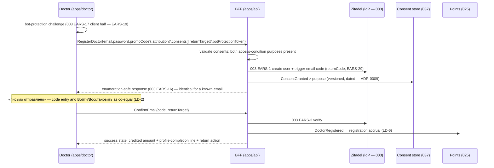
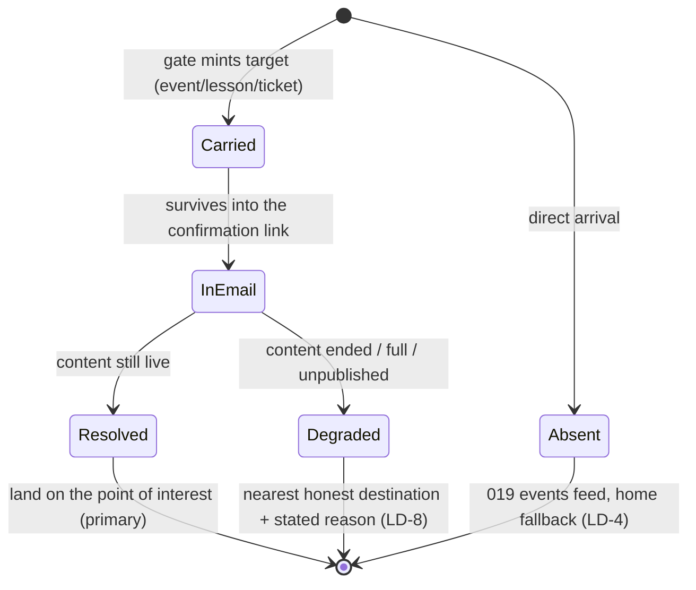
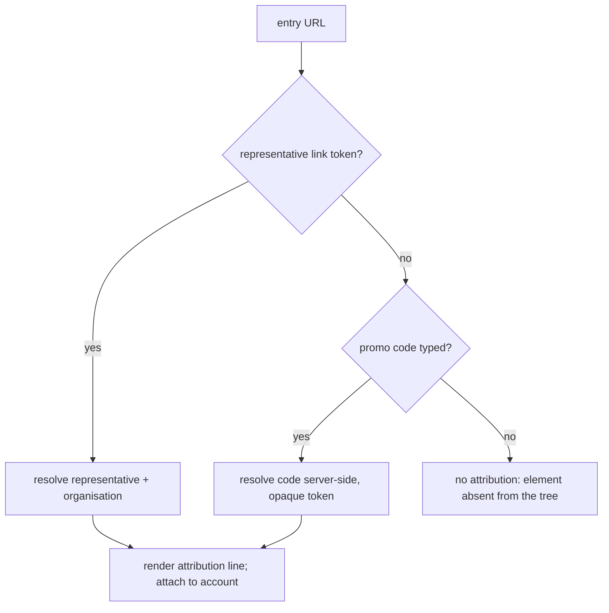

> Requirements: [`021-requirements-en.md`](./021-requirements-en.md) · PRD: [`021-product.md`](./021-product.md) · Composition SoT: [`design-source/auth.dc.html`](../../../../../../design-source/auth.dc.html)

# 021 — Design

## 1. Route topology and screen composition

`#d-register` is a public route of `apps/doctor` on `doctor.school`, rendered CHROMELESS — outside feature 017's shell, with no storefront header, navigation or footer. The route lives in the app's `(auth)` route group, a sibling of `(storefront)`, so the 017 layout is never in its tree. That is the canvas composition and the product reason behind it: the door is a single-CTA surface, and the shell's onward-link cluster leads the doctor away from the form they came to fill. The frame is the `auth` canvas's split screen taken unchanged — a brand panel of three zones (the wordmark pinned to its top edge and flush left, the value prop centred in the space below it, the panel's own closing line «Бесплатно для врача · без бюрократии · © Doctor.School 2026» at the bottom) beside a form column that holds the card centred on the vertical axis. Exactly ONE wordmark renders per viewport, never two: the brand-panel mark at and above the `layout` breakpoint (901px), the form-column lockup below it, where the panel does not render at all — the canvas likewise draws its brand panel on the desktop artboard only, and the design system's block owns the rule (#237/#275). The panel's closing line is panel content, not site chrome: it lives inside the brand surface and disappears with it on the narrow layout, so the route stays chromeless at every breakpoint. Realized through `@ds/design-system`'s `AuthLayout` block wrapped by a doctor-local `AuthShell`, the mirror of the Academy's own auth frame (the two are lifted into one shared shell by the follow-on Issue). 021 changes what fills the split's left half and what stands around the submit button.

| Region                   | Content                                                                                                                             | Stage-A pick                        |
| ------------------------ | ----------------------------------------------------------------------------------------------------------------------------------- | ----------------------------------- |
| Split — left half        | The return context: the canonical 004 event-card unit as widened by 019 (#1517) for the lesson / эфир / ticket, **no back control** | F-021-2 **Б**                       |
| Split — right half, top  | Soft-terms statement, the attribution line when one resolved, the points promise                                                    | F-021-3 (promise on the form)       |
| Split — right half, form | email · password (show-password toggle) · optional promo code                                                                       | —                                   |
| Above the submit button  | Tier 1 — access conditions: medical-worker declaration + partner-data consent                                                       | F-021-1 **Б**                       |
| Below the submit button  | Tier 2 — the optional marketing opt-in                                                                                              | F-021-1 **Б**                       |
| Sent / confirmed states  | The canvas's «письмо отправлено» / «почта подтверждена» states, plus the success block                                              | base canvas + the 021 success block |

At 390 the split collapses per the canvas: the return-context card becomes the background plate above the form, and both consent tiers keep their relative order and their visual separation. With no return context the left half's card is **absent from the tree** — the split renders as the canvas's single-column arrangement rather than as an empty frame (EARS-3).

## 2. The seam with feature 003 (LD-1)

021 owns a surface; 003 owns the engine. The seam is exactly one request payload and one confirmation callback.

Nothing in this diagram creates a second credential path, a second code path or a second consent model. A 021 change request that would move a box from the 003 column into the 021 column is a 003 increment, not a 021 requirement.

**One half of 003 is not inherited by standing on a new app: the bot-protection client (EARS-19).** 003 EARS-17 protects registration and every verification-code resend, and its server side — provider, thresholds, verification, rejection semantics — carries over to `doctor.school` untouched. Its client side does not: the challenge is wired per form out of **portal-local** `apps/portal/components/bot-protection/` (`useBotProtectedAction` + `BotProtectionField`), not a shared package, so `apps/doctor` starts with nothing. 021 therefore re-renders that client half on both of its public forms — the registration submission and the resend action — attaching the challenge token to the command exactly as the portal does. The implementation call is re-render in `apps/doctor` **or** extract the portal component into a package both storefronts consume; what is forbidden is storefront-local challenge logic, a second provider or a threshold of 021's own. A form that reaches a 003 EARS-17-protected endpoint without the token is the untracked-seam failure this clause exists to prevent.

## 3. The return target (LD-3, LD-8, EARS-10)

021 mints **no return-target mechanism**. The contract is the one already running in production for the register → verify → login hop this feature re-renders: `parseReturnTarget` in `packages/schemas/src/events/registration-intent.ts` and the carry helper `withReturnTarget` in `apps/portal/lib/registration-handoff.ts` (004 EARS-3 / 005 EARS-2). The gate passes the target as a `returnTo` query parameter; the guard accepts it only when it resolves to an exact same-origin content path, rejects every cross-origin, protocol-relative, backslash, traversal, encoded-separator or multi-segment form, and hands back a value **reconstructed from validated parts** rather than the raw input. That reconstructed value is what is carried onward, embedded into the verification email's confirmation URL, and re-validated by the same parser server-side at confirmation time.

Today that guard is **slug-shaped**: it returns `RegistrationIntent { eventSlug, returnTo }`, accepts exactly one path segment under `/webinars/`, and `SLUG_RE` rejects any query or hash outright. 021 therefore mandates a **declared increment to that contract in `packages/schemas`**, sequenced before EARS-10 ships — a change of the guard's **shape**, not merely of its call sites: the accepted set becomes an **explicit whitelist of target shapes** (the existing event slug; the doctor-storefront event page 020 owns; and the **stateful specialty-feed URL** merged 019 requires a guest to be returned to exactly — tense, facets, selected day and horizon live in that URL's query, per 019 EARS-8 / EARS-12 / LD-7), so the intent generalises beyond `eventSlug` and URL state is admitted for the declared feed shape instead of being dropped. The open-redirect guarantee is preserved unchanged: same-origin only, declared shapes only, everything else rejected, and the value carried onward is still the guard's reconstruction from validated parts, never the raw input — with the guard's open-redirect tests extended to the new shapes. Separately, the reconstructed value must **survive the out-of-band email hop**, which the in-app helper never had to do. What does not change: no signed token of 021's own, no storefront-local copy of the parser, no second `returnTo` vocabulary. A storefront-local guard would be a forked security control and fails review.

Three properties the implementation must preserve: the value that reaches a navigation is always the guard's reconstruction and never the raw client-supplied string; the client never rebuilds the target from a referrer, a `document.referrer` read or a stored breadcrumb; and the degraded branch always renders a plain Russian statement of what happened rather than a silent redirect. 019 LD-7 hands a card action into 021 through this same guard, and 019 EARS-8 / EARS-12 require the guest to land back on the **exact stateful feed URL** — so the declared whitelist must carry that feed shape with its URL state, and the increment's shape is agreed with 019 before either guest path ships.

## 4. The two-tier consent model (F-021-1 Б, LD-5, EARS-5, EARS-7)

Two tiers on the screen; three purposes in the record.

| Purpose                      | Tier              | Required | Record when granted             | Record when withheld |
| ---------------------------- | ----------------- | -------- | ------------------------------- | -------------------- |
| `medical-worker-declaration` | access-conditions | yes      | versioned row + date            | command refused      |
| `partner-data-sharing`       | access-conditions | yes      | versioned row + date            | command refused      |
| `marketing-communications`   | marketing         | no       | versioned row + date + segments | **no row at all**    |

The partner-data statement is data-driven, not a copy blob: its `dataComposition` (name, specialty, city, place of work) and `excluded` (contact details) render from the read model so that changing the shared composition changes the statement and the record together. Withdrawal is not a surface: the interface renders the manager-request statement and no toggle — a withdrawal reaches the store as a manager-side operation of feature 037.

## 5. Attribution resolution (LD-7, EARS-8)

A link-borne attribution wins: when both are present the typed code never overwrites the resolved representative. The rendered line names the source of the arrival — the organisation or the representative — and never the payer; glossary canon applies («инвестор (организация)» / «первоинвестор», never «партнёр» as money-carrier).

## 6. Points promise and credit (F-021-3, LD-6, EARS-9)

Two sources, one for each half, and they are not interchangeable.

| Half                                | Source                                  | When 025 is absent                                                              |
| ----------------------------------- | --------------------------------------- | ------------------------------------------------------------------------------- |
| The **promise** on the form         | configuration, read at render time      | renders normally — a promise needs no ledger                                    |
| The **credit** on the success state | 025's `PointsCredited` for that account | **no credited-as-fact statement**; the accrual stays named as a pending promise |

Configuration is `{ registration: 20, profileCompletion: 30, unit: 'Pul' }` today, per the owner's 2026-08-25 record. 021 emits `DoctorRegistered` and writes no ledger row, so it has no way to know an amount was credited except by 025 saying so — and **deriving the credited number from the same configuration would assert a ledger fact that does not exist**, which the spec's own honest-states rule forbids. Feature 025 has no spec and no Issues yet: until it ships, the success state renders the promise branch, and that gap is recorded in prose on Issue #1545 rather than as a `blocked_by` edge, there being no Issue to point at. The EARS-9 verification pins both halves: changing the configured value moves the promise, and suppressing `PointsCredited` must leave no credited-as-fact statement on the screen.

The advance mechanics — the per-event configurable flag the owner fixed — live on the event (020) against the engine (025) and appear nowhere in this feature's tree.

## 7. Field contracts (EARS-11, LD-9)

| Field             | Client rule                               | Mask   | Notes                                                                                        |
| ----------------- | ----------------------------------------- | ------ | -------------------------------------------------------------------------------------------- |
| email             | address shape                             | `none` | A mask would reject legitimate address forms.                                                |
| password          | length ≥ 8 (003 EARS-36), persistent hint | `none` | Hint and error occupy distinct slots (003 EARS-37); show-password toggle (003 EARS-38).      |
| promo code        | trim + length bound, otherwise opaque     | `none` | The code vocabulary belongs to a campaign, not to the form.                                  |
| verification code | fixed length, alphanumeric                | `none` | `inputMode` admits letters; **no** CSS uppercase transform — verification is case-sensitive. |

All four use the semantic field primitives tracked in #197 and draw copy from the message catalog (003 EARS-21). Client validation is a UX affordance only; the BFF and the IdP stay the authority.

## 8. Sequencing the build

1. **The route and the form** (EARS-1, EARS-11) — the split composition, the three inputs and their field contracts. Everything else composes on top. **EARS-19** lands with the first form that submits: no public form ships to a 003 EARS-17-protected endpoint without the challenge wired.
2. **The consent tiers and the record** (EARS-4, EARS-5, EARS-6, EARS-7) — the command's precondition and the purpose rows; nothing can be submitted meaningfully before this.
3. **The return target end to end** (EARS-2, EARS-3, EARS-10) — mint, carry, survive the email, resolve, degrade. Agree the token shape with 019 LD-7 before either ships its guest path.
4. **Attribution and points** (EARS-8, EARS-9) — both are additive to a working registration and both depend on external consumers (035, 025).
5. **The honest-state surface** (EARS-12, EARS-13, EARS-14) — errors, the disabled-submit reason, the enumeration-safe already-registered path, the preserved failed submission.
6. **Cross-cutting** (EARS-15, EARS-16, EARS-17) and the process gate (EARS-18) — one account, mobile/themes/axe, the marketing handoff, and the owner's Stage-B confirmation on the live stand before merge.
