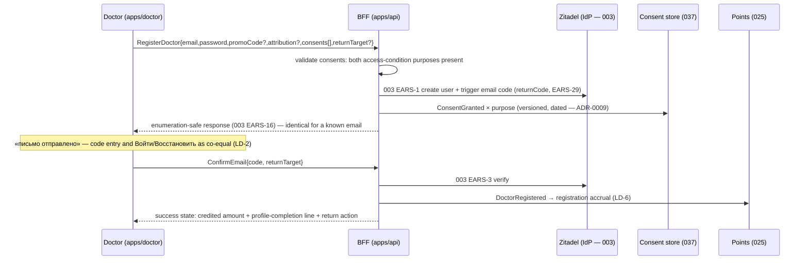
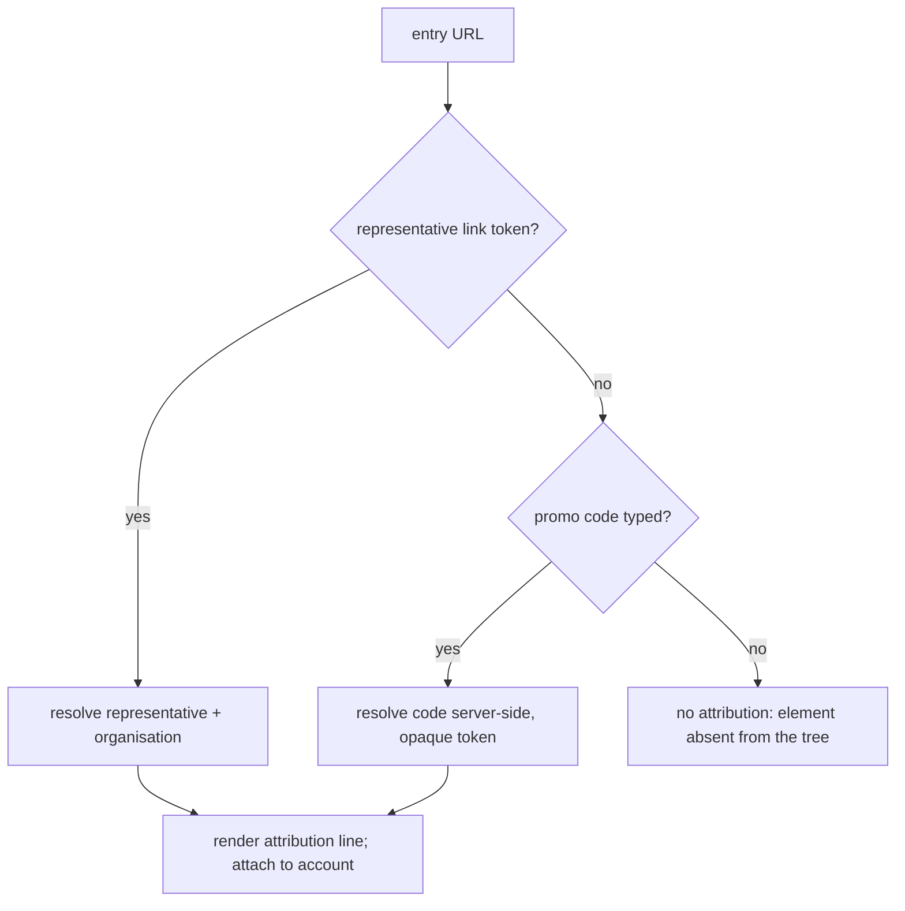

> Requirements: [`021-requirements-en.md`](./021-requirements-en.md) · PRD: [`021-product.md`](./021-product.md) · Composition SoT: [`design-source/auth.dc.html`](../../../../../../design-source/auth.dc.html)

# 021 — Design

## 1. Route topology and screen composition

`#d-register` is a public route of `apps/doctor` on `doctor.school`, rendered inside feature 017's shell. The composition is the `auth` canvas's split screen, taken unchanged; 021 changes what fills the split's left half and what stands around the submit button.

| Region                   | Content                                                                                       | Stage-A pick                        |
| ------------------------ | --------------------------------------------------------------------------------------------- | ----------------------------------- |
| Split — left half        | The return context: 018's event-card unit for the lesson / эфир / ticket, **no back control** | F-021-2 **Б**                       |
| Split — right half, top  | Soft-terms statement, the attribution line when one resolved, the points promise              | F-021-3 (promise on the form)       |
| Split — right half, form | email · password (show-password toggle) · optional promo code                                 | —                                   |
| Above the submit button  | Tier 1 — access conditions: medical-worker declaration + partner-data consent                 | F-021-1 **Б**                       |
| Below the submit button  | Tier 2 — the optional marketing opt-in                                                        | F-021-1 **Б**                       |
| Sent / confirmed states  | The canvas's «письмо отправлено» / «почта подтверждена» states, plus the success block        | base canvas + the 021 success block |

At 390 the split collapses per the canvas: the return-context card becomes the background plate above the form, and both consent tiers keep their relative order and their visual separation. With no return context the left half's card is **absent from the tree** — the split renders as the canvas's single-column arrangement rather than as an empty frame (EARS-3).

## 2. The seam with feature 003 (LD-1)

021 owns a surface; 003 owns the engine. The seam is exactly one request payload and one confirmation callback.

Nothing in this diagram creates a second credential path, a second code path or a second consent model. A 021 change request that would move a box from the 003 column into the 021 column is a 003 increment, not a 021 requirement.

## 3. The return target (LD-3, LD-8, EARS-10)

The target is an opaque, server-signed token minted by the gate that sent the doctor here, carried as a query parameter, embedded into the verification email's confirmation URL, and resolved back to a route only at confirmation time.

Three properties the implementation must preserve: the token is never a raw URL the client can forge; the client never reconstructs the target from a referrer, a `document.referrer` read or a stored breadcrumb; and the degraded branch always renders a plain Russian statement of what happened rather than a silent redirect. This is the same contract 019 LD-7 hands in when a guest acts on a feed card — the feed URL is the target.

## 4. The two-tier consent model (F-021-1 Б, LD-5, EARS-5, EARS-7)

Two tiers on the screen; three purposes in the record.

| Purpose                      | Tier              | Required | Record when granted             | Record when withheld |
| ---------------------------- | ----------------- | -------- | ------------------------------- | -------------------- |
| `medical-worker-declaration` | access-conditions | yes      | versioned row + date            | command refused      |
| `partner-data-sharing`       | access-conditions | yes      | versioned row + date            | command refused      |
| `marketing-communications`   | marketing         | no       | versioned row + date + segments | **no row at all**    |

The partner-data statement is data-driven, not a copy blob: its `dataComposition` (name, specialty, city, place of work) and `excluded` (contact details) render from the read model so that changing the shared composition changes the statement and the record together. Withdrawal is not a surface: the interface renders the manager-request statement and no toggle — a withdrawal reaches the store as a manager-side operation of feature 037.

## 5. Attribution resolution (LD-7, EARS-8)

A link-borne attribution wins: when both are present the typed code never overwrites the resolved representative. The rendered line names the source of the arrival — the organisation or the representative — and never the payer; glossary canon applies («инвестор (организация)» / «первоинвестор», never «партнёр» as money-carrier).

## 6. Points promise and credit (F-021-3, LD-6, EARS-9)

One configuration source feeds both renders: `{ registration: 20, profileCompletion: 30, unit: 'Pul' }` today, per the owner's 2026-08-25 record. The form reads it to render the promise; the success state reads the **credited** fact emitted by 025 after `DoctorRegistered`. 021 writes no ledger row, so a divergence between the promise and the credit can only come from a configuration/ledger mismatch, which the EARS-9 verification pins by changing the configured value and asserting both renders move.

The advance mechanics — the per-event configurable flag the owner fixed — live on the event (020) against the engine (025) and appear nowhere in this feature's tree.

## 7. Field contracts (EARS-11, LD-9)

| Field             | Client rule                               | Mask   | Notes                                                                                        |
| ----------------- | ----------------------------------------- | ------ | -------------------------------------------------------------------------------------------- |
| email             | address shape                             | `none` | A mask would reject legitimate address forms.                                                |
| password          | length ≥ 8 (003 EARS-36), persistent hint | `none` | Hint and error occupy distinct slots (003 EARS-37); show-password toggle (003 EARS-38).      |
| promo code        | trim + length bound, otherwise opaque     | `none` | The code vocabulary belongs to a campaign, not to the form.                                  |
| verification code | fixed length, alphanumeric                | `none` | `inputMode` admits letters; **no** CSS uppercase transform — verification is case-sensitive. |

All four use the semantic field primitives tracked in #197 and draw copy from the message catalog (003 EARS-21). Client validation is a UX affordance only; the BFF and the IdP stay the authority.

## 8. Sequencing the build

1. **The route and the form** (EARS-1, EARS-11) — the split composition, the three inputs and their field contracts. Everything else composes on top.
2. **The consent tiers and the record** (EARS-4, EARS-5, EARS-6, EARS-7) — the command's precondition and the purpose rows; nothing can be submitted meaningfully before this.
3. **The return target end to end** (EARS-2, EARS-3, EARS-10) — mint, carry, survive the email, resolve, degrade. Agree the token shape with 019 LD-7 before either ships its guest path.
4. **Attribution and points** (EARS-8, EARS-9) — both are additive to a working registration and both depend on external consumers (035, 025).
5. **The honest-state surface** (EARS-12, EARS-13, EARS-14) — errors, the disabled-submit reason, the enumeration-safe already-registered path, the preserved failed submission.
6. **Cross-cutting** (EARS-15, EARS-16, EARS-17) and the process gate (EARS-18) — one account, mobile/themes/axe, the marketing handoff, and the owner's Stage-B confirmation on the live stand before merge.
