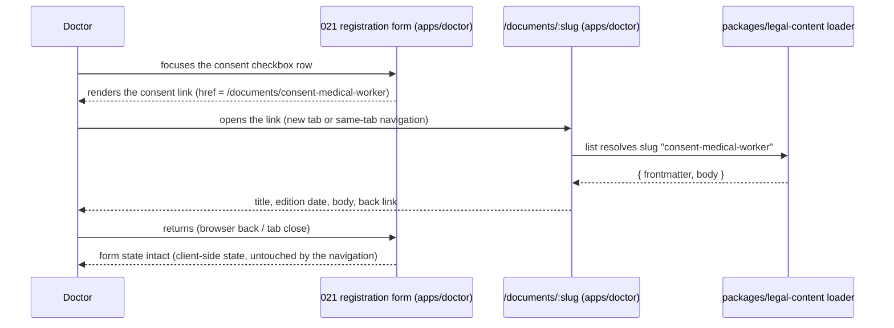

# 028 — Legal pages (Design)

## Content package decision

**New package `packages/legal-content/`.** `ls packages/` at authoring time shows no existing content/i18n package (`glossary` is a term-id registry, not prose content) — 028 is the first surface with document-shaped content, so it graduates a new package rather than forcing the shape into `glossary` or `db`.

- Documents are Markdown files, one file per document, frontmatter: `slug` (matches the route segment), `title`, `edition` (a quoted ISO date `"YYYY-MM-DD"`, the «редакция от» value — quoted because YAML coerces a bare date scalar to a timestamp and silently rolls an impossible one over, e.g. `2026-02-30` → 2 March), `kind: policy | consent`.
- No CMS, no database table, no admin authoring UI. A document is a reviewed file: publishing a correction is a PR against this package, same review bar as code (Mode (a) + green CI). This is a deliberate scope cut for slice 1 — document volume is small (one policy + four consent texts in R1), change frequency is low, and an admin UI/CMS is a second surface to build and secure for a workload a PR already covers. R3 (slice 2) may revisit this once document count and edit frequency from non-engineering owners justify it — not decided here.
- The package exports a loader: `slug → { frontmatter, body }` and a `list(kind?)` enumerator. Both hosts and the shared component consume only this loader — no host reads the Markdown files directly.

## Shared component, thin host projection (AGENTS.md §6)

One reading component lives in `packages/design-system` and renders any document: title, «редакция от <дата>», ToC (sticky left at ≥1440px / collapsed above the body at ≤390px per `tocVariant: А`), body, back link, «Другие документы».

- `apps/doctor` and `apps/portal` each add only:
  - a documents-list route rendering their own projection (which `slug`s appear and in what order — EARS-3; neither host's list carries a caption or exit to the other — EARS-6),
  - a `[slug]` document route that calls the shared component,
  - the contacts + requisites blocks, which are host-specific copy (support email, canvas captions) but the same layout primitive.
- No app-to-app imports. Neither host imports from the other; both import from `packages/legal-content` and `packages/design-system` only.

## URL scheme

- Documents list: `/documents` on both hosts (host-relative — `doctor.school/documents`, the Academy's own domain/path `/documents`).
- Document page: `/documents/:slug`, where `:slug` is the document's frontmatter `slug` — stable for the document's lifetime, independent of its title or edition (EARS-10). Renaming a document's title never changes its `slug`.
- Consent documents use descriptive slugs matching their 021 checkbox, e.g. `/documents/consent-medical-worker`, `/documents/consent-partner-data`, `/documents/consent-marketing`, `/documents/consent-photo-video`.

## Edition / «обновлено» rule

- `edition` is an ISO date, shown as «редакция от <дата>» on the document page — the only version marker a reader sees.
- A documents-list row shows the «обновлено» chip when the document has been republished with a new `edition` date later than its first publication (EARS-11); how long the chip stays visible is a follow-up decision, not fixed here; no numeric version is ever rendered (EARS-11).
- Correcting a document's text bumps `edition` in the same file, same `slug` — a new edition is a content change, not a new document.

## No-placeholder rule (EARS-12)

The documents-list and route projections enumerate only `slug`s present in `packages/legal-content` with `kind` matching that list's scope. A document the owner has not yet approved simply does not exist as a file — there is no "draft" state, no disabled row, no placeholder text. This is a filesystem-level guarantee, not a runtime flag to remember to check.

## Sequence — opening a document from a registration checkbox

## dataState (loading / error / not-found)

The document route follows the canvas `document.dc.html` states — `обычно` (normal), `загрузка` (loading), `ошибка` (error), `не найден` (not-found, an unresolved `slug`). Not-found and error states render inside the same shared component shell (title area replaced by the state message), never a bare host 404/500 page, so a mistyped or stale document link still lands the visitor in a recognizable, on-brand surface with a way back to the documents list.
