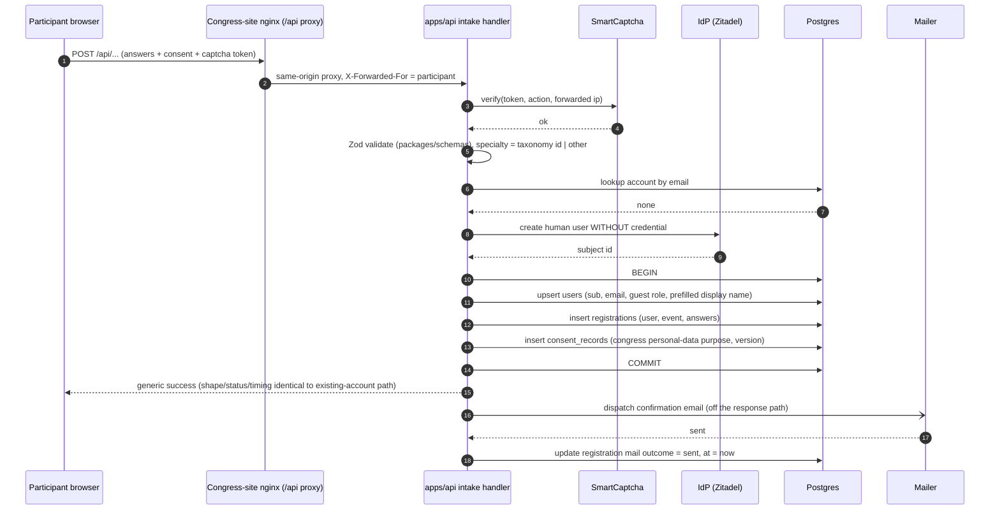
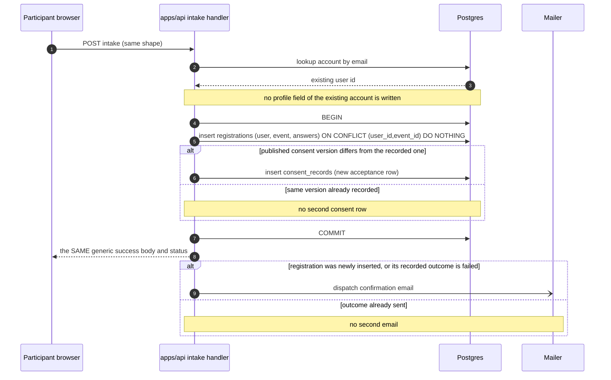
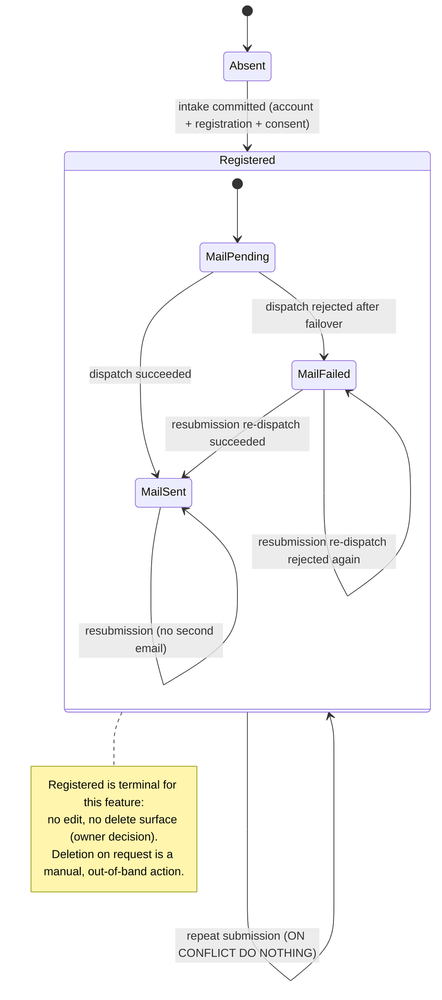
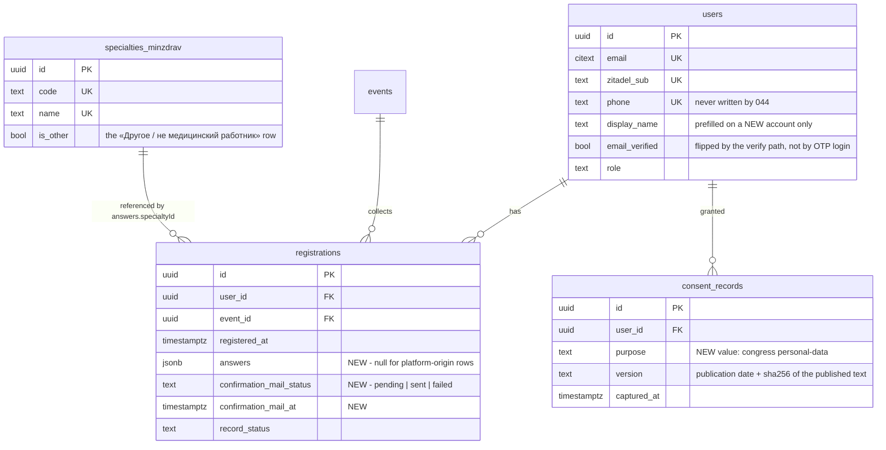

# 044 — Congress sign-up (Design)

Requirements: [`044-requirements-en.md`](./044-requirements-en.md) · PRD: [`044-product.md`](./044-product.md).

## Transport boundary

The API has no CORS and gains none. The congress site's own nginx terminates the participant's request and proxies `/api` to the platform API, so the browser only ever talks same-origin to the site. Two consequences the implementation must honour:

- The site's nginx egress address enters `TRUSTED_PROXIES` (`apps/api/src/config/trust-proxy.ts:97-120`). Fastify's `trustProxy` walks `X-Forwarded-For` right-to-left and stops at the first untrusted hop; without this entry the rate-limit key (`apps/api/src/auth/rate-limit/rate-limit.types.ts:57-62`) collapses to the proxy address and the per-IP window (20 / 15 min by default, `:32-36`) becomes a global cap on the whole congress site.
- Bot protection is per-route opt-in: the global guard no-ops unless the handler carries `@BotProtected` (`apps/api/src/bot-protection/bot-protection.guard.ts`), and the SmartCaptcha provider reads the token from the `x-smartcaptcha-token` header or the `captchaToken` body field. The intake route declares the decorator explicitly; a rejection throws the generic exception that discloses no reason.

## Intake cascade — new account



## Intake cascade — existing account



The two diagrams differ only in the branch the server takes; the response the participant observes is byte-identical in shape and status, and the account-creation hop is kept off the latency difference that would otherwise leak existence (the same isolation the 003 engine already applies to its account-exists notice, `apps/api/src/auth/auth.service.ts:596-628`).

## Mail failure

```mermaid
sequenceDiagram
    autonumber
    participant A as apps/api intake handler
    participant D as Postgres
    participant M as Mailer

    A->>D: COMMIT (account + registration + consent)
    A-->>A: HTTP response already returned
    A-)M: dispatch confirmation email
    M--xA: ChannelRejection after failover
    A->>D: update registration mail outcome = failed, at = now
    Note over A,D: the registration is NOT rolled back and NOT retried on a schedule
    Note over A: recovery = the participant resubmits the form; the idempotent path re-sends
```

The existing mailer throws a typed rejection only to a caller that awaits it (`apps/api/src/mailer/smtp-mailer.ts:207-244`); the 003 auth callers deliberately never await on the response path (`auth.service.ts:550-556`, `:618-628`). 044 keeps that isolation but, unlike 003, does not merely log: the outcome becomes a column on the registration row so the registrar sees it in the roster and the resubmission path has something to decide on. No outbox, no scheduled sweep — the recovery mechanism is the participant resubmitting, which the `(user_id, event_id)` uniqueness already makes safe.

## Registration and mail state



## IdP acceptance of a credential-less human user

`IdpClient.createUser` types `password: string` as mandatory (`apps/api/src/auth/idp/idp.types.ts:84`, port at `:279`), and the Zitadel adapter always nests a `password` inside the `human` body of `POST /v2/users/new` (`apps/api/src/auth/idp/zitadel.idp.ts:302`, body at `:316-341`). No code path constructs the human without it, and no bulk-import or Academy path creates a credential-less user today — so 044 adds the first one: the input type gains a passwordless variant and the adapter omits the `password` member entirely (not an empty string) for that variant. The adapter's existing placeholder `givenName`/`familyName` fabrication (`:325-341`) is replaced on this path by the submitted surname and first name, which 044 actually collects.

Whether our Zitadel configuration accepts a human user created with no credential — and whether such a user can subsequently complete the verification-code path and then log in by one-time code — is an environment fact, not a code fact, and is settled by a live check against the dev-stand IdP rather than assumed.

Evidence: live dev-stand check 2026-09-21 — `POST /v2/users/new` with the adapter body minus `human.password` → 200, user `USER_STATE_ACTIVE`; probe user deleted. The vendor API reference marks the `password` oneof as required in error (zitadel/zitadel#12699).

## First platform entry

Email-OTP login is not a verification mechanism. For an email-unverified account the port silently re-issues the verification code instead of an `otp_email` login code, and the synchronous acknowledgement is identical for verified, unverified and nonexistent addresses (`apps/api/src/auth/auth.service.ts:216-239`); a successful OTP login never flips `email_verified` — the only writers are the dedicated verify path (`:684`) and password-reset completion (`:413`).

So the congress account's first entry is the existing verification-code path: the participant requests a code for the email they typed, enters it, `email_verified` flips, and from then on the existing email-OTP login works. This is exactly the owner's «Укажешь чужую — не попадёшь»: address ownership is proven the first time the platform is actually used, and nothing gates the sign-up itself. 044 introduces no parallel verification flow — the endpoints are the ones 003 already ships.

## Data model



**`registrations.answers`** (`packages/db/src/schema/registrations.ts:42-93` gains the column) holds surname, first name, optional patronymic, contact phone, email, specialty reference (a `specialties_minzdrav` id or the `is_other` row), workplace, city and region. The shape is owned by a Zod schema in `packages/schemas` — the same schema validates the intake request, so the column can never hold a shape the API would reject. The column is nullable because the platform-origin path (a signed-in doctor registering from the feed) writes no answers; the roster renders those rows from the account's profile and leaves a cell empty where the profile has no value.

**`registrations.confirmation_mail_status` / `_at`** make the send outcome a queryable fact rather than a log line, which is what lets the roster show it, the roster filter on it and the resubmission path decide whether to re-send.

**`consent_records`** stays append-only and immutable (`packages/db/src/schema/consent-records.ts:26-36`): every acceptance is its own row, and the version is server-stamped exactly as the doctor-storefront door stamps its own purposes (`doctor-register.service.ts:38-63`), never taken from the caller. The new purpose constant joins the closed list in `@ds/schemas`; the DB column stays free text.

## Specialties list endpoint

The only public specialty-related endpoint today is the per-browser choice cookie (`apps/api/src/storefront/specialty-choice.public.controller.ts:84-97`, `:136-194`) — it remembers one selection, it does not enumerate the book. 044 adds a public, unauthenticated, read-only list over `specialties_minzdrav`, cacheable at the HTTP layer, reached through the same same-origin proxy as the intake. No build-time snapshot is produced: a snapshot baked into the congress site would drift from the taxonomy silently and would make a taxonomy correction require a site redeploy.

## Authorization boundary

The role set in `apps/api/src/authz/authz.types.ts:18-27` gains `event-registrar`. Authorization reads the Zitadel project-roles claim (`zitadel.idp.ts:119`), not the `users.role` mirror, which stays a downstream projection. The `Authz` decorator on each endpoint remains the Layer-1 single source of truth, so the role's reach is expressed as matrix rows, not as scattered checks:

- the roster route and the data the print view reads → allowed for `event-registrar` and the platform administrator;
- every other endpoint → explicitly refused for a principal holding only `event-registrar`, including all mutations of the admin surface.

`apps/admin`'s access gate is binary today — one trusted role, and the nav renders seven static links with no filtering (`apps/admin/providers/access-control-provider.ts:6-41`, `apps/admin/components/app-shell.tsx:64-117`). 044 makes both role-aware. The client-side gate is a projection: it decides what to draw, never what is permitted. A registrar who types another section's URL is refused by the server, and the admin simply has nothing to render.

## Roster and print projections

The roster is an HTTP route over the existing in-process `eventRoster()` read model (`apps/api/src/registration/registration.service.ts:178-181`), widened from its current PII-free `(doctor, event, registeredAt)` fact to the answers the registrar needs. It renders on `AdminDataList` (`apps/admin/components/admin-data-list.tsx:62-371`), whose query state today carries `q`, `status`, `includeRetired`, `page` and `pageSize` and no sort field at all. 044 adds sort and filter to that query state and to the server query, one pair per roster column: contains-search on the text columns (ФИО, место работы, город, область, телефон, email), a select on специальность and on статус письма, and a range on дата регистрации; sort accepts any of the same columns, in both directions. № is a row counter and carries neither sort nor filter. Because sort and filter are server-side, the printed sheet and the screen agree on ordering and scope across pages (owner-approved scope, #2287 issuecomment-5756369423: «Сортировка и фильтрация должна быть по всем полям вообще»).

The print view is the same filtered, sorted query rendered for paper: the browser's own print path plus a print stylesheet, which is the first `@media print` rule anywhere in `apps/admin` or `packages/design-system`. Nothing is exported to a file. Per the owner's approved variant «Б, без подписи и статуса письма» (#2287 issuecomment-5756369423), the sheet is a full copy of the currently filtered and sorted roster with every roster column except `статус письма`, no signature column, and a header carrying the event's name and date.
