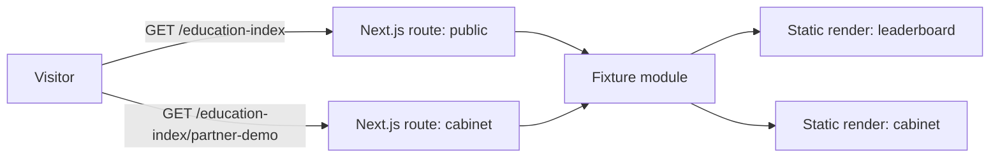
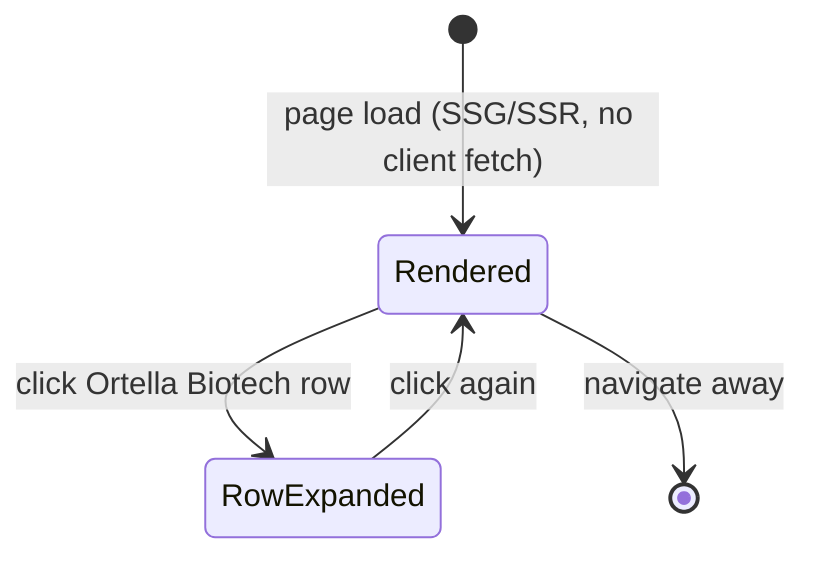

# 045 — Education index demo (Design)

Requirements: [`045-requirements-en.md`](./045-requirements-en.md).

## Page composition

Both routes reuse the Academy shell (`academy-home.dc.html` header/footer, as-is) and stack, under it, the sticky demo plaque (EARS-11), then the screen-specific units vendored from `academy-partners.dc.html` (public) and `academy-investor-cabinet.dc.html` (cabinet), recomposed into one canvas `academy-index-demo.dc.html` with the `screen` prop. No route owns its own header/footer markup — both mount the shared `apps/portal` layout shell.

## Fixture module

One TypeScript module under `apps/portal` (e.g. `lib/education-index-demo/fixtures.ts`) exporting:

- `organizations`: 12 entries (id, name, emblem plate/monogram/shape, investment amount+share, attention share, doctors, lessons, events, index, rank-delta) — the table in design prompt 23.
- `weeklySeries`: index values per organisation per week 1–4. The prompt states weeks 1, 3 and 4 for every place and weeks 1–4 only for places 1–3; **the fixture author derives weeks 1–2 for places 4–12** by linear interpolation between the stated week-1 baseline and week-3 value, rounded to the nearest integer — a documented fixture-authoring rule, not a design decision, because the canvas never renders those intermediate points.
- `cabinet`: the Ortella Biotech KPI tiles, awareness before/after rows, funnel steps, weekly attention totals, audience summary chips and the 5-row audience table.

## No chart primitive

`@ds/design-system` carries no chart/stat-tile primitive. Every bar, scale and stacked plate (leaderboard sub-bars, top-5 investment plate, weekly dynamics bars, awareness before/after bars, funnel bars, plan/fact scale) is built bespoke from design-system tokens (`ds-foundation.dc.html` palette, spacing, radius) through the `build-ui-from-design-system` gate: inventory of existing primitives first, bespoke recorded as last resort, no axis/grid/tooltip chart-library look. Organisation emblems are inline SVG (colour plate + two-letter monogram + geometric mark), never a raster image.

## State diagram

No loading, error or empty state exists (Invariants — the demo is fully static); the only client-side state is the single expanded leaderboard row.

## Removal plan

Both routes, the fixture module and the `academy-index-demo` canvas reference are deleted in the same release that ships features 032 (investors leaderboard) and 035 (investor cabinet) — EARS-14. The removal PR deletes `apps/portal` route files, the fixture module, and updates `design-source/` manifest to drop the demo canvas entry; it carries no new EARS handler, only a scoped deletion linked from the 032/035 release Issue.
