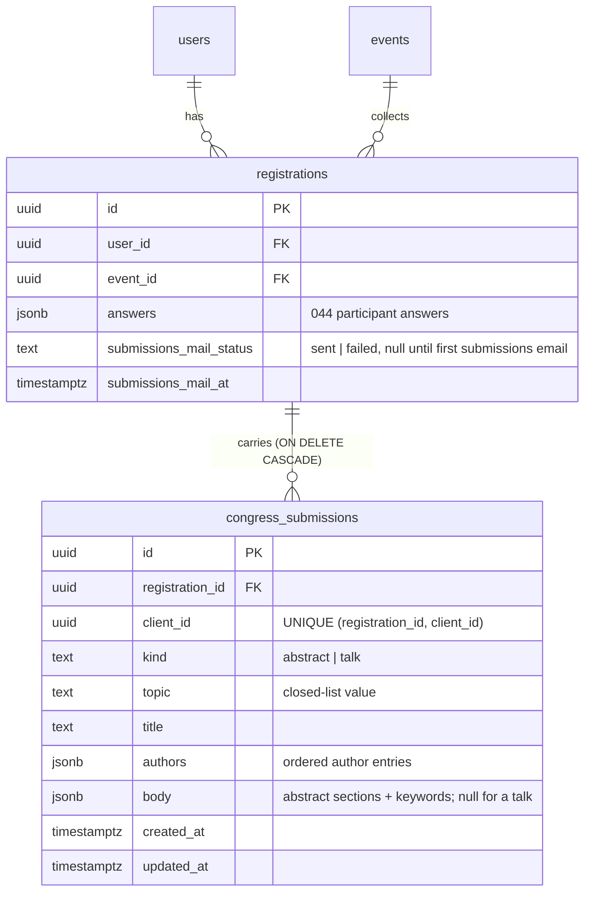
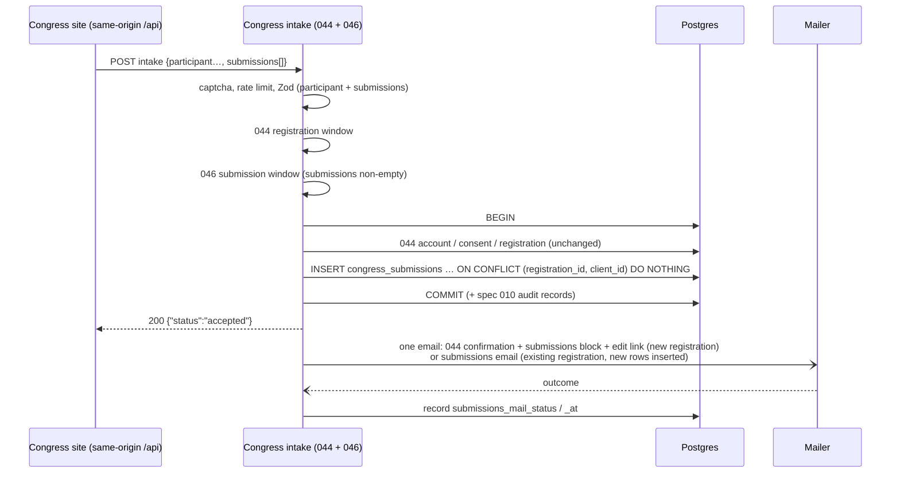

# 046 — Congress abstracts and talk submissions (Design)

Requirements: [`046-requirements-en.md`](./046-requirements-en.md) · PRD: [`046-product.md`](./046-product.md) · Parent: [`044-design.md`](../044-congress-signup/044-design.md).

## Transport boundary

046 adds no new public account-creating door. The submissions ride in the body of the 044 intake endpoint as an optional `submissions` array (at most 10), so the participant block and every submission travel in **one POST** through the congress site's same-origin `/api` proxy, behind the same `@BotProtected` captcha and the same 60-per-15-minutes intake rate-limit scope (044 EARS-1, EARS-2). One request rather than one POST for the participant and one per submission, because:

- the owner's rule is that a submission cannot exist without a participant — one request makes that a transaction boundary instead of an ordering the browser has to get right;
- a second public endpoint would need its own captcha, its own rate-limit scope and its own anti-enumeration proof, for no gain;
- the response stays the single 044 `{ "status": "accepted" }` (EARS-7), so the site never branches on what the server found.

Idempotency is per submission: each item carries a `clientId` (UUID) the site generates once when the author adds the block to the form. `(registration_id, client_id)` is unique; a re-sent form (double click, network retry, the participant re-submitting the whole page) inserts nothing new for known ids and **does not overwrite** them — the public route is unauthenticated, and anyone who knows an email could otherwise rewrite someone's abstract. Editing is the edit link's job alone.

The edit-by-link endpoints and the public submission-form endpoint are served through the same proxy. The form endpoint is `GET`, unauthenticated and cacheable (a short `max-age`, like the 044 specialties list), so the site reads dates, topics and limits at page load.

## Submission window

Two REQUIRED API env keys, `CONGRESS_SUBMISSION_WINDOW_OPENS_AT` and `CONGRESS_SUBMISSION_WINDOW_CLOSES_AT`, validated next to the 044 keys in the congress module configuration (`apps/api/src/congress/congress-signup.config.ts` or a sibling `congress-submission.config.ts`), with the 044 rules verbatim: ISO-8601 with an explicit offset, close strictly after open, fail closed on unset/unparseable/inverted. This is the owner's «вынести эту дату в настройки»: moving the deadline is an env change on the deployment and a restart, not a platform release, and — unlike 044, whose dates the site hardcodes — the site reads the instants from the form endpoint (EARS-10), so it never needs an edit either. A database row and an admin screen stay out for the same reason as in 044: one congress, one value; a second concurrent congress is the point at which the window becomes event data.

Evaluation order in the intake handler: guards and request validation → 044 registration window → **submission window, only when `submissions` is non-empty** → account lookup and writes. A request with submissions outside the window is refused whole (`submissions-not-yet-open` with the opening instant, or `submissions-closed`), so a participant is never silently registered without the abstract they meant to send; the site does not normally send such a request because it hides the sections (EARS-24). A request without submissions is untouched by this window.

Production values today: opens 2026-10-01T00:00+03:00 (same as the 044 opening), closes 2026-12-01T00:00+03:00.

## Abstract field set

**Base set, to be confirmed by the owner** (`046-product.md`, Open question 1). The owner is updating the field list from past congress archives; the schema, the form endpoint and the site counters all read this one declaration, so the final set replaces this table and the matching Zod declaration without changing any requirement number.

| Field                | Shape                                       | Limit (characters, after trim) |
| -------------------- | ------------------------------------------- | ------------------------------ |
| title                | text, required                              | 250                            |
| topic                | value of the closed topic list              | —                              |
| authors              | 1–15 author entries (see below), order kept | —                              |
| «Актуальность»       | text, required                              | 1500                           |
| «Материалы и методы» | text, required                              | 1500                           |
| «Результаты»         | text, required                              | 1500                           |
| «Выводы»             | text, required                              | 1500                           |
| keywords             | 1–6 entries                                 | 60 each                        |

An **author entry** is surname, first name, optional patronymic (normalised by 044 EARS-33), workplace (≤ 300, stored as typed), optional email (normalised: trimmed, lower-cased) and, on a talk only, a `presenting` flag.

The **topic list** is a closed list declared in `packages/schemas/src/congress/` beside the schema (value + RU label); its contents are part of the owner's field set. The submission-intake work package therefore starts implementation only once Open question 1 is answered — the list is not invented here.

Character limits are counted in Unicode code points after trimming surrounding whitespace, on the server; the site's counters show the same numbers because they come from the form endpoint.

## Talk field set

**Base set, to be confirmed by the owner**, from the owner's own wording («Подаётся тема, название доклада, список соавторов доклада»):

| Field   | Shape                                                                 | Limit |
| ------- | --------------------------------------------------------------------- | ----- |
| topic   | value of the closed topic list                                        | —     |
| title   | text, required                                                        | 250   |
| authors | 1–15 author entries, at least one with `presenting: true`, order kept | —     |

If the owner keeps the poster as a third kind (Open question 2), it enters as a third member of the discriminated union with its own field table here; nothing else in this design changes shape.

## Data model



**One table, `congress_submissions`, with authors as an ordered jsonb array** — not a separate `congress_submission_authors` table. The reasons:

- Authors are attributes of one submission, not people: they have no identity on the platform, are never referenced from anywhere else, and are always read and written as the whole ordered list the author typed. A child table would add a join, a delete-and-reinsert on every edit and an ordering column for no query it serves.
- The registry's author searches (EARS-20) run over hundreds of submissions per congress — `jsonb_array_elements` with a contains predicate is adequate at that volume; no index is warranted, and if a future congress changes the volume by orders of magnitude a generated search column is the next step, not a table.
- `body` is jsonb for the same reason and one more: the abstract field set is provisional. The Zod declaration validates the column on write and on read (as 044 does for `registrations.answers`), so the owner's final set changes the schema, not the table.
- `kind`, `topic` and `title` are real columns because the registry sorts and filters by them.

The submission links to the **registration**, not to the user and event separately: the registration row already is the unique `(user, event)` pair, so a submission can never name a person and an event that are not registered together, and deleting the registration (the team's manual deletion on request) removes its submissions by `ON DELETE CASCADE`.

The submissions-email outcome lives on the registration beside the 044 confirmation outcome, because the email lists all of the registration's submissions, not one.

Who created or changed a submission and when is not a new column set: `created_at` / `updated_at` sit on the row, and the actor and channel go through the spec 010 audit mechanism (`apps/api/src/audit/README.md`).

## Intake cascade — participant with submissions



The 10-per-registration bound is checked inside the transaction against the existing row count plus the new client ids. A submissions email is sent when this request inserted at least one new row, or when the recorded outcome is `failed` (EARS-12); a pure repeat with nothing new and a `sent` outcome sends nothing, as in 044.

## Edit link

The link is `https://<congress site>/<edit page>#t=<token>` with

```
token = base64url(registration_id) "." base64url(HMAC-SHA256(CONGRESS_SUBMISSION_LINK_SECRET, "046-edit-link:v1:" || registration_id))
```

- **Signed and stateless, deterministic per registration.** Every email carries the same link, so an author who opens an older email still reaches their submissions. A stored random token would need either re-issuing per email (killing the links in earlier emails) or storing the token recoverably; a JWT with an `exp` claim would freeze the deadline into links already sent, so moving the deadline in settings would not move them.
- **Expiry is the window, evaluated at use.** The token carries no expiry of its own: writes are refused with `submissions-closed` once the window closes, reads stay available so the author can see what they sent. Moving `CONGRESS_SUBMISSION_WINDOW_CLOSES_AT` moves every link at once.
- **Revocation** is rotating `CONGRESS_SUBMISSION_LINK_SECRET`, which invalidates all links; per-link revocation is not a stated requirement. A missing secret closes submission intake the same way an invalid window does, since no email could carry a working link.
- **In the fragment, sent as a header.** The fragment never reaches the site's nginx or the API access logs and never leaks through `Referer`; the site's edit page reads it and sends `x-congress-submission-token`. Comparison is constant-time; every failure — malformed, forged, unknown registration — is the same generic refusal.
- **Not a sign-in.** The token authorizes three operations on one registration's submissions — read, add, replace by client id — and nothing else: no platform session, no account data beyond the participant's display name shown on the edit page. The platform account is still entered through the 044 code-based path.

Edit endpoints (names settled at implementation):

| Operation             | Window closed                                     | Effect                                                               |
| --------------------- | ------------------------------------------------- | -------------------------------------------------------------------- |
| read own submissions  | allowed                                           | participant display name + the registration's submissions            |
| add a submission      | `submissions-not-yet-open` / `submissions-closed` | insert, bound of 10, spec 010 audit (`edit-link`), email             |
| replace by `clientId` | same refusal                                      | full replace of topic/title/authors/body, `updated_at`, audit, email |

## Authorization boundary

`congress-partner` joins the role set in `apps/api/src/authz/authz.types.ts:18-30`, read from the Zitadel project-roles claim like every other role. Its event scope comes from the event-role binding store the 044 amendment defines (#2380, the platform `event_role_grants` shared by the event-bound roles); 046 adds the role's rows to that store's allowed set and nothing to its shape. Grants are made manually in Zitadel plus a binding row until #2378 ships the platform-admin screen.

As in 044, the `Authz` decorator on each endpoint is the Layer-1 source of truth, and the role's reach is matrix rows:

- the submissions list and card for the bound event → allowed for `congress-partner` and for the platform administrator (any event);
- every other endpoint — the 044 roster and print data, other events' submissions, every mutation, every other admin section → refused for a principal holding only `congress-partner`.

The admin navigation projects the same rule (EARS-18): a partner-only principal is shown the single «Заявки» item. The client gate decides what to draw, never what is permitted.

The partner sees contacts by the owner's explicit decision («Контакты он тоже видит … Read-only»): the submitter's full name, email and contact phone from the registration's `answers`, and the co-authors' emails. It sees nothing of registrations that carry no submission.

## Submissions registry projection

The registry is a server read model over `congress_submissions` joined to `registrations` for the submitter's answers, rendered on `AdminDataList` (`apps/admin/components/admin-data-list.tsx`) with the sort/filter query state that 044 adds to it — 046 reuses that extension, it does not add a second one. Columns: №, kind, title, topic, speakers (presenting co-authors), authors, submitter, email, phone, submitted, changed; № is a row counter without sort or filter.

Filters map the owner's «выборка по спикерам и по тезисам»:

- **by speaker** — contains-search over the full name and workplace of authors with `presenting: true`;
- **by abstract** — contains-search over `title`, `topic` label and `body.keywords` of `abstract` rows;
- kind and topic selects, any-author and submitter contains-searches, a submitted-date range.

The card is the same row with `body` rendered section by section and the author list in its original order. Neither screen carries a mutation affordance; the admin API exposes none. Visual placement is settled through the admin Stage-A design gate.

## Congress-site contract (orthobio-site#99)

The site owns rendering only; every rule it shows comes from the API:

- page load reads the form endpoint: window state and instants, topic list, per-field limits;
- the participant block is the 044 form unchanged; the submission sections appear only in state `open`;
- each added block gets a `clientId` once; the whole form is one POST; on `accepted` the site shows the approved confirmation;
- the edit page reads `#t=`, calls the read endpoint with the header, renders the same sections editable while `open` and read-only otherwise.

The form layout, the co-author repeater and the copy of the confirmation and the emails pass Stage A; the proposed shape is Open question 3 of the PRD.
