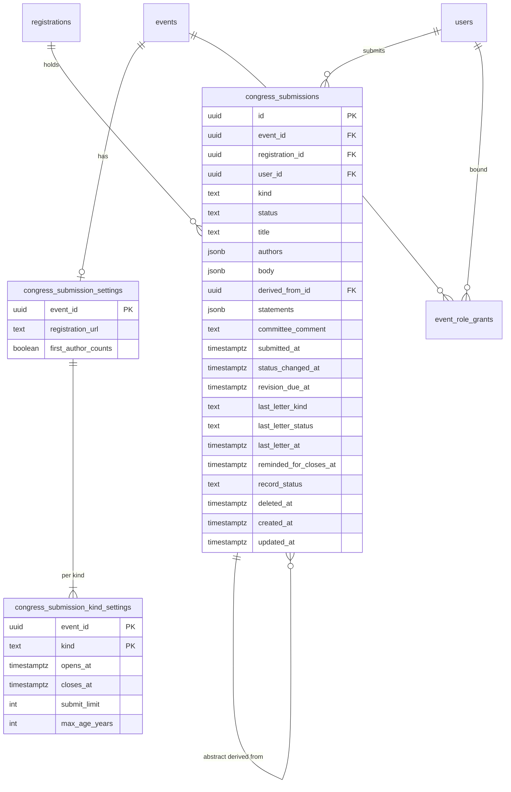
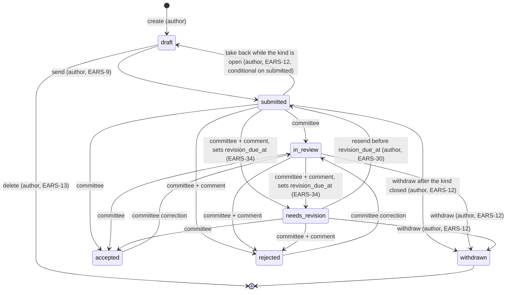

# 046 — Congress submissions: oral talks, posters and abstracts (Design)

Requirements: [`046-requirements-en.md`](./046-requirements-en.md) · PRD: [`046-product.md`](./046-product.md) · Builds on: [`044-design.md`](../044-congress-signup/044-design.md).

## Host and shared unit

**Host: the doctor storefront, `/account/congress`.** Congress participants are doctors; ADR-0015 §2 makes `apps/doctor` the doctor-facing host and `apps/portal` the Academy backstage for experts and partners. The doctor storefront already serves `/account` (`apps/doctor/app/(storefront)/account/page.tsx`, the 003 profile projection until feature 022), and 044 EARS-16 already sends signed-in doctors to congress registration from the doctor event feed. The section is a child page of that account, linked from it.

**Shared unit: `packages/congress-submissions` (`@ds/congress-submissions`).** ADR-0013 A1 allows a host exactly a route file and a host-config object. The package owns the section's page component, the three forms, the autosave hook, the status labels, the RU copy with the refusal dictionary, the browser transport of the `/v1/me/congress-submissions` endpoints (`@ds/congress-submissions/client`), the guest decision and return target (`@ds/congress-submissions/route`) and their tests. The doctor host mounts `CongressSectionRoute` from `@ds/congress-submissions/route` in `apps/doctor/app/(storefront)/account/congress/page.tsx`, handing it the host's `@ds/auth-flow` config and one host-config object, `apps/doctor/lib/congress-submissions.host-config.ts` — data only: the section path, the account page its back link returns to and the event page prefix — which carries its own row in the host-file allowlist. The account page `apps/doctor/components/account-screen.tsx` shows the row «Мои заявки на Конгресс» (the design-system account card's `congressHref`) to an account registered for the congress, read through the package transport. The validation schemas and the abstract length function live in `packages/schemas/src/congress/` so that the form counter and the server decide identically. The Academy host does not mount the section today; mounting it later is a second route file, not a fork.

**Recorded alternatives.** orthobio.ru forms with an emailed signed link were the earlier draft; the owner chose a platform cabinet (variant Б) because a link-only author has no place to see statuses and comments. The Academy host was rejected because its audience is the backstage (ADR-0015 §3.1).

## Entry and return

> **Production amendment — entry by code from the congress site (2026-10-02, #2552 / #2553).** The diagram and the «044 letter link» section below describe the deployed baseline. Target: the 044 confirmation letter carries no link (EARS-15 amended, #2557); the entry is the congress site's «Войти в кабинет» button to `{MAILER_DOCTOR_BASE_URL}/login?method=code&returnTo=/account/congress` — `method=code` opens the email-code method directly (003 EARS-43), `returnTo` is admitted by the unchanged `parseAccountReturnTarget`, and the code submission verifies an unverified congress account and signs in in one step (003 EARS-41). The cross-repo dependency `doctor-school/orthobio-site#99` changes its «Войти в кабинет» target from `/account/congress` to that `/login` address; the site's «Подать материалы в кабинете» button on «Заявка принята» uses the same address. A direct guest hit on `/account/congress` keeps the guard redirect to `/login?returnTo=/account/congress`.

```mermaid
sequenceDiagram
    participant L as 044 letter / orthobio.ru button
    participant D as doctor storefront
    participant F as @ds/auth-flow
    participant A as apps/api
    L->>D: GET /account/congress (guest)
    D->>F: guard → /login?returnTo=/account/congress
    F->>A: emailed code login (unchanged; first entry verifies the address, 044 EARS-14)
    F->>D: parseAccountReturnTarget("/account/congress", routes.account) → admitted
    D->>A: GET /v1/me/congress-submissions
    A-->>D: registration presence, kind states, limits, own submissions
```

`parseAccountReturnTarget` (`packages/auth-flow/src/return-target.ts`) admits `routes.account` and every page below it on a segment boundary (#1987), so `/account/congress` is a legal return target today; EARS-4 adds no shape and changes no login code. Which event the section shows: the event with a row in `congress_submission_settings` that starts latest (one in 2027) — `GET /v1/me/congress-submissions` without `event` resolves it and returns its slug, title and dates for the section heading, so `/account/congress` carries no event in its URL. The external registration address for EARS-5 is that row's `registration_url` (`https://orthobio.ru/registration` for the 2027 congress).

## Data model

```mermaid
erDiagram
    events ||--o| congress_submission_settings : "has"
    congress_submission_settings ||--|{ congress_submission_kind_settings : "per kind"
    registrations ||--o{ congress_submissions : "holds"
    users ||--o{ congress_submissions : "submits"
    congress_submissions ||--o{ congress_submissions : "abstract derived from"
    users ||--o{ event_role_grants : "bound"
    events ||--o{ event_role_grants : "scope"
    congress_submission_settings {
        uuid event_id PK
        text registration_url
        boolean first_author_counts
    }
    congress_submission_kind_settings {
        uuid event_id PK
        text kind PK
        timestamptz opens_at
        timestamptz closes_at
        int submit_limit
        int max_age_years
    }
    congress_submissions {
        uuid id PK
        uuid event_id FK
        uuid registration_id FK
        uuid user_id FK
        text kind
        text status
        text title
        jsonb authors
        jsonb body
        uuid derived_from_id FK
        jsonb statements
        text committee_comment
        timestamptz submitted_at
        timestamptz status_changed_at
        timestamptz revision_due_at
        text last_letter_kind
        text last_letter_status
        timestamptz last_letter_at
        timestamptz reminded_for_closes_at
        text record_status
        timestamptz deleted_at
        timestamptz created_at
        timestamptz updated_at
    }
```

- **`congress_submissions`** — `kind` ∈ `oral | poster | abstract`; `status` ∈ `draft | submitted | in_review | accepted | rejected | needs_revision | withdrawn`; `authors` is the ordered array `{surname, firstName, patronymic?, workplace, presenting}`; `body` is the per-kind text object validated by the discriminated Zod union (`oral: {goal, summary}`, `poster: {goal, content}`, `abstract: {relevance, aim, methods, results, conclusions}`); `statements` holds the two abstract statements with their instant. FKs are `ON DELETE restrict` like every retained child (#1278); a soft-deleted registration hides its submissions from every read and blocks sending. Deleting a draft (EARS-13) retires the row — `record_status = 'retired'` with `deleted_at` set (ADR-0003 §3.6 retained-data rule; CHECKs: retired ⇔ `deleted_at` set, only a `draft` is retired) — and a retired draft is excluded from every list, count and the kind's limit. Audited by the 010 `audit_row_change()` trigger — the status history of EARS-28 is that ledger.
- **Settings in platform data, not environment.** 044 kept its window in API configuration because it was one fixed constant pair per congress (044 EARS-28). Here the organisers ask for limits configurable in the admin (TZ §3) and the opening date is «по готовности»; an environment value would make every change a deploy, and three kinds × four values per event is data, not configuration. Two tables keep event-level and kind-level values apart; both are audited by the 010 trigger, which answers «who moved the deadline». Storefront ownership (ADR-0016 §8): submissions `doctor`, settings `admin-only`.
- **Revision deadline — `congress_submissions.revision_due_at`** (nullable, per submission; customer decision 2026-09-29). The committee reviews after the intake closes, so a revision cannot be bound to the kind's closing instant; each submission returned for revision gets its own term of three business days instead. The status route to `needs_revision` sets `revision_due_at = revisionDueAt(changedAt)` in the same transaction: the Moscow calendar day of the change, then three Monday-to-Friday days after it (the day itself not counted, no holiday calendar), stored as 00:00 Moscow of the day after the third — the same exclusive-boundary shape as the kind's `closes_at` (EARS-3). `revisionDueAt` is one function in `packages/schemas/src/congress/` used by the status route, the send check, the autosave refusal, the section's deadline and countdown and the needs-revision letter, so all name the same instant. The term is a product constant, not a setting; holidays are covered by the platform administrator's extension (EARS-35), which overwrites `revision_due_at` under the 010 audit. The column is created with the table in S2 (the section reads it) and written from S5 (the committee's status route and the extension).
- **`users.birth_date`** (`date`, nullable). Asked once and reused across events, so it belongs to the account and not to a registration or a submission. Asked inside the poster draft (creating the draft does not need it; sending does). Written only by the holder through `PUT /v1/me/birth-date`; retention and erasure follow the `users` row (ADR-0009 §2.6). The consent that covers it is the submission consent (EARS-16, purpose `congress-submission-personal-data`), a separate acceptance at the first send whose document is, for now, the congress site personal-data policy («Consents and statements»).
- **`event_role_grants`** — `EVENT_SCOPED_ROLES` widens from `["event-registrar"]` to add `congress-program-committee` and `congress-partner`, with the CHECK widened in the same reviewed migration. The partial unique index keeps «one registrar grant per user»; the two new roles are unique per (user, role, event) and may span several events.

## Field set and limits

Defaults; counts are Unicode code points after trimming surrounding whitespace, a line break counts as one character.

| Field                          | Kinds    | Limit                                              |
| ------------------------------ | -------- | -------------------------------------------------- |
| Title («Тема»)                 | all      | 1–300                                              |
| Authors                        | all      | 1–20, ordered                                      |
| Surname, first name            | all      | 1–100 each                                         |
| Patronymic                     | all      | 0–100                                              |
| Workplace                      | all      | 1–300                                              |
| Presenting mark                | oral     | exactly one author                                 |
| Educational goal               | oral     | 1–1000                                             |
| Summary («Краткое содержание») | oral     | 1–3000                                             |
| Goal («Цель»)                  | poster   | 1–1000                                             |
| Content («Содержание»)         | poster   | 1–3000                                             |
| Five sections                  | abstract | each ≥1, together ≤5000                            |
| Committee comment              | —        | 1–2000, required for `rejected` / `needs_revision` |

**Abstract length.** One function `abstractLength(body)` in `packages/schemas/src/congress/` sums the five sections after trimming each and normalising `\r\n` to `\n`; spaces and line breaks count. The form counter imports it, so «4 998 / 5 000» on screen is the server's number. The form is five `Textarea` primitives — plain text only, so tables, formulas, figures and photos cannot enter; trade names are the author's statement (EARS-23), not a filter.

## Status machine

```mermaid
stateDiagram-v2
    [*] --> draft: create (author)
    draft --> submitted: send (author, EARS-9)
    submitted --> draft: take back while the kind is open (author, EARS-12, conditional on submitted)
    submitted --> withdrawn: withdraw after the kind closed (author, EARS-12)
    in_review --> withdrawn: withdraw (author, EARS-12)
    needs_revision --> withdrawn: withdraw (author, EARS-12)
    draft --> [*]: delete (author, EARS-13)
    submitted --> in_review: committee
    submitted --> accepted: committee
    submitted --> rejected: committee + comment
    submitted --> needs_revision: committee + comment, sets revision_due_at (EARS-34)
    in_review --> accepted: committee
    in_review --> rejected: committee + comment
    in_review --> needs_revision: committee + comment, sets revision_due_at (EARS-34)
    needs_revision --> submitted: resend before revision_due_at (author, EARS-30)
    needs_revision --> accepted: committee
    needs_revision --> rejected: committee + comment
    accepted --> in_review: committee correction
    rejected --> in_review: committee correction
    withdrawn --> [*]
```

`withdrawn` «Отозвана» is final: no author action, no committee transition, still counted toward the kind's limit and still listed in the registry. The committee and the platform administrator are the actors of every committee transition. After `revision_due_at` the author's resend is refused and the submission waits in `needs_revision` for `accepted` or `rejected`, or for the platform administrator's extension (EARS-35), which moves `revision_due_at` without a status change.

Letters: `submitted` → receipt; `accepted`, `rejected`, `needs_revision` → status letter; the platform administrator's extension (EARS-35) → extension letter; `in_review`, `draft` (take back) and `withdrawn` → none. A committee correction back to `in_review` sends nothing; the next decision sends its letter.

**Withdraw races the committee.** One endpoint, `POST …/:id/withdraw {expectedStatus}`, decides the target from the row: `submitted` while the kind is open → `draft`; `submitted` after the kind's closing instant, `in_review` or `needs_revision` → `withdrawn`. The write is `UPDATE … SET status = <target> WHERE id = … AND status = <expectedStatus> RETURNING id`, the same conditional-update shape as the deadline sweep: when a committee change commits first, the withdraw matches no row and is refused, so it can never overwrite the committee's status and the author is shown the new status before choosing again. The committee's status change is likewise conditional on the status it read, so it never overwrites a withdrawal.

## Send cascade

```mermaid
sequenceDiagram
    participant C as section (@ds/congress-submissions)
    participant A as apps/api
    participant D as Postgres
    participant M as mailer
    C->>A: POST /v1/me/congress-submissions/:id/send {consents?, statements?}
    A->>D: BEGIN; SELECT registration (active) ; pg_advisory_xact_lock(user, event, kind)
    A->>A: complete-schema(kind) · kind open (needs_revision: before revision_due_at) · age rule · consents / statements
    A->>D: count counted statuses except this submission (own; + first author if rule on) vs submit_limit
    alt any check fails
        A-->>C: 422 {problems:[{code, field?, params}]} — nothing written
    else all pass
        A->>D: insert consent_records (as required) · status=submitted, submitted_at
        A->>D: COMMIT
        A-->>C: 200 submission
        A->>M: receipt letter (off response path)
        M-->>A: outcome
        A->>D: last_letter_kind/status/at
    end
```

The advisory lock serialises concurrent sends of one account, event and kind so two tabs cannot both take the third abstract slot. The count covers every status except `draft` — `rejected` and `withdrawn` included (customer decision 2026-09-29) — and excludes the submission being sent, so a `needs_revision` resend — already counted — is never refused by its own slot; a resend checks its own `revision_due_at` instead of the kind window (`revision-closed` refuses it). The problem codes (`registration-required`, `kind-not-available` — the cabinet does not offer that kind's form yet —, `kind-not-open`, `kind-closed`, `revision-closed`, `status-conflict` — the action does not apply to the row's status —, `withdraw-not-allowed`, `limit-reached`, `first-author-limit-reached`, `age-limit`, `consent-required`, `statement-required`, `field-invalid`) map to RU copy in the package dictionary. Endpoints of the author (`access: authenticated`, ownership checked on every row): `GET /v1/me/congress-submissions[?event=]`, `POST /v1/me/congress-submissions` (`{eventId, kind, derivedFromId?}`), `PATCH /v1/me/congress-submissions/:id` (autosave, draft schema), `DELETE …/:id`, `POST …/:id/send`, `POST …/:id/withdraw`, `PUT /v1/me/birth-date`.

**Autosave.** The hook debounces 1.5 s after the last keystroke and flushes on blur and on page hide; the PATCH carries the full draft object (last write wins for one author). The saved state reads «Сохранено» / «Сохраняем…» / «Не удалось сохранить — повторим» with automatic retry.

**Two clocks in the section.** A rule date — a kind's intake line (EARS-10), the revision deadline «до {дата}, 23:59 МСК», its countdown and «Срок доработки истёк …» with its elapsed part «({N} дней назад)» counted from that deadline instant to the viewer's now (EARS-11, EARS-30, EARS-34) — is the congress's Moscow date: a day-only rule date (the intake line) is a Moscow calendar day shown with no label, a timed one carries «МСК». A user-action time — the row's date in the words of the detail line — «изменён {дата}» for a draft, the send date «отправлена {дата}» once sent, «отозвана {дата}» when withdrawn (requirements: production amendment 2026-10-02, #2551) — the detail line «черновик изменён / отправлена {дата, время} / отозвана {дата}», the date beside the committee comment (the moment of the committee action), the withdrawn notice and the autosave stamp «Сохранено · ЧЧ:ММ» — is the author's own communication and renders in the browser's time zone with no zone label, through one local formatter in the package model (owner decision 2026-09-30). The section reads its data in the browser after mount, so no viewer-zone string is rendered on the server.

**Kind choice.** Every kind card shows its own EARS-10 intake line from the section read; a kind whose form this release does not offer yet (`offered: false`) shows the line with no start action, and no generic «opens later» line is drawn. Above the cards, the chooser note names the concrete windows from the same per-kind intake, kinds sharing a window grouped («устные и постерные доклады» when talks and posters share one, never «доклады» twice), then the limits — under the production settings «Устные доклады принимаются до 15 января 2027, постерные доклады и тезисы — до 29 января 2027 включительно. Докладов и постеров — сколько угодно, тезисов — не больше 3.»; a kind not yet open reads «… — приём откроется {дата}» as on its card, the abstracts clause is left out when abstracts have no limit, and no open-ended «пока приём открыт» is drawn (owner-approved copy 2026-10-02). The authors block of a read-only talk shows «Порядок — как в публикации»; «Отметьте одного докладчика» is an editing prompt and shows only while the talk is editable.

**Age rule.** `age = full years between users.birth_date and events.starts_at` as dates in Europe/Moscow. For the 2027 congress (`starts_at` 2027-04-23) a birth date of 1987-04-23 gives 40 → refused; 1987-04-24 gives 39 → allowed. Creating is refused only when a stored birth date is over the limit; sending requires the birth date and applies the rule again.

## Consents and statements

| Purpose                             | Document                                                           | When                                           | Row                         |
| ----------------------------------- | ------------------------------------------------------------------ | ---------------------------------------------- | --------------------------- |
| `congress-submission-personal-data` | `packages/legal-content/documents/consent-congress-submissions.md` | first send per account; again on a new version | one per account and version |

The submission consent is the organising committee's own text (owner decision 2026-09-30), published as the `@ds/legal-content` document `consent-congress-submissions` at `/documents/consent-congress-submissions` (feature 028) on the doctor storefront; the form's checkbox links to that page. One consent covers every submission kind — oral talks, posters and abstracts — and its purposes include the publication of abstracts, РИНЦ included, so abstracts take no separate publication consent and a submission references no consent row. Its version is server-stamped from that file as its `edition` plus the sha256 of its text (ADR-0009 §2.1) — the same `<edition>.sha256-<hex>` shape 044 EARS-9 stamps, computed by the api from the document it ships with rather than read from a setting — so it moves independently of the congress site policy 044 records (`https://orthobio.ru/privacy`, api setting `CONGRESS_SIGNUP_CONSENT_VERSION`), which is a different text; the purpose list joins `@ds/schemas` with the document's slug. Accepting the policy at a 044 registration therefore writes no submission-consent row, and the first send writes its own row per account and version (owner decision 2026-09-30), which a partial unique index on `consent_records (user_id, version)` for this purpose guarantees under concurrent first sends of any events and kinds. A correction to the text is a new `edition` of the same document, and the «again on a new version» rule asks every author once more at the next send. «No incorrect borrowings» and «no trade names» are the author's statements about the text, not permissions, so they live on the submission.

## Letters

All letters render through `email-layout.ts` in the shape of `notice-emails.ts`, go to the account email, are sent after commit and off the response path, and record `last_letter_kind`, `last_letter_status`, `last_letter_at` on the submission; no retry queue (the section always shows the status). Proposed copy for Stage A:

- **Receipt** — «Doctor.School — заявка получена»: «Ваша заявка «{тема}» ({вид}) получена и передана программному комитету {мероприятие}. Статус можно посмотреть в кабинете.» [Мои заявки на Конгресс]
- **Accepted** — «Doctor.School — заявка принята»: «Программный комитет принял вашу заявку «{тема}» ({вид}).»
- **Rejected** — «Doctor.School — заявка отклонена»: «Программный комитет отклонил заявку «{тема}» ({вид}). Комментарий комитета: {комментарий}»
- **Needs revision** — «Doctor.School — заявку нужно доработать»: «Программный комитет просит доработать заявку «{тема}» ({вид}): {комментарий}. Исправить и отправить заявку можно в кабинете до {дата}, 23:59 МСК.» — that submission's `revision_due_at` (EARS-34), the last day being the day before the stored instant
- **Revision deadline extended** — «Doctor.School — срок доработки продлён»: «Срок доработки заявки «{тема}» ({вид}) продлён. Исправить и отправить заявку можно в кабинете до {дата}, 23:59 МСК.» [Мои заявки на Конгресс] — the new `revision_due_at` (EARS-35); a letter failure keeps the extension
- **Reminder** — «Doctor.School — приём {вида} заканчивается {дата}»: «У вас есть неотправленные черновики: {список}. Отправить их можно до {дата} включительно.»

**Link origin — `MAILER_DOCTOR_BASE_URL`.** Every link these letters carry, and the 044 confirmation-letter link (EARS-15), is an absolute URL `{MAILER_DOCTOR_BASE_URL}/account/congress`. The API has only one mailer origin today, `MAILER_PORTAL_BASE_URL`, and it is the Academy (`https://academy.doctor.school`), so the doctor storefront needs its own setting, named in the same style. It is a **required** key — `MAILER_DOCTOR_BASE_URL: z.url()` in `apps/api/src/config/env.schema.ts`, with no default, like `DATABASE_URL` — so an api without it fails at boot instead of mailing a link to the wrong site. Values:

| Environment          | Where it is set                                                                                                                                                 | Value                                                                          |
| -------------------- | --------------------------------------------------------------------------------------------------------------------------------------------------------------- | ------------------------------------------------------------------------------ |
| Production           | `/etc/ds-platform/api.env` (template `infra/deploy/api.env.example`)                                                                                            | `https://new.doctor.school`                                                    |
| Stage slot           | rendered by `tools/staging/slot.mjs` next to `MAILER_PORTAL_BASE_URL`, from the slot's doctor host                                                              | `https://doctor-<slot>.stage.doctor.school` (`doctor-pr-<N>…`, `doctor-main…`) |
| Dev stand            | `infra/dev-stand/.env.example`                                                                                                                                  | the local doctor origin, `http://localhost:3004`                               |
| CI and codegen boots | wherever the api boots with a placeholder `DATABASE_URL` (`.github/workflows/ci.yml` `endpoint-authz`, api e2e jobs; `apps/api/scripts/generate-api-client.ts`) | a placeholder origin set the same way                                          |

The production value is a change to the production `api.env` that S2 (#2433) depends on: it is recorded on #2433 as its release prerequisite, and the S2 PR carries the `Release-requires` line for it, so the release that ships S2 sets the key before the api restarts.

**Root-domain cut-over.** The doctor storefront is served on `new.doctor.school` until #1430 moves it to the root `doctor.school`. At that cut-over two values flip together: this API key to `https://doctor.school`, and the orthobio.ru link «Войти в кабинет» to `https://doctor.school/account/congress` (a site config value in `doctor-school/orthobio-site`). Both are on #1430's cut-over checklist.

**Deadline sweep.** A `@Cron` job every 15 minutes selects kinds with `now < closes_at ≤ now + 72 h`, then claims drafts with `UPDATE … SET reminded_for_closes_at = closes_at WHERE kind = … AND status = 'draft' AND reminded_for_closes_at IS DISTINCT FROM closes_at RETURNING user_id, id`, and sends one letter per claimed account. The conditional update is the idempotency: a parallel instance claims nothing, and a moved closing instant re-arms because the stored value no longer matches.

## Authorization boundary

| Endpoint family                                         | Roles                                                              | Binding                              | `revalidate` |
| ------------------------------------------------------- | ------------------------------------------------------------------ | ------------------------------------ | ------------ |
| `/v1/me/congress-submissions*`, `/v1/me/birth-date`     | any authenticated account                                          | row ownership + active registration  | —            |
| `GET /v1/admin/events/:id/congress-submissions[/:sid]`  | `platform_admin`, `congress-program-committee`, `congress-partner` | `EventGrantPolicy.assertEventAccess` | —            |
| `POST …/congress-submissions/:sid/status`               | `platform_admin`, `congress-program-committee`                     | same                                 | `live`       |
| `POST …/congress-submissions/:sid/revision-deadline`    | `platform_admin`                                                   | —                                    | `live`       |
| `GET/PUT /v1/admin/events/:id/congress-intake-settings` | `platform_admin`                                                   | —                                    | `live` (PUT) |

The partner projection drops `committee_comment` and the age server-side, not in the view.

**Admin session for the two roles.** The admin origin admits a role only through `MFA_REQUIRED_BY_ROLE` (`apps/api/src/auth/admin-session/mfa-policy.ts`), so S5 adds `congress-program-committee` and S6 adds `congress-partner` there with TOTP, as for `event-registrar`: committee members and partner staff — external users — enrol TOTP on first login. Each role is also a project role seeded by `infra/dev-stand/idp/provision.sh` step 2 and by the production provisioning (`infra/deploy/README.md`, operator access), so a grant can be issued; without both, the role cannot sign in. **ADR-0001 A1 extension.** A1 chooses which grant live revalidation asks the IdP about and knows `event-registrar` only; the status route is the first committee-reachable live write, so the committee work package ships an ADR-0001 amendment (A1 is in production — amendment, via `do-adr-revision`) adding `congress-program-committee` to the selection rule with `403 PROGRAM_COMMITTEE_REQUIRED`. Revalidation still admits nobody; admission stays the role check plus the event binding.

## Admin projections

- **Registry** — `apps/admin/lib/congress-submissions.ts` on the `AdminDataList` composition in the pattern of `apps/admin/lib/congress-roster.ts` (server query state: page, search, filters, sort). Columns №, вид, тема, подающий, статус, отправлена, изменена. The committee and the partner see the same registry; drafts are excluded in the query, never in the view.
- **Card** — the `Sheet` primitive (#2396), as for the 044 participant card (#2383): content, authors, submitter email and phone from the 044 answers (or the account email where the registration has no answers), status history from `audit_ledger`, source work link, last letter outcome, poster age. The status control is a select plus a `Textarea` for the comment, required for `rejected` and `needs_revision`; a `withdrawn` card shows «Отозвана» and no control. A `needs_revision` card shows the revision deadline («до {дата}, 23:59 МСК», or «срок истёк»), and for the platform administrator only a date field «Продлить срок доработки до» that calls the revision-deadline endpoint (EARS-35).
- **Settings** — a form per event: registration address, first-author rule, and per kind the opening date, the last day, the limit and the age limit, dates entered as Moscow calendar days (EARS-3).

## 044 letter link — placement of the amendment

The link «Подать материалы в кабинете» changes 044's confirmation-letter copy, which runs in production, so 044 records it as a production amendment (044-requirements, «Production amendment — cabinet link in the confirmation email (2026-09-29, #2385)»). The handler is owned here as **EARS-15** rather than as a new 044 EARS because the link is only true once `/account/congress` exists: owning it in the cabinet work package ships the link and its destination in one release, where a 044-owned handler could ship a link to a missing page.

## Legacy counterpart

The 2026 congress took materials «через личный кабинет на платформе регистрации» — an external registration platform with no source in our repositories. There is no reviewable legacy counterpart and no data migration.

## Delivery slices

Each slice ships its UI with its backend (F-22). The cabinet section is drawn on the canvas `design-source/doctor-lk-congress.dc.html`, the owner's final layout А (2026-09-30); the admin surfaces and the letters have no canvas, so each of those slices opens with a Stage-A gate per `build-ui-from-design-system`.

| #   | Slice                | UI deliverable                                                                                                                                                                                                                                                                          | Backend                                                                                                                                                                                                                                                                                                | Stage A                                                                                                                                                                       | EARS                                       |
| --- | -------------------- | --------------------------------------------------------------------------------------------------------------------------------------------------------------------------------------------------------------------------------------------------------------------------------------- | ------------------------------------------------------------------------------------------------------------------------------------------------------------------------------------------------------------------------------------------------------------------------------------------------------ | ----------------------------------------------------------------------------------------------------------------------------------------------------------------------------- | ------------------------------------------ |
| S1  | Intake settings      | admin settings screen per event                                                                                                                                                                                                                                                         | settings tables, admin endpoints, 010 audit                                                                                                                                                                                                                                                            | A-1 settings form                                                                                                                                                             | EARS-1…EARS-3                              |
| S2  | Cabinet + oral talks | `/account/congress`: empty state, list, oral form, autosave, send, take back and withdraw to «Отозвана», revision deadline and countdown, the author resend of a `needs_revision` talk before its deadline («Отправить снова») and the read-only line after it, delete; 044 letter link | submissions table incl. `revision_due_at`, author endpoints, status basics, the `needs_revision` resend through the send cascade (`revision-closed` from the deadline; a new receipt, not counted twice), limit over every sent status, submission consent, receipt letter, `@ds/congress-submissions` | A-2 section + oral form; L-1 receipt and 044 link line                                                                                                                        | EARS-4…EARS-17, EARS-30                    |
| S3  | Posters              | poster form, birth-date field, age refusal                                                                                                                                                                                                                                              | `users.birth_date`, birth-date endpoint, age rule                                                                                                                                                                                                                                                      | A-3 poster form and age message                                                                                                                                               | EARS-18…EARS-20                            |
| S4  | Abstracts            | abstract form, total counter, statements, «Подать тезисы по этой работе»                                                                                                                                                                                                                | length function, statements, first-author rule                                                                                                                                                                                                                                                         | A-4 abstract form                                                                                                                                                             | EARS-21…EARS-25                            |
| S5  | Program committee    | admin registry, card in `Sheet`, status control, role nav; status and comment in the section                                                                                                                                                                                            | role, grants, admin endpoints, transitions (the committee sets `needs_revision` with its deadline — the author resend is S2), status letters, per-submission revision deadline and its extension, ADR-0001 A1 amendment                                                                                | A-5 registry, card, status control and deadline extension (registry and card shell reuse the approved `AdminDataList` baseline and `Sheet`); L-2 status and extension letters | EARS-26…EARS-29, EARS-31, EARS-34, EARS-35 |
| S6  | Congress partner     | read-only card and registry for the partner                                                                                                                                                                                                                                             | role, binding, projection without comment and age                                                                                                                                                                                                                                                      | none new — a role projection of A-5                                                                                                                                           | EARS-32                                    |
| S7  | Deadline reminder    | the reminder letter                                                                                                                                                                                                                                                                     | scheduled sweep                                                                                                                                                                                                                                                                                        | L-3 reminder letter                                                                                                                                                           | EARS-33                                    |

Issues (sub-issues of #2379): S1 #2432, S2 #2433, S3 #2434, S4 #2435, S5 #2437, S6 #2438, S7 #2439. Technical dependencies (native blocked-by): S2 after S1 — a kind opens only through S1's settings; S3, S4, S5 and S7 after S2 — they extend S2's table, package and send cascade (S7 sweeps S2's drafts and links to its section); S6 after S5 — it projects S5's registry and card. Anything else is wave order, not dependency.

**Cross-repo dependency — `doctor-school/orthobio-site#99` (re-scoped by the tech lead).** On orthobio.ru: a «Подать материалы» section with two buttons, «Зарегистрироваться» (the 044 form) and «Войти в кабинет» (`https://new.doctor.school/account/congress`, a site config value), and a «Подать материалы в кабинете» button on the site's «Заявка принята» card. It needs S2 on production; nothing on the platform waits for it. At the root-domain cut-over (#1430) the site link becomes `https://doctor.school/account/congress` together with `MAILER_DOCTOR_BASE_URL` («Letters»).
