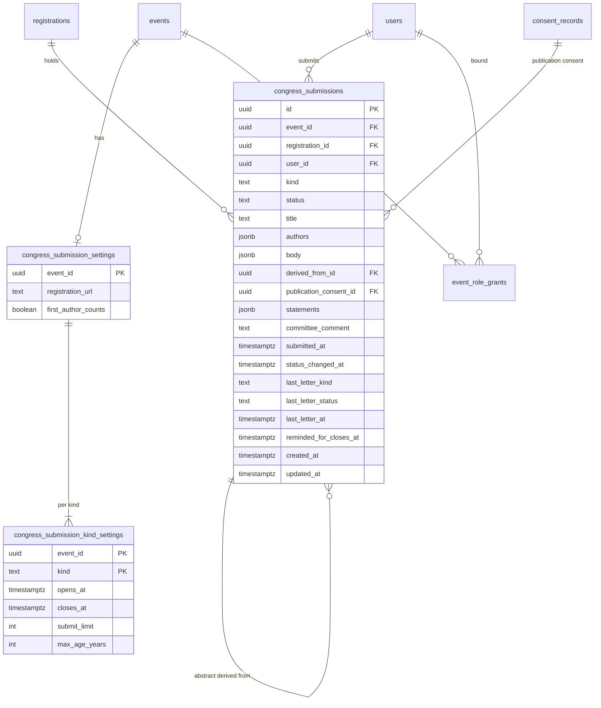
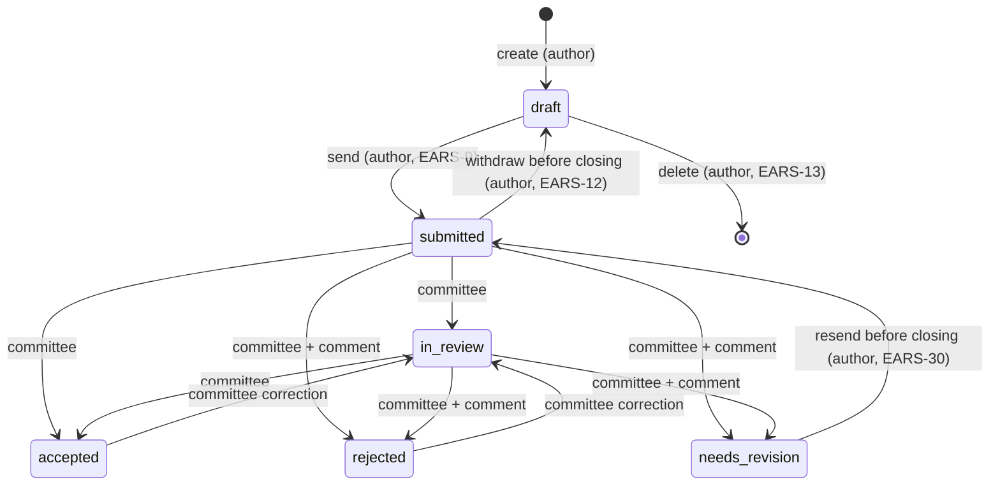

# 046 — Congress submissions: oral talks, posters and abstracts (Design)

Requirements: [`046-requirements-en.md`](./046-requirements-en.md) · PRD: [`046-product.md`](./046-product.md) · Builds on: [`044-design.md`](../044-congress-signup/044-design.md).

## Host and shared unit

**Host: the doctor storefront, `/account/congress`.** Congress participants are doctors; ADR-0015 §2 makes `apps/doctor` the doctor-facing host and `apps/portal` the Academy backstage for experts and partners. The doctor storefront already serves `/account` (`apps/doctor/app/(storefront)/account/page.tsx`, the 003 profile projection until feature 022), and 044 EARS-16 already sends signed-in doctors to congress registration from the doctor event feed. The section is a child page of that account, linked from it.

**Shared unit: `packages/congress-submissions` (`@ds/congress-submissions`).** ADR-0013 A1 allows a host exactly a route file and a host-config object. The package owns the section's page component, the three forms, the autosave hook, the status labels, the refusal copy dictionary, the client of the `/v1/me/congress-submissions` endpoints and its tests; the doctor host mounts it in `apps/doctor/app/(storefront)/account/congress/page.tsx` with a host-config object carrying the transport, the account route and the RU copy overrides. No file under `apps/doctor/{lib,components}` is added, so the host-file allowlist does not grow. The validation schemas and the abstract length function live in `packages/schemas/src/congress/` so that the form counter and the server decide identically. The Academy host does not mount the section today; mounting it later is a second route file, not a fork.

**Recorded alternatives.** orthobio.ru forms with an emailed signed link were the earlier draft; the owner chose a platform cabinet (variant Б) because a link-only author has no place to see statuses and comments. The Academy host was rejected because its audience is the backstage (ADR-0015 §3.1).

## Entry and return

```mermaid
sequenceDiagram
    participant L as 044 letter / orthobio.ru button
    participant D as doctor storefront
    participant F as @ds/auth-flow
    participant A as apps/api
    L->>D: GET /account/congress (guest)
    D->>F: guard → /login?returnTo=/account/congress
    F->>A: emailed code login (unchanged; first entry verifies the address, 044 EARS-14)
    F->>D: parseAccountReturnTarget("/account/congress", routes.account) → admitted
    D->>A: GET /v1/me/congress-submissions?event=…
    A-->>D: registration presence, kind states, limits, own submissions
```

`parseAccountReturnTarget` (`packages/auth-flow/src/return-target.ts`) admits `routes.account` and every page below it on a segment boundary (#1987), so `/account/congress` is a legal return target today; EARS-4 adds no shape and changes no login code. Which event the section shows: every event with a row in `congress_submission_settings` (one in 2027). The external registration address for EARS-5 is that row's `registration_url` (`https://orthobio.ru/registration` for the 2027 congress).

## Data model

```mermaid
erDiagram
    events ||--o| congress_submission_settings : "has"
    congress_submission_settings ||--|{ congress_submission_kind_settings : "per kind"
    registrations ||--o{ congress_submissions : "holds"
    users ||--o{ congress_submissions : "submits"
    congress_submissions ||--o{ congress_submissions : "abstract derived from"
    consent_records ||--o{ congress_submissions : "publication consent"
    users ||--o{ event_role_grants : "bound"
    events ||--o{ event_role_grants : "scope"
    congress_submission_settings {
        uuid event_id PK
        text registration_url
        boolean first_author_counts
    }
    congress_submission_kind_settings {
        uuid event_id PK
        text kind PK
        timestamptz opens_at
        timestamptz closes_at
        int submit_limit
        int max_age_years
    }
    congress_submissions {
        uuid id PK
        uuid event_id FK
        uuid registration_id FK
        uuid user_id FK
        text kind
        text status
        text title
        jsonb authors
        jsonb body
        uuid derived_from_id FK
        uuid publication_consent_id FK
        jsonb statements
        text committee_comment
        timestamptz submitted_at
        timestamptz status_changed_at
        text last_letter_kind
        text last_letter_status
        timestamptz last_letter_at
        timestamptz reminded_for_closes_at
        timestamptz created_at
        timestamptz updated_at
    }
```

- **`congress_submissions`** — `kind` ∈ `oral | poster | abstract`; `status` ∈ `draft | submitted | in_review | accepted | rejected | needs_revision`; `authors` is the ordered array `{surname, firstName, patronymic?, workplace, presenting}`; `body` is the per-kind text object validated by the discriminated Zod union (`oral: {goal, summary}`, `poster: {goal, content}`, `abstract: {relevance, aim, methods, results, conclusions}`); `statements` holds the two abstract statements with their instant. FKs are `ON DELETE restrict` like every retained child (#1278); a soft-deleted registration hides its submissions from every read and blocks sending. Audited by the 010 `audit_row_change()` trigger — the status history of EARS-28 is that ledger.
- **Settings in platform data, not environment.** 044 kept its window in API configuration because it was one fixed constant pair per congress (044 EARS-28). Here the organisers ask for limits configurable in the admin (TZ §3) and the opening date is «по готовности»; an environment value would make every change a deploy, and three kinds × four values per event is data, not configuration. Two tables keep event-level and kind-level values apart; both are audited by the 010 trigger, which answers «who moved the deadline». Storefront ownership (ADR-0016 §8): submissions `doctor`, settings `admin-only`.
- **`users.birth_date`** (`date`, nullable). Asked once and reused across events, so it belongs to the account and not to a registration or a submission. Written only by the holder through `PUT /v1/me/birth-date`; retention and erasure follow the `users` row (ADR-0009 §2.6). The 044 consent text lives on the congress site, outside this repository, so its coverage of the birth date cannot be verified here; the purpose `congress-submission-personal-data` (EARS-16) covers it explicitly.
- **`event_role_grants`** — `EVENT_SCOPED_ROLES` widens from `["event-registrar"]` to add `congress-program-committee` and `congress-partner`, with the CHECK widened in the same reviewed migration. The partial unique index keeps «one registrar grant per user»; the two new roles are unique per (user, role, event) and may span several events.

## Field set and limits

Defaults; counts are Unicode code points after trimming surrounding whitespace, a line break counts as one character.

| Field                          | Kinds        | Limit                                              |
| ------------------------------ | ------------ | -------------------------------------------------- |
| Title («Тема»)                 | all          | 1–300                                              |
| Authors                        | all          | 1–20, ordered                                      |
| Surname, first name            | all          | 1–100 each                                         |
| Patronymic                     | all          | 0–100                                              |
| Workplace                      | all          | 1–300                                              |
| Presenting mark                | oral, poster | exactly one author                                 |
| Educational goal               | oral         | 1–1000                                             |
| Summary («Краткое содержание») | oral         | 1–3000                                             |
| Goal («Цель»)                  | poster       | 1–1000                                             |
| Content («Содержание»)         | poster       | 1–3000                                             |
| Five sections                  | abstract     | each ≥1, together ≤5000                            |
| Committee comment              | —            | 1–2000, required for `rejected` / `needs_revision` |

**Abstract length.** One function `abstractLength(body)` in `packages/schemas/src/congress/` sums the five sections after trimming each and normalising `\r\n` to `\n`; spaces and line breaks count. The form counter imports it, so «4 998 / 5 000» on screen is the server's number. The form is five `Textarea` primitives — plain text only, so tables, formulas, figures and photos cannot enter; trade names are the author's statement (EARS-23), not a filter.

## Status machine

```mermaid
stateDiagram-v2
    [*] --> draft: create (author)
    draft --> submitted: send (author, EARS-9)
    submitted --> draft: withdraw before closing (author, EARS-12)
    draft --> [*]: delete (author, EARS-13)
    submitted --> in_review: committee
    submitted --> accepted: committee
    submitted --> rejected: committee + comment
    submitted --> needs_revision: committee + comment
    in_review --> accepted: committee
    in_review --> rejected: committee + comment
    in_review --> needs_revision: committee + comment
    needs_revision --> submitted: resend before closing (author, EARS-30)
    accepted --> in_review: committee correction
    rejected --> in_review: committee correction
```

Letters: `submitted` → receipt; `accepted`, `rejected`, `needs_revision` → status letter; `in_review` → none. A committee correction back to `in_review` sends nothing; the next decision sends its letter.

## Send cascade

```mermaid
sequenceDiagram
    participant C as section (@ds/congress-submissions)
    participant A as apps/api
    participant D as Postgres
    participant M as mailer
    C->>A: POST /v1/me/congress-submissions/:id/send {consents?, statements?}
    A->>D: BEGIN; SELECT registration (active) ; pg_advisory_xact_lock(user, event, kind)
    A->>A: complete-schema(kind) · kind open · age rule · consents / statements
    A->>D: count counted statuses (own; + first author if rule on) vs submit_limit
    alt any check fails
        A-->>C: 422 {problems:[{code, field?, params}]} — nothing written
    else all pass
        A->>D: insert consent_records (as required) · status=submitted, submitted_at
        A->>D: COMMIT
        A-->>C: 200 submission
        A->>M: receipt letter (off response path)
        M-->>A: outcome
        A->>D: last_letter_kind/status/at
    end
```

The advisory lock serialises concurrent sends of one account, event and kind so two tabs cannot both take the third abstract slot. The problem codes (`kind-not-open`, `kind-closed`, `limit-reached`, `first-author-limit-reached`, `age-limit`, `consent-required`, `statement-required`, `field-invalid`) map to RU copy in the package dictionary. Endpoints of the author (`access: authenticated`, ownership checked on every row): `GET /v1/me/congress-submissions?event=`, `POST /v1/me/congress-submissions` (`{eventId, kind, derivedFromId?}`), `PATCH /v1/me/congress-submissions/:id` (autosave, draft schema), `DELETE …/:id`, `POST …/:id/send`, `POST …/:id/withdraw`, `PUT /v1/me/birth-date`.

**Autosave.** The hook debounces 1.5 s after the last keystroke and flushes on blur and on page hide; the PATCH carries the full draft object (last write wins for one author). The saved state reads «Сохранено» / «Сохраняем…» / «Не удалось сохранить — повторим» with automatic retry.

**Age rule.** `age = full years between users.birth_date and events.starts_at` as dates in Europe/Moscow. For the 2027 congress (`starts_at` 2027-04-23) a birth date of 1987-04-23 gives 40 → refused; 1987-04-24 gives 39 → allowed.

## Consents and statements

| Purpose                             | Document (`packages/legal-content/documents/`) | When                                                     | Row                                        |
| ----------------------------------- | ---------------------------------------------- | -------------------------------------------------------- | ------------------------------------------ |
| `congress-submission-personal-data` | `consent-congress-submission.md`               | first send per account and event; again on a new version | one per account and version                |
| `congress-abstract-publication`     | `consent-congress-abstract-publication.md`     | every abstracts send                                     | one per send, referenced by the submission |

Versions are server-stamped as edition plus sha256 of the published text (ADR-0009 §2.1), exactly as 044 EARS-9 and the doctor-storefront door stamp theirs; the closed purpose list joins `@ds/schemas`. The РИНЦ publication consent is a consent — a revocable permission to publish the work — so it is a `consent_records` row; «no incorrect borrowings» and «no trade names» are the author's statements about the text, not permissions, so they live on the submission. The two document texts are supplied by the organisers (PRD, «Dependencies»).

## Letters

All letters render through `email-layout.ts` in the shape of `notice-emails.ts`, go to the account email, are sent after commit and off the response path, and record `last_letter_kind`, `last_letter_status`, `last_letter_at` on the submission; no retry queue (the section always shows the status). Proposed copy for Stage A:

- **Receipt** — «Doctor.School — заявка получена»: «Ваша заявка «{тема}» ({вид}) получена и передана программному комитету {мероприятие}. Статус можно посмотреть в кабинете.» [Мои заявки на Конгресс]
- **Accepted** — «Doctor.School — заявка принята»: «Программный комитет принял вашу заявку «{тема}» ({вид}).»
- **Rejected** — «Doctor.School — заявка отклонена»: «Программный комитет отклонил заявку «{тема}» ({вид}). Комментарий комитета: {комментарий}»
- **Needs revision** — «Doctor.School — заявку нужно доработать»: «Программный комитет просит доработать заявку «{тема}» ({вид}): {комментарий}. Исправить и отправить заявку можно в кабинете до {последний день} включительно.»
- **Reminder** — «Doctor.School — приём {вида} заканчивается {дата}»: «У вас есть неотправленные черновики: {список}. Отправить их можно до {дата} включительно.»

**Deadline sweep.** A `@Cron` job every 15 minutes selects kinds with `now < closes_at ≤ now + 72 h`, then claims drafts with `UPDATE … SET reminded_for_closes_at = closes_at WHERE kind = … AND status = 'draft' AND reminded_for_closes_at IS DISTINCT FROM closes_at RETURNING user_id, id`, and sends one letter per claimed account. The conditional update is the idempotency: a parallel instance claims nothing, and a moved closing instant re-arms because the stored value no longer matches.

## Authorization boundary

| Endpoint family                                         | Roles                                                              | Binding                              | `revalidate` |
| ------------------------------------------------------- | ------------------------------------------------------------------ | ------------------------------------ | ------------ |
| `/v1/me/congress-submissions*`, `/v1/me/birth-date`     | any authenticated account                                          | row ownership + active registration  | —            |
| `GET /v1/admin/events/:id/congress-submissions[/:sid]`  | `platform_admin`, `congress-program-committee`, `congress-partner` | `EventGrantPolicy.assertEventAccess` | —            |
| `POST …/congress-submissions/:sid/status`               | `platform_admin`, `congress-program-committee`                     | same                                 | `live`       |
| `GET/PUT /v1/admin/events/:id/congress-intake-settings` | `platform_admin`                                                   | —                                    | `live` (PUT) |

The partner projection drops `committee_comment` and the age server-side, not in the view. **ADR-0001 A1 extension.** A1 chooses which grant live revalidation asks the IdP about and knows `event-registrar` only; the status route is the first committee-reachable live write, so the committee work package ships an ADR-0001 amendment (A1 is in production — amendment, via `do-adr-revision`) adding `congress-program-committee` to the selection rule with `403 PROGRAM_COMMITTEE_REQUIRED`. Revalidation still admits nobody; admission stays the role check plus the event binding.

## Admin projections

- **Registry** — `apps/admin/lib/congress-submissions.ts` on the `AdminDataList` composition in the pattern of `apps/admin/lib/congress-roster.ts` (server query state: page, search, filters, sort). Columns №, вид, тема, подающий, статус, отправлена, изменена. The committee and the partner see the same registry; drafts are excluded in the query, never in the view.
- **Card** — the `Sheet` primitive (#2396), as for the 044 participant card (#2383): content, authors, submitter email and phone from the 044 answers (or the account email where the registration has no answers), status history from `audit_ledger`, source work link, last letter outcome, poster age. The status control is a select plus a `Textarea` for the comment, required for `rejected` and `needs_revision`.
- **Settings** — a form per event: registration address, first-author rule, and per kind the opening date, the last day, the limit and the age limit, dates entered as Moscow calendar days (EARS-3).

## 044 letter link — placement of the amendment

The link «Подать материалы в кабинете» changes 044's confirmation-letter copy, which runs in production, so 044 records it as a production amendment (044-requirements, «Production amendment — cabinet link in the confirmation email (2026-09-29, #2385)»). The handler is owned here as **EARS-15** rather than as a new 044 EARS because the link is only true once `/account/congress` exists: owning it in the cabinet work package ships the link and its destination in one release, where a 044-owned handler could ship a link to a missing page.

## Legacy counterpart

The 2026 congress took materials «через личный кабинет на платформе регистрации» — an external registration platform with no source in our repositories. There is no reviewable legacy counterpart and no data migration.

## Delivery slices

Each slice ships its UI with its backend (F-22). No canvas exists for any of these surfaces, so each UI slice opens with a Stage-A gate per `build-ui-from-design-system`.

| #   | Slice                | UI deliverable                                                                                       | Backend                                                                                                                   | Stage A                                                                                                                                     | EARS            |
| --- | -------------------- | ---------------------------------------------------------------------------------------------------- | ------------------------------------------------------------------------------------------------------------------------- | ------------------------------------------------------------------------------------------------------------------------------------------- | --------------- |
| S1  | Intake settings      | admin settings screen per event                                                                      | settings tables, admin endpoints, 010 audit                                                                               | A-1 settings form                                                                                                                           | EARS-1…EARS-3   |
| S2  | Cabinet + oral talks | `/account/congress`: empty state, list, oral form, autosave, send, withdraw, delete; 044 letter link | submissions table, author endpoints, status basics, limit, submission consent, receipt letter, `@ds/congress-submissions` | A-2 section + oral form; L-1 receipt and 044 link line                                                                                      | EARS-4…EARS-17  |
| S3  | Posters              | poster form, birth-date step, age refusal                                                            | `users.birth_date`, birth-date endpoint, age rule                                                                         | A-3 poster form and age message                                                                                                             | EARS-18…EARS-20 |
| S4  | Abstracts            | abstract form, total counter, consent and statements, «Подать тезисы по этой работе»                 | length function, publication consent, statements, first-author rule                                                       | A-4 abstract form                                                                                                                           | EARS-21…EARS-25 |
| S5  | Program committee    | admin registry, card in `Sheet`, status control, role nav; status and comment in the section         | role, grants, admin endpoints, transitions, status letters, revision loop, ADR-0001 A1 amendment                          | A-5 registry, card and status control (registry and card shell reuse the approved `AdminDataList` baseline and `Sheet`); L-2 status letters | EARS-26…EARS-31 |
| S6  | Congress partner     | read-only card and registry for the partner                                                          | role, binding, projection without comment and age                                                                         | none new — a role projection of A-5                                                                                                         | EARS-32         |
| S7  | Deadline reminder    | the reminder letter                                                                                  | scheduled sweep                                                                                                           | L-3 reminder letter                                                                                                                         | EARS-33         |

Order: S1 → S2 → {S3, S4, S5} → S6 → S7. S2 needs S1's settings to open a kind; S3 and S4 extend S2's forms; S6 projects S5.

**Cross-repo dependency — `doctor-school/orthobio-site#99` (re-scoped by the tech lead).** On orthobio.ru: a «Подать материалы» section with two buttons, «Зарегистрироваться» (the 044 form) and «Войти в кабинет» (`https://doctor.school/account/congress`), and a «Подать материалы в кабинете» button on the site's «Заявка принята» card. It needs S2 on production; nothing on the platform waits for it.
