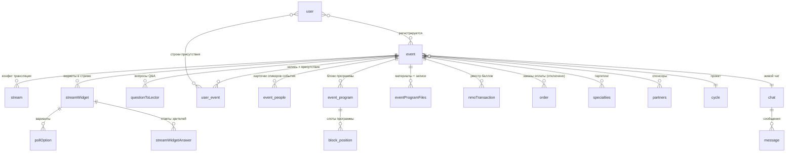

> **RU (это)** · **EN:** [`legacy-recon.md`](./legacy-recon.md)

> **⚠ Функциональный референс — смотри-и-бери-домен, никогда не воспроизводи UI, никогда не копируй схему (ADR-0014 §3).** Этот документ майнит рабочую систему-прототип ради _того, что делает домен вебинаров_ — сущности, workflow'ы и механики, доказывающие функциональность. Новая модель данных и экраны DS Platform проектируются **с нуля** из JTBD и IA предстоящего продуктового брейншторма. Каждый список полей Bubble, сценарий Directual или живой экран ниже — это **свидетельство возможности**, а не цель для повторной реализации. 130-полевой `event`, лайфсайкл на россыпи булевых флагов, клиентские пинги присутствия и топология зеркал Bubble→Directual — это _ошибки, которые надо превзойти_, а не чертёж.

---

## 1. Цель и метод

Это **результат шага «Прототип — система-источник»** продуктового эпика «Вебинары» — фундаментальный первый шаг `do-product-discovery` (ADR-0014 §3, discovery-трек шаг (a)). Это подготовительный материал для **продуктового брейншторма** (JTBD, информационная архитектура, декомпозиция фич, приоритизация) следующей сессии, аудитория которого — **Product Lead** (владелец) и **ведущий агент**. Это не спека, не запись решений и он не фиксирует scope — scope определяет владелец на брейншторме (ADR-0014: развилки продуктового scope — за владельцем).

**Дата разведки:** 2026-07-02. **Четыре источника, read-only:**

| Источник                       | База свидетельств                                                                                                                     | Что даёт                                                                                                                             |
| ------------------------------ | ------------------------------------------------------------------------------------------------------------------------------------- | ------------------------------------------------------------------------------------------------------------------------------------ |
| **A — экспорт Bubble**         | JSON-экспорт `dctrschl.bubble` на 26 МБ (`doctor-school-bubble-app`): 130+ типов данных, option sets, графы workflow страниц/reusable | Доменная модель, option sets, workflow'ы регистрации + комнаты, экраны, механика встраивания стрима, боли                            |
| **B — Directual**              | `directual/database.json`, `scenarios.json` (70 сценариев), `apis.json` (67 эндпоинтов), session-доки                                 | Зеркала данных бэкенда, карта cron/сценариев, пайплайн присутствия/посещаемости, топология интеграции, операционное состояние, уроки |
| **C — база знаний**            | `doctor-school-knowledgebase` (business-logic / architecture / instructions / транскрипты интервью)                                   | Жизненный цикл вебинара, роли, аудитория, ценность для спонсора, механика НМО, таксономия, ключевые числа                            |
| **D — живой сайт + скриншоты** | `https://doctor.school` (публичный, без авторизации) + исторические админ-скриншоты                                                   | IA, анатомия календаря/листинга/страницы события, вкладки админ-редактора, паттерны, которые стоит сохранить                         |

**Ссылки на свидетельства сохранены inline**, чтобы каждое утверждение было проверяемым: имена reusable/типов Bubble (напр. `p_event > Group stream`, `user_types.event`), имена сценариев Directual (напр. `SettingsLOGS`), пути базы знаний (напр. KB `docs/business-logic/nmo-points-system.md`) и файлы скриншотов (напр. live `live-05-events-list.png`). Там, где источники противоречат, противоречие **вынесено наружу, а не сглажено** (см. §5, §6).

---

## 2. Бизнес-контекст

Сжато из источника C (`docs/business-logic/event-planning-process.md`, `nmo-points-system.md`, `platform-key-functionality.md`, интервью `2025-12-22-Андрей-Бреев-интервью-процессы.md`).

**Что такое вебинар для Doctor.School.** **Спонсируемая** образовательная онлайн-трансляция (`эфир`) для аудитории **практикующих врачей**, таргетированных по медицинской специальности. B2B-модель: фарм-**партнёры** (спонсоры) финансируют событие и взамен получают доступ к врачебной аудитории + отчёт о посещаемости. **«Без партнёров мероприятия не проводятся»** — нет спонсора, нет события (KB `event-planning-process.md`). Сегодня **проводятся только бесплатные спонсируемые события**; платные потоки (бывший Robokassa) отключены.

### Жизненный цикл end-to-end (10 шагов)

| #   | Шаг                                   | Заметки                                                                                                                                                                                                                                                                                             |
| --- | ------------------------------------- | --------------------------------------------------------------------------------------------------------------------------------------------------------------------------------------------------------------------------------------------------------------------------------------------------- |
| 1   | **Годовое планирование** (конец года) | «Научные лидеры» (KOL) выбирают даты + города по «школам»; менеджер заносит в Яндекс.Таблицу. Твёрдо на H1, эскизно на год.                                                                                                                                                                         |
| 2   | **Коммерческое предложение (КП)**     | Менеджер шлёт КП (события, даты, города, условия, цена) фарм-партнёрам.                                                                                                                                                                                                                             |
| 3   | **Утверждение бюджета спонсора**      | Спонсоры верстают бюджеты в конце года под твёрдый план. Нет спонсора → нет события.                                                                                                                                                                                                                |
| 4   | **Заведение на платформу**            | Оператор создаёт событие в админке Bubble ≥1 месяц заранее; мин. поля имя/дата/город/описание; спикеры создаются как пользователи, затем «назначить спикером».                                                                                                                                      |
| 5   | **Программа**                         | PDF, свёрстанный в Figma, печатается, загружается на страницу события. «Часто меняется» → грузить только финал. Встроенный «конструктор программы» есть, но **им никто не пользуется**.                                                                                                             |
| 6   | **Анонс / регистрация**               | Событие появляется в публичном списке + календаре; врачи регистрируются. **Пробел: нет welcome / подтверждения / уведомлений об изменениях** (KB `platform-issues.md`).                                                                                                                             |
| 7   | **Живой эфир (онлайн)**               | «Двойные эфиры» — два вебинара идут одновременно из офисной «студии»; всего два специалиста (Сергей, Андрей). «Режиссёр» запускает стрим (тест, затем live); зрители видят встроенный плеер + живой чат. Некоторые школы подтягивают удалённого академика через **Zoom** в студию.                  |
| 8   | **Вовлечение во время эфира**         | Режиссёр запускает «титровальные объекты» (нижние плашки) 4 типов: Приветствие / Вопрос / Опрос (живой график) / Присутствие. У графика опроса есть тумблер «Прозрачный фон» для композитинга в OBS. Чат живёт только пока идёт эфир.                                                               |
| 9   | **Отслеживание присутствия**          | Клиент шлёт «слепок присутствия» в Supabase каждую минуту (`user_id, event_id, timestamp, session_id`); дубли из нескольких вкладок дедуплицируются до одного/минуту (KB `presence-tracking.md`).                                                                                                   |
| 10  | **После события**                     | Режиссёр жмёт «Завершить мероприятие» → функция Supabase строит отчёт присутствия (~1 с на 100–150 человек) → баллы НМО авто-начисляются → статусы проставляются (ручной override возможен) → генерится **«Отчёт партнёра V2»** (Excel) → событие вручную архивируется; запись уходит в видеоархив. |

### Роли

| Роль                           | Ответственность                                                                                                                                                                      |
| ------------------------------ | ------------------------------------------------------------------------------------------------------------------------------------------------------------------------------------ |
| **Научные лидеры / KOL**       | Внешние эксперты; инициируют события, выбирают даты/города, владеют «школой», модерируют.                                                                                            |
| **Менеджер по мероприятиям**   | Координирует KOL ↔ КП ↔ спонсоры ↔ оператор. Сейчас один человек (было 5).                                                                                                           |
| **Оператор платформы**         | Заводит события/спикеров/партнёров в админку, держит актуальными, тянет отчёты.                                                                                                      |
| **Режиссёр (director)**        | Управление стримом в реальном времени: старт/стоп, титровальные объекты, мониторинг участников, завершение, начисление НМО. Ключевая роль онлайн-события.                            |
| **Партнёры (фарм-спонсоры)**   | Финансируют всё; приглашают врачей по своим каналам; получают отчёты о посещаемости.                                                                                                 |
| **Дизайнер** (контракт)        | Программный PDF + раздатки в Figma.                                                                                                                                                  |
| Владелец **Рассылок** («Лиля») | Email-кампании (но рассылки об изменениях программы не отправляются).                                                                                                                |
| Админ-иерархия                 | Администратор, Руководитель (владелец «Эдуард»), Главный менеджер, Менеджер (RLS-скоуп parent-child), плюс неиспользуемые роли (Старший модератор, Модератор, Специалист поддержки). |

**Спикер — это _свойство_ пользователя, а не отдельная роль**; регалии можно переопределить на уровне события.

### Факты об аудитории

- **Кто:** практикующие врачи, таргетинг по специальности; профиль несёт «специальность» + «должность» (из «справочников») и вручную набранное «место работы». Накопилось ~4000 строк мест работы с кучей дублей; автокомплит отключён ради производительности (KB `platform-key-functionality.md` §5.3).
- **Верификация:** «верификация» (заполнены место работы + специальность) требуется для начисления НМО. Статусы: Верифицирован / Частично / Не верифицирован. **Это верификация полноты данных, а не проверка диплома/лицензии** — KB не описывает проверки реальной медлицензии.
- **Discovery:** для офлайна — в основном _не_ через платформу (сети спонсоров, городской «главный врач»); для онлайна регистрация обязательна, поэтому discovery более привязан к платформе, но маркетинг/рассылки слабые.
- **Поведение:** офлайн-неявка хроническая (70–80% недобор); к онлайн-присутствию не относится, но объясняет одержимость спонсоров явкой.

### Поставка спонсору — «Отчёт партнёра V2»

**Ключевая B2B-поставка** (KB `nmo-points-system.md` §Отчёты). Excel на событие с полями на посетителя: ID участника, имя, **email**, специальность, место работы, время входа, время выхода, минимальная длительность события, **фактические минуты присутствия**, число подтверждённых объектов присутствия, статус участника. То есть спонсоры получают **контактные данные + минуты присутствия по каждому врачу** — платят за проверяемый охват врачебной аудитории. Более старые варианты (Партнёр V1, НМО, ТО, МОО, Портал) существуют, но используется только **V2**.

### Механика НМО

**НМО** = «Непрерывное медицинское образование», обязательная в России система CME-кредитов; врачи набирают «баллы» для поддержания квалификации (KB `nmo-points-system.md`).

- Событие с флагом **«Аккредитовано»** несёт число баллов НМО (по умолчанию **6 баллов**) + список «кодов НМО»; система заранее создаёт запись в БД на каждый код, привязка к участникам — после события.
- **Два условия для получения баллов:** (1) присутствие **≥ 90 минут** («согласно нормам закона»); (2) подтвердить **2 «титровальных объекта присутствия»** (нажать «Присутствую» в течение **60-секундного** времени жизни объекта). **<5 мин присутствия = не засчитано.**
- **Статусы:** Зарегистрирован (без баллов) → Присутствовал (был, но условия не выполнены, ручное начисление возможно) → Прошёл (авто-начисление). Баллы хранятся как **динамический список на пользователя** `{код, баллы}`, не суммируются; ручной отзыв возможен.

### Таксономия

`event.offline_format_types` — это **значение формата**, а не отдельный тип: «вебинар» — один из форматов:

- **Вебинар / онлайн-мероприятие / эфир** — стрим на платформе; обязательная регистрация; авто-присутствие; НМО; чат; титровальные объекты. Обычно несколько часов.
- **Школа** — регулярная брендированная образовательная серия под KOL; единица планирования, вокруг которой крутятся даты/города/спонсоры.
- **Конгресс** — крупнее; менеджер конгрессов Doctor.School ушёл, и конгрессы **переданы внешней команде («команда из "Здоровья"»)** — сигнал, что конгрессы могут быть **вне scope** первого эпика ребилда.
- **Клуб / Doctor.Club** — формат удержания; регулярные встречи; отдельный тёмный дизайн на текущем сайте.
- **Проект** — верхнеуровневая группировка над событиями (имя, описание, картинка, флаг аккредитации). Каждое событие принадлежит проекту; формат ID события `проект-номер` (напр. `199-21`) — **не slug**.
- **Офлайн-мероприятие** — физическое; без регистрации; ручная посещаемость + печать бейджей; часто многодневное (но платформа поддерживает только одну дату старта).

### Ключевые числа

| Метрика                                               | Значение                                                                               | Источник                    |
| ----------------------------------------------------- | -------------------------------------------------------------------------------------- | --------------------------- |
| Видеоархив (2020–2025)                                | 1 067 видео · 2 186 ч · ~6,2 ТБ                                                        | KB `platform-statistics.md` |
| Событий/год (недавно)                                 | ~250–285                                                                               | там же                      |
| Каденция событий                                      | ~4–6 событий/неделю; 31 запланировано на H1 (упор на Q1)                               | интервью                    |
| Исторических пользователей (Bubble)                   | ~39k дамп                                                                              | KB `user-data-structure.md` |
| Актуализированных пользователей (Directual `webuser`) | ~9 294                                                                                 | там же                      |
| Записей присутствия в Supabase                        | ~2,5 млн                                                                               | KB `presence-tracking.md`   |
| Генерация отчёта                                      | ~1 с на 100–150 участников                                                             | там же                      |
| Дефолты НМО                                           | 90 мин · 6 баллов · 2 объекта присутствия · 60 с жизни объекта · <5 мин = отсутствовал | KB `nmo-points-system.md`   |

**Сезонность:** высоко в конце зимы/весной→июль, низко июль–август (отпуска врачей), сен–дек пик (годовые бюджеты спонсоров + переток H1→H2); события никогда не переносятся на следующий год.

---

## 3. Доменная модель (намайнено)

Синтез источников A + B. **Подано как функциональное свидетельство, а не схема.** Bubble — система записи; зеркала Directual — read-only тени (§6). Имена — ключи типов Bubble с переводом display-name из AGENTS.md в кавычках.

### Карта сущностей



### Сущности

- **`event` (`user_types.event`, "event") — корень агрегата, 130 полей (~40 мёртвых).** Единственный центральный объект; каждый формат (вебинар/конгресс/клуб) — это `event`. Функциональные группы:
  - _Идентичность:_ `title`, `desc`, `comment`, `logo`, `place_image`, `eventColor`, `counter` (slug-подобный текст), `qr`, `creator`/`manager` (админ-доступ по менеджеру), `project`→`cycle`, `chat`.
  - _Расписание:_ `start_date`, `end_date`, `duration` (мин), плюс **денормализованные поля фильтра календаря** `filterDay`/`filterDays`/`filterMonth`/`filterMonthInt`/`filterYear` (предвычислены, чтобы календарь фильтровал предзагруженный список без вычисления дат), `city`.
  - _Формат/классификация:_ `offline_format_types` (Вебинар/Конгресс/Слёт/Клуб/школы — основной селектор формата), `format` (Онлайн/Офлайн/Doctor School/Doctor Club), `eventType`, `event_open` (Открытый/Закрытый), `price_format` (Бесплатное/Платное/Закрытое), `price`, `main_specialties`/`other_specialties` + join `eventSpecialties` (флаг Main + `itemNumber`), `associations`.
  - _Флаги лайфсайкла (россыпь булевых, нет статус-энума):_ `draft`, `published?`, `archive`, `template`, `visible_in_rg`, `userShow?`, `disable_reg`, `participantsLimit`, `wizardFlow` + `stepWizard`.
  - _Стрим/live:_ `streamDateStart`/`streamDateEnd` (окно эфира, отличное от start/end события), `streamWidgets`→`list.to`, `count_to`. Реальные видео-ссылки живут на `stream`, не здесь.
  - _Программа/люди/партнёры:_ `program_blocks`, `time_blocks`, `congressBlock`, `speakers`→`event_people`, `members`→`list.user`, `partners`, `program_file`, `eventProgramFiless`.
  - _Регистрация/коммерция/отчётность:_ `user-events`→`list.user_event`, `eventOrders`, `eventRequests`, `nmo_type`/`nmo_codes`/`nmo_links`/`nmo_points`/`accreditationStatus`, `rated`/`rating_events`/`rating_partner`, `report_photos`/`report_videos`, `timingsCollectedFinished`/`timingsCountFinished` (флаги батча присутствия).
  - **Мёртвые/легаси (~40 полей):** старые ролевые поля `list.user` (`experts`/`leaders`/`moderators`/`teachers`/`lectors` — вытеснены `event_people`), `to_queued`/`to_done`/`to_answers_counter`, `nmo` (булев), `club`, `school`, `date` (date_range), несколько старых форм `partners`, `messages`, `comments`. **Этот мёртвый груз — главный сигнал «превзойти это» для новой модели.**

- **`to` (`user_types.to`, "streamWidget") — 18 полей.** Интерактивный виджет в стриме: `event`, `title`, `description`, `button_text`, `streamWidgetType` (Уведомление/Опрос/Вопрос/Присутствие/Приветствие), `status` (queued/running/done), `start_date`/`end_date`/`duration` (окно запуска), `pollOptions`, `streamWidgetAnswers`, `maxNumberOfAnswers`.
- **`__poll_option` ("pollOption") — 4 поля.** `title`, `correct` (флаг квиза), `hideCorrect`, `count` (денормализованный счётчик голосов).
- **`presence_answers` ("streamWidgetAnswer") — 9 полей.** Один ответ зрителя: `user`, `event`, `streamWidget`, `streamWidgetType`, `pollOptions` (выбранные), `dateCreated`, `visible` (засчитывается/показывается).
- **`__questions` ("questionToLector") — 8 полей.** `author`, `event`, `text`, `fullName`, `dateCreated`.
- **`user_event` ("user-event") — 12 полей — join записи/присутствия.** `user`, `event`, `emailUser`, `статус`, `order`, `start_date`/`end_date`, **`time`** (время просмотра), **`присутствия`** (счётчик присутствий), `offlinePresence` (физическое), `fill`, `postponed` (регистрация до авторизации).
- **`stream` ("stream") — 8 полей.** Конфиг трансляции, отвязанный от `event`: `event`, `isActive`, `date_start`, **`youtube_link`**, **`second_video_link`** (backup/вторичный, напр. Rutube), **`autostartKey`** (авто-старт эфира через бэкенд API-event).
- **Структура программы:** `event_program` ("block" — `title`, `date`, `itemNumber`, `moderators`, `speakers`, `programs`) → `block_position` ("programm" — `theme`, `description`, `start`/`end`, `speakers`, `partners`); `time_blocs` (группировка по дню/времени); `congressblock` (порядок секций лендинга конгресса); `congress_temp_regs` (одно поле `email`, стейджинг конгресс-регистраций).
- **Люди/спикеры:** `event_people` (карточка спикера на событие — `fullName`, `role`, `speaker (suppler)`, `user`, `event`, `rating`, `showInTop`); `suppliers` ("speakers" — глобальный справочник спикеров, 53 поля); `rating_speaker` (звёзды по спикеру, привязаны к `event_people`).
- **Материалы/файлы:** `eventprogramfiles` ("eventProgramFiles" — `event`, `title`, `file`, `url`, `order`, `active`, `eventProgramFilesType` = rutube/pdf/image). **Куда после события привязываются записи (rutube), PDF-программы и картинки.**
- **НМО/кредиты:** `nmo` ("nmoPointsTrasaction" — `user`, `event`, `code`, `count`, `date`) — реестр CME-баллов; `ds_coins_movement` (внутренний loyalty-реестр DS-монет); `soundcheck` (пред-событийный self-test устройства/микрофона).
- **Регистрация/коммерция (отключено):** `eventrequest` (запрос с ценой/вайтлистом), `order` (полный платёжный заказ Robokassa — `amount`, `paid`, `payment_id`, `paymentOrderType` Оплата/Промокод/Вайтлист), `webhook_notification___robokassa`. **Все платёжные потоки сегодня отключены.**
- **User (релевантный подмножество, 102 поля):** `events`, `user-events`, `unauthorizedPostponedEventRegistrations` (регистрация до авторизации), `nmoPointsTrasactions`, `role`, `speaker`→`suppliers`, `specialties`, `city`, `regalia`, флаги UX регистрации (`show alert in reg`, `show reg popup`).
- **Role (`______roles`, 23 поля):** `order`, `adminAccess`, `group` (Руководство/Поддержка/Пользователь/Технический специалист/Режиссёр), `title_rus`/`title_eng`, `affiliation` (подчинённые менеджеры), `hidden_pages` (скрытие пунктов левого меню админки по роли).

### Option sets (функциональный словарь)

`offline_format_types` (…·**Вебинар**), `titles_type` (виды виджетов), `__to_state` (queued/running/done), `chips` (Онлайн/Офлайн/Doctor School/Doctor Club), `event_open`, `price_format`, `eventcolor` (hex-палитра, вкл. `#2D84F2`), `cycle_status` (Аккредитовано/Не аккредитовано/На аккредитации), `nmo` (НМО/Сертификат), `event_role0` (12 ролей спикеров/faculty), `eventeditor` (шаги визарда), `eventfilter` (School/Specialization/City/Year/Speakers — фасеты зрителя), `eventprogramfiles` (rutube/pdf/image), `menu_event` (вкладки админ-редактора), `congressblock` (11 секций конгресса), `os_group_role`, `paymentorder`/`paymentstatus`, `month`.

---

## 4. Функциональная карта по поверхностям

Из источников A + D. Что каждый экран _делает_ (свидетельство функциональности), а не как выглядит.

### Календарь / главная (`index` → `p_index`/`p_index2`; live `live-01-home-full.png`)

Месячный календарь событий с пилюлями **«Онлайн N»** по дням (формат + счётчик), поиском («по названию мероприятия или школе»), стрелками пред/след месяца и **тумблером сетка↔список** («Открыть список мероприятий»). Использует денормализованные `filterDay/filterMonth/filterYear` события для расстановки по дням. **Постоянный верхний баннер** рекламирует текущий эфир (красная точка «запись» + «Смотреть эфир»). Главная также несёт полосу «Анонсы недели» и три счётчика (**50 000+** участников, **840+** событий с НМО, **500+** спикеров) — слайд партнёрства с Rutube.

### Листинг событий + фильтры (`events` → `p_events` + `RE | eventFilter`; live `/index/events`, `live-05-events-list.png`)

Табы формата **Все / Онлайн / Офлайн**; свободный поиск; **Специальность** — searchable multi-select чекбокс-дропдаун (`live-06-specialty-filter.png`); чекбокс **«Только с НМО»**; «Очистить фильтр»; счётчик результатов. **Фильтрация — клиентская на custom-state поверх предзагруженного repeating group** — не живой поиск по БД (изъян масштабируемости, §7).

**Наблюдаемый инвентарь полей карточки события (источник D, карточка листинга):**

| Поле                         | Пример                                                                 |
| ---------------------------- | ---------------------------------------------------------------------- |
| Бейдж формата                | `Онлайн` (синий) / `Офлайн`                                            |
| Дата                         | `02.07.2026 г.`                                                        |
| Время (TZ)                   | `17:00 (МСК)`                                                          |
| Школа/серия (надзаголовок)   | `Подсмотрено в операционной`, `Pain clinic`, `Инновационная ортопедия` |
| Заголовок                    | `Пластика ахиллова сухожилия`                                          |
| Чипы специальностей (мульти) | `Травматология и ортопедия`, `Терапия`, `Ревматология`, `Фармация`…    |
| Спикеры                      | `Торгашин А. Н. · Мурсалов А. К.`                                      |
| CTA (двойные)                | **Участвовать** + **Перейти на мероприятие**                           |
| Постер-миниатюра             | брендированная картинка программы                                      |

### Страница события (`event` → `p_event` зритель; live `live-02-event-live.png`, `live-04-event-archived.png`)

Дерево композиции: `g | main > g | event date and registration > g | body > g | eventCard > g | stream > Group stream`. Три временных состояния:

- **До эфира:** hero (лого/заголовок/дата-время/локация), формат/цена, CTA регистрации (`re | eventRegBtn`), программа (`program_blocks`/`time_blocks`), спикеры (с регалиями), партнёры (обозначенные уровни спонсоров), «скачать программу», специальности. Live: **мягкий auth-wall** — анонимы видят красное **«Авторизуйтесь для просмотра трансляции»** поверх закрытого плеера, всё остальное публично.
- **Во время эфира:** видеоплеер (см. §5), живые виджеты в `g | streamWidget` из `rg | tech streamWidgets`, UI ответов на опрос (`g | singleAnswerItem`/`g | severalAnswersItem`), форма «вопрос лектору», проверка присутствия. (Ныне отключённый) скрипт `html | viewer logs` трекал присутствие.
- **После эфира / архив:** карусель отзывов + рейтинга спикеров (`g | newReview`, `StarRating speaker`), фото/видео-отчёты, скачиваемые записи/PDF (`eventprogramfiles`), статус НМО/сертификата (`userNMOStatus`). Архивные события префиксуют заголовок **«Архив: …»** и убирают плеер + auth-баннер + CTA «Участвовать».

**Стейт-машина CTA регистрации** (custom-state + `reg_nav`, 7 nav-состояний): гость → попап логина/регистрации → подтверждение → зарегистрирован; гейт по `disable_reg` + `participantsLimit`. Ветки (workflow'ы источника A): регистрация уже-авторизованного (`NewThing` user_event → добавить в `Current User's events`), логин-из-регистрации (`LogIn > ChangeThing` — путь гонки сессии, §7), регистрация+создание аккаунта inline (`SignUp > … > SendConfirmationEmail`), создание-с-ресетом и **отложенная регистрация** (неавторизованный посетитель паркуется в `unauthorizedPostponedEventRegistrations` / `user_event.postponed=true`, финализируется после авторизации).

### Механика комнаты вебинара (`p_event > Group stream`)

- **Выбор плеера по URL-снифу** — ветка по содержимому строки ссылки выбирает плеер (§5).
- **1-секундный таймер** — `DoInterval → SetCustomState` «Do every 1 second» обновляет состояние `now` в `p_event`, управляя видимостью виджетов по временному окну.
- **Overlay виджетов** — опросы/вопросы/присутствие рендерятся отдельными Bubble-элементами поверх плеера; submit опроса создаёт `presence_answers`, инкрементит `__poll_option.count`, привязывает к виджету; multi-select ограничен `to.maxNumberOfAnswers`.
- **Скрипт присутствия** — `html | viewer logs` (два условных блока `<script>`) логировал время просмотра в Supabase; **закомментирован / отключён 2026-04-29**.

### Личный кабинет (`profile` → `p_profile`; админ-редактор пользователя `Screenshot 2026-02-26 191800.png`)

«Мои события» из `User.user-events`/`events`; виджет статуса `userNMOStatus`. Админ-редактор пользователя подтверждает **реестр баллов НМО на пользователя** — таблица «История мероприятий» с колонками **№ / Название / Дата / Баллы НМО / Архив**.

### Админка (`page_admin` → список `🚩events` + редактор `🚩events_CE`, 332 workflow'а; `Screenshot 2026-02-27 132405.png`)

- **Вкладки редактора события** (`menu_event`): Основные · Формат · НМО · Конструктор · Файл программы · Отзывы · Участники · Спикеры · Партнеры · Отчеты · DoctorClub, плюс верхнеуровневый сплит **Общее / Трансляция** (конфиг стрима на «Трансляция»). URL/встраивание стрима + авторинг виджетов/опросов (создать `to` с типом, вариантами, окном запуска) живут здесь; публикация — булевы `draft`/`published?`/`visible_in_rg`/`disable_reg`.
- **Список с доступом по ветке роли** (`🚩events.loadEvents`, находки источника A #5/#6): роли **1/5/9** получают широкий список; роли **2/3/4** — списки, ограниченные менеджером по `manager1_user`. **Все ветки исторически исключали `offline_format_types = Конгресс`** → конгрессы исчезают из админки (баг фильтра конгрессов). Админ-список пользователей завязан на **payload DPD/Directual API, а не нативные строки `User`** (правка по `_api_c2_bubble_id` может открыть не того человека).
- **Функции консоли Режиссёра** (KB `event-management.md`): старт/стоп стрима (тест → live), запуск титровальных объектов (4 типа), мониторинг участников, «Завершить мероприятие», начисление/override баллов НМО.
- **Кнопки экспорта отчётов** (источник D): **Скачать отчет НМО / отчет партнеров / партнеров V2 / отчет ТО** — тяжёлая спонсорская + регуляторная отчётность.

Вспомогательные поверхности: `questions` (модерация Q&A), `chart` (графики результатов опросов), `eventprogramfiles` (менеджер материалов), `p_speaker(s)` (справочник спикеров), `ratings`, `archive`/`p_archive`, `🚩congress` (блоки лендинга конгресса).

---

## 5. Механика стрима и realtime сегодня

Выделено, поскольку это **критичная для MVP поверхность** (цель владельца: первый живой вебинар на новой платформе **2026-07-17**). Свидетельства: подсчёт встраивания стрима (источник A) + продакшн-заметки (источник C).

**Как видео попадает на страницу (источник A):** подсчёт ссылок на встраивание даёт **YouTube (42) и Rutube (21) через iframe / Bubble Video (32 iframe)** — нет Kinescope, Vimeo, VK, HLS/`.m3u8` или JS-плееров. Внутри `p_event > Group stream` плеер выбирается **веткой по содержимому строки ссылки**:

1. **Путь YouTube** — нативный **Video**-элемент Bubble (`Video A`, `video_source: youtube`, 16:9, автоплей), `video_id` привязан к `youtube_link_text`; вариант (`Video C`) извлекает сырой id через `:find & replace`. Целевая форма встраивания `…/embed/<id>?&autoplay=1&rel=0&enablejsapi=1`.
2. **Путь Rutube / вторичный** — условие проверяет, `contains "rutube"` ли ссылка; если да — обычный **HTML iframe** (`<iframe … allowfullscreen>`) наполняется URL Rutube / `second_video_link`. Ветка `not_contains "rutube"` выбирает YouTube-элемент.
3. **Backup `second_video_link`** — запасной/второй эфир; отдельные iframe-элементы (300×250 и full-bleed) существуют; селектор `Group time_blocks` позволяет зрителям переключать стримы.
4. **Ключ автостарта** — `stream.isActive` + `stream.autostartKey` запускают запланированный бэкенд API-event, переводящий стрим в live на `streamDateStart`/`stream.date_start`.
5. **Overlay присутствия** — `html | viewer logs` сидел поверх плеера, логируя в Supabase `views_logs`; **оба скрипта отключены 2026-04-29**.

**Живой realtime сегодня:** опросы/вопросы — наложенные Bubble-элементы, доставка гейтится **1-секундным таймером** поверх **устаревшего предзагруженного списка виджетов** — **серверного push нет**. Запуск виджета в админке лишь пишет `start_date`/`end_date` в объект `to`; зрители фильтруют устаревший снапшот и не видят опрос до перезагрузки (изъян устаревшего списка, §7). Чат (`chat`/`message`, флаг `isModerator`) работает только пока идёт эфир. Результаты опроса рендерятся графиком с тумблером **«транспарентный/Прозрачный фон»**, чтобы служебный UI можно было композитить в OBS.

> **⚠ Открытый вопрос — вынесен, а не сглажен (расхождение источников).** **База знаний (источник C)** утверждает, что встраивание — **«SDN Player (основной) или rutube.ru (альтернатива)»** и упоминает **Zoom** для удалённых спикеров. **Экспорт Bubble (источник A)** показывает **только пути YouTube + Rutube** (42 упоминания YouTube / 21 Rutube; строки «SDN»/«sdnvideo» нет). Из артефактов они не согласуются. Возможные объяснения (ни одно не подтверждено): SDN Player может быть продуктом семейства Rutube / white-label, всплывающим через тот же iframe-путь; KB может описывать целевую/текущую студийную практику, появившуюся после экспорта; или «SDN Player» — это студийный origin, а не зрительское встраивание. **Разрешить с оператором вебинаров (Сергей) до фиксации абстракции плеера** — экспорт это не решает.

---

## 6. Бэкенд-процессы и пайплайн присутствия

Из источника B. **Ключевой архитектурный факт: Directual — _не_ система записи, Bubble — да.** Directual — это **слой read-зеркал + фоновых джобов**: ~40 сценариев `cronTask_*`, каждый поллит один тип Bubble через Bubble Data API (`Modified Date > prevUpdate`, курсорная пагинация) и апсертит теневую копию. Единственные две вещи, которые Directual _порождает_ — это (a) агрегация присутствия/посещаемости из Supabase и (b) исходящая почта (Sendler/UniSender).

### Топология

```
[Браузер зрителя]                 [Bubble app + БД = система записи]
  p_event "html|viewer logs"          |  ^                    |
  setInterval 60с AJAX POST           |  | Data API           | wf/ callback'и
       |                              |  | GET /obj/<type>    |
       v                              |  | (Modified Date >   |
[Supabase views_logs] <--- REST ------+  |  prevUpdate)       v
  (user_id, event_id, created_at)        |          [Directual]
       ^                                 |   ~40 cronTask_* зеркал -> теневые таблицы
       |  RPC get_event_users_presence_  |   SettingsLOGS: Supabase -> logs_translation
       |  deduplicated (путь Bubble)     |                -> POST Bubble wf/timingscountfinished
   Bubble settingLogs -> countPresenceV2 |   Sendler -> UniSender / Resend / SMTP
       -> user-event.time                |   cronTask_dispatch -> techEmailUsersFromBubble
```

**Источник истины по доменам:** весь контент событий/пользователей/взаимодействий → **Bubble** (зеркала Directual read-only, ключ `bubble_id`, одностороннее pull, инкрементально по `Modified Date`); сырые пинги присутствия → **Supabase `views_logs`** (единственное хранилище сырых сэмплов, пишется из браузера через **встроенный в клиент service-role ключ Supabase** — уязвимость); агрегированное присутствие → считается **дважды, избыточно** (путь Bubble дедуплицирует через RPC; путь Directual — простой `groupBy`-счёт без дедупа) — оба заканчиваются на Bubble `user-event`; исходящая почта → **Directual** (Sendler → UniSender основной; Resend/SMTP альтернативы); хостинг видео → внешние YouTube/Rutube (без телеметрии плеера — присутствие выведено только из пингов Supabase).

### Пайплайн присутствия по шагам

1. **Захват (Supabase).** Каждая открытая страница зрителя гоняет `setInterval` (по умолчанию **60 с**), POST'я `{user_id, event_id}` в `views_logs`; Supabase штампует `created_at`. Одна строка = один 60-с heartbeat «я ещё тут»; **длительность выводится из плотности пингов** (клиент таймстемпы не шлёт).
2. **Агрегация — Directual `SettingsLOGS`.** Пагинирует `views_logs` (1000/offset), `groupBy('user_id')`; на пользователя `all_time = ping_count`, `start_time`/`end_time` = ранний/поздний `created_at`; пишет `logs_translation`; POST'ит Bubble `wf/timingscountfinished`. **Без дедупа — параллельные вкладки/переподключения раздувают счётчик.** Минуты просмотра ≈ ping_count × 60 с.
3. **Агрегация — путь Bubble (параллельно).** `settingLogs` → Supabase RPC `get_event_users_presence_deduplicated` → `countPresenceV2` на пользователя → пишет **`user-event.time`** (+ `presences`, статус, записи НМО). Это **дедуплицированное каноническое** число.
4. **Хранение.** Каноническая посещаемость в Bubble `user-event.time`/`presences`/`status`; `offlinePresence` метит физическое; зеркалится в Directual `userevent` ежечасно; завершение на уровне события гейтится `timingsCollectedFinished`/`timingsCountFinished`.
5. **Кредиты.** Пороги присутствия запускают начисление НМО → `nmopointstrasaction`; loyalty → `dsCoinsTransaction`.
6. **Отчёт спонсору.** Эндпоинт **`getEmailsForOrder`** («Поиск пользователей для отчета») возвращает на посетителя `fullName, work_places, specialties, positions, email, city_text, bubble_id` — реестр врачей; email-engagement из `sendler`/`sendler_log` через `get_mails`.

### Состояние ОТКЛЮЧЕНО с 2026-04-29 — какой возможности не хватает

Три переключателя выключили его (операционное состояние, источник B): (a) клиентский писатель Bubble `html|viewer logs` заменён комментариями (новых записей в Supabase нет); (b) у Bubble `settingLogs` первым действием стоит `Terminate this workflow`; (c) Directual `SettingsLOGS` в статусе `START`, но его нормальный вход обрезан (последний живой запуск `16-Jun-2025`). **Чего не хватает при отключении:** нет новых данных присутствия → **нет автоматической длительности посещения, нет НМО/сертификатов на базе присутствия, нет свежих отчётов спонсорам о посещаемости.** Исторические строки сохранены; видео/чат/опросы/регистрация/видимость не затронуты. **Триггер отключения:** давление на хранилище/трафик на длинных стримах.

### Рассылки

**`cronTask_dispatch` = PAUSE** (единственный на паузе cron; инцидент runaway оставил ~10,2 млн застрявших строк `dateEnd is empty`, передано девам Directual). Пока на паузе, **синхронизация определений рассылок Bubble→Directual не работает**; сам сценарий отправки `Sendler` (→ UniSender / Resend / SMTP) независим и по-прежнему `START`. Сегментация аудитории — по городу + специальности (`dispatch.cities`/`specialities`). **Нативного SMS и in-Bubble планировщика напоминаний не существует** — вся почта/напоминания событий отданы Directual.

---

## 7. Боли, которые ребилд должен превзойти

Слито + дедуплицировано по всем четырём источникам, сгруппировано, у каждой — однострочное следствие для новой платформы.

### (a) Платформа / инфра

| Боль                                                                                                                                                                                                                          | Следствие                                                                      |
| ----------------------------------------------------------------------------------------------------------------------------------------------------------------------------------------------------------------------------- | ------------------------------------------------------------------------------ |
| Bubble.io (US) медленный, недоступный, блокируется/тротлится РКН (KB `platform-issues.md`; репозиторий bubble-website буквально nginx-reverse-proxy, прогоняющий Bubble через RU-сервер) — главный драйвер ребилда            | Собственный, RU-хостящийся стек; без зависимости от US-origin SPA.             |
| 3 года техдолга, «проще сделать с нуля»; 6 console-ошибок на каждой live-странице (источник D)                                                                                                                                | Greenfield-чистая модель; CI/observability-фундамент уже на месте.             |
| Гонки сессии логина — действия сразу после `Log the user in` дают периодический `EXPIRED_SESSION`, хуже через RU-reverse-proxy; модалка логина буквально просит очистить данные сайта (находка #1, `live-08-login-modal.png`) | **Auth уже отгружен (фича 003)** с корректной BFF-сессией — этот класс закрыт. |

### (b) Realtime комнаты вебинара

| Боль                                                                                                                                                                      | Следствие                                                                                                       |
| ------------------------------------------------------------------------------------------------------------------------------------------------------------------------- | --------------------------------------------------------------------------------------------------------------- |
| **Устаревший список vs живой поиск для виджетов** — запуск в админке лишь пишет `to.start_date`/`end_date`, без push; зрители не видят опрос до перезагрузки (находка #4) | Real-time доставка (WS/SSE) + живой серверный запрос, не клиентский time-фильтр поверх предзагруженного списка. |
| **Хрупкий выбор плеера** — платформа выбирается снифом строки «rutube»; SVG стрелки навигации с удалённого CDN падал у RU-юзеров (находка #2)                             | Собственный плеер + контролы; явный конфиг провайдера, не URL-эвристики.                                        |

### (c) Присутствие / НМО

| Боль                                                                                                                                       | Следствие                                                                                                 |
| ------------------------------------------------------------------------------------------------------------------------------------------ | --------------------------------------------------------------------------------------------------------- |
| **Пайплайн присутствия отключён** с 2026-04-29 (клиентский интервал + браузерный AJAX слишком тяжёл на длинных стримах)                    | Server-authoritative присутствие (heartbeat на бэкенд-эндпоинт), масштабируемое + аудируемое.             |
| **Два расходящихся пути агрегации** — дедуп-RPC vs простой `groupBy` дают разную посещаемость на одно событие                              | **Один канонический дедуп-путь, одно число посещаемости** (от него зависит биллинг спонсора).             |
| **Клиентски-раскрытый service-role ключ Supabase** в HTML Bubble                                                                           | Записи присутствия только через аутентифицированный бэкенд-эндпоинт; без клиентских секретов.             |
| Поллинг Directual по `Modified Date` реимпортит на _любой_ записи, вкл. UI-only поля → всплески ETL + биллинг-мультипликаторы (находка #7) | Не давать UI-бухгалтерии гонять внешний ETL; event-sourced захват изменений, не «modified-since»-поллинг. |

### (d) Лайфсайкл / модель данных

| Боль                                                                                                                                     | Следствие                                                                                      |
| ---------------------------------------------------------------------------------------------------------------------------------------- | ---------------------------------------------------------------------------------------------- |
| Лайфсайкл как **россыпь булевых** (`draft`/`published?`/`archive`/`template`/`visible_in_rg`/`userShow?`/`disable_reg`) — неоднозначно   | Единая **стейт-машина события** (draft → published → live → ended → archived).                 |
| **130-полевой `event` с ~40 мёртвыми полями** + дублирующие связи (старые роли `list.user` vs `event_people`, несколько форм `partners`) | Модель event / stream / widget / enrollment / credit как чистые отдельные сущности.            |
| **Нет поддержки таймзон** — всегда московское время; PDF показывает местное, сайт МСК; нет add-to-calendar с TZ (KB)                     | First-class обработка таймзон + экспорт в календарь.                                           |
| **Только одна дата старта** — нельзя выразить многодневный период (KB)                                                                   | Модель периодов события, а не одного момента (актуально, если офлайн/конгресс войдут в scope). |
| Клиентские state-фильтры листинга поверх предзагруженных списков (`p_events`/календарь)                                                  | Серверные фильтрованные запросы.                                                               |
| Избыточные/дрейфующие хранилища (`WebUser` vs `All_Users`, Bubble vs Directual `user_event`, `nmo_points` vs `nmopointstrasaction`)      | Одна система записи на агрегат; зеркала read-only и явно производные.                          |

### (e) Коммуникации

| Боль                                                                                                                                                                     | Следствие                                                                                         |
| ------------------------------------------------------------------------------------------------------------------------------------------------------------------------ | ------------------------------------------------------------------------------------------------- |
| **Нет welcome / подтверждения / уведомлений об изменениях**; нет in-app планировщика напоминаний; нет SMS; вся почта отдана Directual (находки; KB `platform-issues.md`) | Собственные надёжные пред-событийные напоминания (email/SMS/push) + транзакционные подтверждения. |
| После регистрации пользователи не могут найти событие, на которое записались; нет видимого времени старта / «где присоединиться» (KB)                                    | Поверхность личного кабинета «мои события» с ясной сигнавигацией присоединения.                   |

### (f) Процесс / админ

| Боль                                                                                                             | Следствие                                                                                                       |
| ---------------------------------------------------------------------------------------------------------------- | --------------------------------------------------------------------------------------------------------------- |
| **Неиспользуемый конструктор** — «конструктор программы» есть, но им никто не пользуется; грузят PDF             | Не ребилдить неиспользуемый визард; поддержать реальный workflow (загрузка финального PDF / простая программа). |
| **Обязательные поля спикера** (телефон + email) тормозят заведение, часто недоступны                             | Сделать неключевые поля спикера опциональными (глубину подтвердит владелец).                                    |
| **Печать бейджей сломана** (офлайн) → ручной ввод в Google-таблицу → данные не доходят до платформы              | Офлайн вероятно вне первого scope; если войдёт — закрыть пробел данных по walk-in.                              |
| Конгресс скрыт из админ-списка жёстким фильтром `!= Конгресс` во всех ветках ролей (находка #5)                  | Единый запрос, без хардкода по формату.                                                                         |
| Админ-список на payload Directual API, не на нативных строках → правка по id открывает не ту запись (находка #3) | Идентичность/владение разрешаются из канонического хранилища.                                                   |

---

## 8. Чего у старой системы НЕТ (полезное негативное пространство)

Явные отсутствия — возможности, которые ребилд _добавил бы_, а не унаследовал:

- **Нет собственного плеера / нет транскодинга видео** — видео это внешнее встраивание YouTube/Rutube; нет adaptive streaming, нет DRM, нет server-side playback auth. (Это совпадает с MVP-рамкой владельца: встроить внешний стрим как настроенный iframe.)
- **Нет in-Bubble напоминаний / нет SMS** — нет планировщика напоминаний; вся почта отдана Directual; `SendSMS`/`reminder`/`напомина` = 0 совпадений в экспорте.
- **Нет реальной проверки диплома/лицензии** — «верификация» это полнота данных (заполнены место работы + специальность), никогда не проверка медлицензии.
- **Нет свидетельства генерации PDF-сертификата** — `nmo_type = Сертификат` даёт баллы, но экспорт не показывает скачиваемого артефакта-сертификата; для офлайна лишь «получают сертификаты на месте». Механика — только баллы НМО.
- **Нет обработки таймзон** — все времена неявно московские.
- **Нет server-side playback auth** — auth-wall это мягкий UI-гейт поверх плеера, не подписанный/entitled стрим.

---

## 9. Кандидатная декомпозиция фич — ВХОД для брейншторма, не решения

> **Этот раздел — только пред-чтение.** Он предлагает _кандидатную_ нарезку для реакции; **владелец определяет scope, секвенсинг и MVP-срез на брейншторме** (ADR-0014: развилки продуктового scope — за владельцем). Колонка «нужно для 2026-07-17?» строго заземлена на озвученную MVP-рамку владельца — **нет транскодинга видео; комната встраивает внешний стрим (Rutube или похожий) как настроенный iframe; auth/регистрация уже отгружены (фича 003); смотреть live** — и это _гипотеза для оспаривания_, а не план.

| Кандидатный срез                                   | Какую легаси-функциональность покрывает                                                               | Нужно для живого вебинара 2026-07-17? | Однострочное обоснование                                                                                                                       |
| -------------------------------------------------- | ----------------------------------------------------------------------------------------------------- | ------------------------------------- | ---------------------------------------------------------------------------------------------------------------------------------------------- |
| **Каталог событий + календарь**                    | календарь + листинг `p_index`/`p_events`, фильтры специальности / «Только с НМО», таксономия карточки | **Частично**                          | Врач должен _найти_ единственный вебинар — минимального листинга/входа достаточно; полный календарь + фасеты позже.                            |
| **Страница события + регистрация**                 | состояние `p_event` до-эфира, стейт-машина CTA регистрации (на auth 003)                              | **Да**                                | Точка входа в «смотреть live»; регистрация едет на отгруженном auth 003.                                                                       |
| **Комната вебинара (embed-плеер + живые виджеты)** | плеер `Group stream`, overlay опрос/вопрос/присутствие, чат, 1-с таймер                               | **Да (только embed)**                 | Ядро MVP-поверхности — встроить внешний iframe + дать зарегистрированному врачу смотреть. Живые виджеты/чат можно утоньшить до позднего среза. |
| **Консоль Режиссёра / админ**                      | вкладки редактора события, конфиг стрима, запуск титровальных объектов, «Завершить мероприятие»       | **Частично**                          | Кто-то должен настроить событие + запустить/навести embed; полная консоль режиссёра (авторинг виджетов) может быть минимальной для #1.         |
| **Учёт присутствия + НМО**                         | пайплайн присутствия Supabase, `user_event.time`/`присутствия`, реестр НМО, статусы                   | **Частично / Нет**                    | _Захват_ присутствия может понадобиться с первого дня ради отчёта спонсору, но полное авто-начисление НМО может идти после первого стрима.     |
| **Уведомления**                                    | (сегодня отсутствуют) welcome/подтверждение/напоминание email, SMS/push                               | **Нет**                               | Пробел для _добавления_, но не блокирует первый watch-live; высокая ценность вскоре после.                                                     |
| **Отчётность спонсору**                            | «Отчёт партнёра V2», реестр `getEmailsForOrder` + минуты присутствия                                  | **Нет / Частично**                    | B2B-поставка, но производится после события; первый вебинар может собрать данные и отчитаться вручную.                                         |
| **Архив / записи**                                 | `p_archive`, `eventprogramfiles` (записи rutube, PDF)                                                 | **Нет**                               | Поверхность после события; не на критическом пути watch-live.                                                                                  |

### Явные открытые вопросы scope (для владельца)

- **Конгрессы вон?** — менеджер конгрессов ушёл; конгрессы переданы внешней команде («Здоровье»). Включать или исключать из первого эпика? (источник C)
- **Офлайн-события вон?** — без регистрации, ручная посещаемость, сломанная печать бейджей, лимит одной даты. В scope или сначала только вебинары? (источник C)
- **Платные потоки вон?** — Robokassa/заказы отключены; сегодня идут только бесплатные спонсируемые события. Эпик предвосхищает платные тиры сейчас или откладывает? (источники A, C)
- **Mediator.cloud — build vs buy?** — оценивается как off-the-shelf модуль streaming + присутствие + НМО (white-label? единый личный кабинет? интеграция БД без API/webhooks?); решение не принято. Актуально для build-vs-buy комнаты вебинара. (источник C)
- **Глубина присутствия для первого вебинара?** — только-захват (для отчёта спонсору) vs полное авто-начисление НМО (90 мин + 2 присутствия) с первого дня? (источники B, C)

---

## 10. Реестр открытых вопросов

Консолидировано + дедуплицировано по всем четырём источникам; каждый помечен, кто может ответить.

| #   | Открытый вопрос                                                                                                                                                                              | Кто может ответить                                           |
| --- | -------------------------------------------------------------------------------------------------------------------------------------------------------------------------------------------- | ------------------------------------------------------------ |
| 1   | **Расхождение по плееру** — KB говорит «SDN Player (основной) или rutube»; экспорт показывает только YouTube + Rutube. Что реальное зрительское встраивание / студийный origin? (§5)         | **Сергей** (оператор вебинаров) / живой редактор Bubble      |
| 2   | **Определение посещаемости** — принять дедуплицированное число RPC (`user-event.time`) или сырой ping-count? Какой порог присутствия гейтит НМО?                                             | **владелец** / Directual UI (логика RPC + `countPresenceV2`) |
| 3   | **Истина по интервалу пинга** — экспорт показывает 60 с; доки предупреждают, что прод может отличаться. Подтвердить живую каденцию до модели «1 пинг = N секунд».                            | Сергей / живой редактор Bubble                               |
| 4   | **Тайминг / контент напоминаний** — каденция + шаблоны пред-событийных уведомлений живут в сценариях Directual `dispatch`, не в экспорте.                                                    | Directual UI / «Лиля» (рассылки)                             |
| 5   | **Артефакт сертификата** — генерится ли скачиваемый PDF-сертификат для онлайна (и чем), или только баллы?                                                                                    | **владелец** / Сергей                                        |
| 6   | **Сверка платежей** — правило grant-access-on-payment Robokassa охватывает Bubble + Directual; полная логика не в экспорте.                                                                  | Directual UI / живой редактор Bubble                         |
| 7   | **Runtime-выбор опций** — некоторые `[DEL]`-значения опций могут ещё гнать живую логику; экспорт не подтверждает, что выбрано на прод-событиях.                                              | живой редактор Bubble / Data API                             |
| 8   | **Мэппинг номер роли ↔ титул** — ветки `loadEvents` ключатся на числовые роли 1–9; экспорт хранит id/титулы.                                                                                 | живые ролевые данные Bubble                                  |
| 9   | **Точная форма отчёта спонсору** — джойнится ли длительность присутствия в V2-поставку, и где (Bubble UI vs внешний экспорт)?                                                                | **владелец** / Сергей                                        |
| 10  | **Семантика кодов НМО** — `nmo_codes`/`nmo_type`/`accreditation` + `nmopointstrasaction.code` на пользователя: правила кредитов RU НМО-портала не в экспорте.                                | **legal** / владелец                                         |
| 11  | **Видео-аналитика** — посещаемость выведена из пингов Supabase без телеметрии плеера. Нужен ли watch-time на уровне плеера в ребилде?                                                        | **владелец**                                                 |
| 12  | **Глубина проверки квалификации** — реальная валидация медлицензии, или достаточно «верификации» полноты данных? Вопрос обязательности телефона/email спикера «надо согласовать с бизнесом». | **владелец** / **legal**                                     |
| 13  | **Конгрессы в/вон; офлайн в/вон; предвосхищение платных потоков** — развилки scope §9.                                                                                                       | **владелец**                                                 |
| 14  | **Mediator.cloud build-vs-buy** — пригодность white-label, единый личный кабинет, ограничения интеграции БД.                                                                                 | **владелец**                                                 |
| 15  | **Вид комнаты вебинара** — захвата живой авторизованной комнаты стрима не существует; нужен живой авторизованный захват или прогон с владельцем/Сергеем.                                     | Сергей / живой авторизованный захват                         |

---

_Конец разведки. Этот документ — артефакт шага (a) discovery-трека эпика «Вебинары» (ADR-0014 §3); он питает продуктовый брейншторм и предстоящий `specs/product/webinars/brief.md`. Он фиксирует свидетельства, а не решения._
