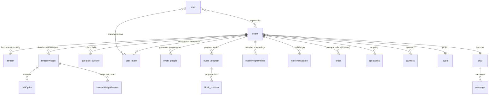

> **EN (this)** · **RU:** [`legacy-recon-ru.md`](./legacy-recon-ru.md)

> **⚠ Functional reference — look-and-take-the-domain, never reproduce the UI, never copy the schema (ADR-0014 §3).** This document mines a working prior system for _what the webinar domain does_ — the entities, workflows, and mechanics that prove functionality. The new DS Platform data model and screens are designed **fresh** from the JTBD and IA of the upcoming product brainstorm. Every Bubble field list, Directual scenario, or live screen below is **evidence of a capability**, not a target to re-implement. The 130-field `event`, the boolean-scatter lifecycle, the client-side presence pings, and the Bubble→Directual mirror topology are the _mistakes to beat_, not the blueprint.

---

## 1. Purpose & method

This is the **"Prior art — source system" mining output** of the Webinars product epic — the foundational first step of `do-product-discovery` (ADR-0014 §3, discovery track step (a)). It is prep material for the **product brainstorm** (JTBD, information architecture, feature decomposition, prioritization) held next session, whose audience is the **Product Lead** (owner) and the **lead agent**. It is not a spec, not a decision record, and settles no scope — scope is the owner's call at the brainstorm (ADR-0014: product-scope forks are the owner's).

**Recon date:** 2026-07-02. **Four sources mined, read-only:**

| Source                          | Evidence base                                                                                                                    | What it yields                                                                                                          |
| ------------------------------- | -------------------------------------------------------------------------------------------------------------------------------- | ----------------------------------------------------------------------------------------------------------------------- |
| **A — Bubble export**           | 26 MB JSON export of `dctrschl.bubble` (`doctor-school-bubble-app`): 130+ data types, option sets, page/reusable workflow graphs | Domain model, option sets, registration + room workflows, screens, stream-embedding mechanics, pain points              |
| **B — Directual**               | `directual/database.json`, `scenarios.json` (70 scenarios), `apis.json` (67 endpoints), session docs                             | Backend data mirrors, cron/scenario map, presence/attendance pipeline, integration topology, operational state, lessons |
| **C — Knowledge base**          | `doctor-school-knowledgebase` (business-logic / architecture / instructions / interview transcripts)                             | Webinar lifecycle, roles, audience, sponsor value, НМО mechanics, taxonomy, key numbers                                 |
| **D — Live site + screenshots** | `https://doctor.school` (public, unauthenticated) + historical admin screenshots                                                 | IA, calendar/listing/event-page anatomy, admin editor tabs, patterns worth keeping                                      |

**Evidence citations are preserved inline** so every claim is verifiable: Bubble reusable/type names (e.g. `p_event > Group stream`, `user_types.event`), Directual scenario names (e.g. `SettingsLOGS`), knowledge-base paths (e.g. KB `docs/business-logic/nmo-points-system.md`), and screenshot files (e.g. live `live-05-events-list.png`). Where sources conflict, the conflict is **surfaced, not smoothed** (see §5, §6).

---

## 2. Business context

Condensed from source C (`docs/business-logic/event-planning-process.md`, `nmo-points-system.md`, `platform-key-functionality.md`, interview `2025-12-22-Андрей-Бреев-интервью-процессы.md`).

**What a webinar is for Doctor.School.** A **sponsor-funded** online educational broadcast (`эфир`) for an audience of **practicing doctors** (`врачи`), targeted by medical specialty. The B2B model: pharma **партнёры** (sponsors) fund the event and, in return, get access to the doctor audience + an attendance report. **"Без партнёров мероприятия не проводятся"** — no sponsor, no event (KB `event-planning-process.md`). Today **only free, sponsor-funded events run**; paid flows (ex-Robokassa) are disabled.

### End-to-end lifecycle (10 steps)

| #   | Step                                  | Notes                                                                                                                                                                                                                                                                                          |
| --- | ------------------------------------- | ---------------------------------------------------------------------------------------------------------------------------------------------------------------------------------------------------------------------------------------------------------------------------------------------- |
| 1   | **Annual planning** (конец года)      | «Научные лидеры» (KOLs) pick dates + cities per «школа»; менеджер records into a Яндекс.Таблица. Firm for H1, sketched for the year.                                                                                                                                                           |
| 2   | **Commercial proposal (КП)**          | Manager mails a КП (events, dates, cities, terms, price) to pharma partners.                                                                                                                                                                                                                   |
| 3   | **Sponsor budget approval**           | Sponsors set year-end budgets against a firm plan. No sponsor → no event.                                                                                                                                                                                                                      |
| 4   | **Loading onto platform (заведение)** | Operator creates the event in Bubble admin ≥1 month out; min fields name/date/city/description; speakers created as users then «назначить спикером».                                                                                                                                           |
| 5   | **Program (программа)**               | PDF designed in Figma, printed, uploaded to the event page. «Часто меняется» → upload only the final. The built-in «конструктор программы» exists but **nobody uses it**.                                                                                                                      |
| 6   | **Announcement / registration**       | Event appears in the public list + calendar; doctors register. **Gap: no welcome / confirmation / change-notification emails** (KB `platform-issues.md`).                                                                                                                                      |
| 7   | **Live session (online)**             | «Двойные эфиры» — two webinars run at once from an in-office «студия»; only two specialists (Сергей, Андрей). The «режиссёр» starts the stream (test then live); viewers see the embedded player + live chat. Some schools pull a remote academic via **Zoom** into the studio.                |
| 8   | **Engagement during stream**          | Режиссёр fires «титровальные объекты» (lower-third overlays) of 4 types: Приветствие / Вопрос / Опрос (live graph) / Присутствие. Poll graph has a «Прозрачный фон» toggle for OBS compositing. Chat lives only while the stream is live.                                                      |
| 9   | **Presence tracking**                 | The client pushes a «слепок присутствия» to Supabase every minute (`user_id, event_id, timestamp, session_id`); multi-tab dupes deduped to one/minute (KB `presence-tracking.md`).                                                                                                             |
| 10  | **Post-event**                        | Режиссёр clicks «Завершить мероприятие» → Supabase function builds the presence report (~1 s for 100–150 people) → НМО points auto-award → statuses set (manual override possible) → **«Отчёт партнёра V2»** (Excel) generated → event manually archived; recording goes to the video archive. |

### Roles

| Role                           | Responsibility                                                                                                                                                              |
| ------------------------------ | --------------------------------------------------------------------------------------------------------------------------------------------------------------------------- |
| **Научные лидеры / KOLs**      | External experts; initiate events, pick dates/cities, own the «школа», moderate.                                                                                            |
| **Менеджер по мероприятиям**   | Coordinates KOLs ↔ КП ↔ sponsors ↔ operator. Currently one person (was 5).                                                                                                  |
| **Оператор платформы**         | Loads events/speakers/partners into admin, keeps them current, pulls reports.                                                                                               |
| **Режиссёр (director)**        | Real-time stream control: start/stop, титровальные объекты, monitor participants, end event, award НМО. Key online-event role.                                              |
| **Партнёры (pharma sponsors)** | Fund everything; invite doctors via their own channels; receive attendance reports.                                                                                         |
| **Дизайнер** (contract)        | Program PDF + handouts (раздатки) in Figma.                                                                                                                                 |
| **Рассылки** owner («Лиля»)    | Email campaigns (but program-change mailings are not sent).                                                                                                                 |
| Admin hierarchy                | Администратор, Руководитель (owner «Эдуард»), Главный менеджер, Менеджер (RLS-scoped parent-child), plus unused roles (Старший модератор, Модератор, Специалист поддержки). |

**Спикер is a _property_ of a user, not a standalone role**; regalia («регалии») can be overridden per event.

### Audience facts

- **Who:** practicing doctors targeted by specialty; profile carries «специальность» + «должность» (from «справочники») and manually-typed «место работы». ~4000 workplace strings accumulated with many dupes; autocomplete disabled for performance (KB `platform-key-functionality.md` §5.3).
- **Verification:** «верификация» (workplace + specialty filled) is required to earn НМО. Statuses: Верифицирован / Частично / Не верифицирован. **This is data-completeness verification, not credential/license validation** — the KB describes no medical-license check.
- **Discovery:** for offline, largely _not_ via the platform (sponsor networks, city «главный врач»); for online, registration is mandatory so discovery is more platform-bound, but marketing/rassylki are weak.
- **Behavior:** offline no-show is chronic (70–80% under-fill); irrelevant to online presence but explains the sponsor obsession with явка.

### Sponsor deliverable — «Отчёт партнёра V2»

The **core B2B deliverable** (KB `nmo-points-system.md` §Отчёты). An Excel per event with, per attendee: participant ID, name, **email**, specialty, workplace, entry time, exit time, event minimum duration, **actual presence minutes**, count of confirmed presence-objects, participant status. So sponsors receive **contact data + per-doctor attendance minutes** — verified doctor-audience reach is what they pay for. Older variants (Партнёр V1, НМО, ТО, МОО, Портал) exist but only **V2** is used.

### НМО mechanics

**НМО** = «Непрерывное медицинское образование», Russia's mandatory CME credit system; doctors accrue «баллы» to keep qualification (KB `nmo-points-system.md`).

- An event flagged **«Аккредитовано»** carries an НМО point count (default **6 баллов**) + a list of «коды НМО»; the system pre-creates a DB record per code, bound to participants post-event.
- **Two conditions to earn points:** (1) presence **≥ 90 минут** ("согласно нормам закона"); (2) confirm **2 «титровальные объекты присутствия»** (click «Присутствую» within the object's **60-second** lifetime). **<5 min presence = not counted.**
- **Statuses:** Зарегистрирован (no points) → Присутствовал (present, conditions unmet, manual award possible) → Прошёл (auto-awarded). Points stored as a **dynamic per-user list** `{код, баллы}`, not summed; manually revocable.

### Taxonomy

`event.offline_format_types` is a **format value**, not a separate type — "webinar" is one format among many:

- **Вебинар / онлайн-мероприятие / эфир** — on-platform stream; mandatory registration; auto presence; НМО; chat; титровальные объекты. Usually a few hours.
- **Школа** — recurring branded educational series led by a KOL; the planning unit around which dates/cities/sponsors turn.
- **Конгресс** — larger; Doctor.School's congress manager left and congresses were **handed to an external team («команда из "Здоровья"»)** — signals congresses may be **out of scope** for the first rebuild epic.
- **Клуб / Doctor.Club** — retention format; regular meetings; distinct dark-theme design on the current site.
- **Проект** — top-level grouping above events (name, description, image, accreditation flag). Every event belongs to a project; event ID format `проект-номер` (e.g. `199-21`) is **not a slug**.
- **Офлайн-мероприятие** — physical; no registration; manual attendance + badge printing; often multi-day (but the platform supports only a single start date).

### Key numbers

| Metric                                 | Value                                                                           | Source                      |
| -------------------------------------- | ------------------------------------------------------------------------------- | --------------------------- |
| Video archive (2020–2025)              | 1,067 videos · 2,186 h · ~6.2 TB                                                | KB `platform-statistics.md` |
| Events/year (recent)                   | ~250–285                                                                        | ibid.                       |
| Event cadence                          | ~4–6 events/week; 31 planned H1 (Q1-heavy)                                      | interview                   |
| Historical users (Bubble)              | ~39k dump                                                                       | KB `user-data-structure.md` |
| Actualized users (Directual `webuser`) | ~9,294                                                                          | ibid.                       |
| Presence records in Supabase           | ~2.5 million                                                                    | KB `presence-tracking.md`   |
| Report generation                      | ~1 s for 100–150 participants                                                   | ibid.                       |
| НМО defaults                           | 90 min · 6 points · 2 presence-objects · 60 s object lifetime · <5 min = absent | KB `nmo-points-system.md`   |

**Seasonality:** high late-winter/spring→July, low July–August (doctor vacations), Sep–Dec peak (sponsor year-end budgets + H1→H2 slippage); events never roll to the next year.

---

## 3. Domain model (mined)

Synthesized across sources A + B. **Presented as functional evidence, not a schema.** Bubble is the system of record; Directual mirrors are read-only shadows (§6). Names are Bubble type keys with the AGENTS.md display-name translation in quotes.

### Entity map



### Entities

- **`event` (`user_types.event`, "event") — the aggregate root, 130 fields (~40 dead).** The single central object; every format (webinar/congress/club) is an `event`. Functional groupings:
  - _Identity:_ `title`, `desc`, `comment`, `logo`, `place_image`, `eventColor`, `counter` (slug-ish text), `qr`, `creator`/`manager` (manager-scoped admin access), `project`→`cycle`, `chat`.
  - _Scheduling:_ `start_date`, `end_date`, `duration` (min), plus **denormalized calendar-filter fields** `filterDay`/`filterDays`/`filterMonth`/`filterMonthInt`/`filterYear` (precomputed so the calendar filters a preloaded list without date math), `city`.
  - _Format/classification:_ `offline_format_types` (Вебинар/Конгресс/Слёт/Клуб/schools — the primary format selector), `format` (Онлайн/Офлайн/Doctor School/Doctor Club), `eventType`, `event_open` (Открытый/Закрытый), `price_format` (Бесплатное/Платное/Закрытое), `price`, `main_specialties`/`other_specialties` + join `eventSpecialties` (Main flag + `itemNumber`), `associations`.
  - _Lifecycle flags (scattered booleans, no status enum):_ `draft`, `published?`, `archive`, `template`, `visible_in_rg`, `userShow?`, `disable_reg`, `participantsLimit`, `wizardFlow` + `stepWizard`.
  - _Stream/live:_ `streamDateStart`/`streamDateEnd` (live window, distinct from event start/end), `streamWidgets`→`list.to`, `count_to`. Actual video links live on `stream`, not here.
  - _Program/people/partners:_ `program_blocks`, `time_blocks`, `congressBlock`, `speakers`→`event_people`, `members`→`list.user`, `partners`, `program_file`, `eventProgramFiless`.
  - _Registration/commerce/reporting:_ `user-events`→`list.user_event`, `eventOrders`, `eventRequests`, `nmo_type`/`nmo_codes`/`nmo_links`/`nmo_points`/`accreditationStatus`, `rated`/`rating_events`/`rating_partner`, `report_photos`/`report_videos`, `timingsCollectedFinished`/`timingsCountFinished` (presence-batch flags).
  - **Dead/legacy (~40 fields):** old `list.user` role fields (`experts`/`leaders`/`moderators`/`teachers`/`lectors` — superseded by `event_people`), `to_queued`/`to_done`/`to_answers_counter`, `nmo` (boolean), `club`, `school`, `date` (date_range), multiple older `partners` shapes, `messages`, `comments`. **This dead weight is the primary "beat this" signal for the new model.**

- **`to` (`user_types.to`, "streamWidget") — 18 fields.** The in-stream interactive widget: `event`, `title`, `description`, `button_text`, `streamWidgetType` (Уведомление/Опрос/Вопрос/Присутствие/Приветствие), `status` (queued/running/done), `start_date`/`end_date`/`duration` (launch window), `pollOptions`, `streamWidgetAnswers`, `maxNumberOfAnswers`.
- **`__poll_option` ("pollOption") — 4 fields.** `title`, `correct` (quiz flag), `hideCorrect`, `count` (denormalized vote tally).
- **`presence_answers` ("streamWidgetAnswer") — 9 fields.** One viewer's answer: `user`, `event`, `streamWidget`, `streamWidgetType`, `pollOptions` (chosen), `dateCreated`, `visible` (whether it counts/shows).
- **`__questions` ("questionToLector") — 8 fields.** `author`, `event`, `text`, `fullName`, `dateCreated`.
- **`user_event` ("user-event") — 12 fields — the enrollment/attendance join.** `user`, `event`, `emailUser`, `статус`, `order`, `start_date`/`end_date`, **`time`** (watch time), **`присутствия`** (presence count), `offlinePresence` (physical), `fill`, `postponed` (registered before auth).
- **`stream` ("stream") — 8 fields.** Broadcast config decoupled from `event`: `event`, `isActive`, `date_start`, **`youtube_link`**, **`second_video_link`** (backup/secondary, e.g. Rutube), **`autostartKey`** (auto-start the broadcast via a backend API event).
- **Program structure:** `event_program` ("block" — `title`, `date`, `itemNumber`, `moderators`, `speakers`, `programs`) → `block_position` ("programm" — `theme`, `description`, `start`/`end`, `speakers`, `partners`); `time_blocs` (day/time grouping); `congressblock` (congress landing-page section ordering); `congress_temp_regs` (single `email`, congress-signup staging).
- **People/speakers:** `event_people` (per-event speaker card — `fullName`, `role`, `speaker (suppler)`, `user`, `event`, `rating`, `showInTop`); `suppliers` ("speakers" — the global speaker directory, 53 fields); `rating_speaker` (per-speaker stars tied to `event_people`).
- **Materials/files:** `eventprogramfiles` ("eventProgramFiles" — `event`, `title`, `file`, `url`, `order`, `active`, `eventProgramFilesType` = rutube/pdf/image). **Where recordings (rutube), program PDFs, and images attach post-event.**
- **NMO/credits:** `nmo` ("nmoPointsTrasaction" — `user`, `event`, `code`, `count`, `date`) — the CME-points ledger; `ds_coins_movement` (internal DS-coin loyalty ledger); `soundcheck` (pre-event device/mic self-test).
- **Registration/commerce (disabled):** `eventrequest` (priced/whitelist request), `order` (full Robokassa payment order — `amount`, `paid`, `payment_id`, `paymentOrderType` Оплата/Промокод/Вайтлист), `webhook_notification___robokassa`. **All payment flows are off today.**
- **User (webinar-relevant subset, 102 fields):** `events`, `user-events`, `unauthorizedPostponedEventRegistrations` (registered-before-auth), `nmoPointsTrasactions`, `role`, `speaker`→`suppliers`, `specialties`, `city`, `regalia`, registration-UX flags (`show alert in reg`, `show reg popup`).
- **Role (`______roles`, 23 fields):** `order`, `adminAccess`, `group` (Руководство/Поддержка/Пользователь/Технический специалист/Режиссёр), `title_rus`/`title_eng`, `affiliation` (subordinate managers), `hidden_pages` (per-role admin left-menu hiding).

### Option sets (functional vocabulary)

`offline_format_types` (…·**Вебинар**), `titles_type` (widget kinds), `__to_state` (queued/running/done), `chips` (Онлайн/Офлайн/Doctor School/Doctor Club), `event_open`, `price_format`, `eventcolor` (hex palette incl. `#2D84F2`), `cycle_status` (Аккредитовано/Не аккредитовано/На аккредитации), `nmo` (НМО/Сертификат), `event_role0` (12 speaker/faculty roles), `eventeditor` (wizard steps), `eventfilter` (School/Specialization/City/Year/Speakers — viewer facets), `eventprogramfiles` (rutube/pdf/image), `menu_event` (admin editor tabs), `congressblock` (11 congress sections), `os_group_role`, `paymentorder`/`paymentstatus`, `month`.

---

## 4. Functional map per surface

From sources A + D. What each screen _does_ (functionality evidence), not how it looks.

### Calendar / home (`index` → `p_index`/`p_index2`; live `live-01-home-full.png`)

Month calendar of events with per-day **"Онлайн N"** pills (format + count), search box ("по названию мероприятия или школе"), prev/next-month arrows, and a **grid↔list toggle** ("Открыть список мероприятий"). Uses the event's denormalized `filterDay/filterMonth/filterYear` to place events per day. A **persistent top banner** advertises the current live stream (red "recording" dot + «Смотреть эфир»). Homepage also carries an "Анонсы недели" strip and three stat counters (**50 000+** participants, **840+** NMO events, **500+** speakers) — a Rutube partnership slide.

### Events listing + filters (`events` → `p_events` + `RE | eventFilter`; live `/index/events`, `live-05-events-list.png`)

Format tabs **Все / Онлайн / Офлайн**; free-text search; **Специальность** searchable multi-select checkbox dropdown (`live-06-specialty-filter.png`); a **«Только с НМО»** checkbox; "Очистить фильтр"; a result count. **Filtering is client-side custom-state over a preloaded repeating group** — not live DB search (a scalability flaw, §7).

**Observed event-card field inventory (source D, listing card):**

| Field                      | Example                                                                |
| -------------------------- | ---------------------------------------------------------------------- |
| Format badge               | `Онлайн` (blue) / `Офлайн`                                             |
| Date                       | `02.07.2026 г.`                                                        |
| Time (TZ)                  | `17:00 (МСК)`                                                          |
| School/series (supertitle) | `Подсмотрено в операционной`, `Pain clinic`, `Инновационная ортопедия` |
| Title                      | `Пластика ахиллова сухожилия`                                          |
| Specialty chips (multi)    | `Травматология и ортопедия`, `Терапия`, `Ревматология`, `Фармация`…    |
| Speakers                   | `Торгашин А. Н. · Мурсалов А. К.`                                      |
| CTAs (dual)                | **Участвовать** + **Перейти на мероприятие**                           |
| Poster thumbnail           | branded program image                                                  |

### Event page (`event` → `p_event` viewer; live `live-02-event-live.png`, `live-04-event-archived.png`)

Composition tree: `g | main > g | event date and registration > g | body > g | eventCard > g | stream > Group stream`. Three temporal states:

- **Before stream:** hero (logo/title/date-time/location), format/price, registration CTA (`re | eventRegBtn`), program (`program_blocks`/`time_blocks`), speakers (with credentials), partners (labeled sponsor tiers), "download program", specialties. Live: a **soft auth wall** — anonymous users see a red **«Авторизуйтесь для просмотра трансляции»** over the gated player, everything else public.
- **During stream:** video player (see §5), live widgets in `g | streamWidget` fed by `rg | tech streamWidgets`, poll answer UI (`g | singleAnswerItem`/`g | severalAnswersItem`), "question to lector" form, presence check. The (now-disabled) `html | viewer logs` script tracked presence.
- **After stream / archived:** reviews + speaker-rating carousel (`g | newReview`, `StarRating speaker`), report photos/videos, downloadable recordings/PDFs (`eventprogramfiles`), НМО/certificate status (`userNMOStatus`). Archived events prefix the title **«Архив: …»** and drop the player + auth banner + «Участвовать» CTA.

**Registration CTA state machine** (custom states + `reg_nav`, 7 nav states): guest → login/register popup → confirming → registered; gated by `disable_reg` + `participantsLimit`. Branches (source A workflows): already-authenticated register (`NewThing` user_event → append to `Current User's events`), login-from-registration (`LogIn > ChangeThing` — the session-race path, §7), register+create-account inline (`SignUp > … > SendConfirmationEmail`), create-with-reset, and **postponed registration** (unauthenticated visitor parked on `unauthorizedPostponedEventRegistrations` / `user_event.postponed=true`, finalized after auth).

### Webinar room mechanics (`p_event > Group stream`)

- **Player selection by URL-sniff** — a string-content branch on the link picks the player (§5).
- **1-second timer** — a `DoInterval → SetCustomState` "Do every 1 second" updates `p_event`'s `now` state, driving time-window widget visibility.
- **Widgets overlay** — polls/questions/presence rendered as separate Bubble elements over the player; poll submit creates a `presence_answers`, increments `__poll_option.count`, links to the widget; multi-select capped by `to.maxNumberOfAnswers`.
- **Presence script** — `html | viewer logs` (two conditional `<script>` blocks) logged watch time to Supabase; **commented out / disabled 2026-04-29**.

### Personal account (`profile` → `p_profile`; admin user editor `Screenshot 2026-02-26 191800.png`)

"My events" from `User.user-events`/`events`; `userNMOStatus` credit widget. The admin user editor confirms a per-user **НМО-points ledger** — «История мероприятий» table with columns **№ / Название / Дата / Баллы НМО / Архив**.

### Admin (`page_admin` → `🚩events` list + `🚩events_CE` editor, 332 workflows; `Screenshot 2026-02-27 132405.png`)

- **Event editor tabs** (`menu_event`): Основные · Формат · НМО · Конструктор · Файл программы · Отзывы · Участники · Спикеры · Партнеры · Отчеты · DoctorClub, plus a top-level **Общее / Трансляция** split (stream config on Трансляция). Stream URL/embed + widget/poll authoring (create `to` with type, options, launch window) live here; publish is the `draft`/`published?`/`visible_in_rg`/`disable_reg` booleans.
- **List with role-branch access** (`🚩events.loadEvents`, source A findings #5/#6): roles **1/5/9** get a broad list; roles **2/3/4** get manager-limited lists filtered by `manager1_user`. **All branches historically excluded `offline_format_types = Конгресс`** → congress events vanish from admin (the congress-filter bug). Admin users list is backed by a **DPD/Directual API payload, not native `User` rows** (edit-by-`_api_c2_bubble_id` can open the wrong person).
- **Режиссёр console functions** (KB `event-management.md`): start/stop stream (test → live), fire титровальные объекты (4 types), monitor participants, «Завершить мероприятие», award/override НМО points.
- **Reports export buttons** (source D): **Скачать отчет НМО / отчет партнеров / партнеров V2 / отчет ТО** — heavy sponsor + regulatory reporting.

Supporting surfaces: `questions` (Q&A moderation), `chart` (poll-result charts), `eventprogramfiles` (materials manager), `p_speaker(s)` (speaker directory), `ratings`, `archive`/`p_archive`, `🚩congress` (congress landing blocks).

---

## 5. Stream & realtime mechanics today

Dedicated because this is the **MVP-critical surface** (owner's target: first live webinar on the new platform **2026-07-17**). Evidence: source A stream-embedding count + source C production notes.

**How the video reaches the page (source A):** counting embed references shows **YouTube (42) and Rutube (21) via iframe / Bubble Video (32 iframes)** — no Kinescope, Vimeo, VK, HLS/`.m3u8`, or JS players. Inside `p_event > Group stream` the player is chosen by a **string-content branch on the link**:

1. **YouTube path** — a Bubble native **Video** element (`Video A`, `video_source: youtube`, 16:9, autoplay), `video_id` bound to `youtube_link_text`; a variant (`Video C`) extracts the raw id via `:find & replace`. Intended embed shape `…/embed/<id>?&autoplay=1&rel=0&enablejsapi=1`.
2. **Rutube / secondary path** — a conditional tests whether the link `contains "rutube"`; if so a plain **HTML iframe** (`<iframe … allowfullscreen>`) is populated with the Rutube / `second_video_link` URL. The `not_contains "rutube"` branch selects the YouTube element.
3. **`second_video_link` backup** — a fallback/second broadcast; separate iframe elements (300×250 and full-bleed) exist; a `Group time_blocks` selector lets viewers switch streams.
4. **Autostart key** — `stream.isActive` + `stream.autostartKey` drive a scheduled backend API event that flips the stream live at `streamDateStart`/`stream.date_start`.
5. **Presence overlay** — `html | viewer logs` sat over the player logging to Supabase `views_logs`; **both scripts disabled 2026-04-29**.

**Live realtime today:** polls/questions are overlaid Bubble elements, delivery gated by the **1-second timer** over a **stale preloaded widget list** — there is **no server push**. Admin launching a widget only writes `start_date`/`end_date` on the `to` object; viewers filter a stale snapshot and miss the poll until reload (the stale-list flaw, §7). Chat (`chat`/`message`, `isModerator` flag) works only while the stream is live. Poll results render as a graph with a **«транспарентный/Прозрачный фон» toggle** so the служебный UI can be composited into OBS.

> **⚠ Open question — flagged, not smoothed (source discrepancy).** The **knowledge base (source C)** states the embed is **"SDN Player (primary) or rutube.ru (alternative)"** and mentions **Zoom** for remote speakers. The **Bubble export (source A)** shows **only YouTube + Rutube** embed paths (42 YouTube / 21 Rutube references; no "SDN"/"sdnvideo" string). These do not reconcile from the artifacts alone. Possible explanations (none confirmed): SDN Player may be a Rutube-family/white-label product surfaced through the same iframe path; the KB may describe intended/current studio practice that post-dates the export; or "SDN Player" is the studio-side origin, not the viewer embed. **Resolve with the webinar operator (Сергей) before committing to a player abstraction** — the export cannot settle it.

---

## 6. Backend processes & attendance pipeline

From source B. **Key architectural fact: Directual is _not_ the system of record — Bubble is.** Directual is a **read-mirror + background-job layer**: ~40 `cronTask_*` scenarios each poll one Bubble type via the Bubble Data API (`Modified Date > prevUpdate`, cursor-paginated) and upsert a shadow copy. The only two things Directual _originates_ are (a) presence/attendance aggregation from Supabase, and (b) outbound email (Sendler/UniSender).

### Topology

```
[Viewer browser]                  [Bubble app + DB = system of record]
  p_event "html|viewer logs"          |  ^                    |
  setInterval 60s AJAX POST           |  | Data API           | wf/ callbacks
       |                              |  | GET /obj/<type>    |
       v                              |  | (Modified Date >   |
[Supabase views_logs] <--- REST ------+  |  prevUpdate)       v
  (user_id, event_id, created_at)        |          [Directual]
       ^                                 |   ~40 cronTask_* mirrors -> shadow tables
       |  RPC get_event_users_presence_  |   SettingsLOGS: Supabase -> logs_translation
       |  deduplicated (Bubble path)     |                -> POST Bubble wf/timingscountfinished
   Bubble settingLogs -> countPresenceV2 |   Sendler -> UniSender / Resend / SMTP
       -> user-event.time                |   cronTask_dispatch -> techEmailUsersFromBubble
```

**Source of truth by domain:** all event/user/interaction content → **Bubble** (Directual mirrors read-only, keyed by `bubble_id`, one-way pull-based `Modified Date`-incremental); raw presence pings → **Supabase `views_logs`** (the only raw sample store, written from browser via a **client-embedded Supabase service-role key** — a security liability); aggregated presence → computed **twice, redundantly** (Bubble path dedups via RPC; Directual path plain-`groupBy` counts, no dedup) — both terminate at Bubble `user-event`; outbound email → **Directual** (Sendler → UniSender primary; Resend/SMTP alternates); video hosting → external YouTube/Rutube (no player telemetry — attendance is Supabase-ping-derived only).

### Presence pipeline, step-by-step

1. **Capture (Supabase).** Each open viewer page runs `setInterval` (default **60 s**) POSTing `{user_id, event_id}` to `views_logs`; Supabase stamps `created_at`. One row = one 60 s "still here" heartbeat; **duration is inferred from ping density** (no client-sent timestamps).
2. **Aggregate — Directual `SettingsLOGS`.** Pages `views_logs` (1000/offset), `groupBy('user_id')`; per user `all_time = ping_count`, `start_time`/`end_time` = earliest/latest `created_at`; writes `logs_translation`; POSTs Bubble `wf/timingscountfinished`. **No dedup — concurrent tabs/reconnects inflate the count.** Viewing minutes ≈ ping_count × 60 s.
3. **Aggregate — Bubble path (parallel).** `settingLogs` → Supabase RPC `get_event_users_presence_deduplicated` → `countPresenceV2` per user → writes **`user-event.time`** (+ `presences`, status, NMO records). This is the **deduplicated canonical** number.
4. **Store.** Canonical attendance in Bubble `user-event.time`/`presences`/`status`; `offlinePresence` marks physical; mirrored to Directual `userevent` hourly; event-level completion gated by `timingsCollectedFinished`/`timingsCountFinished`.
5. **Credits.** Presence thresholds drive НМО issuance → `nmopointstrasaction`; loyalty → `dsCoinsTransaction`.
6. **Sponsor report.** Endpoint **`getEmailsForOrder`** («Поиск пользователей для отчета») returns per-attendee `fullName, work_places, specialties, positions, email, city_text, bubble_id` — the doctor roster; email engagement from `sendler`/`sendler_log` via `get_mails`.

### DISABLED state since 2026-04-29 — what capability is missing

Three switches turned it off (source B operational state): (a) Bubble `html|viewer logs` client writer replaced with comments (no new Supabase writes); (b) Bubble `settingLogs` has `Terminate this workflow` as its first action; (c) Directual `SettingsLOGS` is `START` but its normal entry is severed (last live run `16-Jun-2025`). **Missing while disabled:** no new viewer presence data → **no automatic attendance duration, no presence-based НМО/certificate accounting, no fresh sponsor attendance reports.** Historical rows retained; video/chat/polls/registration/visibility unaffected. **Trigger to disable:** storage/traffic pressure on long streams.

### Mailing

**`cronTask_dispatch` = PAUSE** (the only paused cron; a runaway incident left ~10.2 M stuck `dateEnd is empty` rows, handed to Directual devs). While paused, **Bubble→Directual mailing-definition sync is not running**; the `Sendler` send scenario itself (→ UniSender / Resend / SMTP) is independent and still `START`. Audience segmentation is by city + specialty (`dispatch.cities`/`specialities`). **No native SMS and no in-Bubble reminder scheduler exist** — all event mail/reminders are outsourced to Directual.

---

## 7. Pain points the rebuild must beat

Merged + deduplicated across all four sources, grouped, each with a one-line implication for the new platform.

### (a) Platform / infra

| Pain                                                                                                                                                                                                                                     | Implication                                                                               |
| ---------------------------------------------------------------------------------------------------------------------------------------------------------------------------------------------------------------------------------------- | ----------------------------------------------------------------------------------------- |
| Bubble.io (US) slow, unreachable, RKN-blocked/throttled (KB `platform-issues.md`; the bubble-website repo is literally an nginx reverse-proxy forcing Bubble through a RU server) — prime rebuild driver                                 | Owned, RU-hosted stack; no US-origin SPA dependency.                                      |
| 3 years of tech debt, "проще сделать с нуля"; 6 console errors on every live page (source D)                                                                                                                                             | Greenfield clean model; CI/observability floor already in place.                          |
| Login-session races — actions run immediately after `Log the user in` cause intermittent `EXPIRED_SESSION`, worse via RU reverse-proxy; the login modal literally tells users to clear site data (finding #1, `live-08-login-modal.png`) | **Auth already shipped (feature 003)** with a proper BFF session — this class is retired. |

### (b) Webinar-room realtime

| Pain                                                                                                                                                    | Implication                                                                                        |
| ------------------------------------------------------------------------------------------------------------------------------------------------------- | -------------------------------------------------------------------------------------------------- |
| **Stale-list vs live-search for widgets** — admin launch only sets `to.start_date`/`end_date`, no push; viewers miss the poll until reload (finding #4) | Real-time delivery (WS/SSE) + a live server query, not a client time-filter over a preloaded list. |
| **Fragile player selection** — platform chosen by string-sniffing "rutube"; remote-CDN nav-arrow SVG failed for RU users (finding #2)                   | Owned player + controls component; explicit provider config, not URL heuristics.                   |

### (c) Attendance / НМО

| Pain                                                                                                                              | Implication                                                                                              |
| --------------------------------------------------------------------------------------------------------------------------------- | -------------------------------------------------------------------------------------------------------- |
| **Presence pipeline disabled** since 2026-04-29 (client interval + browser AJAX too heavy on long streams)                        | Server-authoritative presence (heartbeat to a backend endpoint), scalable + auditable.                   |
| **Two disagreeing aggregation paths** — dedup RPC vs plain `groupBy` produce different attendance for the same event              | **One canonical dedup path, one attendance number** (sponsor billing depends on it).                     |
| **Client-exposed Supabase service-role key** in Bubble HTML                                                                       | Presence writes only through an authenticated backend endpoint; no client secrets.                       |
| Directual `Modified Date` polling re-imports on _any_ write, incl. UI-only fields → ETL spikes + billing multipliers (finding #7) | Don't let UI bookkeeping drive external ETL; event-sourced change capture, not "modified-since" polling. |

### (d) Lifecycle / data model

| Pain                                                                                                                                    | Implication                                                                            |
| --------------------------------------------------------------------------------------------------------------------------------------- | -------------------------------------------------------------------------------------- |
| Lifecycle as **scattered booleans** (`draft`/`published?`/`archive`/`template`/`visible_in_rg`/`userShow?`/`disable_reg`) — ambiguous   | A single event **state machine** (draft → published → live → ended → archived).        |
| **130-field `event` with ~40 dead fields** + duplicated relations (old `list.user` roles vs `event_people`, multiple `partners` shapes) | Model event / stream / widget / enrollment / credit as clean separate entities.        |
| **No timezone support** — always Moscow time; the PDF shows local time, the site MSK; no add-to-calendar w/ TZ (KB)                     | First-class timezone handling + calendar export.                                       |
| **Single start date only** — cannot express a multi-day period (KB)                                                                     | Model event periods, not a single instant (relevant if offline/congress enters scope). |
| Client-side state-based listing filters over preloaded lists (`p_events`/calendar)                                                      | Server-side filtered queries.                                                          |
| Redundant/drifting stores (`WebUser` vs `All_Users`, Bubble vs Directual `user_event`, `nmo_points` vs `nmopointstrasaction`)           | One system of record per aggregate; mirrors read-only and clearly derived.             |

### (e) Communications

| Pain                                                                                                                                                                   | Implication                                                                         |
| ---------------------------------------------------------------------------------------------------------------------------------------------------------------------- | ----------------------------------------------------------------------------------- |
| **No welcome / confirmation / change-notification emails**; no in-app reminder scheduler; no SMS; all mail outsourced to Directual (findings; KB `platform-issues.md`) | Owned, reliable pre-event reminders (email/SMS/push) + transactional confirmations. |
| After registering, users can't find the event they signed up for; no visible start-time / "where to join" (KB)                                                         | A personal account "my events" surface with clear join signposting.                 |

### (f) Process / admin

| Pain                                                                                                    | Implication                                                                                     |
| ------------------------------------------------------------------------------------------------------- | ----------------------------------------------------------------------------------------------- |
| **Unused constructor** — «конструктор программы» exists but nobody uses it; they upload a PDF           | Don't rebuild the unused wizard; support the real workflow (upload final PDF / simple program). |
| **Mandatory speaker fields** (phone + email) slow setup, often unavailable                              | Make non-essential speaker fields optional (owner to confirm depth).                            |
| **Badge printing broken** (offline) → manual Google-Sheet entry → data never reaches the platform       | Offline is likely out of first scope; if in, close the walk-in data gap.                        |
| Congress hidden from admin list by a hard `!= Конгресс` filter across every role branch (finding #5)    | Uniform query, no format-specific hardcoding.                                                   |
| Admin list on a Directual API payload, not native rows → edit-by-id opens the wrong record (finding #3) | Identity/ownership resolved from the canonical store.                                           |

---

## 8. What the old system does NOT have (useful negative space)

Explicit absences — capabilities the rebuild would _add_, not inherit:

- **No owned player / no video transcoding** — video is an external YouTube/Rutube embed; no adaptive streaming, no DRM, no server-side playback auth. (This aligns with the owner's MVP framing: embed an external stream as a configured iframe.)
- **No in-Bubble reminders / no SMS** — no reminder scheduler; all mail outsourced to Directual; `SendSMS`/`reminder`/`напомина` = 0 hits in the export.
- **No real credential/license verification** — «верификация» is data-completeness (workplace + specialty filled), never a medical-license check.
- **No evidence of certificate PDF generation** — `nmo_type = Сертификат` grants points, but the export shows no downloadable certificate artifact; offline "получают сертификаты на месте" only. Mechanics are НМО-points-only.
- **No timezone handling** — all times Moscow-implicit.
- **No server-side playback auth** — the auth wall is a soft UI gate over the player, not a signed/entitled stream.

---

## 9. Candidate feature decomposition — INPUT for the brainstorm, not decisions

> **This section is pre-read material only.** It offers a _candidate_ slicing to react to; **the owner decides scope, sequencing, and MVP cut at the brainstorm** (ADR-0014: product-scope forks are the owner's). The "needed for 2026-07-17?" column is grounded strictly in the owner's stated MVP framing — **no video transcoding; the room embeds an external stream (Rutube or similar) as a configured iframe; auth/registration already shipped (feature 003); watch live** — and is a _hypothesis to challenge_, not a plan.

| Candidate slice                                | Legacy functionality it covers                                                                   | Needed for 2026-07-17 live webinar? | One-line rationale                                                                                                                   |
| ---------------------------------------------- | ------------------------------------------------------------------------------------------------ | ----------------------------------- | ------------------------------------------------------------------------------------------------------------------------------------ |
| **Events catalog + calendar**                  | `p_index`/`p_events` calendar + listing, specialty / «Только с НМО» filters, event-card taxonomy | **Partial**                         | A doctor must _find_ the one webinar — a minimal listing/entry suffices; full calendar + facets can follow.                          |
| **Event page + registration**                  | `p_event` before-stream state, registration CTA state machine (on 003 auth)                      | **Yes**                             | The entry point to "watch live"; registration rides shipped auth 003.                                                                |
| **Webinar room (embed player + live widgets)** | `Group stream` player, полл/вопрос/присутствие overlays, chat, 1-s timer                         | **Yes (embed only)**                | The core MVP surface — embed the external iframe + let a registered doctor watch. Live widgets/chat can be thinned to a later slice. |
| **Режиссёр / admin console**                   | event editor tabs, stream config, титровальные объекты launch, «Завершить мероприятие»           | **Partial**                         | Someone must configure the event + start/point the embed; full режиссёр console (widget authoring) can be minimal for #1.            |
| **Attendance + НМО accounting**                | Supabase presence pipeline, `user_event.time`/`присутствия`, НМО ledger, statuses                | **Partial / No**                    | Presence _capture_ may be wanted from day one for the sponsor report, but full НМО auto-award can follow the first stream.           |
| **Notifications**                              | (absent today) welcome/confirmation/reminder email, SMS/push                                     | **No**                              | A gap to _add_ but not blocking the first watch-live; high value shortly after.                                                      |
| **Sponsor reporting**                          | «Отчёт партнёра V2», `getEmailsForOrder` roster + presence minutes                               | **No / Partial**                    | The B2B deliverable, but produced post-event; the first webinar can capture data and report manually.                                |
| **Archive / recordings**                       | `p_archive`, `eventprogramfiles` (rutube recordings, PDFs)                                       | **No**                              | Post-event surface; not on the live-watch critical path.                                                                             |

### Explicit open scope questions (for the owner)

- **Congresses out?** — the congress manager left; congresses were handed to an external team («Здоровье»). Include or exclude from the first epic? (source C)
- **Offline events out?** — no registration, manual attendance, broken badge printing, single-date limit. In scope, or webinar-only first? (source C)
- **Paid flows out?** — Robokassa/orders are disabled; only free sponsor-funded events run today. Does the epic anticipate paid tiers now, or defer? (sources A, C)
- **Mediator.cloud — build vs buy?** — evaluated as an off-the-shelf streaming + presence + НМО module (white-label? single личный кабинет? DB integration without API/webhooks?); decision unresolved. Relevant to the webinar-room build-vs-buy call. (source C)
- **Presence depth for the first webinar?** — capture-only (for the sponsor report) vs full НМО auto-award (90 min + 2 присутствия) on day one? (sources B, C)

---

## 10. Open questions register

Consolidated + deduplicated across all four sources; each tagged with who can answer.

| #   | Open question                                                                                                                                                                                  | Who can answer                                           |
| --- | ---------------------------------------------------------------------------------------------------------------------------------------------------------------------------------------------- | -------------------------------------------------------- |
| 1   | **Player discrepancy** — KB says "SDN Player (primary) or rutube"; the export shows only YouTube + Rutube. Which is the real viewer embed / studio origin? (§5)                                | **Сергей** (webinar operator) / live Bubble editor       |
| 2   | **Attendance definition** — adopt the deduplicated RPC number (`user-event.time`) or raw ping-count? What presence threshold gates НМО?                                                        | **owner** / Directual UI (RPC + `countPresenceV2` logic) |
| 3   | **Ping interval truth** — export shows 60 s; docs warn production may differ. Confirm live cadence before modeling "1 ping = N seconds".                                                       | Сергей / live Bubble editor                              |
| 4   | **Reminder timing / content** — cadence + templates of pre-event notifications live in Directual `dispatch` scenarios, not the export.                                                         | Directual UI / «Лиля» (рассылки)                         |
| 5   | **Certificate artifact** — is a downloadable certificate PDF generated for online (and by what), or is it points-only?                                                                         | **owner** / Сергей                                       |
| 6   | **Payment reconciliation** — the Robokassa order→access grant rule spans Bubble + Directual; full logic not in the export.                                                                     | Directual UI / live Bubble editor                        |
| 7   | **Runtime option selection** — some `[DEL]` option values may still drive live logic; the export can't confirm what's selected on production events.                                           | live Bubble editor / Data API                            |
| 8   | **Role number ↔ title mapping** — `loadEvents` branches key on numeric roles 1–9; the export stores ids/titles.                                                                                | live Bubble role data                                    |
| 9   | **Sponsor report exact shape** — is presence-duration joined into the V2 deliverable, and where (Bubble UI vs external export)?                                                                | **owner** / Сергей                                       |
| 10  | **НМО code semantics** — `nmo_codes`/`nmo_type`/`accreditation` + per-user `nmopointstrasaction.code`: the RU НМО-portal credit rules aren't in the export.                                    | **legal** / owner                                        |
| 11  | **Video analytics** — attendance is Supabase-ping-derived with no player telemetry. Is player-level watch-time desired in the rebuild?                                                         | **owner**                                                |
| 12  | **Credential-verification depth** — real medical-license validation, or is data-completeness «верификация» enough? Speaker phone/email mandatory-field question "надо согласовать с бизнесом". | **owner** / **legal**                                    |
| 13  | **Congresses in/out; offline in/out; paid-flow anticipation** — the §9 scope forks.                                                                                                            | **owner**                                                |
| 14  | **Mediator.cloud build-vs-buy** — white-label fit, single личный кабинет, DB integration constraints.                                                                                          | **owner**                                                |
| 15  | **Webinar-room look** — no capture of the live authenticated stream room exists; needs a live authenticated capture or an owner/Сергей walkthrough.                                            | Сергей / live authenticated capture                      |

---

_End of recon. This document is the discovery-track step (a) artifact for the Webinars epic (ADR-0014 §3); it feeds the product brainstorm and the forthcoming `specs/product/webinars/brief.md`. It records evidence, not decisions._
